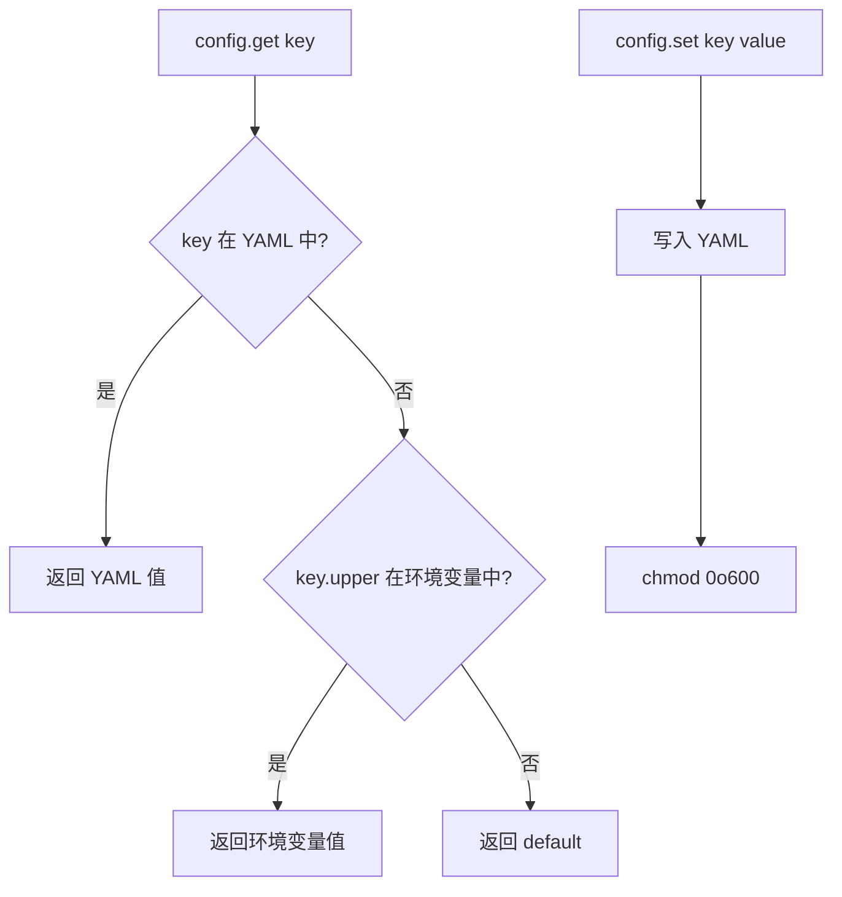
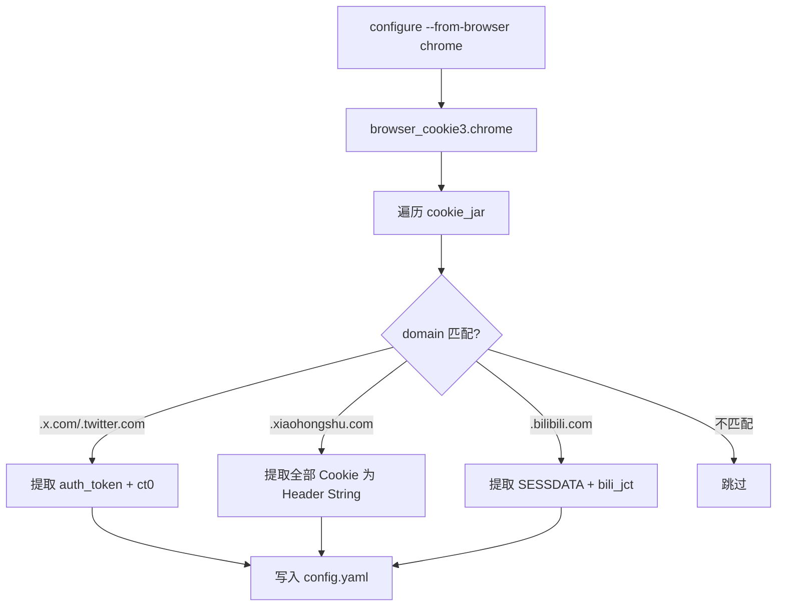

# PD-171.01 Agent Reach — 反爬代理与 Cookie 认证体系

> 文档编号：PD-171.01
> 来源：Agent Reach `agent_reach/config.py` `agent_reach/cookie_extract.py` `agent_reach/channels/reddit.py`
> GitHub：https://github.com/Panniantong/Agent-Reach.git
> 问题域：PD-171 反爬与代理管理 Anti-Crawl & Proxy Management
> 状态：可复用方案

---

## 第 1 章 问题与动机（≥ 30 行）

### 1.1 核心问题

AI Agent 需要访问 12+ 互联网平台（Reddit、Twitter/X、Bilibili、小红书、LinkedIn、Boss直聘等），但这些平台普遍部署了多层反爬机制：

1. **IP 封锁**：Reddit、Bilibili 封锁数据中心 IP，服务器部署的 Agent 直接返回 403
2. **登录墙**：Twitter/X 需要 auth_token + ct0 Cookie 才能搜索和读取时间线；小红书需要完整 Cookie 才能搜索笔记
3. **Node.js fetch 代理盲区**：bird CLI（Twitter 工具）使用 Node.js 原生 `fetch()`，该 API 不读取 `HTTP_PROXY` 环境变量，导致代理配置无效
4. **请求指纹检测**：Boss直聘检测 Python requests 库的请求特征，即使 IP 正确也会返回"访问行为异常"
5. **环境差异**：本地电脑可直接访问大部分平台，但服务器/VPS 环境需要额外的代理和认证配置

这些问题的组合使得"让 Agent 看到整个互联网"变成了一个系统性工程挑战，而非简单的 API 调用。

### 1.2 Agent Reach 的解法概述

Agent Reach 采用**分层防御 + 优雅降级**策略，将反爬问题分解为 4 个独立子系统：

1. **YAML 凭据管理**：统一的 `~/.agent-reach/config.yaml` 存储代理地址和 Cookie，支持环境变量回退，文件权限锁定 0o600（`config.py:54-59`）
2. **多浏览器 Cookie 自动提取**：通过 `browser_cookie3` 库从 Chrome/Firefox/Edge/Brave/Opera 一键提取 Twitter、小红书、Bilibili 的登录 Cookie（`cookie_extract.py:38-112`）
3. **Channel Tier 分级**：12 个平台按反爬复杂度分为 tier 0（零配置）、tier 1（需免费 Key）、tier 2（需手动配置），每个 Channel 自带 `check()` 健康检查（`base.py:24`）
4. **Exa 搜索降级**：当平台直接访问被封时，通过 Exa MCP 进行语义搜索作为免费替代方案（`exa_search.py:18-36`）

### 1.3 设计思想

| 设计原则 | 具体实现 | 理由 | 替代方案 |
|----------|----------|------|----------|
| 凭据与代码分离 | YAML 文件 + 环境变量双通道 | 避免硬编码敏感信息，支持 CI/CD 注入 | .env 文件、Vault |
| 最小权限文件保护 | config.yaml 自动 chmod 0o600 | 防止多用户服务器上凭据泄露 | 加密存储、Keychain |
| 环境自适应 | auto-detect server/local 后差异化安装 | 本地可自动提取 Cookie，服务器需手动配置 | 统一流程不区分 |
| 渐进式降级 | 代理 → Cookie → Exa 搜索 → Jina Reader | 确保任何环境下都有可用路径 | 硬性要求全部配置 |
| Channel 自诊断 | 每个 Channel 的 check() 返回状态+修复建议 | Agent 可自主修复，无需人工排查 | 集中式配置检查 |

---

## 第 2 章 源码实现分析（≥ 60 行，核心章节）

### 2.1 架构概览

Agent Reach 的反爬体系由 4 层组成，从底层凭据存储到上层降级路由：

```
┌─────────────────────────────────────────────────────────┐
│                    Agent / CLI 入口                       │
│  agent-reach install / configure / doctor                │
├─────────────────────────────────────────────────────────┤
│              Channel 层（12 个平台）                      │
│  ┌──────┐ ┌──────┐ ┌──────┐ ┌──────┐ ┌──────┐          │
│  │Reddit│ │Twitter│ │Bilibili│ │ XHS │ │ Exa │ ...      │
│  │tier=1│ │tier=1 │ │tier=1 │ │tier=2│ │tier=0│          │
│  └──┬───┘ └──┬───┘ └──┬───┘ └──┬───┘ └──┬───┘          │
│     │        │        │        │        │                │
├─────┼────────┼────────┼────────┼────────┼────────────────┤
│     ▼        ▼        ▼        ▼        ▼                │
│  ┌─────────────────────────────────────────────┐         │
│  │         Config 层 (config.py)                │         │
│  │  YAML 文件 ← 环境变量回退 ← 敏感值脱敏      │         │
│  └─────────────────────────────────────────────┘         │
│                         │                                │
│  ┌─────────────────────────────────────────────┐         │
│  │     Cookie 提取层 (cookie_extract.py)        │         │
│  │  browser_cookie3 → 5 浏览器 → 3 平台        │         │
│  └─────────────────────────────────────────────┘         │
│                         │                                │
│  ┌─────────────────────────────────────────────┐         │
│  │     Doctor 诊断层 (doctor.py)                │         │
│  │  遍历 Channel.check() → 分 Tier 报告        │         │
│  └─────────────────────────────────────────────┘         │
└─────────────────────────────────────────────────────────┘
```

### 2.2 核心实现

#### 2.2.1 YAML 凭据管理与环境变量回退



对应源码 `agent_reach/config.py:61-75`：

```python
def get(self, key: str, default: Any = None) -> Any:
    """Get a config value. Also checks environment variables (uppercase)."""
    # Config file first
    if key in self.data:
        return self.data[key]
    # Then env var (uppercase)
    env_val = os.environ.get(key.upper())
    if env_val:
        return env_val
    return default

def set(self, key: str, value: Any):
    """Set a config value and save."""
    self.data[key] = value
    self.save()
```

凭据保存时自动收紧文件权限（`config.py:54-59`）：

```python
def save(self):
    """Save config to YAML file."""
    self._ensure_dir()
    with open(self.config_path, "w") as f:
        yaml.dump(self.data, f, default_flow_style=False, allow_unicode=True)
    # Restrict permissions — config may contain credentials
    try:
        import stat
        self.config_path.chmod(stat.S_IRUSR | stat.S_IWUSR)  # 0o600
    except OSError:
        pass  # Windows or permission edge cases
```

#### 2.2.2 多浏览器 Cookie 自动提取



对应源码 `agent_reach/cookie_extract.py:16-35`（平台 Cookie 规格定义）：

```python
PLATFORM_SPECS = [
    {
        "name": "Twitter/X",
        "domains": [".x.com", ".twitter.com"],
        "cookies": ["auth_token", "ct0"],
        "config_key": "twitter",
    },
    {
        "name": "XiaoHongShu",
        "domains": [".xiaohongshu.com"],
        "cookies": None,  # None = grab all cookies as header string
        "config_key": "xhs",
    },
    {
        "name": "Bilibili",
        "domains": [".bilibili.com"],
        "cookies": ["SESSDATA", "bili_jct"],
        "config_key": "bilibili",
    },
]
```

核心提取逻辑 `cookie_extract.py:82-112`：

```python
for spec in PLATFORM_SPECS:
    platform_cookies = {}
    all_cookies_for_domain = []

    for cookie in cookie_jar:
        domain_match = any(
            cookie.domain.endswith(d) or cookie.domain == d.lstrip(".")
            for d in spec["domains"]
        )
        if not domain_match:
            continue
        all_cookies_for_domain.append(cookie)
        if spec["cookies"] is not None:
            if cookie.name in spec["cookies"]:
                platform_cookies[cookie.name] = cookie.value

    if spec["cookies"] is None:
        # Grab all as header string
        if all_cookies_for_domain:
            cookie_str = "; ".join(
                f"{c.name}={c.value}" for c in all_cookies_for_domain
            )
            results[spec["config_key"]] = {"cookie_string": cookie_str}
    else:
        if platform_cookies:
            results[spec["config_key"]] = platform_cookies
```


#### 2.2.3 Channel 自诊断与代理检测

每个 Channel 的 `check()` 方法独立检测自身的反爬状态。以 Reddit 为例（`channels/reddit.py:19-26`）：

```python
def check(self, config=None):
    proxy = (config.get("reddit_proxy") if config else None) or os.environ.get("REDDIT_PROXY")
    if proxy:
        return "ok", "代理已配置，可读取帖子。搜索走 Exa"
    return "warn", (
        "无代理。服务器 IP 可能被 Reddit 封锁。配置代理：\n"
        "  agent-reach configure proxy http://user:pass@ip:port"
    )
```

Twitter Channel 的检测更复杂，需要验证 bird CLI 安装 + Cookie 有效性（`channels/twitter.py:20-38`）：

```python
def check(self, config=None):
    bird = shutil.which("bird") or shutil.which("birdx")
    if not bird:
        return "warn", (
            "bird CLI 未安装。搜索可通过 Exa 替代。安装：\n"
            "  npm install -g @steipete/bird"
        )
    try:
        r = subprocess.run(
            [bird, "whoami"], capture_output=True, text=True, timeout=10
        )
        if r.returncode == 0:
            return "ok", "完整可用（读取、搜索推文）"
        return "warn", (
            "bird CLI 已安装但未配置 Cookie。运行：\n"
            "  agent-reach configure twitter-cookies \"auth_token=xxx; ct0=yyy\""
        )
    except Exception:
        return "warn", "bird CLI 已安装但连接失败"
```

#### 2.2.4 Node.js fetch 代理注入

Node.js 原生 `fetch()` 不读取 `HTTP_PROXY` 环境变量，这是 bird CLI 在代理环境下失败的根因。Agent Reach 在安装阶段自动安装 `undici`（`cli.py:361-371`）：

```python
# ── undici (proxy support for Node.js fetch) ──
if shutil.which("npm"):
    npm_root = subprocess.run(
        ["npm", "root", "-g"], capture_output=True, text=True, timeout=5
    ).stdout.strip()
    undici_path = os.path.join(npm_root, "undici", "index.js") if npm_root else ""
    if os.path.exists(undici_path):
        print("  ✅ undici already installed (Node.js proxy support)")
    else:
        try:
            subprocess.run(
                ["npm", "install", "-g", "undici"],
                capture_output=True, text=True, timeout=60
            )
            print("  ✅ undici installed (Node.js proxy support)")
        except Exception:
            print("  ⬜ undici install failed (optional)")
```

当 undici 仍不够时，`troubleshooting.md` 提供了 4 级递进方案：TUN 透明代理 → Cookie 刷新 → Exa 搜索替代 → global-agent 全局注入。

### 2.3 实现细节

#### 环境自动检测（server vs local）

`cli.py:510-548` 通过 5 个信号源加权判断运行环境：

| 信号源 | 权重 | 检测方式 |
|--------|------|----------|
| SSH 会话 | +2 | `SSH_CONNECTION` / `SSH_CLIENT` 环境变量 |
| Docker 容器 | +2 | `/.dockerenv` / `/run/.containerenv` 文件 |
| 无显示器 | +1 | 无 `DISPLAY` 且无 `WAYLAND_DISPLAY` |
| 云厂商 VM | +2 | `/sys/hypervisor/uuid` 含 amazon/google/microsoft 等 |
| 虚拟化检测 | +1 | `systemd-detect-virt` 返回非 "none" |

总分 ≥ 2 判定为服务器环境，自动推荐代理配置。

#### 代理配置的统一入口

`agent-reach configure proxy <url>` 同时设置 `reddit_proxy` 和 `bilibili_proxy`（`cli.py:594-614`），并立即测试 Reddit 连通性：

```python
if args.key == "proxy":
    config.set("reddit_proxy", value)
    config.set("bilibili_proxy", value)
    print(f"✅ Proxy configured for Reddit + Bilibili!")
    # Auto-test
    print("Testing Reddit access...", end=" ")
    try:
        resp = requests.get(
            "https://www.reddit.com/r/test.json?limit=1",
            headers={"User-Agent": "Mozilla/5.0 ..."},
            proxies={"http": value, "https": value},
            timeout=10,
        )
        if resp.status_code == 200:
            print("✅ Reddit works!")
        else:
            print(f"⚠️ Reddit returned {resp.status_code}")
    except Exception as e:
        print(f"❌ Failed: {e}")
```

#### Doctor 安全审计

`doctor.py:77-89` 在健康检查末尾额外检查 config.yaml 的文件权限，防止凭据泄露：

```python
config_path = Config.CONFIG_DIR / "config.yaml"
if config_path.exists():
    mode = config_path.stat().st_mode
    if mode & (stat.S_IRGRP | stat.S_IROTH):
        lines.append("⚠️  安全提示：config.yaml 权限过宽（其他用户可读）")
        lines.append("   修复：chmod 600 ~/.agent-reach/config.yaml")
```

#### 敏感值脱敏输出

`config.py:94-102` 在 `to_dict()` 中自动脱敏含 key/token/password/proxy 的字段：

```python
def to_dict(self) -> dict:
    masked = {}
    for k, v in self.data.items():
        if any(s in k.lower() for s in ("key", "token", "password", "proxy")):
            masked[k] = f"{str(v)[:8]}..." if v else None
        else:
            masked[k] = v
    return masked
```

---

## 第 3 章 迁移指南（≥ 40 行）

### 3.1 迁移清单

#### 阶段 1：凭据管理基础设施

- [ ] 创建 YAML 配置类，支持 `get(key)` 自动回退到环境变量
- [ ] 实现 `save()` 时自动 `chmod 0o600`
- [ ] 实现 `to_dict()` 敏感值脱敏
- [ ] 定义 `FEATURE_REQUIREMENTS` 映射表（feature → required keys）

#### 阶段 2：Cookie 自动提取

- [ ] 安装 `browser_cookie3` 依赖
- [ ] 定义 `PLATFORM_SPECS`：每个平台的域名模式 + 需要的 Cookie 名
- [ ] 实现 `extract_all(browser)` 从浏览器 Cookie 库批量提取
- [ ] 实现 `configure_from_browser(browser, config)` 一键写入配置

#### 阶段 3：Channel 健康检查

- [ ] 定义 Channel 基类：`can_handle(url)` + `check(config)` + `tier` 属性
- [ ] 每个平台实现独立的 `check()` 方法，返回 `(status, message)`
- [ ] 实现 Doctor 聚合器：遍历所有 Channel，按 Tier 分组输出报告

#### 阶段 4：代理与降级

- [ ] 实现环境自动检测（server vs local）
- [ ] 代理配置后自动测试连通性
- [ ] 配置 Exa MCP 作为被封平台的搜索降级

### 3.2 适配代码模板

以下是一个可直接复用的凭据管理 + Cookie 提取最小实现：

```python
"""Minimal credential manager with cookie extraction."""
import os
import stat
from pathlib import Path
from typing import Any, Optional
import yaml


class CredentialManager:
    """YAML-based credential storage with env var fallback."""

    def __init__(self, app_name: str = "my-agent"):
        self.config_dir = Path.home() / f".{app_name}"
        self.config_file = self.config_dir / "config.yaml"
        self.config_dir.mkdir(parents=True, exist_ok=True)
        self.data = self._load()

    def _load(self) -> dict:
        if self.config_file.exists():
            with open(self.config_file) as f:
                return yaml.safe_load(f) or {}
        return {}

    def get(self, key: str, default: Any = None) -> Any:
        return self.data.get(key) or os.environ.get(key.upper()) or default

    def set(self, key: str, value: Any):
        self.data[key] = value
        with open(self.config_file, "w") as f:
            yaml.dump(self.data, f, allow_unicode=True)
        try:
            self.config_file.chmod(stat.S_IRUSR | stat.S_IWUSR)
        except OSError:
            pass


def extract_cookies(browser: str, domains: list, cookie_names: Optional[list] = None):
    """Extract specific cookies from browser for given domains."""
    import browser_cookie3
    jar = getattr(browser_cookie3, browser)()
    result = {}
    for cookie in jar:
        if any(cookie.domain.endswith(d) for d in domains):
            if cookie_names is None or cookie.name in cookie_names:
                result[cookie.name] = cookie.value
    return result
```

### 3.3 适用场景

| 场景 | 适用度 | 说明 |
|------|--------|------|
| 多平台 Agent 需要访问受保护网站 | ⭐⭐⭐ | 核心场景，完全匹配 |
| 爬虫项目需要管理多站点凭据 | ⭐⭐⭐ | YAML + 环境变量双通道非常实用 |
| 需要自动检测和修复网络问题的 Agent | ⭐⭐ | Channel check() 模式可复用 |
| 单一平台 API 集成 | ⭐ | 过度设计，直接用环境变量即可 |

---

## 第 4 章 测试用例（≥ 20 行）

```python
import os
import tempfile
import pytest
from pathlib import Path
from unittest.mock import patch, MagicMock


class TestConfig:
    """Tests for credential management."""

    def setup_method(self):
        self.tmp = tempfile.mkdtemp()
        self.config_path = Path(self.tmp) / "config.yaml"

    def test_get_from_yaml(self):
        """Config.get() returns YAML value when present."""
        from agent_reach.config import Config
        config = Config(config_path=self.config_path)
        config.set("reddit_proxy", "http://proxy:8080")
        assert config.get("reddit_proxy") == "http://proxy:8080"

    def test_get_fallback_to_env(self):
        """Config.get() falls back to uppercase env var."""
        from agent_reach.config import Config
        config = Config(config_path=self.config_path)
        with patch.dict(os.environ, {"REDDIT_PROXY": "http://env-proxy:8080"}):
            assert config.get("reddit_proxy") == "http://env-proxy:8080"

    def test_file_permissions(self):
        """Config file should be 0o600 after save."""
        from agent_reach.config import Config
        config = Config(config_path=self.config_path)
        config.set("secret_key", "test123")
        import stat
        mode = self.config_path.stat().st_mode
        assert not (mode & stat.S_IRGRP), "Group should not have read access"
        assert not (mode & stat.S_IROTH), "Others should not have read access"

    def test_sensitive_value_masking(self):
        """to_dict() masks sensitive values."""
        from agent_reach.config import Config
        config = Config(config_path=self.config_path)
        config.set("twitter_auth_token", "abcdefghijklmnop")
        masked = config.to_dict()
        assert masked["twitter_auth_token"] == "abcdefgh..."

    def test_feature_requirements(self):
        """is_configured() checks all required keys."""
        from agent_reach.config import Config
        config = Config(config_path=self.config_path)
        assert not config.is_configured("twitter_bird")
        config.set("twitter_auth_token", "tok")
        config.set("twitter_ct0", "ct0val")
        assert config.is_configured("twitter_bird")


class TestCookieExtract:
    """Tests for browser cookie extraction."""

    def test_platform_specs_structure(self):
        """PLATFORM_SPECS has correct structure."""
        from agent_reach.cookie_extract import PLATFORM_SPECS
        for spec in PLATFORM_SPECS:
            assert "name" in spec
            assert "domains" in spec
            assert "config_key" in spec
            assert isinstance(spec["domains"], list)

    @patch("agent_reach.cookie_extract.browser_cookie3")
    def test_extract_twitter_cookies(self, mock_bc3):
        """extract_all() correctly extracts Twitter auth_token + ct0."""
        mock_cookie1 = MagicMock(domain=".x.com", name="auth_token", value="tok123")
        mock_cookie2 = MagicMock(domain=".x.com", name="ct0", value="ct0abc")
        mock_bc3.chrome.return_value = [mock_cookie1, mock_cookie2]
        from agent_reach.cookie_extract import extract_all
        result = extract_all("chrome")
        assert "twitter" in result
        assert result["twitter"]["auth_token"] == "tok123"
        assert result["twitter"]["ct0"] == "ct0abc"

    @patch("agent_reach.cookie_extract.browser_cookie3")
    def test_extract_xhs_all_cookies(self, mock_bc3):
        """extract_all() grabs all XHS cookies as header string."""
        mock_cookie = MagicMock(domain=".xiaohongshu.com", name="sess", value="xyz")
        mock_bc3.chrome.return_value = [mock_cookie]
        from agent_reach.cookie_extract import extract_all
        result = extract_all("chrome")
        assert "xhs" in result
        assert "cookie_string" in result["xhs"]
        assert "sess=xyz" in result["xhs"]["cookie_string"]


class TestChannelCheck:
    """Tests for channel health checks."""

    def test_reddit_warns_without_proxy(self):
        """Reddit channel returns warn when no proxy configured."""
        from agent_reach.channels.reddit import RedditChannel
        ch = RedditChannel()
        status, msg = ch.check(config=MagicMock(get=MagicMock(return_value=None)))
        assert status == "warn"
        assert "代理" in msg

    def test_reddit_ok_with_proxy(self):
        """Reddit channel returns ok when proxy is configured."""
        from agent_reach.channels.reddit import RedditChannel
        ch = RedditChannel()
        mock_config = MagicMock(get=MagicMock(return_value="http://proxy:8080"))
        status, msg = ch.check(config=mock_config)
        assert status == "ok"

    def test_exa_search_is_tier_0(self):
        """Exa search channel is tier 0 (zero config)."""
        from agent_reach.channels.exa_search import ExaSearchChannel
        ch = ExaSearchChannel()
        assert ch.tier == 0
        assert ch.can_handle("https://example.com") is False  # search-only
```


---

## 第 5 章 跨域关联

| 关联域 | 关系类型 | 说明 |
|--------|----------|------|
| PD-04 工具系统 | 依赖 | Channel 抽象基类是工具系统的一部分，每个 Channel 封装一个上游工具（bird CLI、yt-dlp、mcporter）的健康检查 |
| PD-07 质量检查 | 协同 | Doctor 健康检查机制与质量检查共享"自诊断 + 修复建议"模式，Channel.check() 返回状态码 + 可执行修复指令 |
| PD-08 搜索与检索 | 协同 | Exa 搜索作为被封平台的降级方案，直接关联搜索域；Reddit/Twitter 搜索在 IP 被封时自动降级到 Exa |
| PD-11 可观测性 | 协同 | Doctor 报告提供渠道级可观测性，watch 命令支持定时健康监控，输出问题渠道列表 |
| PD-142 凭据管理 | 强依赖 | 本域的 YAML 凭据管理、Cookie 提取、0o600 权限保护是 PD-142 凭据管理域的核心实现 |
| PD-143 环境检测 | 强依赖 | 环境自动检测（server vs local）决定了反爬策略的差异化执行路径 |

---

## 第 6 章 来源文件索引

| 文件 | 行范围 | 关键实现 |
|------|--------|----------|
| `agent_reach/config.py` | L15-L102 | Config 类：YAML 存储、环境变量回退、0o600 权限、敏感值脱敏 |
| `agent_reach/cookie_extract.py` | L16-L167 | PLATFORM_SPECS 定义、extract_all() 多浏览器提取、configure_from_browser() 一键配置 |
| `agent_reach/channels/base.py` | L18-L37 | Channel 抽象基类：name/tier/backends 属性、check() 方法签名 |
| `agent_reach/channels/reddit.py` | L8-L27 | RedditChannel：代理检测、双后端（JSON API + Exa） |
| `agent_reach/channels/twitter.py` | L9-L38 | TwitterChannel：bird CLI 检测 + Cookie 验证 + Exa 降级 |
| `agent_reach/channels/bilibili.py` | L9-L26 | BilibiliChannel：yt-dlp + 代理检测 |
| `agent_reach/channels/xiaohongshu.py` | L9-L50 | XiaoHongShuChannel：mcporter + MCP 服务检测 + 登录状态验证 |
| `agent_reach/channels/exa_search.py` | L9-L36 | ExaSearchChannel：tier 0 免费搜索降级方案 |
| `agent_reach/channels/__init__.py` | L25-L38 | ALL_CHANNELS 注册表：12 个 Channel 实例 |
| `agent_reach/cli.py` | L113-L234 | install 命令：环境检测 → 依赖安装 → Cookie 提取 → 代理建议 |
| `agent_reach/cli.py` | L361-L371 | undici 安装：解决 Node.js fetch 不走代理问题 |
| `agent_reach/cli.py` | L510-L548 | _detect_environment()：5 信号源加权环境检测 |
| `agent_reach/cli.py` | L594-L614 | configure proxy：统一代理配置 + 自动连通性测试 |
| `agent_reach/doctor.py` | L12-L91 | check_all() 聚合 + format_report() 分 Tier 报告 + 权限审计 |
| `docs/troubleshooting.md` | L1-L70 | Node.js fetch 代理 4 级递进方案 + Boss直聘指纹检测说明 |
| `docs/cookie-export.md` | L1-L43 | Cookie-Editor 导出指南 + 手动 F12 导出方法 |
| `agent_reach/guides/setup-reddit.md` | L1-L61 | Reddit ISP 代理选购指南 + 代理测试方法 |
| `agent_reach/guides/setup-twitter.md` | L1-L68 | Twitter Cookie 配置全流程（Agent 自动 + 用户手动步骤） |
| `agent_reach/guides/setup-xiaohongshu.md` | L1-L72 | 小红书 Docker MCP + 代理 + 扫码登录 |

---

## 第 7 章 横向对比维度

```json comparison_data
{
  "project": "Agent-Reach",
  "dimensions": {
    "代理架构": "YAML 统一配置 + 环境变量回退，一条命令同时设置 Reddit + Bilibili 代理",
    "Cookie管理": "browser_cookie3 从 5 种浏览器自动提取 3 平台 Cookie，支持 Cookie-Editor 手动导入",
    "降级策略": "4 级递进降级：住宅代理 → Cookie 认证 → Exa 语义搜索 → Jina Reader 通用读取",
    "环境适配": "5 信号源加权自动检测 server/local，差异化安装流程和代理建议",
    "健康检查": "Channel.check() 自诊断 + Doctor 聚合报告 + config.yaml 权限审计",
    "Node代理注入": "自动安装 undici + 文档提供 TUN/global-agent 等 4 种 Node.js fetch 代理方案"
  }
}
```

### 域元数据补充

```json domain_metadata
{
  "solution_summary": "Agent Reach 用 YAML 凭据管理 + browser_cookie3 多浏览器提取 + Channel Tier 分级健康检查 + Exa 四级降级，系统化解决 12+ 平台的 IP 封锁与登录墙问题",
  "description": "Agent 访问受保护平台时的凭据管理、环境适配与多级降级体系",
  "sub_problems": [
    "多浏览器 Cookie 批量提取与平台匹配",
    "服务器 vs 本地环境的自动检测与差异化策略",
    "凭据文件权限保护与敏感值脱敏输出",
    "请求指纹检测绕过（Boss直聘等平台）"
  ],
  "best_practices": [
    "凭据存储自动 chmod 0o600 防止多用户泄露",
    "每个 Channel 自带 check() 返回状态码+修复指令，Agent 可自主修复",
    "代理配置后立即自动测试连通性验证有效性",
    "环境检测用多信号源加权而非单一判断避免误判"
  ]
}
```

