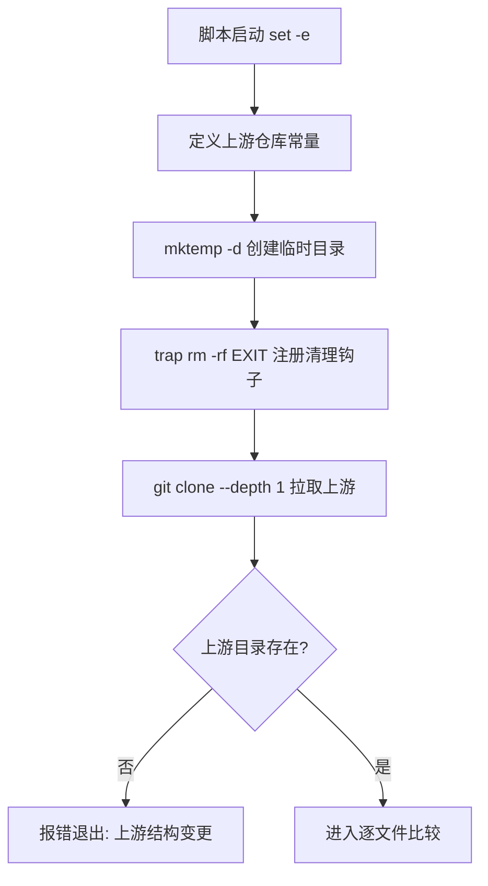
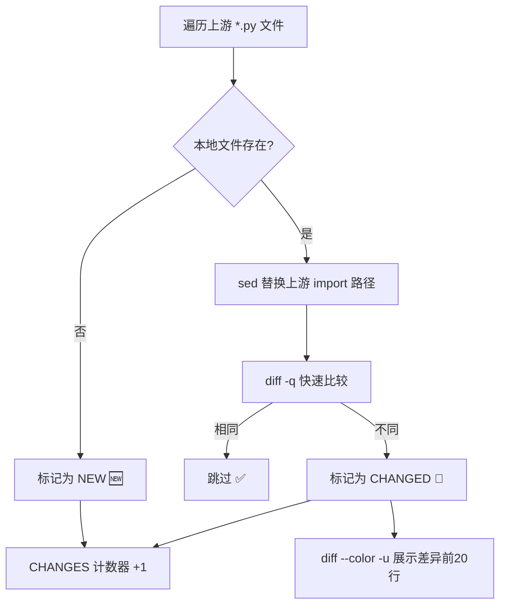

# PD-172.01 Agent Reach — 上游依赖同步与命名空间映射

> 文档编号：PD-172.01
> 来源：Agent Reach `scripts/sync-upstream.sh`
> GitHub：https://github.com/Panniantong/Agent-Reach.git
> 问题域：PD-172 上游依赖同步 Upstream Dependency Sync
> 状态：可复用方案

---

## 第 1 章 问题与动机

### 1.1 核心问题

Agent 工具项目经常 fork 或借鉴上游仓库的实现。当上游仓库持续迭代时，下游项目面临三个核心挑战：

1. **变更感知盲区** — 上游新增了文件（如新平台 fetcher），下游完全不知道
2. **命名空间冲突** — 上游的 import 路径（如 `x_reader.fetchers`）与下游不同（如 `agent_reach.channels`），直接 diff 会产生大量噪音
3. **合并风险** — 盲目 `cp` 上游文件可能覆盖下游的定制化修改，需要人工 review 环节

Agent Reach 项目的 `channels/` 目录源自上游 `runesleo/x-reader` 的 `fetchers/` 目录。每个 channel 文件（youtube.py、twitter.py 等）对应一个平台的可用性检查实现。上游可能修复 bug、新增平台、调整检查逻辑，下游需要及时同步。

### 1.2 Agent Reach 的解法概述

Agent Reach 通过一个 72 行的 Bash 脚本 `scripts/sync-upstream.sh` 实现了完整的上游同步工作流：

1. **Shallow Clone 最小化拉取** — `git clone --depth 1` 只拉取最新快照，不下载历史（`scripts/sync-upstream.sh:26-27`）
2. **临时目录 + trap 清理** — `mktemp -d` + `trap "rm -rf" EXIT` 确保无残留（`scripts/sync-upstream.sh:22-23`）
3. **sed 命名空间映射** — 比较前自动将 `x_reader.fetchers` 替换为 `agent_reach.channels`，消除 import 路径噪音（`scripts/sync-upstream.sh:51`）
4. **三态分类** — 文件分为"新增"（上游有本地无）、"变更"（内容不同）、"同步"（无差异）三类（`scripts/sync-upstream.sh:44-57`）
5. **手动合并指引** — 脚本只展示差异，不自动覆盖，输出 cp + sed 命令供人工执行（`scripts/sync-upstream.sh:67-69`）

### 1.3 设计思想

| 设计原则 | 具体实现 | 理由 | 替代方案 |
|----------|----------|------|----------|
| 最小拉取 | `--depth 1` shallow clone | 上游可能有大量历史，只需最新快照 | `git archive`（需服务端支持） |
| 零残留 | `mktemp -d` + `trap EXIT` | 脚本中断也能清理临时文件 | 固定目录 + 手动清理 |
| 噪音过滤 | `sed` 替换 import 路径后再 diff | 命名空间差异不是真正的变更 | `.gitattributes` diff filter |
| 人工兜底 | 只展示差异，不自动合并 | 下游可能有定制修改，自动覆盖危险 | `git merge` 自动合并 |
| 结构感知 | 检测上游目录是否存在 | 上游可能重构目录结构 | 硬编码路径不检查 |

---

## 第 2 章 源码实现分析

### 2.1 架构概览

Agent Reach 的上游同步是一个单脚本线性流程，核心是"拉取 → 映射 → 比较 → 报告"四步：

```
┌──────────────────┐     ┌──────────────────┐     ┌──────────────────┐
│  Shallow Clone   │────→│  Namespace Map   │────→│   File-by-File   │
│  上游最新快照     │     │  sed 路径替换     │     │   diff 比较      │
└──────────────────┘     └──────────────────┘     └──────────────────┘
                                                          │
                              ┌────────────────────────────┤
                              ↓                            ↓
                    ┌──────────────────┐     ┌──────────────────┐
                    │  🆕 NEW files    │     │  📝 CHANGED files│
                    │  上游有本地无     │     │  内容有差异       │
                    └──────────────────┘     └──────────────────┘
                              │                            │
                              └────────────┬───────────────┘
                                           ↓
                              ┌──────────────────┐
                              │  合并指引输出     │
                              │  cp + sed 命令    │
                              └──────────────────┘
```

上游仓库 `runesleo/x-reader` 的 `x_reader/fetchers/` 目录与本地 `agent_reach/channels/` 目录形成一对一映射关系。每个 `.py` 文件代表一个平台渠道的实现。

### 2.2 核心实现

#### 2.2.1 环境准备与安全清理



对应源码 `scripts/sync-upstream.sh:10-33`：
```bash
UPSTREAM_REPO="runesleo/x-reader"
UPSTREAM_BRANCH="main"
UPSTREAM_DIR="x_reader/fetchers"
LOCAL_DIR="agent_reach/channels"

# Create temp dir for upstream code
TMPDIR=$(mktemp -d)
trap "rm -rf $TMPDIR" EXIT

# Clone upstream (shallow)
git clone --depth 1 --branch "$UPSTREAM_BRANCH" \
    "https://github.com/$UPSTREAM_REPO.git" "$TMPDIR/upstream" 2>/dev/null

if [ ! -d "$TMPDIR/upstream/$UPSTREAM_DIR" ]; then
    echo "❌ Upstream directory not found: $UPSTREAM_DIR"
    echo "   x-reader may have changed their structure."
    exit 1
fi
```

关键设计点：
- `set -e` 确保任何命令失败立即退出，不会在错误状态下继续执行
- `2>/dev/null` 抑制 git clone 的进度输出，保持输出干净
- 目录存在性检查是防御性设计 — 上游可能重命名目录

#### 2.2.2 命名空间映射与逐文件比较



对应源码 `scripts/sync-upstream.sh:39-58`：
```bash
CHANGES=0
for upstream_file in "$TMPDIR/upstream/$UPSTREAM_DIR"/*.py; do
    filename=$(basename "$upstream_file")
    local_file="$LOCAL_DIR/$filename"
    
    if [ ! -f "$local_file" ]; then
        echo "🆕 NEW: $filename (exists in upstream but not locally)"
        CHANGES=$((CHANGES + 1))
        continue
    fi
    
    # Compare (ignoring import path differences)
    if ! diff -q \
        <(sed 's/x_reader\.fetchers/agent_reach.channels/g' "$upstream_file") \
        "$local_file" > /dev/null 2>&1; then
        echo "📝 CHANGED: $filename"
        diff --color -u \
            <(sed 's/x_reader\.fetchers/agent_reach.channels/g' "$upstream_file") \
            "$local_file" | head -20
        echo "   ..."
        echo ""
        CHANGES=$((CHANGES + 1))
    fi
done
```

核心技巧：
- **Process Substitution** `<(sed ...)` — 不修改原文件，在内存中完成命名空间替换后直接传给 diff
- **两阶段 diff** — 先 `diff -q`（quiet）快速判断是否有差异，有差异再 `diff -u`（unified）展示详情
- `head -20` 截断长差异，避免输出爆炸

### 2.3 实现细节

#### 渠道文件的一对一映射关系

上游 `x_reader/fetchers/` 与本地 `agent_reach/channels/` 的文件结构完全对应：

| 上游文件 | 本地文件 | 平台 |
|----------|----------|------|
| `x_reader/fetchers/youtube.py` | `agent_reach/channels/youtube.py` | YouTube |
| `x_reader/fetchers/twitter.py` | `agent_reach/channels/twitter.py` | Twitter/X |
| `x_reader/fetchers/bilibili.py` | `agent_reach/channels/bilibili.py` | B站 |
| `x_reader/fetchers/github.py` | `agent_reach/channels/github.py` | GitHub |
| ... | ... | ... |

每个 channel 文件遵循统一的 `Channel` 基类接口（`agent_reach/channels/base.py:18-36`）：

```python
class Channel(ABC):
    name: str = ""
    description: str = ""
    backends: List[str] = []
    tier: int = 0

    @abstractmethod
    def can_handle(self, url: str) -> bool: ...

    def check(self, config=None) -> Tuple[str, str]:
        return "ok", f"{'、'.join(self.backends) if self.backends else '内置'}"
```

这种统一接口使得上游新增的 fetcher 文件可以直接映射为本地 channel 文件，只需替换 import 路径。

#### 合并指引的输出格式

当检测到变更时，脚本输出可直接执行的 shell 命令（`scripts/sync-upstream.sh:67-71`）：

```bash
echo "To merge a specific file:"
echo "  cp $TMPDIR/upstream/$UPSTREAM_DIR/FILENAME.py $LOCAL_DIR/FILENAME.py"
echo "  sed -i 's/x_reader\\.fetchers/agent_reach.channels/g' $LOCAL_DIR/FILENAME.py"
echo ""
echo "Then review changes, run tests, and commit."
```

注意 `sed -i` 中的双反斜杠 `\\.` — 在 echo 的双引号中需要转义，最终传给 sed 的是 `\.`（匹配字面量点号）。

#### 上游工具移除的处理

从 `CHANGELOG.md:13-16` 可以看到，当上游工具失效时（如 Instagram 的 instaloader 被封杀），Agent Reach 会直接移除对应 channel，并在 CHANGELOG 中记录原因和恢复条件。sync-upstream.sh 的单向比较（只检查上游有的文件）天然支持这种场景 — 本地已删除的 channel 不会被重新引入。


---

## 第 3 章 迁移指南

### 3.1 迁移清单

将 Agent Reach 的上游同步方案迁移到自己的项目，需要以下步骤：

**阶段 1：基础同步脚本**
- [ ] 确定上游仓库地址和目标目录
- [ ] 确定本地对应目录
- [ ] 确定命名空间映射规则（import 路径替换）
- [ ] 创建 `scripts/sync-upstream.sh` 脚本

**阶段 2：增强功能**
- [ ] 添加多目录支持（如果上游有多个需要同步的目录）
- [ ] 添加版本锁定（指定 tag/commit 而非 branch）
- [ ] 添加自动化 CI 检查（定期运行同步脚本，有变更时创建 Issue）
- [ ] 添加反向检测（本地有但上游没有的文件 — 可能是下游独有扩展）

**阶段 3：高级集成**
- [ ] 集成到 CI/CD pipeline（GitHub Actions 定时任务）
- [ ] 自动创建 PR 而非仅输出命令
- [ ] 添加语义化版本比较（不只是文件 diff，还比较 API 签名变化）

### 3.2 适配代码模板

以下是一个通用化的上游同步脚本模板，可直接复用：

```bash
#!/bin/bash
# sync-upstream.sh — Generic upstream sync tool
# Usage: ./scripts/sync-upstream.sh [--auto-merge] [--tag v1.2.3]
set -e

# ═══════════════════════════════════════════
# 配置区 — 修改这里适配你的项目
# ═══════════════════════════════════════════
UPSTREAM_REPO="owner/repo"           # 上游仓库
UPSTREAM_BRANCH="main"               # 上游分支
UPSTREAM_DIR="src/modules"           # 上游源目录
LOCAL_DIR="my_project/modules"       # 本地目标目录

# 命名空间映射（可多条）
declare -a NAMESPACE_MAPS=(
    "s/upstream_pkg\.modules/my_project.modules/g"
    "s/from upstream_pkg/from my_project/g"
)

# ═══════════════════════════════════════════
# 执行区 — 通常不需要修改
# ═══════════════════════════════════════════
AUTO_MERGE=false
TAG=""
while [[ $# -gt 0 ]]; do
    case $1 in
        --auto-merge) AUTO_MERGE=true; shift ;;
        --tag) TAG="$2"; shift 2 ;;
        *) echo "Unknown option: $1"; exit 1 ;;
    esac
done

TMPDIR=$(mktemp -d)
trap "rm -rf $TMPDIR" EXIT

# Clone
CLONE_ARGS="--depth 1"
if [ -n "$TAG" ]; then
    CLONE_ARGS="$CLONE_ARGS --branch $TAG"
else
    CLONE_ARGS="$CLONE_ARGS --branch $UPSTREAM_BRANCH"
fi
git clone $CLONE_ARGS "https://github.com/$UPSTREAM_REPO.git" "$TMPDIR/upstream" 2>/dev/null

if [ ! -d "$TMPDIR/upstream/$UPSTREAM_DIR" ]; then
    echo "❌ Upstream directory not found: $UPSTREAM_DIR"
    exit 1
fi

# Apply namespace mappings to a file (stdout)
apply_mappings() {
    local file="$1"
    local content
    content=$(cat "$file")
    for mapping in "${NAMESPACE_MAPS[@]}"; do
        content=$(echo "$content" | sed "$mapping")
    done
    echo "$content"
}

# Compare
CHANGES=0
NEW_FILES=()
CHANGED_FILES=()

for upstream_file in "$TMPDIR/upstream/$UPSTREAM_DIR"/*.py; do
    [ -f "$upstream_file" ] || continue
    filename=$(basename "$upstream_file")
    local_file="$LOCAL_DIR/$filename"
    
    if [ ! -f "$local_file" ]; then
        echo "🆕 NEW: $filename"
        NEW_FILES+=("$filename")
        CHANGES=$((CHANGES + 1))
        continue
    fi
    
    if ! diff -q <(apply_mappings "$upstream_file") "$local_file" > /dev/null 2>&1; then
        echo "📝 CHANGED: $filename"
        diff --color -u <(apply_mappings "$upstream_file") "$local_file" | head -30
        echo ""
        CHANGED_FILES+=("$filename")
        CHANGES=$((CHANGES + 1))
    fi
done

# Report
if [ $CHANGES -eq 0 ]; then
    echo "✅ All files are up to date with upstream!"
    exit 0
fi

echo ""
echo "━━━━━━━━━━━━━━━━━━━━━━━━━━━━━━━━━━━━━━━━"
echo "$CHANGES file(s) have upstream changes."

if [ "$AUTO_MERGE" = true ]; then
    for f in "${NEW_FILES[@]}" "${CHANGED_FILES[@]}"; do
        cp "$TMPDIR/upstream/$UPSTREAM_DIR/$f" "$LOCAL_DIR/$f"
        for mapping in "${NAMESPACE_MAPS[@]}"; do
            sed -i '' "$mapping" "$LOCAL_DIR/$f" 2>/dev/null || \
            sed -i "$mapping" "$LOCAL_DIR/$f"
        done
        echo "  ✅ Merged: $f"
    done
    echo "Run tests and review changes before committing."
else
    echo "To merge, re-run with --auto-merge or copy manually."
fi
```

### 3.3 适用场景

| 场景 | 适用度 | 说明 |
|------|--------|------|
| Fork 项目保持同步 | ⭐⭐⭐ | 最典型场景，文件结构一致，只需命名空间映射 |
| 多仓库 monorepo 同步 | ⭐⭐⭐ | 从共享库同步到各子项目 |
| 上游 SDK 适配层 | ⭐⭐ | 上游 API 变化时需要更复杂的适配逻辑 |
| 跨语言项目同步 | ⭐ | 需要额外的语言转换层，sed 替换不够 |
| 大规模依赖管理 | ⭐ | 文件数量多时逐文件 diff 效率低，应考虑 git subtree |

---

## 第 4 章 测试用例

```python
"""
Tests for upstream sync functionality.
Based on Agent Reach's sync-upstream.sh design.
"""
import os
import shutil
import subprocess
import tempfile
import pytest


class TestUpstreamSync:
    """Test the upstream sync script behavior."""

    @pytest.fixture
    def sync_env(self, tmp_path):
        """Create a mock upstream and local directory structure."""
        upstream = tmp_path / "upstream" / "x_reader" / "fetchers"
        upstream.mkdir(parents=True)
        local = tmp_path / "local" / "agent_reach" / "channels"
        local.mkdir(parents=True)
        return upstream, local

    def test_detect_new_file(self, sync_env):
        """New file in upstream should be detected."""
        upstream, local = sync_env
        # Upstream has a file that local doesn't
        (upstream / "instagram.py").write_text(
            "from x_reader.fetchers.base import Channel\n"
            "class InstagramChannel(Channel): pass\n"
        )
        # Local has no instagram.py
        result = self._run_compare(upstream, local)
        assert "instagram.py" in result["new"]

    def test_detect_changed_file(self, sync_env):
        """Changed file should be detected after namespace mapping."""
        upstream, local = sync_env
        (upstream / "youtube.py").write_text(
            "from x_reader.fetchers.base import Channel\n"
            "class YouTubeChannel(Channel):\n"
            "    name = 'youtube'\n"
            "    version = 2  # new field\n"
        )
        (local / "youtube.py").write_text(
            "from agent_reach.channels.base import Channel\n"
            "class YouTubeChannel(Channel):\n"
            "    name = 'youtube'\n"
        )
        result = self._run_compare(upstream, local)
        assert "youtube.py" in result["changed"]

    def test_identical_after_mapping(self, sync_env):
        """Files identical after namespace mapping should not be flagged."""
        upstream, local = sync_env
        (upstream / "rss.py").write_text(
            "from x_reader.fetchers.base import Channel\n"
            "class RSSChannel(Channel):\n"
            "    name = 'rss'\n"
        )
        (local / "rss.py").write_text(
            "from agent_reach.channels.base import Channel\n"
            "class RSSChannel(Channel):\n"
            "    name = 'rss'\n"
        )
        result = self._run_compare(upstream, local)
        assert "rss.py" not in result["new"]
        assert "rss.py" not in result["changed"]

    def test_namespace_mapping_multiple_occurrences(self, sync_env):
        """Multiple import path occurrences should all be mapped."""
        upstream, local = sync_env
        (upstream / "web.py").write_text(
            "from x_reader.fetchers.base import Channel\n"
            "from x_reader.fetchers.utils import helper\n"
            "# x_reader.fetchers reference\n"
        )
        (local / "web.py").write_text(
            "from agent_reach.channels.base import Channel\n"
            "from agent_reach.channels.utils import helper\n"
            "# agent_reach.channels reference\n"
        )
        result = self._run_compare(upstream, local)
        assert "web.py" not in result["changed"]

    def test_cleanup_on_error(self):
        """Temp directory should be cleaned up even on error."""
        with tempfile.TemporaryDirectory() as tmpdir:
            script = os.path.join(tmpdir, "test_cleanup.sh")
            with open(script, "w") as f:
                f.write("#!/bin/bash\nset -e\n")
                f.write("TMPDIR=$(mktemp -d)\n")
                f.write('trap "rm -rf $TMPDIR" EXIT\n')
                f.write("echo $TMPDIR\n")
                f.write("exit 1\n")
            os.chmod(script, 0o755)
            result = subprocess.run(
                ["bash", script], capture_output=True, text=True
            )
            created_dir = result.stdout.strip()
            # Directory should be cleaned up despite exit 1
            assert not os.path.exists(created_dir)

    @staticmethod
    def _run_compare(upstream_dir, local_dir):
        """Simulate the sync-upstream.sh comparison logic in Python."""
        namespace_map = ("x_reader.fetchers", "agent_reach.channels")
        new_files = []
        changed_files = []

        for f in upstream_dir.glob("*.py"):
            local_f = local_dir / f.name
            if not local_f.exists():
                new_files.append(f.name)
                continue
            upstream_content = f.read_text().replace(
                namespace_map[0], namespace_map[1]
            )
            local_content = local_f.read_text()
            if upstream_content != local_content:
                changed_files.append(f.name)

        return {"new": new_files, "changed": changed_files}
```


---

## 第 5 章 跨域关联

| 关联域 | 关系类型 | 说明 |
|--------|----------|------|
| PD-04 工具系统 | 协同 | Channel 基类定义了统一的工具接口（`can_handle` + `check`），上游同步的文件必须符合此接口契约 |
| PD-07 质量检查 | 协同 | `agent-reach doctor` 通过遍历所有 channel 的 `check()` 方法验证上游工具可用性，同步后需重新运行 doctor |
| PD-141 Channel 抽象基类 | 依赖 | 同步的文件必须继承 `Channel` 基类（`agent_reach/channels/base.py:18`），基类接口变更会影响同步兼容性 |
| PD-143 环境检测 | 协同 | `agent-reach install` 自动检测环境并安装上游工具依赖，同步新 channel 后可能需要安装新的 backend 工具 |
| PD-164 CI/CD | 扩展 | 同步脚本可集成到 CI pipeline 中定期运行，自动检测上游变更并创建 Issue/PR |

---

## 第 6 章 来源文件索引

| 文件 | 行范围 | 关键实现 |
|------|--------|----------|
| `scripts/sync-upstream.sh` | L1-L72 | 完整的上游同步脚本，核心实现 |
| `scripts/sync-upstream.sh` | L10-L15 | 上游仓库配置常量定义 |
| `scripts/sync-upstream.sh` | L22-L23 | 临时目录创建与 trap 清理 |
| `scripts/sync-upstream.sh` | L26-L27 | Shallow clone 上游仓库 |
| `scripts/sync-upstream.sh` | L29-L33 | 上游目录存在性检查 |
| `scripts/sync-upstream.sh` | L40-L58 | 逐文件 diff 比较（含 sed 命名空间映射） |
| `scripts/sync-upstream.sh` | L51 | Process substitution + sed 命名空间替换核心行 |
| `scripts/sync-upstream.sh` | L67-L71 | 合并指引输出 |
| `agent_reach/channels/base.py` | L18-L36 | Channel 抽象基类定义 |
| `agent_reach/channels/__init__.py` | L25-L38 | Channel 注册表（ALL_CHANNELS 列表） |
| `agent_reach/doctor.py` | L12-L24 | Doctor 健康检查（遍历所有 channel） |
| `CHANGELOG.md` | L13-L16 | 上游工具失效时的 channel 移除记录 |

---

## 第 7 章 横向对比维度

```json comparison_data
{
  "project": "Agent Reach",
  "dimensions": {
    "同步机制": "Bash 脚本 shallow clone + 逐文件 diff，单向检测",
    "命名空间处理": "sed process substitution 实时替换 import 路径后比较",
    "变更分类": "三态分类：NEW / CHANGED / UP-TO-DATE",
    "合并策略": "手动 review — 只输出 cp+sed 命令，不自动覆盖",
    "结构感知": "检测上游目录是否存在，防御上游重构"
  }
}
```

### 域元数据补充

```json domain_metadata
{
  "solution_summary": "Agent Reach 用 72 行 Bash 脚本实现 shallow clone + sed 命名空间映射 + 逐文件 diff 的上游渠道同步",
  "description": "下游项目与上游工具仓库的代码级变更追踪与命名空间适配",
  "sub_problems": [
    "上游目录结构变更检测与防御",
    "上游工具失效后的渠道移除决策"
  ],
  "best_practices": [
    "process substitution 避免修改原文件实现内存中命名空间映射",
    "trap EXIT 确保临时目录在任何退出路径下都被清理",
    "两阶段 diff（-q 快速判断 + -u 详细展示）减少不必要输出"
  ]
}
```

