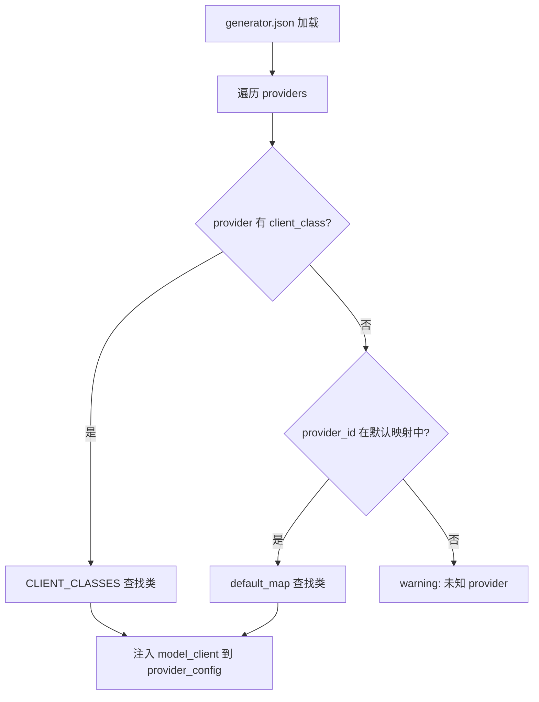
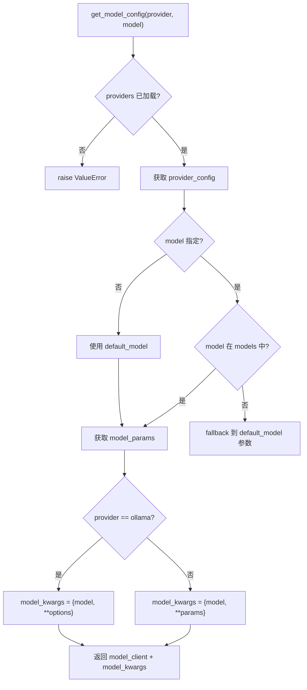
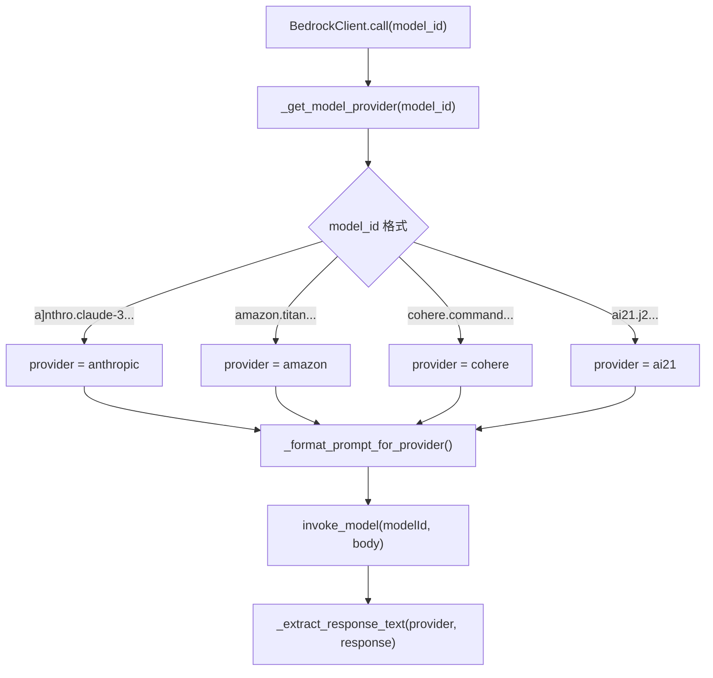
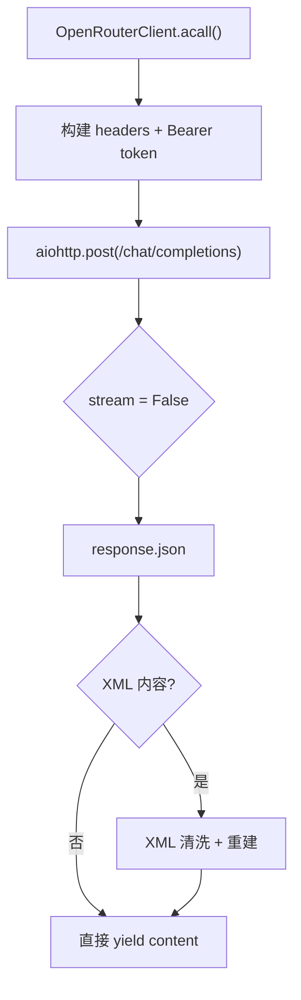

# PD-173.01 DeepWiki — JSON 配置驱动的多 LLM Provider 适配层

> 文档编号：PD-173.01
> 来源：DeepWiki `api/config.py` `api/openrouter_client.py` `api/bedrock_client.py`
> GitHub：https://github.com/AsyncFuncAI/deepwiki-open.git
> 问题域：PD-173 多 LLM Provider 适配 Multi-LLM Provider Adapter
> 状态：可复用方案

---

## 第 1 章 问题与动机

### 1.1 核心问题

当一个 AI 应用需要同时支持多家 LLM 提供商（Google、OpenAI、OpenRouter、Ollama、AWS Bedrock、Azure、Dashscope）时，面临三个核心挑战：

1. **API 异构性**：每家 provider 的认证方式、请求格式、响应结构、流式协议各不相同。OpenAI 用 `chat.completions.create`，Bedrock 用 `invoke_model` + JSON body，OpenRouter 用 HTTP POST + SSE，Google 用 `genai.GenerativeModel`。
2. **配置爆炸**：每个 provider 下有多个模型，每个模型有不同的参数（temperature、top_p、num_ctx 等），硬编码会导致代码膨胀且难以维护。
3. **运行时切换**：用户需要在前端选择 provider 和 model，系统需要在运行时动态实例化对应的 client 并传入正确参数。

### 1.2 DeepWiki 的解法概述

DeepWiki 采用 **AdalFlow ModelClient 接口 + JSON 配置文件 + 字符串到类的动态映射** 三层架构：

1. **统一接口层**：所有 provider client 继承 `adalflow.core.model_client.ModelClient`，实现 `call()`、`acall()`、`convert_inputs_to_api_kwargs()` 三个核心方法（`api/config.py:58-67`）
2. **JSON 配置驱动**：`generator.json` 定义 7 个 provider 的模型列表和默认参数，`embedder.json` 定义 4 种 embedder 配置，运行时通过 `load_json_config()` 加载（`api/config.py:100-121`）
3. **动态类映射**：`CLIENT_CLASSES` 字典将字符串类名映射到 Python 类，`load_generator_config()` 在加载时自动注入 `model_client` 实例（`api/config.py:58-67`、`api/config.py:124-148`）
4. **环境变量占位符**：配置文件中支持 `${ENV_VAR}` 语法，`replace_env_placeholders()` 递归替换（`api/config.py:69-97`）
5. **Provider 特化处理**：每个 client 内部处理各自 provider 的认证、请求格式化、响应解析差异

### 1.3 设计思想

| 设计原则 | 具体实现 | 理由 | 替代方案 |
|----------|----------|------|----------|
| 接口统一 | 所有 client 继承 `ModelClient`，实现 `call/acall/convert_inputs_to_api_kwargs` | 上层 RAG/Generator 无需感知 provider 差异 | 每个 provider 独立 API，调用方 if-else |
| 配置外置 | `generator.json` / `embedder.json` 管理模型参数 | 新增模型只改 JSON，不改代码 | 硬编码在 Python 中 |
| 字符串→类映射 | `CLIENT_CLASSES` dict + `client_class` 字段 | 配置文件可指定任意已注册 client | `importlib.import_module` 动态导入 |
| 环境变量注入 | `${ENV_VAR}` 占位符递归替换 | 敏感信息不入配置文件 | `.env` 文件 + dotenv |
| 双路径 fallback | `client_class` 优先，provider_id 默认映射兜底 | 兼容旧配置和自定义 client | 强制要求 client_class |

---

## 第 2 章 源码实现分析

### 2.1 架构概览

DeepWiki 的多 Provider 适配架构分为四层：

```
┌─────────────────────────────────────────────────────────────┐
│                    WebSocket / REST API                       │
│         websocket_wiki.py / simple_chat.py                   │
│    request.provider + request.model → 路由到对应 client       │
├─────────────────────────────────────────────────────────────┤
│                   Config Layer (config.py)                    │
│  ┌──────────────┐  ┌──────────────┐  ┌──────────────────┐   │
│  │generator.json│  │embedder.json │  │ CLIENT_CLASSES{}  │   │
│  │ 7 providers  │  │ 4 embedders  │  │ str → class map   │   │
│  └──────┬───────┘  └──────┬───────┘  └────────┬─────────┘   │
│         └────────┬────────┘                    │             │
│          load_*_config() + get_model_config()  │             │
│                  ↓ 注入 model_client 类 ←──────┘             │
├─────────────────────────────────────────────────────────────┤
│              ModelClient Interface (AdalFlow)                 │
│  call() | acall() | convert_inputs_to_api_kwargs()           │
├──────┬──────┬──────┬──────┬──────┬──────┬──────┬────────────┤
│Google│OpenAI│Router│Ollama│Bedrck│Azure │Dash  │ 7 Clients  │
│GenAI │Client│Client│Client│Client│Client│scope │            │
└──────┴──────┴──────┴──────┴──────┴──────┴──────┴────────────┘
```

### 2.2 核心实现

#### 2.2.1 CLIENT_CLASSES 注册表与动态映射



对应源码 `api/config.py:58-67`（注册表定义）和 `api/config.py:124-148`（动态注入）：

```python
# api/config.py:58-67 — 字符串到类的映射注册表
CLIENT_CLASSES = {
    "GoogleGenAIClient": GoogleGenAIClient,
    "GoogleEmbedderClient": GoogleEmbedderClient,
    "OpenAIClient": OpenAIClient,
    "OpenRouterClient": OpenRouterClient,
    "OllamaClient": OllamaClient,
    "BedrockClient": BedrockClient,
    "AzureAIClient": AzureAIClient,
    "DashscopeClient": DashscopeClient
}

# api/config.py:124-148 — 加载时动态注入 model_client
def load_generator_config():
    generator_config = load_json_config("generator.json")
    if "providers" in generator_config:
        for provider_id, provider_config in generator_config["providers"].items():
            if provider_config.get("client_class") in CLIENT_CLASSES:
                provider_config["model_client"] = CLIENT_CLASSES[provider_config["client_class"]]
            elif provider_id in ["google", "openai", "openrouter", "ollama", "bedrock", "azure", "dashscope"]:
                default_map = {
                    "google": GoogleGenAIClient,
                    "openai": OpenAIClient,
                    "openrouter": OpenRouterClient,
                    "ollama": OllamaClient,
                    "bedrock": BedrockClient,
                    "azure": AzureAIClient,
                    "dashscope": DashscopeClient
                }
                provider_config["model_client"] = default_map[provider_id]
    return generator_config
```

#### 2.2.2 get_model_config — 运行时配置解析



对应源码 `api/config.py:359-412`：

```python
# api/config.py:359-412 — 运行时获取 provider+model 配置
def get_model_config(provider="google", model=None):
    if "providers" not in configs:
        raise ValueError("Provider configuration not loaded")
    provider_config = configs["providers"].get(provider)
    if not provider_config:
        raise ValueError(f"Configuration for provider '{provider}' not found")
    model_client = provider_config.get("model_client")
    if not model:
        model = provider_config.get("default_model")
    model_params = {}
    if model in provider_config.get("models", {}):
        model_params = provider_config["models"][model]
    else:
        default_model = provider_config.get("default_model")
        model_params = provider_config["models"][default_model]
    result = {"model_client": model_client}
    if provider == "ollama":
        if "options" in model_params:
            result["model_kwargs"] = {"model": model, **model_params["options"]}
        else:
            result["model_kwargs"] = {"model": model}
    else:
        result["model_kwargs"] = {"model": model, **model_params}
    return result
```


#### 2.2.3 BedrockClient — 多子 Provider 格式适配

BedrockClient 是最复杂的 client，因为 AWS Bedrock 本身是一个聚合平台，内部包含 Anthropic、Amazon、Cohere、AI21 四种子 provider，每种的请求/响应格式不同。



对应源码 `api/bedrock_client.py:163-181`（provider 提取）和 `api/bedrock_client.py:183-248`（格式适配）：

```python
# api/bedrock_client.py:163-181 — 从 model_id 提取子 provider
def _get_model_provider(self, model_id: str) -> str:
    seg = model_id.split(".")
    if len(seg) >= 3:
        return seg[1]  # regional format: global.anthropic.claude-...
    elif len(seg) == 2:
        return seg[0]  # non-regional: anthropic.claude-...
    else:
        return "amazon"  # fallback

# api/bedrock_client.py:183-248 — 按子 provider 格式化请求
def _format_prompt_for_provider(self, provider, prompt, messages=None):
    if provider == "anthropic":
        return {
            "anthropic_version": "bedrock-2023-05-31",
            "messages": [{"role": "user", "content": [{"type": "text", "text": prompt}]}],
            "max_tokens": 4096
        }
    elif provider == "amazon":
        return {"inputText": prompt, "textGenerationConfig": {"maxTokenCount": 4096, ...}}
    elif provider == "cohere":
        return {"prompt": prompt, "max_tokens": 4096, ...}
    elif provider == "ai21":
        return {"prompt": prompt, "maxTokens": 4096, ...}
```

#### 2.2.4 OpenRouterClient — HTTP 直连 + SSE 流式

OpenRouter 没有官方 SDK，DeepWiki 用 `aiohttp` 直接 POST 到 `https://openrouter.ai/api/v1/chat/completions`，手动解析 SSE 流。



对应源码 `api/openrouter_client.py:112-348`，关键在于 `acall()` 方法中的 async generator 模式：

```python
# api/openrouter_client.py:129-139 — 手动构建 HTTP 请求
headers = {
    "Authorization": f"Bearer {self.async_client['api_key']}",
    "Content-Type": "application/json",
    "HTTP-Referer": "https://github.com/AsyncFuncAI/deepwiki-open",
    "X-Title": "DeepWiki"
}
api_kwargs["stream"] = False  # OpenRouter 强制非流式

async with aiohttp.ClientSession() as session:
    async with session.post(
        f"{self.async_client['base_url']}/chat/completions",
        headers=headers, json=api_kwargs, timeout=60
    ) as response:
        data = await response.json()
        # 返回 async generator 包装
        async def content_generator():
            yield data["choices"][0]["message"]["content"]
        return content_generator()
```

### 2.3 实现细节

**环境变量占位符系统**（`api/config.py:69-97`）：配置文件中可以写 `"api_key": "${OPENAI_API_KEY}"`，`replace_env_placeholders()` 在 `load_json_config()` 时递归替换所有字符串值中的 `${VAR}` 为环境变量值。未找到的变量保留原始占位符并打 warning。

**Embedder 多路选择**（`api/config.py:163-252`）：通过 `DEEPWIKI_EMBEDDER_TYPE` 环境变量选择 embedder 类型（openai/ollama/google/bedrock），`get_embedder_config()` 返回对应配置，`is_ollama_embedder()` / `is_google_embedder()` / `is_bedrock_embedder()` 提供类型检查。

**自定义模型支持**：每个 provider 配置中 `"supportsCustomModel": true` 标记支持自定义模型。`get_model_config()` 中当指定 model 不在 `models` 字典中时，fallback 到 `default_model` 的参数，允许用户传入任意模型名。

**Bedrock IAM Role 认证**（`api/bedrock_client.py:113-152`）：支持 STS AssumeRole，先用基础凭证获取临时凭证再创建 Bedrock client，适配企业级跨账户访问场景。

**DashScope workspace 注入**（`api/dashscope_client.py:326-334`）：通过 `extra_headers['X-DashScope-WorkSpace']` 注入 workspace ID，适配阿里云多工作空间隔离。

---

## 第 3 章 迁移指南

### 3.1 迁移清单

**阶段 1：基础框架（必须）**

- [ ] 定义 `ModelClient` 抽象基类，包含 `call()`、`acall()`、`convert_inputs_to_api_kwargs()` 三个抽象方法
- [ ] 创建 `generator.json` 配置文件，定义 provider → models → params 三级结构
- [ ] 实现 `CLIENT_CLASSES` 注册表和 `load_generator_config()` 动态注入
- [ ] 实现 `get_model_config(provider, model)` 运行时配置解析

**阶段 2：Provider 实现（按需）**

- [ ] 实现 OpenAI-compatible client（覆盖 OpenAI、Azure、Dashscope 等 OpenAI 兼容 API）
- [ ] 实现 HTTP 直连 client（覆盖 OpenRouter 等无 SDK 的 provider）
- [ ] 实现 Bedrock client（覆盖 AWS 聚合平台的多子 provider 格式适配）
- [ ] 实现本地推理 client（覆盖 Ollama 等本地部署方案）

**阶段 3：增强功能（可选）**

- [ ] 环境变量占位符 `${VAR}` 替换
- [ ] Embedder 多路选择
- [ ] 自定义模型 fallback 机制

### 3.2 适配代码模板

以下是一个可直接运行的最小化多 Provider 适配框架：

```python
"""multi_provider.py — 最小化多 LLM Provider 适配框架"""
import json
import os
from abc import ABC, abstractmethod
from typing import Dict, Any, Optional
from pathlib import Path
import re


class ModelClient(ABC):
    """所有 Provider Client 的抽象基类"""

    @abstractmethod
    def call(self, api_kwargs: Dict, model_type: str = "llm") -> Any:
        """同步调用"""
        ...

    @abstractmethod
    async def acall(self, api_kwargs: Dict, model_type: str = "llm") -> Any:
        """异步调用"""
        ...

    @abstractmethod
    def convert_inputs_to_api_kwargs(
        self, input: Any, model_kwargs: Dict, model_type: str
    ) -> Dict:
        """将统一输入转换为 provider 特定的 API 参数"""
        ...


class OpenAICompatibleClient(ModelClient):
    """OpenAI 兼容 API 的通用 Client（覆盖 OpenAI/Azure/Dashscope）"""

    def __init__(self, api_key: str = None, base_url: str = None,
                 env_key_name: str = "OPENAI_API_KEY"):
        from openai import OpenAI, AsyncOpenAI
        self.api_key = api_key or os.getenv(env_key_name)
        self.base_url = base_url or "https://api.openai.com/v1"
        self.sync_client = OpenAI(api_key=self.api_key, base_url=self.base_url)
        self.async_client = None

    def convert_inputs_to_api_kwargs(self, input, model_kwargs, model_type="llm"):
        messages = [{"role": "user", "content": input}] if isinstance(input, str) else input
        return {"messages": messages, **model_kwargs}

    def call(self, api_kwargs, model_type="llm"):
        return self.sync_client.chat.completions.create(**api_kwargs)

    async def acall(self, api_kwargs, model_type="llm"):
        if not self.async_client:
            from openai import AsyncOpenAI
            self.async_client = AsyncOpenAI(api_key=self.api_key, base_url=self.base_url)
        return await self.async_client.chat.completions.create(**api_kwargs)


# --- 注册表 + 配置加载 ---

CLIENT_CLASSES: Dict[str, type] = {
    "OpenAICompatibleClient": OpenAICompatibleClient,
    # 注册更多 client...
}


def replace_env_placeholders(config):
    """递归替换配置中的 ${ENV_VAR} 占位符"""
    pattern = re.compile(r"\$\{([A-Z0-9_]+)\}")
    if isinstance(config, dict):
        return {k: replace_env_placeholders(v) for k, v in config.items()}
    elif isinstance(config, list):
        return [replace_env_placeholders(item) for item in config]
    elif isinstance(config, str):
        return pattern.sub(lambda m: os.environ.get(m.group(1), m.group(0)), config)
    return config


def load_config(config_path: str) -> Dict:
    """加载 JSON 配置并替换环境变量"""
    with open(config_path, "r") as f:
        config = json.load(f)
    return replace_env_placeholders(config)


def get_model_config(configs: Dict, provider: str, model: str = None) -> Dict:
    """运行时获取 provider + model 配置"""
    provider_config = configs["providers"][provider]
    client_class_name = provider_config.get("client_class", "OpenAICompatibleClient")
    model_client = CLIENT_CLASSES[client_class_name]

    if not model:
        model = provider_config["default_model"]

    model_params = provider_config.get("models", {}).get(
        model, provider_config["models"][provider_config["default_model"]]
    )

    return {
        "model_client": model_client,
        "model_kwargs": {"model": model, **model_params},
    }


# --- 使用示例 ---
if __name__ == "__main__":
    # 1. 加载配置
    configs = load_config("generator.json")

    # 2. 获取 provider 配置
    config = get_model_config(configs, provider="openai", model="gpt-4o")

    # 3. 实例化 client 并调用
    client = config["model_client"]()
    api_kwargs = client.convert_inputs_to_api_kwargs(
        input="Hello, world!",
        model_kwargs=config["model_kwargs"],
    )
    response = client.call(api_kwargs)
    print(response.choices[0].message.content)
```

### 3.3 适用场景

| 场景 | 适用度 | 说明 |
|------|--------|------|
| 多 LLM provider 的 SaaS 产品 | ⭐⭐⭐ | 用户可选 provider，JSON 配置管理模型参数 |
| 企业内部 AI 平台 | ⭐⭐⭐ | 需要同时支持公有云和私有部署（Ollama/Bedrock） |
| RAG 系统 | ⭐⭐⭐ | Generator + Embedder 双路 provider 选择 |
| 单 provider 应用 | ⭐ | 过度设计，直接用 SDK 即可 |
| 需要精细流控的场景 | ⭐⭐ | DeepWiki 的流式处理较粗糙，需自行增强 |

---

## 第 4 章 测试用例

```python
"""test_multi_provider.py — 多 Provider 适配层测试"""
import json
import os
import pytest
from unittest.mock import MagicMock, patch, AsyncMock


# --- 测试 CLIENT_CLASSES 注册表 ---

class TestClientRegistry:
    def test_all_providers_registered(self):
        """验证所有 7 个 provider 的 client 都已注册"""
        from api.config import CLIENT_CLASSES
        expected = {
            "GoogleGenAIClient", "GoogleEmbedderClient", "OpenAIClient",
            "OpenRouterClient", "OllamaClient", "BedrockClient",
            "AzureAIClient", "DashscopeClient"
        }
        assert set(CLIENT_CLASSES.keys()) == expected

    def test_client_class_is_callable(self):
        """验证注册的类都是可实例化的"""
        from api.config import CLIENT_CLASSES
        for name, cls in CLIENT_CLASSES.items():
            assert callable(cls), f"{name} is not callable"


# --- 测试配置加载 ---

class TestConfigLoading:
    def test_replace_env_placeholders(self):
        """验证环境变量占位符替换"""
        from api.config import replace_env_placeholders
        os.environ["TEST_KEY"] = "test_value"
        config = {"api_key": "${TEST_KEY}", "nested": {"key": "${TEST_KEY}"}}
        result = replace_env_placeholders(config)
        assert result["api_key"] == "test_value"
        assert result["nested"]["key"] == "test_value"
        del os.environ["TEST_KEY"]

    def test_missing_env_placeholder_preserved(self):
        """验证未找到的环境变量保留原始占位符"""
        from api.config import replace_env_placeholders
        config = {"key": "${NONEXISTENT_VAR_12345}"}
        result = replace_env_placeholders(config)
        assert result["key"] == "${NONEXISTENT_VAR_12345}"

    def test_get_model_config_default_model(self):
        """验证未指定 model 时使用 default_model"""
        from api.config import get_model_config
        config = get_model_config(provider="google")
        assert "model_kwargs" in config
        assert config["model_kwargs"]["model"] == "gemini-2.5-flash"

    def test_get_model_config_custom_model_fallback(self):
        """验证自定义模型 fallback 到 default_model 参数"""
        from api.config import get_model_config
        config = get_model_config(provider="openai", model="custom-model-xyz")
        assert config["model_kwargs"]["model"] == "custom-model-xyz"
        # 参数应 fallback 到 default_model 的参数
        assert "temperature" in config["model_kwargs"]

    def test_ollama_options_flattening(self):
        """验证 Ollama 的 options 被正确展平"""
        from api.config import get_model_config
        config = get_model_config(provider="ollama")
        assert "num_ctx" in config["model_kwargs"]


# --- 测试 BedrockClient 子 provider 路由 ---

class TestBedrockProviderRouting:
    def setup_method(self):
        self.client = MagicMock()
        from api.bedrock_client import BedrockClient
        self.bedrock = BedrockClient.__new__(BedrockClient)
        self.bedrock.sync_client = self.client

    def test_get_model_provider_anthropic(self):
        assert self.bedrock._get_model_provider("anthropic.claude-3-sonnet-20240229-v1:0") == "anthropic"

    def test_get_model_provider_regional(self):
        assert self.bedrock._get_model_provider("global.anthropic.claude-sonnet-4-5-20250929-v1:0") == "anthropic"

    def test_get_model_provider_amazon(self):
        assert self.bedrock._get_model_provider("amazon.titan-text-express-v1") == "amazon"

    def test_get_model_provider_unknown_fallback(self):
        assert self.bedrock._get_model_provider("unknown") == "amazon"

    def test_format_prompt_anthropic(self):
        result = self.bedrock._format_prompt_for_provider("anthropic", "hello")
        assert "anthropic_version" in result
        assert result["messages"][0]["role"] == "user"

    def test_format_prompt_amazon(self):
        result = self.bedrock._format_prompt_for_provider("amazon", "hello")
        assert "inputText" in result

    def test_extract_response_anthropic(self):
        response = {"content": [{"text": "world"}]}
        assert self.bedrock._extract_response_text("anthropic", response) == "world"

    def test_extract_response_amazon(self):
        response = {"results": [{"outputText": "world"}]}
        assert self.bedrock._extract_response_text("amazon", response) == "world"


# --- 测试 Embedder 类型检测 ---

class TestEmbedderTypeDetection:
    @patch.dict(os.environ, {"DEEPWIKI_EMBEDDER_TYPE": "bedrock"})
    def test_bedrock_embedder_detection(self):
        from api.config import is_bedrock_embedder
        # 需要 configs 中有 embedder_bedrock 配置
        # 此测试验证检测逻辑的正确性

    @patch.dict(os.environ, {"DEEPWIKI_EMBEDDER_TYPE": "ollama"})
    def test_ollama_embedder_detection(self):
        from api.config import is_ollama_embedder
```

---

## 第 5 章 跨域关联

| 关联域 | 关系类型 | 说明 |
|--------|----------|------|
| PD-01 上下文管理 | 协同 | 不同 provider 的 token 限制不同（Ollama num_ctx=32000 vs OpenAI 128k），上下文管理策略需感知当前 provider 的窗口大小 |
| PD-03 容错与重试 | 依赖 | 每个 client 使用 `@backoff.on_exception` 装饰器实现指数退避重试，BedrockClient 重试 `botocore.exceptions`，OpenAI 系重试 `APITimeoutError/RateLimitError` |
| PD-04 工具系统 | 协同 | Provider 适配层是工具系统的底层依赖，Generator 通过 `get_model_config()` 获取 client 后传入工具调用链 |
| PD-08 搜索与检索 | 依赖 | RAG 系统的 Embedder 也走多 Provider 适配（OpenAI/Ollama/Google/Bedrock 四种 embedder），通过 `DEEPWIKI_EMBEDDER_TYPE` 环境变量选择 |
| PD-11 可观测性 | 协同 | OpenRouterClient 的 `_process_completion_response()` 提取 `CompletionUsage`（prompt_tokens/completion_tokens），可用于成本追踪 |
| PD-176 流式响应 | 依赖 | 每个 provider 的流式协议不同：OpenAI 用 SDK Stream，OpenRouter 用 SSE，Bedrock 用 invoke_model（无原生流式），需要在 client 层统一为 async generator |

---

## 第 6 章 来源文件索引

| 文件 | 行范围 | 关键实现 |
|------|--------|----------|
| `api/config.py` | L1-L67 | 环境变量读取、CLIENT_CLASSES 注册表定义 |
| `api/config.py` | L69-L97 | `replace_env_placeholders()` 环境变量占位符递归替换 |
| `api/config.py` | L100-L148 | `load_json_config()` / `load_generator_config()` 配置加载与 client 注入 |
| `api/config.py` | L150-L252 | `load_embedder_config()` / `get_embedder_config()` / `is_*_embedder()` |
| `api/config.py` | L359-L412 | `get_model_config()` 运行时 provider+model 配置解析 |
| `api/config/generator.json` | 全文 | 7 个 provider 的模型列表和默认参数 |
| `api/config/embedder.json` | 全文 | 4 种 embedder 配置（OpenAI/Ollama/Google/Bedrock） |
| `api/openai_client.py` | L120-L630 | OpenAIClient 完整实现（含多模态、图像生成） |
| `api/openrouter_client.py` | L19-L526 | OpenRouterClient HTTP 直连 + SSE 流式解析 |
| `api/bedrock_client.py` | L20-L474 | BedrockClient 多子 provider 格式适配 + IAM Role 认证 |
| `api/azureai_client.py` | L118-L468 | AzureAIClient Azure AD Token + API Key 双认证 |
| `api/dashscope_client.py` | L104-L927 | DashscopeClient + DashScopeEmbedder + BatchEmbedder |
| `api/google_embedder_client.py` | L20-L262 | GoogleEmbedderClient 单条/批量 embedding |
| `api/ollama_patch.py` | L62-L105 | OllamaDocumentProcessor 逐条 embedding 处理 |
| `api/websocket_wiki.py` | L40-L55 | ChatCompletionRequest 定义 provider/model 字段 |

---

## 第 7 章 横向对比维度

```json comparison_data
{
  "project": "DeepWiki",
  "dimensions": {
    "接口抽象": "AdalFlow ModelClient 基类，call/acall/convert_inputs_to_api_kwargs 三方法契约",
    "配置管理": "JSON 文件三级结构（provider→models→params）+ ${ENV_VAR} 占位符替换",
    "Provider 数量": "7 个（Google/OpenAI/OpenRouter/Ollama/Bedrock/Azure/Dashscope）",
    "动态映射": "CLIENT_CLASSES 字典 + client_class 字符串字段，双路径 fallback",
    "认证方式": "环境变量为主，Bedrock 支持 IAM Role AssumeRole，Azure 支持 AD Token",
    "流式适配": "OpenAI SDK Stream / OpenRouter aiohttp SSE / Bedrock 无原生流式",
    "Embedder 适配": "4 种 embedder（OpenAI/Ollama/Google/Bedrock），环境变量选择"
  }
}
```

### 域元数据补充

```json domain_metadata
{
  "solution_summary": "DeepWiki 通过 AdalFlow ModelClient 接口 + generator.json 三级配置 + CLIENT_CLASSES 字符串映射注册表，统一适配 7 种 LLM 提供商，支持运行时 provider/model 切换和 ${ENV_VAR} 占位符注入",
  "description": "聚合平台内部的子 provider 格式适配（如 Bedrock 内含 Anthropic/Amazon/Cohere/AI21）",
  "sub_problems": [
    "聚合平台子 provider 请求/响应格式差异（Bedrock 内 4 种格式）",
    "Embedder 与 Generator 的独立 provider 选择",
    "OpenAI 兼容 API 的 base_url 复用模式"
  ],
  "best_practices": [
    "双路径 fallback：client_class 优先 + provider_id 默认映射兜底",
    "环境变量占位符 ${VAR} 递归替换，敏感信息不入配置文件",
    "自定义模型 fallback 到 default_model 参数，允许任意模型名"
  ]
}
```
