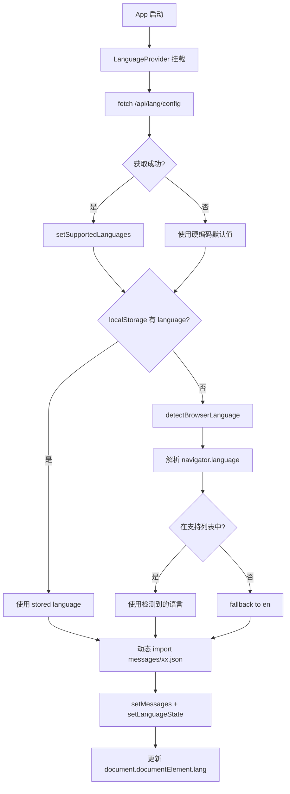
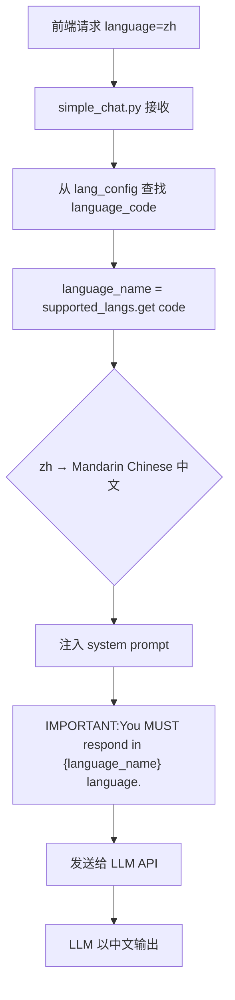

# PD-174.01 DeepWiki — 前后端双层 i18n 与 LLM 语言注入

> 文档编号：PD-174.01
> 来源：DeepWiki `src/i18n.ts` `src/contexts/LanguageContext.tsx` `api/config.py` `api/prompts.py`
> GitHub：https://github.com/AsyncFuncAI/deepwiki-open.git
> 问题域：PD-174 国际化 Internationalization (i18n)
> 状态：可复用方案

---

## 第 1 章 问题与动机

### 1.1 核心问题

AI 驱动的文档生成系统面临双重国际化挑战：

1. **前端 UI 多语言** — 按钮、标签、提示文字等静态文本需要翻译为用户选择的语言
2. **LLM 输出语言控制** — 后端调用 LLM 生成的 Wiki 内容必须以用户指定的语言输出，而非模型默认语言

传统 Web 应用只需解决第一个问题，但 AI 应用必须同时解决两者。DeepWiki 的方案是前后端各自独立处理：前端用 JSON 翻译文件 + React Context 管理 UI 语言，后端用 `language_name` 参数注入 system prompt 控制 LLM 输出语言。

### 1.2 DeepWiki 的解法概述

1. **前端翻译层**：10 个 JSON 翻译文件（`src/messages/*.json`），通过 `next-intl` 加载，`LanguageContext` 提供全局状态（`src/contexts/LanguageContext.tsx:17-194`）
2. **浏览器语言自动检测**：`detectBrowserLanguage()` 解析 `navigator.language`，匹配支持列表后写入 localStorage（`src/contexts/LanguageContext.tsx:26-67`）
3. **后端语言配置**：`lang.json` 定义支持语言映射表（code → 全名），`load_lang_config()` 加载并提供 fallback 默认值（`api/config.py:259-285`）
4. **LLM 语言注入**：将 language_code 转为 language_name（如 `zh` → `Mandarin Chinese (中文)`），注入 system prompt 的 `IMPORTANT:You MUST respond in {language_name} language.` 指令（`api/prompts.py:64`）
5. **语言感知缓存**：Wiki 缓存文件名包含 language 参数，不同语言的 Wiki 独立缓存（`api/api.py:408-411`）

### 1.3 设计思想

| 设计原则 | 具体实现 | 理由 | 替代方案 |
|----------|----------|------|----------|
| 前后端解耦 | 前端 JSON 翻译 + 后端 prompt 注入，互不依赖 | 前端翻译是静态文本，后端是动态 LLM 输出，关注点不同 | 统一翻译服务（增加耦合） |
| 配置驱动 | `lang.json` 集中定义支持语言，前后端共享语言列表 | 新增语言只需加 JSON 文件 + 配置条目 | 硬编码语言列表（难维护） |
| 渐进式降级 | 检测浏览器语言 → localStorage → 默认 en | 用户无需手动选择即可获得母语体验 | 强制用户首次选择（体验差） |
| prompt 强制指令 | `IMPORTANT:You MUST respond in {language_name}` 大写强调 | LLM 对大写 IMPORTANT 指令遵从度更高 | 仅在 user message 中提示（易被忽略） |
| 语言感知缓存 | 缓存 key 包含 language 字段 | 同一仓库不同语言的 Wiki 互不覆盖 | 单一缓存 + 运行时翻译（延迟高） |

---

## 第 2 章 源码实现分析

### 2.1 架构概览

DeepWiki 的 i18n 架构分为三层：前端翻译层、语言状态管理层、后端 LLM 语言控制层。

```
┌─────────────────────────────────────────────────────────────┐
│                        前端 (Next.js)                        │
│                                                              │
│  ┌──────────────┐    ┌──────────────────┐    ┌────────────┐ │
│  │ messages/*.json│───→│ LanguageContext   │───→│ UI 组件     │ │
│  │ (10 种语言)    │    │ (全局状态管理)     │    │ t('key')   │ │
│  └──────────────┘    └────────┬─────────┘    └────────────┘ │
│                               │                              │
│         ┌─────────────────────┼──────────────────┐          │
│         │ detectBrowserLang() │ localStorage      │          │
│         │ navigator.language  │ 'language' key    │          │
│         └─────────────────────┴──────────────────┘          │
│                               │                              │
│                    selectedLanguage (URL param)              │
└───────────────────────────────┼──────────────────────────────┘
                                │
                    POST /chat  │  ?language=zh
                                ▼
┌───────────────────────────────────────────────────────────────┐
│                      后端 (FastAPI)                            │
│                                                               │
│  ┌──────────────┐    ┌──────────────────┐    ┌─────────────┐ │
│  │ lang.json     │───→│ language_code →   │───→│ system      │ │
│  │ code→fullname │    │ language_name     │    │ prompt      │ │
│  └──────────────┘    └──────────────────┘    │ 注入         │ │
│                                               └──────┬──────┘ │
│                                                      │        │
│                                               ┌──────▼──────┐ │
│                                               │ LLM API     │ │
│                                               │ 输出目标语言  │ │
│                                               └─────────────┘ │
└───────────────────────────────────────────────────────────────┘
```

### 2.2 核心实现

#### 2.2.1 前端语言状态管理 — LanguageContext



对应源码 `src/contexts/LanguageContext.tsx:17-194`：

```typescript
export function LanguageProvider({ children }: { children: ReactNode }) {
  const [language, setLanguageState] = useState<string>('en');
  const [messages, setMessages] = useState<Messages>({});
  const [isLoading, setIsLoading] = useState<boolean>(true);
  const [supportedLanguages, setSupportedLanguages] = useState({})

  const detectBrowserLanguage = (): string => {
    try {
      if (typeof window === 'undefined' || typeof navigator === 'undefined') {
        return 'en';
      }
      const browserLang = navigator.language || (navigator as any).userLanguage || '';
      const langCode = browserLang.split('-')[0].toLowerCase();
      if (locales.includes(langCode as any)) {
        return langCode;
      }
      // Special case for Chinese variants
      if (langCode === 'zh') {
        return 'zh';
      }
      return 'en';
    } catch (error) {
      return 'en';
    }
  };

  // 语言切换：动态加载翻译文件 + localStorage 持久化
  const setLanguage = async (lang: string) => {
    const validLanguage = Object.keys(supportedLanguages).includes(lang) ? lang : defaultLanguage;
    const langMessages = (await import(`../messages/${validLanguage}.json`)).default;
    setLanguageState(validLanguage);
    setMessages(langMessages);
    if (typeof window !== 'undefined') {
      localStorage.setItem('language', validLanguage);
    }
    if (typeof document !== 'undefined') {
      document.documentElement.lang = validLanguage;
    }
  };
}
```

关键设计点：
- `src/contexts/LanguageContext.tsx:26-67`：浏览器语言检测，SSR 安全（`typeof window === 'undefined'` 守卫）
- `src/contexts/LanguageContext.tsx:69-99`：启动时从后端 `/api/lang/config` 获取支持语言列表，失败时使用硬编码 fallback
- `src/contexts/LanguageContext.tsx:101-150`：语言加载链 — localStorage → 浏览器检测 → 默认值
- `src/contexts/LanguageContext.tsx:153-176`：语言切换时动态 `import()` 翻译文件，零打包体积浪费

#### 2.2.2 后端 LLM 语言注入



对应源码 `api/simple_chat.py:247-289`：

```python
# Get language information
language_code = request.language or configs["lang_config"]["default"]
supported_langs = configs["lang_config"]["supported_languages"]
language_name = supported_langs.get(language_code, "English")

# Create system prompt — 语言指令注入
if is_deep_research:
    if is_first_iteration:
        system_prompt = DEEP_RESEARCH_FIRST_ITERATION_PROMPT.format(
            repo_type=repo_type,
            repo_url=repo_url,
            repo_name=repo_name,
            language_name=language_name  # 注入语言名
        )
    # ... 中间迭代和最终迭代同样注入 language_name
else:
    system_prompt = SIMPLE_CHAT_SYSTEM_PROMPT.format(
        repo_type=repo_type,
        repo_url=repo_url,
        repo_name=repo_name,
        language_name=language_name
    )
```

prompt 模板中的语言指令（`api/prompts.py:64`）：

```python
DEEP_RESEARCH_FIRST_ITERATION_PROMPT = """<role>
You are an expert code analyst examining the {repo_type} repository: {repo_url} ({repo_name}).
IMPORTANT:You MUST respond in {language_name} language.
</role>
...
"""
```

### 2.3 实现细节

#### 语言配置的双重保障

后端 `load_lang_config()` 实现了配置文件 + 硬编码默认值的双重保障（`api/config.py:259-285`）：

```python
def load_lang_config():
    default_config = {
        "supported_languages": {
            "en": "English",
            "ja": "Japanese (日本語)",
            "zh": "Mandarin Chinese (中文)",
            # ... 共 10 种语言
        },
        "default": "en"
    }
    loaded_config = load_json_config("lang.json")
    if not loaded_config:
        return default_config
    if "supported_languages" not in loaded_config or "default" not in loaded_config:
        logger.warning("Language configuration file 'lang.json' is malformed.")
        return default_config
    return loaded_config
```

#### 语言感知的 Wiki 缓存

缓存文件名包含 language 参数，确保不同语言的 Wiki 独立存储（`api/api.py:408-411`）：

```python
def get_wiki_cache_path(owner: str, repo: str, repo_type: str, language: str) -> str:
    filename = f"deepwiki_cache_{repo_type}_{owner}_{repo}_{language}.json"
    return os.path.join(WIKI_CACHE_DIR, filename)
```

#### 前端翻译消费模式

页面组件通过 `useLanguage()` hook 获取 messages，自定义 `t()` 函数实现 dot-notation 访问（`src/app/page.tsx:47-76`）：

```typescript
const { language, setLanguage, messages, supportedLanguages } = useLanguage();

const t = (key: string, params: Record<string, string | number> = {}): string => {
  const keys = key.split('.');
  let value: any = messages;
  for (const k of keys) {
    if (value && typeof value === 'object' && k in value) {
      value = value[k];
    } else {
      return key; // 翻译缺失时返回 key 本身
    }
  }
  if (typeof value === 'string') {
    return Object.entries(params).reduce((acc, [paramKey, paramValue]) => {
      return acc.replace(`{${paramKey}}`, String(paramValue));
    }, value);
  }
  return key;
};
```

#### 根布局集成

`LanguageProvider` 包裹整个应用，确保所有页面都能访问语言状态（`src/app/layout.tsx:28`）：

```tsx
<ThemeProvider attribute="data-theme" defaultTheme="system" enableSystem>
  <LanguageProvider>
    {children}
  </LanguageProvider>
</ThemeProvider>
```

---

## 第 3 章 迁移指南

### 3.1 迁移清单

#### 阶段 1：前端 UI 多语言

- [ ] 创建 `messages/` 目录，添加 `en.json` 基础翻译文件
- [ ] 为每种目标语言创建对应 JSON 文件（结构与 en.json 一致）
- [ ] 实现 `LanguageContext`：全局状态 + 动态 import + localStorage 持久化
- [ ] 在根布局中包裹 `LanguageProvider`
- [ ] 实现 `detectBrowserLanguage()` 自动检测
- [ ] 在页面组件中使用 `useLanguage()` + `t()` 函数消费翻译

#### 阶段 2：后端 LLM 语言控制

- [ ] 创建 `lang.json` 配置文件，定义 `supported_languages`（code → 全名映射）
- [ ] 在 API 请求模型中添加 `language` 字段（默认 `en`）
- [ ] 实现 language_code → language_name 转换逻辑
- [ ] 在所有 system prompt 模板中添加 `IMPORTANT:You MUST respond in {language_name} language.` 指令
- [ ] 实现语言验证：不支持的语言 fallback 到默认语言

#### 阶段 3：缓存与持久化

- [ ] 缓存 key 中包含 language 参数
- [ ] API 端点添加 language 查询参数验证

### 3.2 适配代码模板

#### 前端 LanguageContext 模板（React + TypeScript）

```typescript
// contexts/LanguageContext.tsx
'use client';
import React, { createContext, useContext, useState, useEffect, ReactNode } from 'react';

type Messages = Record<string, any>;
type LanguageContextType = {
  language: string;
  setLanguage: (lang: string) => void;
  messages: Messages;
  supportedLanguages: Record<string, string>;
};

const LanguageContext = createContext<LanguageContextType | undefined>(undefined);

const DEFAULT_LANGUAGES: Record<string, string> = {
  en: 'English',
  zh: 'Mandarin Chinese (中文)',
  ja: 'Japanese (日本語)',
};

export function LanguageProvider({ children }: { children: ReactNode }) {
  const [language, setLanguageState] = useState('en');
  const [messages, setMessages] = useState<Messages>({});
  const [supportedLanguages, setSupportedLanguages] = useState(DEFAULT_LANGUAGES);

  const detectBrowserLanguage = (): string => {
    if (typeof window === 'undefined') return 'en';
    const langCode = navigator.language.split('-')[0].toLowerCase();
    return Object.keys(supportedLanguages).includes(langCode) ? langCode : 'en';
  };

  useEffect(() => {
    const init = async () => {
      // 1. 从后端获取支持语言列表（可选）
      try {
        const res = await fetch('/api/lang/config');
        if (res.ok) {
          const data = await res.json();
          setSupportedLanguages(data.supported_languages);
        }
      } catch { /* 使用默认值 */ }

      // 2. 确定当前语言
      const stored = typeof window !== 'undefined' ? localStorage.getItem('language') : null;
      const lang = stored || detectBrowserLanguage();

      // 3. 加载翻译文件
      const msgs = (await import(`../messages/${lang}.json`)).default;
      setLanguageState(lang);
      setMessages(msgs);
      if (typeof window !== 'undefined') localStorage.setItem('language', lang);
    };
    init();
  }, []);

  const setLanguage = async (lang: string) => {
    const valid = Object.keys(supportedLanguages).includes(lang) ? lang : 'en';
    const msgs = (await import(`../messages/${valid}.json`)).default;
    setLanguageState(valid);
    setMessages(msgs);
    if (typeof window !== 'undefined') localStorage.setItem('language', valid);
    if (typeof document !== 'undefined') document.documentElement.lang = valid;
  };

  return (
    <LanguageContext.Provider value={{ language, setLanguage, messages, supportedLanguages }}>
      {children}
    </LanguageContext.Provider>
  );
}

export const useLanguage = () => {
  const ctx = useContext(LanguageContext);
  if (!ctx) throw new Error('useLanguage must be used within LanguageProvider');
  return ctx;
};
```

#### 后端 LLM 语言注入模板（Python / FastAPI）

```python
# config/lang.py
import json
from pathlib import Path

DEFAULT_LANG_CONFIG = {
    "supported_languages": {
        "en": "English",
        "zh": "Mandarin Chinese (中文)",
        "ja": "Japanese (日本語)",
    },
    "default": "en"
}

def load_lang_config(config_path: str = "config/lang.json") -> dict:
    try:
        with open(config_path, 'r', encoding='utf-8') as f:
            config = json.load(f)
        if "supported_languages" in config and "default" in config:
            return config
    except (FileNotFoundError, json.JSONDecodeError):
        pass
    return DEFAULT_LANG_CONFIG

lang_config = load_lang_config()

def get_language_name(code: str) -> str:
    """将语言代码转为 LLM 可理解的全名"""
    return lang_config["supported_languages"].get(
        code, lang_config["supported_languages"][lang_config["default"]]
    )

# 在 prompt 中使用
SYSTEM_PROMPT_TEMPLATE = """You are an AI assistant.
IMPORTANT: You MUST respond in {language_name} language.
{task_instructions}"""

def build_prompt(language_code: str, task_instructions: str) -> str:
    language_name = get_language_name(language_code)
    return SYSTEM_PROMPT_TEMPLATE.format(
        language_name=language_name,
        task_instructions=task_instructions
    )
```

### 3.3 适用场景

| 场景 | 适用度 | 说明 |
|------|--------|------|
| AI 文档生成工具 | ⭐⭐⭐ | 完美匹配：前端 UI + LLM 输出都需要多语言 |
| AI 聊天应用 | ⭐⭐⭐ | prompt 注入 language_name 控制回复语言 |
| 纯前端多语言网站 | ⭐⭐ | LanguageContext 方案可用，但 next-intl 更成熟 |
| 多语言 API 服务 | ⭐⭐ | 后端 lang_config 方案可直接复用 |
| 实时翻译系统 | ⭐ | 需要更复杂的翻译管线，本方案偏静态 |

---

## 第 4 章 测试用例

```python
import pytest
from unittest.mock import patch, MagicMock

# === 后端语言配置测试 ===

class TestLangConfig:
    """测试语言配置加载与 fallback"""

    def test_load_valid_config(self, tmp_path):
        """正常加载 lang.json"""
        config_file = tmp_path / "lang.json"
        config_file.write_text('{"supported_languages": {"en": "English", "zh": "中文"}, "default": "en"}')
        from api.config import load_json_config
        # 模拟 load_json_config 返回有效配置
        config = {"supported_languages": {"en": "English", "zh": "中文"}, "default": "en"}
        assert "en" in config["supported_languages"]
        assert config["default"] == "en"

    def test_fallback_on_missing_file(self):
        """配置文件不存在时使用默认值"""
        from api.config import load_lang_config
        config = load_lang_config()
        assert "supported_languages" in config
        assert config["default"] == "en"
        assert len(config["supported_languages"]) == 10

    def test_fallback_on_malformed_config(self):
        """配置文件格式错误时使用默认值"""
        with patch('api.config.load_json_config', return_value={"bad": "data"}):
            from api.config import load_lang_config
            config = load_lang_config()
            assert "supported_languages" in config

    def test_language_code_to_name(self):
        """语言代码转全名"""
        supported = {
            "en": "English",
            "zh": "Mandarin Chinese (中文)",
            "ja": "Japanese (日本語)"
        }
        assert supported.get("zh", "English") == "Mandarin Chinese (中文)"
        assert supported.get("xx", "English") == "English"  # 未知语言 fallback


class TestPromptLanguageInjection:
    """测试 prompt 中的语言注入"""

    def test_language_injected_in_prompt(self):
        """验证 language_name 被正确注入 system prompt"""
        from api.prompts import SIMPLE_CHAT_SYSTEM_PROMPT
        prompt = SIMPLE_CHAT_SYSTEM_PROMPT.format(
            repo_type="github",
            repo_url="https://github.com/test/repo",
            repo_name="repo",
            language_name="Mandarin Chinese (中文)"
        )
        assert "Mandarin Chinese (中文)" in prompt
        assert "MUST respond in" in prompt

    def test_all_prompts_have_language_placeholder(self):
        """所有 prompt 模板都包含 language_name 占位符"""
        from api.prompts import (
            DEEP_RESEARCH_FIRST_ITERATION_PROMPT,
            DEEP_RESEARCH_FINAL_ITERATION_PROMPT,
            DEEP_RESEARCH_INTERMEDIATE_ITERATION_PROMPT,
            SIMPLE_CHAT_SYSTEM_PROMPT
        )
        for prompt in [
            DEEP_RESEARCH_FIRST_ITERATION_PROMPT,
            DEEP_RESEARCH_FINAL_ITERATION_PROMPT,
            DEEP_RESEARCH_INTERMEDIATE_ITERATION_PROMPT,
            SIMPLE_CHAT_SYSTEM_PROMPT
        ]:
            assert "{language_name}" in prompt


class TestWikiCacheLanguage:
    """测试语言感知缓存"""

    def test_cache_path_includes_language(self):
        """缓存路径包含语言参数"""
        # 模拟 get_wiki_cache_path 逻辑
        def get_cache_path(owner, repo, repo_type, language):
            return f"deepwiki_cache_{repo_type}_{owner}_{repo}_{language}.json"

        path_en = get_cache_path("user", "repo", "github", "en")
        path_zh = get_cache_path("user", "repo", "github", "zh")
        assert path_en != path_zh
        assert "en" in path_en
        assert "zh" in path_zh

    def test_unsupported_language_fallback(self):
        """不支持的语言 fallback 到默认语言"""
        supported = {"en": "English", "zh": "中文"}
        default = "en"
        language = "xx"
        if language not in supported:
            language = default
        assert language == "en"
```

---

## 第 5 章 跨域关联

| 关联域 | 关系类型 | 说明 |
|--------|----------|------|
| PD-01 上下文管理 | 协同 | language_name 注入 system prompt 占用上下文窗口，需纳入 token 预算 |
| PD-06 记忆持久化 | 协同 | 语言偏好通过 localStorage 持久化，Wiki 缓存按语言分文件存储 |
| PD-08 搜索与检索 | 协同 | RAG 检索结果为英文代码，但 LLM 需以目标语言输出解释，prompt 中的语言指令影响 RAG 回答质量 |
| PD-09 Human-in-the-Loop | 协同 | 用户通过语言选择器主动切换语言，属于 human-in-the-loop 的偏好设置 |
| PD-11 可观测性 | 依赖 | 语言选择影响缓存命中率统计，不同语言的 Wiki 生成成本需分别追踪 |

---

## 第 6 章 来源文件索引

| 文件 | 行范围 | 关键实现 |
|------|--------|----------|
| `src/i18n.ts` | L1-14 | next-intl 配置，locales 列表定义，动态 import 翻译文件 |
| `src/contexts/LanguageContext.tsx` | L17-194 | LanguageProvider 全局状态管理，浏览器语言检测，localStorage 持久化 |
| `src/contexts/LanguageContext.tsx` | L26-67 | detectBrowserLanguage() 实现，navigator.language 解析 |
| `src/contexts/LanguageContext.tsx` | L69-99 | 从后端 /api/lang/config 获取支持语言列表 |
| `src/contexts/LanguageContext.tsx` | L101-150 | 语言加载链：localStorage → 浏览器检测 → 默认值 |
| `src/contexts/LanguageContext.tsx` | L153-176 | setLanguage：动态 import + localStorage + HTML lang 属性更新 |
| `src/app/layout.tsx` | L28 | LanguageProvider 包裹整个应用 |
| `src/app/page.tsx` | L47-76 | useLanguage() 消费 + 自定义 t() 翻译函数 |
| `src/messages/en.json` | L1-142 | 英文翻译文件，嵌套 JSON 结构 |
| `api/config.py` | L259-285 | load_lang_config() 加载语言配置 + fallback 默认值 |
| `api/config.py` | L354-356 | lang_config 注入全局 configs 字典 |
| `api/config/lang.json` | L1-15 | 语言配置文件：10 种语言 code→fullname 映射 |
| `api/prompts.py` | L60-191 | 所有 prompt 模板，含 `{language_name}` 占位符和 MUST respond 指令 |
| `api/simple_chat.py` | L70 | ChatCompletionRequest.language 字段定义 |
| `api/simple_chat.py` | L247-289 | language_code → language_name 转换 + prompt 注入 |
| `api/websocket_wiki.py` | L252-255 | WebSocket 端同样的语言转换逻辑 |
| `api/api.py` | L106 | WikiCacheRequest.language 字段 |
| `api/api.py` | L149-151 | GET /lang/config 端点，返回语言配置 |
| `api/api.py` | L408-411 | get_wiki_cache_path 包含 language 参数 |
| `api/api.py` | L466-474 | Wiki 缓存 API 的语言验证逻辑 |

---

## 第 7 章 横向对比维度

```json comparison_data
{
  "project": "DeepWiki",
  "dimensions": {
    "前端翻译方案": "next-intl + 动态 import JSON 翻译文件，自定义 t() 函数",
    "语言状态管理": "React Context + localStorage 持久化 + 浏览器自动检测",
    "LLM 输出控制": "system prompt 注入 MUST respond in {language_name} 强制指令",
    "语言配置源": "lang.json 集中配置 + 硬编码 fallback 双重保障",
    "缓存策略": "缓存文件名含 language 参数，不同语言独立缓存",
    "支持语言数": "10 种语言（en/ja/zh/zh-tw/es/kr/vi/pt-br/fr/ru）"
  }
}
```

### 域元数据补充

```json domain_metadata
{
  "solution_summary": "DeepWiki 用 LanguageContext + 动态 import JSON 管理前端 10 语言 UI，后端通过 lang.json 配置将 language_code 转为 language_name 注入 system prompt 的 MUST respond 指令控制 LLM 输出语言，Wiki 缓存按语言分文件存储",
  "description": "AI 应用需同时解决 UI 翻译和 LLM 输出语言控制的双层 i18n 问题",
  "sub_problems": [
    "语言感知缓存隔离（不同语言的生成内容独立缓存）",
    "language_code 到 LLM 可理解的 language_name 映射",
    "前后端语言配置同步（后端 API 提供支持语言列表）"
  ],
  "best_practices": [
    "缓存 key 包含 language 参数避免跨语言覆盖",
    "lang.json 集中配置 + 硬编码 fallback 双重保障",
    "system prompt 用大写 IMPORTANT + MUST 强制 LLM 遵从语言指令"
  ]
}
```
