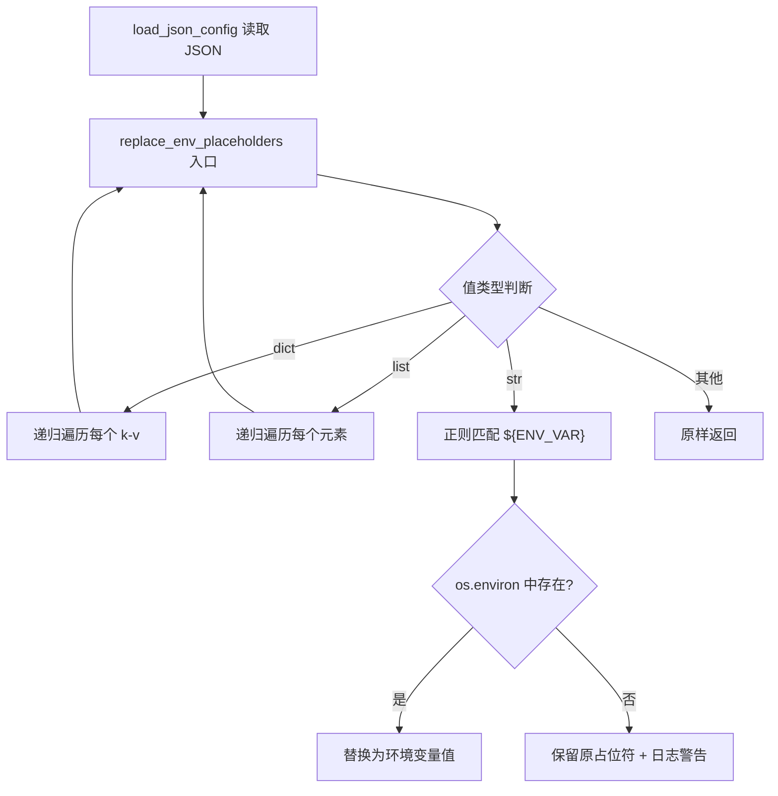
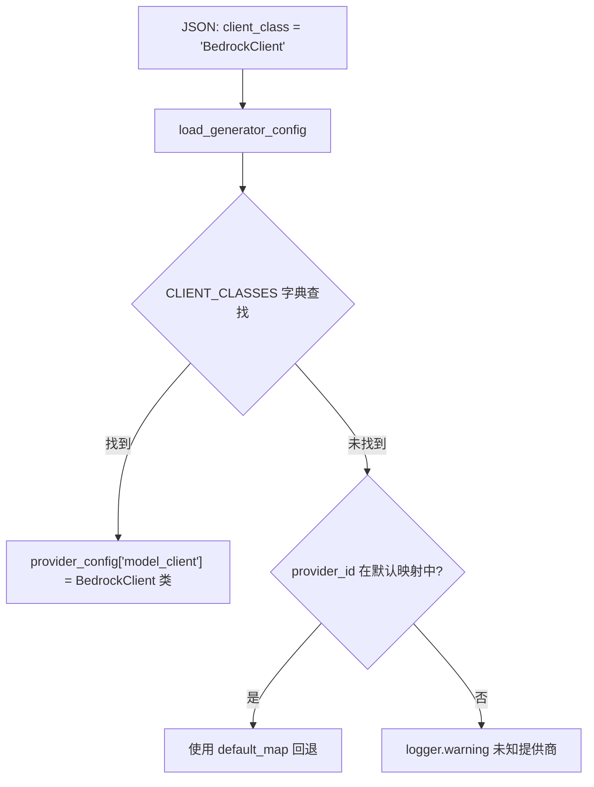

# PD-175.01 DeepWiki — JSON 配置驱动与环境变量注入

> 文档编号：PD-175.01
> 来源：DeepWiki `api/config.py` `api/config/*.json`
> GitHub：https://github.com/AsyncFuncAI/deepwiki-open.git
> 问题域：PD-175 配置管理 Configuration Management
> 状态：可复用方案

---

## 第 1 章 问题与动机

### 1.1 核心问题

一个支持多 LLM 提供商（Google、OpenAI、OpenRouter、Ollama、Bedrock、Azure、Dashscope）的 RAG 系统，需要在以下维度管理配置：

1. **多提供商模型参数**：每个提供商有不同的默认模型、temperature、top_p 等参数，且参数结构不统一（Ollama 用 `options` 嵌套，其他用扁平结构）
2. **敏感信息隔离**：API Key 不能硬编码在配置文件中，需要通过环境变量注入
3. **运行时类映射**：JSON 配置中的字符串 `"client_class": "BedrockClient"` 需要在运行时映射到实际的 Python 类
4. **部署灵活性**：Docker 部署、本地开发、自定义配置目录等场景需要不同的配置路径
5. **关注点分离**：生成器配置、嵌入器配置、仓库过滤配置、语言配置各自独立，互不干扰

### 1.2 DeepWiki 的解法概述

DeepWiki 采用 **4 文件 JSON 配置 + 单一 Python 加载器** 的架构：

1. **4 个 JSON 配置文件**分离关注点：`generator.json`（LLM 生成器）、`embedder.json`（嵌入器）、`repo.json`（仓库过滤）、`lang.json`（语言）— 见 `api/config/` 目录
2. **`${ENV_VAR}` 占位符递归替换**：`replace_env_placeholders()` 函数递归遍历 dict/list/str，用正则 `\$\{([A-Z0-9_]+)\}` 匹配并替换 — `api/config.py:69-97`
3. **`CLIENT_CLASSES` 字典实现字符串→类映射**：JSON 中写 `"client_class": "BedrockClient"`，Python 端用全局字典 `CLIENT_CLASSES` 查表转换 — `api/config.py:58-67`
4. **`DEEPWIKI_CONFIG_DIR` 环境变量**支持自定义配置路径，默认回退到 `api/config/` — `api/config.py:100-107`
5. **模块级立即加载**：所有配置在 `config.py` 被 import 时立即加载到全局 `configs` 字典 — `api/config.py:329-356`

### 1.3 设计思想

| 设计原则 | 具体实现 | 理由 | 替代方案 |
|----------|----------|------|----------|
| 关注点分离 | 4 个独立 JSON 文件 | 修改模型配置不影响仓库过滤规则 | 单一 config.yaml（耦合度高） |
| 声明式配置 | JSON 描述 provider/model/params 三层结构 | 非开发者也能修改模型参数 | Python dict 硬编码（需改代码） |
| 环境变量注入 | `${ENV_VAR}` 占位符 + 递归替换 | 敏感信息不进版本控制 | .env 文件直接加载（不够灵活） |
| 字符串→类映射 | `CLIENT_CLASSES` 全局字典 | JSON 无法序列化 Python 类 | importlib 动态导入（过度工程） |
| 默认值回退 | `load_lang_config()` 内置 default_config | 缺少 lang.json 时系统仍可运行 | 启动时报错退出（不友好） |
| 模块级加载 | import 时立即执行 `load_*_config()` | 配置只加载一次，全局共享 | 懒加载（增加首次调用延迟不确定性） |

---

## 第 2 章 源码实现分析

### 2.1 架构概览

DeepWiki 的配置系统由一个 Python 加载器 (`config.py`) 和 4 个 JSON 配置文件组成，形成"JSON 声明 + Python 解释"的双层架构：

```
┌─────────────────────────────────────────────────────────┐
│                    config.py (加载器)                      │
│                                                           │
│  ┌──────────┐  ┌──────────┐  ┌────────┐  ┌────────┐     │
│  │generator │  │embedder  │  │repo    │  │lang    │     │
│  │.json     │  │.json     │  │.json   │  │.json   │     │
│  └────┬─────┘  └────┬─────┘  └───┬────┘  └───┬────┘     │
│       │              │            │            │          │
│       ▼              ▼            ▼            ▼          │
│  load_generator  load_embedder  load_repo  load_lang     │
│  _config()       _config()     _config()  _config()      │
│       │              │            │            │          │
│       │   ┌──────────┴────────┐   │            │          │
│       │   │ replace_env_      │   │            │          │
│       │   │ placeholders()    │   │            │          │
│       │   │ ${ENV} → value    │   │            │          │
│       │   └──────────┬────────┘   │            │          │
│       │              │            │            │          │
│       │   ┌──────────┴────────┐   │            │          │
│       │   │ CLIENT_CLASSES    │   │            │          │
│       │   │ str → Python class│   │            │          │
│       │   └──────────┬────────┘   │            │          │
│       ▼              ▼            ▼            ▼          │
│  ┌─────────────────────────────────────────────────┐     │
│  │              configs (全局字典)                    │     │
│  │  providers / embedder / file_filters / lang      │     │
│  └─────────────────────────────────────────────────┘     │
└─────────────────────────────────────────────────────────┘
         │                    │                │
         ▼                    ▼                ▼
    get_model_config()  get_embedder_config()  API endpoints
    (rag.py, websocket) (data_pipeline, rag)   (api.py)
```

### 2.2 核心实现

#### 2.2.1 环境变量占位符递归替换



对应源码 `api/config.py:69-97`：

```python
def replace_env_placeholders(config: Union[Dict[str, Any], List[Any], str, Any]) -> Union[Dict[str, Any], List[Any], str, Any]:
    """
    Recursively replace placeholders like "${ENV_VAR}" in string values
    within a nested configuration structure (dicts, lists, strings)
    with environment variable values.
    """
    pattern = re.compile(r"\$\{([A-Z0-9_]+)\}")

    def replacer(match: re.Match[str]) -> str:
        env_var_name = match.group(1)
        original_placeholder = match.group(0)
        env_var_value = os.environ.get(env_var_name)
        if env_var_value is None:
            logger.warning(
                f"Environment variable placeholder '{original_placeholder}' "
                f"was not found in the environment."
            )
            return original_placeholder
        return env_var_value

    if isinstance(config, dict):
        return {k: replace_env_placeholders(v) for k, v in config.items()}
    elif isinstance(config, list):
        return [replace_env_placeholders(item) for item in config]
    elif isinstance(config, str):
        return pattern.sub(replacer, config)
    else:
        return config
```

关键设计点：
- 正则 `\$\{([A-Z0-9_]+)\}` 只匹配大写字母+数字+下划线，防止误匹配
- 未找到环境变量时**不报错**，保留原占位符并打日志警告，实现优雅降级
- 递归处理支持任意嵌套深度的 JSON 结构

#### 2.2.2 client_class 字符串到 Python 类的动态映射



对应源码 `api/config.py:58-67`（映射表）和 `api/config.py:124-148`（加载逻辑）：

```python
# 全局映射表：字符串 → Python 类
CLIENT_CLASSES = {
    "GoogleGenAIClient": GoogleGenAIClient,
    "GoogleEmbedderClient": GoogleEmbedderClient,
    "OpenAIClient": OpenAIClient,
    "OpenRouterClient": OpenRouterClient,
    "OllamaClient": OllamaClient,
    "BedrockClient": BedrockClient,
    "AzureAIClient": AzureAIClient,
    "DashscopeClient": DashscopeClient
}

def load_generator_config():
    generator_config = load_json_config("generator.json")
    if "providers" in generator_config:
        for provider_id, provider_config in generator_config["providers"].items():
            # 优先用 JSON 中显式声明的 client_class
            if provider_config.get("client_class") in CLIENT_CLASSES:
                provider_config["model_client"] = CLIENT_CLASSES[provider_config["client_class"]]
            # 回退到基于 provider_id 的默认映射
            elif provider_id in ["google", "openai", "openrouter", "ollama", "bedrock", "azure", "dashscope"]:
                default_map = {
                    "google": GoogleGenAIClient,
                    "openai": OpenAIClient,
                    # ...
                }
                provider_config["model_client"] = default_map[provider_id]
    return generator_config
```

双层映射策略：先查 `client_class` 显式声明（如 Bedrock、Azure 在 JSON 中指定），再按 `provider_id` 约定映射（如 google、openai 不需要在 JSON 中写 client_class）。

### 2.3 实现细节

#### 配置路径解析与默认回退

`load_json_config()` (`api/config.py:100-121`) 实现了两级路径解析：

1. 环境变量 `DEEPWIKI_CONFIG_DIR` 优先 → `Path(CONFIG_DIR) / filename`
2. 默认回退 → `Path(__file__).parent / "config" / filename`（即 `api/config/`）

文件不存在时返回空字典 `{}`，不抛异常。这使得 `repo.json` 和 `lang.json` 成为可选配置。

#### 模块级全局加载与 configs 字典合并

`api/config.py:329-356` 在模块导入时立即执行：

```python
configs = {}
generator_config = load_generator_config()
embedder_config = load_embedder_config()
repo_config = load_repo_config()
lang_config = load_lang_config()

if generator_config:
    configs["default_provider"] = generator_config.get("default_provider", "google")
    configs["providers"] = generator_config.get("providers", {})
if embedder_config:
    for key in ["embedder", "embedder_ollama", "embedder_google", "embedder_bedrock", "retriever", "text_splitter"]:
        if key in embedder_config:
            configs[key] = embedder_config[key]
```

所有下游模块（`rag.py`、`websocket_wiki.py`、`data_pipeline.py`、`api.py`）通过 `from api.config import configs` 获取同一个全局字典。

#### Embedder 类型选择链

`get_embedder_config()` (`api/config.py:163-178`) 根据 `DEEPWIKI_EMBEDDER_TYPE` 环境变量选择嵌入器配置：

```
DEEPWIKI_EMBEDDER_TYPE=bedrock → configs["embedder_bedrock"]
DEEPWIKI_EMBEDDER_TYPE=google  → configs["embedder_google"]
DEEPWIKI_EMBEDDER_TYPE=ollama  → configs["embedder_ollama"]
默认                           → configs["embedder"]（OpenAI）
```

`tools/embedder.py:6-58` 中的 `get_embedder()` 函数消费此配置，通过 `embedder_config["model_client"]`（已是 Python 类）直接实例化客户端。


---

## 第 3 章 迁移指南

### 3.1 迁移清单

**阶段 1：基础配置加载（1 个文件）**
- [ ] 创建 `config/` 目录，放置 JSON 配置文件
- [ ] 实现 `load_json_config(filename)` 函数，支持 `CONFIG_DIR` 环境变量
- [ ] 实现 `replace_env_placeholders()` 递归替换函数

**阶段 2：提供商映射（扩展）**
- [ ] 定义 `CLIENT_CLASSES` 映射表（根据你的项目实际客户端类）
- [ ] 实现 `load_generator_config()` 双层映射逻辑
- [ ] 实现 `get_model_config(provider, model)` 查询接口

**阶段 3：嵌入器配置（可选）**
- [ ] 如果有多嵌入器需求，实现 `get_embedder_config()` 选择链
- [ ] 通过环境变量 `EMBEDDER_TYPE` 控制嵌入器切换

**阶段 4：API 暴露（可选）**
- [ ] 添加 `/models/config` 端点，让前端动态获取可用模型列表
- [ ] 添加 `/lang/config` 端点，支持多语言配置

### 3.2 适配代码模板

以下是一个可直接复用的配置加载器，从 DeepWiki 的实现中提炼：

```python
"""
config_loader.py — 从 DeepWiki PD-175 迁移的配置加载器
支持：JSON 配置文件 + ${ENV_VAR} 占位符 + client_class 动态映射
"""
import os
import re
import json
import logging
from pathlib import Path
from typing import Dict, Any, Union, List, Type

logger = logging.getLogger(__name__)

# ---- 第 1 层：环境变量占位符替换 ----

_ENV_PATTERN = re.compile(r"\$\{([A-Z0-9_]+)\}")

def replace_env_placeholders(config: Union[Dict, List, str, Any]) -> Union[Dict, List, str, Any]:
    """递归替换 JSON 配置中的 ${ENV_VAR} 占位符"""
    def _replacer(match: re.Match) -> str:
        name = match.group(1)
        value = os.environ.get(name)
        if value is None:
            logger.warning(f"Env var '{match.group(0)}' not found, keeping placeholder")
            return match.group(0)
        return value

    if isinstance(config, dict):
        return {k: replace_env_placeholders(v) for k, v in config.items()}
    elif isinstance(config, list):
        return [replace_env_placeholders(item) for item in config]
    elif isinstance(config, str):
        return _ENV_PATTERN.sub(_replacer, config)
    return config

# ---- 第 2 层：JSON 文件加载 ----

CONFIG_DIR = os.environ.get("APP_CONFIG_DIR", None)

def load_json_config(filename: str) -> dict:
    """加载 JSON 配置文件，支持自定义路径和环境变量替换"""
    if CONFIG_DIR:
        path = Path(CONFIG_DIR) / filename
    else:
        path = Path(__file__).parent / "config" / filename

    if not path.exists():
        logger.warning(f"Config file {path} not found, using empty dict")
        return {}

    with open(path, "r", encoding="utf-8") as f:
        config = json.load(f)
    return replace_env_placeholders(config)

# ---- 第 3 层：client_class 动态映射 ----

def resolve_client_classes(
    config: dict,
    class_registry: Dict[str, Type],
    default_map: Dict[str, Type],
) -> dict:
    """将 JSON 中的 client_class 字符串映射为 Python 类"""
    for provider_id, provider_cfg in config.get("providers", {}).items():
        class_name = provider_cfg.get("client_class")
        if class_name and class_name in class_registry:
            provider_cfg["model_client"] = class_registry[class_name]
        elif provider_id in default_map:
            provider_cfg["model_client"] = default_map[provider_id]
        else:
            logger.warning(f"No client class for provider '{provider_id}'")
    return config
```

### 3.3 适用场景

| 场景 | 适用度 | 说明 |
|------|--------|------|
| 多 LLM 提供商切换 | ⭐⭐⭐ | 核心场景，JSON 声明 + 运行时映射非常适合 |
| Docker 容器化部署 | ⭐⭐⭐ | `${ENV_VAR}` 占位符天然适配 Docker 环境变量注入 |
| 单提供商简单项目 | ⭐ | 过度设计，直接用环境变量即可 |
| 需要热更新配置 | ⭐⭐ | 模块级加载不支持热更新，需改为函数级加载 |
| 配置需要校验 | ⭐⭐ | 无 schema 校验，需自行添加 Pydantic 模型 |
| 多环境（dev/staging/prod） | ⭐⭐⭐ | `CONFIG_DIR` 环境变量可指向不同目录 |

---

## 第 4 章 测试用例

```python
"""
test_config_loader.py — 基于 DeepWiki config.py 真实函数签名的测试
覆盖：replace_env_placeholders, load_json_config, load_generator_config, get_model_config
"""
import os
import json
import pytest
from unittest.mock import patch, mock_open
from pathlib import Path


class TestReplaceEnvPlaceholders:
    """测试 api/config.py:69-97 的环境变量占位符替换"""

    def test_simple_string_replacement(self):
        """正常路径：单个占位符替换"""
        from api.config import replace_env_placeholders
        with patch.dict(os.environ, {"MY_KEY": "secret123"}):
            result = replace_env_placeholders("api_key=${MY_KEY}")
            assert result == "api_key=secret123"

    def test_nested_dict_replacement(self):
        """正常路径：嵌套字典中的占位符"""
        from api.config import replace_env_placeholders
        with patch.dict(os.environ, {"DB_HOST": "localhost", "DB_PORT": "5432"}):
            config = {"database": {"host": "${DB_HOST}", "port": "${DB_PORT}"}}
            result = replace_env_placeholders(config)
            assert result == {"database": {"host": "localhost", "port": "5432"}}

    def test_missing_env_var_keeps_placeholder(self):
        """降级行为：环境变量不存在时保留原占位符"""
        from api.config import replace_env_placeholders
        with patch.dict(os.environ, {}, clear=True):
            result = replace_env_placeholders("key=${NONEXISTENT_VAR}")
            assert result == "key=${NONEXISTENT_VAR}"

    def test_non_string_passthrough(self):
        """边界情况：数字、布尔值、None 原样返回"""
        from api.config import replace_env_placeholders
        assert replace_env_placeholders(42) == 42
        assert replace_env_placeholders(True) is True
        assert replace_env_placeholders(None) is None

    def test_list_with_placeholders(self):
        """正常路径：列表中的占位符"""
        from api.config import replace_env_placeholders
        with patch.dict(os.environ, {"A": "x", "B": "y"}):
            result = replace_env_placeholders(["${A}", "${B}", 123])
            assert result == ["x", "y", 123]


class TestLoadJsonConfig:
    """测试 api/config.py:100-121 的 JSON 配置加载"""

    def test_file_not_found_returns_empty(self):
        """降级行为：文件不存在返回空字典"""
        from api.config import load_json_config
        with patch("api.config.CONFIG_DIR", "/nonexistent/path"):
            result = load_json_config("missing.json")
            assert result == {}

    def test_custom_config_dir(self, tmp_path):
        """正常路径：自定义配置目录"""
        config_file = tmp_path / "test.json"
        config_file.write_text('{"key": "value"}')
        from api.config import load_json_config
        with patch("api.config.CONFIG_DIR", str(tmp_path)):
            result = load_json_config("test.json")
            assert result == {"key": "value"}


class TestGetModelConfig:
    """测试 api/config.py:359-412 的模型配置查询"""

    def test_default_model_fallback(self):
        """正常路径：未指定 model 时使用 default_model"""
        from api.config import get_model_config
        result = get_model_config(provider="google")
        assert "model_client" in result
        assert result["model_kwargs"]["model"] == "gemini-2.5-flash"

    def test_unknown_provider_raises(self):
        """边界情况：未知提供商抛出 ValueError"""
        from api.config import get_model_config
        with pytest.raises(ValueError, match="not found"):
            get_model_config(provider="nonexistent_provider")

    def test_ollama_options_structure(self):
        """正常路径：Ollama 的 options 嵌套结构正确展开"""
        from api.config import get_model_config
        result = get_model_config(provider="ollama", model="qwen3:1.7b")
        assert "temperature" in result["model_kwargs"]
        assert "num_ctx" in result["model_kwargs"]
```


---

## 第 5 章 跨域关联

| 关联域 | 关系类型 | 说明 |
|--------|----------|------|
| PD-04 工具系统 | 协同 | `CLIENT_CLASSES` 映射表本质是工具注册表的简化版，JSON 中的 `client_class` 等价于工具声明 |
| PD-06 记忆持久化 | 协同 | `embedder.json` 中的 `text_splitter` 和 `retriever` 配置直接影响 RAG 的记忆检索质量 |
| PD-08 搜索与检索 | 依赖 | RAG 系统的嵌入器选择（`get_embedder_config()`）完全由配置驱动，配置错误直接导致检索失败 |
| PD-11 可观测性 | 协同 | 配置加载过程通过 `logging` 记录所有警告和错误，但缺少结构化指标（如配置加载耗时、占位符替换次数） |
| PD-155 认证会话管理 | 依赖 | `DEEPWIKI_AUTH_MODE` 和 `DEEPWIKI_AUTH_CODE` 通过同一配置模块管理，认证行为由配置开关控制 |

---

## 第 6 章 来源文件索引

| 文件 | 行范围 | 关键实现 |
|------|--------|----------|
| `api/config.py` | L1-L17 | 模块导入与 API Key 环境变量读取 |
| `api/config.py` | L46-L67 | `WIKI_AUTH_*` 认证配置 + `CLIENT_CLASSES` 映射表 |
| `api/config.py` | L69-L97 | `replace_env_placeholders()` 递归占位符替换 |
| `api/config.py` | L99-L121 | `load_json_config()` JSON 加载 + 路径解析 |
| `api/config.py` | L124-L148 | `load_generator_config()` 双层 client_class 映射 |
| `api/config.py` | L151-L161 | `load_embedder_config()` 嵌入器配置加载 |
| `api/config.py` | L163-L178 | `get_embedder_config()` 按 EMBEDDER_TYPE 选择 |
| `api/config.py` | L329-L356 | 模块级全局加载 + configs 字典合并 |
| `api/config.py` | L359-L412 | `get_model_config()` 提供商+模型查询接口 |
| `api/config/generator.json` | 全文 | 8 提供商 LLM 模型参数声明 |
| `api/config/embedder.json` | 全文 | 4 种嵌入器配置 + retriever/text_splitter |
| `api/config/repo.json` | 全文 | 仓库文件过滤规则 + max_size_mb |
| `api/config/lang.json` | 全文 | 10 种支持语言声明 |
| `api/tools/embedder.py` | L6-L58 | `get_embedder()` 消费配置实例化嵌入器 |
| `api/rag.py` | L172-L229 | RAG 类消费 `get_embedder_config()` 和 `get_model_config()` |
| `api/api.py` | L147-L199 | `/models/config` 和 `/lang/config` API 端点 |

---

## 第 7 章 横向对比维度

```json comparison_data
{
  "project": "DeepWiki",
  "dimensions": {
    "配置格式": "4 个独立 JSON 文件按关注点分离（generator/embedder/repo/lang）",
    "敏感信息管理": "${ENV_VAR} 占位符递归替换，未找到时保留原值并警告",
    "动态类映射": "CLIENT_CLASSES 全局字典 + provider_id 默认映射双层回退",
    "配置路径": "DEEPWIKI_CONFIG_DIR 环境变量覆盖，默认 api/config/",
    "加载时机": "模块级立即加载，import 时执行，全局 configs 字典共享",
    "校验机制": "无 schema 校验，仅文件存在性检查和 client_class 查表"
  }
}
```

### 域元数据补充

```json domain_metadata
{
  "solution_summary": "DeepWiki 用 4 个独立 JSON 文件(generator/embedder/repo/lang)分离关注点，通过 ${ENV_VAR} 递归占位符替换注入敏感信息，CLIENT_CLASSES 字典实现 JSON 字符串到 Python 类的运行时映射",
  "description": "多提供商系统中配置声明与运行时绑定的解耦策略",
  "sub_problems": [
    "多提供商模型参数结构不统一的适配（如 Ollama options 嵌套）",
    "配置缺失时的优雅降级与默认值回退",
    "配置到 API 端点的暴露（前端动态获取可用模型列表）"
  ],
  "best_practices": [
    "双层 client_class 映射：显式声明优先 + provider_id 约定回退",
    "模块级立即加载确保配置全局一致性",
    "load_lang_config 内置 default_config 实现配置文件可选化"
  ]
}
```

