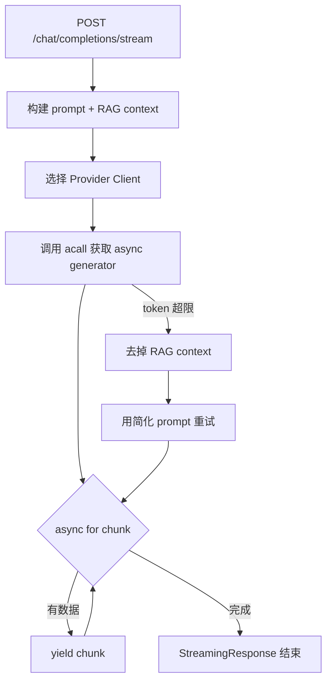
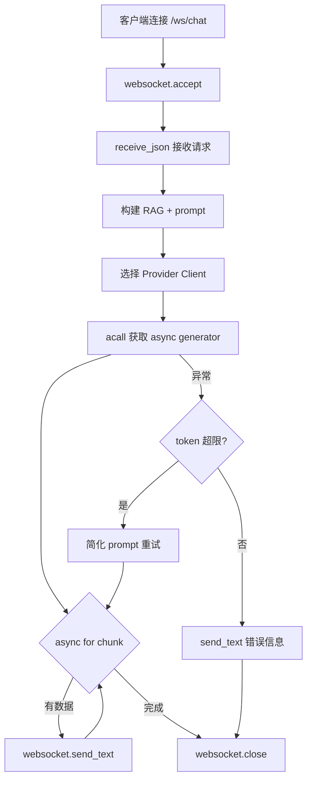
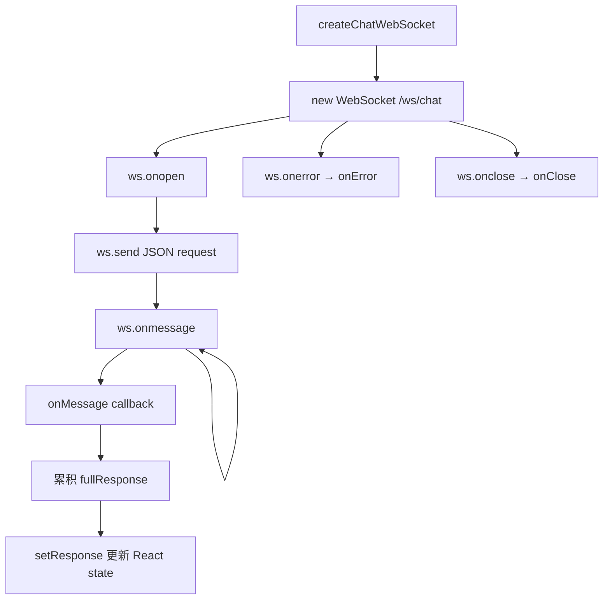

# PD-176.01 DeepWiki — HTTP SSE 与 WebSocket 双通道流式响应

> 文档编号：PD-176.01
> 来源：DeepWiki `api/simple_chat.py` `api/websocket_wiki.py` `src/utils/websocketClient.ts`
> GitHub：https://github.com/AsyncFuncAI/deepwiki-open.git
> 问题域：PD-176 流式响应 Streaming Response
> 状态：可复用方案

---

## 第 1 章 问题与动机

### 1.1 核心问题

LLM 生成响应通常需要数秒到数十秒，如果等待完整响应再返回，用户体验极差。流式响应（Streaming Response）让 LLM 的每个 token 生成后立即推送到前端，实现"打字机效果"，是所有 LLM 应用的基础体验需求。

更深层的挑战在于：
- **多 LLM Provider 适配**：不同 provider（Google、OpenAI、Ollama、OpenRouter、Bedrock、Azure、Dashscope）的流式 API 格式各异，需要统一消费
- **双通道需求**：WebSocket 适合长连接双向通信（Deep Research 多轮迭代），HTTP SSE 适合简单的单次流式请求
- **容错降级**：token 超限时需要自动去掉 RAG 上下文重试，WebSocket 不可用时需要 HTTP 回退

### 1.2 DeepWiki 的解法概述

1. **HTTP SSE 通道**：`api/simple_chat.py:76` 通过 FastAPI `StreamingResponse` + async generator 实现 HTTP 流式推送，前端通过 Next.js API Route 代理转发（`src/app/api/chat/stream/route.ts:50`）
2. **WebSocket 通道**：`api/websocket_wiki.py:63` 通过 FastAPI WebSocket 端点实现双向实时通信，前端 `src/utils/websocketClient.ts:43` 封装连接管理
3. **多 Provider 统一流式接口**：每个 provider client 的 `acall()` 方法返回 async generator，上层通过 `async for chunk in response` 统一消费（`api/websocket_wiki.py:576-713`）
4. **Token 超限自动降级**：检测到 token limit 错误后，去掉 RAG context 用简化 prompt 重试（`api/simple_chat.py:564-736`）
5. **前端流式累积渲染**：React 组件通过 WebSocket onmessage 回调逐 chunk 累积到 state，实现实时渲染（`src/components/Ask.tsx:337-342`）

### 1.3 设计思想

| 设计原则 | 具体实现 | 理由 | 替代方案 |
|----------|----------|------|----------|
| 双通道互补 | HTTP SSE 做简单流 + WebSocket 做双向通信 | WebSocket 适合 Deep Research 多轮迭代，HTTP SSE 兼容性更好 | 纯 SSE 或纯 WebSocket |
| Provider 无关的流式接口 | 每个 client 的 acall() 返回 async generator | 上层代码不关心底层 provider 差异 | 回调模式、Observable |
| 渐进式降级 | token 超限 → 去 RAG context 重试 → 返回错误 | 最大化成功率，避免因 context 过长直接失败 | 直接报错、截断 context |
| 前端代理转发 | Next.js API Route 代理 HTTP 流 | 避免 CORS 问题，隐藏后端地址 | 直连后端、nginx 代理 |

---

## 第 2 章 源码实现分析

### 2.1 架构概览

DeepWiki 的流式响应架构分为三层：前端消费层、API 网关层、Provider 适配层。

```
┌─────────────────────────────────────────────────────────┐
│                    前端 (Next.js)                         │
│                                                          │
│  Ask.tsx ──WebSocket──→ websocketClient.ts               │
│     │                        │                           │
│     └──HTTP fallback──→ /api/chat/stream/route.ts        │
│                              │ (ReadableStream proxy)    │
└──────────────────────────────┼───────────────────────────┘
                               │
┌──────────────────────────────┼───────────────────────────┐
│                    FastAPI Backend                        │
│                                                          │
│  /ws/chat ──→ websocket_wiki.py:handle_websocket_chat()  │
│                    │                                     │
│  /chat/completions/stream ──→ simple_chat.py             │
│                    │         :chat_completions_stream()   │
│                    ▼                                     │
│  ┌─────────────────────────────────────────────┐         │
│  │         Provider 适配层 (acall → async gen)  │         │
│  │                                              │         │
│  │  Google  │ OpenAI │ Ollama │ OpenRouter │ ...│         │
│  │  genai   │ Stream │ acall  │ aiohttp    │    │         │
│  └─────────────────────────────────────────────┘         │
└──────────────────────────────────────────────────────────┘
```

### 2.2 核心实现

#### 2.2.1 HTTP SSE 通道：FastAPI StreamingResponse



对应源码 `api/simple_chat.py:464-739`：

```python
# api/simple_chat.py:464
async def response_stream():
    try:
        if request.provider == "ollama":
            response = await model.acall(api_kwargs=api_kwargs, model_type=ModelType.LLM)
            async for chunk in response:
                text = getattr(chunk, 'response', None) or getattr(chunk, 'text', None) or str(chunk)
                if text and not text.startswith('model=') and not text.startswith('created_at='):
                    text = text.replace('<think>', '').replace('</think>', '')
                    yield text
        elif request.provider == "openai":
            response = await model.acall(api_kwargs=api_kwargs, model_type=ModelType.LLM)
            async for chunk in response:
                choices = getattr(chunk, "choices", [])
                if len(choices) > 0:
                    delta = getattr(choices[0], "delta", None)
                    if delta is not None:
                        text = getattr(delta, "content", None)
                        if text is not None:
                            yield text
        # ... 其他 provider 类似
        else:
            # Google Generative AI (default)
            response = model.generate_content(prompt, stream=True)
            for chunk in response:
                if hasattr(chunk, "text"):
                    yield chunk.text
    except Exception as e_outer:
        # Token limit 降级重试逻辑
        if "maximum context length" in str(e_outer) or "token limit" in str(e_outer):
            # 去掉 RAG context，用简化 prompt 重试
            simplified_prompt = f"/no_think {system_prompt}\n\n"
            # ... 重试流式输出
        else:
            yield f"\nError: {str(e_outer)}"

# api/simple_chat.py:739
return StreamingResponse(response_stream(), media_type="text/event-stream")
```

关键设计：`response_stream()` 是一个 async generator 函数，FastAPI 的 `StreamingResponse` 会自动迭代它并逐 chunk 发送 HTTP 响应。`media_type="text/event-stream"` 告诉浏览器这是 SSE 流。

#### 2.2.2 WebSocket 通道：双向实时通信



对应源码 `api/websocket_wiki.py:63-915`：

```python
# api/websocket_wiki.py:63
async def handle_websocket_chat(websocket: WebSocket):
    await websocket.accept()
    try:
        request_data = await websocket.receive_json()
        request = ChatCompletionRequest(**request_data)

        # ... RAG 准备、prompt 构建 ...

        # 流式推送（以 OpenAI 为例）
        if request.provider == "openai":
            response = await model.acall(api_kwargs=api_kwargs, model_type=ModelType.LLM)
            async for chunk in response:
                choices = getattr(chunk, "choices", [])
                if len(choices) > 0:
                    delta = getattr(choices[0], "delta", None)
                    if delta is not None:
                        text = getattr(delta, "content", None)
                        if text is not None:
                            await websocket.send_text(text)
            await websocket.close()

    except WebSocketDisconnect:
        logger.info("WebSocket disconnected")
    except Exception as e:
        try:
            await websocket.send_text(f"Error: {str(e)}")
            await websocket.close()
        except Exception:
            pass
```

与 HTTP SSE 的关键区别：WebSocket 通道用 `await websocket.send_text(chunk)` 逐条推送，而非 yield；连接生命周期由 WebSocket 协议管理，支持客户端主动断开（`WebSocketDisconnect`）。

#### 2.2.3 前端 WebSocket 客户端封装



对应源码 `src/utils/websocketClient.ts:43-75`：

```typescript
// src/utils/websocketClient.ts:43
export const createChatWebSocket = (
  request: ChatCompletionRequest,
  onMessage: (message: string) => void,
  onError: (error: Event) => void,
  onClose: () => void
): WebSocket => {
  const ws = new WebSocket(getWebSocketUrl());

  ws.onopen = () => {
    console.log('WebSocket connection established');
    ws.send(JSON.stringify(request));
  };

  ws.onmessage = (event) => {
    onMessage(event.data);
  };

  ws.onerror = (error) => {
    console.error('WebSocket error:', error);
    onError(error);
  };

  ws.onclose = () => {
    console.log('WebSocket connection closed');
    onClose();
  };

  return ws;
};
```

前端消费侧 `src/components/Ask.tsx:337-342`：

```typescript
// src/components/Ask.tsx:337
webSocketRef.current = createChatWebSocket(
  requestBody,
  (message: string) => {
    fullResponse += message;
    setResponse(fullResponse);
  },
  (error: Event) => { /* 错误处理 */ },
  () => { setIsLoading(false); }
);
```

### 2.3 实现细节

#### 多 Provider 流式适配差异

不同 provider 的 chunk 格式差异很大，DeepWiki 在 WebSocket handler 中用 if-elif 分支逐一适配：

| Provider | chunk 格式 | 提取方式 | 源码位置 |
|----------|-----------|----------|----------|
| Google | `chunk.text` 属性 | `hasattr(chunk, 'text')` | `websocket_wiki.py:711` |
| OpenAI | `chunk.choices[0].delta.content` | 三层 getattr 链 | `websocket_wiki.py:628-634` |
| Ollama | `chunk.message.content` 或 `chunk.response` | 多重 isinstance + getattr | `websocket_wiki.py:580-601` |
| OpenRouter | 非流式 → async generator 包装 | `acall()` 内部包装为 generator | `openrouter_client.py:139-322` |
| Bedrock | 非流式字符串 | `isinstance(response, str)` | `websocket_wiki.py:647-650` |
| Azure | 同 OpenAI 格式 | `choices[0].delta.content` | `websocket_wiki.py:667-674` |
| Dashscope | 纯文本 chunk | `async for text in response` | `websocket_wiki.py:692-694` |

#### HTTP 流代理（Next.js API Route）

`src/app/api/chat/stream/route.ts:50-72` 实现了 ReadableStream 代理，将后端 HTTP 流透传给浏览器：

```typescript
// src/app/api/chat/stream/route.ts:50
const stream = new ReadableStream({
  async start(controller) {
    const reader = backendResponse.body!.getReader();
    try {
      while (true) {
        const { done, value } = await reader.read();
        if (done) break;
        controller.enqueue(value);
      }
    } catch (error) {
      controller.error(error);
    } finally {
      controller.close();
      reader.releaseLock();
    }
  },
});
```

#### 路由注册

`api/api.py:398-401` 注册双通道路由：

```python
app.add_api_route("/chat/completions/stream", chat_completions_stream, methods=["POST"])
app.add_websocket_route("/ws/chat", handle_websocket_chat)
```


---

## 第 3 章 迁移指南

### 3.1 迁移清单

**阶段 1：基础 HTTP SSE 流式响应**
- [ ] 安装 FastAPI + uvicorn
- [ ] 创建 async generator 函数封装 LLM 调用
- [ ] 用 `StreamingResponse(generator(), media_type="text/event-stream")` 返回
- [ ] 前端用 `fetch` + `ReadableStream` 或 `EventSource` 消费

**阶段 2：WebSocket 双向通道**
- [ ] 添加 FastAPI WebSocket 端点
- [ ] 前端封装 WebSocket 客户端（连接、发送、接收、关闭）
- [ ] 实现 React 组件中的 WebSocket 生命周期管理（useRef + useEffect cleanup）

**阶段 3：多 Provider 适配**
- [ ] 为每个 LLM provider 实现 `acall()` → async generator 接口
- [ ] 统一 chunk 提取逻辑（适配不同 provider 的 chunk 格式）

**阶段 4：容错降级**
- [ ] 实现 token 超限检测 + 简化 prompt 重试
- [ ] WebSocket 断连处理（`WebSocketDisconnect` 捕获）
- [ ] HTTP fallback 通道（WebSocket 不可用时降级到 HTTP SSE）

### 3.2 适配代码模板

#### FastAPI 双通道流式服务端

```python
from fastapi import FastAPI, WebSocket, WebSocketDisconnect
from fastapi.responses import StreamingResponse
from typing import AsyncGenerator

app = FastAPI()

async def llm_stream(prompt: str, provider: str) -> AsyncGenerator[str, None]:
    """统一的 LLM 流式接口 — 所有 provider 返回 async generator"""
    if provider == "openai":
        from openai import AsyncOpenAI
        client = AsyncOpenAI()
        response = await client.chat.completions.create(
            model="gpt-4o",
            messages=[{"role": "user", "content": prompt}],
            stream=True,
        )
        async for chunk in response:
            if chunk.choices[0].delta.content:
                yield chunk.choices[0].delta.content
    elif provider == "google":
        import google.generativeai as genai
        model = genai.GenerativeModel("gemini-pro")
        response = model.generate_content(prompt, stream=True)
        for chunk in response:
            if hasattr(chunk, "text"):
                yield chunk.text
    # ... 其他 provider

# HTTP SSE 通道
@app.post("/chat/stream")
async def chat_stream(request: dict):
    prompt = request["messages"][-1]["content"]
    provider = request.get("provider", "openai")

    async def generate():
        try:
            async for chunk in llm_stream(prompt, provider):
                yield chunk
        except Exception as e:
            if "token limit" in str(e).lower():
                # 降级：去掉 context 重试
                async for chunk in llm_stream(prompt[:2000], provider):
                    yield chunk
            else:
                yield f"\nError: {str(e)}"

    return StreamingResponse(generate(), media_type="text/event-stream")

# WebSocket 通道
@app.websocket("/ws/chat")
async def websocket_chat(websocket: WebSocket):
    await websocket.accept()
    try:
        request_data = await websocket.receive_json()
        prompt = request_data["messages"][-1]["content"]
        provider = request_data.get("provider", "openai")

        async for chunk in llm_stream(prompt, provider):
            await websocket.send_text(chunk)
        await websocket.close()
    except WebSocketDisconnect:
        pass
    except Exception as e:
        await websocket.send_text(f"Error: {str(e)}")
        await websocket.close()
```

#### 前端 WebSocket 客户端 + React Hook

```typescript
// useStreamingChat.ts
import { useRef, useState, useCallback, useEffect } from 'react';

interface StreamingChatOptions {
  wsUrl: string;
  onComplete?: (fullResponse: string) => void;
}

export function useStreamingChat({ wsUrl, onComplete }: StreamingChatOptions) {
  const [response, setResponse] = useState('');
  const [isStreaming, setIsStreaming] = useState(false);
  const wsRef = useRef<WebSocket | null>(null);
  const fullResponseRef = useRef('');

  // Cleanup on unmount
  useEffect(() => {
    return () => {
      if (wsRef.current?.readyState === WebSocket.OPEN) {
        wsRef.current.close();
      }
    };
  }, []);

  const sendMessage = useCallback((request: Record<string, unknown>) => {
    // Close existing connection
    if (wsRef.current?.readyState === WebSocket.OPEN) {
      wsRef.current.close();
    }

    fullResponseRef.current = '';
    setResponse('');
    setIsStreaming(true);

    const ws = new WebSocket(wsUrl);
    wsRef.current = ws;

    ws.onopen = () => ws.send(JSON.stringify(request));

    ws.onmessage = (event) => {
      fullResponseRef.current += event.data;
      setResponse(fullResponseRef.current);
    };

    ws.onclose = () => {
      setIsStreaming(false);
      onComplete?.(fullResponseRef.current);
    };

    ws.onerror = () => {
      setIsStreaming(false);
    };
  }, [wsUrl, onComplete]);

  const cancel = useCallback(() => {
    if (wsRef.current?.readyState === WebSocket.OPEN) {
      wsRef.current.close();
    }
  }, []);

  return { response, isStreaming, sendMessage, cancel };
}
```

### 3.3 适用场景

| 场景 | 适用度 | 说明 |
|------|--------|------|
| LLM 聊天应用 | ⭐⭐⭐ | 最典型场景，HTTP SSE 即可满足 |
| 多轮深度研究 | ⭐⭐⭐ | WebSocket 适合多轮迭代，保持连接 |
| 多 Provider 聚合平台 | ⭐⭐⭐ | async generator 统一接口模式直接可用 |
| 实时协作编辑 | ⭐⭐ | 需要更复杂的 WebSocket 消息协议 |
| 批量生成（无 UI） | ⭐ | 不需要流式，直接等完整响应更简单 |

---

## 第 4 章 测试用例

```python
import pytest
import asyncio
from unittest.mock import AsyncMock, MagicMock, patch
from fastapi.testclient import TestClient
from fastapi import FastAPI, WebSocket
from fastapi.responses import StreamingResponse


# ---- 测试 HTTP SSE 流式响应 ----

class TestHTTPStreamingResponse:
    """测试 FastAPI StreamingResponse 流式输出"""

    def test_streaming_response_yields_chunks(self):
        """正常路径：async generator 逐 chunk 输出"""
        app = FastAPI()

        @app.post("/stream")
        async def stream_endpoint():
            async def generate():
                for word in ["Hello", " ", "World"]:
                    yield word
            return StreamingResponse(generate(), media_type="text/event-stream")

        client = TestClient(app)
        response = client.post("/stream")
        assert response.status_code == 200
        assert response.text == "Hello World"
        assert response.headers["content-type"].startswith("text/event-stream")

    def test_streaming_response_handles_empty_generator(self):
        """边界情况：空 generator"""
        app = FastAPI()

        @app.post("/stream")
        async def stream_endpoint():
            async def generate():
                return
                yield  # noqa: unreachable
            return StreamingResponse(generate(), media_type="text/event-stream")

        client = TestClient(app)
        response = client.post("/stream")
        assert response.status_code == 200
        assert response.text == ""

    def test_streaming_error_yields_error_message(self):
        """降级行为：generator 内异常转为错误文本"""
        app = FastAPI()

        @app.post("/stream")
        async def stream_endpoint():
            async def generate():
                yield "partial"
                raise ValueError("token limit exceeded")
            return StreamingResponse(generate(), media_type="text/event-stream")

        client = TestClient(app)
        # StreamingResponse 会在 chunk 中断时关闭连接
        response = client.post("/stream")
        assert "partial" in response.text


# ---- 测试 WebSocket 流式推送 ----

class TestWebSocketStreaming:
    """测试 WebSocket 流式推送"""

    def test_websocket_sends_chunks_and_closes(self):
        """正常路径：WebSocket 逐 chunk 推送后关闭"""
        app = FastAPI()

        @app.websocket("/ws/chat")
        async def ws_endpoint(websocket: WebSocket):
            await websocket.accept()
            data = await websocket.receive_json()
            for chunk in ["Hello", " ", "World"]:
                await websocket.send_text(chunk)
            await websocket.close()

        client = TestClient(app)
        with client.websocket_connect("/ws/chat") as ws:
            ws.send_json({"messages": [{"role": "user", "content": "hi"}]})
            chunks = []
            try:
                while True:
                    chunks.append(ws.receive_text())
            except Exception:
                pass
            assert "".join(chunks) == "Hello World"

    def test_websocket_handles_disconnect(self):
        """边界情况：客户端提前断开"""
        app = FastAPI()
        disconnected = False

        @app.websocket("/ws/chat")
        async def ws_endpoint(websocket: WebSocket):
            nonlocal disconnected
            await websocket.accept()
            try:
                await websocket.receive_json()
                for i in range(100):
                    await websocket.send_text(f"chunk-{i}")
                    await asyncio.sleep(0.01)
            except Exception:
                disconnected = True

        client = TestClient(app)
        with client.websocket_connect("/ws/chat") as ws:
            ws.send_json({"messages": [{"role": "user", "content": "hi"}]})
            ws.receive_text()  # 只读一个 chunk 就断开


# ---- 测试多 Provider chunk 提取 ----

class TestProviderChunkExtraction:
    """测试不同 provider 的 chunk 格式提取"""

    def test_openai_delta_extraction(self):
        """OpenAI 格式：choices[0].delta.content"""
        chunk = MagicMock()
        delta = MagicMock()
        delta.content = "hello"
        choice = MagicMock()
        choice.delta = delta
        chunk.choices = [choice]

        choices = getattr(chunk, "choices", [])
        assert len(choices) > 0
        text = getattr(choices[0].delta, "content", None)
        assert text == "hello"

    def test_google_text_extraction(self):
        """Google 格式：chunk.text"""
        chunk = MagicMock()
        chunk.text = "hello from google"
        assert hasattr(chunk, "text")
        assert chunk.text == "hello from google"

    def test_ollama_response_extraction(self):
        """Ollama 格式：chunk.response 或 chunk.text"""
        chunk = MagicMock()
        chunk.response = "hello from ollama"
        chunk.text = None
        text = getattr(chunk, 'response', None) or getattr(chunk, 'text', None)
        assert text == "hello from ollama"
```


---

## 第 5 章 跨域关联

| 关联域 | 关系类型 | 说明 |
|--------|----------|------|
| PD-01 上下文管理 | 协同 | 流式响应中的 token 超限降级依赖上下文管理策略（去掉 RAG context 重试） |
| PD-03 容错与重试 | 依赖 | token limit 检测 + 简化 prompt 重试是容错模式在流式场景的具体应用 |
| PD-04 工具系统 | 协同 | 多 Provider client 的 acall() 接口设计属于工具系统的统一抽象 |
| PD-08 搜索与检索 | 协同 | RAG 检索结果作为 context 注入 prompt，流式响应负责推送 RAG 增强后的生成内容 |
| PD-11 可观测性 | 协同 | 流式过程中的 logging（token 计数、provider 选择、错误追踪）是可观测性的一部分 |

---

## 第 6 章 来源文件索引

| 文件 | 行范围 | 关键实现 |
|------|--------|----------|
| `api/simple_chat.py` | L76-L77 | HTTP SSE 端点定义 `@app.post("/chat/completions/stream")` |
| `api/simple_chat.py` | L464-L739 | `response_stream()` async generator + 多 provider 流式分发 + token 降级 |
| `api/websocket_wiki.py` | L63-L68 | WebSocket 端点 `handle_websocket_chat()` 入口 + accept |
| `api/websocket_wiki.py` | L576-L713 | 多 provider WebSocket 流式推送（send_text 逐 chunk） |
| `api/websocket_wiki.py` | L715-L905 | Token 超限降级重试（简化 prompt + fallback 流式） |
| `api/websocket_wiki.py` | L907-L915 | WebSocketDisconnect 异常处理 |
| `api/api.py` | L398-L401 | 双通道路由注册（HTTP + WebSocket） |
| `api/openrouter_client.py` | L112-L348 | OpenRouter acall() 实现：非流式调用 + async generator 包装 |
| `api/openrouter_client.py` | L395-L457 | `_process_streaming_response()` SSE 格式解析（data: prefix + [DONE]） |
| `src/utils/websocketClient.ts` | L10-L15 | `getWebSocketUrl()` HTTP→WS URL 转换 |
| `src/utils/websocketClient.ts` | L43-L75 | `createChatWebSocket()` 连接创建 + 事件绑定 |
| `src/utils/websocketClient.ts` | L81-L85 | `closeWebSocket()` 安全关闭 |
| `src/app/api/chat/stream/route.ts` | L50-L72 | Next.js ReadableStream 代理（HTTP 流透传） |
| `src/components/Ask.tsx` | L278 | WebSocket useRef 引用管理 |
| `src/components/Ask.tsx` | L103-L108 | useEffect cleanup 关闭 WebSocket |
| `src/components/Ask.tsx` | L337-L342 | WebSocket onmessage 回调：累积 fullResponse + setResponse |

---

## 第 7 章 横向对比维度

```json comparison_data
{
  "project": "DeepWiki",
  "dimensions": {
    "传输协议": "HTTP SSE + WebSocket 双通道，WebSocket 为主、HTTP 为 fallback",
    "流式接口": "每个 Provider client 的 acall() 返回 async generator，上层 async for 统一消费",
    "Provider 适配": "7 种 provider 逐一 if-elif 适配，chunk 格式各异需独立提取",
    "容错降级": "token 超限自动去 RAG context 重试，WebSocket 不可用降级 HTTP SSE",
    "前端消费": "WebSocket onmessage 逐 chunk 累积到 React state，Next.js API Route 代理 HTTP 流"
  }
}
```

### 域元数据补充

```json domain_metadata
{
  "solution_summary": "DeepWiki 用 FastAPI StreamingResponse + WebSocket 双通道实现 7 种 LLM Provider 的统一流式推送，含 token 超限自动降级重试",
  "description": "流式响应需要处理多 Provider chunk 格式差异和传输协议选择",
  "sub_problems": [
    "token 超限时的渐进式降级策略",
    "Next.js API Route 作为 HTTP 流代理的透传实现"
  ],
  "best_practices": [
    "每个 Provider client 的 acall() 统一返回 async generator 屏蔽差异",
    "前端 useRef 管理 WebSocket 生命周期，useEffect cleanup 防止内存泄漏"
  ]
}
```

