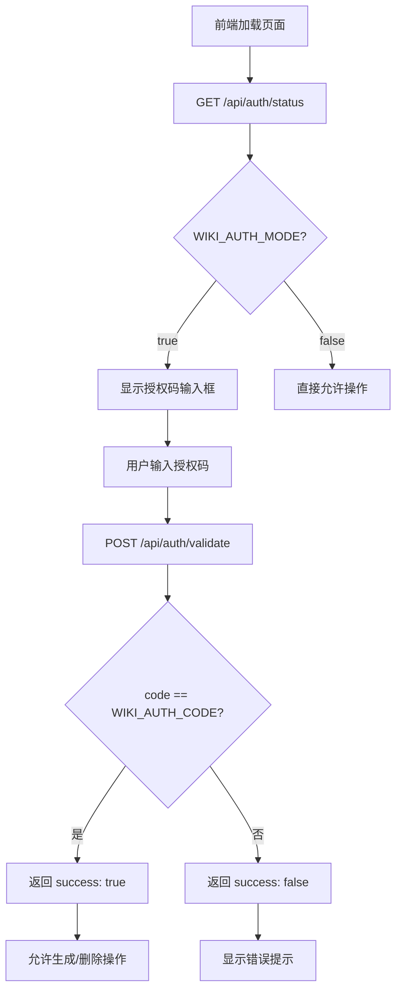
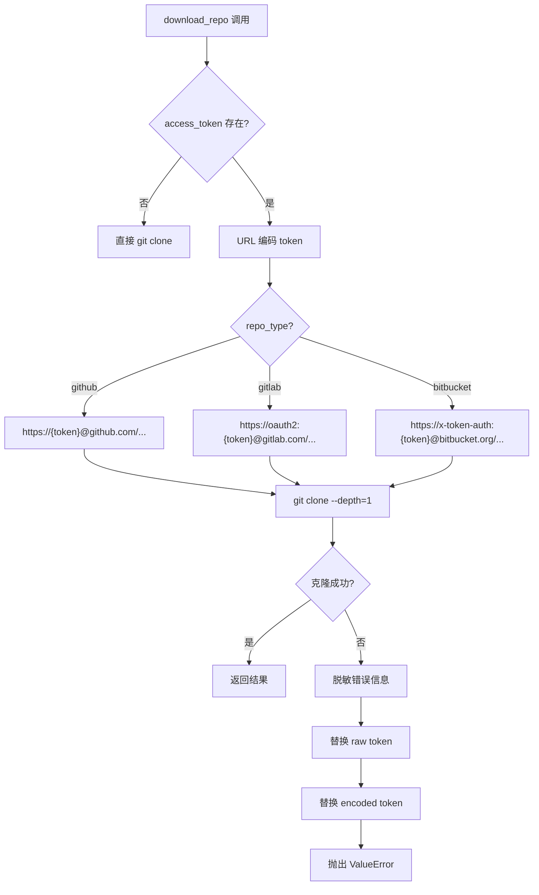

# PD-177.01 DeepWiki — 双层认证：应用授权码 + 多平台 Token 克隆

> 文档编号：PD-177.01
> 来源：DeepWiki `api/config.py` `api/api.py` `api/data_pipeline.py`
> GitHub：https://github.com/AsyncFuncAI/deepwiki-open.git
> 问题域：PD-177 认证授权 Authentication & Authorization
> 状态：可复用方案

---

## 第 1 章 问题与动机

### 1.1 核心问题

开源 Wiki 生成工具面临两层认证需求：

1. **应用级授权** — 谁有权触发 Wiki 生成和删除缓存？公开部署时需要防止滥用，但又不想引入完整的用户系统（注册/登录/角色）。
2. **仓库级认证** — 如何克隆私有仓库？GitHub/GitLab/Bitbucket 三大平台的 token 认证格式各不相同，需要统一抽象。

这两层需求的交叉点在于：应用授权控制"能不能用"，仓库 token 控制"能不能拿到代码"。两者独立但必须协同。

### 1.2 DeepWiki 的解法概述

DeepWiki 采用极简双层认证架构：

1. **环境变量开关式授权** — `DEEPWIKI_AUTH_MODE` 布尔开关控制是否启用应用授权码验证，`DEEPWIKI_AUTH_CODE` 存储授权码。无需数据库、无需 session，纯环境变量驱动（`api/config.py:47-49`）。
2. **前端代理转发** — Next.js API Route 作为 BFF 层，将 `/api/auth/status` 和 `/api/auth/validate` 请求转发到 FastAPI 后端，避免前端直连后端暴露内部地址（`src/app/api/auth/status/route.ts:5-31`）。
3. **按需保护关键端点** — 仅保护 wiki 生成发起和缓存删除两个操作，不保护读取和查询，实现最小权限原则（`api/api.py:520-523`）。
4. **平台感知的 Token URL 构造** — 根据 `repo_type` 参数（github/gitlab/bitbucket）动态构造不同格式的认证 URL，统一 `download_repo()` 接口（`api/data_pipeline.py:106-120`）。
5. **双重 Token 脱敏** — 错误日志中同时替换原始 token 和 URL 编码后的 token，防止任何形式的泄露（`api/data_pipeline.py:140-145`）。

### 1.3 设计思想

| 设计原则 | 具体实现 | 理由 | 替代方案 |
|----------|----------|------|----------|
| 零依赖认证 | 环境变量 + 字符串比较 | 无需数据库/Redis/JWT 库，部署极简 | OAuth2/JWT/Session |
| 开关式降级 | `DEEPWIKI_AUTH_MODE=False` 时完全跳过认证 | 本地开发零摩擦，生产按需启用 | 始终强制认证 |
| BFF 代理隔离 | Next.js Route 转发认证请求 | 前端不直连 FastAPI，隐藏后端拓扑 | 前端直调后端 API |
| 平台适配器模式 | `repo_type` 分支构造不同 URL 格式 | 三平台 token 格式差异大，无法统一 | 要求用户自行构造认证 URL |
| 防御性脱敏 | 错误消息中替换 raw + encoded token | URL 编码后的 token 也是敏感信息 | 仅替换原始 token |

---

## 第 2 章 源码实现分析

### 2.1 架构概览

DeepWiki 的认证系统分为两个独立层，通过前端状态桥接：

```
┌─────────────────────────────────────────────────────────────────┐
│                        前端 (Next.js)                           │
│                                                                 │
│  ┌──────────────┐    ┌───────────────┐    ┌──────────────────┐ │
│  │ ConfigModal  │    │  page.tsx      │    │  TokenInput.tsx  │ │
│  │ authCode输入  │───→│ authCode状态   │    │ accessToken输入  │ │
│  └──────────────┘    │ authRequired   │    └──────────────────┘ │
│                      └───────┬───────┘                          │
│                              │                                  │
│  ┌───────────────────────────┼──────────────────────────────┐  │
│  │          Next.js API Routes (BFF 代理层)                  │  │
│  │  /api/auth/status  →  GET /auth/status                   │  │
│  │  /api/auth/validate → POST /auth/validate                │  │
│  │  /api/wiki_cache    → DELETE /api/wiki_cache             │  │
│  └───────────────────────────┼──────────────────────────────┘  │
└──────────────────────────────┼──────────────────────────────────┘
                               │
┌──────────────────────────────┼──────────────────────────────────┐
│                     后端 (FastAPI)                               │
│                              │                                  │
│  ┌───────────────┐    ┌──────┴──────┐    ┌───────────────────┐ │
│  │  config.py    │    │   api.py    │    │ data_pipeline.py  │ │
│  │ WIKI_AUTH_MODE│───→│ /auth/*     │    │ download_repo()   │ │
│  │ WIKI_AUTH_CODE│    │ DELETE保护   │    │ token→URL构造     │ │
│  └───────────────┘    └─────────────┘    │ 错误脱敏          │ │
│                                          └───────────────────┘ │
└─────────────────────────────────────────────────────────────────┘
```

### 2.2 核心实现

#### 2.2.1 应用授权码验证



对应源码 `api/config.py:47-49`：

```python
# Wiki authentication settings
raw_auth_mode = os.environ.get('DEEPWIKI_AUTH_MODE', 'False')
WIKI_AUTH_MODE = raw_auth_mode.lower() in ['true', '1', 't']
WIKI_AUTH_CODE = os.environ.get('DEEPWIKI_AUTH_CODE', '')
```

对应源码 `api/api.py:144-165`（授权模型 + 验证端点）：

```python
class AuthorizationConfig(BaseModel):
    code: str = Field(..., description="Authorization code")

@app.get("/auth/status")
async def get_auth_status():
    """Check if authentication is required for the wiki."""
    return {"auth_required": WIKI_AUTH_MODE}

@app.post("/auth/validate")
async def validate_auth_code(request: AuthorizationConfig):
    """Check authorization code."""
    return {"success": WIKI_AUTH_CODE == request.code}
```

缓存删除端点的授权保护 `api/api.py:504-523`：

```python
@app.delete("/api/wiki_cache")
async def delete_wiki_cache(
    owner: str = Query(...),
    repo: str = Query(...),
    repo_type: str = Query(...),
    language: str = Query(...),
    authorization_code: Optional[str] = Query(None)
):
    if WIKI_AUTH_MODE:
        logger.info("check the authorization code")
        if not authorization_code or WIKI_AUTH_CODE != authorization_code:
            raise HTTPException(status_code=401, detail="Authorization code is invalid")
```

#### 2.2.2 多平台 Token 认证克隆



对应源码 `api/data_pipeline.py:72-148`：

```python
def download_repo(repo_url: str, local_path: str, repo_type: str = None, access_token: str = None) -> str:
    clone_url = repo_url
    if access_token:
        parsed = urlparse(repo_url)
        encoded_token = quote(access_token, safe='')
        if repo_type == "github":
            clone_url = urlunparse((parsed.scheme, f"{encoded_token}@{parsed.netloc}", parsed.path, '', '', ''))
        elif repo_type == "gitlab":
            clone_url = urlunparse((parsed.scheme, f"oauth2:{encoded_token}@{parsed.netloc}", parsed.path, '', '', ''))
        elif repo_type == "bitbucket":
            clone_url = urlunparse((parsed.scheme, f"x-token-auth:{encoded_token}@{parsed.netloc}", parsed.path, '', '', ''))
        logger.info("Using access token for authentication")

    # 日志中使用 repo_url 而非 clone_url，避免暴露 token
    logger.info(f"Cloning repository from {repo_url} to {local_path}")
    result = subprocess.run(
        ["git", "clone", "--depth=1", "--single-branch", clone_url, local_path],
        check=True, stdout=subprocess.PIPE, stderr=subprocess.PIPE,
    )
```

### 2.3 实现细节

#### 多平台 API Token 认证格式

三大平台的文件内容获取 API 也使用不同的认证头格式：

| 平台 | 克隆 URL 格式 | API 认证头 | 源码位置 |
|------|--------------|-----------|----------|
| GitHub | `{token}@{host}` | `Authorization: token {token}` | `data_pipeline.py:498` |
| GitLab | `oauth2:{token}@{host}` | `PRIVATE-TOKEN: {token}` | `data_pipeline.py:570` |
| Bitbucket | `x-token-auth:{token}@{host}` | `Authorization: Bearer {token}` | `data_pipeline.py:641` |

#### 前端认证状态管理

前端在 `page.tsx:278-281` 维护三个认证状态：

```typescript
const [authRequired, setAuthRequired] = useState<boolean>(false);
const [authCode, setAuthCode] = useState<string>('');
const [isAuthLoading, setIsAuthLoading] = useState<boolean>(true);
```

页面加载时通过 `useEffect` 获取认证状态（`page.tsx:349-369`），失败时默认要求认证（安全优先）：

```typescript
useEffect(() => {
  const fetchAuthStatus = async () => {
    try {
      setIsAuthLoading(true);
      const response = await fetch('/api/auth/status');
      const data = await response.json();
      setAuthRequired(data.auth_required);
    } catch (err) {
      // 获取失败时默认要求认证，安全优先
      setAuthRequired(true);
    } finally {
      setIsAuthLoading(false);
    }
  };
  fetchAuthStatus();
}, [isAskModalOpen]);
```

#### Token 安全处理链

```
用户输入 token → URL 编码 (quote(token, safe=''))
                → 嵌入 clone URL → git clone
                → 成功: 不记录 clone_url
                → 失败: 替换 raw token → 替换 encoded token → 抛出错误
```

双重脱敏代码 `api/data_pipeline.py:139-145`：

```python
if access_token:
    error_msg = error_msg.replace(access_token, "***TOKEN***")
    encoded_token = quote(access_token, safe='')
    error_msg = error_msg.replace(encoded_token, "***TOKEN***")
```

---

## 第 3 章 迁移指南

### 3.1 迁移清单

#### 阶段 1：应用授权码（1 个文件）

- [ ] 添加环境变量 `APP_AUTH_MODE` 和 `APP_AUTH_CODE`
- [ ] 实现 `/auth/status` 和 `/auth/validate` 两个端点
- [ ] 在需要保护的端点添加授权码校验逻辑
- [ ] 前端添加授权码输入 UI 和状态管理

#### 阶段 2：多平台 Token 克隆（1 个文件）

- [ ] 实现 `build_auth_clone_url(repo_url, repo_type, token)` 函数
- [ ] 实现双重 token 脱敏的错误处理
- [ ] 添加 `repo_type` 参数到所有仓库操作接口

#### 阶段 3：多平台 API 认证（3 个函数）

- [ ] 实现 `get_github_file_content()` 带 `Authorization: token` 头
- [ ] 实现 `get_gitlab_file_content()` 带 `PRIVATE-TOKEN` 头
- [ ] 实现 `get_bitbucket_file_content()` 带 `Authorization: Bearer` 头
- [ ] 统一入口 `get_file_content(repo_url, file_path, repo_type, token)`

### 3.2 适配代码模板

#### 应用授权码模块（Python/FastAPI）

```python
import os
from fastapi import HTTPException, Query
from pydantic import BaseModel, Field
from typing import Optional

# 环境变量驱动的授权配置
AUTH_MODE = os.environ.get('APP_AUTH_MODE', 'False').lower() in ['true', '1', 't']
AUTH_CODE = os.environ.get('APP_AUTH_CODE', '')

class AuthRequest(BaseModel):
    code: str = Field(..., description="Authorization code")

def get_auth_status() -> dict:
    """返回当前认证模式状态"""
    return {"auth_required": AUTH_MODE}

def validate_auth_code(code: str) -> dict:
    """验证授权码"""
    return {"success": AUTH_CODE == code}

def require_auth(authorization_code: Optional[str] = Query(None)):
    """FastAPI 依赖注入：保护需要授权的端点"""
    if AUTH_MODE:
        if not authorization_code or AUTH_CODE != authorization_code:
            raise HTTPException(status_code=401, detail="Authorization code is invalid")
```

#### 多平台 Token 克隆模块（Python）

```python
from urllib.parse import urlparse, urlunparse, quote
import subprocess
import logging

logger = logging.getLogger(__name__)

PLATFORM_URL_FORMATS = {
    "github":    lambda token, netloc: f"{token}@{netloc}",
    "gitlab":    lambda token, netloc: f"oauth2:{token}@{netloc}",
    "bitbucket": lambda token, netloc: f"x-token-auth:{token}@{netloc}",
}

PLATFORM_API_HEADERS = {
    "github":    lambda token: {"Authorization": f"token {token}"},
    "gitlab":    lambda token: {"PRIVATE-TOKEN": token},
    "bitbucket": lambda token: {"Authorization": f"Bearer {token}"},
}

def build_auth_clone_url(repo_url: str, repo_type: str, access_token: str) -> str:
    """构造带认证信息的 clone URL"""
    parsed = urlparse(repo_url)
    encoded_token = quote(access_token, safe='')
    formatter = PLATFORM_URL_FORMATS.get(repo_type)
    if not formatter:
        raise ValueError(f"Unsupported repo type: {repo_type}")
    auth_netloc = formatter(encoded_token, parsed.netloc)
    return urlunparse((parsed.scheme, auth_netloc, parsed.path, '', '', ''))

def sanitize_error(error_msg: str, access_token: str) -> str:
    """双重脱敏：替换原始 token 和 URL 编码后的 token"""
    result = error_msg.replace(access_token, "***TOKEN***")
    encoded = quote(access_token, safe='')
    result = result.replace(encoded, "***TOKEN***")
    return result

def clone_repo(repo_url: str, local_path: str, repo_type: str = None, access_token: str = None) -> str:
    """克隆仓库，支持多平台 token 认证"""
    clone_url = repo_url
    if access_token and repo_type:
        clone_url = build_auth_clone_url(repo_url, repo_type, access_token)

    # 日志中使用原始 URL，不暴露 token
    logger.info(f"Cloning from {repo_url} to {local_path}")
    try:
        result = subprocess.run(
            ["git", "clone", "--depth=1", "--single-branch", clone_url, local_path],
            check=True, stdout=subprocess.PIPE, stderr=subprocess.PIPE,
        )
        return result.stdout.decode("utf-8")
    except subprocess.CalledProcessError as e:
        error_msg = e.stderr.decode('utf-8')
        if access_token:
            error_msg = sanitize_error(error_msg, access_token)
        raise ValueError(f"Clone failed: {error_msg}")
```

### 3.3 适用场景

| 场景 | 适用度 | 说明 |
|------|--------|------|
| 开源工具公开部署 | ⭐⭐⭐ | 授权码防滥用，无需用户系统 |
| 内部工具快速上线 | ⭐⭐⭐ | 环境变量配置，零依赖 |
| 多平台 Git 操作 | ⭐⭐⭐ | 统一接口屏蔽平台差异 |
| 需要细粒度权限控制 | ⭐ | 仅支持单一授权码，无角色/权限 |
| 需要用户身份追踪 | ⭐ | 无用户概念，无法审计谁做了什么 |
| 高安全要求场景 | ⭐⭐ | 授权码明文比较，无加密/哈希 |

---

## 第 4 章 测试用例

```python
import pytest
from unittest.mock import patch, MagicMock
from urllib.parse import quote

# ============================================================
# 测试应用授权码验证
# ============================================================

class TestAuthMode:
    """测试 DEEPWIKI_AUTH_MODE 环境变量解析"""

    @pytest.mark.parametrize("env_value,expected", [
        ("True", True),
        ("true", True),
        ("1", True),
        ("t", True),
        ("False", False),
        ("false", False),
        ("0", False),
        ("", False),
        ("yes", False),  # 不支持 yes
    ])
    def test_auth_mode_parsing(self, env_value, expected):
        """验证布尔解析逻辑与 config.py:48 一致"""
        result = env_value.lower() in ['true', '1', 't']
        assert result == expected

    def test_auth_validate_correct_code(self):
        """正确授权码应返回 success: true"""
        auth_code = "my-secret-code"
        request_code = "my-secret-code"
        assert (auth_code == request_code) is True

    def test_auth_validate_wrong_code(self):
        """错误授权码应返回 success: false"""
        auth_code = "my-secret-code"
        request_code = "wrong-code"
        assert (auth_code == request_code) is False

    def test_auth_validate_empty_code(self):
        """空授权码应被拒绝"""
        auth_code = "my-secret-code"
        assert (auth_code == "") is False

    def test_delete_cache_without_auth_when_required(self):
        """启用认证时，无授权码的删除请求应返回 401"""
        wiki_auth_mode = True
        authorization_code = None
        wiki_auth_code = "secret"
        should_reject = wiki_auth_mode and (not authorization_code or wiki_auth_code != authorization_code)
        assert should_reject is True


# ============================================================
# 测试多平台 Token URL 构造
# ============================================================

class TestTokenUrlConstruction:
    """测试 download_repo 中的 token URL 构造逻辑"""

    def test_github_token_url(self):
        """GitHub: token 直接作为用户名"""
        from urllib.parse import urlparse, urlunparse
        repo_url = "https://github.com/owner/repo.git"
        token = "ghp_abc123"
        parsed = urlparse(repo_url)
        encoded = quote(token, safe='')
        clone_url = urlunparse((parsed.scheme, f"{encoded}@{parsed.netloc}", parsed.path, '', '', ''))
        assert clone_url == "https://ghp_abc123@github.com/owner/repo.git"

    def test_gitlab_token_url(self):
        """GitLab: oauth2:{token} 格式"""
        from urllib.parse import urlparse, urlunparse
        repo_url = "https://gitlab.com/owner/repo.git"
        token = "glpat-xyz789"
        parsed = urlparse(repo_url)
        encoded = quote(token, safe='')
        clone_url = urlunparse((parsed.scheme, f"oauth2:{encoded}@{parsed.netloc}", parsed.path, '', '', ''))
        assert "oauth2:glpat-xyz789@gitlab.com" in clone_url

    def test_bitbucket_token_url(self):
        """Bitbucket: x-token-auth:{token} 格式"""
        from urllib.parse import urlparse, urlunparse
        repo_url = "https://bitbucket.org/owner/repo.git"
        token = "bb_token_456"
        parsed = urlparse(repo_url)
        encoded = quote(token, safe='')
        clone_url = urlunparse((parsed.scheme, f"x-token-auth:{encoded}@{parsed.netloc}", parsed.path, '', '', ''))
        assert "x-token-auth:bb_token_456@bitbucket.org" in clone_url

    def test_special_chars_in_token(self):
        """含特殊字符的 token 应被 URL 编码"""
        token = "token/with+special=chars&more"
        encoded = quote(token, safe='')
        assert "/" not in encoded
        assert "+" not in encoded
        assert "=" not in encoded
        assert "&" not in encoded


# ============================================================
# 测试 Token 脱敏
# ============================================================

class TestTokenSanitization:
    """测试错误消息中的 token 脱敏"""

    def test_raw_token_sanitized(self):
        """原始 token 应被替换"""
        token = "ghp_secret123"
        error = f"fatal: Authentication failed for 'https://{token}@github.com/...'"
        sanitized = error.replace(token, "***TOKEN***")
        assert token not in sanitized
        assert "***TOKEN***" in sanitized

    def test_encoded_token_sanitized(self):
        """URL 编码后的 token 也应被替换"""
        token = "token/with+special"
        encoded = quote(token, safe='')
        error = f"fatal: could not read from 'https://{encoded}@github.com/...'"
        sanitized = error.replace(token, "***TOKEN***")
        sanitized = sanitized.replace(encoded, "***TOKEN***")
        assert token not in sanitized
        assert encoded not in sanitized

    def test_no_token_no_sanitization(self):
        """无 token 时错误消息不变"""
        error = "fatal: repository not found"
        assert error == "fatal: repository not found"
```

---

## 第 5 章 跨域关联

| 关联域 | 关系类型 | 说明 |
|--------|----------|------|
| PD-04 工具系统 | 协同 | Token 认证是工具系统访问外部 Git 平台 API 的前置条件，`get_file_content()` 统一了三平台的认证头格式 |
| PD-08 搜索与检索 | 依赖 | RAG 检索依赖仓库克隆成功，私有仓库必须先通过 token 认证才能建立向量索引 |
| PD-11 可观测性 | 协同 | 日志中的 token 脱敏是可观测性的安全约束，`logger.info` 使用原始 URL 而非 clone URL |
| PD-155 认证会话管理 | 互补 | PD-155 聚焦 OAuth + Session 的完整认证流程，PD-177 是极简授权码方案，两者适用于不同复杂度场景 |

---

## 第 6 章 来源文件索引

| 文件 | 行范围 | 关键实现 |
|------|--------|----------|
| `api/config.py` | L47-L49 | `WIKI_AUTH_MODE` / `WIKI_AUTH_CODE` 环境变量解析 |
| `api/config.py` | L19-L44 | 多平台 API Key 环境变量加载 |
| `api/api.py` | L144-L145 | `AuthorizationConfig` Pydantic 模型 |
| `api/api.py` | L153-L165 | `/auth/status` 和 `/auth/validate` 端点 |
| `api/api.py` | L504-L538 | `DELETE /api/wiki_cache` 授权码保护 |
| `api/data_pipeline.py` | L72-L148 | `download_repo()` 多平台 token 克隆 |
| `api/data_pipeline.py` | L106-L120 | 三平台 URL 格式构造 |
| `api/data_pipeline.py` | L139-L145 | 双重 token 脱敏 |
| `api/data_pipeline.py` | L452-L527 | `get_github_file_content()` GitHub API 认证 |
| `api/data_pipeline.py` | L529-L609 | `get_gitlab_file_content()` GitLab API 认证 |
| `api/data_pipeline.py` | L611-L684 | `get_bitbucket_file_content()` Bitbucket API 认证 |
| `api/data_pipeline.py` | L687-L710 | `get_file_content()` 统一入口 |
| `src/app/api/auth/status/route.ts` | L1-L31 | Next.js BFF 代理 auth/status |
| `src/app/api/auth/validate/route.ts` | L1-L34 | Next.js BFF 代理 auth/validate |
| `src/app/[owner]/[repo]/page.tsx` | L278-L281 | 前端认证状态定义 |
| `src/app/[owner]/[repo]/page.tsx` | L349-L369 | 前端获取认证状态 |
| `src/app/[owner]/[repo]/page.tsx` | L1580-L1632 | 前端授权码校验与缓存删除 |
| `src/components/TokenInput.tsx` | L1-L108 | 多平台 token 输入组件 |
| `src/components/ConfigurationModal.tsx` | L246-L273 | 授权码输入 UI |

---

## 第 7 章 横向对比维度

> 本章用于自动填充 Butcher Wiki 的横向对比表。

```json comparison_data
{
  "project": "DeepWiki",
  "dimensions": {
    "认证架构": "双层分离：应用授权码(环境变量) + 仓库Token(用户输入)",
    "授权模式": "环境变量开关式，DEEPWIKI_AUTH_MODE 布尔控制",
    "多平台适配": "GitHub/GitLab/Bitbucket 三平台 URL 格式 + API 头适配",
    "Token安全": "双重脱敏(raw+encoded)，日志使用原始URL不含token",
    "前后端协作": "Next.js BFF 代理转发，前端不直连 FastAPI 后端",
    "保护粒度": "仅保护生成发起和缓存删除，读取操作不受限"
  }
}
```

### 域元数据补充

```json domain_metadata
{
  "solution_summary": "DeepWiki 用环境变量开关式授权码保护 Wiki 生成入口，同时通过 repo_type 分支构造 GitHub/GitLab/Bitbucket 三平台差异化 Token URL 实现私有仓库克隆",
  "description": "轻量级应用授权与多 Git 平台 Token 认证的工程实践",
  "sub_problems": [
    "BFF 代理层认证请求转发与后端拓扑隐藏",
    "认证状态获取失败时的安全降级策略"
  ],
  "best_practices": [
    "前端获取认证状态失败时默认要求认证(安全优先)",
    "Next.js API Route 作为 BFF 代理隐藏后端地址",
    "git clone 日志使用原始 URL 而非含 token 的 clone URL"
  ]
}
```
