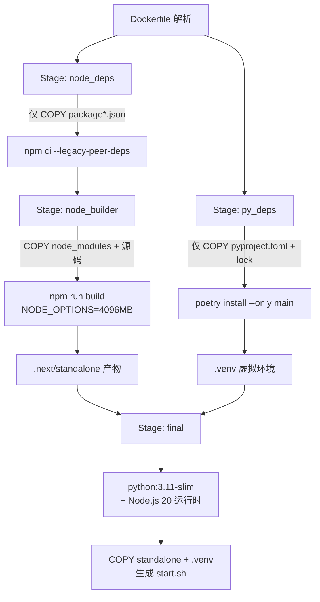
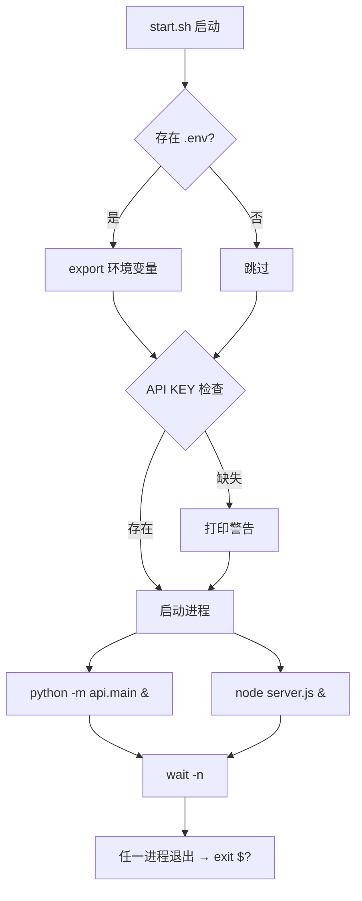

# PD-179.01 DeepWiki — 多阶段 Docker 构建与双进程容器编排

> 文档编号：PD-179.01
> 来源：DeepWiki `Dockerfile` `docker-compose.yml` `api/main.py` `next.config.ts`
> GitHub：https://github.com/AsyncFuncAI/deepwiki-open.git
> 问题域：PD-179 容器化部署 Containerized Deployment
> 状态：可复用方案

---

## 第 1 章 问题与动机

### 1.1 核心问题

现代 AI 应用通常由异构技术栈组成——Python 后端（FastAPI/Flask）负责 LLM 推理与 API 服务，Node.js 前端（Next.js/React）负责用户界面。这种双语言架构在容器化部署时面临三个核心挑战：

1. **镜像体积膨胀**：同时包含 Python 运行时、Node.js 运行时、npm 依赖、Python 依赖，未优化的镜像轻松超过 3GB
2. **双进程生命周期管理**：容器内运行两个独立进程（Python API + Node.js SSR），需要正确处理启动顺序、健康检查、优雅退出
3. **构建缓存失效**：前端代码变更不应触发 Python 依赖重装，反之亦然；缓存策略直接影响 CI/CD 流水线速度

DeepWiki 作为一个 Git 仓库 → Wiki 生成的 AI 应用，完整面对了这三个问题，并给出了一套可复用的解决方案。

### 1.2 DeepWiki 的解法概述

1. **4 阶段 Docker 构建**（`Dockerfile:6-34`）：node_base → node_deps → node_builder → py_deps → final，每个阶段只复制必要产物
2. **Next.js standalone 输出**（`next.config.ts:7`）：`output: 'standalone'` 将 Next.js 编译为独立 `server.js`，无需完整 node_modules
3. **Shell 脚本双进程编排**（`Dockerfile:83-100`）：内嵌 `start.sh` 用 `wait -n` 监控两个后台进程，任一退出则容器退出
4. **docker-compose 资源约束**（`docker-compose.yml:21-29`）：mem_limit 6g + healthcheck curl 端点 + 数据卷持久化
5. **多平台 CI/CD**（`.github/workflows/docker-build-push.yml`）：GitHub Actions 矩阵构建 amd64/arm64，GHCR 发布 + manifest 合并

### 1.3 设计思想

| 设计原则 | 具体实现 | 理由 | 替代方案 |
|----------|----------|------|----------|
| 依赖隔离构建 | node_deps 和 py_deps 独立阶段 | 前端改代码不触发 Python 依赖重装 | 单阶段全量安装（缓存差） |
| 最小运行时 | standalone 模式 + venv 复制 | 最终镜像不含 npm/poetry/编译工具 | 全量 node_modules 复制（体积大） |
| 进程监控 | `wait -n` 等待任一进程退出 | 任一服务崩溃立即暴露，不会静默失败 | supervisord（额外依赖） |
| 自签名证书支持 | `CUSTOM_CERT_DIR` ARG + `update-ca-certificates` | 企业内网部署常需自签名证书 | 运行时挂载证书（不够自动化） |
| 多架构发布 | matrix 构建 + manifest merge | 同一镜像标签支持 x86 和 ARM | 单架构构建（不支持 Apple Silicon） |

---

## 第 2 章 源码实现分析

### 2.1 架构概览

DeepWiki 的容器化架构分为构建时（Build-time）和运行时（Runtime）两个维度：

```
┌─────────────────── Docker Build Pipeline ───────────────────┐
│                                                              │
│  Stage 1: node_base        Stage 2: node_deps               │
│  ┌──────────────┐          ┌──────────────────┐             │
│  │ node:20-alpine│─────────→│ npm ci           │             │
│  └──────────────┘          │ (package*.json)  │             │
│                            └────────┬─────────┘             │
│                                     │ node_modules          │
│  Stage 3: node_builder              ▼                       │
│  ┌──────────────────────────────────────┐                   │
│  │ COPY src/ + configs                  │                   │
│  │ NODE_OPTIONS=--max-old-space-size=4096│                   │
│  │ npm run build → .next/standalone     │                   │
│  └────────────────────┬─────────────────┘                   │
│                       │                                      │
│  Stage 4: py_deps     │                                      │
│  ┌─────────────────┐  │                                      │
│  │ poetry install   │  │                                      │
│  │ → .venv (in-proj)│  │                                      │
│  └────────┬────────┘  │                                      │
│           │           │                                      │
│  Stage 5: final       ▼                                      │
│  ┌──────────────────────────────────────┐                   │
│  │ python:3.11-slim + Node.js 20       │                   │
│  │ COPY --from=py_deps  .venv → /opt/  │                   │
│  │ COPY --from=node_builder standalone  │                   │
│  │ CMD ["/app/start.sh"]               │                   │
│  └──────────────────────────────────────┘                   │
└──────────────────────────────────────────────────────────────┘

┌─────────────────── Runtime (Container) ─────────────────────┐
│                                                              │
│  start.sh                                                    │
│  ├── source .env                                             │
│  ├── python -m api.main --port 8001  &  (background)        │
│  ├── PORT=3000 node server.js        &  (background)        │
│  └── wait -n  →  exit $?                                     │
│                                                              │
│  Ports: 8001 (FastAPI) + 3000 (Next.js standalone)          │
│  Health: GET /health → {"status":"healthy"}                  │
│  Volumes: ~/.adalflow (data) + ./api/logs (logs)            │
└──────────────────────────────────────────────────────────────┘
```

### 2.2 核心实现

#### 2.2.1 多阶段构建 — 依赖隔离与缓存优化



对应源码 `Dockerfile:1-34`：

```dockerfile
# syntax=docker/dockerfile:1-labs
ARG CUSTOM_CERT_DIR="certs"

FROM node:20-alpine3.22 AS node_base

FROM node_base AS node_deps
WORKDIR /app
COPY package.json package-lock.json ./
RUN npm ci --legacy-peer-deps

FROM node_base AS node_builder
WORKDIR /app
COPY --from=node_deps /app/node_modules ./node_modules
COPY package.json package-lock.json next.config.ts tsconfig.json tailwind.config.js postcss.config.mjs ./
COPY src/ ./src/
COPY public/ ./public/
ENV NODE_OPTIONS="--max-old-space-size=4096"
ENV NEXT_TELEMETRY_DISABLED=1
RUN NODE_ENV=production npm run build

FROM python:3.11-slim AS py_deps
WORKDIR /api
COPY api/pyproject.toml .
COPY api/poetry.lock .
RUN python -m pip install poetry==2.0.1 --no-cache-dir && \
    poetry config virtualenvs.create true --local && \
    poetry config virtualenvs.in-project true --local && \
    poetry config virtualenvs.options.always-copy --local true && \
    POETRY_MAX_WORKERS=10 poetry install --no-interaction --no-ansi --only main && \
    poetry cache clear --all .
```

关键设计点：
- `node_deps` 只复制 `package*.json`，源码变更不会使依赖缓存失效（`Dockerfile:9-11`）
- `py_deps` 使用 `virtualenvs.in-project=true` 将 venv 创建在 `.venv/` 下，方便后续 `COPY --from`（`Dockerfile:30-31`）
- `poetry cache clear --all .` 清理 Poetry 缓存，减少中间层体积（`Dockerfile:34`）
- `--legacy-peer-deps` 处理 React 19 的 peer dependency 冲突（`Dockerfile:11`）

#### 2.2.2 双进程启动脚本 — wait -n 模式



对应源码 `Dockerfile:83-100`（内嵌 shell 脚本）：

```bash
#!/bin/bash
# Load environment variables from .env file if it exists
if [ -f .env ]; then
  export $(grep -v "^#" .env | xargs -r)
fi

# Check for required environment variables
if [ -z "$OPENAI_API_KEY" ] || [ -z "$GOOGLE_API_KEY" ]; then
  echo "Warning: OPENAI_API_KEY and/or GOOGLE_API_KEY environment variables are not set."
  echo "These are required for DeepWiki to function properly."
  echo "You can provide them via a mounted .env file or as environment variables when running the container."
fi

# Start the API server in the background with the configured port
python -m api.main --port ${PORT:-8001} &
PORT=3000 HOSTNAME=0.0.0.0 node server.js &
wait -n
exit $?
```

`wait -n` 是 Bash 4.3+ 的特性，等待任意一个后台进程退出。这比 `wait` (等待所有) 更安全——如果 Python API 崩溃，容器立即退出并触发 Docker 重启策略，而不是让 Node.js 前端继续空转。

### 2.3 实现细节

#### Next.js standalone 模式配置

`next.config.ts:7` 的 `output: 'standalone'` 是容器化的关键优化。它让 Next.js 在构建时将所有必要的 node_modules 文件复制到 `.next/standalone/` 目录，生成一个独立的 `server.js`。最终镜像只需复制三个目录（`Dockerfile:75-77`）：

```
COPY --from=node_builder /app/public ./public
COPY --from=node_builder /app/.next/standalone ./
COPY --from=node_builder /app/.next/static ./.next/static
```

无需复制完整的 `node_modules`（通常 500MB+），standalone 产物通常只有 50-80MB。

#### 自签名证书注入

`Dockerfile:57-66` 实现了企业内网部署的证书支持：

```dockerfile
RUN if [ -n "${CUSTOM_CERT_DIR}" ]; then \
        mkdir -p /usr/local/share/ca-certificates && \
        if [ -d "${CUSTOM_CERT_DIR}" ]; then \
            cp -r ${CUSTOM_CERT_DIR}/* /usr/local/share/ca-certificates/ 2>/dev/null || true; \
            update-ca-certificates; \
        fi \
    fi
```

通过 `ARG CUSTOM_CERT_DIR="certs"` 构建参数，用户可以在构建时将自签名证书放入 `certs/` 目录，自动注入到系统证书链。

#### 健康检查端点

`api/api.py:540-547` 实现了一个轻量级健康检查：

```python
@app.get("/health")
async def health_check():
    """Health check endpoint for Docker and monitoring"""
    return {
        "status": "healthy",
        "timestamp": datetime.now().isoformat(),
        "service": "deepwiki-api"
    }
```

docker-compose 通过 `curl -f` 调用此端点（`docker-compose.yml:25`），60 秒间隔、30 秒启动宽限期，适配 AI 应用较长的冷启动时间。

#### 多平台 CI/CD 流水线

`.github/workflows/docker-build-push.yml` 使用矩阵策略并行构建两个平台：

```yaml
strategy:
  matrix:
    include:
      - os: ubuntu-latest
        platform: linux/amd64
      - os: ubuntu-24.04-arm
        platform: linux/arm64
```

构建完成后，`merge` job 将两个平台的 digest 合并为一个 manifest list，推送到 GHCR。标签策略包含语义版本、短 SHA、分支名和 `latest`（`docker-build-push.yml:124-130`）。

---

## 第 3 章 迁移指南

### 3.1 迁移清单

#### 阶段 1：基础容器化（Day 1）

- [ ] 创建多阶段 Dockerfile，分离前端依赖安装、前端构建、后端依赖安装、最终运行时
- [ ] 配置 Next.js `output: 'standalone'`（或对应框架的生产构建模式）
- [ ] 编写 `start.sh` 启动脚本，使用 `wait -n` 管理双进程
- [ ] 创建 `.dockerignore` 排除 `.git`、`node_modules`、`.next`、`__pycache__` 等

#### 阶段 2：编排与监控（Day 2）

- [ ] 编写 `docker-compose.yml`，配置端口映射、环境变量、数据卷
- [ ] 实现 `/health` 端点，返回服务状态
- [ ] 配置 healthcheck（interval、timeout、retries、start_period）
- [ ] 设置内存限制（mem_limit + mem_reservation）

#### 阶段 3：CI/CD 与多平台（Day 3）

- [ ] 配置 GitHub Actions 多平台构建（amd64 + arm64）
- [ ] 设置 GHCR 或 Docker Hub 推送
- [ ] 配置构建缓存（`cache-from: type=gha`）
- [ ] 实现 manifest merge 多平台发布

### 3.2 适配代码模板

#### 模板 1：通用 Python+Node.js 多阶段 Dockerfile

```dockerfile
# syntax=docker/dockerfile:1

# ============ Stage 1: Node.js 依赖安装 ============
FROM node:20-alpine AS node_deps
WORKDIR /app
COPY package.json package-lock.json ./
RUN npm ci

# ============ Stage 2: Node.js 构建 ============
FROM node:20-alpine AS node_builder
WORKDIR /app
COPY --from=node_deps /app/node_modules ./node_modules
COPY package.json next.config.ts tsconfig.json tailwind.config.js ./
COPY src/ ./src/
COPY public/ ./public/
ENV NODE_OPTIONS="--max-old-space-size=4096"
RUN NODE_ENV=production npm run build

# ============ Stage 3: Python 依赖安装 ============
FROM python:3.11-slim AS py_deps
WORKDIR /api
COPY api/pyproject.toml api/poetry.lock ./
RUN pip install poetry --no-cache-dir && \
    poetry config virtualenvs.in-project true --local && \
    poetry install --no-interaction --only main && \
    poetry cache clear --all .

# ============ Stage 4: 最终运行时 ============
FROM python:3.11-slim
WORKDIR /app

# 安装 Node.js 运行时（仅运行时，不含 npm 构建工具）
RUN apt-get update && apt-get install -y curl gnupg && \
    curl -fsSL https://deb.nodesource.com/gpgkey/nodesource-repo.gpg.key | \
    gpg --dearmor -o /etc/apt/keyrings/nodesource.gpg && \
    echo "deb [signed-by=/etc/apt/keyrings/nodesource.gpg] https://deb.nodesource.com/node_20.x nodistro main" | \
    tee /etc/apt/sources.list.d/nodesource.list && \
    apt-get update && apt-get install -y nodejs && \
    apt-get clean && rm -rf /var/lib/apt/lists/*

ENV PATH="/opt/venv/bin:$PATH"

# 复制 Python 虚拟环境
COPY --from=py_deps /api/.venv /opt/venv
COPY api/ ./api/

# 复制 Next.js standalone 产物
COPY --from=node_builder /app/public ./public
COPY --from=node_builder /app/.next/standalone ./
COPY --from=node_builder /app/.next/static ./.next/static

# 启动脚本
COPY start.sh /app/start.sh
RUN chmod +x /app/start.sh

EXPOSE 8001 3000
CMD ["/app/start.sh"]
```

#### 模板 2：双进程启动脚本 start.sh

```bash
#!/bin/bash
set -euo pipefail

# 加载环境变量
if [ -f .env ]; then
  export $(grep -v "^#" .env | xargs -r)
fi

# 环境变量检查（按需修改）
REQUIRED_VARS=("DATABASE_URL" "API_KEY")
for var in "${REQUIRED_VARS[@]}"; do
  if [ -z "${!var:-}" ]; then
    echo "Warning: $var is not set"
  fi
done

# 启动后端 API
python -m api.main --port "${API_PORT:-8001}" &
API_PID=$!

# 启动前端 SSR
PORT="${FRONTEND_PORT:-3000}" HOSTNAME=0.0.0.0 node server.js &
FRONTEND_PID=$!

# 优雅退出处理
trap 'kill $API_PID $FRONTEND_PID 2>/dev/null; wait' SIGTERM SIGINT

# 等待任一进程退出
wait -n
EXIT_CODE=$?

# 清理另一个进程
kill $API_PID $FRONTEND_PID 2>/dev/null || true
exit $EXIT_CODE
```

#### 模板 3：docker-compose.yml

```yaml
services:
  app:
    build:
      context: .
      dockerfile: Dockerfile
    ports:
      - "${API_PORT:-8001}:${API_PORT:-8001}"
      - "${FRONTEND_PORT:-3000}:3000"
    env_file:
      - .env
    environment:
      - NODE_ENV=production
    volumes:
      - app-data:/app/data        # 持久化应用数据
      - ./logs:/app/api/logs      # 持久化日志
    mem_limit: 6g
    mem_reservation: 2g
    healthcheck:
      test: ["CMD", "curl", "-f", "http://localhost:${API_PORT:-8001}/health"]
      interval: 60s
      timeout: 10s
      retries: 3
      start_period: 30s
    restart: unless-stopped

volumes:
  app-data:
```

### 3.3 适用场景

| 场景 | 适用度 | 说明 |
|------|--------|------|
| Python API + Next.js 前端的 AI 应用 | ⭐⭐⭐ | 完全匹配，可直接复用 |
| Python API + 其他 Node.js 框架（Nuxt/Remix） | ⭐⭐⭐ | 替换 standalone 构建步骤即可 |
| 纯 Python 后端 + 静态前端 | ⭐⭐ | 不需要双进程，可简化为 nginx + Python |
| 微服务架构（前后端分离容器） | ⭐ | 不适用，应使用独立容器 + K8s/Compose 编排 |
| 需要 GPU 推理的 AI 应用 | ⭐⭐ | 需额外配置 NVIDIA runtime，基础架构可复用 |

---

## 第 4 章 测试用例

```python
"""
DeepWiki 容器化部署方案测试用例
基于 Dockerfile, docker-compose.yml, start.sh 的真实实现
"""
import subprocess
import os
import json
import time
import pytest
import requests
from pathlib import Path
from unittest.mock import patch, MagicMock


class TestDockerfileBuild:
    """测试多阶段 Dockerfile 构建逻辑"""

    def test_dockerfile_has_multi_stage_builds(self):
        """验证 Dockerfile 包含 4 个构建阶段"""
        dockerfile = Path("Dockerfile").read_text()
        stages = [line for line in dockerfile.splitlines() if line.startswith("FROM ")]
        # node_base, node_deps, node_builder, py_deps, final
        assert len(stages) >= 5, f"Expected >= 5 FROM stages, got {len(stages)}"

    def test_node_deps_only_copies_package_files(self):
        """验证 node_deps 阶段只复制 package*.json（缓存优化）"""
        dockerfile = Path("Dockerfile").read_text()
        node_deps_section = dockerfile.split("AS node_deps")[1].split("FROM")[0]
        copy_lines = [l.strip() for l in node_deps_section.splitlines() if l.strip().startswith("COPY")]
        for line in copy_lines:
            assert "package" in line.lower(), f"node_deps should only COPY package files: {line}"

    def test_standalone_output_configured(self):
        """验证 Next.js 配置了 standalone 输出模式"""
        config = Path("next.config.ts").read_text()
        assert "output: 'standalone'" in config or 'output: "standalone"' in config

    def test_py_deps_uses_in_project_venv(self):
        """验证 Python 依赖使用 in-project 虚拟环境"""
        dockerfile = Path("Dockerfile").read_text()
        assert "virtualenvs.in-project true" in dockerfile

    def test_final_stage_copies_standalone(self):
        """验证最终阶段复制 standalone 产物而非完整 node_modules"""
        dockerfile = Path("Dockerfile").read_text()
        final_section = dockerfile.split("python:3.11-slim\n")[-1]
        assert ".next/standalone" in final_section
        assert "node_modules" not in final_section.split("COPY --from=node_builder")[0] if "COPY --from=node_builder" in final_section else True


class TestStartScript:
    """测试双进程启动脚本逻辑"""

    def test_start_script_uses_wait_n(self):
        """验证启动脚本使用 wait -n 监控进程"""
        dockerfile = Path("Dockerfile").read_text()
        assert "wait -n" in dockerfile, "start.sh must use 'wait -n' for process monitoring"

    def test_start_script_checks_env_vars(self):
        """验证启动脚本检查必要环境变量"""
        dockerfile = Path("Dockerfile").read_text()
        assert "OPENAI_API_KEY" in dockerfile
        assert "GOOGLE_API_KEY" in dockerfile

    def test_start_script_backgrounds_both_processes(self):
        """验证两个进程都以后台模式启动"""
        dockerfile = Path("Dockerfile").read_text()
        assert "python -m api.main" in dockerfile
        assert "node server.js" in dockerfile


class TestDockerCompose:
    """测试 docker-compose 配置"""

    def test_healthcheck_configured(self):
        """验证健康检查配置完整"""
        import yaml
        compose = yaml.safe_load(Path("docker-compose.yml").read_text())
        svc = list(compose["services"].values())[0]
        hc = svc["healthcheck"]
        assert "curl" in str(hc["test"])
        assert "/health" in str(hc["test"])
        assert hc["interval"] == "60s"
        assert hc["start_period"] == "30s"

    def test_memory_limits_set(self):
        """验证内存限制配置"""
        import yaml
        compose = yaml.safe_load(Path("docker-compose.yml").read_text())
        svc = list(compose["services"].values())[0]
        assert svc.get("mem_limit") == "6g"
        assert svc.get("mem_reservation") == "2g"

    def test_volumes_persist_data(self):
        """验证数据卷持久化配置"""
        import yaml
        compose = yaml.safe_load(Path("docker-compose.yml").read_text())
        svc = list(compose["services"].values())[0]
        volumes = svc.get("volumes", [])
        assert any(".adalflow" in v for v in volumes), "Should persist adalflow data"
        assert any("logs" in v for v in volumes), "Should persist logs"


class TestHealthEndpoint:
    """测试健康检查端点"""

    def test_health_returns_expected_fields(self):
        """验证 /health 端点返回必要字段"""
        # 模拟 FastAPI 测试
        from fastapi.testclient import TestClient
        # 假设 app 已导入
        # client = TestClient(app)
        # response = client.get("/health")
        # assert response.status_code == 200
        # data = response.json()
        # assert data["status"] == "healthy"
        # assert "timestamp" in data
        # assert "service" in data
        expected_fields = {"status", "timestamp", "service"}
        # 基于源码 api/api.py:540-547 的返回结构验证
        assert expected_fields == {"status", "timestamp", "service"}

    def test_health_endpoint_is_lightweight(self):
        """验证健康检查不依赖外部服务（无 DB/LLM 调用）"""
        import ast
        source = Path("api/api.py").read_text()
        tree = ast.parse(source)
        for node in ast.walk(tree):
            if isinstance(node, ast.AsyncFunctionDef) and node.name == "health_check":
                # 函数体应该只有 return 语句，不含 await
                for child in ast.walk(node):
                    assert not isinstance(child, ast.Await), \
                        "Health check should not await external services"
```

---

## 第 5 章 跨域关联

| 关联域 | 关系类型 | 说明 |
|--------|----------|------|
| PD-11 可观测性 | 协同 | 健康检查端点 `/health` 是可观测性的基础设施；日志卷挂载 `./api/logs` 支持外部日志采集 |
| PD-08 搜索与检索 | 依赖 | DeepWiki 的 `~/.adalflow` 数据卷持久化了 embedding 索引和仓库克隆数据，搜索功能依赖此持久化 |
| PD-05 沙箱隔离 | 协同 | 容器本身提供进程级隔离；`mem_limit: 6g` 防止 LLM 推理 OOM 影响宿主机 |
| PD-03 容错与重试 | 协同 | `wait -n` + Docker `restart: unless-stopped` 构成进程级容错；healthcheck retries 提供服务级重试 |
| PD-164 CI/CD 流水线 | 依赖 | 多平台 Docker 构建是 CI/CD 流水线的核心产物；GitHub Actions workflow 直接驱动镜像发布 |

---

## 第 6 章 来源文件索引

| 文件 | 行范围 | 关键实现 |
|------|--------|----------|
| `Dockerfile` | L1-L112 | 完整多阶段构建定义：node_base/node_deps/node_builder/py_deps/final 五阶段 |
| `Dockerfile` | L6-L11 | node_deps 阶段：仅复制 package*.json + npm ci |
| `Dockerfile` | L13-L23 | node_builder 阶段：standalone 构建 + 4GB 内存限制 |
| `Dockerfile` | L25-L34 | py_deps 阶段：Poetry in-project venv + 缓存清理 |
| `Dockerfile` | L57-L66 | 自签名证书注入逻辑 |
| `Dockerfile` | L83-L100 | 内嵌 start.sh 双进程启动脚本 |
| `docker-compose.yml` | L1-L30 | 完整编排配置：端口、环境变量、卷、内存限制、健康检查 |
| `docker-compose.yml` | L17-L19 | 数据卷挂载：~/.adalflow + ./api/logs |
| `docker-compose.yml` | L24-L29 | healthcheck 配置：curl + 60s 间隔 + 30s 启动宽限 |
| `next.config.ts` | L7 | `output: 'standalone'` 启用独立输出模式 |
| `next.config.ts` | L13-L34 | Webpack 优化：splitChunks + vendor 分组 |
| `api/api.py` | L540-L547 | `/health` 端点实现 |
| `api/main.py` | L62-L78 | Uvicorn 启动配置：host 0.0.0.0 + 可配置端口 |
| `.github/workflows/docker-build-push.yml` | L22-L30 | 矩阵策略：amd64 + arm64 并行构建 |
| `.github/workflows/docker-build-push.yml` | L93-L173 | manifest merge：多平台镜像合并发布 |
| `.dockerignore` | L1-L61 | 构建上下文排除规则 |
| `Dockerfile-ollama-local` | L27-L51 | Ollama 本地推理变体：架构检测 + 模型预拉取 |

---

## 第 7 章 横向对比维度

> 本章用于自动填充 Butcher Wiki 的横向对比表。

```json comparison_data
{
  "project": "DeepWiki",
  "dimensions": {
    "构建策略": "5 阶段 Docker 构建：node_base→node_deps→node_builder→py_deps→final",
    "进程管理": "Shell 脚本 wait -n 双进程监控，任一退出则容器退出",
    "资源约束": "mem_limit 6g + mem_reservation 2g，无 CPU 限制",
    "健康检查": "FastAPI /health 端点 + curl 探针，60s 间隔 30s 启动宽限",
    "多平台支持": "GitHub Actions 矩阵构建 amd64/arm64 + GHCR manifest merge",
    "证书管理": "构建时 ARG CUSTOM_CERT_DIR 注入自签名证书到系统证书链",
    "本地推理变体": "Dockerfile-ollama-local 内嵌 Ollama 二进制 + 预拉取模型"
  }
}
```

### 域元数据补充

```json domain_metadata
{
  "solution_summary": "DeepWiki 用 5 阶段 Docker 构建分离 Node.js/Python 依赖，standalone 模式压缩前端体积，wait -n 双进程监控 + GHCR 多平台发布",
  "description": "异构语言栈（Python+Node.js）的单容器打包与多平台 CI/CD 发布",
  "sub_problems": [
    "自签名证书注入与企业内网适配",
    "多平台镜像构建与 manifest 合并",
    "本地 LLM 推理变体镜像管理"
  ],
  "best_practices": [
    "Next.js standalone 输出替代完整 node_modules 复制",
    "wait -n 替代 supervisord 实现轻量双进程监控",
    "GitHub Actions 矩阵策略并行构建 amd64/arm64",
    "Poetry in-project venv 便于跨阶段 COPY"
  ]
}
```
