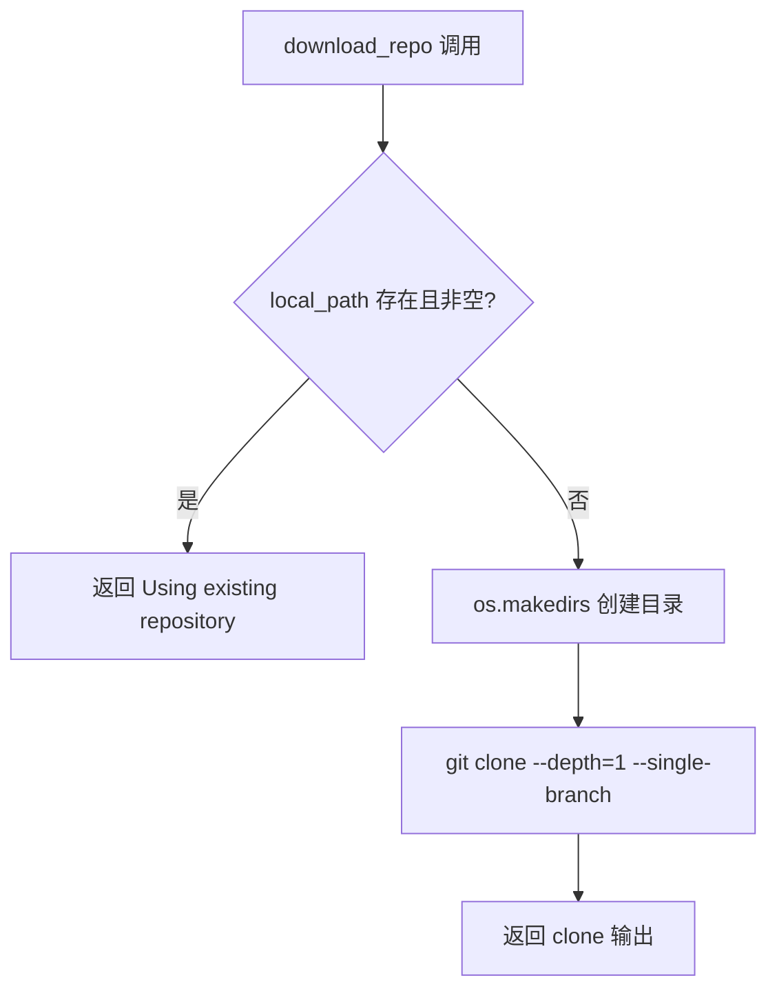
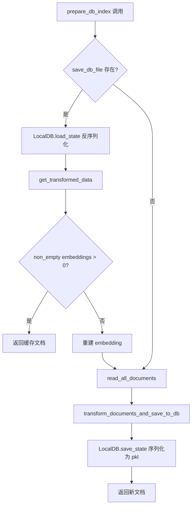
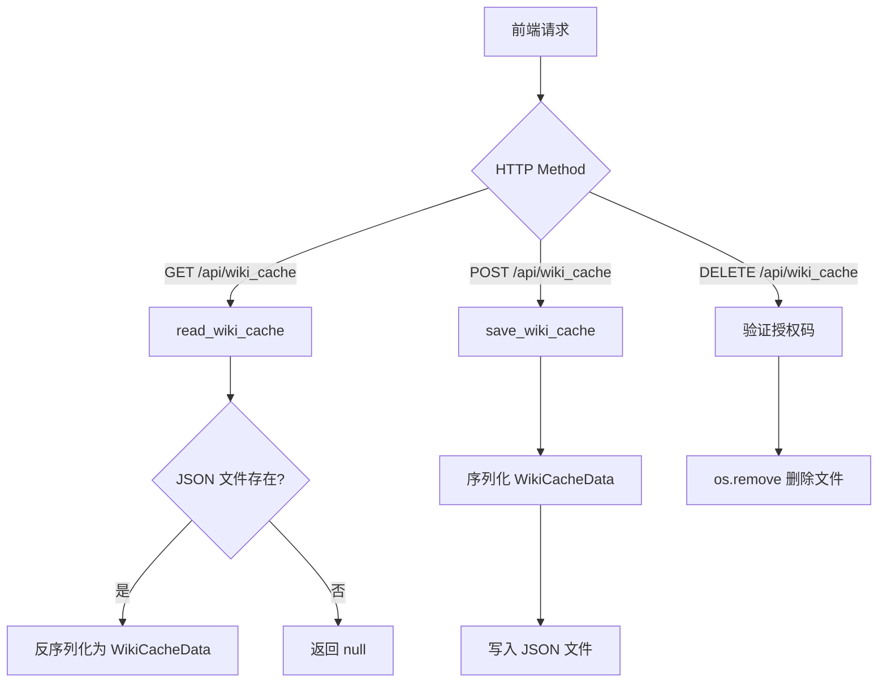

# PD-180.01 DeepWiki — 三层缓存与 WikiCache CRUD

> 文档编号：PD-180.01
> 来源：DeepWiki `api/data_pipeline.py` `api/api.py` `api/rag.py`
> GitHub：https://github.com/AsyncFuncAI/deepwiki-open.git
> 问题域：PD-180 缓存系统 Caching Strategy
> 状态：可复用方案

---

## 第 1 章 问题与动机（≥ 30 行）

### 1.1 核心问题

Wiki 生成系统面临三个高成本操作：

1. **仓库克隆**：每次用户请求都 `git clone` 一个完整仓库，耗时数秒到数分钟，且占用大量磁盘 I/O 和网络带宽。
2. **Embedding 向量化**：将仓库中所有代码和文档文件切分、调用 LLM Embedding API 生成向量，是整个流水线中最昂贵的步骤——既消耗 API 费用，又需要数十秒到数分钟的处理时间。
3. **Wiki 内容生成**：LLM 生成的 Wiki 页面如果不缓存，每次访问都需要重新生成，浪费算力和用户等待时间。

这三个操作如果不做缓存，同一个仓库的重复访问会导致成本线性增长、用户体验极差。

### 1.2 DeepWiki 的解法概述

DeepWiki 实现了一个三层缓存架构，每层针对不同的数据生命周期：

1. **L1 仓库克隆缓存**（`~/.adalflow/repos/`）：`download_repo()` 在克隆前检查目标目录是否已存在且非空，存在则直接复用（`api/data_pipeline.py:96-99`）。
2. **L2 Embedding 数据库缓存**（`~/.adalflow/databases/*.pkl`）：`DatabaseManager.prepare_db_index()` 在构建向量索引前检查 `.pkl` 文件是否存在，存在则用 `LocalDB.load_state()` 反序列化加载，并验证 embedding 向量有效性（`api/data_pipeline.py:869-895`）。
3. **L3 Wiki 内容缓存**（`~/.adalflow/wikicache/*.json`）：通过 FastAPI REST API 提供完整的 CRUD 操作，按 `repo_type/owner/repo/language` 四维键索引（`api/api.py:403-538`）。

### 1.3 设计思想

| 设计原则 | 具体实现 | 理由 | 替代方案 |
|----------|----------|------|----------|
| 分层缓存 | 三层独立缓存，各自管理生命周期 | 不同数据的更新频率和成本不同，分层可独立失效 | 统一缓存层（Redis），但增加运维复杂度 |
| 文件系统持久化 | pkl + JSON 文件，无外部依赖 | 零运维成本，部署简单，适合单机场景 | SQLite/Redis/S3，但增加依赖 |
| 存在性检查优先 | 先检查缓存是否存在，再决定是否重建 | 避免不必要的 API 调用和计算 | TTL 过期策略，但 Wiki 内容无自然过期时间 |
| 四维缓存键 | repo_type + owner + repo + language | 同一仓库不同语言的 Wiki 互不干扰 | URL hash，但丢失可读性 |
| 向量有效性验证 | 加载 pkl 后检查 embedding 维度一致性 | 防止模型切换后旧缓存导致 FAISS 崩溃 | 版本号标记，但实现更复杂 |

---

## 第 2 章 源码实现分析（≥ 60 行，核心章节）

### 2.1 架构概览

```
┌─────────────────────────────────────────────────────────────────┐
│                      用户请求 (WebSocket/HTTP)                    │
└──────────────────────────┬──────────────────────────────────────┘
                           │
                           ▼
┌──────────────────────────────────────────────────────────────────┐
│                    RAG.prepare_retriever()                        │
│                    api/rag.py:345-414                             │
└──────────┬───────────────────────────────────┬──────────────────┘
           │                                   │
           ▼                                   ▼
┌─────────────────────┐            ┌──────────────────────────────┐
│  L3: WikiCache API  │            │  DatabaseManager             │
│  api/api.py:403-538 │            │  api/data_pipeline.py:712    │
│  GET/POST/DELETE     │            │                              │
│  wikicache/*.json   │            │  ┌────────────────────────┐  │
└─────────────────────┘            │  │ L2: Embedding DB Cache │  │
                                   │  │ databases/*.pkl         │  │
                                   │  │ LocalDB.load_state()    │  │
                                   │  └───────────┬────────────┘  │
                                   │              │ miss           │
                                   │              ▼               │
                                   │  ┌────────────────────────┐  │
                                   │  │ L1: Repo Clone Cache   │  │
                                   │  │ repos/{owner}_{repo}/  │  │
                                   │  │ git clone --depth=1    │  │
                                   │  └────────────────────────┘  │
                                   └──────────────────────────────┘
```

### 2.2 核心实现

#### L1: 仓库克隆缓存



对应源码 `api/data_pipeline.py:72-148`：

```python
def download_repo(repo_url: str, local_path: str, repo_type: str = None, access_token: str = None) -> str:
    try:
        logger.info(f"Preparing to clone repository to {local_path}")
        subprocess.run(
            ["git", "--version"],
            check=True, stdout=subprocess.PIPE, stderr=subprocess.PIPE,
        )
        # 缓存命中：目录存在且非空则直接返回
        if os.path.exists(local_path) and os.listdir(local_path):
            logger.warning(f"Repository already exists at {local_path}. Using existing repository.")
            return f"Using existing repository at {local_path}"

        os.makedirs(local_path, exist_ok=True)
        # 浅克隆：--depth=1 只拉最新 commit，节省带宽和磁盘
        result = subprocess.run(
            ["git", "clone", "--depth=1", "--single-branch", clone_url, local_path],
            check=True, stdout=subprocess.PIPE, stderr=subprocess.PIPE,
        )
        return result.stdout.decode("utf-8")
    except subprocess.CalledProcessError as e:
        error_msg = e.stderr.decode('utf-8')
        if access_token:
            error_msg = error_msg.replace(access_token, "***TOKEN***")
        raise ValueError(f"Error during cloning: {error_msg}")
```

#### L2: Embedding 数据库缓存



对应源码 `api/data_pipeline.py:831-913`：

```python
def prepare_db_index(self, embedder_type: str = None, ...) -> List[Document]:
    def _embedding_vector_length(doc: Document) -> int:
        vector = getattr(doc, "vector", None)
        if vector is None:
            return 0
        try:
            if hasattr(vector, "shape"):
                return int(vector.shape[-1]) if len(vector.shape) > 0 else 0
            if hasattr(vector, "__len__"):
                return int(len(vector))
        except Exception:
            return 0
        return 0

    # 缓存命中：pkl 文件存在则加载
    if self.repo_paths and os.path.exists(self.repo_paths["save_db_file"]):
        logger.info("Loading existing database...")
        try:
            self.db = LocalDB.load_state(self.repo_paths["save_db_file"])
            documents = self.db.get_transformed_data(key="split_and_embed")
            if documents:
                lengths = [_embedding_vector_length(doc) for doc in documents]
                non_empty = sum(1 for n in lengths if n > 0)
                # 向量有效性验证：全部为空则重建
                if non_empty == 0:
                    logger.warning("Existing database contains no usable embeddings. Rebuilding...")
                else:
                    return documents
        except Exception as e:
            logger.error(f"Error loading existing database: {e}")

    # 缓存未命中：读取文件 → 切分 → embedding → 持久化
    documents = read_all_documents(self.repo_paths["save_repo_dir"], ...)
    self.db = transform_documents_and_save_to_db(documents, self.repo_paths["save_db_file"], ...)
    return self.db.get_transformed_data(key="split_and_embed")
```

#### L3: WikiCache CRUD API



对应源码 `api/api.py:403-538`：

```python
WIKI_CACHE_DIR = os.path.join(get_adalflow_default_root_path(), "wikicache")
os.makedirs(WIKI_CACHE_DIR, exist_ok=True)

def get_wiki_cache_path(owner: str, repo: str, repo_type: str, language: str) -> str:
    """四维缓存键 → 文件路径"""
    filename = f"deepwiki_cache_{repo_type}_{owner}_{repo}_{language}.json"
    return os.path.join(WIKI_CACHE_DIR, filename)

async def read_wiki_cache(owner, repo, repo_type, language) -> Optional[WikiCacheData]:
    cache_path = get_wiki_cache_path(owner, repo, repo_type, language)
    if os.path.exists(cache_path):
        try:
            with open(cache_path, 'r', encoding='utf-8') as f:
                data = json.load(f)
                return WikiCacheData(**data)
        except Exception as e:
            logger.error(f"Error reading wiki cache from {cache_path}: {e}")
            return None
    return None

async def save_wiki_cache(data: WikiCacheRequest) -> bool:
    cache_path = get_wiki_cache_path(data.repo.owner, data.repo.repo, data.repo.type, data.language)
    try:
        payload = WikiCacheData(
            wiki_structure=data.wiki_structure,
            generated_pages=data.generated_pages,
            repo=data.repo, provider=data.provider, model=data.model
        )
        with open(cache_path, 'w', encoding='utf-8') as f:
            json.dump(payload.model_dump(), f, indent=2)
        return True
    except IOError as e:
        logger.error(f"IOError saving wiki cache to {cache_path}: {e.strerror}")
        return False
```

### 2.3 实现细节

**缓存键设计**：WikiCache 使用 `deepwiki_cache_{repo_type}_{owner}_{repo}_{language}.json` 作为文件名。这个设计支持同一仓库在不同平台（github/gitlab/bitbucket）和不同语言（en/zh/ja）下各自独立缓存。`get_processed_projects` 端点（`api/api.py:577-634`）通过反向解析文件名来列出所有已缓存项目。

**Pydantic 模型驱动**：WikiCache 的读写全部通过 Pydantic 模型（`WikiCacheData`、`WikiCacheRequest`）进行类型校验，确保缓存数据结构一致性（`api/api.py:90-110`）。

**Embedding 缓存验证**：`_embedding_vector_length` 辅助函数（`api/data_pipeline.py:850-863`）支持 numpy array、Python list 等多种向量格式，确保从 pkl 反序列化后的向量维度正确。RAG 层还有二次验证（`api/rag.py:251-343`），过滤掉维度不一致的文档。

**路径构建**：`DatabaseManager._create_repo()`（`api/data_pipeline.py:777-829`）统一管理三层缓存的路径：
- 仓库：`~/.adalflow/repos/{owner}_{repo}/`
- 数据库：`~/.adalflow/databases/{owner}_{repo}.pkl`
- WikiCache：`~/.adalflow/wikicache/deepwiki_cache_{type}_{owner}_{repo}_{lang}.json`


---

## 第 3 章 迁移指南（≥ 40 行）

### 3.1 迁移清单

**阶段 1：基础缓存层（L1 + L2）**

- [ ] 定义缓存根目录（如 `~/.myapp/`），创建 `repos/` 和 `databases/` 子目录
- [ ] 实现 `download_repo()` 函数，加入目录存在性检查
- [ ] 选择 embedding 持久化格式（pkl/parquet/SQLite）
- [ ] 实现 `DatabaseManager` 类，封装 load/save/validate 逻辑
- [ ] 添加 embedding 向量维度验证，防止模型切换后缓存失效

**阶段 2：Wiki 内容缓存层（L3）**

- [ ] 设计缓存键格式（建议：`{platform}_{owner}_{repo}_{language}.json`）
- [ ] 定义 Pydantic 模型（CacheData、CacheRequest）
- [ ] 实现 CRUD API 端点（GET/POST/DELETE）
- [ ] 添加语言校验和授权码保护（DELETE 操作）
- [ ] 实现 `list_cached_projects` 端点，通过文件名反向解析

**阶段 3：集成与优化**

- [ ] 在 RAG pipeline 入口处串联三层缓存
- [ ] 添加缓存命中/未命中的日志和指标
- [ ] 考虑缓存失效策略（手动删除 / TTL / 文件监控）

### 3.2 适配代码模板

```python
"""三层缓存管理器 — 可直接复用的代码模板"""
import os
import json
import pickle
import subprocess
import logging
from pathlib import Path
from typing import Optional, Dict, Any
from pydantic import BaseModel

logger = logging.getLogger(__name__)


class CacheConfig:
    """缓存配置"""
    def __init__(self, root_dir: str = "~/.myapp"):
        self.root = Path(os.path.expanduser(root_dir))
        self.repos_dir = self.root / "repos"
        self.db_dir = self.root / "databases"
        self.wiki_dir = self.root / "wikicache"
        # 确保目录存在
        for d in [self.repos_dir, self.db_dir, self.wiki_dir]:
            d.mkdir(parents=True, exist_ok=True)


class RepoCache:
    """L1: 仓库克隆缓存"""
    def __init__(self, config: CacheConfig):
        self.config = config

    def get_or_clone(self, repo_url: str, owner: str, repo: str) -> Path:
        repo_dir = self.config.repos_dir / f"{owner}_{repo}"
        if repo_dir.exists() and any(repo_dir.iterdir()):
            logger.info(f"Cache hit: {repo_dir}")
            return repo_dir
        repo_dir.mkdir(parents=True, exist_ok=True)
        subprocess.run(
            ["git", "clone", "--depth=1", "--single-branch", repo_url, str(repo_dir)],
            check=True, capture_output=True,
        )
        logger.info(f"Cloned to {repo_dir}")
        return repo_dir


class EmbeddingCache:
    """L2: Embedding 数据库缓存"""
    def __init__(self, config: CacheConfig):
        self.config = config

    def get_db_path(self, owner: str, repo: str) -> Path:
        return self.config.db_dir / f"{owner}_{repo}.pkl"

    def load(self, owner: str, repo: str) -> Optional[Any]:
        db_path = self.get_db_path(owner, repo)
        if db_path.exists():
            try:
                with open(db_path, "rb") as f:
                    db = pickle.load(f)
                logger.info(f"Loaded embedding cache: {db_path}")
                return db
            except Exception as e:
                logger.error(f"Failed to load cache: {e}")
        return None

    def save(self, owner: str, repo: str, db: Any) -> None:
        db_path = self.get_db_path(owner, repo)
        with open(db_path, "wb") as f:
            pickle.dump(db, f)
        logger.info(f"Saved embedding cache: {db_path}")


class WikiCacheModel(BaseModel):
    """L3: Wiki 内容缓存数据模型"""
    structure: Dict[str, Any]
    pages: Dict[str, Any]
    provider: str = ""
    model: str = ""


class WikiCache:
    """L3: Wiki 内容 CRUD 缓存"""
    def __init__(self, config: CacheConfig):
        self.config = config

    def _path(self, platform: str, owner: str, repo: str, lang: str) -> Path:
        return self.config.wiki_dir / f"cache_{platform}_{owner}_{repo}_{lang}.json"

    def get(self, platform: str, owner: str, repo: str, lang: str) -> Optional[WikiCacheModel]:
        p = self._path(platform, owner, repo, lang)
        if p.exists():
            data = json.loads(p.read_text(encoding="utf-8"))
            return WikiCacheModel(**data)
        return None

    def put(self, platform: str, owner: str, repo: str, lang: str, data: WikiCacheModel) -> bool:
        p = self._path(platform, owner, repo, lang)
        p.write_text(json.dumps(data.model_dump(), indent=2, ensure_ascii=False), encoding="utf-8")
        return True

    def delete(self, platform: str, owner: str, repo: str, lang: str) -> bool:
        p = self._path(platform, owner, repo, lang)
        if p.exists():
            p.unlink()
            return True
        return False

    def list_all(self) -> list:
        """通过文件名反向解析列出所有缓存项目"""
        entries = []
        for f in self.config.wiki_dir.glob("cache_*.json"):
            parts = f.stem.replace("cache_", "").split("_")
            if len(parts) >= 4:
                entries.append({
                    "platform": parts[0], "owner": parts[1],
                    "repo": "_".join(parts[2:-1]), "language": parts[-1],
                    "mtime": f.stat().st_mtime,
                })
        return sorted(entries, key=lambda x: x["mtime"], reverse=True)
```

### 3.3 适用场景

| 场景 | 适用度 | 说明 |
|------|--------|------|
| 单机部署的 RAG 应用 | ⭐⭐⭐ | 文件系统缓存零依赖，完美适配 |
| 多用户 SaaS 平台 | ⭐⭐ | 需要加锁机制防止并发写入冲突 |
| 分布式微服务 | ⭐ | 文件系统缓存不跨节点，需改用 Redis/S3 |
| CI/CD 流水线中的代码分析 | ⭐⭐⭐ | 仓库克隆缓存可大幅加速重复构建 |
| 多语言文档生成系统 | ⭐⭐⭐ | 四维缓存键天然支持多语言隔离 |

---

## 第 4 章 测试用例（≥ 20 行）

```python
import os
import json
import tempfile
import pytest
from pathlib import Path
from unittest.mock import patch, MagicMock


class TestRepoCloneCache:
    """L1: 仓库克隆缓存测试"""

    def test_cache_hit_skips_clone(self, tmp_path):
        """目录存在且非空时应跳过 clone"""
        repo_dir = tmp_path / "repos" / "owner_repo"
        repo_dir.mkdir(parents=True)
        (repo_dir / "README.md").write_text("hello")

        # 模拟 download_repo 的缓存逻辑
        local_path = str(repo_dir)
        if os.path.exists(local_path) and os.listdir(local_path):
            result = f"Using existing repository at {local_path}"
        else:
            result = "cloned"

        assert "Using existing" in result

    def test_cache_miss_triggers_clone(self, tmp_path):
        """目录不存在时应触发 clone"""
        repo_dir = tmp_path / "repos" / "new_repo"
        local_path = str(repo_dir)
        assert not os.path.exists(local_path)

    def test_empty_dir_triggers_clone(self, tmp_path):
        """空目录应触发 clone"""
        repo_dir = tmp_path / "repos" / "empty_repo"
        repo_dir.mkdir(parents=True)
        assert os.path.exists(str(repo_dir))
        assert not os.listdir(str(repo_dir))


class TestEmbeddingCache:
    """L2: Embedding 数据库缓存测试"""

    def test_load_existing_pkl(self, tmp_path):
        """存在的 pkl 文件应成功加载"""
        import pickle
        db_path = tmp_path / "test.pkl"
        test_data = {"documents": [{"text": "hello", "vector": [0.1, 0.2]}]}
        with open(db_path, "wb") as f:
            pickle.dump(test_data, f)

        with open(db_path, "rb") as f:
            loaded = pickle.load(f)
        assert loaded["documents"][0]["text"] == "hello"

    def test_missing_pkl_returns_none(self, tmp_path):
        """不存在的 pkl 文件应返回 None"""
        db_path = tmp_path / "nonexistent.pkl"
        assert not db_path.exists()

    def test_corrupted_pkl_handles_gracefully(self, tmp_path):
        """损坏的 pkl 文件应优雅处理"""
        db_path = tmp_path / "corrupted.pkl"
        db_path.write_bytes(b"not a pickle file")
        with pytest.raises(Exception):
            import pickle
            with open(db_path, "rb") as f:
                pickle.load(f)


class TestWikiCache:
    """L3: Wiki 内容 CRUD 缓存测试"""

    def test_cache_key_format(self):
        """缓存键应按四维格式生成"""
        filename = f"deepwiki_cache_github_AsyncFuncAI_deepwiki-open_en.json"
        parts = filename.replace("deepwiki_cache_", "").replace(".json", "").split("_")
        assert parts[0] == "github"
        assert parts[1] == "AsyncFuncAI"
        assert parts[-1] == "en"

    def test_save_and_read_roundtrip(self, tmp_path):
        """写入后读取应返回相同数据"""
        cache_path = tmp_path / "test_cache.json"
        data = {"wiki_structure": {"id": "1", "title": "Test"}, "generated_pages": {}}
        cache_path.write_text(json.dumps(data), encoding="utf-8")
        loaded = json.loads(cache_path.read_text(encoding="utf-8"))
        assert loaded["wiki_structure"]["title"] == "Test"

    def test_delete_removes_file(self, tmp_path):
        """删除操作应移除文件"""
        cache_path = tmp_path / "to_delete.json"
        cache_path.write_text("{}")
        assert cache_path.exists()
        cache_path.unlink()
        assert not cache_path.exists()

    def test_list_projects_parses_filenames(self, tmp_path):
        """列表端点应正确解析文件名"""
        (tmp_path / "deepwiki_cache_github_owner_repo_en.json").write_text("{}")
        (tmp_path / "deepwiki_cache_gitlab_org_project_zh.json").write_text("{}")
        files = list(tmp_path.glob("deepwiki_cache_*.json"))
        assert len(files) == 2

    def test_language_validation(self):
        """不支持的语言应回退到默认语言"""
        supported = {"en": "English", "zh": "Chinese", "ja": "Japanese"}
        lang = "xx"
        if lang not in supported:
            lang = "en"
        assert lang == "en"
```


---

## 第 5 章 跨域关联

| 关联域 | 关系类型 | 说明 |
|--------|----------|------|
| PD-06 记忆持久化 | 协同 | L2 embedding 缓存本质上是一种记忆持久化，pkl 序列化的 LocalDB 包含了文档向量和元数据 |
| PD-08 搜索与检索 | 依赖 | RAG 检索依赖 L2 缓存提供的 FAISS 索引，缓存命中直接跳过 embedding 步骤 |
| PD-01 上下文管理 | 协同 | L3 WikiCache 缓存了完整的 Wiki 结构和页面内容，减少了重复生成对上下文窗口的消耗 |
| PD-11 可观测性 | 协同 | 缓存命中/未命中的日志（logger.info/warning）为可观测性提供了关键信号 |
| PD-07 质量检查 | 协同 | L2 缓存加载后的 embedding 维度验证是一种数据质量检查，防止损坏数据进入检索流程 |

---

## 第 6 章 来源文件索引

| 文件 | 行范围 | 关键实现 |
|------|--------|----------|
| `api/data_pipeline.py` | L72-L148 | `download_repo()` — L1 仓库克隆缓存，含存在性检查和浅克隆 |
| `api/data_pipeline.py` | L426-L450 | `transform_documents_and_save_to_db()` — L2 embedding 持久化 |
| `api/data_pipeline.py` | L712-L929 | `DatabaseManager` 类 — 三层缓存路径管理和 L2 缓存加载/验证 |
| `api/data_pipeline.py` | L777-L829 | `_create_repo()` — 统一路径构建（repos/ + databases/） |
| `api/data_pipeline.py` | L831-L913 | `prepare_db_index()` — L2 缓存命中检查和向量有效性验证 |
| `api/api.py` | L36-L37 | `get_adalflow_default_root_path()` — 缓存根目录 |
| `api/api.py` | L90-L110 | `WikiCacheData` / `WikiCacheRequest` — L3 Pydantic 数据模型 |
| `api/api.py` | L403-L411 | `WIKI_CACHE_DIR` 初始化和 `get_wiki_cache_path()` — L3 缓存键 |
| `api/api.py` | L413-L457 | `read_wiki_cache()` / `save_wiki_cache()` — L3 读写实现 |
| `api/api.py` | L461-L538 | Wiki Cache REST API 端点（GET/POST/DELETE） |
| `api/api.py` | L577-L634 | `get_processed_projects()` — 通过文件名反向解析列出缓存项目 |
| `api/rag.py` | L251-L343 | `_validate_and_filter_embeddings()` — embedding 二次验证 |
| `api/rag.py` | L345-L414 | `prepare_retriever()` — 串联 L1+L2 缓存的入口 |

---

## 第 7 章 横向对比维度

```json comparison_data
{
  "project": "DeepWiki",
  "dimensions": {
    "缓存层级": "三层分离：仓库克隆 / embedding pkl / wiki JSON",
    "缓存键设计": "四维文件名：repo_type_owner_repo_language",
    "持久化方式": "文件系统：pkl 序列化 + JSON，零外部依赖",
    "失效策略": "手动删除 + embedding 维度验证自动重建",
    "CRUD 支持": "完整 REST API：GET/POST/DELETE + 项目列表",
    "并发安全": "无锁设计，依赖文件系统原子性，适合单机"
  }
}
```

### 域元数据补充

```json domain_metadata
{
  "solution_summary": "DeepWiki 用三层文件系统缓存（repos/ 克隆去重 + databases/*.pkl embedding 持久化 + wikicache/*.json CRUD API）实现零外部依赖的全链路缓存",
  "description": "缓存系统需要考虑多层数据的不同生命周期和失效策略",
  "sub_problems": [
    "缓存加载后的数据完整性验证（embedding 维度校验）",
    "通过文件名反向解析实现缓存项目列表"
  ],
  "best_practices": [
    "Pydantic 模型驱动缓存读写确保类型安全",
    "浅克隆 --depth=1 减少仓库缓存体积",
    "DELETE 操作加授权码保护防止误删"
  ]
}
```

