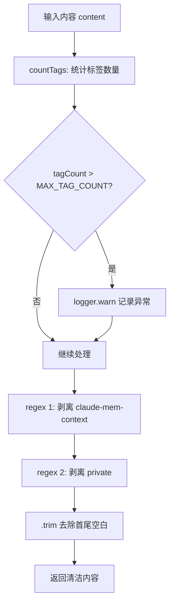
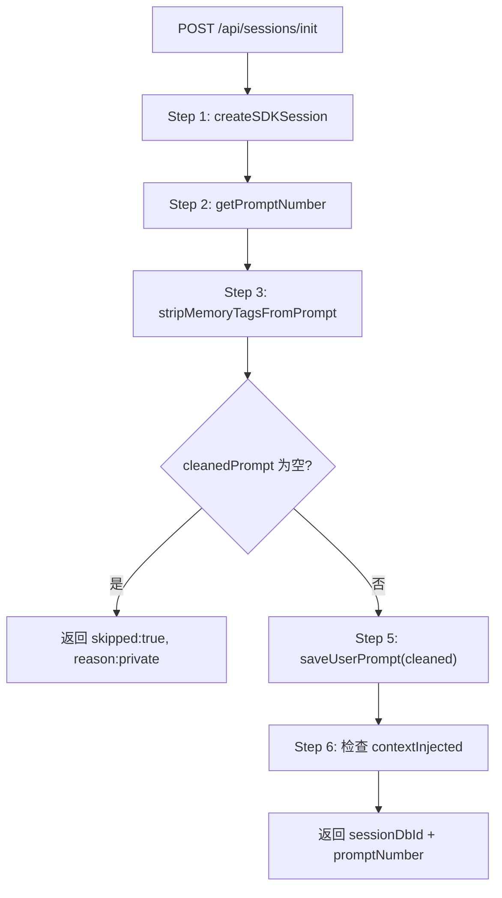
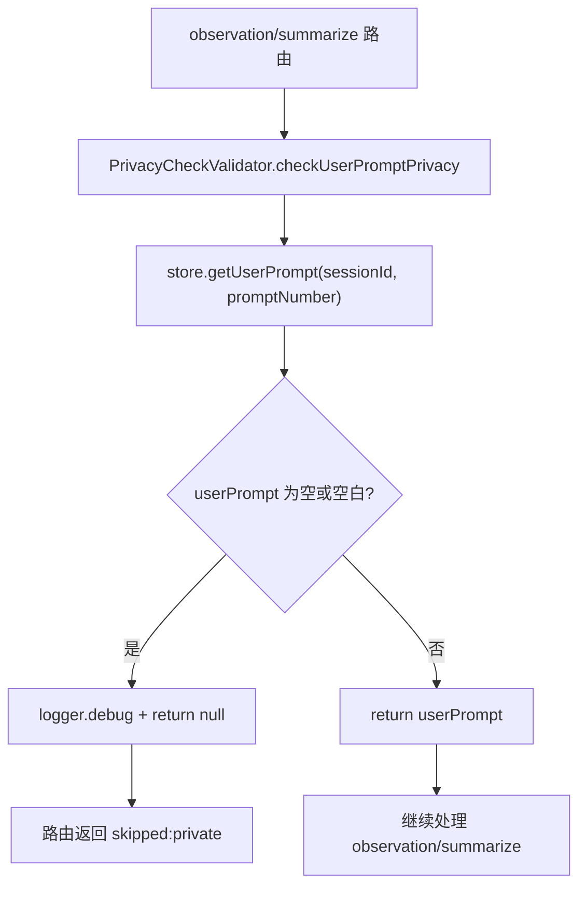

# PD-181.01 claude-mem — 双标签隐私过滤与 Hook 层边缘处理

> 文档编号：PD-181.01
> 来源：claude-mem `src/utils/tag-stripping.ts` `src/services/worker/validation/PrivacyCheckValidator.ts`
> GitHub：https://github.com/thedotmack/claude-mem.git
> 问题域：PD-181 隐私与数据过滤 Privacy & Data Filtering
> 状态：可复用方案

---

## 第 1 章 问题与动机

### 1.1 核心问题

AI 记忆系统（如 claude-mem）会持久化用户与 LLM 的交互内容——包括用户 prompt、工具调用输入/输出、会话摘要等。这带来两个隐私风险：

1. **用户敏感数据泄露**：用户可能在 prompt 中包含密码、API Key、个人信息等，这些内容不应被存储到记忆数据库中。
2. **系统递归存储**：记忆系统自身注入的上下文（如历史摘要、观察记录）被重新捕获并存储，导致数据膨胀和循环引用。

传统做法是在存储层（数据库写入前）做过滤，但这意味着敏感数据已经穿越了整个处理管道（网络传输、队列、内存缓存），增加了泄露面。

### 1.2 claude-mem 的解法概述

claude-mem 实现了一套**双标签隐私系统 + Hook 层边缘处理**架构：

1. **双标签语义分离**：`<private>` 标签供用户标记敏感内容，`<claude-mem-context>` 标签供系统标记注入的上下文，两者语义独立但共享剥离逻辑（`src/utils/tag-stripping.ts:49-52`）
2. **边缘处理模式**：隐私过滤在 Hook 层（数据入口）执行，而非 Worker 存储层。Session 初始化时即完成标签剥离（`src/services/worker/http/routes/SessionRoutes.ts:740`）
3. **ReDoS 防护**：对标签数量设上限 `MAX_TAG_COUNT=100`，防止恶意构造的输入导致正则引擎灾难性回溯（`src/utils/tag-stripping.ts:21`）
4. **全量/部分隐私判定**：剥离后若内容为空则跳过整个处理流程（全量隐私），否则仅存储公开部分（部分隐私）（`src/services/worker/http/routes/SessionRoutes.ts:743-757`）
5. **双层校验**：`PrivacyCheckValidator` 在 observation 和 summarize 路由中二次校验，确保即使 init 阶段遗漏，后续操作也不会处理隐私 prompt（`src/services/worker/validation/PrivacyCheckValidator.ts:20-40`）

### 1.3 设计思想

| 设计原则 | 具体实现 | 理由 | 替代方案 |
|----------|----------|------|----------|
| 边缘过滤优于中心过滤 | Hook 层（SessionRoutes.handleSessionInitByClaudeId）执行 stripMemoryTagsFromPrompt | 敏感数据不穿越网络/队列/内存，最小化泄露面 | 在 SQLite 写入前过滤（数据已在内存中） |
| 用户控制优于系统猜测 | `<private>` 标签由用户显式标记 | 用户最清楚什么是敏感的，避免误判 | NLP 自动检测 PII（误报率高） |
| 语义分离双标签 | `<private>` 用户级 + `<claude-mem-context>` 系统级 | 不同来源的过滤需求不同，系统标签防递归，用户标签防泄露 | 单一标签（无法区分来源） |
| 防御性正则处理 | MAX_TAG_COUNT=100 + countTags 预检 | 防止 ReDoS 攻击导致服务不可用 | 无限制处理（DoS 风险） |
| 优雅降级 | 超限时仍处理但记录告警 | 不因安全检查阻断正常功能 | 直接拒绝（影响可用性） |

---

## 第 2 章 源码实现分析

### 2.1 架构概览

claude-mem 的隐私过滤架构分为三层，数据从 Claude Code Hook 进入，经过边缘过滤后才到达 Worker 存储层：

```
┌─────────────────────────────────────────────────────────────────┐
│                    Claude Code Host Process                      │
│                                                                  │
│  UserPromptSubmit Hook ──→ session-init handler                  │
│  PostToolUse Hook     ──→ observation handler                    │
│  Stop Hook            ──→ summarize handler                      │
└──────────────────────────────┬───────────────────────────────────┘
                               │ HTTP POST (raw content)
                               ▼
┌─────────────────────────────────────────────────────────────────┐
│                    Worker Service (Express)                       │
│                                                                  │
│  SessionRoutes.handleSessionInitByClaudeId                       │
│    ├─ Step 3: stripMemoryTagsFromPrompt(prompt)  ◄── 边缘过滤    │
│    ├─ Step 4: 全量隐私判定 (empty → skip)                         │
│    └─ Step 5: store.saveUserPrompt(cleaned)                      │
│                                                                  │
│  SessionRoutes.handleObservationsByClaudeId                      │
│    ├─ PrivacyCheckValidator.checkUserPromptPrivacy ◄── 二次校验   │
│    ├─ stripMemoryTagsFromJson(tool_input)          ◄── 工具过滤   │
│    └─ stripMemoryTagsFromJson(tool_response)       ◄── 工具过滤   │
│                                                                  │
│  SessionRoutes.handleSummarizeByClaudeId                         │
│    └─ PrivacyCheckValidator.checkUserPromptPrivacy ◄── 二次校验   │
└──────────────────────────────┬───────────────────────────────────┘
                               │ (cleaned data only)
                               ▼
┌─────────────────────────────────────────────────────────────────┐
│              SQLite + Chroma (Storage Layer)                      │
│              只接收已过滤的干净数据                                  │
└─────────────────────────────────────────────────────────────────┘
```

### 2.2 核心实现

#### 2.2.1 双标签剥离引擎



对应源码 `src/utils/tag-stripping.ts:37-53`：

```typescript
function stripTagsInternal(content: string): string {
  // ReDoS protection: limit tag count before regex processing
  const tagCount = countTags(content);
  if (tagCount > MAX_TAG_COUNT) {
    logger.warn('SYSTEM', 'tag count exceeds limit', undefined, {
      tagCount,
      maxAllowed: MAX_TAG_COUNT,
      contentLength: content.length
    });
    // Still process but log the anomaly
  }

  return content
    .replace(/<claude-mem-context>[\s\S]*?<\/claude-mem-context>/g, '')
    .replace(/<private>[\s\S]*?<\/private>/g, '')
    .trim();
}
```

关键设计点：
- `[\s\S]*?` 使用非贪婪匹配，支持标签内多行内容（`src/utils/tag-stripping.ts:50-51`）
- 先剥离系统标签再剥离用户标签，顺序无关但保持一致性
- `countTags` 使用简单的 `match` 计数而非正则，避免预检本身成为 ReDoS 向量（`src/utils/tag-stripping.ts:27-31`）

#### 2.2.2 Session 初始化中的边缘过滤



对应源码 `src/services/worker/http/routes/SessionRoutes.ts:694-779`：

```typescript
private handleSessionInitByClaudeId = this.wrapHandler((req: Request, res: Response): void => {
    const { contentSessionId } = req.body;
    const project = req.body.project || 'unknown';
    const prompt = req.body.prompt || '[media prompt]';

    // ... validation ...

    const store = this.dbManager.getSessionStore();
    const sessionDbId = store.createSDKSession(contentSessionId, project, prompt);
    const currentCount = store.getPromptNumberFromUserPrompts(contentSessionId);
    const promptNumber = currentCount + 1;

    // Step 3: Strip privacy tags from prompt
    const cleanedPrompt = stripMemoryTagsFromPrompt(prompt);

    // Step 4: Check if prompt is entirely private
    if (!cleanedPrompt || cleanedPrompt.trim() === '') {
      res.json({ sessionDbId, promptNumber, skipped: true, reason: 'private' });
      return;
    }

    // Step 5: Save cleaned user prompt
    store.saveUserPrompt(contentSessionId, promptNumber, cleanedPrompt);
    // ...
});
```

#### 2.2.3 PrivacyCheckValidator 二次校验



对应源码 `src/services/worker/validation/PrivacyCheckValidator.ts:10-41`：

```typescript
export class PrivacyCheckValidator {
  static checkUserPromptPrivacy(
    store: SessionStore,
    contentSessionId: string,
    promptNumber: number,
    operationType: 'observation' | 'summarize',
    sessionDbId: number,
    additionalContext?: Record<string, any>
  ): string | null {
    const userPrompt = store.getUserPrompt(contentSessionId, promptNumber);

    if (!userPrompt || userPrompt.trim() === '') {
      logger.debug('HOOK', `Skipping ${operationType} - user prompt was entirely private`, {
        sessionId: sessionDbId,
        promptNumber,
        ...additionalContext
      });
      return null;
    }

    return userPrompt;
  }
}
```

### 2.3 实现细节

**数据流中的过滤点分布：**

| 过滤点 | 文件位置 | 过滤对象 | 过滤函数 |
|--------|----------|----------|----------|
| Session Init | `SessionRoutes.ts:740` | 用户 prompt | `stripMemoryTagsFromPrompt` |
| Observation 路由 | `SessionRoutes.ts:538-544` | 当前 prompt 隐私状态 | `PrivacyCheckValidator` |
| Observation 路由 | `SessionRoutes.ts:552-558` | tool_input / tool_response | `stripMemoryTagsFromJson` |
| Summarize 路由 | `SessionRoutes.ts:610-616` | 当前 prompt 隐私状态 | `PrivacyCheckValidator` |
| User Message 显示 | `user-message.ts:47` | 用户提示信息 | 显示 `<private>` 用法提示 |

**用户感知设计：** 在 `user-message.ts:47`，每次会话开始时向用户 stderr 输出提示：
```
💡 Wrap any message with <private> ... </private> to prevent storing sensitive information.
```
这确保用户知道隐私标签的存在和用法。


---

## 第 3 章 迁移指南

### 3.1 迁移清单

**阶段 1：标签剥离引擎（1 个文件）**

- [ ] 创建 `tag-stripping.ts`（或对应语言的等价实现）
- [ ] 定义双标签：用户级 `<private>` + 系统级自定义标签（如 `<your-system-context>`）
- [ ] 实现 `stripTagsInternal` 函数，使用非贪婪正则 `[\s\S]*?`
- [ ] 添加 ReDoS 防护：`MAX_TAG_COUNT` 常量 + `countTags` 预检
- [ ] 导出 `stripFromPrompt` 和 `stripFromJson` 两个入口函数

**阶段 2：边缘过滤集成（路由层）**

- [ ] 在数据入口路由（session init / message receive）调用 `stripFromPrompt`
- [ ] 实现全量隐私判定：剥离后为空 → 跳过后续处理
- [ ] 在工具调用存储路由调用 `stripFromJson` 清洗 tool_input/tool_response
- [ ] 返回 `skipped: true, reason: 'private'` 让调用方知道跳过原因

**阶段 3：二次校验层（可选但推荐）**

- [ ] 创建 `PrivacyCheckValidator` 类，集中隐私校验逻辑
- [ ] 在 observation 和 summarize 等下游路由中调用二次校验
- [ ] 确保即使 init 阶段遗漏，后续操作也不会处理隐私内容

**阶段 4：用户感知**

- [ ] 在会话开始时向用户展示隐私标签用法提示
- [ ] 在文档中说明双标签语义和使用方式

### 3.2 适配代码模板

以下是一个可直接复用的 TypeScript 标签剥离引擎：

```typescript
// privacy-filter.ts — 可移植的双标签隐私过滤引擎
// 改编自 claude-mem src/utils/tag-stripping.ts

/** 最大标签数量限制，防止 ReDoS */
const MAX_TAG_COUNT = 100;

/** 用户级隐私标签 */
const USER_PRIVACY_TAG = 'private';
/** 系统级上下文标签（按你的系统命名） */
const SYSTEM_CONTEXT_TAG = 'your-system-context';

function countTags(content: string): number {
  const userCount = (content.match(new RegExp(`<${USER_PRIVACY_TAG}>`, 'g')) || []).length;
  const sysCount = (content.match(new RegExp(`<${SYSTEM_CONTEXT_TAG}>`, 'g')) || []).length;
  return userCount + sysCount;
}

function stripTagsInternal(content: string): string {
  const tagCount = countTags(content);
  if (tagCount > MAX_TAG_COUNT) {
    console.warn(`[PRIVACY] Tag count ${tagCount} exceeds limit ${MAX_TAG_COUNT}`);
  }

  return content
    .replace(new RegExp(`<${SYSTEM_CONTEXT_TAG}>[\\s\\S]*?<\\/${SYSTEM_CONTEXT_TAG}>`, 'g'), '')
    .replace(new RegExp(`<${USER_PRIVACY_TAG}>[\\s\\S]*?<\\/${USER_PRIVACY_TAG}>`, 'g'), '')
    .trim();
}

/** 剥离用户 prompt 中的隐私标签 */
export function stripPrivacyTags(content: string): string {
  return stripTagsInternal(content);
}

/** 判断内容是否全量隐私（剥离后为空） */
export function isEntirelyPrivate(content: string): boolean {
  const cleaned = stripPrivacyTags(content);
  return !cleaned || cleaned.trim() === '';
}

// --- 路由层集成示例 ---
// app.post('/api/sessions/init', (req, res) => {
//   const { prompt } = req.body;
//   const cleanedPrompt = stripPrivacyTags(prompt);
//   if (isEntirelyPrivate(prompt)) {
//     return res.json({ skipped: true, reason: 'private' });
//   }
//   // 只存储 cleanedPrompt
//   store.save(cleanedPrompt);
// });
```

### 3.3 适用场景

| 场景 | 适用度 | 说明 |
|------|--------|------|
| AI 记忆/对话持久化系统 | ⭐⭐⭐ | 核心场景，直接复用 |
| LLM Agent 工具调用日志 | ⭐⭐⭐ | tool_input/tool_response 中可能含敏感数据 |
| 聊天记录存储服务 | ⭐⭐⭐ | 用户需要控制哪些消息被保存 |
| RAG 知识库写入管道 | ⭐⭐ | 防止敏感文档片段进入向量库 |
| 日志收集系统 | ⭐⭐ | 防止敏感信息进入日志存储 |
| 实时流处理管道 | ⭐ | 需要适配流式处理的分块边界问题 |

---

## 第 4 章 测试用例

基于 claude-mem 真实测试（`tests/utils/tag-stripping.test.ts`）改编的可运行测试：

```typescript
import { describe, it, expect } from 'bun:test';
// 或使用 vitest/jest: import { describe, it, expect } from 'vitest';

import { stripPrivacyTags, isEntirelyPrivate } from './privacy-filter';

describe('PrivacyFilter', () => {
  describe('基本标签剥离', () => {
    it('应剥离单个 <private> 标签并保留周围内容', () => {
      const input = 'public content <private>secret stuff</private> more public';
      expect(stripPrivacyTags(input)).toBe('public content  more public');
    });

    it('应剥离系统上下文标签', () => {
      const input = 'public <your-system-context>injected</your-system-context> end';
      expect(stripPrivacyTags(input)).toBe('public  end');
    });

    it('应同时剥离两种标签', () => {
      const input = '<private>secret</private> public <your-system-context>ctx</your-system-context> end';
      expect(stripPrivacyTags(input)).toBe('public  end');
    });
  });

  describe('全量隐私判定', () => {
    it('全部内容被标记为 private 时应判定为全量隐私', () => {
      expect(isEntirelyPrivate('<private>entire prompt</private>')).toBe(true);
    });

    it('混合内容不应判定为全量隐私', () => {
      expect(isEntirelyPrivate('<private>secret</private> public part')).toBe(false);
    });

    it('无标签内容不应判定为全量隐私', () => {
      expect(isEntirelyPrivate('normal content')).toBe(false);
    });
  });

  describe('多行内容处理', () => {
    it('应剥离跨行的 private 标签内容', () => {
      const input = `public\n<private>\nmulti\nline\nsecret\n</private>\nend`;
      expect(stripPrivacyTags(input)).toBe('public\n\nend');
    });
  });

  describe('ReDoS 防护', () => {
    it('大量标签应在合理时间内完成处理', () => {
      let content = 'start ';
      for (let i = 0; i < 150; i++) {
        content += `<private>secret${i}</private> text${i} `;
      }
      const startTime = Date.now();
      const result = stripPrivacyTags(content);
      const duration = Date.now() - startTime;

      expect(duration).toBeLessThan(1000);
      expect(result).not.toContain('<private>');
    });

    it('大内容标签应在合理时间内完成处理', () => {
      const content = '<private>' + 'x'.repeat(10000) + '</private> keep this';
      const startTime = Date.now();
      const result = stripPrivacyTags(content);
      expect(Date.now() - startTime).toBeLessThan(1000);
      expect(result).toBe('keep this');
    });
  });

  describe('隐私执行集成', () => {
    it('全量隐私 prompt 应触发跳过', () => {
      const prompt = '<private>entirely private prompt</private>';
      const cleaned = stripPrivacyTags(prompt);
      const shouldSkip = !cleaned || cleaned.trim() === '';
      expect(shouldSkip).toBe(true);
    });

    it('部分隐私 prompt 应保留公开部分', () => {
      const prompt = '<private>password123</private> Help me with code';
      const cleaned = stripPrivacyTags(prompt);
      expect(cleaned.trim()).toBe('Help me with code');
    });
  });
});
```


---

## 第 5 章 跨域关联

| 关联域 | 关系类型 | 说明 |
|--------|----------|------|
| PD-01 上下文管理 | 协同 | `<claude-mem-context>` 标签本身就是上下文注入机制的一部分，剥离它防止递归存储是上下文管理的延伸 |
| PD-06 记忆持久化 | 依赖 | 隐私过滤是记忆持久化的前置步骤，决定哪些内容可以进入持久化存储 |
| PD-10 中间件管道 | 协同 | Hook 层边缘处理本质上是一种中间件模式，在数据进入主处理管道前执行过滤 |
| PD-11 可观测性 | 协同 | ReDoS 防护中的 `logger.warn` 告警是可观测性的一部分，异常标签数量需要被监控 |
| PD-03 容错与重试 | 协同 | 隐私过滤采用优雅降级策略（超限仍处理），与容错设计理念一致 |

---

## 第 6 章 来源文件索引

| 文件 | 行范围 | 关键实现 |
|------|--------|----------|
| `src/utils/tag-stripping.ts` | L1-L73 | 双标签剥离引擎核心，含 ReDoS 防护 |
| `src/services/worker/validation/PrivacyCheckValidator.ts` | L1-L41 | 集中式隐私校验器，二次校验逻辑 |
| `src/services/worker/http/routes/SessionRoutes.ts` | L694-L779 | Session Init 边缘过滤（stripMemoryTagsFromPrompt） |
| `src/services/worker/http/routes/SessionRoutes.ts` | L498-L587 | Observation 路由隐私校验 + 工具数据过滤 |
| `src/services/worker/http/routes/SessionRoutes.ts` | L596-L632 | Summarize 路由隐私校验 |
| `src/cli/handlers/user-message.ts` | L44-L49 | 用户隐私标签用法提示展示 |
| `src/cli/handlers/session-init.ts` | L82-L88 | Hook 层 private 跳过逻辑 |
| `src/shared/hook-constants.ts` | L1-L34 | Hook 退出码定义（SUCCESS/FAILURE/BLOCKING_ERROR） |
| `tests/utils/tag-stripping.test.ts` | L1-L278 | 完整的标签剥离测试套件 |
| `tests/integration/hook-execution-e2e.test.ts` | L222-L251 | 隐私过滤 E2E 集成测试 |

---

## 第 7 章 横向对比维度

```json comparison_data
{
  "project": "claude-mem",
  "dimensions": {
    "过滤架构": "Hook 层边缘过滤，敏感数据不穿越处理管道",
    "标签体系": "双标签语义分离：<private> 用户级 + <claude-mem-context> 系统级",
    "ReDoS 防护": "MAX_TAG_COUNT=100 预检 + 非贪婪正则，超限仍处理但告警",
    "隐私粒度": "全量隐私（跳过整个 prompt）+ 部分隐私（仅存公开部分）",
    "校验层数": "双层校验：init 阶段剥离 + observation/summarize 阶段二次校验"
  }
}
```

### 域元数据补充

```json domain_metadata
{
  "solution_summary": "claude-mem 用 <private>/<claude-mem-context> 双标签在 Hook 层边缘过滤，PrivacyCheckValidator 二次校验，含 MAX_TAG_COUNT=100 ReDoS 防护",
  "description": "LLM 记忆系统中用户可控的隐私标记与多层过滤机制",
  "sub_problems": [
    "全量隐私 vs 部分隐私的判定与差异化处理",
    "工具调用输入输出中的隐私标签清洗"
  ],
  "best_practices": [
    "双标签语义分离：用户级与系统级标签独立定义，共享剥离逻辑",
    "超限时优雅降级（仍处理但记录告警）而非直接拒绝"
  ]
}
```

