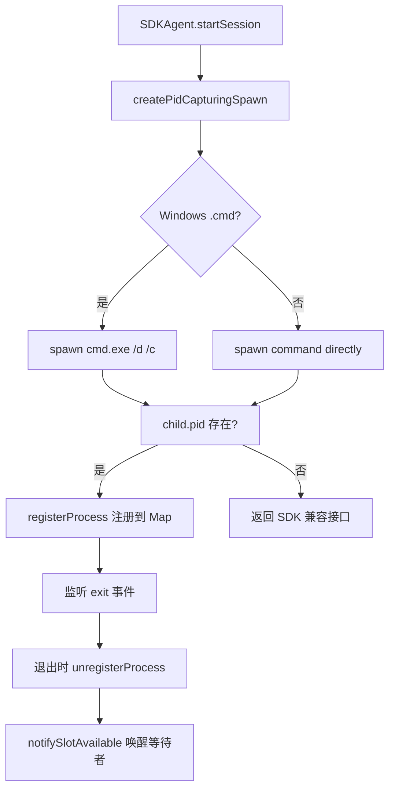
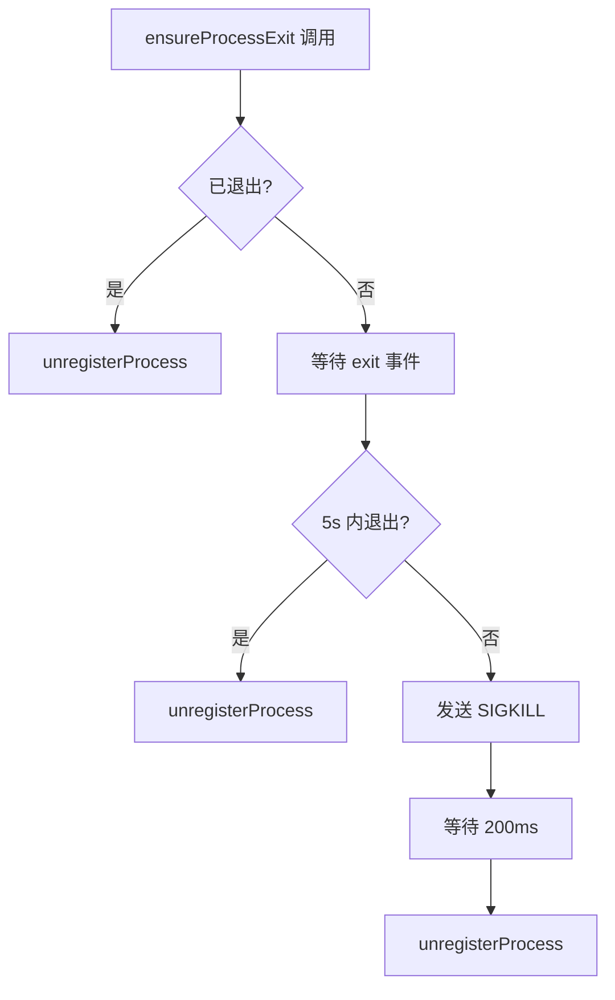

# PD-182.01 claude-mem — 三层进程生命周期管理与僵尸进程防护

> 文档编号：PD-182.01
> 来源：claude-mem `src/services/worker/ProcessRegistry.ts`, `src/services/infrastructure/GracefulShutdown.ts`, `src/services/infrastructure/ProcessManager.ts`
> GitHub：https://github.com/thedotmack/claude-mem.git
> 问题域：PD-182 进程生命周期管理 Process Lifecycle Management
> 状态：可复用方案

---

## 第 1 章 问题与动机

### 1.1 核心问题

长时间运行的 Agent 服务（daemon 模式）会 spawn 大量子进程（如 Claude Code CLI 子进程），如果不做精确的生命周期管理，会导致：

1. **僵尸进程累积**：SDK 的 `SpawnedProcess` 接口隐藏了子进程 PID，`deleteSession()` 不验证子进程是否真正退出，`abort()` 是 fire-and-forget 无确认机制。用户报告 155 个僵尸进程占用 51GB 内存（Issue #737）。
2. **端口僵尸（Windows）**：Windows 上子进程继承父进程的 socket handle，父进程退出后端口仍被占用，导致重启失败。
3. **跨会话孤儿进程**：daemon 崩溃后，上一次会话的子进程变成 ppid=1 的孤儿进程，无人收割。
4. **并发进程池溢出**：无限制地 spawn 子进程会耗尽系统资源。

### 1.2 claude-mem 的解法概述

claude-mem 实现了三层防御体系：

1. **PID 注册表（ProcessRegistry）**：拦截 SDK 的 spawn 调用，用自定义 `createPidCapturingSpawn` 捕获每个子进程 PID，注册到 `Map<number, TrackedProcess>` 中，并在进程退出时自动注销（`src/services/worker/ProcessRegistry.ts:38-41`）。
2. **7 步有序关闭（GracefulShutdown）**：HTTP→Session→MCP→Chroma→DB→子进程→PID文件，每步有明确的依赖顺序和 Windows 特殊处理（`src/services/infrastructure/GracefulShutdown.ts:57-105`）。
3. **三级孤儿收割**：注册表级（session 消失的进程）、系统级（ppid=1 的孤儿）、daemon 子进程级（idle 超过 2 分钟的 claude 进程），每 5 分钟定期执行（`src/services/worker/ProcessRegistry.ts:293-317`）。

### 1.3 设计思想

| 设计原则 | 具体实现 | 理由 | 替代方案 |
|----------|----------|------|----------|
| PID 拦截而非轮询 | 自定义 `spawnClaudeCodeProcess` 回调捕获 PID | SDK 隐藏了 PID，只能在 spawn 时拦截 | 定期 `ps` 扫描（开销大、不精确） |
| 事件驱动退出等待 | `proc.once('exit')` + `Promise.race` 超时 | 避免 CPU 轮询开销 | `setInterval` 检查 `exitCode`（浪费 CPU） |
| SIGTERM→SIGKILL 升级 | 先等 5s 优雅退出，超时后 SIGKILL | 给进程清理资源的机会 | 直接 SIGKILL（可能丢数据） |
| 并发池 + Promise 等待 | `waitForSlot` 用 waiter 队列而非轮询 | 零 CPU 开销的背压控制 | 信号量库（额外依赖） |
| 跨平台适配 | Windows 用 `taskkill /T /F`，Unix 用 `SIGKILL` | Windows 进程模型不同 | 统一用 `process.kill`（Windows 不支持 SIGKILL） |

---

## 第 2 章 源码实现分析

### 2.1 架构概览

claude-mem 的进程管理分为三个模块，职责清晰：

```
┌─────────────────────────────────────────────────────────────────┐
│                    WorkerService (编排层)                         │
│  worker-service.ts:128 — 导入 ProcessRegistry                    │
│  worker-service.ts:466 — 启动 orphan reaper                      │
│  worker-service.ts:847 — shutdown() 调用 performGracefulShutdown │
├─────────────────────────────────────────────────────────────────┤
│                                                                  │
│  ┌──────────────────┐  ┌──────────────────┐  ┌───────────────┐  │
│  │ ProcessRegistry  │  │ ProcessManager   │  │ GracefulShut  │  │
│  │ (运行时追踪)      │  │ (PID文件+信号)    │  │ down(有序关闭) │  │
│  │                  │  │                  │  │               │  │
│  │ • PID Map        │  │ • PID file R/W   │  │ • 7-step seq  │  │
│  │ • spawn 拦截     │  │ • signal handler │  │ • Win port fix│  │
│  │ • orphan reaper  │  │ • daemon spawn   │  │ • child kill  │  │
│  │ • pool limiter   │  │ • orphan cleanup │  │               │  │
│  └──────────────────┘  └──────────────────┘  └───────────────┘  │
│         ↑                      ↑                     ↑          │
│    SDKAgent 调用           daemon 启动时           shutdown 时    │
└─────────────────────────────────────────────────────────────────┘
```

### 2.2 核心实现

#### 2.2.1 PID 捕获 Spawn — 解决 SDK 隐藏 PID 问题



对应源码 `src/services/worker/ProcessRegistry.ts:328-390`：

```typescript
export function createPidCapturingSpawn(sessionDbId: number) {
  return (spawnOptions: {
    command: string;
    args: string[];
    cwd?: string;
    env?: NodeJS.ProcessEnv;
    signal?: AbortSignal;
  }) => {
    const useCmdWrapper = process.platform === 'win32' && spawnOptions.command.endsWith('.cmd');

    const child = useCmdWrapper
      ? spawn('cmd.exe', ['/d', '/c', spawnOptions.command, ...spawnOptions.args], {
          cwd: spawnOptions.cwd, env: spawnOptions.env,
          stdio: ['pipe', 'pipe', 'pipe'],
          signal: spawnOptions.signal, windowsHide: true
        })
      : spawn(spawnOptions.command, spawnOptions.args, {
          cwd: spawnOptions.cwd, env: spawnOptions.env,
          stdio: ['pipe', 'pipe', 'pipe'],
          signal: spawnOptions.signal, windowsHide: true
        });

    if (child.pid) {
      registerProcess(child.pid, sessionDbId, child);
      child.on('exit', (code, signal) => {
        if (child.pid) unregisterProcess(child.pid);
      });
    }

    return {
      stdin: child.stdin, stdout: child.stdout, stderr: child.stderr,
      get killed() { return child.killed; },
      get exitCode() { return child.exitCode; },
      kill: child.kill.bind(child),
      on: child.on.bind(child), once: child.once.bind(child), off: child.off.bind(child)
    };
  };
}
```

关键设计点：
- **SDK 兼容接口**：返回的对象模拟 `ChildProcess` 接口，SDK 无感知（`ProcessRegistry.ts:378-388`）
- **AbortSignal 透传**：`signal: spawnOptions.signal` 确保 `AbortController.abort()` 能直接终止子进程（`ProcessRegistry.ts:351`）
- **Windows cmd.exe 包装**：`.cmd` 文件在 Windows 上需要通过 `cmd.exe` 执行以正确处理路径中的空格（`ProcessRegistry.ts:337-338`）

#### 2.2.2 SIGTERM→SIGKILL 升级退出保证



对应源码 `src/services/worker/ProcessRegistry.ts:136-173`：

```typescript
export async function ensureProcessExit(tracked: TrackedProcess, timeoutMs: number = 5000): Promise<void> {
  const { pid, process: proc } = tracked;

  if (proc.killed || proc.exitCode !== null) {
    unregisterProcess(pid);
    return;
  }

  const exitPromise = new Promise<void>((resolve) => {
    proc.once('exit', () => resolve());
  });
  const timeoutPromise = new Promise<void>((resolve) => {
    setTimeout(resolve, timeoutMs);
  });

  await Promise.race([exitPromise, timeoutPromise]);

  if (proc.killed || proc.exitCode !== null) {
    unregisterProcess(pid);
    return;
  }

  // 超时：升级到 SIGKILL
  logger.warn('PROCESS', `PID ${pid} did not exit after ${timeoutMs}ms, sending SIGKILL`);
  try { proc.kill('SIGKILL'); } catch { /* Already dead */ }
  await new Promise(resolve => setTimeout(resolve, 200));
  unregisterProcess(pid);
}
```

### 2.3 实现细节

#### 三级孤儿收割机制

`reapOrphanedProcesses` (`ProcessRegistry.ts:293-317`) 实现三级收割：

| 级别 | 函数 | 目标 | 判定条件 |
|------|------|------|----------|
| 注册表级 | 主循环 L297-308 | session 已消失但进程仍在 | `!activeSessionIds.has(info.sessionDbId)` |
| 系统级 | `killSystemOrphans` L259-288 | ppid=1 的 claude 孤儿 | `ps` 输出中 ppid=1 |
| daemon 子进程级 | `killIdleDaemonChildren` L188-253 | 空闲超 2 分钟的 claude 子进程 | ppid=当前进程 且 CPU=0% 且 etime≥2min |

#### 并发池控制（零轮询）

`waitForSlot` (`ProcessRegistry.ts:94-118`) 使用 Promise + waiter 队列实现零 CPU 开销的背压：

```
请求到达 → processRegistry.size < maxConcurrent? → 直接通过
                                                  → 否：创建 Promise，push 到 slotWaiters
进程退出 → unregisterProcess → notifySlotAvailable → shift 第一个 waiter 并 resolve
```

#### 7 步有序关闭

`performGracefulShutdown` (`GracefulShutdown.ts:57-105`) 的关闭顺序：

```
Step 1: removePidFile()                    — 防止新连接
Step 2: getChildProcesses(process.pid)     — 枚举子进程（关闭前！）
Step 3: closeHttpServer(server)            — 停止接受请求 + Windows 500ms 延迟
Step 4: sessionManager.shutdownAll()       — 中止所有 SDK 会话
Step 5: mcpClient.close()                  — 关闭 MCP 连接
Step 6: chromaMcpManager.stop()            — 停止 Chroma
Step 7: dbManager.close()                  — 关闭数据库
Step 8: forceKillProcess(childPids)        — 强杀残留子进程 + 等待 5s
```

Windows 特殊处理：`closeHttpServer` 在关闭连接后等待 500ms，关闭 server 后再等 500ms，确保端口完全释放（`GracefulShutdown.ts:116-129`）。

---

## 第 3 章 迁移指南

### 3.1 迁移清单

**阶段 1：PID 注册表（核心，1 个文件）**

- [ ] 创建 `ProcessRegistry.ts`，包含 `Map<number, TrackedProcess>` 注册表
- [ ] 实现 `registerProcess` / `unregisterProcess` / `getProcessBySession`
- [ ] 实现 `ensureProcessExit`（SIGTERM→SIGKILL 升级）
- [ ] 实现 `createPidCapturingSpawn`（拦截 SDK spawn）
- [ ] 在 SDK Agent 中使用 `spawnClaudeCodeProcess: createPidCapturingSpawn(sessionId)`

**阶段 2：孤儿收割（1 个文件，依赖阶段 1）**

- [ ] 实现 `reapOrphanedProcesses`（注册表级 + 系统级）
- [ ] 实现 `startOrphanReaper`（定时器 + 清理函数）
- [ ] 在 daemon 启动后调用 `startOrphanReaper`
- [ ] 在 shutdown 时调用 `stopOrphanReaper()`

**阶段 3：有序关闭（1 个文件，依赖阶段 1）**

- [ ] 定义 `GracefulShutdownConfig` 接口（server, sessionManager, mcpClient, db...）
- [ ] 实现 `performGracefulShutdown`（按依赖顺序关闭）
- [ ] 注册 SIGTERM/SIGINT/SIGHUP 信号处理器
- [ ] Windows 特殊处理：`closeHttpServer` 中增加 500ms 延迟

**阶段 4：并发池控制（可选）**

- [ ] 实现 `waitForSlot` + `notifySlotAvailable`（waiter 队列模式）
- [ ] 在 spawn 前调用 `await waitForSlot(maxConcurrent)`

### 3.2 适配代码模板

以下是可直接复用的 ProcessRegistry 核心模板（TypeScript/Node.js）：

```typescript
import { spawn, ChildProcess } from 'child_process';

interface TrackedProcess {
  pid: number;
  sessionId: string;
  spawnedAt: number;
  process: ChildProcess;
}

const registry = new Map<number, TrackedProcess>();
const slotWaiters: Array<() => void> = [];

// 注册进程
export function registerProcess(pid: number, sessionId: string, proc: ChildProcess): void {
  registry.set(pid, { pid, sessionId, spawnedAt: Date.now(), process: proc });
}

// 注销进程并通知等待者
export function unregisterProcess(pid: number): void {
  registry.delete(pid);
  const waiter = slotWaiters.shift();
  if (waiter) waiter();
}

// 确保进程退出（SIGTERM→SIGKILL 升级）
export async function ensureProcessExit(
  tracked: TrackedProcess,
  timeoutMs: number = 5000
): Promise<void> {
  const { pid, process: proc } = tracked;
  if (proc.killed || proc.exitCode !== null) {
    unregisterProcess(pid);
    return;
  }

  const exitPromise = new Promise<void>(r => proc.once('exit', r));
  const timeout = new Promise<void>(r => setTimeout(r, timeoutMs));
  await Promise.race([exitPromise, timeout]);

  if (proc.killed || proc.exitCode !== null) {
    unregisterProcess(pid);
    return;
  }

  try { proc.kill('SIGKILL'); } catch {}
  await new Promise(r => setTimeout(r, 200));
  unregisterProcess(pid);
}

// 并发池等待（零轮询）
export async function waitForSlot(maxConcurrent: number, timeoutMs = 60_000): Promise<void> {
  if (registry.size < maxConcurrent) return;

  return new Promise<void>((resolve, reject) => {
    const timer = setTimeout(() => {
      const idx = slotWaiters.indexOf(onSlot);
      if (idx >= 0) slotWaiters.splice(idx, 1);
      reject(new Error(`Pool slot timeout after ${timeoutMs}ms`));
    }, timeoutMs);

    const onSlot = () => {
      clearTimeout(timer);
      registry.size < maxConcurrent ? resolve() : slotWaiters.push(onSlot);
    };
    slotWaiters.push(onSlot);
  });
}

// 创建 PID 捕获 spawn（适配 SDK）
export function createPidCapturingSpawn(sessionId: string) {
  return (opts: { command: string; args: string[]; cwd?: string; env?: NodeJS.ProcessEnv; signal?: AbortSignal }) => {
    const child = spawn(opts.command, opts.args, {
      cwd: opts.cwd, env: opts.env,
      stdio: ['pipe', 'pipe', 'pipe'],
      signal: opts.signal
    });

    if (child.pid) {
      registerProcess(child.pid, sessionId, child);
      child.on('exit', () => { if (child.pid) unregisterProcess(child.pid); });
    }

    return child;
  };
}
```

### 3.3 适用场景

| 场景 | 适用度 | 说明 |
|------|--------|------|
| Agent daemon 管理子进程 | ⭐⭐⭐ | 核心场景，直接复用 |
| MCP server 管理工具进程 | ⭐⭐⭐ | spawn 拦截 + 有序关闭完全适用 |
| CI/CD runner 管理构建进程 | ⭐⭐ | 需要适配构建进程的退出语义 |
| 单次脚本执行 | ⭐ | 过度设计，直接 spawn + wait 即可 |
| 容器化部署 | ⭐⭐ | 容器本身提供隔离，但 PID 1 问题仍需处理 |

---

## 第 4 章 测试用例

```typescript
import { describe, it, expect, vi, beforeEach, afterEach } from 'vitest';
import { ChildProcess, EventEmitter } from 'events';

// 模拟 ChildProcess
function createMockProcess(pid: number, exitCode: number | null = null): ChildProcess {
  const emitter = new EventEmitter() as any;
  emitter.pid = pid;
  emitter.killed = false;
  emitter.exitCode = exitCode;
  emitter.kill = vi.fn((signal?: string) => {
    emitter.killed = true;
    emitter.exitCode = signal === 'SIGKILL' ? 137 : 0;
    emitter.emit('exit', emitter.exitCode, signal);
  });
  emitter.stdin = null;
  emitter.stdout = null;
  emitter.stderr = null;
  return emitter;
}

describe('ProcessRegistry', () => {
  let registry: Map<number, any>;

  beforeEach(() => {
    registry = new Map();
  });

  it('should register and unregister processes', () => {
    const proc = createMockProcess(1234);
    registry.set(1234, { pid: 1234, sessionDbId: 1, spawnedAt: Date.now(), process: proc });
    expect(registry.size).toBe(1);
    expect(registry.get(1234)?.sessionDbId).toBe(1);

    registry.delete(1234);
    expect(registry.size).toBe(0);
  });

  it('should detect multiple processes for same session (race condition warning)', () => {
    const proc1 = createMockProcess(1001);
    const proc2 = createMockProcess(1002);
    registry.set(1001, { pid: 1001, sessionDbId: 5, spawnedAt: Date.now(), process: proc1 });
    registry.set(1002, { pid: 1002, sessionDbId: 5, spawnedAt: Date.now(), process: proc2 });

    const matches = Array.from(registry.values()).filter(p => p.sessionDbId === 5);
    expect(matches.length).toBe(2); // Should warn in production
  });

  it('should escalate to SIGKILL after timeout', async () => {
    const proc = createMockProcess(2000);
    const tracked = { pid: 2000, sessionDbId: 1, spawnedAt: Date.now(), process: proc };

    // 模拟 ensureProcessExit 逻辑
    const exitPromise = new Promise<void>(r => proc.once('exit', r));
    const timeout = new Promise<void>(r => setTimeout(r, 100)); // 短超时

    await Promise.race([exitPromise, timeout]);

    // 进程未退出，应该 SIGKILL
    expect(proc.exitCode).toBeNull();
    (proc as any).kill('SIGKILL');
    expect((proc as any).killed).toBe(true);
  });

  it('should handle already-exited process gracefully', () => {
    const proc = createMockProcess(3000, 0); // exitCode=0 表示已退出
    expect(proc.exitCode).toBe(0);
    // ensureProcessExit 应该直接 unregister，不发送信号
  });

  it('should implement pool slot waiting with zero polling', async () => {
    const maxConcurrent = 2;
    const waiters: Array<() => void> = [];

    // 模拟 waitForSlot
    const registrySize = 2; // 已满
    if (registrySize >= maxConcurrent) {
      const slotPromise = new Promise<void>(resolve => {
        waiters.push(resolve);
      });

      // 模拟进程退出释放 slot
      setTimeout(() => {
        const waiter = waiters.shift();
        if (waiter) waiter();
      }, 50);

      await slotPromise;
      expect(waiters.length).toBe(0);
    }
  });
});

describe('GracefulShutdown', () => {
  it('should execute shutdown steps in correct order', async () => {
    const order: string[] = [];

    const config = {
      server: { closeAllConnections: () => order.push('closeConnections'), close: (cb: any) => { order.push('closeServer'); cb(); } },
      sessionManager: { shutdownAll: async () => order.push('shutdownSessions') },
      mcpClient: { close: async () => order.push('closeMcp') },
      dbManager: { close: async () => order.push('closeDb') },
    };

    // 模拟关闭顺序
    order.push('removePidFile');
    order.push('enumerateChildren');
    config.server.closeAllConnections();
    await new Promise<void>(r => config.server.close(r));
    await config.sessionManager.shutdownAll();
    await config.mcpClient.close();
    await config.dbManager.close();
    order.push('killChildren');

    expect(order).toEqual([
      'removePidFile', 'enumerateChildren',
      'closeConnections', 'closeServer',
      'shutdownSessions', 'closeMcp', 'closeDb', 'killChildren'
    ]);
  });
});

describe('parseElapsedTime', () => {
  // 测试 ProcessManager.ts:271-300 的 etime 解析
  function parseElapsedTime(etime: string): number {
    if (!etime || etime.trim() === '') return -1;
    const cleaned = etime.trim();
    const dayMatch = cleaned.match(/^(\d+)-(\d+):(\d+):(\d+)$/);
    if (dayMatch) return parseInt(dayMatch[1]) * 24 * 60 + parseInt(dayMatch[2]) * 60 + parseInt(dayMatch[3]);
    const hourMatch = cleaned.match(/^(\d+):(\d+):(\d+)$/);
    if (hourMatch) return parseInt(hourMatch[1]) * 60 + parseInt(hourMatch[2]);
    const minMatch = cleaned.match(/^(\d+):(\d+)$/);
    if (minMatch) return parseInt(minMatch[1]);
    return -1;
  }

  it('should parse MM:SS format', () => expect(parseElapsedTime('05:30')).toBe(5));
  it('should parse HH:MM:SS format', () => expect(parseElapsedTime('02:15:30')).toBe(135));
  it('should parse DD-HH:MM:SS format', () => expect(parseElapsedTime('1-03:20:00')).toBe(1640));
  it('should return -1 for empty string', () => expect(parseElapsedTime('')).toBe(-1));
});
```

---

## 第 5 章 跨域关联

| 关联域 | 关系类型 | 说明 |
|--------|----------|------|
| PD-03 容错与重试 | 协同 | `ensureProcessExit` 的 SIGTERM→SIGKILL 升级是容错的一种形式；`aggressiveStartupCleanup` 在 daemon 启动时清理上次崩溃残留 |
| PD-05 沙箱隔离 | 协同 | `createPidCapturingSpawn` 通过 `cwd: OBSERVER_SESSIONS_DIR` 实现会话隔离，防止 observer 进程污染用户的 `claude --resume` 列表 |
| PD-06 记忆持久化 | 依赖 | 有序关闭中 Step 7 关闭数据库必须在 Step 4 关闭会话之后，确保所有内存中的 observation 已持久化 |
| PD-11 可观测性 | 协同 | 所有进程操作都通过 `logger` 记录结构化日志（PID、sessionId、信号类型），支持事后审计 |
| PD-04 工具系统 | 协同 | `createPidCapturingSpawn` 本质是对 SDK 工具系统的 hook，通过 `spawnClaudeCodeProcess` 选项注入自定义 spawn 逻辑 |

---

## 第 6 章 来源文件索引

| 文件 | 行范围 | 关键实现 |
|------|--------|----------|
| `src/services/worker/ProcessRegistry.ts` | L1-411 | PID 注册表、spawn 拦截、孤儿收割、并发池 |
| `src/services/worker/ProcessRegistry.ts` | L25-30 | `TrackedProcess` 接口定义 |
| `src/services/worker/ProcessRegistry.ts` | L38-41 | `registerProcess` — PID 注册 |
| `src/services/worker/ProcessRegistry.ts` | L94-118 | `waitForSlot` — 零轮询并发池 |
| `src/services/worker/ProcessRegistry.ts` | L136-173 | `ensureProcessExit` — SIGTERM→SIGKILL 升级 |
| `src/services/worker/ProcessRegistry.ts` | L188-253 | `killIdleDaemonChildren` — idle 子进程收割 |
| `src/services/worker/ProcessRegistry.ts` | L259-288 | `killSystemOrphans` — ppid=1 孤儿收割 |
| `src/services/worker/ProcessRegistry.ts` | L293-317 | `reapOrphanedProcesses` — 三级收割入口 |
| `src/services/worker/ProcessRegistry.ts` | L328-390 | `createPidCapturingSpawn` — SDK spawn 拦截 |
| `src/services/worker/ProcessRegistry.ts` | L396-411 | `startOrphanReaper` — 5 分钟定时收割 |
| `src/services/infrastructure/GracefulShutdown.ts` | L20-48 | 接口定义（ShutdownableService 等） |
| `src/services/infrastructure/GracefulShutdown.ts` | L57-105 | `performGracefulShutdown` — 7 步有序关闭 |
| `src/services/infrastructure/GracefulShutdown.ts` | L111-130 | `closeHttpServer` — Windows 端口释放延迟 |
| `src/services/infrastructure/ProcessManager.ts` | L22-24 | PID 文件路径常量 |
| `src/services/infrastructure/ProcessManager.ts` | L133-136 | `writePidFile` — JSON 格式 PID 文件 |
| `src/services/infrastructure/ProcessManager.ts` | L142-151 | `readPidFile` — 容错读取 |
| `src/services/infrastructure/ProcessManager.ts` | L183-210 | `getChildProcesses` — Windows PowerShell 枚举 |
| `src/services/infrastructure/ProcessManager.ts` | L217-236 | `forceKillProcess` — 跨平台强杀 |
| `src/services/infrastructure/ProcessManager.ts` | L271-300 | `parseElapsedTime` — ps etime 格式解析 |
| `src/services/infrastructure/ProcessManager.ts` | L312-429 | `cleanupOrphanedProcesses` — 跨会话孤儿清理 |
| `src/services/infrastructure/ProcessManager.ts` | L448-572 | `aggressiveStartupCleanup` — 启动时激进清理 |
| `src/services/infrastructure/ProcessManager.ts` | L622-696 | `spawnDaemon` — 跨平台 daemon 启动 |
| `src/services/infrastructure/ProcessManager.ts` | L708-725 | `isProcessAlive` — kill(0) 存活检测 |
| `src/services/infrastructure/ProcessManager.ts` | L785-808 | `createSignalHandler` — 信号处理器工厂 |
| `src/services/worker-service.ts` | L128 | 导入 ProcessRegistry |
| `src/services/worker-service.ts` | L265-293 | `registerSignalHandlers` — SIGTERM/SIGINT/SIGHUP |
| `src/services/worker-service.ts` | L377-379 | `aggressiveStartupCleanup` 调用 |
| `src/services/worker-service.ts` | L466-473 | `startOrphanReaper` 启动 |
| `src/services/worker-service.ts` | L618-623 | `ensureProcessExit` 在 generator finally 中调用 |
| `src/services/worker-service.ts` | L847-867 | `shutdown()` 调用 `performGracefulShutdown` |
| `src/services/worker/SDKAgent.ts` | L24 | 导入 ProcessRegistry 函数 |
| `src/services/worker/SDKAgent.ts` | L94 | `waitForSlot` 并发控制 |
| `src/services/worker/SDKAgent.ts` | L144 | `spawnClaudeCodeProcess: createPidCapturingSpawn` |
| `src/services/worker/SDKAgent.ts` | L281-287 | finally 块中 `ensureProcessExit` |
| `src/services/worker/SessionManager.ts` | L17 | 导入 ProcessRegistry 函数 |
| `src/services/worker/SessionManager.ts` | L279-327 | `deleteSession` — 含子进程退出验证 |
| `src/services/worker/SessionManager.ts` | L357-382 | `reapStaleSessions` — 15 分钟空闲会话收割 |

---

## 第 7 章 横向对比维度

```json comparison_data
{
  "project": "claude-mem",
  "dimensions": {
    "进程追踪方式": "Map<PID, TrackedProcess> 注册表 + SDK spawn 拦截捕获 PID",
    "僵尸防护策略": "三级收割：注册表级(session消失) + 系统级(ppid=1) + daemon子进程级(idle>2min)",
    "关闭编排": "7步有序关闭：HTTP→Session→MCP→Chroma→DB→子进程→PID文件",
    "信号升级": "SIGTERM 等待 5s → SIGKILL 强杀，事件驱动非轮询",
    "跨平台适配": "Windows: taskkill /T /F + PowerShell WQL枚举 + 500ms端口释放延迟",
    "并发控制": "Promise waiter队列实现零CPU开销背压，可配置maxConcurrent"
  }
}
```

### 域元数据补充

```json domain_metadata
{
  "solution_summary": "claude-mem 用 Map 注册表 + SDK spawn 拦截捕获 PID，三级孤儿收割(注册表/系统/daemon子进程)每5分钟执行，7步有序关闭含 Windows 端口释放延迟，修复 155 进程/51GB 泄漏",
  "description": "daemon 模式下子进程全生命周期管理，含启动时激进清理与运行时定期收割",
  "sub_problems": [
    "SDK 隐藏子进程 PID 的拦截与捕获",
    "并发进程池的零轮询背压控制",
    "daemon 启动时跨会话残留进程的激进清理",
    "stale session 阻塞孤儿收割的级联问题"
  ],
  "best_practices": [
    "用自定义 spawn 函数拦截 SDK 的进程创建以捕获 PID",
    "SIGTERM→SIGKILL 两阶段升级确保进程必定退出",
    "有序关闭时先枚举子进程再关闭服务，避免遗漏",
    "Windows 关闭 HTTP server 后需额外延迟等待端口释放"
  ]
}
```
