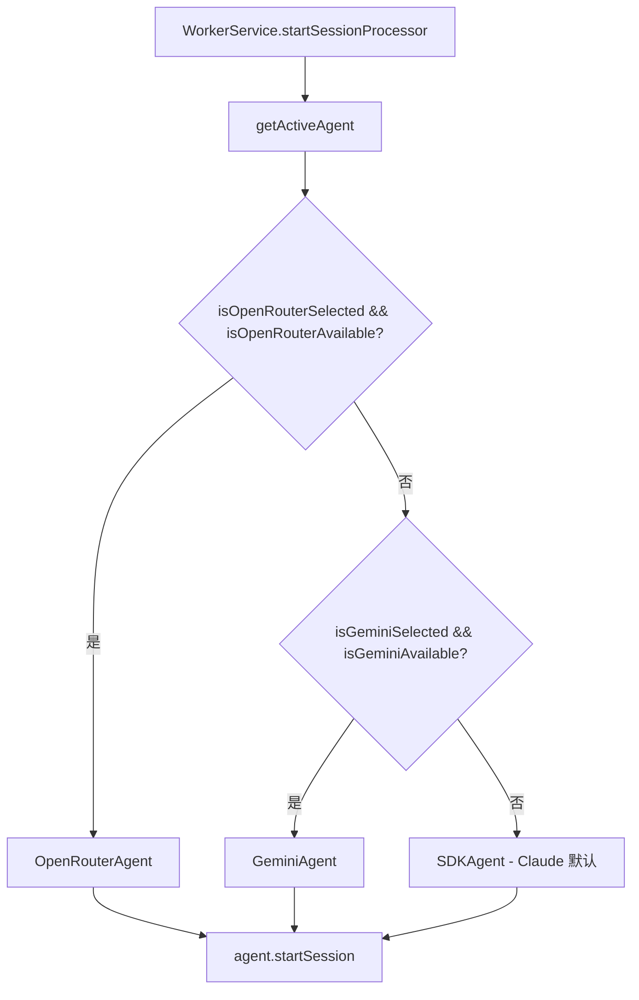
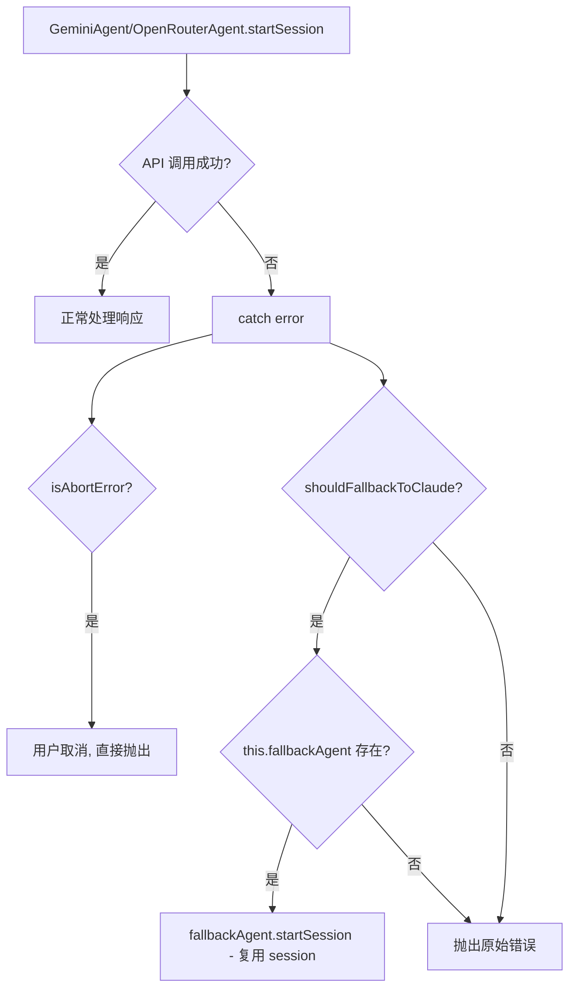
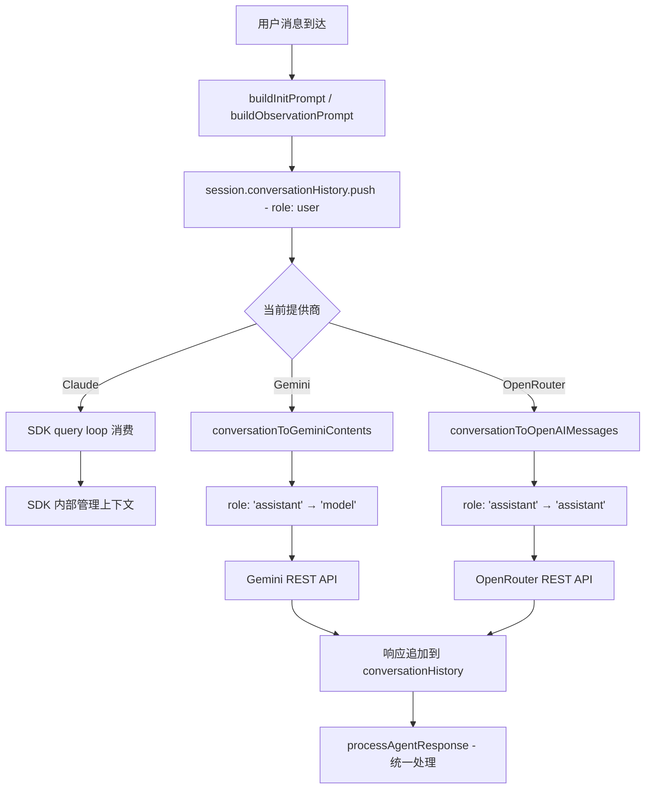

# PD-183.01 claude-mem — 三提供商路由与自动降级链

> 文档编号：PD-183.01
> 来源：claude-mem `src/services/worker/SDKAgent.ts` `GeminiAgent.ts` `OpenRouterAgent.ts`
> GitHub：https://github.com/thedotmack/claude-mem.git
> 问题域：PD-183 多 AI 提供商路由 Multi-Provider Routing
> 状态：可复用方案

---

## 第 1 章 问题与动机

### 1.1 核心问题

当 Agent 系统依赖单一 LLM 提供商时，面临三个工程风险：

1. **可用性风险** — 提供商 API 宕机或限流时整个系统不可用
2. **成本风险** — 不同提供商定价差异巨大（Claude API vs Gemini 免费层 vs OpenRouter 免费模型），无法按需选择
3. **上下文断裂** — 切换提供商后对话历史丢失，Agent 失去之前的推理上下文

claude-mem 作为 Claude Code 的记忆层（观察提取 + 持久化），需要持续运行的 LLM 推理能力。如果 Claude SDK 不可用（API key 失效、进程崩溃、限流），记忆提取就完全停止。这对一个后台常驻服务来说是不可接受的。

### 1.2 claude-mem 的解法概述

claude-mem 实现了三层提供商架构：

1. **SDKAgent** — 通过 Claude Agent SDK 调用 Claude Code CLI 子进程，支持 session resume（`src/services/worker/SDKAgent.ts:131-147`）
2. **GeminiAgent** — 直接调用 Google Gemini REST API，内置 RPM 速率限制器（`src/services/worker/GeminiAgent.ts:64-83`）
3. **OpenRouterAgent** — 通过 OpenRouter 统一 API 访问 100+ 模型，内置上下文窗口截断保护（`src/services/worker/OpenRouterAgent.ts:296-335`）

三者通过 `CLAUDE_MEM_PROVIDER` 配置项选择主提供商，通过 `FallbackErrorHandler` 实现自动降级（`src/services/worker/agents/FallbackErrorHandler.ts:25-29`），通过 `session.conversationHistory: ConversationMessage[]` 共享对话上下文（`src/services/worker-types.ts:14-18`）。

### 1.3 设计思想

| 设计原则 | 具体实现 | 理由 | 替代方案 |
|----------|----------|------|----------|
| 提供商无关的对话历史 | `ConversationMessage[]` 只含 role + content，不含提供商特定字段 | 降级时可直接传递给新提供商，无需格式转换 | 每个提供商维护独立历史（会导致上下文断裂） |
| 配置驱动选择 + 运行时降级 | `CLAUDE_MEM_PROVIDER` 选主提供商，`shouldFallbackToClaude()` 检测错误模式触发降级 | 用户可选最便宜的提供商，出错时自动回退到最可靠的 Claude | 硬编码优先级链（不灵活） |
| 合成 Session ID | Gemini/OpenRouter 生成 `gemini-{contentSessionId}-{timestamp}` 格式的 memorySessionId | 无状态 REST API 没有原生 session 概念，但数据库 FK 约束需要 session ID | 不生成 ID（会导致 FK 约束违反） |
| 凭证隔离 | `EnvManager.buildIsolatedEnv()` 从 `~/.claude-mem/.env` 加载，屏蔽项目级 `.env` | 防止 Issue #733：项目 `.env` 中的 `ANTHROPIC_API_KEY` 污染记忆 Agent 的计费 | 直接用 `process.env`（不安全） |
| 统一响应处理 | 三个 Agent 共用 `processAgentResponse()` 函数 | 观察提取、数据库存储、SSE 广播逻辑只写一次 | 每个 Agent 独立实现（代码重复） |

---

## 第 2 章 源码实现分析

### 2.1 架构概览

claude-mem 的多提供商路由架构分为三层：配置层、路由层、执行层。

```
┌─────────────────────────────────────────────────────────┐
│                    WorkerService                         │
│  ┌──────────────────────────────────────────────────┐   │
│  │  getActiveAgent()  ← CLAUDE_MEM_PROVIDER 配置     │   │
│  │  ┌──────────┐  ┌──────────┐  ┌───────────────┐  │   │
│  │  │ SDKAgent │  │GeminiAgent│  │OpenRouterAgent│  │   │
│  │  │ (Claude) │  │ (Google)  │  │ (100+ models) │  │   │
│  │  └────┬─────┘  └─────┬────┘  └──────┬────────┘  │   │
│  │       │              │               │            │   │
│  │       │    ┌─────────┴───────────────┘            │   │
│  │       │    │  setFallbackAgent(sdkAgent)           │   │
│  │       │    ▼                                       │   │
│  │       │  FallbackErrorHandler                      │   │
│  │       │  shouldFallbackToClaude()                  │   │
│  │       │  [429, 500, 502, 503, ECONNREFUSED, ...]   │   │
│  └───────┼──────────────────────────────────────────┘   │
│          ▼                                               │
│  ┌──────────────────────────────────────────────────┐   │
│  │  session.conversationHistory: ConversationMessage[]│   │
│  │  { role: 'user'|'assistant', content: string }    │   │
│  └──────────────────────────────────────────────────┘   │
│          ▼                                               │
│  ┌──────────────────────────────────────────────────┐   │
│  │  processAgentResponse() → DB + Chroma + SSE       │   │
│  └──────────────────────────────────────────────────┘   │
└─────────────────────────────────────────────────────────┘
```

### 2.2 核心实现

#### 2.2.1 提供商选择：配置驱动的路由



对应源码 `src/services/worker-service.ts:509-517`：

```typescript
private getActiveAgent(): SDKAgent | GeminiAgent | OpenRouterAgent {
    if (isOpenRouterSelected() && isOpenRouterAvailable()) {
      return this.openRouterAgent;
    }
    if (isGeminiSelected() && isGeminiAvailable()) {
      return this.geminiAgent;
    }
    return this.sdkAgent;
  }
```

选择逻辑的关键点：每个提供商有两个独立检查函数 — `isXxxSelected()` 检查 `CLAUDE_MEM_PROVIDER` 配置值，`isXxxAvailable()` 检查 API key 是否存在。两者都满足才会选中该提供商，否则回退到 Claude SDK（默认）。

#### 2.2.2 自动降级链：错误模式匹配



对应源码 `src/services/worker/GeminiAgent.ts:321-342`：

```typescript
} catch (error: unknown) {
      if (isAbortError(error)) {
        logger.warn('SDK', 'Gemini agent aborted', { sessionId: session.sessionDbId });
        throw error;
      }

      // Check if we should fall back to Claude
      if (shouldFallbackToClaude(error) && this.fallbackAgent) {
        logger.warn('SDK', 'Gemini API failed, falling back to Claude SDK', {
          sessionDbId: session.sessionDbId,
          error: error instanceof Error ? error.message : String(error),
          historyLength: session.conversationHistory.length
        });

        // Fall back to Claude - it will use the same session with shared conversationHistory
        return this.fallbackAgent.startSession(session, worker);
      }

      logger.failure('SDK', 'Gemini agent error', { sessionDbId: session.sessionDbId }, error as Error);
      throw error;
    }
```

`shouldFallbackToClaude()` 的错误模式定义在 `src/services/worker/agents/types.ts:125-133`：

```typescript
export const FALLBACK_ERROR_PATTERNS = [
  '429',           // Rate limit
  '500',           // Internal server error
  '502',           // Bad gateway
  '503',           // Service unavailable
  'ECONNREFUSED',  // Connection refused
  'ETIMEDOUT',     // Timeout
  'fetch failed',  // Network failure
] as const;
```

降级链的方向是单向的：Gemini → Claude，OpenRouter → Claude。Claude 作为最终兜底不再降级。此外，`WorkerService.runFallbackForTerminatedSession()` 提供了第二层降级：当 Claude SDK resume 失败时，尝试 Gemini → OpenRouter → 放弃（`src/services/worker-service.ts:698-748`）。

#### 2.2.3 跨提供商对话历史共享



对应源码 `src/services/worker-types.ts:14-18`（提供商无关的消息格式）：

```typescript
export interface ConversationMessage {
  role: 'user' | 'assistant';
  content: string;
}
```

GeminiAgent 的角色映射 `src/services/worker/GeminiAgent.ts:349-354`：

```typescript
private conversationToGeminiContents(history: ConversationMessage[]): GeminiContent[] {
    return history.map(msg => ({
      role: msg.role === 'assistant' ? 'model' : 'user',
      parts: [{ text: msg.content }]
    }));
  }
```

关键设计：`ConversationMessage` 只包含 `role` 和 `content` 两个字段，不含任何提供商特定的元数据（如 Gemini 的 `parts` 结构或 OpenAI 的 `function_call`）。每个 Agent 在调用 API 前将其转换为提供商特定格式，响应后再转回通用格式追加到共享历史。

### 2.3 实现细节

#### 速率限制器（Gemini 免费层保护）

GeminiAgent 内置了基于模型的 RPM 速率限制器（`src/services/worker/GeminiAgent.ts:46-83`）。每个模型有不同的免费层限制（如 `gemini-2.5-flash`: 10 RPM，`gemini-2.0-flash-lite`: 30 RPM），通过全局 `lastRequestTime` 变量和 `enforceRateLimitForModel()` 函数实现最小间隔控制。付费用户可通过 `CLAUDE_MEM_GEMINI_RATE_LIMITING_ENABLED=false` 关闭。

#### 上下文窗口截断（OpenRouter 成本保护）

OpenRouterAgent 实现了滑动窗口截断（`src/services/worker/OpenRouterAgent.ts:296-335`），通过 `MAX_CONTEXT_MESSAGES`（默认 20）和 `MAX_ESTIMATED_TOKENS`（默认 100k）双重限制防止上下文膨胀。截断策略是保留最近的消息（从后往前扫描），丢弃最早的历史。

#### 合成 Session ID

Gemini 和 OpenRouter 都是无状态 REST API，没有原生 session 概念。但 claude-mem 的数据库 FK 约束要求每个 observation 关联一个 `memory_session_id`。解决方案是在 session 初始化时生成合成 ID：

- Gemini: `gemini-{contentSessionId}-{timestamp}`（`GeminiAgent.ts:142`）
- OpenRouter: `openrouter-{contentSessionId}-{timestamp}`（`OpenRouterAgent.ts:97`）

#### 三层配置优先级

`SettingsDefaultsManager.loadFromFile()` 实现了三层配置合并（`src/shared/SettingsDefaultsManager.ts:190-243`）：

```
环境变量 (process.env) > 配置文件 (~/.claude-mem/settings.json) > 硬编码默认值
```

每个提供商的 API key 还有额外的查找路径：先查 settings 中的专用 key（如 `CLAUDE_MEM_GEMINI_API_KEY`），再查 `~/.claude-mem/.env` 中的通用 key（如 `GEMINI_API_KEY`）。

---

## 第 3 章 迁移指南

### 3.1 迁移清单

**阶段 1：定义提供商无关的对话协议**

- [ ] 定义 `ConversationMessage` 接口（只含 `role` + `content`）
- [ ] 定义 `FallbackAgent` 接口（只需 `startSession()` 方法）
- [ ] 在 session 对象中添加 `conversationHistory: ConversationMessage[]` 字段

**阶段 2：实现各提供商 Agent**

- [ ] 实现主 Agent（如 Claude SDK Agent），包含完整的 session 管理
- [ ] 实现备选 Agent（如 Gemini REST Agent），包含角色映射逻辑
- [ ] 每个 Agent 的 `startSession()` 方法接收共享 session 对象
- [ ] 每个 Agent 在发送消息前将 `ConversationMessage[]` 转换为提供商特定格式
- [ ] 每个 Agent 在收到响应后将结果追加回 `conversationHistory`

**阶段 3：实现降级链**

- [ ] 定义错误模式列表（HTTP 状态码 + 网络错误）
- [ ] 在备选 Agent 的 catch 块中检查错误模式，匹配则调用 `fallbackAgent.startSession()`
- [ ] 通过 `setFallbackAgent()` 注入降级目标（避免循环依赖）

**阶段 4：配置与凭证管理**

- [ ] 实现配置优先级：环境变量 > 配置文件 > 默认值
- [ ] 实现凭证隔离（专用 `.env` 文件，不读取项目级环境变量）
- [ ] 实现 `isXxxSelected()` + `isXxxAvailable()` 双重检查

### 3.2 适配代码模板

以下是一个可直接复用的 TypeScript 多提供商路由框架：

```typescript
// ============================================================
// 1. 提供商无关的对话协议
// ============================================================

interface ConversationMessage {
  role: 'user' | 'assistant';
  content: string;
}

interface AgentSession {
  id: string;
  conversationHistory: ConversationMessage[];
  abortController: AbortController;
}

interface FallbackAgent {
  startSession(session: AgentSession): Promise<string>;
}

// ============================================================
// 2. 错误模式匹配降级
// ============================================================

const FALLBACK_ERROR_PATTERNS = [
  '429', '500', '502', '503',
  'ECONNREFUSED', 'ETIMEDOUT', 'fetch failed',
] as const;

function shouldFallback(error: unknown): boolean {
  const message = error instanceof Error ? error.message : String(error);
  return FALLBACK_ERROR_PATTERNS.some(p => message.includes(p));
}

// ============================================================
// 3. 提供商 Agent 基类模式
// ============================================================

abstract class BaseProviderAgent implements FallbackAgent {
  protected fallbackAgent: FallbackAgent | null = null;

  setFallbackAgent(agent: FallbackAgent): void {
    this.fallbackAgent = agent;
  }

  async startSession(session: AgentSession): Promise<string> {
    try {
      // 将通用历史转换为提供商特定格式
      const messages = this.convertHistory(session.conversationHistory);
      const response = await this.callAPI(messages);

      // 追加响应到共享历史
      session.conversationHistory.push({ role: 'assistant', content: response });
      return response;
    } catch (error) {
      if (shouldFallback(error) && this.fallbackAgent) {
        // 降级：传递同一个 session（含完整对话历史）
        return this.fallbackAgent.startSession(session);
      }
      throw error;
    }
  }

  protected abstract convertHistory(history: ConversationMessage[]): unknown[];
  protected abstract callAPI(messages: unknown[]): Promise<string>;
}

// ============================================================
// 4. 配置驱动的路由选择
// ============================================================

type ProviderName = 'claude' | 'gemini' | 'openrouter';

function getActiveAgent(
  agents: Record<ProviderName, FallbackAgent>,
  config: { provider: ProviderName; available: Record<ProviderName, boolean> }
): FallbackAgent {
  const selected = config.provider;
  if (config.available[selected]) {
    return agents[selected];
  }
  // 回退到默认提供商
  return agents.claude;
}
```

### 3.3 适用场景

| 场景 | 适用度 | 说明 |
|------|--------|------|
| 后台常驻 Agent 服务 | ⭐⭐⭐ | 需要高可用性，降级链保证服务不中断 |
| 成本敏感的批量处理 | ⭐⭐⭐ | 主用免费层（Gemini/OpenRouter），失败时回退到付费 API |
| 多模型 A/B 测试 | ⭐⭐ | 通过配置切换提供商，但缺少自动分流和指标对比 |
| 实时对话应用 | ⭐⭐ | 降级时有延迟，但对话历史不丢失 |
| 单次 API 调用场景 | ⭐ | 过度设计，直接用 try-catch 重试即可 |

---

## 第 4 章 测试用例

```typescript
import { describe, it, expect, vi, beforeEach } from 'vitest';

// ============================================================
// 测试：提供商无关的对话历史
// ============================================================

interface ConversationMessage {
  role: 'user' | 'assistant';
  content: string;
}

describe('ConversationMessage 跨提供商兼容性', () => {
  it('应能转换为 Gemini 格式（assistant → model）', () => {
    const history: ConversationMessage[] = [
      { role: 'user', content: 'Hello' },
      { role: 'assistant', content: 'Hi there' },
    ];

    const geminiContents = history.map(msg => ({
      role: msg.role === 'assistant' ? 'model' : 'user',
      parts: [{ text: msg.content }],
    }));

    expect(geminiContents[0].role).toBe('user');
    expect(geminiContents[1].role).toBe('model');
    expect(geminiContents[1].parts[0].text).toBe('Hi there');
  });

  it('应能转换为 OpenAI 格式（保持 assistant 不变）', () => {
    const history: ConversationMessage[] = [
      { role: 'user', content: 'Hello' },
      { role: 'assistant', content: 'Hi there' },
    ];

    const openaiMessages = history.map(msg => ({
      role: msg.role,
      content: msg.content,
    }));

    expect(openaiMessages[1].role).toBe('assistant');
  });
});

// ============================================================
// 测试：错误模式匹配降级
// ============================================================

const FALLBACK_ERROR_PATTERNS = ['429', '500', '502', '503', 'ECONNREFUSED', 'ETIMEDOUT', 'fetch failed'];

function shouldFallbackToClaude(error: unknown): boolean {
  const message = error instanceof Error ? error.message : String(error);
  return FALLBACK_ERROR_PATTERNS.some(pattern => message.includes(pattern));
}

describe('FallbackErrorHandler', () => {
  it('应对 429 限流错误触发降级', () => {
    expect(shouldFallbackToClaude(new Error('Gemini API error: 429 - Rate limit exceeded'))).toBe(true);
  });

  it('应对 500 服务器错误触发降级', () => {
    expect(shouldFallbackToClaude(new Error('OpenRouter API error: 500 - Internal server error'))).toBe(true);
  });

  it('应对网络连接失败触发降级', () => {
    expect(shouldFallbackToClaude(new Error('fetch failed: ECONNREFUSED'))).toBe(true);
  });

  it('不应对 API key 无效错误触发降级', () => {
    expect(shouldFallbackToClaude(new Error('Invalid API key'))).toBe(false);
  });

  it('不应对 AbortError 触发降级', () => {
    const abortError = new Error('The operation was aborted');
    abortError.name = 'AbortError';
    expect(shouldFallbackToClaude(abortError)).toBe(false);
  });
});

// ============================================================
// 测试：提供商选择逻辑
// ============================================================

describe('getActiveAgent 路由选择', () => {
  const mockAgents = {
    claude: { name: 'SDKAgent' },
    gemini: { name: 'GeminiAgent' },
    openrouter: { name: 'OpenRouterAgent' },
  };

  it('配置为 gemini 且可用时应选择 GeminiAgent', () => {
    const agent = getActiveAgent(mockAgents, 'gemini', { gemini: true, openrouter: false });
    expect(agent.name).toBe('GeminiAgent');
  });

  it('配置为 gemini 但不可用时应回退到 SDKAgent', () => {
    const agent = getActiveAgent(mockAgents, 'gemini', { gemini: false, openrouter: false });
    expect(agent.name).toBe('SDKAgent');
  });

  it('配置为 openrouter 且可用时应选择 OpenRouterAgent', () => {
    const agent = getActiveAgent(mockAgents, 'openrouter', { gemini: false, openrouter: true });
    expect(agent.name).toBe('OpenRouterAgent');
  });

  it('默认应选择 SDKAgent (Claude)', () => {
    const agent = getActiveAgent(mockAgents, 'claude', { gemini: true, openrouter: true });
    expect(agent.name).toBe('SDKAgent');
  });
});

function getActiveAgent(
  agents: Record<string, { name: string }>,
  provider: string,
  available: Record<string, boolean>
) {
  if (provider === 'openrouter' && available.openrouter) return agents.openrouter;
  if (provider === 'gemini' && available.gemini) return agents.gemini;
  return agents.claude;
}

// ============================================================
// 测试：上下文窗口截断
// ============================================================

describe('OpenRouter 上下文截断', () => {
  it('应在超过消息数限制时截断最早的消息', () => {
    const history: ConversationMessage[] = Array.from({ length: 25 }, (_, i) => ({
      role: i % 2 === 0 ? 'user' as const : 'assistant' as const,
      content: `Message ${i}`,
    }));

    const MAX_MESSAGES = 20;
    const truncated = history.length > MAX_MESSAGES
      ? history.slice(history.length - MAX_MESSAGES)
      : history;

    expect(truncated.length).toBe(20);
    expect(truncated[0].content).toBe('Message 5');  // 最早的 5 条被丢弃
  });

  it('应在超过 token 估算限制时截断', () => {
    const CHARS_PER_TOKEN = 4;
    const MAX_TOKENS = 1000;

    const history: ConversationMessage[] = [
      { role: 'user', content: 'A'.repeat(3000) },  // ~750 tokens
      { role: 'assistant', content: 'B'.repeat(2000) },  // ~500 tokens
      { role: 'user', content: 'C'.repeat(400) },  // ~100 tokens
    ];

    // 从后往前扫描，保留在 token 预算内的消息
    const truncated: ConversationMessage[] = [];
    let tokenCount = 0;
    for (let i = history.length - 1; i >= 0; i--) {
      const msgTokens = Math.ceil(history[i].content.length / CHARS_PER_TOKEN);
      if (tokenCount + msgTokens > MAX_TOKENS) break;
      truncated.unshift(history[i]);
      tokenCount += msgTokens;
    }

    expect(truncated.length).toBe(2);  // 第一条太大被丢弃
    expect(truncated[0].content.startsWith('B')).toBe(true);
  });
});

// ============================================================
// 测试：降级时对话历史保持
// ============================================================

describe('降级时对话历史连续性', () => {
  it('降级到 Claude 后应保留之前的对话历史', async () => {
    const session = {
      conversationHistory: [
        { role: 'user' as const, content: 'Initial prompt' },
        { role: 'assistant' as const, content: 'Gemini response 1' },
        { role: 'user' as const, content: 'Follow-up observation' },
      ],
    };

    // 模拟降级：Gemini 失败，传递同一个 session 给 Claude
    const fallbackReceived = session.conversationHistory;

    expect(fallbackReceived.length).toBe(3);
    expect(fallbackReceived[1].content).toBe('Gemini response 1');
    // Claude 可以看到 Gemini 之前的响应，上下文不断裂
  });
});
```

---

## 第 5 章 跨域关联

| 关联域 | 关系类型 | 说明 |
|--------|----------|------|
| PD-01 上下文管理 | 协同 | OpenRouterAgent 的 `truncateHistory()` 实现了上下文窗口管理，通过滑动窗口截断防止 token 超限 |
| PD-03 容错与重试 | 依赖 | `FallbackErrorHandler` 是容错机制的核心，错误模式匹配决定是降级还是抛出 |
| PD-06 记忆持久化 | 协同 | 三个 Agent 共用 `processAgentResponse()` 将观察写入 SQLite + Chroma，提供商切换不影响持久化 |
| PD-11 可观测性 | 协同 | 每个 Agent 记录 token 使用量（`cumulativeInputTokens/OutputTokens`），OpenRouter 还计算估算成本 |
| PD-175 配置管理 | 依赖 | `SettingsDefaultsManager` 的三层配置优先级（env > file > defaults）驱动提供商选择和模型配置 |

---

## 第 6 章 来源文件索引

| 文件 | 行范围 | 关键实现 |
|------|--------|----------|
| `src/services/worker/SDKAgent.ts` | L30-488 | Claude Agent SDK 集成，session resume，进程管理 |
| `src/services/worker/GeminiAgent.ts` | L109-452 | Gemini REST API 调用，RPM 速率限制，角色映射 |
| `src/services/worker/OpenRouterAgent.ts` | L64-474 | OpenRouter API 调用，上下文截断，成本追踪 |
| `src/services/worker/agents/FallbackErrorHandler.ts` | L25-74 | 错误模式匹配，降级决策，AbortError 检测 |
| `src/services/worker/agents/types.ts` | L106-133 | FallbackAgent 接口，FALLBACK_ERROR_PATTERNS 常量 |
| `src/services/worker-types.ts` | L14-43 | ConversationMessage 接口，ActiveSession 定义 |
| `src/services/worker-service.ts` | L509-748 | getActiveAgent() 路由选择，runFallbackForTerminatedSession() 二级降级 |
| `src/shared/SettingsDefaultsManager.ts` | L73-243 | 三层配置优先级，提供商默认值定义 |
| `src/shared/EnvManager.ts` | L192-232 | 凭证隔离，buildIsolatedEnv() 环境构建 |

---

## 第 7 章 横向对比维度

```json comparison_data
{
  "project": "claude-mem",
  "dimensions": {
    "路由策略": "配置驱动选择 + isSelected() && isAvailable() 双重检查",
    "降级方向": "单向降级链：Gemini→Claude, OpenRouter→Claude；SDK失败时 Gemini→OpenRouter→放弃",
    "对话历史": "ConversationMessage[] 提供商无关格式，降级时直接传递共享 session",
    "速率控制": "Gemini 内置 RPM 限制器（按模型），OpenRouter 滑动窗口截断（消息数+token数）",
    "凭证管理": "集中式 ~/.claude-mem/.env + SettingsDefaultsManager 三层优先级，屏蔽项目级污染"
  }
}
```

### 域元数据补充

```json domain_metadata
{
  "solution_summary": "claude-mem 通过 SDKAgent/GeminiAgent/OpenRouterAgent 三 Agent 架构实现配置驱动的提供商选择，FallbackErrorHandler 基于 HTTP 状态码模式匹配实现单向自动降级链，共享 ConversationMessage[] 保证跨提供商上下文连续",
  "description": "提供商路由不仅是选择问题，还涉及凭证隔离、速率适配和无状态 API 的 session 模拟",
  "sub_problems": [
    "无状态 REST API 的合成 Session ID 与 FK 约束兼容",
    "项目级环境变量对 Agent 凭证的污染防护"
  ],
  "best_practices": [
    "用 isSelected() + isAvailable() 双重检查避免配置了但 key 缺失的提供商被选中",
    "降级时传递同一个 session 对象而非创建新 session，确保对话历史零丢失"
  ]
}
```
