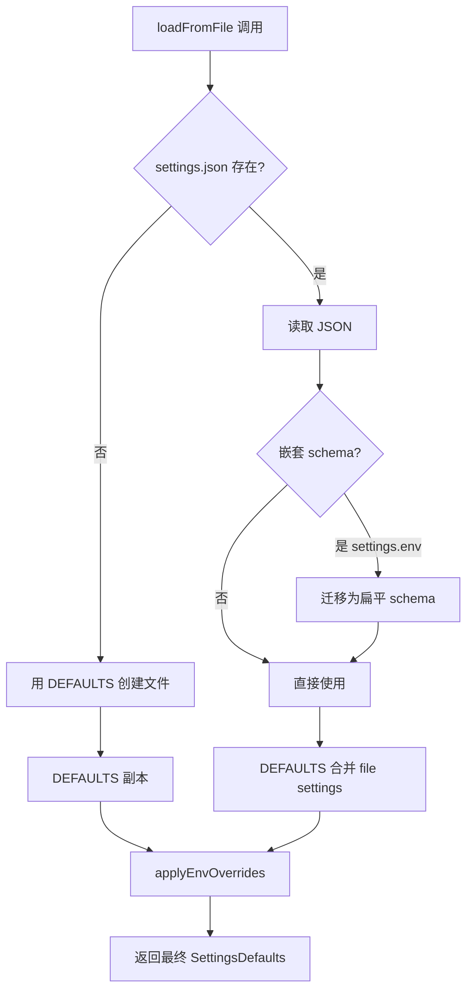
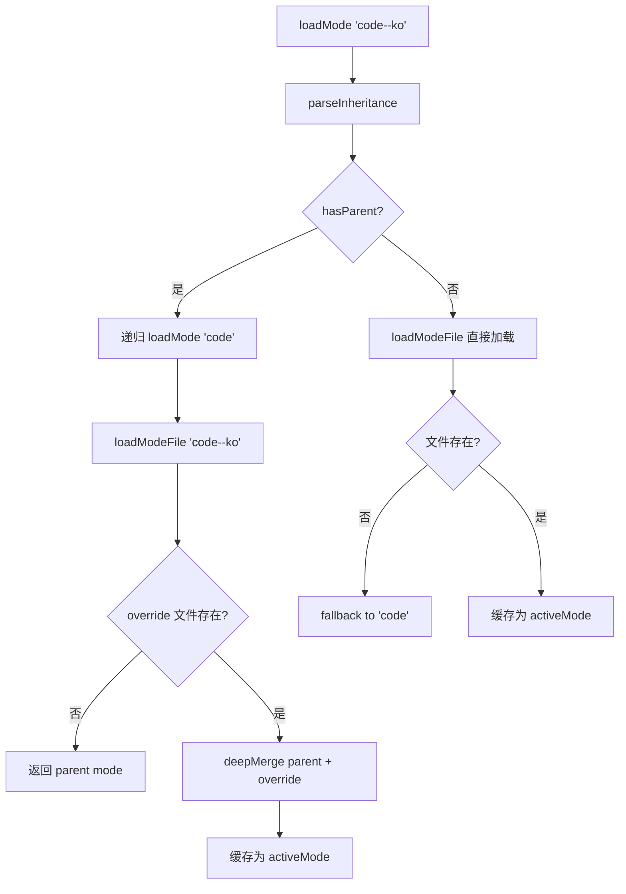
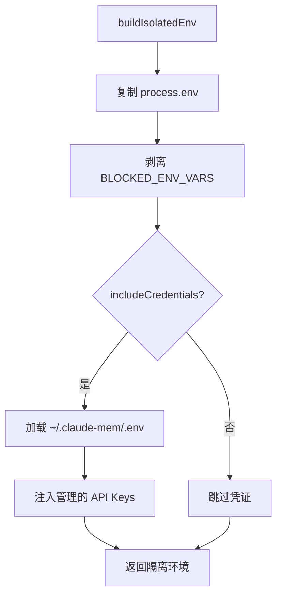

# PD-184.01 claude-mem — 三级优先级配置与模式继承

> 文档编号：PD-184.01
> 来源：claude-mem `src/shared/SettingsDefaultsManager.ts` `src/services/domain/ModeManager.ts`
> GitHub：https://github.com/thedotmack/claude-mem.git
> 问题域：PD-184 配置管理 Configuration Management
> 状态：可复用方案

---

## 第 1 章 问题与动机

### 1.1 核心问题

Agent 系统的配置管理面临三个层次的挑战：

1. **配置散落**：40+ 配置项分散在环境变量、JSON 文件、代码硬编码中，没有统一入口，修改一个配置需要搜索整个代码库
2. **优先级冲突**：用户在 settings.json 中设置了值，但环境变量覆盖了它，或者反过来——没有明确的优先级规则导致行为不可预测
3. **模式切换**：同一个 Agent 需要在不同场景下（代码开发 vs 邮件调查 vs 多语言）使用完全不同的配置集，且需要支持配置的继承和覆盖

claude-mem 作为 Claude Code 的记忆插件，需要管理 AI Provider 选择、向量数据库连接、观察类型过滤、Token 经济学显示等 40+ 配置项，同时支持 32 种模式（code + 30 种语言变体 + email-investigation）。

### 1.2 claude-mem 的解法概述

1. **SettingsDefaultsManager 静态类**作为全局配置真相源，所有 40+ 配置项在一处定义默认值（`src/shared/SettingsDefaultsManager.ts:77-133`）
2. **三级优先级合并**：`process.env > settings.json > DEFAULTS`，在 `loadFromFile()` 中一次性完成（`src/shared/SettingsDefaultsManager.ts:190-243`）
3. **ModeManager 单例**管理模式配置，支持 `parent--override` 继承语法（如 `code--ko`），通过 deepMerge 实现部分覆盖（`src/services/domain/ModeManager.ts:133-198`）
4. **EnvManager 凭证隔离**：敏感 API Key 存储在独立的 `~/.claude-mem/.env` 中，子进程环境用 blocklist 方式剥离危险变量（`src/shared/EnvManager.ts:192-232`）
5. **ContextConfigLoader 桥接层**：将 SettingsDefaultsManager 的扁平配置 + ModeManager 的模式配置转换为类型安全的 ContextConfig 对象（`src/services/context/ContextConfigLoader.ts:17-57`）

### 1.3 设计思想

| 设计原则 | 具体实现 | 理由 | 替代方案 |
|----------|----------|------|----------|
| 单一真相源 | SettingsDefaultsManager 静态类集中定义所有默认值 | 避免 40+ 配置项散落在各模块中，修改默认值只需改一处 | 每个模块自行定义默认值（散落、不一致） |
| 显式优先级链 | env > file > defaults，在 loadFromFile 中一次性合并 | 用户可预测配置行为：环境变量总是最高优先级 | 隐式覆盖（如 dotenv 的 override 参数） |
| 模式继承 | `code--ko` = code.json deepMerge code--ko.json | 30 种语言变体只需覆盖 prompts 字段，不重复 observation_types 等公共配置 | 每种语言一个完整配置文件（大量重复） |
| 凭证隔离 | EnvManager 用 blocklist 剥离 ANTHROPIC_API_KEY | 防止项目 .env 中的 API Key 被子进程自动发现导致误计费 | 白名单方式（容易遗漏合法变量） |
| 循环依赖规避 | logger.ts 内联 DEFAULT_DATA_DIR 而非导入 SettingsDefaultsManager | SettingsDefaultsManager 是最底层模块，不能依赖 logger | 延迟导入（增加复杂度） |

---

## 第 2 章 源码实现分析

### 2.1 架构概览

claude-mem 的配置系统由四个核心模块组成，形成清晰的分层架构：

```
┌─────────────────────────────────────────────────────────┐
│                   消费层 (Consumers)                      │
│  session-init.ts │ SDKAgent.ts │ worker-service.ts │ ... │
└────────────┬──────────────┬──────────────┬──────────────┘
             │              │              │
┌────────────▼──────────────▼──────────────▼──────────────┐
│              ContextConfigLoader (桥接层)                  │
│  loadContextConfig() → ContextConfig 类型安全对象          │
└────────────┬──────────────────────────────┬──────────────┘
             │                              │
┌────────────▼────────────┐  ┌──────────────▼──────────────┐
│  SettingsDefaultsManager │  │       ModeManager            │
│  (静态类 · 配置真相源)    │  │  (单例 · 模式继承引擎)       │
│  40+ 配置项              │  │  32 种模式 JSON              │
│  三级优先级合并           │  │  parent--override 继承       │
└────────────┬────────────┘  └──────────────┬──────────────┘
             │                              │
┌────────────▼────────────┐  ┌──────────────▼──────────────┐
│  ~/.claude-mem/          │  │  plugin/modes/               │
│  settings.json           │  │  code.json                   │
│  .env (凭证隔离)         │  │  code--ko.json               │
└─────────────────────────┘  │  email-investigation.json     │
                             └─────────────────────────────┘
```

### 2.2 核心实现

#### 2.2.1 SettingsDefaultsManager：三级优先级合并



对应源码 `src/shared/SettingsDefaultsManager.ts:190-243`：

```typescript
static loadFromFile(settingsPath: string): SettingsDefaults {
  try {
    if (!existsSync(settingsPath)) {
      const defaults = this.getAllDefaults();
      try {
        const dir = dirname(settingsPath);
        if (!existsSync(dir)) {
          mkdirSync(dir, { recursive: true });
        }
        writeFileSync(settingsPath, JSON.stringify(defaults, null, 2), 'utf-8');
      } catch (error) {
        console.warn('[SETTINGS] Failed to create settings file, using in-memory defaults:', settingsPath, error);
      }
      return this.applyEnvOverrides(defaults);
    }

    const settingsData = readFileSync(settingsPath, 'utf-8');
    const settings = JSON.parse(settingsData);

    // MIGRATION: Handle old nested schema { env: {...} }
    let flatSettings = settings;
    if (settings.env && typeof settings.env === 'object') {
      flatSettings = settings.env;
      try {
        writeFileSync(settingsPath, JSON.stringify(flatSettings, null, 2), 'utf-8');
      } catch (error) {
        console.warn('[SETTINGS] Failed to auto-migrate settings file:', settingsPath, error);
      }
    }

    // Merge file settings with defaults (flat schema)
    const result: SettingsDefaults = { ...this.DEFAULTS };
    for (const key of Object.keys(this.DEFAULTS) as Array<keyof SettingsDefaults>) {
      if (flatSettings[key] !== undefined) {
        result[key] = flatSettings[key];
      }
    }
    return this.applyEnvOverrides(result);
  } catch (error) {
    console.warn('[SETTINGS] Failed to load settings, using defaults:', settingsPath, error);
    return this.applyEnvOverrides(this.getAllDefaults());
  }
}
```

关键设计点：
- **自动创建**：首次运行时自动生成 settings.json，降低用户配置门槛（`SettingsDefaultsManager.ts:194-204`）
- **Schema 迁移**：自动将旧版嵌套格式 `{ env: {...} }` 迁移为扁平格式，向后兼容（`SettingsDefaultsManager.ts:212-226`）
- **全路径容错**：文件不存在、JSON 损坏、权限不足都优雅降级到默认值 + 环境变量（`SettingsDefaultsManager.ts:238-242`）
- **环境变量始终生效**：无论文件加载成功与否，`applyEnvOverrides` 都会执行（`SettingsDefaultsManager.ts:206, 237, 241`）

#### 2.2.2 ModeManager：模式继承引擎



对应源码 `src/services/domain/ModeManager.ts:49-72`（继承解析）和 `ModeManager.ts:91-108`（深度合并）：

```typescript
private parseInheritance(modeId: string): {
  hasParent: boolean; parentId: string; overrideId: string;
} {
  const parts = modeId.split('--');
  if (parts.length === 1) {
    return { hasParent: false, parentId: '', overrideId: '' };
  }
  if (parts.length > 2) {
    throw new Error(
      `Invalid mode inheritance: ${modeId}. Only one level of inheritance supported (parent--override)`
    );
  }
  return {
    hasParent: true,
    parentId: parts[0],
    overrideId: modeId // Full modeId (e.g., code--es) to find override file
  };
}

private deepMerge<T>(base: T, override: Partial<T>): T {
  const result = { ...base } as T;
  for (const key in override) {
    const overrideValue = override[key];
    const baseValue = base[key];
    if (this.isPlainObject(overrideValue) && this.isPlainObject(baseValue)) {
      result[key] = this.deepMerge(baseValue, overrideValue as any);
    } else {
      result[key] = overrideValue as T[Extract<keyof T, string>];
    }
  }
  return result;
}
```

继承效果示例——`code--ko.json` 只有 24 行，仅覆盖 `name` 和 `prompts` 中的语言相关字段，其余 `observation_types`（6 种）、`observation_concepts`（7 种）、`prompts` 中的非语言字段全部继承自 `code.json`（125 行）。

### 2.3 实现细节

#### 凭证隔离：EnvManager 的 blocklist 策略



`EnvManager.ts:192-232` 的 `buildIsolatedEnv()` 使用 blocklist 而非 allowlist：只剥离 `ANTHROPIC_API_KEY` 和 `CLAUDECODE` 两个变量，其余全部透传。这解决了 Issue #733——项目 `.env` 中的 `ANTHROPIC_API_KEY` 被 SDK 自动发现导致误计费。

#### 循环依赖规避

`logger.ts:29` 内联了 `DEFAULT_DATA_DIR` 而非导入 `SettingsDefaultsManager`：

```typescript
// NOTE: This default must match DEFAULT_DATA_DIR in src/shared/SettingsDefaultsManager.ts
// Inlined here to avoid circular dependency with SettingsDefaultsManager
const DEFAULT_DATA_DIR = join(homedir(), '.claude-mem');
```

这是因为 `SettingsDefaultsManager` 是最底层模块（被 `paths.ts`、`worker-utils.ts`、`logger.ts` 等依赖），如果它反过来导入 logger 就会形成循环。

#### ContextConfigLoader：模式感知的配置桥接

`ContextConfigLoader.ts:22-41` 根据当前模式决定过滤策略：
- **code 模式**（含 `code--*` 变体）：使用 settings.json 中用户自定义的 observation_types/concepts 过滤
- **非 code 模式**（如 email-investigation）：使用模式 JSON 中定义的全部 types/concepts，忽略 settings 中的过滤配置


---

## 第 3 章 迁移指南

### 3.1 迁移清单

#### 阶段 1：配置真相源（必须）

- [ ] 创建 `SettingsDefaultsManager` 静态类，定义所有配置项的 TypeScript 接口和默认值
- [ ] 实现 `loadFromFile(path)` 方法：读取 JSON → 合并默认值 → 应用环境变量覆盖
- [ ] 实现 `get(key)` / `getInt(key)` / `getBool(key)` 类型安全访问器
- [ ] 将所有散落的 `process.env.XXX` 读取替换为 `SettingsDefaultsManager.get('XXX')`

#### 阶段 2：模式继承（按需）

- [ ] 定义 `ModeConfig` 接口（name, description, version, 领域特定字段）
- [ ] 创建 `ModeManager` 单例，实现 `loadMode(modeId)` + `parseInheritance()` + `deepMerge()`
- [ ] 在 `modes/` 目录下创建基础模式 JSON 和覆盖模式 JSON
- [ ] 在配置桥接层根据当前模式决定过滤/行为策略

#### 阶段 3：凭证隔离（推荐）

- [ ] 创建 `EnvManager`，将敏感凭证存储在独立 `.env` 文件中
- [ ] 实现 `buildIsolatedEnv()` 用 blocklist 方式为子进程构建安全环境
- [ ] 确保子进程不会自动发现项目级 `.env` 中的 API Key

### 3.2 适配代码模板

#### 最小可用的三级优先级配置管理器

```typescript
import { readFileSync, writeFileSync, existsSync, mkdirSync } from 'fs';
import { dirname } from 'path';

export interface AppSettings {
  APP_PORT: string;
  APP_LOG_LEVEL: string;
  APP_MODEL: string;
  APP_MAX_RETRIES: string;
  // ... 按需扩展
}

export class ConfigManager {
  private static readonly DEFAULTS: AppSettings = {
    APP_PORT: '3000',
    APP_LOG_LEVEL: 'INFO',
    APP_MODEL: 'claude-sonnet-4-5',
    APP_MAX_RETRIES: '3',
  };

  static get(key: keyof AppSettings): string {
    return this.DEFAULTS[key];
  }

  static getInt(key: keyof AppSettings): number {
    return parseInt(this.get(key), 10);
  }

  static getBool(key: keyof AppSettings): boolean {
    const v = this.get(key);
    return v === 'true' || v === (true as any);
  }

  private static applyEnvOverrides(settings: AppSettings): AppSettings {
    const result = { ...settings };
    for (const key of Object.keys(this.DEFAULTS) as Array<keyof AppSettings>) {
      if (process.env[key] !== undefined) {
        result[key] = process.env[key]!;
      }
    }
    return result;
  }

  static loadFromFile(settingsPath: string): AppSettings {
    try {
      if (!existsSync(settingsPath)) {
        const defaults = { ...this.DEFAULTS };
        try {
          const dir = dirname(settingsPath);
          if (!existsSync(dir)) mkdirSync(dir, { recursive: true });
          writeFileSync(settingsPath, JSON.stringify(defaults, null, 2), 'utf-8');
        } catch { /* graceful fallback */ }
        return this.applyEnvOverrides(defaults);
      }

      const data = JSON.parse(readFileSync(settingsPath, 'utf-8'));
      const result: AppSettings = { ...this.DEFAULTS };
      for (const key of Object.keys(this.DEFAULTS) as Array<keyof AppSettings>) {
        if (data[key] !== undefined) result[key] = data[key];
      }
      return this.applyEnvOverrides(result);
    } catch {
      return this.applyEnvOverrides({ ...this.DEFAULTS });
    }
  }
}
```

#### 最小可用的模式继承管理器

```typescript
import { readFileSync, existsSync } from 'fs';
import { join } from 'path';

export interface ModeConfig {
  name: string;
  description: string;
  [key: string]: any; // 领域特定字段
}

export class ModeManager {
  private static instance: ModeManager;
  private activeMode: ModeConfig | null = null;

  private constructor(private modesDir: string) {}

  static init(modesDir: string): ModeManager {
    if (!this.instance) this.instance = new ModeManager(modesDir);
    return this.instance;
  }

  static getInstance(): ModeManager {
    if (!this.instance) throw new Error('ModeManager not initialized');
    return this.instance;
  }

  loadMode(modeId: string): ModeConfig {
    const parts = modeId.split('--');
    if (parts.length === 1) {
      this.activeMode = this.loadFile(modeId);
      return this.activeMode;
    }
    if (parts.length > 2) throw new Error(`Only one inheritance level: ${modeId}`);

    const parent = this.loadMode(parts[0]);
    try {
      const override = this.loadFile(modeId);
      this.activeMode = this.deepMerge(parent, override);
      return this.activeMode;
    } catch {
      this.activeMode = parent;
      return parent;
    }
  }

  private loadFile(id: string): ModeConfig {
    const p = join(this.modesDir, `${id}.json`);
    if (!existsSync(p)) throw new Error(`Mode not found: ${p}`);
    return JSON.parse(readFileSync(p, 'utf-8'));
  }

  private deepMerge<T extends Record<string, any>>(base: T, override: Partial<T>): T {
    const result = { ...base };
    for (const key in override) {
      const ov = override[key], bv = base[key];
      if (ov && typeof ov === 'object' && !Array.isArray(ov) && bv && typeof bv === 'object' && !Array.isArray(bv)) {
        result[key] = this.deepMerge(bv, ov);
      } else {
        (result as any)[key] = ov;
      }
    }
    return result;
  }

  getActiveMode(): ModeConfig {
    if (!this.activeMode) throw new Error('No mode loaded');
    return this.activeMode;
  }
}
```

### 3.3 适用场景

| 场景 | 适用度 | 说明 |
|------|--------|------|
| Agent 插件/扩展（多配置项） | ⭐⭐⭐ | 40+ 配置项的统一管理，三级优先级合并 |
| 多语言/多模式 Agent | ⭐⭐⭐ | 模式继承避免配置重复，30 种语言变体只需覆盖文件 |
| 需要凭证隔离的子进程系统 | ⭐⭐⭐ | blocklist 方式防止 API Key 泄漏到子进程 |
| 简单 CLI 工具（< 10 配置项） | ⭐ | 过度设计，直接用环境变量即可 |
| 需要配置热加载的服务 | ⭐⭐ | claude-mem 不支持热加载，需自行扩展 watch 机制 |

---

## 第 4 章 测试用例

```typescript
import { describe, it, expect, beforeEach, afterEach } from 'vitest';
import { existsSync, writeFileSync, mkdirSync, rmSync } from 'fs';
import { join } from 'path';
import { tmpdir } from 'os';

// --- SettingsDefaultsManager 测试 ---

describe('SettingsDefaultsManager', () => {
  const testDir = join(tmpdir(), 'config-test-' + Date.now());
  const settingsPath = join(testDir, 'settings.json');

  beforeEach(() => {
    mkdirSync(testDir, { recursive: true });
    // Clean env overrides
    delete process.env.APP_PORT;
    delete process.env.APP_LOG_LEVEL;
  });

  afterEach(() => {
    rmSync(testDir, { recursive: true, force: true });
  });

  it('returns defaults when no file exists', () => {
    const settings = ConfigManager.loadFromFile(settingsPath);
    expect(settings.APP_PORT).toBe('3000');
    expect(settings.APP_LOG_LEVEL).toBe('INFO');
  });

  it('auto-creates settings file on first load', () => {
    ConfigManager.loadFromFile(settingsPath);
    expect(existsSync(settingsPath)).toBe(true);
  });

  it('merges file values over defaults', () => {
    writeFileSync(settingsPath, JSON.stringify({ APP_PORT: '8080' }));
    const settings = ConfigManager.loadFromFile(settingsPath);
    expect(settings.APP_PORT).toBe('8080');
    expect(settings.APP_LOG_LEVEL).toBe('INFO'); // default preserved
  });

  it('env vars override file and defaults', () => {
    writeFileSync(settingsPath, JSON.stringify({ APP_PORT: '8080' }));
    process.env.APP_PORT = '9999';
    const settings = ConfigManager.loadFromFile(settingsPath);
    expect(settings.APP_PORT).toBe('9999');
    delete process.env.APP_PORT;
  });

  it('gracefully handles corrupted JSON', () => {
    writeFileSync(settingsPath, '{ invalid json !!!');
    const settings = ConfigManager.loadFromFile(settingsPath);
    expect(settings.APP_PORT).toBe('3000'); // falls back to defaults
  });

  it('ignores unknown keys in settings file', () => {
    writeFileSync(settingsPath, JSON.stringify({ APP_PORT: '8080', UNKNOWN_KEY: 'value' }));
    const settings = ConfigManager.loadFromFile(settingsPath);
    expect(settings.APP_PORT).toBe('8080');
    expect((settings as any).UNKNOWN_KEY).toBeUndefined();
  });
});

// --- ModeManager 测试 ---

describe('ModeManager', () => {
  const modesDir = join(tmpdir(), 'modes-test-' + Date.now());

  beforeEach(() => {
    mkdirSync(modesDir, { recursive: true });
    writeFileSync(join(modesDir, 'base.json'), JSON.stringify({
      name: 'Base Mode',
      description: 'Base',
      types: ['a', 'b'],
      prompts: { greeting: 'Hello', footer: 'Bye' }
    }));
    writeFileSync(join(modesDir, 'base--fr.json'), JSON.stringify({
      name: 'Base Mode (French)',
      prompts: { greeting: 'Bonjour' }
    }));
  });

  afterEach(() => {
    rmSync(modesDir, { recursive: true, force: true });
  });

  it('loads base mode directly', () => {
    const mgr = ModeManager.init(modesDir);
    const mode = mgr.loadMode('base');
    expect(mode.name).toBe('Base Mode');
    expect(mode.types).toEqual(['a', 'b']);
  });

  it('inherits parent and merges override', () => {
    const mgr = ModeManager.init(modesDir);
    const mode = mgr.loadMode('base--fr');
    expect(mode.name).toBe('Base Mode (French)');
    expect(mode.prompts.greeting).toBe('Bonjour');
    expect(mode.prompts.footer).toBe('Bye'); // inherited
    expect(mode.types).toEqual(['a', 'b']); // inherited
  });

  it('rejects multi-level inheritance', () => {
    expect(() => {
      const mgr = ModeManager.init(modesDir);
      mgr.loadMode('a--b--c');
    }).toThrow('Only one inheritance level');
  });

  it('arrays are replaced not merged in override', () => {
    writeFileSync(join(modesDir, 'base--custom.json'), JSON.stringify({
      types: ['x']
    }));
    const mgr = ModeManager.init(modesDir);
    const mode = mgr.loadMode('base--custom');
    expect(mode.types).toEqual(['x']); // replaced, not ['a','b','x']
  });
});
```


---

## 第 5 章 跨域关联

| 关联域 | 关系类型 | 说明 |
|--------|----------|------|
| PD-01 上下文管理 | 协同 | ContextConfigLoader 根据配置决定注入多少 observation 到上下文窗口（totalObservationCount、sessionCount 等） |
| PD-06 记忆持久化 | 协同 | 配置管理决定数据存储路径（CLAUDE_MEM_DATA_DIR）、向量数据库连接参数（CHROMA_*）、观察类型过滤 |
| PD-11 可观测性 | 依赖 | logger.ts 依赖配置管理获取日志级别（CLAUDE_MEM_LOG_LEVEL），但为避免循环依赖内联了 DATA_DIR |
| PD-04 工具系统 | 协同 | CLAUDE_MEM_SKIP_TOOLS 配置项控制哪些工具被跳过，ModeManager 的 observation_types 定义了模式可用的工具类型 |

---

## 第 6 章 来源文件索引

| 文件 | 行范围 | 关键实现 |
|------|--------|----------|
| `src/shared/SettingsDefaultsManager.ts` | L1-244 | 40+ 配置项定义、三级优先级合并、Schema 迁移、类型安全访问器 |
| `src/services/domain/ModeManager.ts` | L1-254 | 单例模式管理器、`--` 继承解析、deepMerge、模式缓存 |
| `src/services/domain/types.ts` | L1-72 | ModeConfig/ObservationType/ObservationConcept/ModePrompts 接口定义 |
| `src/services/context/ContextConfigLoader.ts` | L1-57 | 配置桥接层、模式感知过滤策略 |
| `src/services/context/types.ts` | L1-137 | ContextConfig 接口、Observation/SessionSummary 数据结构 |
| `src/shared/EnvManager.ts` | L1-273 | 凭证隔离存储、blocklist 子进程环境构建、API Key 管理 |
| `src/shared/paths.ts` | L1-153 | 基于 SettingsDefaultsManager 派生所有路径常量 |
| `src/utils/logger.ts` | L1-60 | 内联 DEFAULT_DATA_DIR 规避循环依赖 |
| `src/constants/observation-metadata.ts` | L1-19 | 默认 observation types/concepts 字符串常量 |
| `plugin/modes/code.json` | L1-125 | 基础 code 模式完整配置（6 types + 7 concepts + 全部 prompts） |
| `plugin/modes/code--ko.json` | L1-24 | 韩语覆盖示例：仅覆盖 name + prompts 中的语言字段 |
| `plugin/modes/email-investigation.json` | L1-120 | 独立模式示例：完全不同的 types/concepts/prompts |

---

## 第 7 章 横向对比维度

```json comparison_data
{
  "project": "claude-mem",
  "dimensions": {
    "配置注册方式": "SettingsDefaults 接口 + 静态 DEFAULTS 对象，TypeScript 类型安全",
    "优先级策略": "三级合并：process.env > settings.json > DEFAULTS，env 始终最高",
    "模式/Profile 支持": "ModeManager 单例 + parent--override 继承语法，32 种模式",
    "凭证隔离": "EnvManager blocklist 剥离 + 独立 .env 文件，防子进程 API Key 泄漏",
    "Schema 迁移": "loadFromFile 自动检测嵌套格式并迁移为扁平格式，向后兼容"
  }
}
```

### 域元数据补充

```json domain_metadata
{
  "solution_summary": "claude-mem 用 SettingsDefaultsManager 静态类管理 40+ 配置项的三级优先级合并(env>file>defaults)，ModeManager 单例通过 parent--override 继承语法支持 32 种模式配置",
  "description": "配置系统需要处理循环依赖、Schema 迁移和子进程凭证隔离等工程挑战",
  "sub_problems": [
    "配置模块的循环依赖规避（底层模块不能依赖上层 logger）",
    "配置 Schema 版本迁移（嵌套→扁平格式自动转换）",
    "子进程环境变量的安全构建（blocklist vs allowlist 策略选择）"
  ],
  "best_practices": [
    "用 blocklist 而非 allowlist 构建子进程环境，只剥离已知危险变量，避免遗漏合法变量",
    "模式继承用 deepMerge 实现对象递归合并 + 数组完全替换，避免数组元素混乱"
  ]
}
```

