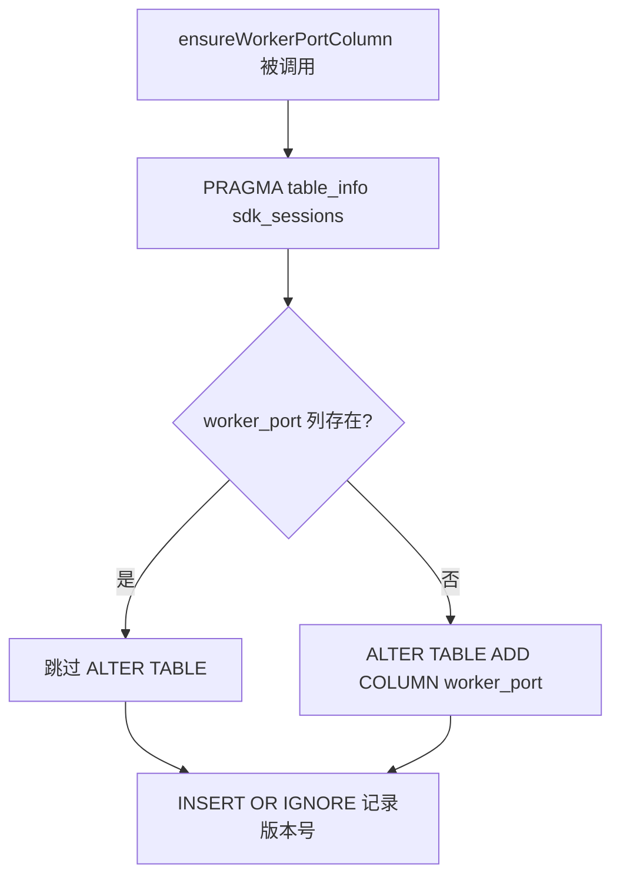
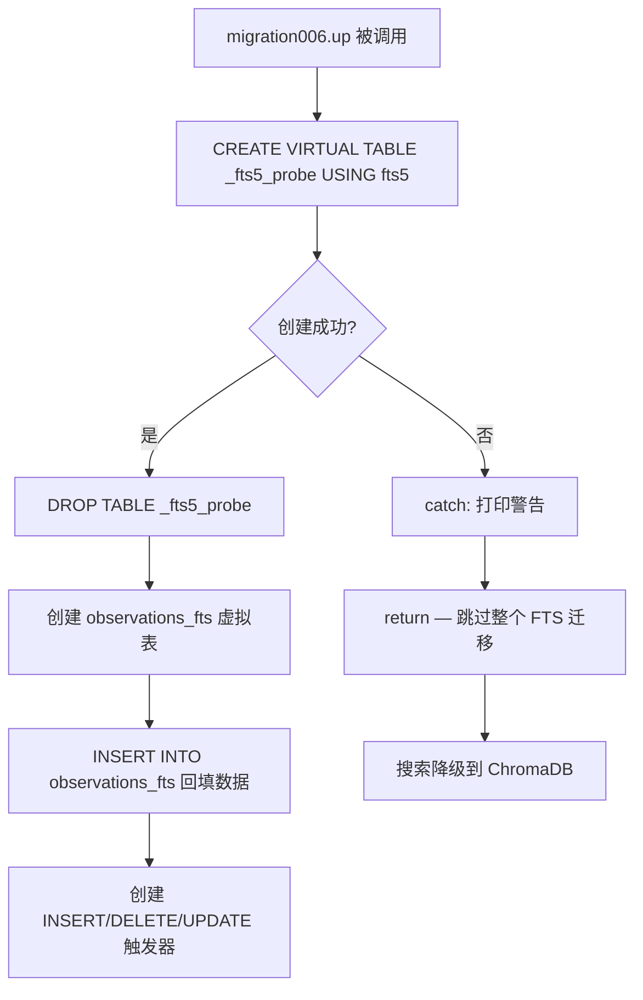
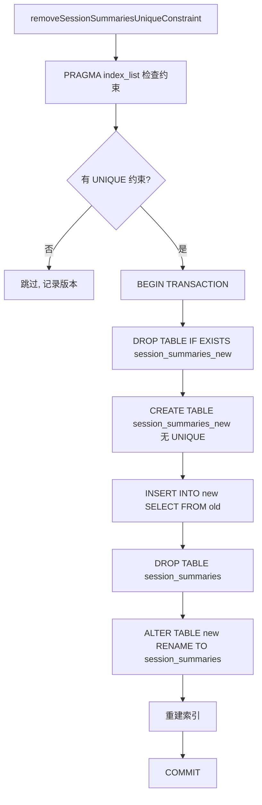

# PD-185.01 claude-mem — 双轨迁移系统与 PRAGMA 探测 FTS5 平台适配

> 文档编号：PD-185.01
> 来源：claude-mem `src/services/sqlite/migrations.ts` `src/services/sqlite/migrations/runner.ts` `src/services/sqlite/Database.ts`
> GitHub：https://github.com/thedotmack/claude-mem.git
> 问题域：PD-185 数据库迁移 Database Migration
> 状态：可复用方案

---

## 第 1 章 问题与动机

### 1.1 核心问题

SQLite 数据库迁移在 Agent 记忆系统中面临三重挑战：

1. **Schema 演进频繁** — Agent 记忆系统的数据模型随功能迭代快速变化（从基础 session 表到层级化 observation、FTS5 全文搜索、ROI token 追踪），需要可靠的增量迁移机制
2. **平台兼容性差异** — SQLite 扩展（如 FTS5）在不同运行时（Bun on Windows vs macOS）可用性不同，迁移系统必须在运行时探测能力再决定执行路径
3. **双系统共存冲突** — 项目从旧的 `DatabaseManager`（版本 1-7）演进到新的 `MigrationRunner`（版本 4-23），两套系统共享 `schema_versions` 表，版本号冲突导致迁移跳过（issue #979）

### 1.2 claude-mem 的解法概述

claude-mem 实现了一套"双轨迁移 + PRAGMA 探测"的数据库演进方案：

1. **双轨迁移架构** — 旧系统 `DatabaseManager`（`Database.ts:66-202`）使用版本号顺序执行 `Migration[]` 数组；新系统 `MigrationRunner`（`runner.ts:14-862`）使用幂等方法链，每个方法内部用 `PRAGMA table_info` 检测实际列状态而非仅依赖版本号
2. **PRAGMA 探测式迁移** — 每个迁移方法先用 `PRAGMA table_info(table)` 检查列是否已存在，再决定是否执行 `ALTER TABLE`，解决版本号冲突问题（`runner.ts:128-134`）
3. **FTS5 运行时探测** — 创建临时 `_fts5_probe` 虚拟表探测 FTS5 可用性，不可用时静默跳过 FTS 迁移，搜索降级到 ChromaDB（`migrations.ts:377-383`）
4. **表重建式约束修改** — SQLite 不支持 `ALTER TABLE` 修改外键/约束，通过 CREATE-COPY-DROP-RENAME 四步法在事务中安全重建表（`runner.ts:199-253`）
5. **内容哈希去重** — 迁移 22 添加 `content_hash` 列并用 `randomblob(8)` 回填已有数据，防止重复 observation 存储（`runner.ts:825-842`）

### 1.3 设计思想

| 设计原则 | 具体实现 | 理由 | 替代方案 |
|----------|----------|------|----------|
| 幂等优先 | 每个迁移方法用 PRAGMA 检测实际状态 | 版本号可能被旧系统占用，实际状态才是真相 | 仅依赖版本号（会因 #979 失败） |
| 能力探测 | `_fts5_probe` 临时表探测 FTS5 | 不同平台 SQLite 扩展不同，硬编码会崩溃 | 编译时条件编译（不适用于 JS 运行时） |
| 事务安全 | 表重建在 BEGIN/COMMIT 中执行 | 中途崩溃不会留下半成品表 | 无事务直接操作（数据丢失风险） |
| 渐进演进 | 旧系统保留但标记 @deprecated | 已有用户数据库需要兼容 | 强制全量重建（破坏用户数据） |
| 防崩溃恢复 | `DROP TABLE IF EXISTS xxx_new` 清理残留临时表 | 上次迁移可能崩溃留下 `_new` 表 | 忽略（下次迁移必然失败） |

---

## 第 2 章 源码实现分析

### 2.1 架构概览

claude-mem 的迁移系统分为两代架构，通过 `schema_versions` 表桥接：

```
┌─────────────────────────────────────────────────────────────────┐
│                    ClaudeMemDatabase                            │
│                    (Database.ts:29-60)                          │
│  ┌──────────────┐    ┌──────────────────────────────────────┐  │
│  │ PRAGMA 优化   │    │         MigrationRunner              │  │
│  │ WAL + NORMAL  │───→│  runAllMigrations() 方法链           │  │
│  │ mmap 256MB    │    │  v4→v5→v6→v7→v8→v9→v10→...→v23     │  │
│  └──────────────┘    └──────────────────────────────────────┘  │
│                              ↕ schema_versions                  │
│  ┌──────────────────────────────────────────────────────────┐  │
│  │  旧 DatabaseManager (Database.ts:66-202) @deprecated     │  │
│  │  Migration[] 数组: v1→v2→v3→v4→v5→v6→v7                 │  │
│  │  (migrations.ts:10-523)                                   │  │
│  └──────────────────────────────────────────────────────────┘  │
└─────────────────────────────────────────────────────────────────┘
```

关键设计：新系统 `MigrationRunner` 的 `initializeSchema()` 使用 `CREATE TABLE IF NOT EXISTS` 确保核心表始终存在，不受旧系统版本号干扰。

### 2.2 核心实现

#### 2.2.1 PRAGMA 探测式幂等迁移



对应源码 `src/services/sqlite/migrations/runner.ts:126-138`：

```typescript
private ensureWorkerPortColumn(): void {
    // Check actual column existence — don't rely on version tracking alone (issue #979)
    const tableInfo = this.db.query('PRAGMA table_info(sdk_sessions)').all() as TableColumnInfo[];
    const hasWorkerPort = tableInfo.some(col => col.name === 'worker_port');

    if (!hasWorkerPort) {
      this.db.run('ALTER TABLE sdk_sessions ADD COLUMN worker_port INTEGER');
      logger.debug('DB', 'Added worker_port column to sdk_sessions table');
    }

    // Record migration
    this.db.prepare('INSERT OR IGNORE INTO schema_versions (version, applied_at) VALUES (?, ?)').run(5, new Date().toISOString());
  }
```

这个模式在 `runner.ts` 中被 15 个迁移方法一致采用：先 PRAGMA 检测实际状态，再条件执行，最后 `INSERT OR IGNORE` 记录版本。

#### 2.2.2 FTS5 运行时能力探测



对应源码 `src/services/sqlite/migrations.ts:374-384`：

```typescript
up: (db: Database) => {
    // FTS5 may be unavailable on some platforms (e.g., Bun on Windows #791).
    // Probe before creating tables — search falls back to ChromaDB when unavailable.
    try {
      db.run('CREATE VIRTUAL TABLE _fts5_probe USING fts5(test_column)');
      db.run('DROP TABLE _fts5_probe');
    } catch {
      console.log('⚠️  FTS5 not available on this platform — skipping FTS migration (search uses ChromaDB)');
      return;
    }
    // ... 创建 FTS5 虚拟表和触发器
```

同样的探测模式在 `SessionSearch.ts:168-176` 和 `runner.ts:415-445` 中复用。

#### 2.2.3 表重建式约束修改（四步法）



对应源码 `src/services/sqlite/migrations/runner.ts:185-254`：

```typescript
private removeSessionSummariesUniqueConstraint(): void {
    const summariesIndexes = this.db.query('PRAGMA index_list(session_summaries)').all() as IndexInfo[];
    const hasUniqueConstraint = summariesIndexes.some(idx => idx.unique === 1);

    if (!hasUniqueConstraint) {
      this.db.prepare('INSERT OR IGNORE INTO schema_versions (version, applied_at) VALUES (?, ?)').run(7, new Date().toISOString());
      return;
    }

    this.db.run('BEGIN TRANSACTION');
    // 清理上次崩溃残留
    this.db.run('DROP TABLE IF EXISTS session_summaries_new');
    // CREATE → COPY → DROP → RENAME
    this.db.run(`CREATE TABLE session_summaries_new (...)`);
    this.db.run(`INSERT INTO session_summaries_new SELECT ... FROM session_summaries`);
    this.db.run('DROP TABLE session_summaries');
    this.db.run('ALTER TABLE session_summaries_new RENAME TO session_summaries');
    // 重建索引
    this.db.run('COMMIT');
  }
```

### 2.3 实现细节

**版本号冲突处理（issue #979）：** 旧系统 `DatabaseManager` 的 migration005 删除孤儿表，新系统 `MigrationRunner` 的 version 5 添加 `worker_port` 列。两者共享 `schema_versions` 表，如果旧系统先运行，version 5 已被记录，新系统的 `ensureWorkerPortColumn` 如果仅检查版本号就会跳过。解决方案：新系统每个方法都用 PRAGMA 检测实际列状态。

**FTS5 触发器同步机制：** FTS5 虚拟表通过三个触发器（`_ai`/`_ad`/`_au`）与主表保持同步。UPDATE 触发器先 DELETE 旧行再 INSERT 新行（FTS5 不支持原地更新）。迁移 21（`addOnUpdateCascadeToForeignKeys`）重建表时会先 DROP 触发器，重建后检测 FTS 表是否存在再重建触发器（`runner.ts:710-730`）。

**外键级联修复：** 迁移 21 发现 `observations` 和 `session_summaries` 的外键只有 `ON DELETE CASCADE` 缺少 `ON UPDATE CASCADE`，导致更新 `sdk_sessions.memory_session_id` 时子表违反约束。修复需要重建两张表，在事务中执行并临时关闭 `PRAGMA foreign_keys`（`runner.ts:652-653`）。

**内容哈希去重回填：** 迁移 22 添加 `content_hash` 列后，用 `substr(hex(randomblob(8)), 1, 16)` 为已有行生成唯一随机哈希，确保 UNIQUE 索引不会因 NULL 值冲突（`runner.ts:835`）。


---

## 第 3 章 迁移指南

### 3.1 迁移清单

将 claude-mem 的双轨迁移模式移植到自己的 SQLite 项目，分三阶段：

**阶段 1：基础迁移框架**
- [ ] 创建 `schema_versions` 表（version + applied_at）
- [ ] 实现 MigrationRunner 类，构造函数接收 `Database` 实例
- [ ] 实现 `runAllMigrations()` 方法链，按顺序调用各迁移方法
- [ ] 每个迁移方法遵循"PRAGMA 检测 → 条件执行 → INSERT OR IGNORE 记录"三步模式

**阶段 2：平台能力探测**
- [ ] 实现 `isFts5Available()` 探测方法（创建临时表 → 成功则删除 → 失败则返回 false）
- [ ] FTS5 相关迁移包裹在 try-catch 中，不可用时静默跳过
- [ ] 提供降级搜索路径（如 LIKE 查询或外部向量数据库）

**阶段 3：表重建与崩溃恢复**
- [ ] 约束修改使用 CREATE-COPY-DROP-RENAME 四步法
- [ ] 四步法包裹在 BEGIN/COMMIT 事务中
- [ ] 每次重建前 `DROP TABLE IF EXISTS xxx_new` 清理上次崩溃残留
- [ ] 重建后检测 FTS 表是否存在，条件重建触发器

### 3.2 适配代码模板

以下是可直接复用的 TypeScript 迁移框架（基于 bun:sqlite，可适配 better-sqlite3）：

```typescript
import { Database } from 'bun:sqlite';

interface TableColumnInfo {
  cid: number;
  name: string;
  type: string;
  notnull: number;
  dflt_value: string | null;
  pk: number;
}

class MigrationRunner {
  constructor(private db: Database) {}

  runAllMigrations(): void {
    this.initializeVersionTable();
    this.migration001_createCoreTables();
    this.migration002_addNewColumn();
    this.migration003_addFTS5();
    // ... 按需扩展
  }

  private initializeVersionTable(): void {
    this.db.run(`
      CREATE TABLE IF NOT EXISTS schema_versions (
        id INTEGER PRIMARY KEY,
        version INTEGER UNIQUE NOT NULL,
        applied_at TEXT NOT NULL
      )
    `);
  }

  /**
   * 幂等迁移模板：PRAGMA 检测 → 条件执行 → 记录版本
   */
  private migration002_addNewColumn(): void {
    const tableInfo = this.db.query('PRAGMA table_info(my_table)').all() as TableColumnInfo[];
    const hasColumn = tableInfo.some(col => col.name === 'new_column');

    if (!hasColumn) {
      this.db.run('ALTER TABLE my_table ADD COLUMN new_column TEXT');
    }

    this.db.prepare(
      'INSERT OR IGNORE INTO schema_versions (version, applied_at) VALUES (?, ?)'
    ).run(2, new Date().toISOString());
  }

  /**
   * FTS5 探测模板：探测 → 条件创建 → 降级
   */
  private migration003_addFTS5(): void {
    const applied = this.db.prepare(
      'SELECT version FROM schema_versions WHERE version = ?'
    ).get(3);
    if (applied) return;

    // 探测 FTS5 可用性
    try {
      this.db.run('CREATE VIRTUAL TABLE _fts5_probe USING fts5(test_col)');
      this.db.run('DROP TABLE _fts5_probe');
    } catch {
      console.warn('FTS5 not available — skipping');
      this.db.prepare(
        'INSERT OR IGNORE INTO schema_versions (version, applied_at) VALUES (?, ?)'
      ).run(3, new Date().toISOString());
      return;
    }

    // 创建 FTS5 虚拟表 + 同步触发器
    this.db.run(`
      CREATE VIRTUAL TABLE IF NOT EXISTS my_table_fts USING fts5(
        searchable_col1, searchable_col2,
        content='my_table', content_rowid='id'
      )
    `);

    // 回填已有数据
    this.db.run(`
      INSERT INTO my_table_fts(rowid, searchable_col1, searchable_col2)
      SELECT id, searchable_col1, searchable_col2 FROM my_table
    `);

    // INSERT/DELETE/UPDATE 触发器保持同步
    this.db.run(`
      CREATE TRIGGER my_table_fts_ai AFTER INSERT ON my_table BEGIN
        INSERT INTO my_table_fts(rowid, searchable_col1, searchable_col2)
        VALUES (new.id, new.searchable_col1, new.searchable_col2);
      END;
      CREATE TRIGGER my_table_fts_ad AFTER DELETE ON my_table BEGIN
        INSERT INTO my_table_fts(my_table_fts, rowid, searchable_col1, searchable_col2)
        VALUES('delete', old.id, old.searchable_col1, old.searchable_col2);
      END;
    `);

    this.db.prepare(
      'INSERT OR IGNORE INTO schema_versions (version, applied_at) VALUES (?, ?)'
    ).run(3, new Date().toISOString());
  }
}
```

### 3.3 适用场景

| 场景 | 适用度 | 说明 |
|------|--------|------|
| SQLite Agent 记忆系统 | ⭐⭐⭐ | 完美匹配：频繁 schema 变更 + 平台差异 |
| 嵌入式 SQLite 应用 | ⭐⭐⭐ | PRAGMA 探测模式适用于任何 SQLite 项目 |
| 跨平台桌面应用 | ⭐⭐⭐ | FTS5 探测 + 降级路径解决平台差异 |
| 服务端 PostgreSQL/MySQL | ⭐ | 这些数据库有原生迁移工具（Flyway/Alembic），不需要 PRAGMA 探测 |
| 只读数据库 | ⭐ | 无需迁移 |

---

## 第 4 章 测试用例

```typescript
import { Database } from 'bun:sqlite';
import { describe, test, expect, beforeEach } from 'bun:test';

// 模拟 MigrationRunner 核心逻辑
class TestMigrationRunner {
  constructor(private db: Database) {}

  initializeVersionTable(): void {
    this.db.run(`
      CREATE TABLE IF NOT EXISTS schema_versions (
        id INTEGER PRIMARY KEY,
        version INTEGER UNIQUE NOT NULL,
        applied_at TEXT NOT NULL
      )
    `);
  }

  ensureColumn(table: string, column: string, type: string, version: number): void {
    const tableInfo = this.db.query(`PRAGMA table_info(${table})`).all() as any[];
    const hasColumn = tableInfo.some((col: any) => col.name === column);
    if (!hasColumn) {
      this.db.run(`ALTER TABLE ${table} ADD COLUMN ${column} ${type}`);
    }
    this.db.prepare('INSERT OR IGNORE INTO schema_versions (version, applied_at) VALUES (?, ?)').run(version, new Date().toISOString());
  }

  isFts5Available(): boolean {
    try {
      this.db.run('CREATE VIRTUAL TABLE _fts5_probe USING fts5(test_column)');
      this.db.run('DROP TABLE _fts5_probe');
      return true;
    } catch {
      return false;
    }
  }

  getCurrentVersion(): number {
    const result = this.db.query('SELECT MAX(version) as v FROM schema_versions').get() as any;
    return result?.v || 0;
  }
}

describe('MigrationRunner', () => {
  let db: Database;
  let runner: TestMigrationRunner;

  beforeEach(() => {
    db = new Database(':memory:');
    runner = new TestMigrationRunner(db);
    runner.initializeVersionTable();
    db.run('CREATE TABLE test_table (id INTEGER PRIMARY KEY, name TEXT NOT NULL)');
  });

  test('幂等迁移：重复执行不报错', () => {
    runner.ensureColumn('test_table', 'email', 'TEXT', 2);
    runner.ensureColumn('test_table', 'email', 'TEXT', 2); // 第二次应跳过
    const cols = db.query('PRAGMA table_info(test_table)').all() as any[];
    const emailCols = cols.filter((c: any) => c.name === 'email');
    expect(emailCols.length).toBe(1);
  });

  test('版本号正确记录', () => {
    runner.ensureColumn('test_table', 'age', 'INTEGER', 3);
    expect(runner.getCurrentVersion()).toBe(3);
  });

  test('INSERT OR IGNORE 不覆盖已有版本', () => {
    runner.ensureColumn('test_table', 'col1', 'TEXT', 5);
    runner.ensureColumn('test_table', 'col2', 'TEXT', 5); // 同版本号
    const versions = db.query('SELECT * FROM schema_versions WHERE version = 5').all();
    expect(versions.length).toBe(1);
  });

  test('FTS5 探测在内存数据库中可用', () => {
    // bun:sqlite 内存数据库通常支持 FTS5
    const available = runner.isFts5Available();
    expect(typeof available).toBe('boolean');
  });

  test('表重建四步法保持数据完整', () => {
    db.run('INSERT INTO test_table (name) VALUES (?)', ['Alice']);
    db.run('INSERT INTO test_table (name) VALUES (?)', ['Bob']);

    // 四步法：CREATE → COPY → DROP → RENAME
    db.run('BEGIN TRANSACTION');
    db.run('DROP TABLE IF EXISTS test_table_new');
    db.run('CREATE TABLE test_table_new (id INTEGER PRIMARY KEY, name TEXT, email TEXT)');
    db.run('INSERT INTO test_table_new (id, name) SELECT id, name FROM test_table');
    db.run('DROP TABLE test_table');
    db.run('ALTER TABLE test_table_new RENAME TO test_table');
    db.run('COMMIT');

    const rows = db.query('SELECT * FROM test_table').all() as any[];
    expect(rows.length).toBe(2);
    expect(rows[0].name).toBe('Alice');
  });

  test('崩溃残留清理：DROP IF EXISTS _new 表', () => {
    // 模拟上次崩溃留下的临时表
    db.run('CREATE TABLE test_table_new (id INTEGER PRIMARY KEY)');
    // 新迁移应先清理
    db.run('DROP TABLE IF EXISTS test_table_new');
    db.run('CREATE TABLE test_table_new (id INTEGER PRIMARY KEY, name TEXT, extra TEXT)');
    // 不应报错
    expect(true).toBe(true);
  });
});
```


---

## 第 5 章 跨域关联

| 关联域 | 关系类型 | 说明 |
|--------|----------|------|
| PD-06 记忆持久化 | 强依赖 | 迁移系统是记忆持久化的基础设施，observations/session_summaries 表的 schema 演进直接影响记忆存储能力 |
| PD-08 搜索与检索 | 协同 | FTS5 迁移为全文搜索提供索引基础，FTS5 不可用时降级到 ChromaDB 向量搜索 |
| PD-07 质量检查 | 协同 | content_hash 去重机制（迁移 22）防止重复 observation 存储，属于数据质量保障 |
| PD-11 可观测性 | 协同 | discovery_tokens 列（迁移 7/11）追踪每条 observation 的 token 成本，支持 ROI 分析 |
| PD-03 容错与重试 | 协同 | pending_messages 表（迁移 16）实现持久化工作队列，支持 worker 崩溃后的消息恢复重处理 |

---

## 第 6 章 来源文件索引

| 文件 | 行范围 | 关键实现 |
|------|--------|----------|
| `src/services/sqlite/migrations.ts` | L10-L523 | 旧迁移系统：7 个 Migration 对象（v1-v7），含 FTS5 探测和 up/down 方法 |
| `src/services/sqlite/migrations/runner.ts` | L14-L862 | 新迁移系统：MigrationRunner 类，15 个幂等迁移方法（v4-v23） |
| `src/services/sqlite/Database.ts` | L10-L14 | Migration 接口定义：`{ version: number; up: (db) => void; down?: (db) => void }` |
| `src/services/sqlite/Database.ts` | L29-L60 | ClaudeMemDatabase 入口：PRAGMA 优化 + MigrationRunner 调用 |
| `src/services/sqlite/Database.ts` | L66-L202 | 旧 DatabaseManager（@deprecated）：单例 + 版本号顺序迁移 |
| `src/services/sqlite/SessionSearch.ts` | L55-L176 | FTS5 表维护：ensureFTSTables + isFts5Available 探测 |
| `src/services/sqlite/SessionStore.ts` | L22-L54 | SessionStore 构造函数：与 MigrationRunner 相同的迁移方法链（双入口） |
| `src/services/sqlite/transactions.ts` | L48-L149 | 原子事务：storeObservationsAndMarkComplete 跨表事务操作 |
| `src/services/sqlite/observations/store.ts` | L19-L44 | content_hash 计算与去重查询 |
| `src/types/database.ts` | L9-L41 | 迁移相关类型：TableColumnInfo, IndexInfo, SchemaVersion |

---

## 第 7 章 横向对比维度

```json comparison_data
{
  "project": "claude-mem",
  "dimensions": {
    "迁移策略": "双轨并存：旧版本号顺序 + 新 PRAGMA 探测幂等方法链",
    "版本追踪": "schema_versions 表 + INSERT OR IGNORE 防重复",
    "回滚支持": "旧系统 up/down 双向；新系统仅前向（PRAGMA 幂等替代回滚）",
    "平台适配": "FTS5 运行时探测 _fts5_probe，不可用降级 ChromaDB",
    "约束修改": "CREATE-COPY-DROP-RENAME 四步法 + 事务 + 崩溃残留清理",
    "数据回填": "randomblob(8) 生成唯一哈希回填 + FTS5 全量 INSERT 回填"
  }
}
```

### 域元数据补充

```json domain_metadata
{
  "solution_summary": "claude-mem 用 PRAGMA table_info 探测式幂等迁移解决双系统版本号冲突，FTS5 运行时探测实现跨平台降级，23 版本覆盖从基础 schema 到 FTS5 全文搜索和 content_hash 去重",
  "description": "迁移系统需处理多代架构共存时的版本号冲突与平台能力差异",
  "sub_problems": [
    "双代迁移系统共享版本表导致版本号冲突",
    "FTS5 触发器在表重建时的级联维护",
    "外键 ON UPDATE CASCADE 缺失的运行时发现与修复"
  ],
  "best_practices": [
    "用 PRAGMA table_info 检测实际列状态而非仅依赖版本号",
    "表重建前 DROP IF EXISTS _new 清理上次崩溃残留临时表",
    "content_hash 回填用 randomblob 生成唯一值避免 NULL 索引冲突"
  ]
}
```
