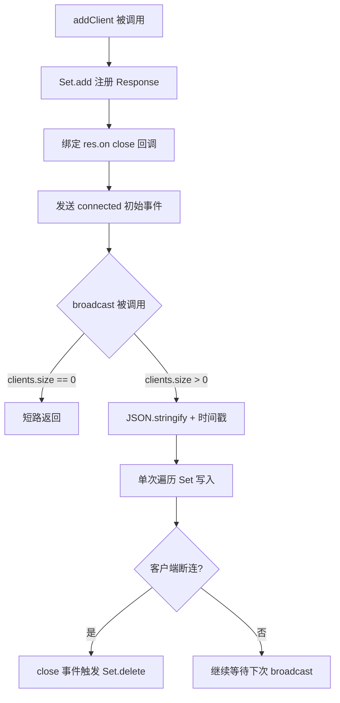
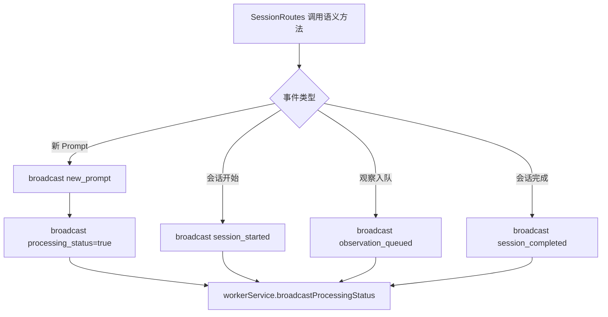

# PD-186.01 claude-mem — SSE 实时事件流与记忆可视化

> 文档编号：PD-186.01
> 来源：claude-mem `src/services/worker/SSEBroadcaster.ts`
> GitHub：https://github.com/thedotmack/claude-mem.git
> 问题域：PD-186 实时事件流 Realtime Event Streaming
> 状态：可复用方案

---

## 第 1 章 问题与动机

### 1.1 核心问题

Agent 系统在后台持续运行（观察工具调用、生成记忆摘要、处理用户 prompt），但用户无法实时感知系统状态。传统的轮询方案（polling）存在延迟高、服务端压力大、无法即时反映状态变更等问题。对于 claude-mem 这样的记忆观察系统，用户需要在 Web Viewer 中实时看到：

- 新的 observation 被生成
- 新的 summary 被创建
- 用户 prompt 被捕获
- 后台处理队列的深度和状态

这要求一个低延迟、单向推送、自动重连的实时通信机制。

### 1.2 claude-mem 的解法概述

claude-mem 采用三层 SSE 架构实现实时事件流：

1. **传输层 — SSEBroadcaster**（`src/services/worker/SSEBroadcaster.ts:15`）：用 `Set<Response>` 管理客户端连接，单次遍历广播，`res.on('close')` 自动清理断连客户端
2. **语义层 — SessionEventBroadcaster**（`src/services/worker/events/SessionEventBroadcaster.ts:12`）：封装会话生命周期事件（prompt 到达、会话开始/完成、观察入队），每次广播后自动同步处理状态
3. **消费层 — useSSE Hook**（`src/ui/viewer/hooks/useSSE.ts:6`）：React Hook 封装 EventSource，按事件类型分发到独立 state，3 秒自动重连
4. **路由层 — ViewerRoutes**（`src/services/worker/http/routes/ViewerRoutes.ts:34`）：`GET /stream` 端点设置 SSE 标准头，注册客户端并推送初始状态
5. **聚合层 — WorkerService.broadcastProcessingStatus()**（`src/services/worker-service.ts:872`）：从 SessionManager 聚合 isProcessing/queueDepth，统一广播处理状态

### 1.3 设计思想

| 设计原则 | 具体实现 | 理由 | 替代方案 |
|----------|----------|------|----------|
| 单次遍历广播 | `for (const client of this.sseClients) { client.write(data) }` 无 try-catch 包裹 | 断连客户端由 `close` 事件异步清理，避免广播时的两步清理开销 | 先 filter 存活再广播（两步遍历） |
| Set 管理连接 | `private sseClients: Set<SSEClient>` | O(1) 添加/删除，无重复连接风险 | Array + indexOf（O(n) 删除） |
| 语义层分离 | SessionEventBroadcaster 包装 SSEBroadcaster | 业务逻辑与传输解耦，调用方只关心"会话完成"而非"发送 JSON" | 直接在路由中调用 broadcast |
| 客户端自动重连 | `setTimeout(connect, 3000)` + ref 清理 | SSE 原生不保证重连行为一致，手动控制更可靠 | 依赖浏览器 EventSource 自动重连 |
| 无客户端短路 | `if (this.sseClients.size === 0) return` | 无监听者时跳过序列化和遍历，零开销 | 始终序列化（浪费 CPU） |
| 初始状态推送 | 连接时立即发送 `initial_load` + `processing_status` | 新客户端无需等待下一次事件即可获得完整状态 | 客户端主动 fetch 初始数据 |

---

## 第 2 章 源码实现分析

### 2.1 架构概览

claude-mem 的 SSE 实时事件流采用分层广播架构，从底层传输到上层语义逐层封装：

```
┌─────────────────────────────────────────────────────────────┐
│                    WorkerService (编排中心)                    │
│  ┌─────────────────────────────────────────────────────────┐│
│  │ broadcastProcessingStatus()                             ││
│  │ 聚合 SessionManager 状态 → sseBroadcaster.broadcast()   ││
│  └─────────────────────────────────────────────────────────┘│
│         ▲                              ▲                     │
│         │ uses                         │ uses                │
│  ┌──────┴──────────────┐  ┌───────────┴─────────────────┐  │
│  │ SessionEventBroadcaster│  │ ViewerRoutes               │  │
│  │ (语义层)              │  │ GET /stream (路由层)         │  │
│  │ broadcastNewPrompt()  │  │ handleSSEStream()           │  │
│  │ broadcastSessionDone()│  │ → addClient + initial_load  │  │
│  └──────┬──────────────┘  └───────────┬─────────────────┘  │
│         │                              │                     │
│         ▼                              ▼                     │
│  ┌─────────────────────────────────────────────────────────┐│
│  │              SSEBroadcaster (传输层)                      ││
│  │  Set<Response> → single-pass write → auto-cleanup       ││
│  └─────────────────────────────────────────────────────────┘│
└─────────────────────────────────────────────────────────────┘
                           │ SSE data frames
                           ▼
┌─────────────────────────────────────────────────────────────┐
│              Browser — useSSE() React Hook                   │
│  EventSource('/stream') → switch(type) → setState           │
│  onerror → close + setTimeout(reconnect, 3000)              │
└─────────────────────────────────────────────────────────────┘
```

### 2.2 核心实现

#### 2.2.1 SSEBroadcaster — 传输层



对应源码 `src/services/worker/SSEBroadcaster.ts:15-76`：

```typescript
export class SSEBroadcaster {
  private sseClients: Set<SSEClient> = new Set();

  addClient(res: Response): void {
    this.sseClients.add(res);
    logger.debug('WORKER', 'Client connected', { total: this.sseClients.size });
    // 断连时自动清理 — 不需要心跳检测
    res.on('close', () => {
      this.removeClient(res);
    });
    // 立即发送连接确认
    this.sendToClient(res, { type: 'connected', timestamp: Date.now() });
  }

  broadcast(event: SSEEvent): void {
    if (this.sseClients.size === 0) {
      logger.debug('WORKER', 'SSE broadcast skipped (no clients)', { eventType: event.type });
      return; // 零客户端短路
    }
    const eventWithTimestamp = { ...event, timestamp: Date.now() };
    const data = `data: ${JSON.stringify(eventWithTimestamp)}\n\n`;
    // 单次遍历，无 try-catch，断连由 close 事件异步处理
    for (const client of this.sseClients) {
      client.write(data);
    }
  }

  private sendToClient(res: Response, event: SSEEvent): void {
    const data = `data: ${JSON.stringify(event)}\n\n`;
    res.write(data);
  }
}
```

关键设计点：
- **`Set<SSEClient>`**（L16）：O(1) 增删，天然去重
- **`res.on('close')`**（L26-28）：利用 Node.js 流事件自动清理，无需心跳探测
- **单次遍历**（L57-59）：不在广播循环中做错误处理，断连客户端的 `write` 会静默失败，随后 `close` 事件触发清理
- **零客户端短路**（L46-49）：无监听者时跳过 JSON 序列化

#### 2.2.2 SessionEventBroadcaster — 语义层



对应源码 `src/services/worker/events/SessionEventBroadcaster.ts:12-97`：

```typescript
export class SessionEventBroadcaster {
  constructor(
    private sseBroadcaster: SSEBroadcaster,
    private workerService: WorkerService
  ) {}

  broadcastNewPrompt(prompt: {
    id: number;
    content_session_id: string;
    project: string;
    prompt_number: number;
    prompt_text: string;
    created_at_epoch: number;
  }): void {
    // 先推送 prompt 详情
    this.sseBroadcaster.broadcast({ type: 'new_prompt', prompt });
    // 再推送处理状态（工作即将开始）
    this.sseBroadcaster.broadcast({ type: 'processing_status', isProcessing: true });
    // 最后从 SessionManager 聚合真实队列深度
    this.workerService.broadcastProcessingStatus();
  }

  broadcastSessionCompleted(sessionDbId: number): void {
    this.sseBroadcaster.broadcast({
      type: 'session_completed',
      timestamp: Date.now(),
      sessionDbId
    });
    this.workerService.broadcastProcessingStatus();
  }
}
```

关键设计点：
- **双重状态推送**（L37-43）：`broadcastNewPrompt` 先发乐观的 `isProcessing: true`，再通过 `broadcastProcessingStatus()` 发送精确的队列深度。这确保 UI 立即显示"处理中"，不等聚合计算
- **每个语义方法都触发状态同步**：所有 5 个方法末尾都调用 `workerService.broadcastProcessingStatus()`，保证 UI 的处理状态始终与后端一致

#### 2.2.3 ViewerRoutes — SSE 端点注册

对应源码 `src/services/worker/http/routes/ViewerRoutes.ts:70-95`：

```typescript
private handleSSEStream = this.wrapHandler((req: Request, res: Response): void => {
  // 标准 SSE 三头
  res.setHeader('Content-Type', 'text/event-stream');
  res.setHeader('Cache-Control', 'no-cache');
  res.setHeader('Connection', 'keep-alive');

  this.sseBroadcaster.addClient(res);

  // 初始状态推送：项目列表
  const allProjects = this.dbManager.getSessionStore().getAllProjects();
  this.sseBroadcaster.broadcast({
    type: 'initial_load',
    projects: allProjects,
    timestamp: Date.now()
  });

  // 初始状态推送：处理状态
  const isProcessing = this.sessionManager.isAnySessionProcessing();
  const queueDepth = this.sessionManager.getTotalActiveWork();
  this.sseBroadcaster.broadcast({
    type: 'processing_status',
    isProcessing,
    queueDepth
  });
});
```

### 2.3 实现细节

#### 事件类型体系

claude-mem 定义了两套类型系统，服务端和客户端各一套：

**服务端** `src/services/worker-types.ts:77-83`：
```typescript
export interface SSEEvent {
  type: string;           // 开放式 type，允许任意事件
  timestamp?: number;
  [key: string]: any;     // 索引签名，payload 自由扩展
}
export type SSEClient = Response;  // Express Response 即客户端
```

**客户端** `src/ui/viewer/types.ts:45-55`：
```typescript
export interface StreamEvent {
  type: 'initial_load' | 'new_observation' | 'new_summary' | 'new_prompt' | 'processing_status';
  observations?: Observation[];
  projects?: string[];
  observation?: Observation;
  summary?: Summary;
  prompt?: UserPrompt;
  isProcessing?: boolean;
}
```

服务端用开放式 `string` type + 索引签名，客户端用联合类型字面量。这种"宽发窄收"设计让服务端可以自由添加新事件类型，客户端只处理已知类型，未知类型静默忽略。

#### 数据流：从 prompt 到 UI 更新

```
用户发送 prompt → POST /api/sessions/:id/prompt
  → SessionRoutes.handleNewPrompt()
    → sessionEventBroadcaster.broadcastNewPrompt(prompt)
      → sseBroadcaster.broadcast({type:'new_prompt', prompt})
        → for (client of Set) client.write('data: {...}\n\n')
          → Browser EventSource.onmessage
            → useSSE switch('new_prompt')
              → setPrompts(prev => [prompt, ...prev])
                → React re-render
```

#### WorkerService 状态聚合

`src/services/worker-service.ts:872-888`：

```typescript
broadcastProcessingStatus(): void {
  const isProcessing = this.sessionManager.isAnySessionProcessing();
  const queueDepth = this.sessionManager.getTotalActiveWork();
  const activeSessions = this.sessionManager.getActiveSessionCount();
  this.sseBroadcaster.broadcast({
    type: 'processing_status',
    isProcessing,
    queueDepth
  });
}
```

此方法在 6 个位置被调用（`worker-service.ts:219,641,656,674` 和 SessionEventBroadcaster 的每个方法），确保任何状态变更都能即时反映到 UI。

---

## 第 3 章 迁移指南

### 3.1 迁移清单

**阶段 1：传输层（SSEBroadcaster）**
- [ ] 创建 `SSEBroadcaster` 类，用 `Set<Response>` 管理客户端
- [ ] 实现 `addClient(res)` 方法，绑定 `res.on('close')` 自动清理
- [ ] 实现 `broadcast(event)` 方法，单次遍历 + 零客户端短路
- [ ] 定义 `SSEEvent` 接口（开放式 type + 索引签名）

**阶段 2：路由层（SSE 端点）**
- [ ] 创建 `GET /stream` 端点，设置 SSE 三头（Content-Type, Cache-Control, Connection）
- [ ] 连接时调用 `addClient(res)` 注册客户端
- [ ] 连接时推送初始状态（`initial_load` + `processing_status`）

**阶段 3：语义层（EventBroadcaster）**
- [ ] 创建业务事件广播器，封装 SSEBroadcaster
- [ ] 为每个业务事件定义语义方法（如 `broadcastTaskCompleted`）
- [ ] 每个语义方法末尾调用状态聚合广播

**阶段 4：消费层（前端 Hook）**
- [ ] 创建 `useSSE()` React Hook，封装 EventSource
- [ ] 实现 `switch(data.type)` 事件分发
- [ ] 实现 `onerror` 自动重连（3 秒延迟）
- [ ] 组件卸载时清理 EventSource 和 reconnect timeout

### 3.2 适配代码模板

#### 传输层模板（TypeScript + Express）

```typescript
import type { Response } from 'express';

interface SSEEvent {
  type: string;
  timestamp?: number;
  [key: string]: any;
}

export class SSEBroadcaster {
  private clients: Set<Response> = new Set();

  addClient(res: Response): void {
    // 设置 SSE 标准头
    res.setHeader('Content-Type', 'text/event-stream');
    res.setHeader('Cache-Control', 'no-cache');
    res.setHeader('Connection', 'keep-alive');

    this.clients.add(res);

    // 断连自动清理
    res.on('close', () => {
      this.clients.delete(res);
    });

    // 发送连接确认
    this.send(res, { type: 'connected', timestamp: Date.now() });
  }

  broadcast(event: SSEEvent): void {
    if (this.clients.size === 0) return;

    const data = `data: ${JSON.stringify({ ...event, timestamp: Date.now() })}\n\n`;
    for (const client of this.clients) {
      client.write(data);
    }
  }

  get clientCount(): number {
    return this.clients.size;
  }

  private send(res: Response, event: SSEEvent): void {
    res.write(`data: ${JSON.stringify(event)}\n\n`);
  }
}
```

#### 消费层模板（React Hook）

```typescript
import { useState, useEffect, useRef } from 'react';

interface SSEOptions {
  url: string;
  reconnectDelay?: number;
}

export function useSSE<T extends { type: string }>(options: SSEOptions) {
  const { url, reconnectDelay = 3000 } = options;
  const [isConnected, setIsConnected] = useState(false);
  const [lastEvent, setLastEvent] = useState<T | null>(null);
  const esRef = useRef<EventSource | null>(null);
  const timerRef = useRef<NodeJS.Timeout>();

  useEffect(() => {
    const connect = () => {
      esRef.current?.close();

      const es = new EventSource(url);
      esRef.current = es;

      es.onopen = () => {
        setIsConnected(true);
        if (timerRef.current) clearTimeout(timerRef.current);
      };

      es.onerror = () => {
        setIsConnected(false);
        es.close();
        timerRef.current = setTimeout(() => {
          timerRef.current = undefined;
          connect();
        }, reconnectDelay);
      };

      es.onmessage = (event) => {
        const data: T = JSON.parse(event.data);
        setLastEvent(data);
      };
    };

    connect();

    return () => {
      esRef.current?.close();
      if (timerRef.current) clearTimeout(timerRef.current);
    };
  }, [url, reconnectDelay]);

  return { isConnected, lastEvent };
}
```

### 3.3 适用场景

| 场景 | 适用度 | 说明 |
|------|--------|------|
| Agent 运行状态实时展示 | ⭐⭐⭐ | 完美匹配：单向推送、低延迟、自动重连 |
| 后台任务进度监控 | ⭐⭐⭐ | 队列深度 + 处理状态的实时广播模式可直接复用 |
| 多用户协作编辑 | ⭐⭐ | SSE 是单向的，双向通信需要 WebSocket |
| 高频数据流（>100 msg/s） | ⭐ | SSE 基于 HTTP 长连接，高频场景建议 WebSocket |
| 移动端弱网环境 | ⭐⭐ | 自动重连机制有效，但 SSE 不支持二进制压缩 |

---

## 第 4 章 测试用例

```typescript
import { describe, it, expect, vi, beforeEach } from 'vitest';

// ============================================================================
// SSEBroadcaster Tests
// ============================================================================

class MockResponse {
  public written: string[] = [];
  public headers: Record<string, string> = {};
  private closeHandlers: Function[] = [];

  write(data: string) { this.written.push(data); }
  setHeader(key: string, value: string) { this.headers[key] = value; }
  on(event: string, handler: Function) {
    if (event === 'close') this.closeHandlers.push(handler);
  }
  simulateClose() { this.closeHandlers.forEach(h => h()); }
}

describe('SSEBroadcaster', () => {
  let broadcaster: SSEBroadcaster;

  beforeEach(() => {
    broadcaster = new SSEBroadcaster();
  });

  it('should add client and send connected event', () => {
    const res = new MockResponse();
    broadcaster.addClient(res as any);

    expect(broadcaster.getClientCount()).toBe(1);
    expect(res.written.length).toBe(1);
    expect(res.written[0]).toContain('"type":"connected"');
  });

  it('should broadcast to all connected clients', () => {
    const res1 = new MockResponse();
    const res2 = new MockResponse();
    broadcaster.addClient(res1 as any);
    broadcaster.addClient(res2 as any);

    broadcaster.broadcast({ type: 'test_event', payload: 'hello' });

    // Each client: 1 connected + 1 broadcast
    expect(res1.written.length).toBe(2);
    expect(res2.written.length).toBe(2);
    expect(res1.written[1]).toContain('"type":"test_event"');
  });

  it('should short-circuit when no clients connected', () => {
    // Should not throw
    broadcaster.broadcast({ type: 'test_event' });
    expect(broadcaster.getClientCount()).toBe(0);
  });

  it('should auto-remove client on disconnect', () => {
    const res = new MockResponse();
    broadcaster.addClient(res as any);
    expect(broadcaster.getClientCount()).toBe(1);

    res.simulateClose();
    expect(broadcaster.getClientCount()).toBe(0);
  });

  it('should add timestamp to broadcast events', () => {
    const res = new MockResponse();
    broadcaster.addClient(res as any);

    const before = Date.now();
    broadcaster.broadcast({ type: 'test' });
    const after = Date.now();

    const broadcastData = JSON.parse(res.written[1].replace('data: ', '').trim());
    expect(broadcastData.timestamp).toBeGreaterThanOrEqual(before);
    expect(broadcastData.timestamp).toBeLessThanOrEqual(after);
  });

  it('should handle Set deduplication (same client added twice)', () => {
    const res = new MockResponse();
    broadcaster.addClient(res as any);
    broadcaster.addClient(res as any);

    // Set deduplicates, but addClient sends connected event each time
    expect(broadcaster.getClientCount()).toBe(1);
  });
});

// ============================================================================
// SessionEventBroadcaster Tests
// ============================================================================

describe('SessionEventBroadcaster', () => {
  it('should broadcast new_prompt then processing_status', () => {
    const events: any[] = [];
    const mockSSE = { broadcast: (e: any) => events.push(e) };
    const mockWorker = { broadcastProcessingStatus: vi.fn() };
    const seb = new SessionEventBroadcaster(mockSSE as any, mockWorker as any);

    seb.broadcastNewPrompt({
      id: 1, content_session_id: 'sess-1', project: 'test',
      prompt_number: 1, prompt_text: 'hello', created_at_epoch: Date.now()
    });

    expect(events[0].type).toBe('new_prompt');
    expect(events[1].type).toBe('processing_status');
    expect(events[1].isProcessing).toBe(true);
    expect(mockWorker.broadcastProcessingStatus).toHaveBeenCalledOnce();
  });

  it('should broadcast session_completed with timestamp', () => {
    const events: any[] = [];
    const mockSSE = { broadcast: (e: any) => events.push(e) };
    const mockWorker = { broadcastProcessingStatus: vi.fn() };
    const seb = new SessionEventBroadcaster(mockSSE as any, mockWorker as any);

    seb.broadcastSessionCompleted(42);

    expect(events[0].type).toBe('session_completed');
    expect(events[0].sessionDbId).toBe(42);
    expect(events[0].timestamp).toBeDefined();
  });
});

// ============================================================================
// useSSE Hook Tests (React Testing Library)
// ============================================================================

describe('useSSE hook', () => {
  it('should parse initial_load event and set projects', () => {
    // Mock EventSource behavior
    const mockEvent = {
      data: JSON.stringify({
        type: 'initial_load',
        projects: ['project-a', 'project-b']
      })
    };
    // In real test: renderHook(() => useSSE()) + act(() => fireEvent)
    const parsed = JSON.parse(mockEvent.data);
    expect(parsed.type).toBe('initial_load');
    expect(parsed.projects).toEqual(['project-a', 'project-b']);
  });

  it('should handle processing_status with queueDepth', () => {
    const mockEvent = {
      data: JSON.stringify({
        type: 'processing_status',
        isProcessing: true,
        queueDepth: 3
      })
    };
    const parsed = JSON.parse(mockEvent.data);
    expect(parsed.isProcessing).toBe(true);
    expect(parsed.queueDepth).toBe(3);
  });
});
```

---

## 第 5 章 跨域关联

| 关联域 | 关系类型 | 说明 |
|--------|----------|------|
| PD-11 可观测性 | 协同 | SSE 事件流是可观测性的实时传输通道。claude-mem 的 `processing_status` 事件携带 `queueDepth` 和 `isProcessing`，本质上是运行时指标的实时推送。可观测性系统产生的指标数据可以通过 SSE 广播到监控 UI |
| PD-06 记忆持久化 | 依赖 | SSE 推送的 `new_observation` 和 `new_summary` 事件依赖记忆持久化层先将数据写入 SQLite，再通过事件通知 UI。事件流是持久化的"通知层"，不替代持久化本身 |
| PD-10 中间件管道 | 协同 | ViewerRoutes 继承 `BaseRouteHandler`，使用 `wrapHandler` 中间件统一错误处理。SSE 端点的注册遵循中间件管道的路由注册模式 |
| PD-02 多 Agent 编排 | 协同 | claude-mem 支持多会话并行处理（SessionManager 管理多个 ActiveSession），SSE 广播的 `queueDepth` 反映了多 Agent 并行编排的实时负载 |

---

## 第 6 章 来源文件索引

| 文件 | 行范围 | 关键实现 |
|------|--------|----------|
| `src/services/worker/SSEBroadcaster.ts` | L1-76 | SSE 传输层：Set 管理连接、单次遍历广播、自动断连清理 |
| `src/services/worker/events/SessionEventBroadcaster.ts` | L1-97 | 语义层：会话生命周期事件封装、双重状态推送 |
| `src/services/worker/http/routes/ViewerRoutes.ts` | L70-95 | SSE 端点：标准头设置、客户端注册、初始状态推送 |
| `src/ui/viewer/hooks/useSSE.ts` | L1-109 | React 消费层：EventSource 封装、事件分发、自动重连 |
| `src/services/worker-types.ts` | L77-83 | SSEEvent/SSEClient 类型定义 |
| `src/ui/viewer/types.ts` | L45-55 | StreamEvent 联合类型（客户端事件类型） |
| `src/ui/viewer/constants/api.ts` | L12 | `/stream` 端点路径常量 |
| `src/ui/viewer/constants/timing.ts` | L7 | SSE 重连延迟 3000ms |
| `src/services/worker-service.ts` | L208,215 | SSEBroadcaster/SessionEventBroadcaster 实例化 |
| `src/services/worker-service.ts` | L872-888 | broadcastProcessingStatus() 状态聚合广播 |

---

## 第 7 章 横向对比维度

```json comparison_data
{
  "project": "claude-mem",
  "dimensions": {
    "传输协议": "SSE（Server-Sent Events），单向服务端推送",
    "连接管理": "Set<Response> + res.on('close') 自动清理",
    "广播策略": "单次遍历写入，零客户端短路，无错误处理包裹",
    "事件类型体系": "服务端开放式 string type，客户端联合类型字面量窄收",
    "重连机制": "客户端手动 setTimeout 3s 重连，不依赖浏览器原生",
    "初始状态同步": "连接时立即推送 initial_load + processing_status",
    "语义封装": "SessionEventBroadcaster 双层封装，业务与传输解耦"
  }
}
```

### 域元数据补充

```json domain_metadata
{
  "solution_summary": "claude-mem 用三层 SSE 架构（SSEBroadcaster 传输层 + SessionEventBroadcaster 语义层 + useSSE Hook 消费层）实现 localhost:37777 实时记忆流可视化，Set 管理连接 + 单次遍历广播",
  "description": "服务端推送架构中语义层与传输层的分离设计",
  "sub_problems": [
    "初始状态同步：新客户端连接时的完整状态快照推送",
    "处理状态聚合：从多会话管理器实时计算队列深度并广播"
  ],
  "best_practices": [
    "宽发窄收：服务端开放式 type 允许扩展，客户端联合类型只处理已知事件",
    "语义方法末尾统一触发状态聚合广播，保证 UI 与后端状态一致",
    "连接时立即推送初始状态快照，新客户端无需等待下一次事件"
  ]
}
```
