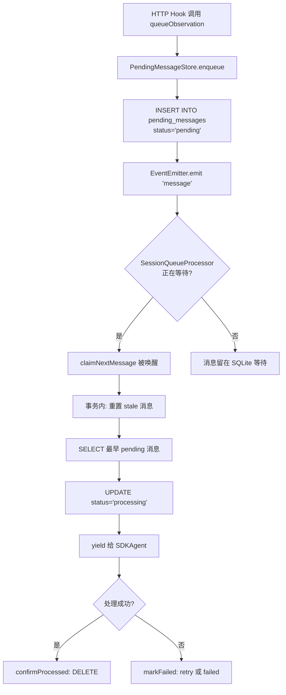
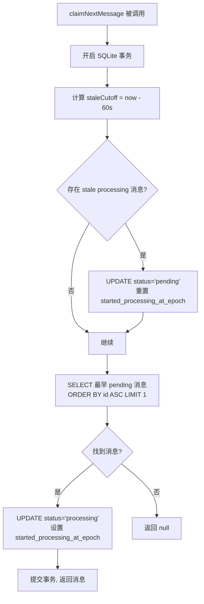

# PD-187.01 claude-mem — EventEmitter 异步消息队列与 claim-confirm 持久化

> 文档编号：PD-187.01
> 来源：claude-mem `src/services/queue/SessionQueueProcessor.ts`
> GitHub：https://github.com/thedotmack/claude-mem.git
> 问题域：PD-187 异步消息队列 Async Message Queue
> 状态：可复用方案

---

## 第 1 章 问题与动机

### 1.1 核心问题

claude-mem 是一个 Claude Code 的记忆观察系统：用户在 Claude Code 中工作时，每次工具调用（Read/Write/Bash 等）都会通过 hook 发送到 claude-mem 的后台 worker，由一个独立的 SDK Agent 进程异步处理这些观察事件并提取记忆。

这带来了一个经典的异步消息队列问题：

1. **生产者-消费者速率不匹配** — HTTP hook 每秒可能产生数十条观察事件，但 SDK Agent（LLM 推理）处理一条需要数秒
2. **进程崩溃导致消息丢失** — SDK 子进程可能因 context overflow、API key 失效等原因崩溃，正在处理的消息不能丢
3. **重复处理** — 崩溃恢复后重新消费队列，如何保证已处理的消息不被重复处理
4. **僵尸进程** — SDK 子进程空闲时不自动退出，导致进程堆积（用户报告 155 个进程 / 51GB RAM）
5. **轮询开销** — 传统 polling 方式在队列为空时浪费 CPU

### 1.2 claude-mem 的解法概述

claude-mem 设计了一套三层架构来解决上述问题：

1. **SQLite 持久化队列**（`PendingMessageStore`）— 消息入队即写 SQLite，4 态状态机（pending → processing → processed/failed），崩溃后消息不丢（`src/services/sqlite/PendingMessageStore.ts:60-84`）
2. **原子 claim-confirm 模式** — 消费时在事务内原子地将 pending 标记为 processing（claim），处理成功后 DELETE（confirm）。崩溃时 processing 状态的消息通过 stale 检测自愈回 pending（`src/services/sqlite/PendingMessageStore.ts:93-139`）
3. **EventEmitter + AsyncIterableIterator** — 队列为空时不轮询，而是 `events.once('message', ...)` 等待唤醒；生产者 enqueue 后立即 `emitter.emit('message')` 零延迟通知（`src/services/queue/SessionQueueProcessor.ts:32-73`）
4. **3 分钟空闲超时** — 队列持续为空超过 3 分钟，触发 `onIdleTimeout` 回调 abort SDK 子进程，防止僵尸进程（`src/services/queue/SessionQueueProcessor.ts:49-62`）
5. **进程池 + 孤儿收割** — `ProcessRegistry` 跟踪所有 SDK 子进程 PID，5 分钟定时收割孤儿进程（`src/services/worker/ProcessRegistry.ts:293-317`）

### 1.3 设计思想

| 设计原则 | 具体实现 | 理由 | 替代方案 |
|----------|----------|------|----------|
| 持久化优先 | 消息先写 SQLite 再通知消费者 | 进程崩溃不丢消息 | Redis/内存队列（崩溃即丢） |
| 原子状态转换 | SQLite 事务内 claim（pending→processing） | 防止并发消费者重复处理 | 分布式锁（过重） |
| 事件驱动非轮询 | EventEmitter.once + Promise 等待 | 零 CPU 开销等待，零延迟唤醒 | setInterval 轮询（浪费 CPU） |
| 自愈而非外部监控 | claimNextMessage 内置 stale 检测 | 每次 claim 自动修复卡住的消息 | 外部定时器扫描（额外复杂度） |
| 超时即终止 | 3 分钟空闲 → abort → SIGKILL 升级 | 防止僵尸进程堆积 | 手动清理（不可靠） |

---

## 第 2 章 源码实现分析

### 2.1 架构概览

claude-mem 的异步消息队列由四个核心组件构成：

```
┌──────────────────────────────────────────────────────────────────┐
│                        HTTP Hook Layer                           │
│  (new-hook / save-hook → POST /api/observe)                     │
└──────────────┬───────────────────────────────────────────────────┘
               │ queueObservation() / queueSummarize()
               ▼
┌──────────────────────────────────────────────────────────────────┐
│                     SessionManager                               │
│  ┌─────────────────┐    ┌──────────────────────────────┐        │
│  │ sessions: Map   │    │ sessionQueues: Map<EventEmitter>│      │
│  │ (in-memory)     │    │ (per-session notification)     │      │
│  └─────────────────┘    └──────────┬───────────────────┘        │
│                                    │ emit('message')            │
└──────────────┬─────────────────────┼────────────────────────────┘
               │ enqueue()           │
               ▼                     ▼
┌──────────────────────┐  ┌──────────────────────────────────────┐
│  PendingMessageStore │  │     SessionQueueProcessor            │
│  (SQLite 持久化)      │  │  async *createIterator()             │
│                      │  │  ┌─ claimNextMessage() ──────────┐   │
│  pending_messages    │◄─┤  │  waitForMessage() (EventEmitter)│  │
│  ┌────┬────┬───────┐│  │  │  idle timeout (3 min)          │   │
│  │ id │stat│content ││  │  └───────────────────────────────┘   │
│  └────┴────┴───────┘│  └──────────────┬────────────────────────┘
└──────────────────────┘                │ yield PendingMessageWithId
                                        ▼
                              ┌──────────────────────┐
                              │      SDKAgent        │
                              │  for await (message)  │
                              │  → LLM 推理           │
                              │  → confirmProcessed() │
                              └──────────────────────┘
```

### 2.2 核心实现

#### 2.2.1 SQLite 持久化队列 — PendingMessageStore



对应源码 `src/services/sqlite/PendingMessageStore.ts:60-84`：

```typescript
enqueue(sessionDbId: number, contentSessionId: string, message: PendingMessage): number {
    const now = Date.now();
    const stmt = this.db.prepare(`
      INSERT INTO pending_messages (
        session_db_id, content_session_id, message_type,
        tool_name, tool_input, tool_response, cwd,
        last_assistant_message,
        prompt_number, status, retry_count, created_at_epoch
      ) VALUES (?, ?, ?, ?, ?, ?, ?, ?, ?, 'pending', 0, ?)
    `);
    const result = stmt.run(
      sessionDbId, contentSessionId, message.type,
      message.tool_name || null,
      message.tool_input ? JSON.stringify(message.tool_input) : null,
      message.tool_response ? JSON.stringify(message.tool_response) : null,
      message.cwd || null,
      message.last_assistant_message || null,
      message.prompt_number || null, now
    );
    return result.lastInsertRowid as number;
}
```

关键设计点：
- 消息入队即持久化，`status='pending'`，`retry_count=0`（`PendingMessageStore.ts:68`）
- JSON 序列化 `tool_input` 和 `tool_response`，支持任意结构（`PendingMessageStore.ts:77-78`）
- 返回 `lastInsertRowid` 作为消息 ID，用于后续 claim-confirm 追踪

#### 2.2.2 原子 claim-confirm — 事务内自愈



对应源码 `src/services/sqlite/PendingMessageStore.ts:93-139`：

```typescript
claimNextMessage(sessionDbId: number): PersistentPendingMessage | null {
    const claimTx = this.db.transaction((sessionId: number) => {
      const now = Date.now();
      // Self-healing: reset stale 'processing' messages back to 'pending'
      const staleCutoff = now - STALE_PROCESSING_THRESHOLD_MS;
      const resetStmt = this.db.prepare(`
        UPDATE pending_messages
        SET status = 'pending', started_processing_at_epoch = NULL
        WHERE session_db_id = ? AND status = 'processing'
          AND started_processing_at_epoch < ?
      `);
      const resetResult = resetStmt.run(sessionId, staleCutoff);
      if (resetResult.changes > 0) {
        logger.info('QUEUE', `SELF_HEAL | recovered ${resetResult.changes} stale message(s)`);
      }
      const peekStmt = this.db.prepare(`
        SELECT * FROM pending_messages
        WHERE session_db_id = ? AND status = 'pending'
        ORDER BY id ASC LIMIT 1
      `);
      const msg = peekStmt.get(sessionId) as PersistentPendingMessage | null;
      if (msg) {
        const updateStmt = this.db.prepare(`
          UPDATE pending_messages
          SET status = 'processing', started_processing_at_epoch = ?
          WHERE id = ?
        `);
        updateStmt.run(now, msg.id);
      }
      return msg;
    });
    return claimTx(sessionDbId) as PersistentPendingMessage | null;
}
```

关键设计点：
- **自愈内置于 claim 路径**：每次 claim 前先扫描 stale 消息（>60s 仍在 processing），重置为 pending（`PendingMessageStore.ts:97-110`）
- **事务保证原子性**：`this.db.transaction()` 确保 stale 重置 + peek + claim 三步在同一事务内完成
- **FIFO 顺序**：`ORDER BY id ASC` 保证先入先出
- **confirm 即删除**：`confirmProcessed()` 直接 DELETE 而非标记状态，减少表膨胀（`PendingMessageStore.ts:146-152`）

### 2.3 实现细节

#### EventEmitter + AsyncIterableIterator 非轮询等待

`SessionQueueProcessor.createIterator()` 是整个队列的消费核心（`SessionQueueProcessor.ts:32-73`）：

- 外层 `while (!signal.aborted)` 循环持续消费
- 有消息时：`claimNextMessage()` → yield → 重置 `lastActivityTime`
- 无消息时：`waitForMessage()` 阻塞等待 EventEmitter 的 `'message'` 事件或超时
- 超时后检查空闲时长，超过 3 分钟调用 `onIdleTimeout()` 终止子进程

`waitForMessage()` 的实现（`SessionQueueProcessor.ts:91-122`）精巧地组合了三个信号源：
1. `events.once('message', onMessage)` — 新消息到达
2. `signal.addEventListener('abort', onAbort)` — 外部取消
3. `setTimeout(onTimeout, timeoutMs)` — 超时

三者共享 `cleanup()` 函数，确保无论哪个先触发都能正确清理其他两个监听器，避免内存泄漏。

#### 生产者零延迟通知

`SessionManager.queueObservation()` 的关键路径（`SessionManager.ts:201-236`）：

```
1. getPendingStore().enqueue()     → SQLite 持久化
2. emitter.emit('message')         → 唤醒 SessionQueueProcessor
```

先持久化再通知，确保即使通知后消费者崩溃，消息仍在 SQLite 中。

#### claim-confirm 在 ResponseProcessor 中的闭环

SDKAgent 消费消息时将 `_persistentId` 推入 `session.processingMessageIds`（`SDKAgent.ts:373`），ResponseProcessor 在数据库事务成功后批量 confirm（`ResponseProcessor.ts:116-124`）：

```typescript
// CLAIM-CONFIRM: Now that storage succeeded, confirm all processing messages
const pendingStore = sessionManager.getPendingMessageStore();
for (const messageId of session.processingMessageIds) {
    pendingStore.confirmProcessed(messageId);
}
session.processingMessageIds = [];
```

这保证了：消息只有在观察结果成功写入数据库后才从队列中删除。

---

## 第 3 章 迁移指南

### 3.1 迁移清单

**阶段 1：持久化队列基础**
- [ ] 创建 `pending_messages` 表（id, session_id, message_type, status, retry_count, created_at_epoch, started_processing_at_epoch, completed_at_epoch）
- [ ] 实现 `PendingMessageStore`：enqueue / claimNextMessage / confirmProcessed / markFailed
- [ ] 在 claimNextMessage 事务内加入 stale 自愈逻辑

**阶段 2：事件驱动消费**
- [ ] 为每个 session 创建独立 EventEmitter
- [ ] 实现 `SessionQueueProcessor.createIterator()` — AsyncIterableIterator 模式
- [ ] 实现 `waitForMessage()` — 三信号源（message/abort/timeout）组合等待

**阶段 3：生命周期管理**
- [ ] 实现空闲超时检测（可配置阈值，默认 3 分钟）
- [ ] 通过 AbortController 传播取消信号
- [ ] 实现进程注册表 + 孤儿收割定时器

**阶段 4：容错增强**
- [ ] 实现 retry 计数 + 最大重试次数（默认 3 次）
- [ ] 实现 `markSessionMessagesFailed()` — 会话级批量失败标记
- [ ] 实现 `resetStaleProcessingMessages()` — 启动时全局恢复

### 3.2 适配代码模板

以下是一个可直接复用的 TypeScript 持久化队列实现骨架：

```typescript
import { EventEmitter } from 'events';
import Database from 'better-sqlite3';

// ============ 1. 持久化存储层 ============
interface QueueMessage {
  id: number;
  session_id: string;
  payload: string;
  status: 'pending' | 'processing' | 'failed';
  retry_count: number;
  created_at: number;
  started_at: number | null;
}

class PersistentQueue {
  private db: Database.Database;
  private maxRetries: number;
  private staleThresholdMs: number;

  constructor(db: Database.Database, maxRetries = 3, staleThresholdMs = 60_000) {
    this.db = db;
    this.maxRetries = maxRetries;
    this.staleThresholdMs = staleThresholdMs;
    this.db.exec(`
      CREATE TABLE IF NOT EXISTS queue_messages (
        id INTEGER PRIMARY KEY AUTOINCREMENT,
        session_id TEXT NOT NULL,
        payload TEXT NOT NULL,
        status TEXT NOT NULL DEFAULT 'pending',
        retry_count INTEGER NOT NULL DEFAULT 0,
        created_at INTEGER NOT NULL,
        started_at INTEGER,
        CONSTRAINT valid_status CHECK (status IN ('pending', 'processing', 'failed'))
      )
    `);
  }

  enqueue(sessionId: string, payload: any): number {
    const stmt = this.db.prepare(
      `INSERT INTO queue_messages (session_id, payload, status, retry_count, created_at)
       VALUES (?, ?, 'pending', 0, ?)`
    );
    return stmt.run(sessionId, JSON.stringify(payload), Date.now()).lastInsertRowid as number;
  }

  /** 原子 claim：自愈 stale → peek → mark processing */
  claim(sessionId: string): QueueMessage | null {
    return this.db.transaction(() => {
      const now = Date.now();
      // 自愈 stale 消息
      this.db.prepare(`
        UPDATE queue_messages SET status = 'pending', started_at = NULL
        WHERE session_id = ? AND status = 'processing'
          AND started_at < ?
      `).run(sessionId, now - this.staleThresholdMs);

      const msg = this.db.prepare(`
        SELECT * FROM queue_messages
        WHERE session_id = ? AND status = 'pending'
        ORDER BY id ASC LIMIT 1
      `).get(sessionId) as QueueMessage | null;

      if (msg) {
        this.db.prepare(`
          UPDATE queue_messages SET status = 'processing', started_at = ?
          WHERE id = ?
        `).run(now, msg.id);
      }
      return msg;
    })();
  }

  confirm(messageId: number): void {
    this.db.prepare('DELETE FROM queue_messages WHERE id = ?').run(messageId);
  }

  markFailed(messageId: number): void {
    const msg = this.db.prepare('SELECT retry_count FROM queue_messages WHERE id = ?')
      .get(messageId) as { retry_count: number } | undefined;
    if (!msg) return;
    if (msg.retry_count < this.maxRetries) {
      this.db.prepare(`UPDATE queue_messages SET status = 'pending', retry_count = retry_count + 1, started_at = NULL WHERE id = ?`).run(messageId);
    } else {
      this.db.prepare(`UPDATE queue_messages SET status = 'failed' WHERE id = ?`).run(messageId);
    }
  }
}

// ============ 2. 事件驱动消费层 ============
interface IteratorOptions {
  sessionId: string;
  signal: AbortSignal;
  idleTimeoutMs?: number;
  onIdleTimeout?: () => void;
}

class QueueConsumer {
  constructor(private store: PersistentQueue, private events: EventEmitter) {}

  async *consume(options: IteratorOptions): AsyncIterableIterator<QueueMessage> {
    const { sessionId, signal, idleTimeoutMs = 180_000, onIdleTimeout } = options;
    let lastActivity = Date.now();

    while (!signal.aborted) {
      const msg = this.store.claim(sessionId);
      if (msg) {
        lastActivity = Date.now();
        yield msg;
      } else {
        const received = await this.waitForSignal(signal, idleTimeoutMs);
        if (!received && !signal.aborted) {
          if (Date.now() - lastActivity >= idleTimeoutMs) {
            onIdleTimeout?.();
            return;
          }
          lastActivity = Date.now(); // spurious wakeup
        }
      }
    }
  }

  private waitForSignal(signal: AbortSignal, timeoutMs: number): Promise<boolean> {
    return new Promise(resolve => {
      let timer: ReturnType<typeof setTimeout>;
      const cleanup = () => {
        clearTimeout(timer);
        this.events.off('message', onMsg);
        signal.removeEventListener('abort', onAbort);
      };
      const onMsg = () => { cleanup(); resolve(true); };
      const onAbort = () => { cleanup(); resolve(false); };
      this.events.once('message', onMsg);
      signal.addEventListener('abort', onAbort, { once: true });
      timer = setTimeout(() => { cleanup(); resolve(false); }, timeoutMs);
    });
  }
}
```

### 3.3 适用场景

| 场景 | 适用度 | 说明 |
|------|--------|------|
| Agent 后台任务队列 | ⭐⭐⭐ | 完美匹配：LLM 推理慢、需要持久化、需要空闲回收 |
| Webhook 事件处理 | ⭐⭐⭐ | HTTP 入队 + 异步消费，claim-confirm 防丢失 |
| 单机微服务消息传递 | ⭐⭐ | SQLite 限制了分布式场景，但单机足够 |
| 高吞吐流式处理 | ⭐ | SQLite 写入是瓶颈，不适合每秒万级消息 |
| 分布式多节点队列 | ⭐ | 需要替换 SQLite 为 PostgreSQL/Redis |

---

## 第 4 章 测试用例

```typescript
import { describe, it, expect, beforeEach, afterEach } from 'vitest';
import Database from 'better-sqlite3';
import { EventEmitter } from 'events';

// 假设 PersistentQueue 和 QueueConsumer 已按 3.2 模板实现

describe('PersistentQueue', () => {
  let db: Database.Database;
  let queue: PersistentQueue;

  beforeEach(() => {
    db = new Database(':memory:');
    queue = new PersistentQueue(db);
  });

  afterEach(() => db.close());

  it('enqueue 后 claim 返回消息且状态为 processing', () => {
    const id = queue.enqueue('session-1', { tool: 'Read', path: '/foo' });
    const msg = queue.claim('session-1');
    expect(msg).not.toBeNull();
    expect(msg!.id).toBe(id);
    expect(msg!.status).toBe('pending'); // claim 返回的是 claim 前的快照
    // 验证数据库中状态已更新
    const dbMsg = db.prepare('SELECT status FROM queue_messages WHERE id = ?').get(id) as any;
    expect(dbMsg.status).toBe('processing');
  });

  it('claim 空队列返回 null', () => {
    expect(queue.claim('session-1')).toBeNull();
  });

  it('confirm 后消息从队列中删除', () => {
    const id = queue.enqueue('session-1', { tool: 'Bash' });
    queue.claim('session-1');
    queue.confirm(id);
    const count = db.prepare('SELECT COUNT(*) as c FROM queue_messages').get() as any;
    expect(count.c).toBe(0);
  });

  it('stale 消息在 claim 时自愈回 pending', () => {
    const id = queue.enqueue('session-1', { tool: 'Read' });
    // 手动设置为 processing 且 started_at 为 2 分钟前
    db.prepare(`UPDATE queue_messages SET status = 'processing', started_at = ? WHERE id = ?`)
      .run(Date.now() - 120_000, id);
    // claim 应该先自愈再返回
    const msg = queue.claim('session-1');
    expect(msg).not.toBeNull();
    expect(msg!.id).toBe(id);
  });

  it('markFailed 在重试次数内回到 pending', () => {
    const id = queue.enqueue('session-1', { tool: 'Write' });
    queue.claim('session-1');
    queue.markFailed(id);
    const msg = db.prepare('SELECT status, retry_count FROM queue_messages WHERE id = ?').get(id) as any;
    expect(msg.status).toBe('pending');
    expect(msg.retry_count).toBe(1);
  });

  it('markFailed 超过最大重试次数标记为 failed', () => {
    const id = queue.enqueue('session-1', { tool: 'Write' });
    // 模拟已重试 3 次
    db.prepare('UPDATE queue_messages SET retry_count = 3 WHERE id = ?').run(id);
    queue.claim('session-1');
    queue.markFailed(id);
    const msg = db.prepare('SELECT status FROM queue_messages WHERE id = ?').get(id) as any;
    expect(msg.status).toBe('failed');
  });

  it('FIFO 顺序：先入先出', () => {
    queue.enqueue('session-1', { order: 1 });
    queue.enqueue('session-1', { order: 2 });
    queue.enqueue('session-1', { order: 3 });
    const m1 = queue.claim('session-1');
    queue.confirm(m1!.id);
    const m2 = queue.claim('session-1');
    queue.confirm(m2!.id);
    const m3 = queue.claim('session-1');
    expect(JSON.parse(m1!.payload).order).toBe(1);
    expect(JSON.parse(m2!.payload).order).toBe(2);
    expect(JSON.parse(m3!.payload).order).toBe(3);
  });
});

describe('QueueConsumer idle timeout', () => {
  it('空闲超时触发 onIdleTimeout 回调', async () => {
    const db = new Database(':memory:');
    const queue = new PersistentQueue(db);
    const events = new EventEmitter();
    const consumer = new QueueConsumer(queue, events);
    const ac = new AbortController();
    let timedOut = false;

    const iterator = consumer.consume({
      sessionId: 'session-1',
      signal: ac.signal,
      idleTimeoutMs: 100, // 100ms for test speed
      onIdleTimeout: () => { timedOut = true; }
    });

    // 消费空队列，应该在 ~100ms 后触发超时
    const result = await iterator.next();
    expect(result.done).toBe(true);
    expect(timedOut).toBe(true);
    db.close();
  });
});
```

---

## 第 5 章 跨域关联

| 关联域 | 关系类型 | 说明 |
|--------|----------|------|
| PD-06 记忆持久化 | 协同 | 消息队列是记忆持久化的前置管道：观察事件先入队，处理后写入记忆数据库 |
| PD-03 容错与重试 | 依赖 | claim-confirm + stale 自愈 + retry 计数本质上是容错重试模式在队列层的实现 |
| PD-11 可观测性 | 协同 | 队列深度、stale 消息数、处理延迟等指标是系统健康的关键可观测信号 |
| PD-182 进程生命周期管理 | 依赖 | 空闲超时终止 SDK 子进程、ProcessRegistry 孤儿收割依赖进程生命周期管理能力 |
| PD-02 多 Agent 编排 | 协同 | 每个 session 独立队列 + EventEmitter 是多 Agent 并行处理的基础设施 |

---

## 第 6 章 来源文件索引

| 文件 | 行范围 | 关键实现 |
|------|--------|----------|
| `src/services/queue/SessionQueueProcessor.ts` | L1-L123 | AsyncIterableIterator 消费者、waitForMessage 三信号等待、空闲超时 |
| `src/services/sqlite/PendingMessageStore.ts` | L1-L489 | SQLite 持久化队列、claim-confirm 原子操作、stale 自愈、retry 逻辑 |
| `src/services/worker/SessionManager.ts` | L1-L491 | 会话生命周期、queueObservation/queueSummarize 入队、EventEmitter 管理 |
| `src/services/worker/SDKAgent.ts` | L1-L488 | SDK 查询循环、createMessageGenerator 消费迭代器、processingMessageIds 追踪 |
| `src/services/worker/ProcessRegistry.ts` | L1-L411 | PID 注册表、waitForSlot 进程池、ensureProcessExit SIGKILL 升级、孤儿收割 |
| `src/services/worker/agents/ResponseProcessor.ts` | L114-L124 | confirmProcessed 批量确认、claim-confirm 闭环 |
| `src/services/worker-types.ts` | L1-L63 | PendingMessage / PendingMessageWithId / ActiveSession 类型定义 |

---

## 第 7 章 横向对比维度

```json comparison_data
{
  "project": "claude-mem",
  "dimensions": {
    "队列存储": "SQLite pending_messages 表，4 态状态机",
    "消费模式": "AsyncIterableIterator + EventEmitter 非轮询",
    "防重复机制": "SQLite 事务内原子 claim-confirm",
    "自愈策略": "claim 路径内置 60s stale 检测自动重置",
    "空闲回收": "3 分钟无消息 → AbortController → SIGKILL 升级",
    "重试机制": "retry_count 计数，3 次后标记 failed",
    "进程管理": "PID 注册表 + 5 分钟孤儿收割定时器"
  }
}
```

### 域元数据补充

```json domain_metadata
{
  "solution_summary": "claude-mem 用 SQLite 4 态状态机 + EventEmitter 非轮询等待实现持久化异步队列，claim 路径内置 stale 自愈，3 分钟空闲超时自动终止 SDK 子进程",
  "description": "单机场景下 SQLite 事务保证的轻量级持久化消息队列",
  "sub_problems": [
    "进程池并发限制与 slot 等待机制",
    "会话级批量失败标记与孤儿消息清理",
    "多信号源（message/abort/timeout）组合等待的内存泄漏防护"
  ],
  "best_practices": [
    "confirm 用 DELETE 而非状态标记，避免表膨胀",
    "自愈逻辑内置于 claim 路径而非外部定时器，减少组件耦合",
    "waitForMessage 三信号共享 cleanup 函数防止监听器泄漏"
  ]
}
```
