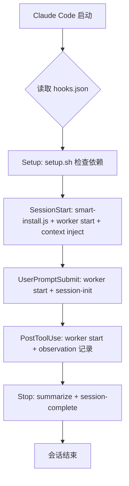
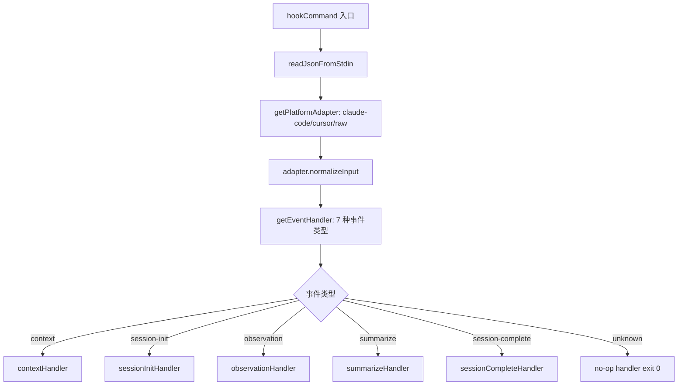
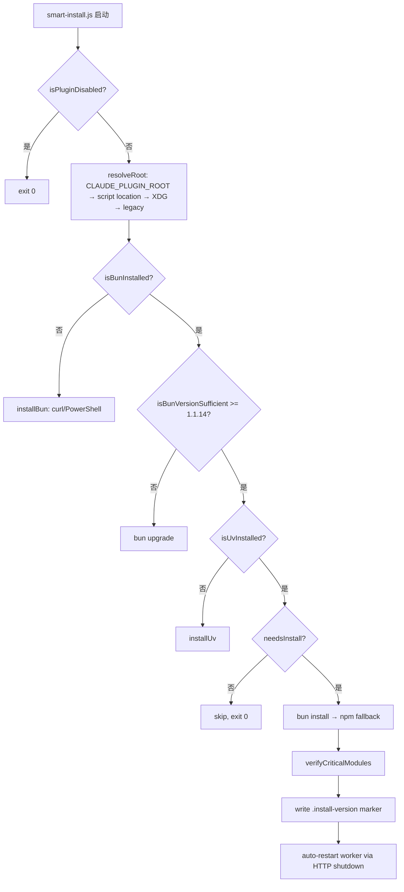

# PD-188.01 claude-mem — 完整插件系统架构与生命周期管理

> 文档编号：PD-188.01
> 来源：claude-mem `plugin/.claude-plugin/plugin.json`, `plugin/hooks/hooks.json`, `plugin/scripts/smart-install.js`
> GitHub：https://github.com/thedotmack/claude-mem.git
> 问题域：PD-188 插件系统架构 Plugin System Architecture
> 状态：可复用方案

---

## 第 1 章 问题与动机

### 1.1 核心问题

Claude Code 作为 CLI 工具，需要一种标准化的插件扩展机制，让第三方开发者能够：

1. **声明式注册**：通过 JSON 配置文件声明插件元数据、生命周期钩子和 MCP 服务，而非硬编码
2. **生命周期管理**：在 Claude Code 会话的不同阶段（启动、用户输入、工具调用后、停止）自动执行插件逻辑
3. **零配置安装**：用户通过 marketplace 一键安装后，插件自动检测运行时依赖并安装
4. **双分发渠道**：同时支持 marketplace 安装（面向终端用户）和 npm SDK 导入（面向开发者集成）
5. **优雅降级**：当 worker 进程不可用时，钩子静默退出而非阻塞 Claude Code 主流程

claude-mem 是目前 Claude Code 生态中最成熟的插件实现之一（v10.4.1），其架构设计解决了上述所有问题。

### 1.2 claude-mem 的解法概述

1. **plugin.json 元数据声明** (`plugin/.claude-plugin/plugin.json:1-17`)：标准 JSON 格式声明插件名称、版本、描述、关键词、仓库地址和许可证，供 marketplace 索引和展示
2. **hooks.json 声明式钩子注册** (`plugin/hooks/hooks.json:1-98`)：将 5 个生命周期事件（Setup/SessionStart/UserPromptSubmit/PostToolUse/Stop）映射到具体的 shell 命令，每个钩子带 matcher 模式和超时配置
3. **三层技能系统** (`plugin/skills/`)：mem-search（搜索记忆）、make-plan（规划）、do（执行）三个 SKILL.md 文件，通过 YAML frontmatter 声明名称和描述，Claude Code 自动加载
4. **smart-install.js 智能依赖管理** (`plugin/scripts/smart-install.js:1-583`)：版本标记文件 `.install-version` 缓存已安装版本，仅在版本变更时重新安装；自动检测并安装 Bun 和 uv 运行时
5. **bun-runner.js 运行时桥接** (`plugin/scripts/bun-runner.js:1-149`)：解决 fresh install 后 Bun 不在 PATH 中的问题，通过探测常见安装路径找到 Bun 可执行文件

### 1.3 设计思想

| 设计原则 | 具体实现 | 理由 | 替代方案 |
|----------|----------|------|----------|
| 声明式优于命令式 | hooks.json + plugin.json 纯 JSON 配置 | 避免运行时注册的竞态条件，Claude Code 可静态解析 | 代码中调用 registerHook() API |
| 进程隔离 | worker-service 独立守护进程 + HTTP API | 钩子执行不阻塞 Claude Code 主进程，崩溃不影响宿主 | 同进程插件加载 |
| 优雅降级 | hook-command.ts 区分 transport 错误和 client 错误 | worker 不可用时静默退出（exit 0），client bug 时阻塞报错（exit 2） | 统一 exit 1 |
| 版本缓存安装 | .install-version JSON 标记文件 | 避免每次会话启动都执行 npm install，节省 5-30 秒 | 每次都安装 / lockfile hash 比对 |
| 运行时自动发现 | bun-runner.js 探测 PATH + 常见路径 | 解决 fresh install 后 PATH 未刷新的问题 | 要求用户手动重启终端 |
| 双分发 | npm exports + marketplace plugin/ 目录 | 开发者可 `import { parser } from 'claude-mem/sdk'`，用户可 marketplace 安装 | 仅 npm 或仅 marketplace |

---

## 第 2 章 源码实现分析

### 2.1 架构概览

claude-mem 的插件架构分为四层：

```
┌─────────────────────────────────────────────────────────┐
│                    Claude Code Host                      │
│  ┌──────────────┐  ┌──────────────┐  ┌───────────────┐ │
│  │ plugin.json  │  │  hooks.json  │  │   .mcp.json   │ │
│  │  (元数据)     │  │  (生命周期)   │  │  (MCP 服务)   │ │
│  └──────┬───────┘  └──────┬───────┘  └───────┬───────┘ │
│         │                 │                   │         │
│  ┌──────▼─────────────────▼───────────────────▼───────┐ │
│  │              Plugin Bootstrap Layer                 │ │
│  │  setup.sh → smart-install.js → bun-runner.js       │ │
│  └──────────────────────┬─────────────────────────────┘ │
│                         │                               │
│  ┌──────────────────────▼─────────────────────────────┐ │
│  │              Worker Service (守护进程)               │ │
│  │  HTTP API :37777 │ SQLite DB │ Chroma Vector       │ │
│  │  SessionManager │ SDKAgent │ SearchOrchestrator    │ │
│  └──────────────────────┬─────────────────────────────┘ │
│                         │                               │
│  ┌──────────────────────▼─────────────────────────────┐ │
│  │              Skills Layer                           │ │
│  │  mem-search │ make-plan │ do                       │ │
│  │  (SKILL.md YAML frontmatter)                       │ │
│  └────────────────────────────────────────────────────┘ │
└─────────────────────────────────────────────────────────┘
```

### 2.2 核心实现

#### 2.2.1 生命周期钩子注册



对应源码 `plugin/hooks/hooks.json:1-98`：

```json
{
  "hooks": {
    "Setup": [{
      "matcher": "*",
      "hooks": [{
        "type": "command",
        "command": "${CLAUDE_PLUGIN_ROOT}/scripts/setup.sh",
        "timeout": 300
      }]
    }],
    "SessionStart": [{
      "matcher": "startup|clear|compact",
      "hooks": [
        { "type": "command", "command": "node \"${CLAUDE_PLUGIN_ROOT}/scripts/smart-install.js\"", "timeout": 300 },
      ]
    }, {
      "matcher": "startup|clear|compact",
      "hooks": [
        { "type": "command", "command": "node ... worker-service.cjs start", "timeout": 60 },
        { "type": "command", "command": "node ... worker-service.cjs hook claude-code context", "timeout": 60 }
      ]
    }],
    "PostToolUse": [{
      "matcher": "*",
      "hooks": [
        { "type": "command", "command": "node ... worker-service.cjs start", "timeout": 60 },
        { "type": "command", "command": "node ... worker-service.cjs hook claude-code observation", "timeout": 120 }
      ]
    }],
    "Stop": [{
      "hooks": [
        { "type": "command", "command": "node ... worker-service.cjs hook claude-code summarize", "timeout": 120 },
        { "type": "command", "command": "node ... worker-service.cjs hook claude-code session-complete", "timeout": 30 }
      ]
    }]
  }
}
```

关键设计点：
- 每个钩子组先执行 `worker-service.cjs start` 确保 worker 进程存活，再执行业务逻辑
- `matcher` 字段支持 glob 模式匹配，`"*"` 匹配所有事件，`"startup|clear|compact"` 匹配特定子事件
- `${CLAUDE_PLUGIN_ROOT}` 环境变量由 Claude Code 注入，指向插件安装目录

#### 2.2.2 事件处理器工厂模式



对应源码 `src/cli/handlers/index.ts:18-58`：

```typescript
export type EventType =
  | 'context'           // SessionStart - inject context
  | 'session-init'      // UserPromptSubmit - initialize session
  | 'observation'       // PostToolUse - save observation
  | 'summarize'         // Stop - generate summary (phase 1)
  | 'session-complete'  // Stop - complete session (phase 2)
  | 'user-message'      // SessionStart (parallel) - display to user
  | 'file-edit';        // Cursor afterFileEdit

const handlers: Record<EventType, EventHandler> = {
  'context': contextHandler,
  'session-init': sessionInitHandler,
  'observation': observationHandler,
  'summarize': summarizeHandler,
  'session-complete': sessionCompleteHandler,
  'user-message': userMessageHandler,
  'file-edit': fileEditHandler
};

export function getEventHandler(eventType: string): EventHandler {
  const handler = handlers[eventType as EventType];
  if (!handler) {
    // Unknown event types get no-op handler (fix #984)
    return {
      async execute() {
        return { continue: true, suppressOutput: true, exitCode: HOOK_EXIT_CODES.SUCCESS };
      }
    };
  }
  return handler;
}
```

关键设计：未知事件类型返回 no-op handler 而非抛异常，确保 Claude Code 新增事件类型时不会破坏已安装插件。

#### 2.2.3 智能依赖安装与版本缓存



对应源码 `plugin/scripts/smart-install.js:400-409`：

```javascript
function needsInstall() {
  if (!existsSync(join(ROOT, 'node_modules'))) return true;
  try {
    const pkg = JSON.parse(readFileSync(join(ROOT, 'package.json'), 'utf-8'));
    const marker = JSON.parse(readFileSync(MARKER, 'utf-8'));
    return pkg.version !== marker.version || getBunVersion() !== marker.bun;
  } catch {
    return true;
  }
}
```

版本标记文件 `.install-version` 结构：
```json
{
  "version": "10.4.1",
  "bun": "1.2.5",
  "uv": "uv 0.6.14",
  "installedAt": "2026-02-28T10:00:00.000Z"
}
```

### 2.3 实现细节

**插件禁用检查的快速路径** (`src/shared/plugin-state.ts:17-29`)：

每个钩子脚本（bun-runner.js、smart-install.js）在执行任何逻辑前，都先同步读取 `~/.claude/settings.json` 检查 `enabledPlugins['claude-mem@thedotmack']` 是否为 `false`。这是一个 O(1) 的文件读取 + JSON 解析，确保禁用的插件不会产生任何进程开销。

**钩子退出码语义** (`src/shared/hook-constants.ts:21-28`)：

```typescript
export const HOOK_EXIT_CODES = {
  SUCCESS: 0,          // 成功，stdout 注入上下文
  FAILURE: 1,          // 失败，stderr 仅 verbose 模式显示
  BLOCKING_ERROR: 2,   // 阻塞错误，stderr 展示给用户
  USER_MESSAGE_ONLY: 3 // 仅展示给用户，不注入上下文
} as const;
```

**错误分类与优雅降级** (`src/cli/hook-command.ts:26-66`)：

`isWorkerUnavailableError()` 函数将错误分为两类：
- Transport 错误（ECONNREFUSED、ETIMEDOUT 等）→ exit 0（优雅降级）
- Client 错误（4xx、TypeError 等）→ exit 2（阻塞报错，开发者需修复）

**MCP 服务注册** (`plugin/.mcp.json:1-8`)：

```json
{
  "mcpServers": {
    "mcp-search": {
      "type": "stdio",
      "command": "${CLAUDE_PLUGIN_ROOT}/scripts/mcp-server.cjs"
    }
  }
}
```

MCP server 是 worker HTTP API 的薄包装，将 MCP 协议的 `search` 和 `timeline` 工具调用转发到 `localhost:37777/api/search` 和 `/api/timeline`。

**Mode 系统与继承** (`src/services/domain/ModeManager.ts:49-72`)：

Mode 配置支持 `parent--override` 继承模式（如 `code--ko` 继承 `code` 并覆盖韩语提示词），通过 `--` 分隔符解析父子关系，深度合并配置对象。


---

## 第 3 章 迁移指南

### 3.1 迁移清单

将 claude-mem 的插件架构迁移到自己的 Claude Code 插件项目，分三个阶段：

**阶段 1：基础插件骨架（1 天）**

- [ ] 创建 `plugin/.claude-plugin/plugin.json` 声明元数据
- [ ] 创建 `plugin/hooks/hooks.json` 注册至少 SessionStart 和 Stop 钩子
- [ ] 创建 `plugin/.mcp.json` 注册 MCP 服务（如需要）
- [ ] 实现 `plugin/scripts/setup.sh` 检查运行时依赖

**阶段 2：智能安装与 Worker（2-3 天）**

- [ ] 实现 smart-install 脚本：版本标记 + 条件安装 + 运行时自动发现
- [ ] 实现 worker 守护进程：HTTP API + PID 文件管理 + 健康检查
- [ ] 实现 bun-runner 桥接脚本（如使用 Bun 运行时）
- [ ] 实现插件禁用检查快速路径

**阶段 3：技能与 Mode 系统（1-2 天）**

- [ ] 创建 `plugin/skills/<skill-name>/SKILL.md` 技能文件
- [ ] 实现 Mode 配置系统（如需多语言/多场景支持）
- [ ] 配置 npm exports 实现双分发

### 3.2 适配代码模板

#### 最小可用 plugin.json

```json
{
  "name": "my-plugin",
  "version": "1.0.0",
  "description": "My Claude Code plugin",
  "author": { "name": "Your Name" },
  "repository": "https://github.com/you/my-plugin",
  "license": "MIT",
  "keywords": ["claude", "plugin"]
}
```

#### 最小可用 hooks.json

```json
{
  "description": "My plugin hooks",
  "hooks": {
    "SessionStart": [
      {
        "matcher": "startup|clear|compact",
        "hooks": [
          {
            "type": "command",
            "command": "node \"${CLAUDE_PLUGIN_ROOT}/scripts/setup.js\"",
            "timeout": 30
          },
          {
            "type": "command",
            "command": "node \"${CLAUDE_PLUGIN_ROOT}/scripts/on-session-start.js\"",
            "timeout": 60
          }
        ]
      }
    ],
    "Stop": [
      {
        "hooks": [
          {
            "type": "command",
            "command": "node \"${CLAUDE_PLUGIN_ROOT}/scripts/on-stop.js\"",
            "timeout": 60
          }
        ]
      }
    ]
  }
}
```

#### 版本缓存安装模板

```javascript
#!/usr/bin/env node
import { existsSync, readFileSync, writeFileSync } from 'fs';
import { execSync } from 'child_process';
import { join, dirname } from 'path';
import { fileURLToPath } from 'url';

const ROOT = process.env.CLAUDE_PLUGIN_ROOT
  || dirname(dirname(fileURLToPath(import.meta.url)));
const MARKER = join(ROOT, '.install-version');

function needsInstall() {
  if (!existsSync(join(ROOT, 'node_modules'))) return true;
  try {
    const pkg = JSON.parse(readFileSync(join(ROOT, 'package.json'), 'utf-8'));
    const marker = JSON.parse(readFileSync(MARKER, 'utf-8'));
    return pkg.version !== marker.version;
  } catch { return true; }
}

if (needsInstall()) {
  console.error('Installing dependencies...');
  execSync('npm install --production', { cwd: ROOT, stdio: 'inherit' });
  const pkg = JSON.parse(readFileSync(join(ROOT, 'package.json'), 'utf-8'));
  writeFileSync(MARKER, JSON.stringify({
    version: pkg.version,
    installedAt: new Date().toISOString()
  }));
}
```

#### 优雅降级错误分类模板

```typescript
export function isWorkerUnavailableError(error: unknown): boolean {
  const message = error instanceof Error ? error.message : String(error);
  const lower = message.toLowerCase();

  // Transport failures → graceful degradation (exit 0)
  const transportPatterns = [
    'econnrefused', 'econnreset', 'epipe', 'etimedout',
    'fetch failed', 'socket hang up'
  ];
  if (transportPatterns.some(p => lower.includes(p))) return true;
  if (lower.includes('timed out') || lower.includes('timeout')) return true;
  if (/status[:\s]+5\d{2}/.test(message)) return true;

  // Client errors → blocking error (exit 2)
  return false;
}
```

### 3.3 适用场景

| 场景 | 适用度 | 说明 |
|------|--------|------|
| Claude Code 记忆/上下文增强插件 | ⭐⭐⭐ | 完美匹配，claude-mem 就是这个场景 |
| Claude Code 代码分析/审查插件 | ⭐⭐⭐ | PostToolUse 钩子可拦截所有工具调用 |
| Claude Code 自定义 MCP 工具提供者 | ⭐⭐⭐ | .mcp.json 注册 + worker HTTP 代理模式 |
| Claude Code 多语言/国际化插件 | ⭐⭐ | Mode 继承系统可复用，但需适配 |
| 非 Claude Code 的 LLM 工具插件 | ⭐ | hooks.json 格式是 Claude Code 专有的 |

---

## 第 4 章 测试用例

```python
import pytest
import json
import os
import subprocess
from pathlib import Path
from unittest.mock import patch, MagicMock


class TestPluginMetadata:
    """测试 plugin.json 元数据声明"""

    def test_plugin_json_required_fields(self):
        """plugin.json 必须包含 name, version, description"""
        plugin_json = {
            "name": "claude-mem",
            "version": "10.4.0",
            "description": "Persistent memory system for Claude Code",
            "author": {"name": "Alex Newman"},
            "repository": "https://github.com/thedotmack/claude-mem",
            "license": "AGPL-3.0",
            "keywords": ["memory", "context", "persistence", "hooks", "mcp"]
        }
        assert "name" in plugin_json
        assert "version" in plugin_json
        assert "description" in plugin_json
        assert plugin_json["name"] == "claude-mem"

    def test_plugin_json_semver_format(self):
        """version 字段必须是合法 semver"""
        import re
        version = "10.4.0"
        assert re.match(r'^\d+\.\d+\.\d+$', version)


class TestHooksRegistration:
    """测试 hooks.json 声明式钩子注册"""

    def setup_method(self):
        self.hooks_config = {
            "hooks": {
                "Setup": [{"matcher": "*", "hooks": [{"type": "command", "command": "setup.sh", "timeout": 300}]}],
                "SessionStart": [{"matcher": "startup|clear|compact", "hooks": []}],
                "PostToolUse": [{"matcher": "*", "hooks": []}],
                "Stop": [{"hooks": []}]
            }
        }

    def test_all_lifecycle_events_registered(self):
        """所有 5 个生命周期事件都应注册"""
        expected_events = {"Setup", "SessionStart", "PostToolUse", "Stop"}
        assert expected_events.issubset(set(self.hooks_config["hooks"].keys()))

    def test_matcher_pattern_validation(self):
        """matcher 应为 glob 模式或 '*'"""
        setup = self.hooks_config["hooks"]["Setup"][0]
        assert setup["matcher"] == "*"
        session_start = self.hooks_config["hooks"]["SessionStart"][0]
        assert "|" in session_start["matcher"]  # pipe-separated patterns

    def test_hook_timeout_positive(self):
        """每个钩子必须有正数超时"""
        setup_hook = self.hooks_config["hooks"]["Setup"][0]["hooks"][0]
        assert setup_hook["timeout"] > 0

    def test_unknown_event_returns_noop(self):
        """未知事件类型应返回 no-op handler"""
        known_events = {"context", "session-init", "observation", "summarize",
                        "session-complete", "user-message", "file-edit"}
        unknown = "future-event"
        assert unknown not in known_events
        # no-op handler should return exit code 0
        noop_result = {"continue": True, "suppressOutput": True, "exitCode": 0}
        assert noop_result["exitCode"] == 0


class TestSmartInstall:
    """测试智能依赖安装"""

    def test_needs_install_no_node_modules(self, tmp_path):
        """没有 node_modules 时应返回 True"""
        assert not (tmp_path / "node_modules").exists()

    def test_needs_install_version_mismatch(self, tmp_path):
        """版本不匹配时应返回 True"""
        pkg = {"version": "2.0.0"}
        marker = {"version": "1.0.0", "bun": "1.2.0"}
        (tmp_path / "package.json").write_text(json.dumps(pkg))
        (tmp_path / ".install-version").write_text(json.dumps(marker))
        (tmp_path / "node_modules").mkdir()
        pkg_data = json.loads((tmp_path / "package.json").read_text())
        marker_data = json.loads((tmp_path / ".install-version").read_text())
        assert pkg_data["version"] != marker_data["version"]

    def test_skip_install_when_versions_match(self, tmp_path):
        """版本匹配时应跳过安装"""
        pkg = {"version": "1.0.0"}
        marker = {"version": "1.0.0", "bun": "1.2.0"}
        (tmp_path / "package.json").write_text(json.dumps(pkg))
        (tmp_path / ".install-version").write_text(json.dumps(marker))
        (tmp_path / "node_modules").mkdir()
        pkg_data = json.loads((tmp_path / "package.json").read_text())
        marker_data = json.loads((tmp_path / ".install-version").read_text())
        assert pkg_data["version"] == marker_data["version"]


class TestErrorClassification:
    """测试错误分类与优雅降级"""

    def test_transport_errors_are_unavailable(self):
        """Transport 错误应被分类为 worker 不可用"""
        transport_errors = [
            "ECONNREFUSED", "ECONNRESET", "EPIPE", "ETIMEDOUT",
            "fetch failed", "socket hang up"
        ]
        for err_msg in transport_errors:
            lower = err_msg.lower()
            patterns = ['econnrefused', 'econnreset', 'epipe', 'etimedout',
                        'fetch failed', 'socket hang up']
            assert any(p in lower for p in patterns), f"{err_msg} should be transport error"

    def test_client_errors_are_not_unavailable(self):
        """4xx 错误应被分类为 client bug"""
        import re
        client_errors = ["failed: 400", "status: 404", "status: 422"]
        for err_msg in client_errors:
            assert re.search(r'(failed|status)[:\s]+4\d{2}', err_msg)

    def test_plugin_disabled_check(self):
        """插件禁用检查应读取 settings.json"""
        settings = {"enabledPlugins": {"claude-mem@thedotmack": False}}
        assert settings["enabledPlugins"]["claude-mem@thedotmack"] is False
```


---

## 第 5 章 跨域关联

| 关联域 | 关系类型 | 说明 |
|--------|----------|------|
| PD-04 工具系统 | 协同 | MCP server 注册（.mcp.json）是插件向 Claude Code 暴露工具的标准方式；skills/ 目录中的 SKILL.md 定义了工具使用指南 |
| PD-06 记忆持久化 | 依赖 | claude-mem 的插件架构服务于记忆持久化这一核心功能；hooks 在 PostToolUse 时触发 observation 记录，在 Stop 时触发 summarize |
| PD-10 中间件管道 | 协同 | hooks.json 的多钩子链式执行（同一事件下多个 hooks 按序执行）本质上是中间件管道模式 |
| PD-11 可观测性 | 协同 | worker-service 提供 /api/health 健康检查端点；logger 系统写入 ~/.claude-mem/logs/ 日志文件 |
| PD-03 容错与重试 | 依赖 | hook-command.ts 的错误分类（transport vs client）和优雅降级是容错设计的具体实践 |
| PD-01 上下文管理 | 协同 | SessionStart 钩子的 context handler 负责将记忆注入 Claude Code 上下文窗口 |

---

## 第 6 章 来源文件索引

| 文件 | 行范围 | 关键实现 |
|------|--------|----------|
| `plugin/.claude-plugin/plugin.json` | L1-L17 | 插件元数据声明（name, version, description, keywords） |
| `plugin/hooks/hooks.json` | L1-L98 | 5 个生命周期事件的声明式钩子注册 |
| `plugin/.mcp.json` | L1-L8 | MCP search server 注册 |
| `plugin/scripts/smart-install.js` | L1-L583 | 智能依赖安装：运行时检测、版本缓存、自动安装 Bun/uv |
| `plugin/scripts/bun-runner.js` | L1-L149 | Bun 运行时桥接：PATH 探测、stdin 缓冲、进程代理 |
| `plugin/scripts/setup.sh` | L1-L229 | Bash 版依赖检查（Bun + uv + 版本标记） |
| `src/shared/plugin-state.ts` | L1-L30 | 插件禁用状态快速检查 |
| `src/shared/hook-constants.ts` | L1-L35 | 钩子超时常量和退出码语义定义 |
| `src/cli/hook-command.ts` | L1-L80 | 钩子命令入口：stdin 读取 → 平台适配 → 事件分发 |
| `src/cli/handlers/index.ts` | L1-L68 | 事件处理器工厂：7 种事件类型 → handler 映射 |
| `src/services/worker-service.ts` | L1-L200 | Worker 服务编排器：进程管理、HTTP 路由、MCP 客户端 |
| `src/servers/mcp-server.ts` | L1-L80 | MCP 搜索服务器：stdio transport + worker HTTP 代理 |
| `src/services/domain/ModeManager.ts` | L1-L80 | Mode 配置管理：单例、继承、深度合并 |
| `plugin/skills/mem-search/SKILL.md` | L1-L128 | 记忆搜索技能：3 层工作流（search → timeline → fetch） |
| `plugin/skills/make-plan/SKILL.md` | L1-L64 | 规划技能：子代理委托 + 文档发现 + 反模式防护 |
| `plugin/skills/do/SKILL.md` | L1-L46 | 执行技能：编排器模式 + 阶段验证 + 提交门控 |
| `plugin/modes/code.json` | L1-L125 | 默认 Mode 配置：6 种观察类型 + 7 种概念 + 完整提示词 |
| `package.json` | L29-L44 | npm exports 双分发：`.` (主入口) + `./sdk` (SDK) + `./modes/*` |
| `scripts/build-hooks.js` | L1-L80 | esbuild 构建脚本：TS → CJS 单文件 bundle |

---

## 第 7 章 横向对比维度

```json comparison_data
{
  "project": "claude-mem",
  "dimensions": {
    "插件声明方式": "plugin.json + hooks.json + .mcp.json 三文件声明式配置",
    "钩子注册机制": "hooks.json 声明 5 种生命周期事件，matcher glob 模式匹配",
    "技能系统": "SKILL.md YAML frontmatter 声明，Claude Code 自动加载",
    "依赖管理": "smart-install.js 版本标记缓存，Bun/npm 双 fallback",
    "运行时架构": "独立 worker 守护进程 + HTTP API + MCP stdio 代理",
    "优雅降级": "transport/client 错误二分类，worker 不可用时 exit 0 静默",
    "分发渠道": "marketplace 安装 + npm SDK 双分发，exports 字段多入口",
    "Mode 扩展": "JSON 配置继承（parent--override），支持 30+ 语言变体"
  }
}
```

### 域元数据补充

```json domain_metadata
{
  "solution_summary": "claude-mem 用 plugin.json+hooks.json+.mcp.json 三文件声明式架构实现完整 Claude Code 插件，worker 守护进程提供 HTTP API，smart-install.js 版本缓存避免重复安装",
  "description": "涵盖插件从声明、安装、运行到降级的全生命周期工程实践",
  "sub_problems": [
    "跨平台运行时自动发现与 PATH 修复",
    "插件禁用状态的零开销快速检查",
    "Mode 配置继承与多语言变体管理",
    "MCP 服务作为 worker HTTP API 的协议桥接"
  ],
  "best_practices": [
    "每个钩子脚本入口先做 O(1) 禁用检查，避免禁用插件产生进程开销",
    "未知事件类型返回 no-op handler 而非抛异常，确保前向兼容",
    "版本标记文件同时记录包版本和运行时版本，任一变更触发重装",
    "worker 不可用时 exit 0 优雅降级，client bug 时 exit 2 阻塞报错"
  ]
}
```

