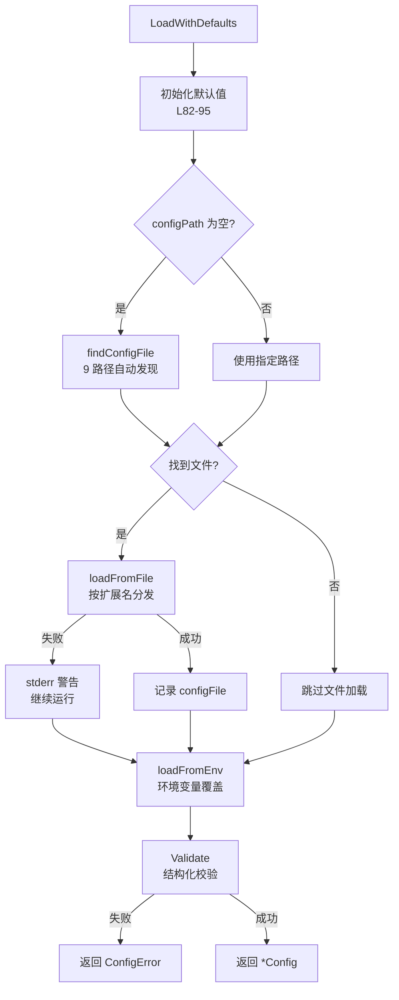
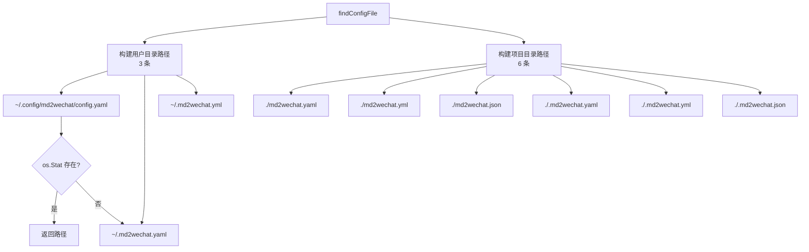
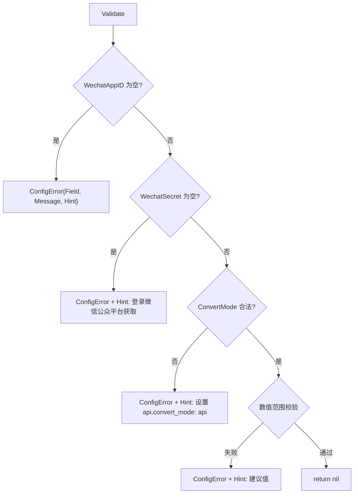

# PD-189.01 md2wechat-skill — 三层配置优先级与多路径自动发现

> 文档编号：PD-189.01
> 来源：md2wechat-skill `internal/config/config.go`
> GitHub：https://github.com/geekjourneyx/md2wechat-skill.git
> 问题域：PD-189 配置管理 Configuration Management
> 状态：可复用方案

---

## 第 1 章 问题与动机

### 1.1 核心问题

CLI 工具的配置管理面临三个核心矛盾：

1. **便捷性 vs 安全性**：用户希望一次配置到处可用（全局配置），但敏感凭证（API Key、Secret）不能泄露到项目仓库中
2. **灵活性 vs 一致性**：不同项目可能需要不同配置（主题、转换模式），但基础凭证应该全局共享
3. **零配置启动 vs 完整功能**：新用户希望快速上手，但完整功能需要多个外部服务的凭证

md2wechat-skill 作为一个 Markdown 转微信公众号的 CLI 工具，需要管理微信 AppID/Secret、多个图片生成 API Key、转换模式等十余项配置，且需要同时支持 Claude Code Skill 模式（环境变量注入）和独立 CLI 模式（配置文件）。

### 1.2 md2wechat-skill 的解法概述

1. **三层优先级覆盖**：环境变量 > 配置文件 > 硬编码默认值，在 `LoadWithDefaults()` 中按序加载（`internal/config/config.go:81-128`）
2. **多路径自动发现**：9 条候选路径，用户目录优先于项目目录，支持 YAML/JSON 双格式（`internal/config/config.go:132-166`）
3. **结构化错误 + 操作提示**：自定义 `ConfigError` 类型，每个错误附带 `Hint` 字段指导用户修复（`internal/config/config.go:500-512`）
4. **按功能分级验证**：基础验证 `Validate()` + 功能级验证 `ValidateForImageGeneration()` / `ValidateForAPIConversion()`，不阻塞无关功能（`internal/config/config.go:353-418`）
5. **敏感字段掩码显示**：`maskIf()` 函数保留首尾各 2 字符，中间用 `***` 替代（`internal/config/config.go:546-554`）

### 1.3 设计思想

| 设计原则 | 具体实现 | 理由 | 替代方案 |
|----------|----------|------|----------|
| 渐进式覆盖 | env > file > default 三层，非空才覆盖 | 环境变量适合 CI/CD 和 Skill 注入，配置文件适合本地开发 | Viper 自动绑定（更重但功能更全） |
| 全局优先 | 用户目录配置优先于项目目录 | CLI 工具的凭证通常全局通用，避免每个项目重复配置 | 项目优先（适合多租户场景） |
| 宽容加载 | 配置文件加载失败只警告不报错 | 允许纯环境变量模式运行，降低入门门槛 | 严格模式（配置文件必须存在） |
| 按需验证 | 基础验证 + 功能级验证分离 | 图片生成 API Key 只在使用图片功能时才要求 | 全量验证（启动即检查所有字段） |
| 双格式映射 | configFile 中间结构体做 YAML/JSON → Config 映射 | 配置文件用嵌套结构（wechat.appid），运行时用扁平结构 | 直接反序列化到 Config（字段名不灵活） |

---

## 第 2 章 源码实现分析

### 2.1 架构概览

md2wechat-skill 的配置系统由三个层次组成：

```
┌─────────────────────────────────────────────────────────┐
│                    CLI 命令层                             │
│  cmd/md2wechat/config.go — config show/validate/init    │
│  cmd/md2wechat/main.go   — initConfig() 延迟加载        │
├─────────────────────────────────────────────────────────┤
│                    配置核心层                             │
│  internal/config/config.go                               │
│  ┌──────────┐  ┌──────────┐  ┌──────────┐              │
│  │ 默认值    │→│ 配置文件  │→│ 环境变量  │  (优先级递增) │
│  │ L82-95   │  │ L98-111  │  │ L114     │              │
│  └──────────┘  └──────────┘  └──────────┘              │
│       ↓              ↓              ↓                    │
│  ┌──────────────────────────────────────┐               │
│  │         Config 结构体 (L15-44)       │               │
│  │  Validate() → ConfigError{Hint}     │               │
│  │  ToMap(mask) → 掩码显示              │               │
│  └──────────────────────────────────────┘               │
├─────────────────────────────────────────────────────────┤
│                    消费层                                 │
│  image/processor.go  — NewProcessor(cfg, log)           │
│  image/provider.go   — NewProvider(cfg) 按 provider 分发│
│  wechat/service.go   — NewService(cfg, log)             │
│  converter/converter.go — NewConverter(cfg, log)        │
└─────────────────────────────────────────────────────────┘
```

### 2.2 核心实现

#### 2.2.1 三层加载主流程



对应源码 `internal/config/config.go:76-128`：

```go
func LoadWithDefaults(configPath string) (*Config, error) {
	cfg := &Config{
		DefaultConvertMode:    "api",
		DefaultTheme:          "default",
		DefaultBackgroundType: "default",
		MD2WechatBaseURL:     "https://www.md2wechat.cn",
		CompressImages:       true,
		MaxImageWidth:        1920,
		MaxImageSize:         5 * 1024 * 1024, // 5MB
		HTTPTimeout:          30,
		ImageProvider:        "openai",
		ImageAPIBase:         "https://api.openai.com/v1",
		ImageModel:           "dall-e-3",
		ImageSize:            "1024x1024",
	}

	// 1. 尝试从配置文件加载
	if configPath == "" {
		configPath = findConfigFile()
	}
	if configPath != "" {
		if err := loadFromFile(cfg, configPath); err != nil {
			fmt.Fprintf(os.Stderr, "⚠️  警告: 配置文件加载失败 (%v)，将使用环境变量或默认值\n", err)
		} else {
			cfg.configFile = configPath
		}
	}

	// 2. 环境变量覆盖配置文件
	loadFromEnv(cfg)

	// 3. 验证必需配置
	if err := cfg.Validate(); err != nil {
		return nil, err
	}

	return cfg, nil
}
```

#### 2.2.2 多路径自动发现



对应源码 `internal/config/config.go:132-166`：

```go
func findConfigFile() string {
	homeDir, _ := os.UserHomeDir()
	userPaths := []string{
		filepath.Join(homeDir, ".config", "md2wechat", "config.yaml"),
		filepath.Join(homeDir, ".md2wechat.yaml"),
		filepath.Join(homeDir, ".md2wechat.yml"),
	}
	cwdPaths := []string{
		"md2wechat.yaml", "md2wechat.yml", "md2wechat.json",
		".md2wechat.yaml", ".md2wechat.yml", ".md2wechat.json",
	}

	for _, path := range userPaths {
		if info, err := os.Stat(path); err == nil && !info.IsDir() {
			return path
		}
	}
	for _, path := range cwdPaths {
		if info, err := os.Stat(path); err == nil && !info.IsDir() {
			return path
		}
	}
	return ""
}
```

#### 2.2.3 结构化错误与操作提示



对应源码 `internal/config/config.go:499-512`：

```go
type ConfigError struct {
	Field   string
	Message string
	Hint    string // 配置提示
}

func (e *ConfigError) Error() string {
	msg := fmt.Sprintf("配置错误 [%s]: %s", e.Field, e.Message)
	if e.Hint != "" {
		msg += fmt.Sprintf("\n💡 提示: %s", e.Hint)
	}
	return msg
}
```

### 2.3 实现细节

**双结构体映射模式**：配置文件使用嵌套的 `configFile` 结构体（`wechat.appid`），运行时使用扁平的 `Config` 结构体（`WechatAppID`）。`loadFromYAML` 和 `loadFromJSON` 负责映射，采用"非空才覆盖"策略保护默认值（`internal/config/config.go:185-240`）。

**延迟加载模式**：`cmd/md2wechat/main.go:21-38` 中 `initConfig()` 使用 `PreRunE` 钩子延迟加载配置，使 `help` 和 `config init` 等命令无需配置即可运行。

**Provider 工厂分发**：`internal/image/provider.go:51-85` 中 `NewProvider()` 根据 `cfg.ImageProvider` 字段做 switch 分发，每个 provider 有独立的 `validateXxxConfig()` 验证函数，错误信息包含该 provider 特有的获取 Key 的 URL。

**配置文件权限**：`SaveConfig()` 使用 `0600` 权限写入（`internal/config/config.go:492`），确保只有文件所有者可读写，保护敏感凭证。

**掩码显示**：`maskIf()` 保留首尾各 2 字符（`ab***cd`），短于 4 字符的直接显示 `***`（`internal/config/config.go:546-554`）。`ToMap(maskSecret bool)` 统一控制所有敏感字段的掩码行为。

---

## 第 3 章 迁移指南

### 3.1 迁移清单

**阶段 1：基础配置加载（1 个文件）**

- [ ] 定义 `Config` 结构体，包含所有配置字段和 struct tag（json/yaml/env）
- [ ] 实现 `LoadWithDefaults()` 三层加载函数
- [ ] 实现 `findConfigFile()` 多路径自动发现
- [ ] 实现 `loadFromFile()` 按扩展名分发 YAML/JSON

**阶段 2：验证与错误（同文件扩展）**

- [ ] 定义 `ConfigError` 结构化错误类型（含 Hint 字段）
- [ ] 实现 `Validate()` 基础验证
- [ ] 实现功能级验证函数（按需）

**阶段 3：CLI 集成**

- [ ] 实现 `config show` 子命令（含掩码显示）
- [ ] 实现 `config init` 子命令（生成示例配置）
- [ ] 实现 `config validate` 子命令

### 3.2 适配代码模板

以下 Go 代码模板可直接复用，只需替换字段名和验证规则：

```go
package config

import (
	"encoding/json"
	"fmt"
	"os"
	"path/filepath"
	"strings"

	"gopkg.in/yaml.v3"
)

// Config 应用配置（替换为你的字段）
type Config struct {
	APIKey     string `json:"api_key" yaml:"api_key"`
	BaseURL    string `json:"base_url" yaml:"base_url"`
	Timeout    int    `json:"timeout" yaml:"timeout"`
	Debug      bool   `json:"debug" yaml:"debug"`
	configFile string // 内部追踪
}

// ConfigError 结构化配置错误
type ConfigError struct {
	Field   string
	Message string
	Hint    string
}

func (e *ConfigError) Error() string {
	msg := fmt.Sprintf("配置错误 [%s]: %s", e.Field, e.Message)
	if e.Hint != "" {
		msg += fmt.Sprintf("\n💡 提示: %s", e.Hint)
	}
	return msg
}

// Load 加载配置（三层优先级）
func Load() (*Config, error) {
	// 1. 默认值
	cfg := &Config{
		BaseURL: "https://api.example.com",
		Timeout: 30,
		Debug:   false,
	}

	// 2. 配置文件（宽容加载）
	if path := findConfigFile("myapp"); path != "" {
		if err := loadFromFile(cfg, path); err != nil {
			fmt.Fprintf(os.Stderr, "⚠️  配置文件加载失败: %v\n", err)
		} else {
			cfg.configFile = path
		}
	}

	// 3. 环境变量覆盖
	if v := os.Getenv("MYAPP_API_KEY"); v != "" {
		cfg.APIKey = v
	}
	if v := os.Getenv("MYAPP_BASE_URL"); v != "" {
		cfg.BaseURL = v
	}

	// 4. 验证
	if cfg.APIKey == "" {
		return nil, &ConfigError{
			Field:   "APIKey",
			Message: "API Key 未配置",
			Hint:    "设置环境变量 MYAPP_API_KEY 或在配置文件中填写 api_key",
		}
	}

	return cfg, nil
}

// findConfigFile 多路径自动发现
func findConfigFile(appName string) string {
	homeDir, _ := os.UserHomeDir()
	candidates := []string{
		filepath.Join(homeDir, ".config", appName, "config.yaml"),
		filepath.Join(homeDir, "."+appName+".yaml"),
		appName + ".yaml",
		"." + appName + ".yaml",
	}
	for _, path := range candidates {
		if info, err := os.Stat(path); err == nil && !info.IsDir() {
			return path
		}
	}
	return ""
}

// loadFromFile 按扩展名分发
func loadFromFile(cfg *Config, path string) error {
	data, err := os.ReadFile(path)
	if err != nil {
		return fmt.Errorf("read: %w", err)
	}
	ext := strings.ToLower(filepath.Ext(path))
	if ext == ".json" {
		return json.Unmarshal(data, cfg)
	}
	return yaml.Unmarshal(data, cfg)
}

// MaskSecret 敏感字段掩码
func MaskSecret(value string) string {
	if value == "" {
		return ""
	}
	if len(value) <= 4 {
		return "***"
	}
	return value[:2] + "***" + value[len(value)-2:]
}
```

### 3.3 适用场景

| 场景 | 适用度 | 说明 |
|------|--------|------|
| CLI 工具配置 | ⭐⭐⭐ | 完美匹配：全局凭证 + 项目级覆盖 |
| Claude Code Skill | ⭐⭐⭐ | 环境变量注入模式天然适配 |
| 微服务配置 | ⭐⭐ | 缺少热更新和配置中心集成 |
| 多租户 SaaS | ⭐ | 需要数据库级配置存储，文件模式不适用 |
| 容器化部署 | ⭐⭐⭐ | 环境变量优先级最高，完美适配 Docker/K8s |

---

## 第 4 章 测试用例

```go
package config_test

import (
	"os"
	"path/filepath"
	"testing"

	"github.com/stretchr/testify/assert"
	"github.com/stretchr/testify/require"
)

// TestLoadWithDefaults_DefaultValues 验证默认值正确设置
func TestLoadWithDefaults_DefaultValues(t *testing.T) {
	// 设置必需的环境变量
	t.Setenv("WECHAT_APPID", "test_appid")
	t.Setenv("WECHAT_SECRET", "test_secret")

	cfg, err := config.Load()
	require.NoError(t, err)

	assert.Equal(t, "api", cfg.DefaultConvertMode)
	assert.Equal(t, "default", cfg.DefaultTheme)
	assert.Equal(t, 1920, cfg.MaxImageWidth)
	assert.Equal(t, int64(5*1024*1024), cfg.MaxImageSize)
	assert.Equal(t, 30, cfg.HTTPTimeout)
	assert.Equal(t, "openai", cfg.ImageProvider)
	assert.True(t, cfg.CompressImages)
}

// TestLoadWithDefaults_EnvOverridesFile 验证环境变量覆盖配置文件
func TestLoadWithDefaults_EnvOverridesFile(t *testing.T) {
	// 创建临时配置文件
	tmpDir := t.TempDir()
	cfgPath := filepath.Join(tmpDir, "config.yaml")
	os.WriteFile(cfgPath, []byte(`
wechat:
  appid: file_appid
  secret: file_secret
api:
  convert_mode: api
`), 0644)

	// 环境变量覆盖
	t.Setenv("WECHAT_APPID", "env_appid")
	t.Setenv("WECHAT_SECRET", "env_secret")
	t.Setenv("CONVERT_MODE", "ai")

	cfg, err := config.LoadWithDefaults(cfgPath)
	require.NoError(t, err)

	// 环境变量优先
	assert.Equal(t, "env_appid", cfg.WechatAppID)
	assert.Equal(t, "env_secret", cfg.WechatSecret)
	assert.Equal(t, "ai", cfg.DefaultConvertMode)
}

// TestValidate_MissingRequired 验证缺少必需字段时的结构化错误
func TestValidate_MissingRequired(t *testing.T) {
	cfg := &config.Config{
		DefaultConvertMode: "api",
		MaxImageWidth:      1920,
		MaxImageSize:       5 * 1024 * 1024,
		HTTPTimeout:        30,
	}

	err := cfg.Validate()
	require.Error(t, err)

	var cfgErr *config.ConfigError
	require.ErrorAs(t, err, &cfgErr)
	assert.Equal(t, "WechatAppID", cfgErr.Field)
	assert.NotEmpty(t, cfgErr.Hint) // 必须有操作提示
}

// TestValidate_InvalidRange 验证数值范围校验
func TestValidate_InvalidRange(t *testing.T) {
	tests := []struct {
		name  string
		setup func(*config.Config)
		field string
	}{
		{"MaxImageWidth too small", func(c *config.Config) { c.MaxImageWidth = 50 }, "MaxImageWidth"},
		{"MaxImageWidth too large", func(c *config.Config) { c.MaxImageWidth = 20000 }, "MaxImageWidth"},
		{"HTTPTimeout too small", func(c *config.Config) { c.HTTPTimeout = 0 }, "HTTPTimeout"},
		{"HTTPTimeout too large", func(c *config.Config) { c.HTTPTimeout = 500 }, "HTTPTimeout"},
	}

	for _, tt := range tests {
		t.Run(tt.name, func(t *testing.T) {
			cfg := validConfig()
			tt.setup(cfg)
			err := cfg.Validate()
			var cfgErr *config.ConfigError
			require.ErrorAs(t, err, &cfgErr)
			assert.Equal(t, tt.field, cfgErr.Field)
		})
	}
}

// TestMaskIf 验证掩码逻辑
func TestMaskIf(t *testing.T) {
	tests := []struct {
		input    string
		mask     bool
		expected string
	}{
		{"", true, ""},
		{"ab", true, "***"},
		{"abcd", true, "***"},
		{"abcdef", true, "ab***ef"},
		{"abcdefghij", true, "ab***ij"},
		{"abcdef", false, "abcdef"}, // mask=false 不掩码
	}

	for _, tt := range tests {
		result := maskIf(tt.input, tt.mask)
		assert.Equal(t, tt.expected, result, "input=%q mask=%v", tt.input, tt.mask)
	}
}

// TestValidateForImageGeneration 验证功能级验证
func TestValidateForImageGeneration(t *testing.T) {
	cfg := validConfig()
	cfg.ImageAPIKey = ""

	err := cfg.ValidateForImageGeneration()
	require.Error(t, err)

	cfg.ImageAPIKey = "sk-test"
	err = cfg.ValidateForImageGeneration()
	require.NoError(t, err)
}

// TestFindConfigFile_Priority 验证路径优先级
func TestFindConfigFile_Priority(t *testing.T) {
	tmpHome := t.TempDir()
	t.Setenv("HOME", tmpHome)

	// 创建用户目录配置
	userCfg := filepath.Join(tmpHome, ".md2wechat.yaml")
	os.WriteFile(userCfg, []byte("wechat:\n  appid: user"), 0644)

	// 创建项目目录配置
	projDir := t.TempDir()
	os.Chdir(projDir)
	projCfg := filepath.Join(projDir, "md2wechat.yaml")
	os.WriteFile(projCfg, []byte("wechat:\n  appid: project"), 0644)

	// 用户目录应优先
	found := findConfigFile()
	assert.Equal(t, userCfg, found)
}

// validConfig 创建一个通过验证的配置
func validConfig() *config.Config {
	return &config.Config{
		WechatAppID:        "test_appid",
		WechatSecret:       "test_secret",
		DefaultConvertMode: "api",
		MaxImageWidth:      1920,
		MaxImageSize:       5 * 1024 * 1024,
		HTTPTimeout:        30,
	}
}
```

---

## 第 5 章 跨域关联

| 关联域 | 关系类型 | 说明 |
|--------|----------|------|
| PD-04 工具系统 | 协同 | `NewProvider(cfg)` 根据 `ImageProvider` 配置字段做工厂分发，配置驱动工具选择 |
| PD-03 容错与重试 | 协同 | 配置文件加载失败时宽容降级（只警告不报错），体现容错设计 |
| PD-11 可观测性 | 协同 | `ToMap(maskSecret)` 提供安全的配置快照用于日志和诊断 |
| PD-07 质量检查 | 依赖 | `Validate()` 和功能级验证是质量门控的前置条件 |

---

## 第 6 章 来源文件索引

| 文件 | 行范围 | 关键实现 |
|------|--------|----------|
| `internal/config/config.go` | L15-44 | Config 结构体定义（15 个配置字段 + struct tag） |
| `internal/config/config.go` | L46-72 | configFile 中间结构体（嵌套 YAML/JSON 格式） |
| `internal/config/config.go` | L76-128 | LoadWithDefaults() 三层加载主流程 |
| `internal/config/config.go` | L130-166 | findConfigFile() 9 路径自动发现 |
| `internal/config/config.go` | L168-182 | loadFromFile() 按扩展名分发 |
| `internal/config/config.go` | L184-240 | loadFromYAML() 非空覆盖映射 |
| `internal/config/config.go` | L300-350 | loadFromEnv() 环境变量加载 |
| `internal/config/config.go` | L353-402 | Validate() 基础验证 + 范围校验 |
| `internal/config/config.go` | L404-418 | ValidateForImageGeneration/APIConversion 功能级验证 |
| `internal/config/config.go` | L426-447 | ToMap() 掩码显示 |
| `internal/config/config.go` | L449-497 | SaveConfig() 配置持久化（0600 权限） |
| `internal/config/config.go` | L499-512 | ConfigError 结构化错误类型 |
| `internal/config/config.go` | L546-554 | maskIf() 敏感字段掩码 |
| `cmd/md2wechat/config.go` | L14-123 | CLI config 子命令（show/validate/init） |
| `cmd/md2wechat/main.go` | L21-38 | initConfig() 延迟加载 |
| `internal/image/provider.go` | L51-85 | NewProvider() 配置驱动的 Provider 工厂 |

---

## 第 7 章 横向对比维度

```json comparison_data
{
  "project": "md2wechat-skill",
  "dimensions": {
    "加载策略": "三层覆盖：硬编码默认值 → YAML/JSON 配置文件 → 环境变量",
    "文件发现": "9 路径自动发现，用户目录优先于项目目录",
    "格式支持": "YAML + JSON 双格式，按扩展名自动分发",
    "验证机制": "基础验证 + 功能级按需验证，ConfigError 含 Hint 操作提示",
    "敏感保护": "maskIf 首尾保留 + SaveConfig 0600 权限",
    "CLI 集成": "config show/validate/init 三子命令，延迟加载不阻塞 help"
  }
}
```

### 域元数据补充

```json domain_metadata
{
  "solution_summary": "md2wechat-skill 用 Go 实现三层配置覆盖（默认值→YAML/JSON→环境变量）+ 9 路径自动发现 + ConfigError{Hint} 结构化错误 + 功能级按需验证",
  "description": "CLI 工具的配置文件自动发现与按需功能验证",
  "sub_problems": [
    "配置文件多路径自动发现与优先级",
    "功能级按需验证（不阻塞无关功能）",
    "配置文件嵌套结构到运行时扁平结构的映射"
  ],
  "best_practices": [
    "配置文件加载失败只警告不报错，允许纯环境变量模式",
    "SaveConfig 使用 0600 权限保护敏感凭证",
    "延迟加载配置，help 等命令无需配置即可运行"
  ]
}
```
