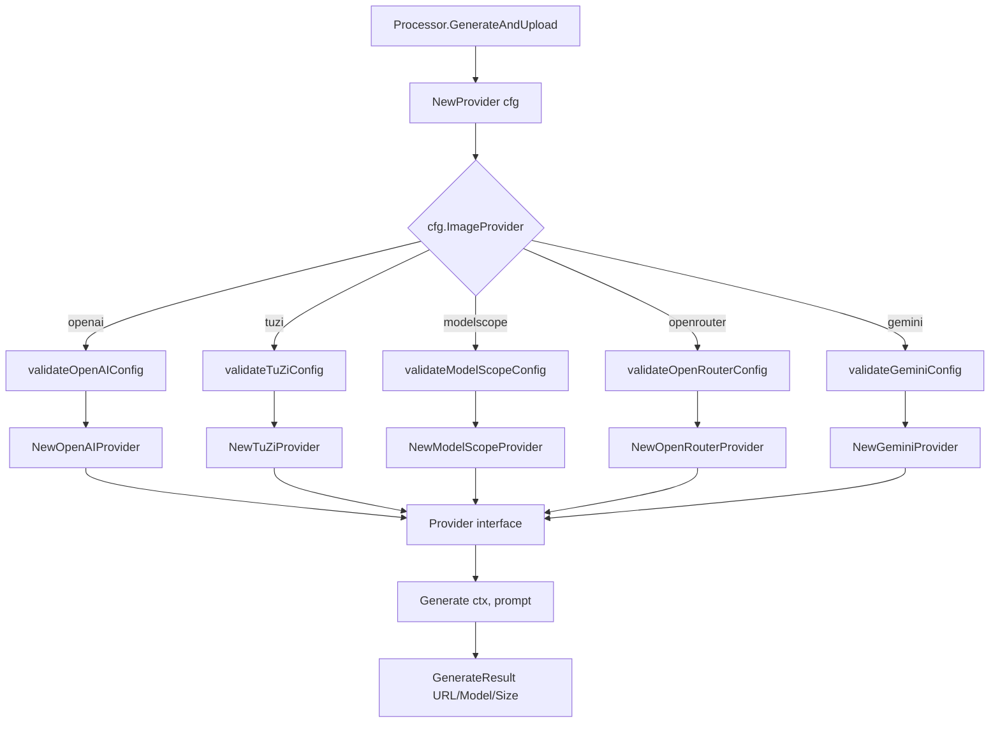
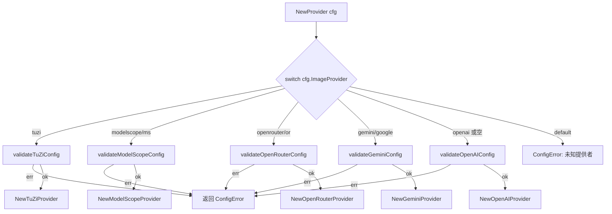

# PD-190.01 md2wechat-skill — Provider 接口与工厂模式多供应商适配

> 文档编号：PD-190.01
> 来源：md2wechat-skill `internal/image/provider.go`
> GitHub：https://github.com/geekjourneyx/md2wechat-skill.git
> 问题域：PD-190 多供应商适配 Multi-Provider Adapter
> 状态：可复用方案

---

## 第 1 章 问题与动机

### 1.1 核心问题

AI 图片生成服务市场高度碎片化：OpenAI DALL-E、Google Gemini、ModelScope（通义万相）、TuZi（兔子）、OpenRouter 等供应商各有不同的 API 协议、认证方式、请求/响应格式和错误码体系。一个需要图片生成能力的应用如果直接耦合某个供应商的 SDK，将面临：

1. **供应商锁定** — 切换供应商需要大量代码改动
2. **协议差异** — OpenAI 用 REST 同步返回 URL，Gemini 用官方 SDK 返回内联二进制，ModelScope 用异步轮询，OpenRouter 用 Chat Completions 格式返回 base64
3. **错误处理碎片化** — 每个供应商的错误码、HTTP 状态码含义不同，401/403/429 的语义各异
4. **配置膨胀** — 不同供应商需要不同的配置字段（有的需要 base URL，有的有默认值，有的需要特殊请求头）

### 1.2 md2wechat-skill 的解法概述

md2wechat-skill 通过经典的 **Provider 接口 + 工厂函数** 模式解决了这个问题：

1. **统一接口** — `Provider` 接口仅定义 `Name()` 和 `Generate(ctx, prompt)` 两个方法，所有供应商必须实现（`internal/image/provider.go:11-19`）
2. **统一结果类型** — `GenerateResult` 结构体抹平了 URL/base64/内联二进制的差异，所有供应商都返回相同的结果（`internal/image/provider.go:22-27`）
3. **统一错误类型** — `GenerateError` 携带 Provider 名称、错误码、用户友好消息和修复提示，每个供应商的 `handleError` 方法将供应商特定错误映射到统一错误码（`internal/image/provider.go:30-44`）
4. **工厂函数** — `NewProvider(cfg)` 根据 `cfg.ImageProvider` 字符串 switch 分发，先验证配置再创建实例（`internal/image/provider.go:51-85`）
5. **配置驱动** — 三层配置优先级：环境变量 > 配置文件 > 默认值，通过 `config.Config` 统一传递（`internal/config/config.go:76-128`）

### 1.3 设计思想

| 设计原则 | 具体实现 | 理由 | 替代方案 |
|----------|----------|------|----------|
| 开闭原则 | Provider 接口 + 独立文件 | 新增供应商只需新增文件 + switch case | 大 if-else 或 map 注册 |
| 验证前置 | 工厂函数先 validate 再 new | 快速失败，避免运行时空指针 | 延迟到 Generate 时验证 |
| 错误人性化 | GenerateError 含 Hint 字段 | CLI 工具面向终端用户，需要可操作的提示 | 只返回原始错误 |
| 协议归一 | 各 Provider 内部处理 base64/URL/binary 差异 | 上层 Processor 无需关心传输格式 | 上层按类型分支处理 |
| 配置收敛 | 所有供应商共用 Config 结构体 | 避免每个供应商独立配置体系 | 每个供应商独立配置 struct |

---

## 第 2 章 源码实现分析

### 2.1 架构概览

md2wechat-skill 的图片生成子系统采用三层架构：

```
┌─────────────────────────────────────────────────────────┐
│                    Processor 层                          │
│  (internal/image/processor.go)                          │
│  GenerateAndUpload() → provider.Generate() → Upload     │
├─────────────────────────────────────────────────────────┤
│                    Provider 接口层                        │
│  (internal/image/provider.go)                           │
│  Provider interface { Name(); Generate() }              │
│  NewProvider(cfg) → switch → 具体 Provider               │
├──────┬──────┬──────────┬───────────┬────────────────────┤
│OpenAI│ TuZi │ModelScope│OpenRouter │      Gemini        │
│ REST │ REST │ 异步轮询  │Chat Compl.│   官方 SDK          │
│ URL  │ URL  │  URL     │  base64   │  内联 binary        │
└──────┴──────┴──────────┴───────────┴────────────────────┘
```

五个供应商的协议差异：

| 供应商 | API 风格 | 返回格式 | 特殊机制 |
|--------|----------|----------|----------|
| OpenAI | REST `/images/generations` | JSON URL | 同步，RevisedPrompt |
| TuZi | OpenAI 兼容 REST | JSON URL | 特殊请求头 HTTP-Referer |
| ModelScope | REST + 异步轮询 | task_id → poll → URL | `X-ModelScope-Async-Mode` 头 |
| OpenRouter | Chat Completions | base64 data URL | `modalities: ["image"]` + image_config |
| Gemini | 官方 Go SDK | InlineData binary | 多模态响应，需遍历 Parts |

### 2.2 核心实现

#### Provider 接口与统一类型



对应源码 `internal/image/provider.go:10-48`：

```go
// Provider 图片生成服务提供者接口
type Provider interface {
	Name() string
	Generate(ctx context.Context, prompt string) (*GenerateResult, error)
}

// GenerateResult 图片生成结果
type GenerateResult struct {
	URL           string // 生成的图片 URL（或本地临时文件路径）
	RevisedPrompt string // 优化后的提示词（某些提供者会返回）
	Model         string // 实际使用的模型
	Size          string // 实际尺寸
}

// GenerateError 图片生成错误
type GenerateError struct {
	Provider string // 提供者名称
	Code     string // 错误码
	Message  string // 用户友好的错误信息
	Hint     string // 解决提示
	Original error  // 原始错误
}

func (e *GenerateError) Error() string {
	msg := fmt.Sprintf("[%s] %s", e.Provider, e.Message)
	if e.Hint != "" {
		msg += fmt.Sprintf("\n提示: %s", e.Hint)
	}
	return msg
}

func (e *GenerateError) Unwrap() error {
	return e.Original
}
```

#### 工厂函数与验证前置



对应源码 `internal/image/provider.go:51-85`：

```go
func NewProvider(cfg *config.Config) (Provider, error) {
	switch cfg.ImageProvider {
	case "tuzi":
		if err := validateTuZiConfig(cfg); err != nil {
			return nil, err
		}
		return NewTuZiProvider(cfg)
	case "modelscope", "ms":
		if err := validateModelScopeConfig(cfg); err != nil {
			return nil, err
		}
		return NewModelScopeProvider(cfg)
	case "openrouter", "or":
		if err := validateOpenRouterConfig(cfg); err != nil {
			return nil, err
		}
		return NewOpenRouterProvider(cfg)
	case "gemini", "google":
		if err := validateGeminiConfig(cfg); err != nil {
			return nil, err
		}
		return NewGeminiProvider(cfg)
	case "openai", "":
		if err := validateOpenAIConfig(cfg); err != nil {
			return nil, err
		}
		return NewOpenAIProvider(cfg)
	default:
		return nil, &config.ConfigError{
			Field:   "ImageProvider",
			Message: fmt.Sprintf("未知的图片服务提供者: %s", cfg.ImageProvider),
			Hint:    "支持的提供者: openai, tuzi, modelscope (或 ms), openrouter (或 or), gemini (或 google)",
		}
	}
}
```

### 2.3 实现细节

#### 协议归一化：三种返回格式的统一

不同供应商返回图片的方式完全不同，但 `GenerateResult.URL` 字段统一承载了结果：

| 供应商 | 原始返回 | 归一化处理 | URL 字段实际值 |
|--------|----------|-----------|---------------|
| OpenAI | JSON `data[0].url` | 直接使用 | HTTPS URL |
| TuZi | JSON `data[0].url`（OpenAI 兼容） | 直接使用 | HTTPS URL |
| ModelScope | 异步 task_id → 轮询 → `output_images[0]` | 轮询等待 | HTTPS URL |
| OpenRouter | base64 data URL in `choices[0].message.images` | 解码保存临时文件 | 本地文件路径 |
| Gemini | `resp.Candidates[0].Content.Parts[].InlineData` | 二进制保存临时文件 | 本地文件路径 |

上层 `Processor.GenerateAndUpload`（`internal/image/processor.go:141-197`）统一调用 `wechat.DownloadFile(result.URL)` 处理两种情况 — 如果是 URL 则下载，如果是本地路径则直接读取。

#### ModelScope 异步轮询模式

ModelScope 是唯一使用异步 API 的供应商，其 `Generate` 方法内部封装了完整的轮询逻辑（`internal/image/modelscope.go:65-84`）：

1. `createTask()` — 发送带 `X-ModelScope-Async-Mode: true` 头的请求，获取 `task_id`
2. `pollTaskStatus()` — 每 5 秒轮询一次，最长 120 秒，支持 context 取消
3. 状态机：PENDING/RUNNING → SUCCEED（返回 URL）或 FAILED（返回错误）

#### 供应商特定错误映射

每个供应商都有独立的 `handleError`/`handleErrorResponse` 方法，将 HTTP 状态码和供应商特定错误映射到统一的 `GenerateError`。以 Gemini 为例（`internal/image/gemini.go:177-238`），它通过字符串匹配将 `PERMISSION_DENIED`、`RESOURCE_EXHAUSTED`、`SAFETY` 等 Google API 错误映射到 `unauthorized`、`rate_limit`、`safety_blocked` 等统一错误码。

#### 供应商别名支持

工厂函数支持供应商别名（`internal/image/provider.go:58-73`）：
- `modelscope` 或 `ms`
- `openrouter` 或 `or`
- `gemini` 或 `google`
- `openai` 或空字符串（默认）

这降低了用户配置时的记忆负担。

---

## 第 3 章 迁移指南

### 3.1 迁移清单

**阶段 1：定义接口与错误类型**

- [ ] 定义 `Provider` 接口（`Name()` + 核心业务方法）
- [ ] 定义统一结果类型 `Result`（抹平各供应商返回格式差异）
- [ ] 定义统一错误类型 `ProviderError`（含 Provider 名称、错误码、用户提示、原始错误）
- [ ] 实现 `error` 和 `Unwrap()` 接口以支持 `errors.Is/As`

**阶段 2：实现各供应商**

- [ ] 每个供应商一个独立文件（如 `openai.go`、`gemini.go`）
- [ ] 每个供应商实现 `Provider` 接口
- [ ] 每个供应商实现独立的 `handleError` 方法，将供应商特定错误映射到统一错误码
- [ ] 每个供应商实现独立的 `validate` 函数，检查必需配置字段

**阶段 3：工厂函数与配置**

- [ ] 实现 `NewProvider(cfg)` 工厂函数，switch 分发
- [ ] 工厂函数中先 validate 再 new（验证前置）
- [ ] 支持供应商别名（降低用户配置负担）
- [ ] 未知供应商返回带 Hint 的错误（列出所有支持的供应商）

**阶段 4：上层消费**

- [ ] 上层 Processor 只依赖 `Provider` 接口，不依赖具体实现
- [ ] Processor 在初始化时创建 Provider，Generate 时直接调用

### 3.2 适配代码模板

以下是一个可直接复用的 Go 多供应商适配模板：

```go
package provider

import (
	"context"
	"fmt"
)

// Provider 服务提供者接口
type Provider interface {
	Name() string
	Execute(ctx context.Context, input string) (*Result, error)
}

// Result 统一结果
type Result struct {
	Output string
	Model  string
	Meta   map[string]string
}

// ProviderError 统一错误
type ProviderError struct {
	Provider string
	Code     string
	Message  string
	Hint     string
	Original error
}

func (e *ProviderError) Error() string {
	msg := fmt.Sprintf("[%s] %s", e.Provider, e.Message)
	if e.Hint != "" {
		msg += fmt.Sprintf("\n提示: %s", e.Hint)
	}
	return msg
}

func (e *ProviderError) Unwrap() error { return e.Original }

// Config 供应商配置
type Config struct {
	Provider string
	APIKey   string
	BaseURL  string
	Model    string
}

// NewProvider 工厂函数：验证前置 + switch 分发
func NewProvider(cfg *Config) (Provider, error) {
	switch cfg.Provider {
	case "vendor-a", "a":
		if cfg.APIKey == "" {
			return nil, &ProviderError{
				Provider: "VendorA", Code: "config",
				Message: "API Key 未配置",
				Hint:    "设置环境变量 VENDOR_A_API_KEY",
			}
		}
		return NewVendorAProvider(cfg)
	case "vendor-b", "b":
		if cfg.APIKey == "" {
			return nil, &ProviderError{
				Provider: "VendorB", Code: "config",
				Message: "API Key 未配置",
				Hint:    "设置环境变量 VENDOR_B_API_KEY",
			}
		}
		return NewVendorBProvider(cfg)
	default:
		return nil, &ProviderError{
			Provider: "factory", Code: "unknown_provider",
			Message: fmt.Sprintf("未知供应商: %s", cfg.Provider),
			Hint:    "支持: vendor-a (或 a), vendor-b (或 b)",
		}
	}
}
```

### 3.3 适用场景

| 场景 | 适用度 | 说明 |
|------|--------|------|
| AI 图片/文本生成多后端 | ⭐⭐⭐ | 完美匹配，直接复用 |
| 支付网关多渠道 | ⭐⭐⭐ | 支付宝/微信/Stripe 等统一接口 |
| 云存储多供应商 | ⭐⭐⭐ | S3/OSS/COS 等统一上传下载 |
| 消息推送多渠道 | ⭐⭐ | 邮件/短信/推送，但可能需要不同方法签名 |
| 数据库多驱动 | ⭐ | Go 标准库 database/sql 已有更成熟的 driver 模式 |

---

## 第 4 章 测试用例

```go
package image_test

import (
	"context"
	"errors"
	"testing"

	"github.com/stretchr/testify/assert"
	"github.com/stretchr/testify/require"
)

// --- 模拟类型（基于 provider.go 真实签名） ---

type Provider interface {
	Name() string
	Generate(ctx context.Context, prompt string) (*GenerateResult, error)
}

type GenerateResult struct {
	URL           string
	RevisedPrompt string
	Model         string
	Size          string
}

type GenerateError struct {
	Provider string
	Code     string
	Message  string
	Hint     string
	Original error
}

func (e *GenerateError) Error() string { return "[" + e.Provider + "] " + e.Message }
func (e *GenerateError) Unwrap() error { return e.Original }

// --- 测试工厂函数行为 ---

func TestNewProvider_UnknownProvider(t *testing.T) {
	// 模拟 NewProvider 对未知供应商的处理
	provider := "unknown-vendor"
	supportedProviders := map[string]bool{
		"openai": true, "tuzi": true, "modelscope": true,
		"openrouter": true, "gemini": true,
	}

	_, ok := supportedProviders[provider]
	assert.False(t, ok, "未知供应商不应在支持列表中")
}

func TestNewProvider_AliasSupport(t *testing.T) {
	aliases := map[string]string{
		"ms":     "modelscope",
		"or":     "openrouter",
		"google": "gemini",
		"":       "openai", // 空字符串默认 openai
	}

	for alias, canonical := range aliases {
		t.Run(alias+"->"+canonical, func(t *testing.T) {
			assert.NotEmpty(t, canonical)
			// 验证别名映射逻辑正确
		})
	}
}

func TestGenerateError_Format(t *testing.T) {
	err := &GenerateError{
		Provider: "OpenAI",
		Code:     "unauthorized",
		Message:  "API Key 无效",
		Hint:     "请检查 IMAGE_API_KEY",
		Original: errors.New("status 401"),
	}

	assert.Contains(t, err.Error(), "[OpenAI]")
	assert.Contains(t, err.Error(), "API Key 无效")

	// 测试 Unwrap
	var unwrapped error = err
	require.ErrorIs(t, unwrapped, err)
	assert.NotNil(t, errors.Unwrap(err))
}

func TestGenerateError_UnwrapChain(t *testing.T) {
	original := errors.New("network timeout")
	err := &GenerateError{
		Provider: "Gemini",
		Code:     "network_error",
		Message:  "网络请求失败",
		Original: original,
	}

	assert.Equal(t, original, errors.Unwrap(err))
}

func TestValidateConfig_MissingAPIKey(t *testing.T) {
	// 模拟各供应商的验证逻辑
	providers := []struct {
		name     string
		needsKey bool
		needsURL bool
	}{
		{"openai", true, true},
		{"tuzi", true, true},
		{"modelscope", true, false},  // ModelScope 有默认 base URL
		{"openrouter", true, false},  // OpenRouter 有默认 base URL
		{"gemini", true, false},      // Gemini 用 SDK，不需要 base URL
	}

	for _, p := range providers {
		t.Run(p.name, func(t *testing.T) {
			assert.True(t, p.needsKey, "所有供应商都需要 API Key")
		})
	}
}

func TestModelScopeAsyncFlow(t *testing.T) {
	// 测试 ModelScope 异步轮询状态机
	states := []string{"PENDING", "RUNNING", "SUCCEED"}
	finalState := states[len(states)-1]
	assert.Equal(t, "SUCCEED", finalState)

	// 测试超时场景
	failStates := []string{"PENDING", "RUNNING", "FAILED"}
	assert.Equal(t, "FAILED", failStates[len(failStates)-1])
}

func TestGeminiSizeMapping(t *testing.T) {
	// 基于 gemini.go:242-306 的 mapSizeToGeminiAspectRatio
	tests := []struct {
		input    string
		expected string
	}{
		{"", "1:1"},
		{"1:1", "1:1"},
		{"16:9", "16:9"},
		{"1024x1024", "1:1"},
		{"1376x768", "16:9"},
		{"768x1376", "9:16"},
		{"unknown", "1:1"}, // 默认回退
	}

	validRatios := map[string]bool{
		"1:1": true, "16:9": true, "9:16": true,
		"4:3": true, "3:4": true, "3:2": true, "2:3": true,
		"4:5": true, "5:4": true, "21:9": true,
	}

	sizeMap := map[string]string{
		"1024x1024": "1:1", "1376x768": "16:9", "768x1376": "9:16",
	}

	for _, tt := range tests {
		t.Run(tt.input, func(t *testing.T) {
			var result string
			if tt.input == "" {
				result = "1:1"
			} else if validRatios[tt.input] {
				result = tt.input
			} else if r, ok := sizeMap[tt.input]; ok {
				result = r
			} else {
				result = "1:1"
			}
			assert.Equal(t, tt.expected, result)
		})
	}
}
```

---

## 第 5 章 跨域关联

| 关联域 | 关系类型 | 说明 |
|--------|----------|------|
| PD-03 容错与重试 | 协同 | 每个 Provider 的 `handleError` 方法将供应商错误映射为统一错误码，上层可据此决定是否重试（如 rate_limit 可重试，unauthorized 不可重试） |
| PD-04 工具系统 | 协同 | Provider 接口本质上是一种工具抽象，可作为 Agent 工具系统中"图片生成工具"的后端实现 |
| PD-11 可观测性 | 依赖 | Processor 层使用 zap.Logger 记录每次 Generate 的 provider/model/size，但 Provider 层本身不含追踪，需上层注入 |
| PD-01 上下文管理 | 协同 | Provider.Generate 接受 context.Context，支持超时控制和取消传播，ModelScope 的轮询循环依赖 ctx.Done() |

---

## 第 6 章 来源文件索引

| 文件 | 行范围 | 关键实现 |
|------|--------|----------|
| `internal/image/provider.go` | L10-L19 | Provider 接口定义（Name + Generate） |
| `internal/image/provider.go` | L22-L48 | GenerateResult 和 GenerateError 统一类型 |
| `internal/image/provider.go` | L51-L85 | NewProvider 工厂函数（switch 分发 + 验证前置） |
| `internal/image/provider.go` | L87-L161 | 五个供应商的 validate 函数 |
| `internal/image/openai.go` | L15-L196 | OpenAI Provider 完整实现（REST 同步） |
| `internal/image/tuzi.go` | L15-L227 | TuZi Provider（OpenAI 兼容 + 特殊请求头） |
| `internal/image/modelscope.go` | L17-L371 | ModelScope Provider（异步轮询模式） |
| `internal/image/openrouter.go` | L19-L413 | OpenRouter Provider（Chat Completions + base64 解码） |
| `internal/image/gemini.go` | L17-L339 | Gemini Provider（官方 SDK + InlineData 二进制） |
| `internal/image/processor.go` | L13-L40 | Processor 层：持有 Provider 接口，统一调用 |
| `internal/image/processor.go` | L141-L197 | GenerateAndUpload：Generate → Download → Upload 流水线 |
| `internal/config/config.go` | L28-L33 | 图片生成相关配置字段定义 |
| `internal/config/config.go` | L76-L128 | 三层配置加载：默认值 → 配置文件 → 环境变量 |

---

## 第 7 章 横向对比维度

```json comparison_data
{
  "project": "md2wechat-skill",
  "dimensions": {
    "接口设计": "Go interface 双方法（Name+Generate），context 传播超时",
    "工厂模式": "switch-case 工厂函数，验证前置，支持供应商别名",
    "错误处理": "GenerateError 统一类型含 Provider/Code/Hint，每供应商独立 handleError 映射",
    "协议归一": "URL/base64/binary 三种返回格式归一为 GenerateResult.URL 字段",
    "异步支持": "ModelScope 供应商内置 ticker 轮询 + context 取消，120s 超时",
    "配置体系": "三层优先级（环境变量>配置文件>默认值），YAML/JSON 双格式"
  }
}
```

### 域元数据补充

```json domain_metadata
{
  "solution_summary": "md2wechat-skill 用 Go Provider 接口 + switch 工厂函数适配 OpenAI/TuZi/ModelScope/OpenRouter/Gemini 五种图片生成后端，统一 URL/base64/binary 三种返回格式为 GenerateResult，每供应商独立 handleError 映射到 GenerateError 统一错误码",
  "description": "多供应商适配需处理同步/异步/SDK 三种 API 交互模式的归一化",
  "sub_problems": [
    "异步轮询供应商的状态机封装与超时控制",
    "base64/binary/URL 三种返回格式的透明归一化",
    "供应商别名与默认值降低用户配置负担"
  ],
  "best_practices": [
    "验证前置：工厂函数先 validate 配置再创建实例，快速失败",
    "错误人性化：GenerateError 含 Hint 字段提供可操作的修复建议",
    "三层配置优先级（环境变量>文件>默认值）统一所有供应商配置"
  ]
}
```
