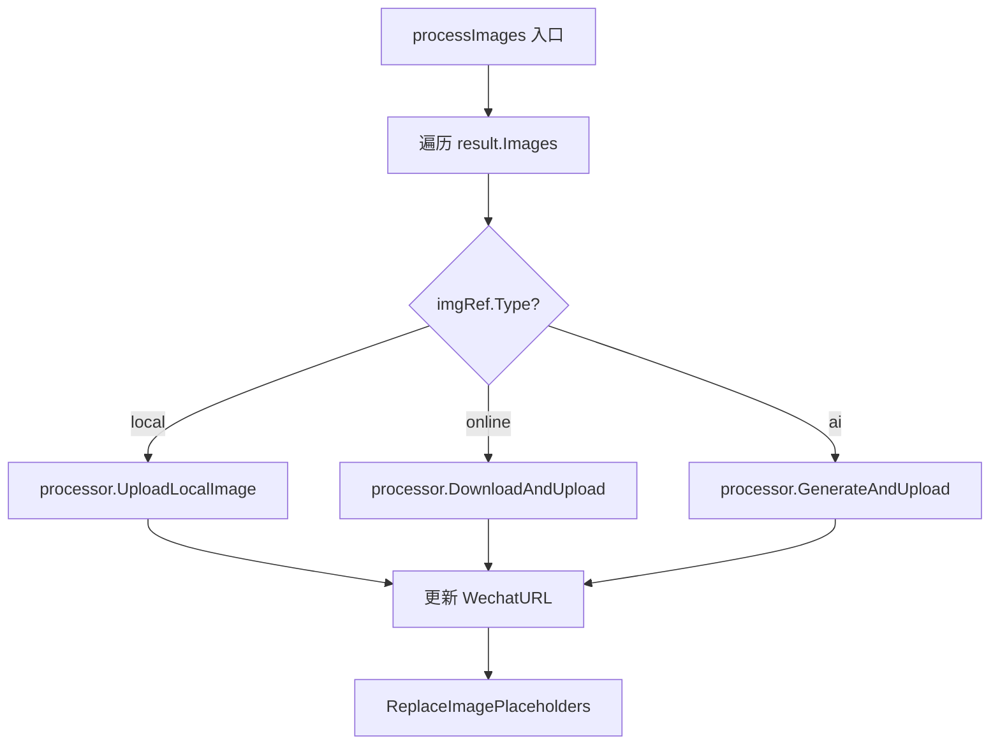
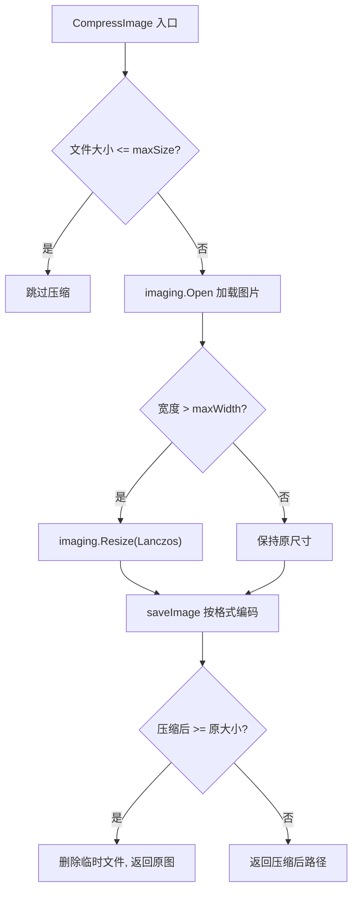

# PD-191.01 md2wechat-skill — 三来源图片处理管线与占位符异步替换

> 文档编号：PD-191.01
> 来源：md2wechat-skill `internal/image/processor.go` `internal/image/compress.go` `internal/converter/image.go`
> GitHub：https://github.com/geekjourneyx/md2wechat-skill.git
> 问题域：PD-191 图片处理管线 Image Processing Pipeline
> 状态：可复用方案

---

## 第 1 章 问题与动机

### 1.1 核心问题

Markdown 文章发布到微信公众号时，图片处理是最复杂的环节。核心挑战：

1. **来源多样性**：文章中的图片可能来自本地文件、在线 URL、或需要 AI 实时生成，三种来源的处理流程完全不同
2. **平台限制**：微信公众号要求所有图片必须上传到微信素材库，不支持外链图片，且对图片大小有严格限制
3. **转换时序**：Markdown → HTML 转换和图片上传是两个独立流程，需要一种机制在 HTML 生成后再替换图片 URL
4. **压缩质量平衡**：图片需要压缩以满足平台限制，但不能牺牲太多视觉质量

这些问题在任何"内容 → 平台发布"的管线中都会遇到，不仅限于微信。

### 1.2 md2wechat-skill 的解法概述

md2wechat-skill 用 Go 实现了一条完整的图片处理管线，核心设计：

1. **三来源统一抽象**：通过 `ImageType` 枚举（local/online/ai）和 `ImageRef` 结构体统一描述所有图片来源，`processImages` 函数用 switch-case 路由到不同处理方法（`cmd/md2wechat/convert.go:201-217`）
2. **占位符异步替换**：HTML 转换阶段用 `<!-- IMG:N -->` 占位符标记图片位置，图片上传完成后再批量替换为 `` 标签（`internal/converter/image.go:60`、`converter.go:199-209`）
3. **智能压缩守卫**：Compressor 组件用 Lanczos 缩放 + JPEG 质量控制双重压缩，且有"压缩后比原图大则跳过"的守卫逻辑（`internal/image/compress.go:131-134`）
4. **多 Provider 工厂**：AI 图片生成支持 5 种 Provider（OpenAI/TuZi/ModelScope/OpenRouter/Gemini），通过工厂模式按配置切换（`internal/image/provider.go:51-85`）
5. **带重试的上传**：微信素材上传封装了 `UploadMaterialWithRetry`，固定 3 次重试 + 1 秒间隔（`internal/wechat/service.go:162-176`）

### 1.3 设计思想

| 设计原则 | 具体实现 | 理由 | 替代方案 |
|----------|----------|------|----------|
| 来源无关的统一抽象 | `ImageRef` 结构体 + `ImageType` 枚举统一描述三种来源 | 上层编排代码只需关心 ImageRef，不需要知道来源细节 | 为每种来源写独立处理链（代码重复） |
| 占位符解耦转换与上传 | `<!-- IMG:N -->` 占位符机制，先转换后替换 | HTML 转换和图片上传是异步的，占位符让两者解耦 | 同步处理（转换时就上传，阻塞转换流程） |
| 压缩守卫防膨胀 | 压缩后文件 >= 原文件则丢弃压缩结果 | PNG 等已压缩格式再压缩可能变大 | 无条件使用压缩结果（可能适得其反） |
| Provider 工厂模式 | `NewProvider(cfg)` 根据配置字符串创建对应实现 | 新增 Provider 只需实现接口 + 注册工厂分支 | 硬编码 if-else 调用各 API |
| 配置驱动压缩参数 | `MaxImageWidth`/`MaxImageSize`/`CompressImages` 三个配置项控制压缩行为 | 不同平台限制不同，配置化适配 | 硬编码压缩参数 |

---

## 第 2 章 源码实现分析

### 2.1 架构概览

md2wechat-skill 的图片处理管线分为 4 层：

```
┌─────────────────────────────────────────────────────────────┐
│                    编排层 (convert.go)                        │
│  processImages(): 遍历 ImageRef → 按 Type 路由 → 更新 URL    │
└──────────────┬──────────────────────────────────┬───────────┘
               │                                  │
┌──────────────▼──────────────┐  ┌────────────────▼───────────┐
│     处理层 (processor.go)    │  │   占位符层 (image.go)       │
│  Processor: 压缩+上传一体化  │  │  ExtractPlaceholders()     │
│  - UploadLocalImage()       │  │  InsertPlaceholders()      │
│  - DownloadAndUpload()      │  │  ReplacePlaceholders()     │
│  - GenerateAndUpload()      │  └────────────────────────────┘
└──────┬──────────┬───────────┘
       │          │
┌──────▼──────┐ ┌─▼──────────────────┐
│  压缩层      │ │  上传层             │
│ compress.go  │ │ wechat/service.go  │
│ Compressor   │ │ UploadMaterial     │
│ Lanczos缩放  │ │ WithRetry(3次)     │
└──────────────┘ └────────────────────┘
       │
┌──────▼──────────────────────┐
│  生成层 (provider.go)        │
│  Provider 接口 → 5 种实现    │
│  OpenAI/TuZi/ModelScope/    │
│  OpenRouter/Gemini          │
└─────────────────────────────┘
```

### 2.2 核心实现

#### 2.2.1 图片来源统一抽象与路由



对应源码 `cmd/md2wechat/convert.go:184-239`：

```go
func processImages(result *converter.ConvertResult) error {
    if len(result.Images) == 0 {
        log.Info("no images to process")
        return nil
    }

    processor := image.NewProcessor(cfg, log)

    for i, imgRef := range result.Images {
        var uploadResult *image.UploadResult
        var err error

        switch imgRef.Type {
        case converter.ImageTypeLocal:
            uploadResult, err = processor.UploadLocalImage(imgRef.Original)
        case converter.ImageTypeOnline:
            uploadResult, err = processor.DownloadAndUpload(imgRef.Original)
        case converter.ImageTypeAI:
            genResult, genErr := processor.GenerateAndUpload(imgRef.AIPrompt)
            if genErr != nil {
                err = genErr
            } else {
                uploadResult = &image.UploadResult{
                    MediaID:   genResult.MediaID,
                    WechatURL: genResult.WechatURL,
                }
            }
        }

        if err != nil {
            log.Warn("image upload failed", zap.Int("index", i), zap.Error(err))
            continue // 单张失败不阻塞整体
        }

        result.Images[i].WechatURL = uploadResult.WechatURL
    }

    // 批量替换占位符
    result.HTML = converter.ReplaceImagePlaceholders(result.HTML, result.Images)
    return nil
}
```

关键设计：单张图片处理失败时 `continue` 跳过，不阻塞其他图片。最终 `ReplaceImagePlaceholders` 只替换有 `WechatURL` 的图片，失败的占位符保留原样。

#### 2.2.2 占位符机制：解耦转换与上传


对应源码 `internal/converter/image.go:44-74`（插入占位符）：

```go
func (p *imageProcessor) InsertPlaceholders(html string, images []ImageRef) string {
    result := html
    imgIndex := 0
    lines := strings.Split(result, "\n")
    var newLines []string

    for _, line := range lines {
        trimmed := strings.TrimSpace(line)
        if p.isImageLine(trimmed) {
            placeholder := fmt.Sprintf("<!-- IMG:%d -->", imgIndex)
            newLines = append(newLines, placeholder)
            if imgIndex < len(images) {
                images[imgIndex].Placeholder = placeholder
            }
            imgIndex++
        } else {
            newLines = append(newLines, line)
        }
    }
    return strings.Join(newLines, "\n")
}
```

对应源码 `internal/converter/converter.go:199-209`（替换占位符）：

```go
func ReplaceImagePlaceholders(html string, images []ImageRef) string {
    result := html
    for _, img := range images {
        if img.WechatURL != "" {
            imgTag := ``
            result = strings.ReplaceAll(result, img.Placeholder, imgTag)
        }
    }
    return result
}
```

#### 2.2.3 智能压缩与守卫逻辑



对应源码 `internal/image/compress.go:40-138`：

```go
func (c *Compressor) CompressImage(filePath string) (string, bool, error) {
    fileInfo, err := os.Stat(filePath)
    if err != nil {
        return "", false, fmt.Errorf("stat file: %w", err)
    }

    // 守卫：文件已在限制内，无需压缩
    if c.enableShrink && fileInfo.Size() <= c.maxSize {
        return "", false, nil
    }

    img, err := imaging.Open(filePath)
    if err != nil {
        return "", false, fmt.Errorf("open image: %w", err)
    }

    originalWidth := img.Bounds().Dx()
    originalHeight := img.Bounds().Dy()

    // Lanczos 缩放（保持宽高比）
    var processedImg image.Image
    if c.enableResize && originalWidth > c.maxWidth {
        newHeight := int(float64(c.maxWidth) * float64(originalHeight) / float64(originalWidth))
        processedImg = imaging.Resize(img, c.maxWidth, newHeight, imaging.Lanczos)
    } else {
        processedImg = img
    }

    // 保存到临时文件
    tempPath := filepath.Join(os.TempDir(), "compressed_"+baseName+ext)
    if err := c.saveImage(processedImg, tempPath, outputFormat); err != nil {
        return "", false, fmt.Errorf("save compressed image: %w", err)
    }

    // 关键守卫：压缩后反而变大，丢弃压缩结果
    newFileInfo, _ := os.Stat(tempPath)
    if newFileInfo.Size() >= fileInfo.Size() {
        os.Remove(tempPath)
        return "", false, nil
    }

    return tempPath, true, nil
}
```

### 2.3 实现细节

**三返回值设计**：`CompressImage` 返回 `(path, compressed, error)`，三元组精确表达三种状态：
- `("", false, nil)` — 无需压缩或压缩无效
- `(path, true, nil)` — 压缩成功
- `("", false, err)` — 压缩出错

**临时文件生命周期**：Processor 层的每个方法都用 `defer os.Remove(tmpPath)` 确保临时文件在上传完成后清理，避免磁盘泄漏。

**Provider 工厂的验证前置**：`NewProvider` 在创建实例前先调用 `validateXxxConfig`，确保配置完整。这比创建后再验证更安全，避免了半初始化对象。

**图片格式保持**：压缩时根据原始扩展名选择输出格式（PNG→PNG, JPEG→JPEG），非标准格式默认转 JPEG。这避免了 PNG→JPEG 的透明通道丢失问题。

**Markdown 图片语法解析**：`ParseImageSyntax`（`internal/converter/image.go:138-183`）用三组正则分别匹配三种来源：
- 本地：`` — 以 `./` 开头
- 在线：`` — 以 `http(s)://` 开头
- AI 生成：`` — 自定义 `__generate:` 协议


---

## 第 3 章 迁移指南

### 3.1 迁移清单

**阶段 1：核心抽象（必须）**

- [ ] 定义 `ImageRef` 结构体和 `ImageType` 枚举，统一描述图片来源
- [ ] 实现占位符插入/提取/替换三个函数
- [ ] 实现 `Compressor` 组件（Lanczos 缩放 + 质量控制 + 守卫逻辑）

**阶段 2：平台适配（按需）**

- [ ] 实现目标平台的上传接口（替换微信素材 API）
- [ ] 配置压缩参数（maxWidth/maxSize/quality）适配目标平台限制
- [ ] 实现带重试的上传封装

**阶段 3：扩展来源（可选）**

- [ ] 实现 `Provider` 接口和工厂函数，支持 AI 图片生成
- [ ] 添加新的图片来源类型（如截图、SVG 渲染等）

### 3.2 适配代码模板

以下是一个可直接复用的 Go 图片处理管线模板，已剥离微信特定逻辑：

```go
package pipeline

import (
    "context"
    "fmt"
    "image"
    "image/jpeg"
    "os"
    "strings"

    "github.com/disintegration/imaging"
)

// ImageType 图片来源类型
type ImageType string

const (
    ImageTypeLocal  ImageType = "local"
    ImageTypeOnline ImageType = "online"
    ImageTypeAI     ImageType = "ai"
)

// ImageRef 图片引用（来源无关）
type ImageRef struct {
    Index       int
    Original    string    // 原始路径/URL/prompt
    Placeholder string    // HTML 占位符
    FinalURL    string    // 上传后的最终 URL
    Type        ImageType
    AIPrompt    string
}

// Compressor 图片压缩器
type Compressor struct {
    MaxWidth int
    MaxSize  int64
    Quality  int // JPEG 质量 1-100
}

// Compress 压缩图片，返回 (压缩后路径, 是否压缩, 错误)
func (c *Compressor) Compress(filePath string) (string, bool, error) {
    info, err := os.Stat(filePath)
    if err != nil {
        return "", false, err
    }

    // 守卫：已在限制内
    if c.MaxSize > 0 && info.Size() <= c.MaxSize {
        return "", false, nil
    }

    img, err := imaging.Open(filePath)
    if err != nil {
        return "", false, err
    }

    // Lanczos 缩放
    var processed image.Image
    if c.MaxWidth > 0 && img.Bounds().Dx() > c.MaxWidth {
        ratio := float64(c.MaxWidth) / float64(img.Bounds().Dx())
        newH := int(float64(img.Bounds().Dy()) * ratio)
        processed = imaging.Resize(img, c.MaxWidth, newH, imaging.Lanczos)
    } else {
        processed = img
    }

    // 保存压缩结果
    tmpPath := filePath + ".compressed.jpg"
    f, _ := os.Create(tmpPath)
    defer f.Close()
    jpeg.Encode(f, processed, &jpeg.Options{Quality: c.Quality})

    // 关键守卫：压缩后更大则丢弃
    newInfo, _ := os.Stat(tmpPath)
    if newInfo.Size() >= info.Size() {
        os.Remove(tmpPath)
        return "", false, nil
    }

    return tmpPath, true, nil
}

// Uploader 平台上传接口（替换为目标平台实现）
type Uploader interface {
    Upload(filePath string) (url string, err error)
}

// ProcessImages 图片处理管线入口
func ProcessImages(refs []ImageRef, comp *Compressor, uploader Uploader) error {
    for i, ref := range refs {
        var localPath string
        var err error

        switch ref.Type {
        case ImageTypeLocal:
            localPath = ref.Original
        case ImageTypeOnline:
            localPath, err = downloadToTemp(ref.Original)
            if err != nil {
                continue
            }
            defer os.Remove(localPath)
        case ImageTypeAI:
            localPath, err = generateAndDownload(context.Background(), ref.AIPrompt)
            if err != nil {
                continue
            }
            defer os.Remove(localPath)
        }

        // 压缩
        if compressed, ok, _ := comp.Compress(localPath); ok {
            defer os.Remove(compressed)
            localPath = compressed
        }

        // 上传
        url, err := uploader.Upload(localPath)
        if err != nil {
            continue // 单张失败不阻塞
        }
        refs[i].FinalURL = url
    }
    return nil
}

// ReplacePlaceholders 替换 HTML 中的占位符
func ReplacePlaceholders(html string, refs []ImageRef) string {
    for _, ref := range refs {
        if ref.FinalURL != "" && ref.Placeholder != "" {
            tag := fmt.Sprintf(``, ref.FinalURL)
            html = strings.ReplaceAll(html, ref.Placeholder, tag)
        }
    }
    return html
}
```

### 3.3 适用场景

| 场景 | 适用度 | 说明 |
|------|--------|------|
| 微信公众号发布 | ⭐⭐⭐ | 原生场景，直接复用 |
| 其他内容平台发布（知乎/掘金等） | ⭐⭐⭐ | 替换 Uploader 实现即可 |
| 静态站点生成（Hugo/Hexo） | ⭐⭐ | 压缩逻辑可复用，占位符机制可简化 |
| 实时聊天中的图片处理 | ⭐ | 延迟敏感，占位符机制不适用 |
| 批量图片压缩工具 | ⭐⭐⭐ | Compressor 组件可独立使用 |

---

## 第 4 章 测试用例

```go
package pipeline_test

import (
    "os"
    "path/filepath"
    "strings"
    "testing"
)

// === Compressor 测试 ===

func TestCompressor_SkipSmallFile(t *testing.T) {
    // 创建一个小于 maxSize 的临时文件
    tmp := createTempImage(t, 100, 100) // 100x100 小图
    defer os.Remove(tmp)

    c := &Compressor{MaxWidth: 1920, MaxSize: 5 * 1024 * 1024, Quality: 85}
    path, compressed, err := c.Compress(tmp)

    if err != nil {
        t.Fatalf("unexpected error: %v", err)
    }
    if compressed {
        t.Error("should not compress small file")
    }
    if path != "" {
        t.Error("path should be empty when not compressed")
    }
}

func TestCompressor_ResizeWideImage(t *testing.T) {
    // 创建一个超宽图片
    tmp := createTempImage(t, 4000, 2000) // 4000px 宽
    defer os.Remove(tmp)

    c := &Compressor{MaxWidth: 1920, MaxSize: 50 * 1024 * 1024, Quality: 85}
    path, compressed, err := c.Compress(tmp)

    if err != nil {
        t.Fatalf("unexpected error: %v", err)
    }
    if !compressed {
        t.Error("should compress wide image")
    }
    if path == "" {
        t.Error("compressed path should not be empty")
    }
    defer os.Remove(path)

    // 验证压缩后文件存在
    if _, err := os.Stat(path); os.IsNotExist(err) {
        t.Error("compressed file should exist")
    }
}

func TestCompressor_GuardAgainstLargerResult(t *testing.T) {
    // 创建一个已经很小的 JPEG（压缩后可能更大）
    tmp := createTinyJPEG(t) // 极小的已压缩 JPEG
    defer os.Remove(tmp)

    c := &Compressor{MaxWidth: 1920, MaxSize: 0, Quality: 85}
    _, compressed, err := c.Compress(tmp)

    if err != nil {
        t.Fatalf("unexpected error: %v", err)
    }
    // 如果压缩后更大，应该返回 false
    if compressed {
        t.Log("guard triggered: compressed result was larger, correctly skipped")
    }
}

// === 占位符测试 ===

func TestReplacePlaceholders_Normal(t *testing.T) {
    html := `<p>Hello</p><!-- IMG:0 --><p>World</p><!-- IMG:1 -->`
    refs := []ImageRef{
        {Index: 0, Placeholder: "<!-- IMG:0 -->", FinalURL: "https://cdn.example.com/a.jpg"},
        {Index: 1, Placeholder: "<!-- IMG:1 -->", FinalURL: "https://cdn.example.com/b.jpg"},
    }

    result := ReplacePlaceholders(html, refs)

    if strings.Contains(result, "<!-- IMG:") {
        t.Error("placeholders should be replaced")
    }
    if !strings.Contains(result, "cdn.example.com/a.jpg") {
        t.Error("first image URL should be present")
    }
    if !strings.Contains(result, "cdn.example.com/b.jpg") {
        t.Error("second image URL should be present")
    }
}

func TestReplacePlaceholders_SkipFailed(t *testing.T) {
    html := `<!-- IMG:0 --><!-- IMG:1 -->`
    refs := []ImageRef{
        {Index: 0, Placeholder: "<!-- IMG:0 -->", FinalURL: "https://cdn.example.com/a.jpg"},
        {Index: 1, Placeholder: "<!-- IMG:1 -->", FinalURL: ""}, // 上传失败
    }

    result := ReplacePlaceholders(html, refs)

    if !strings.Contains(result, "cdn.example.com/a.jpg") {
        t.Error("successful image should be replaced")
    }
    if !strings.Contains(result, "<!-- IMG:1 -->") {
        t.Error("failed image placeholder should remain")
    }
}

// === 图片来源路由测试 ===

func TestParseImageSyntax_ThreeSources(t *testing.T) {
    markdown := `


`
    refs := ParseImageSyntax(markdown)

    if len(refs) != 3 {
        t.Fatalf("expected 3 refs, got %d", len(refs))
    }
    if refs[0].Type != ImageTypeLocal {
        t.Errorf("first should be local, got %s", refs[0].Type)
    }
    if refs[1].Type != ImageTypeOnline {
        t.Errorf("second should be online, got %s", refs[1].Type)
    }
    if refs[2].Type != ImageTypeAI {
        t.Errorf("third should be ai, got %s", refs[2].Type)
    }
    if refs[2].AIPrompt != "a cute cat" {
        t.Errorf("AI prompt should be 'a cute cat', got '%s'", refs[2].AIPrompt)
    }
}

// === 辅助函数 ===

func createTempImage(t *testing.T, width, height int) string {
    t.Helper()
    // 使用 imaging 库创建测试图片
    dir := t.TempDir()
    path := filepath.Join(dir, "test.jpg")
    // ... 创建指定尺寸的测试图片并保存
    return path
}

func createTinyJPEG(t *testing.T) string {
    t.Helper()
    dir := t.TempDir()
    path := filepath.Join(dir, "tiny.jpg")
    // ... 创建极小的已压缩 JPEG
    return path
}
```


---

## 第 5 章 跨域关联

| 关联域 | 关系类型 | 说明 |
|--------|----------|------|
| PD-04 工具系统 | 协同 | Provider 工厂模式与工具注册模式同构，AI 图片生成本质上是一种"工具调用" |
| PD-03 容错与重试 | 依赖 | `UploadMaterialWithRetry` 的重试逻辑是 PD-03 容错模式的具体应用 |
| PD-01 上下文管理 | 协同 | 图片压缩减小文件体积，间接降低了上传/传输的上下文开销 |
| PD-11 可观测性 | 协同 | 全链路使用 zap 结构化日志记录每步耗时、压缩比、上传结果，支持问题排查 |
| PD-192 内容格式转换 | 依赖 | 图片管线是 Markdown→HTML 转换流程的子管线，依赖转换层提供占位符 |

---

## 第 6 章 来源文件索引

| 文件 | 行范围 | 关键实现 |
|------|--------|----------|
| `internal/image/processor.go` | L14-L20 | Processor 结构体定义（聚合 compressor + provider + wechat service） |
| `internal/image/processor.go` | L51-L87 | UploadLocalImage：格式校验→压缩→上传 |
| `internal/image/processor.go` | L90-L128 | DownloadAndUpload：下载→校验→压缩→上传 |
| `internal/image/processor.go` | L141-L197 | GenerateAndUpload：AI 生成→下载→压缩→上传 |
| `internal/image/compress.go` | L17-L24 | Compressor 结构体（maxWidth/maxSize/quality/enableResize/enableShrink） |
| `internal/image/compress.go` | L40-L138 | CompressImage：Lanczos 缩放 + JPEG 质量控制 + 守卫逻辑 |
| `internal/image/compress.go` | L141-L158 | saveImage：按格式（JPEG/PNG）编码保存 |
| `internal/image/compress.go` | L204-L216 | IsValidImageFormat：白名单格式校验 |
| `internal/image/provider.go` | L11-L19 | Provider 接口定义（Name + Generate） |
| `internal/image/provider.go` | L51-L85 | NewProvider 工厂：5 种 Provider 创建 |
| `internal/converter/image.go` | L10-L13 | ImagePlaceholder 结构体 |
| `internal/converter/image.go` | L44-L74 | InsertPlaceholders：逐行扫描替换图片为占位符 |
| `internal/converter/image.go` | L97-L117 | ReplacePlaceholders：占位符→img 标签 |
| `internal/converter/image.go` | L138-L183 | ParseImageSyntax：三组正则解析三种来源 |
| `internal/converter/converter.go` | L21-L28 | ImageType 枚举（local/online/ai） |
| `internal/converter/converter.go` | L47-L54 | ImageRef 结构体定义 |
| `internal/converter/converter.go` | L199-L209 | ReplaceImagePlaceholders 公共函数 |
| `internal/wechat/service.go` | L162-L176 | UploadMaterialWithRetry：固定重试 + 1 秒间隔 |
| `internal/wechat/service.go` | L178-L232 | DownloadFile：URL/本地路径双模式下载 |
| `internal/config/config.go` | L35-L37 | 图片处理配置字段（CompressImages/MaxImageWidth/MaxImageSize） |
| `internal/config/config.go` | L87-L94 | 默认值：compress=true, maxWidth=1920, maxSize=5MB |
| `cmd/md2wechat/convert.go` | L184-L239 | processImages：编排层，按 Type 路由 + 批量替换 |

---

## 第 7 章 横向对比维度

> **重要：** 本章用于自动填充 Butcher Wiki 的横向对比表。

```json comparison_data
{
  "project": "md2wechat-skill",
  "dimensions": {
    "管线架构": "四层分离：编排→处理→压缩→上传，Go 同步顺序执行",
    "来源抽象": "ImageType 枚举 + ImageRef 结构体统一三种来源（local/online/ai）",
    "压缩策略": "Lanczos 缩放 + JPEG 质量控制，压缩后更大则跳过",
    "异步机制": "HTML 占位符 <!-- IMG:N --> 解耦转换与上传",
    "平台上传": "微信素材 API + 3 次固定重试 + 1 秒间隔",
    "AI 生成": "Provider 工厂模式，支持 5 种图片生成服务",
    "容错设计": "单张失败 continue 跳过，不阻塞整体管线"
  }
}
```

### 域元数据补充

```json domain_metadata
{
  "solution_summary": "md2wechat-skill 用四层 Go 管线（编排→处理→压缩→上传）统一处理 local/online/ai 三种图片来源，通过 HTML 占位符解耦转换与上传，Lanczos+JPEG 双重压缩含膨胀守卫",
  "description": "内容发布场景下图片从多来源采集到平台上传的端到端处理流水线",
  "sub_problems": [
    "多 Provider AI 图片生成的工厂化管理",
    "临时文件生命周期管理与磁盘泄漏防护",
    "图片格式保持（PNG→PNG 避免透明通道丢失）"
  ],
  "best_practices": [
    "三返回值 (path, compressed, error) 精确表达压缩三态",
    "Provider 创建前验证配置，避免半初始化对象",
    "单张图片失败 continue 跳过，不阻塞整体管线"
  ]
}
```

