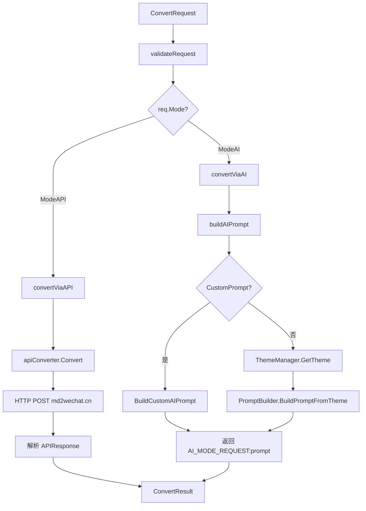
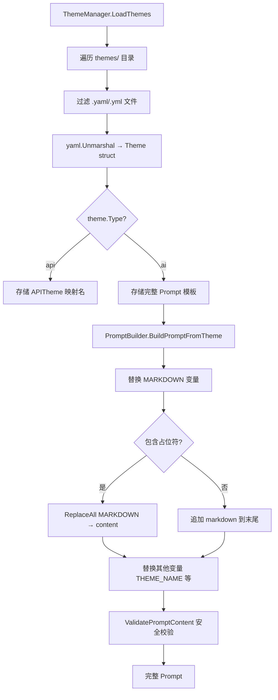
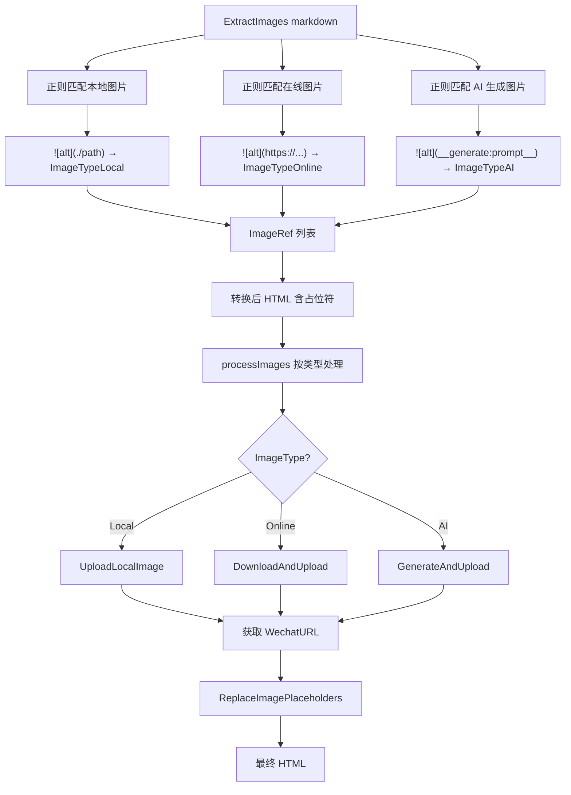

# PD-192.01 md2wechat-skill — 双模式 Markdown 转微信公众号 HTML 引擎

> 文档编号：PD-192.01
> 来源：md2wechat-skill `internal/converter/`
> GitHub：https://github.com/geekjourneyx/md2wechat-skill.git
> 问题域：PD-192 内容格式转换 Content Format Conversion
> 状态：可复用方案

---

## 第 1 章 问题与动机（Problem & Motivation）

### 1.1 核心问题

微信公众号编辑器对 HTML 有严格限制：不支持 `<style>` 标签、不支持外部 CSS、只允许白名单内的 HTML 标签、会强制重置部分内联样式（如段落颜色被覆盖为黑色）。开发者用 Markdown 写作后，需要一个可靠的转换管道将 Markdown 转为微信兼容的内联 CSS HTML，同时保持美观的排版效果。

核心挑战：
1. **平台兼容性** — 微信编辑器会剥离 `<style>` 标签和外部样式，所有 CSS 必须内联到每个元素的 `style` 属性上
2. **样式覆盖** — 微信会强制重置 `<p>` 标签颜色为黑色，必须在每个 `<p>` 上显式声明 `color`
3. **标签白名单** — 只允许 `section, p, span, strong, em, a, h1-h6, ul, ol, li, blockquote, pre, code, table, img, br, hr` 等安全标签
4. **图片处理** — 微信要求图片必须上传到微信素材库，外部图片 URL 会被拦截
5. **多主题需求** — 不同文章风格需要不同的排版主题，且每个主题的 CSS 规则复杂

### 1.2 md2wechat-skill 的解法概述

md2wechat-skill 采用 **API + AI 双模式策略模式** 解决 Markdown 到微信 HTML 的转换：

1. **策略模式双转换器** — `Converter` 接口统一 API 模式（调用 md2wechat.cn 远程服务）和 AI 模式（通过 Claude 生成带主题样式的 HTML），由 `ConvertMode` 枚举在运行时切换（`converter.go:94-118`）
2. **YAML 驱动主题系统** — `ThemeManager` 从 `themes/` 目录加载 YAML 主题文件，每个主题包含颜色方案、风格信息和完整的 AI Prompt 模板（`theme.go:44-76`）
3. **PromptBuilder 模板引擎** — 支持 `{{VARIABLE}}` 占位符替换和 Go template 语法，将主题定义转化为完整的 AI 转换指令（`prompt.go:138-208`）
4. **图片占位符协议** — 使用 `<!-- IMG:index -->` 统一占位符格式，支持本地图片、在线图片和 AI 生成图片三种类型的提取与替换（`converter.go:150-196`）
5. **三级配置优先级** — 环境变量 > 配置文件 > 默认值，支持 YAML/JSON 双格式配置文件（`config.go:76-128`）

### 1.3 设计思想

| 设计原则 | 具体实现 | 理由 | 替代方案 |
|----------|----------|------|----------|
| 策略模式 | `ConvertMode` 枚举 + switch 分发到 `convertViaAPI`/`convertViaAI` | API 模式稳定快速，AI 模式灵活可定制，两者互补 | 单一模式（缺乏灵活性） |
| 数据驱动主题 | YAML 文件定义主题，含完整 Prompt 模板 | 新增主题只需添加 YAML 文件，无需改代码 | 硬编码主题（难扩展） |
| 占位符协议 | `<!-- IMG:n -->` HTML 注释格式 | 不影响 HTML 渲染，微信编辑器不会剥离注释 | 自定义标签（会被微信过滤） |
| 内联 CSS 强制 | Prompt 中明确要求 + `ValidatePromptContent` 校验 | 微信编辑器会剥离所有非内联样式 | 后处理 CSS 内联化（增加复杂度） |
| 配置分层 | 环境变量 > 文件 > 默认值三级覆盖 | 开发/生产环境灵活切换，敏感信息走环境变量 | 单一配置源（不够灵活） |

---

## 第 2 章 源码实现分析（Source Code Analysis）

### 2.1 架构概览

md2wechat-skill 的转换引擎采用分层架构，核心在 `internal/converter/` 包中：

```
┌─────────────────────────────────────────────────────────┐
│                    CLI Layer (cmd/)                       │
│  convert.go → runConvert() → Converter.Convert()         │
├─────────────────────────────────────────────────────────┤
│                 Converter Interface                       │
│  converter.go:67-73  Convert() / ExtractImages()         │
├──────────────┬──────────────────────────────────────────┤
│  API Mode    │           AI Mode                         │
│  api.go      │  ai.go + prompt.go + theme.go             │
│  ↓           │  ↓                                        │
│  md2wechat   │  ThemeManager → PromptBuilder → Claude    │
│  .cn API     │  (YAML themes)  ({{VAR}} replace)         │
├──────────────┴──────────────────────────────────────────┤
│              Image Processing Layer                      │
│  image.go → ExtractPlaceholders / ReplacePlaceholders    │
│  converter.go:150-196 → ExtractImages (3 types)          │
├─────────────────────────────────────────────────────────┤
│              Config Layer (internal/config/)              │
│  config.go → Load() → Env > File > Defaults              │
└─────────────────────────────────────────────────────────┘
```

### 2.2 核心实现

#### 2.2.1 策略模式转换分发



对应源码 `internal/converter/converter.go:94-118`：

```go
// Convert 执行转换
func (c *converter) Convert(req *ConvertRequest) *ConvertResult {
    result := &ConvertResult{
        Mode:  req.Mode,
        Theme: req.Theme,
    }

    // 验证请求
    if err := c.validateRequest(req); err != nil {
        result.Success = false
        result.Error = err.Error()
        return result
    }

    // 根据模式选择转换器
    switch req.Mode {
    case ModeAPI:
        return c.convertViaAPI(req)
    case ModeAI:
        return c.convertViaAI(req)
    default:
        result.Success = false
        result.Error = "unsupported convert mode: " + string(req.Mode)
        return result
    }
}
```

#### 2.2.2 YAML 主题加载与 AI Prompt 构建



对应源码 `internal/converter/prompt.go:174-208`：

```go
// BuildPromptFromTheme 从主题构建 Prompt
func (pb *PromptBuilder) BuildPromptFromTheme(theme *Theme, markdown string, vars map[string]string) (string, error) {
    if theme.Type != "ai" {
        return "", fmt.Errorf("theme '%s' is not an AI theme", theme.Name)
    }

    if vars == nil {
        vars = make(map[string]string)
    }
    if _, ok := vars["MARKDOWN"]; !ok {
        vars["MARKDOWN"] = markdown
    }
    if _, ok := vars["THEME_NAME"]; !ok {
        vars["THEME_NAME"] = theme.Name
    }

    prompt := theme.Prompt

    // 替换 {{MARKDOWN}} 变量
    if strings.Contains(prompt, "{{MARKDOWN}}") {
        prompt = strings.ReplaceAll(prompt, "{{MARKDOWN}}", markdown)
    } else {
        // 如果没有占位符，追加到末尾
        prompt = prompt + "\n\n```\n" + markdown + "\n```"
    }

    // 替换其他变量
    for key, value := range vars {
        placeholder := "{{" + key + "}}"
        prompt = strings.ReplaceAll(prompt, placeholder, value)
    }

    return prompt, nil
}
```

#### 2.2.3 三类图片提取与占位符替换



对应源码 `internal/converter/converter.go:150-196`：

```go
// ExtractImages 从 Markdown 中提取图片引用
func (c *converter) ExtractImages(markdown string) []ImageRef {
    var images []ImageRef

    // 匹配本地图片: 
    localPattern := regexp.MustCompile(`!\[([^\]]*)\]\((\.\/[^)]+)\)`)
    for i, match := range localPattern.FindAllStringSubmatch(markdown, -1) {
        if len(match) >= 3 {
            images = append(images, ImageRef{
                Index: i, Original: match[2],
                Placeholder: "", Type: ImageTypeLocal,
            })
        }
    }

    // 匹配在线图片: 
    onlinePattern := regexp.MustCompile(`!\[([^\]]*)\]\((https?://[^)]+)\)`)
    offset := len(images)
    for i, match := range onlinePattern.FindAllStringSubmatch(markdown, -1) {
        if len(match) >= 3 {
            images = append(images, ImageRef{
                Index: offset + i, Original: match[2],
                Placeholder: "", Type: ImageTypeOnline,
            })
        }
    }

    // 匹配 AI 生成图片: 
    aiPattern := regexp.MustCompile(`!\[([^\]]*)\]\(__generate:([^)]+)__\)`)
    offset = len(images)
    for i, match := range aiPattern.FindAllStringSubmatch(markdown, -1) {
        if len(match) >= 3 {
            images = append(images, ImageRef{
                Index: offset + i, Original: match[2],
                Type: ImageTypeAI, AIPrompt: match[2],
            })
        }
    }
    return images
}
```

### 2.3 实现细节

**主题目录三级搜索**（`theme.go:108-123`）：ThemeManager 按优先级搜索主题目录：项目根目录 `themes/` → 用户目录 `~/.config/md2wechat/themes/` → 当前目录 `themes/`。这种设计允许项目级主题覆盖全局主题。

**Prompt 安全校验**（`prompt.go:236-277`）：`ValidatePromptContent` 检查两类问题：(1) 缺失关键规则（内联样式说明、图片占位符说明、HTML 标签说明）产生 Warning；(2) 包含危险模式（`<script`、`javascript:`、`onload=`、`onerror=`）产生 Error 并标记 Invalid。

**AI 模式的间接调用设计**（`ai.go:40-74`）：`convertViaAI` 不直接调用 LLM，而是返回一个特殊的 `ConvertResult`，其 `Error` 字段以 `AI_MODE_REQUEST:` 为前缀携带完整 Prompt。调用者（Claude Skill 或 CLI）负责将 Prompt 发送给 LLM 并通过 `CompleteAIConversion` 填充结果。这种设计将 LLM 调用解耦出转换引擎。

**Token 估算**（`prompt.go:430-443`）：`EstimateTokenCount` 用简单的字符计数法估算 token 数——中文字符按 1:1，其他字符按 4:1。虽然粗略，但足以用于 Prompt 长度预检。


---

## 第 3 章 迁移指南（Migration Guide）

### 3.1 迁移清单

**阶段 1：核心转换器（必须）**

- [ ] 定义 `ConvertMode` 枚举和 `ConvertRequest`/`ConvertResult` 数据结构
- [ ] 实现 `Converter` 接口，包含 `Convert()` 和 `ExtractImages()` 方法
- [ ] 实现 `validateRequest()` 请求校验逻辑
- [ ] 实现 API 模式转换器（HTTP POST 调用远程转换服务）
- [ ] 实现图片提取正则（本地/在线/AI 三种类型）
- [ ] 实现 `ReplaceImagePlaceholders()` 占位符替换

**阶段 2：主题系统（推荐）**

- [ ] 定义 `Theme` YAML 结构体（name, type, colors, prompt）
- [ ] 实现 `ThemeManager`，支持从目录加载 YAML 主题文件
- [ ] 实现主题目录多级搜索（项目级 > 用户级 > 默认）
- [ ] 创建至少 1 个 API 主题和 1 个 AI 主题 YAML 文件

**阶段 3：Prompt 引擎（AI 模式需要）**

- [ ] 实现 `PromptBuilder`，支持 `{{VARIABLE}}` 占位符替换
- [ ] 实现 `BuildPromptFromTheme()`，将主题 Prompt + Markdown 组合
- [ ] 实现 `ValidatePromptContent()` 安全校验
- [ ] 编写微信兼容性 Prompt 模板（内联 CSS 规则、标签白名单、图片占位符格式）

**阶段 4：配置与集成（生产化）**

- [ ] 实现三级配置加载（环境变量 > 文件 > 默认值）
- [ ] 集成微信素材上传 API（图片上传到微信素材库）
- [ ] 实现 CLI 命令或 API 端点

### 3.2 适配代码模板

以下是一个可直接运行的 Go 语言最小转换器骨架，复用了 md2wechat-skill 的核心设计：

```go
package converter

import (
    "fmt"
    "regexp"
    "strings"
)

// ConvertMode 转换模式
type ConvertMode string

const (
    ModeAPI ConvertMode = "api"
    ModeAI  ConvertMode = "ai"
)

// ConvertRequest 转换请求
type ConvertRequest struct {
    Markdown string
    Mode     ConvertMode
    Theme    string
}

// ConvertResult 转换结果
type ConvertResult struct {
    HTML    string
    Mode    ConvertMode
    Success bool
    Error   string
}

// Converter 转换器接口
type Converter interface {
    Convert(req *ConvertRequest) *ConvertResult
}

// Theme YAML 主题定义
type Theme struct {
    Name   string            `yaml:"name"`
    Type   string            `yaml:"type"` // "api" | "ai"
    Colors map[string]string `yaml:"colors"`
    Prompt string            `yaml:"prompt"`
}

// 图片占位符提取（复用 md2wechat-skill 的三类正则）
func ExtractImages(markdown string) []ImageRef {
    var images []ImageRef
    patterns := []struct {
        re      *regexp.Regexp
        imgType string
    }{
        {regexp.MustCompile(`!\[([^\]]*)\]\((\.\/[^)]+)\)`), "local"},
        {regexp.MustCompile(`!\[([^\]]*)\]\((https?://[^)]+)\)`), "online"},
        {regexp.MustCompile(`!\[([^\]]*)\]\(__generate:([^)]+)__\)`), "ai"},
    }
    idx := 0
    for _, p := range patterns {
        for _, m := range p.re.FindAllStringSubmatch(markdown, -1) {
            if len(m) >= 3 {
                images = append(images, ImageRef{Index: idx, Original: m[2], Type: p.imgType})
                idx++
            }
        }
    }
    return images
}

// ReplaceImagePlaceholders 替换占位符为实际图片
func ReplaceImagePlaceholders(html string, images []ImageRef) string {
    for _, img := range images {
        if img.UploadedURL != "" {
            tag := fmt.Sprintf(``, img.UploadedURL)
            html = strings.ReplaceAll(html, fmt.Sprintf("<!-- IMG:%d -->", img.Index), tag)
        }
    }
    return html
}

type ImageRef struct {
    Index       int
    Original    string
    Type        string
    UploadedURL string
}
```

### 3.3 适用场景

| 场景 | 适用度 | 说明 |
|------|--------|------|
| 微信公众号文章发布 | ⭐⭐⭐ | 核心场景，完整覆盖内联 CSS + 标签白名单 + 图片上传 |
| 其他受限 HTML 平台（邮件、知乎等） | ⭐⭐⭐ | 内联 CSS 策略通用，主题 Prompt 需针对平台调整 |
| 通用 Markdown→HTML 转换 | ⭐⭐ | 可用但过度设计，通用场景用 goldmark/marked 更简单 |
| 批量文章排版工具 | ⭐⭐⭐ | API 模式适合批量处理，AI 模式适合高质量定制 |
| Claude Skill 集成 | ⭐⭐⭐ | AI 模式的间接调用设计天然适配 Skill 架构 |

---

## 第 4 章 测试用例（Test Cases）

```go
package converter_test

import (
    "testing"

    "github.com/stretchr/testify/assert"
)

// === 转换器核心测试 ===

func TestConvert_APIMode_Success(t *testing.T) {
    // 模拟 API 转换器
    conv := NewTestConverter()
    result := conv.Convert(&ConvertRequest{
        Markdown: "# Hello\n\nWorld",
        Mode:     ModeAPI,
        Theme:    "default",
        APIKey:   "test-key",
    })
    assert.True(t, result.Success)
    assert.Equal(t, ModeAPI, result.Mode)
    assert.NotEmpty(t, result.HTML)
}

func TestConvert_EmptyMarkdown_Error(t *testing.T) {
    conv := NewTestConverter()
    result := conv.Convert(&ConvertRequest{
        Markdown: "",
        Mode:     ModeAPI,
    })
    assert.False(t, result.Success)
    assert.Contains(t, result.Error, "EMPTY_MARKDOWN")
}

func TestConvert_DefaultMode(t *testing.T) {
    conv := NewTestConverter()
    req := &ConvertRequest{Markdown: "# Test", APIKey: "key"}
    // Mode 为空时应默认为 API
    conv.Convert(req)
    assert.Equal(t, ModeAPI, req.Mode)
}

// === 图片提取测试 ===

func TestExtractImages_LocalImage(t *testing.T) {
    md := ""
    images := ExtractImages(md)
    assert.Len(t, images, 1)
    assert.Equal(t, ImageTypeLocal, images[0].Type)
    assert.Equal(t, "./images/test.png", images[0].Original)
}

func TestExtractImages_OnlineImage(t *testing.T) {
    md := ""
    images := ExtractImages(md)
    assert.Len(t, images, 1)
    assert.Equal(t, ImageTypeOnline, images[0].Type)
}

func TestExtractImages_AIGeneratedImage(t *testing.T) {
    md := ""
    images := ExtractImages(md)
    assert.Len(t, images, 1)
    assert.Equal(t, ImageTypeAI, images[0].Type)
    assert.Equal(t, "a beautiful sunset", images[0].AIPrompt)
}

func TestExtractImages_MixedTypes(t *testing.T) {
    md := "\n\n"
    images := ExtractImages(md)
    assert.Len(t, images, 3)
}

// === 主题管理测试 ===

func TestThemeManager_LoadThemes(t *testing.T) {
    tm := NewThemeManager()
    err := tm.LoadThemes()
    assert.NoError(t, err)
}

func TestThemeManager_GetAIPrompt(t *testing.T) {
    tm := NewThemeManager()
    _ = tm.LoadThemes()
    prompt, err := tm.GetAIPrompt("autumn-warm")
    if err == nil {
        assert.Contains(t, prompt, "内联")
        assert.Contains(t, prompt, "IMG:")
    }
}

func TestThemeManager_IsAPITheme(t *testing.T) {
    tm := NewThemeManager()
    _ = tm.LoadThemes()
    // default 主题应该是 API 类型
    assert.True(t, tm.IsAPITheme("default"))
}

// === Prompt 校验测试 ===

func TestValidatePromptContent_Safe(t *testing.T) {
    prompt := "请使用内联 style 属性转换，图片用 <!-- IMG:0 --> 占位，只用安全 HTML 标签"
    result := ValidatePromptContent(prompt)
    assert.True(t, result.Valid)
    assert.Empty(t, result.Errors)
}

func TestValidatePromptContent_Dangerous(t *testing.T) {
    prompt := "<script>alert('xss')</script>"
    result := ValidatePromptContent(prompt)
    assert.False(t, result.Valid)
    assert.NotEmpty(t, result.Errors)
}

func TestEstimateTokenCount_Chinese(t *testing.T) {
    text := "你好世界"
    tokens := EstimateTokenCount(text)
    assert.Equal(t, 4, tokens) // 4 个中文字符 = 4 tokens
}

func TestEstimateTokenCount_English(t *testing.T) {
    text := "hello world test"
    tokens := EstimateTokenCount(text)
    assert.Equal(t, 4, tokens) // 16 chars / 4 = 4 tokens
}

// === 占位符替换测试 ===

func TestReplaceImagePlaceholders(t *testing.T) {
    html := `<p>text</p><!-- IMG:0 --><p>more</p>`
    images := []ImageRef{
        {Index: 0, Placeholder: "<!-- IMG:0 -->", WechatURL: "https://mmbiz.qpic.cn/xxx"},
    }
    result := ReplaceImagePlaceholders(html, images)
    assert.Contains(t, result, `")
}

func TestReplaceImagePlaceholders_NoURL(t *testing.T) {
    html := `<!-- IMG:0 -->`
    images := []ImageRef{
        {Index: 0, Placeholder: "<!-- IMG:0 -->", WechatURL: ""},
    }
    result := ReplaceImagePlaceholders(html, images)
    // 没有 URL 时不替换
    assert.Contains(t, result, "<!-- IMG:0 -->")
}
```


---

## 第 5 章 跨域关联（Cross-Domain Relations）

| 关联域 | 关系类型 | 说明 |
|--------|----------|------|
| PD-04 工具系统 | 协同 | md2wechat-skill 作为 Claude Skill 运行，AI 模式的间接调用设计（`AI_MODE_REQUEST:` 前缀协议）是一种工具系统集成模式 |
| PD-190 多供应商适配 | 依赖 | 图片生成依赖 `internal/image/` 包的 Provider 接口，支持 OpenAI/Gemini/ModelScope 等多供应商（已有 PD-190 文档） |
| PD-01 上下文管理 | 协同 | `EstimateTokenCount()` 提供粗略 token 估算，AI 模式的 Prompt 长度直接影响上下文窗口使用 |
| PD-03 容错与重试 | 协同 | API 模式有 30s 超时保护（`api.go:44`），但缺少重试机制；AI 模式通过 `ValidatePromptContent` 做前置校验降低失败率 |
| PD-11 可观测性 | 协同 | 使用 zap 结构化日志记录转换过程（模式、主题、图片数量、Prompt 长度），但缺少 metrics 和 tracing |

---

## 第 6 章 来源文件索引（Source File Index）

| 文件 | 行范围 | 关键实现 |
|------|--------|----------|
| `internal/converter/converter.go` | L14-19 | `ConvertMode` 枚举定义（ModeAPI/ModeAI） |
| `internal/converter/converter.go` | L30-64 | `ConvertRequest`/`ConvertResult`/`ImageRef` 数据结构 |
| `internal/converter/converter.go` | L67-73 | `Converter` 接口定义 |
| `internal/converter/converter.go` | L84-91 | `NewConverter` 工厂函数，组装 ThemeManager + PromptBuilder |
| `internal/converter/converter.go` | L94-118 | `Convert()` 策略模式分发 |
| `internal/converter/converter.go` | L121-147 | `validateRequest()` 请求校验 |
| `internal/converter/converter.go` | L150-196 | `ExtractImages()` 三类图片正则提取 |
| `internal/converter/converter.go` | L199-209 | `ReplaceImagePlaceholders()` 占位符替换 |
| `internal/converter/api.go` | L33-46 | `apiConverter` 结构体与工厂函数 |
| `internal/converter/api.go` | L58-116 | `convertViaAPI()` API 模式完整流程 |
| `internal/converter/api.go` | L119-170 | `apiConverter.Convert()` HTTP POST 调用 |
| `internal/converter/ai.go` | L40-74 | `convertViaAI()` AI 模式请求准备 |
| `internal/converter/ai.go` | L77-121 | `buildAIPrompt()` Prompt 构建链 |
| `internal/converter/ai.go` | L124-138 | `getGenericPrompt()` 通用 Prompt 模板 |
| `internal/converter/ai.go` | L156-164 | `CompleteAIConversion()` AI 结果填充 |
| `internal/converter/ai.go` | L167-177 | `IsAIRequest()`/`ExtractAIRequest()` 协议解析 |
| `internal/converter/theme.go` | L13-22 | `Theme` 结构体（YAML 映射） |
| `internal/converter/theme.go` | L32-41 | `ThemeManager` 结构体与工厂函数 |
| `internal/converter/theme.go` | L44-76 | `LoadThemes()` 目录遍历加载 |
| `internal/converter/theme.go` | L79-105 | `loadThemeFromFile()` 单文件加载与校验 |
| `internal/converter/theme.go` | L108-123 | `getThemeDir()` 三级目录搜索 |
| `internal/converter/theme.go` | L190-202 | `GetAIPrompt()` AI 主题 Prompt 获取 |
| `internal/converter/theme.go` | L205-231 | `BuildCustomAIPrompt()` 自定义 Prompt + 基础规则注入 |
| `internal/converter/prompt.go` | L29-42 | `PromptBuilder` 结构体与工厂函数 |
| `internal/converter/prompt.go` | L45-100 | `initBuiltinVariables()` 9 个内置变量定义 |
| `internal/converter/prompt.go` | L138-171 | `BuildPrompt()` 模板变量替换 |
| `internal/converter/prompt.go` | L174-208 | `BuildPromptFromTheme()` 主题 Prompt 构建 |
| `internal/converter/prompt.go` | L236-277 | `ValidatePromptContent()` 安全校验 |
| `internal/converter/prompt.go` | L409-427 | `ParseMarkdownTitle()` 标题提取 |
| `internal/converter/prompt.go` | L430-443 | `EstimateTokenCount()` Token 估算 |
| `internal/converter/image.go` | L24-42 | `ExtractPlaceholders()` HTML 占位符提取 |
| `internal/converter/image.go` | L45-74 | `InsertPlaceholders()` 占位符插入 |
| `internal/converter/image.go` | L97-117 | `ReplacePlaceholders()` 占位符替换为图片标签 |
| `internal/config/config.go` | L15-44 | `Config` 结构体（全部配置字段） |
| `internal/config/config.go` | L76-128 | `Load()`/`LoadWithDefaults()` 三级配置加载 |
| `internal/config/config.go` | L132-166 | `findConfigFile()` 配置文件搜索 |
| `internal/config/config.go` | L301-350 | `loadFromEnv()` 环境变量覆盖 |
| `internal/config/config.go` | L353-402 | `Validate()` 配置校验 |
| `cmd/md2wechat/convert.go` | L78-148 | `runConvert()` CLI 转换入口 |
| `cmd/md2wechat/convert.go` | L184-239 | `processImages()` 图片处理流程 |
| `themes/autumn-warm.yaml` | L1-105 | 秋日暖光 AI 主题完整定义 |

---

## 第 7 章 横向对比维度

```json comparison_data
{
  "project": "md2wechat-skill",
  "dimensions": {
    "转换架构": "策略模式双转换器：API 远程调用 + AI Prompt 生成，ConvertMode 枚举运行时切换",
    "主题系统": "YAML 文件驱动，ThemeManager 三级目录搜索，17 个预设主题（6 API + 11 AI）",
    "样式注入": "AI Prompt 中硬编码内联 CSS 规则 + ValidatePromptContent 安全校验",
    "图片处理": "三类正则提取（本地/在线/AI生成）+ <!-- IMG:n --> 占位符协议",
    "平台适配": "微信公众号专用：标签白名单、强制 p 标签 color、禁止 style 标签",
    "LLM集成模式": "间接调用：返回 AI_MODE_REQUEST: 前缀 Prompt，由外部 Skill 执行 LLM 调用"
  }
}
```

### 域元数据补充

```json domain_metadata
{
  "solution_summary": "md2wechat-skill 用策略模式双转换器（API远程调用 + AI Prompt生成）配合 YAML 驱动主题系统和 <!-- IMG:n --> 占位符协议实现 Markdown→微信HTML转换",
  "description": "双模式转换引擎设计：稳定API模式与灵活AI模式互补，适配受限HTML平台",
  "sub_problems": [
    "AI模式LLM调用解耦与间接调用协议设计",
    "Prompt模板变量替换与安全校验",
    "三类图片源统一提取与占位符替换"
  ],
  "best_practices": [
    "用HTML注释格式占位符避免被平台过滤",
    "AI模式返回Prompt而非直接调用LLM，解耦转换引擎与LLM依赖",
    "主题YAML中嵌入完整Prompt模板，新增主题零代码改动"
  ]
}
```

