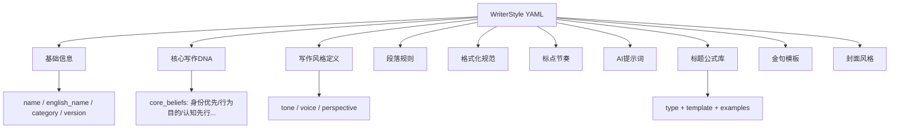
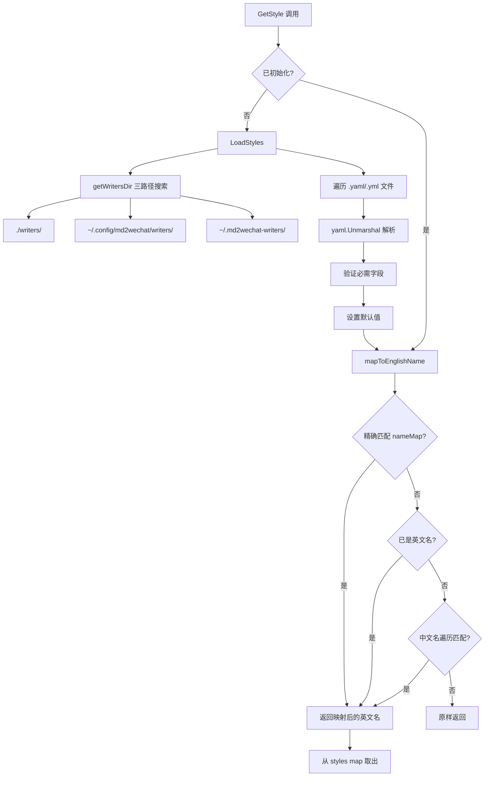
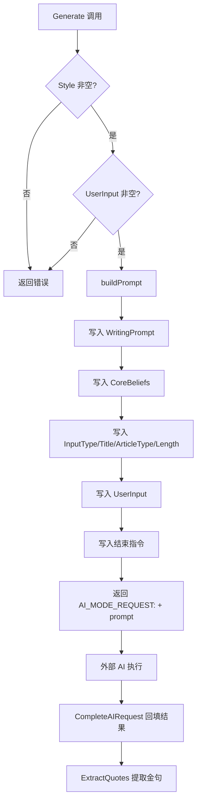

# PD-193.01 md2wechat-skill — YAML 驱动的创作者风格化写作系统

> 文档编号：PD-193.01
> 来源：md2wechat-skill `internal/writer/`
> GitHub：https://github.com/geekjourneyx/md2wechat-skill.git
> 问题域：PD-193 风格化写作系统 Stylized Writing System
> 状态：可复用方案

---

## 第 1 章 问题与动机

### 1.1 核心问题

AI 写作工具面临一个根本矛盾：LLM 生成的内容千篇一律，缺乏个人风格辨识度。用户希望 AI 能"像某个创作者一样写作"，但直接在 prompt 中描述风格既不可复用、也不可维护。

具体子问题包括：
- **风格定义碎片化**：写作风格涉及语气、段落规则、标点节奏、标题公式、金句模板等多个维度，如何结构化表达？
- **风格与代码耦合**：如果风格定义硬编码在 Go 代码中，每新增一个创作者风格都需要改代码、重新编译
- **提示词膨胀**：一个完整的风格 prompt 可能超过 200 行，如何管理和复用？
- **多入口适配**：同一风格需要在文章生成、润色、封面生成等不同场景下使用，如何统一管理？

### 1.2 md2wechat-skill 的解法概述

md2wechat-skill 的 writer 模块实现了一套完整的 YAML 驱动风格化写作系统：

1. **YAML 风格配置文件**：每个创作者风格是一个独立 YAML 文件（如 `writers/dan-koe.yaml`），包含写作 DNA、段落规则、标题公式、金句模板、封面风格等全部维度（`writers/dan-koe.yaml:1-286`）
2. **StyleManager 集中管理**：`StyleManager` 负责风格的加载、查询、分类、验证、导出，支持多路径搜索和中英文名称映射（`internal/writer/style.go:14-339`）
3. **Generator 提示词组装**：`articleGenerator.buildPrompt()` 将 YAML 中的风格定义与用户输入组装成结构化 AI 请求（`internal/writer/generator.go:85-121`）
4. **Assistant 协调器**：`Assistant` 作为门面模式的入口，协调 StyleManager 和 Generator，统一处理写作、润色、封面生成等场景（`internal/writer/assistant.go:10-14`）
5. **AI 模式标记协议**：通过 `AI_MODE_REQUEST:` 前缀标记需要外部 AI 处理的请求，实现生成逻辑与 AI 调用的解耦（`internal/writer/generator.go:79`）

### 1.3 设计思想

| 设计原则 | 具体实现 | 理由 | 替代方案 |
|----------|----------|------|----------|
| 配置与代码分离 | 风格定义在 YAML 文件中，代码只负责加载和组装 | 新增风格无需改代码，非开发者也能编辑 | 硬编码在 Go struct 中（不可扩展） |
| 多维度风格建模 | WriterStyle 包含 CoreBeliefs、WritingStyle、ParagraphRules、Formatting、Punctuation、TitleFormulas、QuoteTemplates 7 大维度 | 写作风格不是单一属性，需要多维度精确描述 | 只用一个 prompt 字符串（维度丢失） |
| 懒加载 + 按需初始化 | StyleManager 在首次 GetStyle 时自动 LoadStyles | 避免启动时加载所有风格的开销 | 启动时全量加载（浪费资源） |
| AI 调用外置 | Generator 返回 AI_MODE_REQUEST 标记而非直接调用 LLM | 解耦生成逻辑与 AI 客户端，支持不同 AI 后端 | Generator 内部直接调用 OpenAI SDK |
| 门面模式协调 | Assistant 统一封装 StyleManager + Generator | 外部调用者只需一个入口，不关心内部组件 | 直接暴露 StyleManager 和 Generator |

---

## 第 2 章 源码实现分析

### 2.1 架构概览

md2wechat-skill 的 writer 模块采用三层架构：配置层（YAML）→ 管理层（StyleManager）→ 生成层（Generator），由 Assistant 门面统一协调。

```
┌─────────────────────────────────────────────────────────┐
│                    CLI (write.go)                        │
│  md2wechat write --style dan-koe --input-type idea      │
└──────────────────────┬──────────────────────────────────┘
                       │
                       ▼
┌─────────────────────────────────────────────────────────┐
│                 Assistant (门面协调器)                     │
│  Write() → Refine() → ListStyles() → GeneratePrompt()  │
├──────────────┬──────────────────────┬───────────────────┤
│ StyleManager │    Generator         │  CoverGenerator   │
│ ┌──────────┐ │ ┌────────────────┐  │ ┌───────────────┐ │
│ │LoadStyles│ │ │ buildPrompt()  │  │ │GeneratePrompt│ │
│ │GetStyle  │ │ │ GenerateTitles│  │ │analyzeContent│ │
│ │MapName   │ │ │ ExtractQuotes │  │ │determineMood │ │
│ └──────────┘ │ └────────────────┘  │ └───────────────┘ │
└──────┬───────┴─────────────────────┴───────────────────┘
       │
       ▼
┌─────────────────────────────────────────────────────────┐
│              YAML 风格配置文件 (writers/*.yaml)            │
│  dan-koe.yaml: CoreBeliefs + WritingStyle + Prompt ...  │
└─────────────────────────────────────────────────────────┘
```

### 2.2 核心实现

#### 2.2.1 WriterStyle 多维度风格模型



对应源码 `internal/writer/types.go:108-144`：

```go
type WriterStyle struct {
	Name         string            `yaml:"name"`
	EnglishName  string            `yaml:"english_name"`
	Category     string            `yaml:"category"`
	Description  string            `yaml:"description"`
	Version      string            `yaml:"version"`
	CoreBeliefs  []string          `yaml:"core_beliefs,omitempty"`
	WritingStyle *WritingStyleDef  `yaml:"writing_style,omitempty"`
	ParagraphRules *ParagraphRules `yaml:"paragraph_rules,omitempty"`
	Formatting   *FormattingDef    `yaml:"formatting,omitempty"`
	Punctuation  *PunctuationDef   `yaml:"punctuation_rhythm,omitempty"`
	WritingPrompt string           `yaml:"writing_prompt,omitempty"`
	TitleFormulas []TitleFormula   `yaml:"title_formulas,omitempty"`
	QuoteTemplates []string        `yaml:"quote_templates,omitempty"`
	CoverPrompt   string           `yaml:"cover_prompt,omitempty"`
	CoverStyle    string           `yaml:"cover_style,omitempty"`
	CoverMood     string           `yaml:"cover_mood,omitempty"`
	CoverColorScheme []string      `yaml:"cover_color_scheme,omitempty"`
}
```

这个结构体将写作风格分解为 11 个独立维度，每个维度都可以在 YAML 中独立配置。

#### 2.2.2 StyleManager 多路径搜索与懒加载



对应源码 `internal/writer/style.go:28-61`（LoadStyles）和 `style.go:97-117`（getWritersDir）：

```go
func (sm *StyleManager) LoadStyles() error {
	sm.writersDir = sm.getWritersDir()
	if _, err := os.Stat(sm.writersDir); os.IsNotExist(err) {
		return nil // 目录不存在不是错误
	}
	entries, err := os.ReadDir(sm.writersDir)
	if err != nil {
		return fmt.Errorf("读取 writers 目录: %w", err)
	}
	for _, entry := range entries {
		if entry.IsDir() { continue }
		name := entry.Name()
		if !strings.HasSuffix(name, ".yaml") && !strings.HasSuffix(name, ".yml") {
			continue
		}
		stylePath := filepath.Join(sm.writersDir, name)
		if err := sm.loadStyle(stylePath); err != nil {
			continue // 记录错误但继续加载其他风格
		}
	}
	sm.initialized = true
	return nil
}

func (sm *StyleManager) getWritersDir() string {
	paths := []string{
		"writers",
		filepath.Join(os.Getenv("HOME"), ".config", "md2wechat", "writers"),
		filepath.Join(os.Getenv("HOME"), ".md2wechat-writers"),
	}
	for _, path := range paths {
		if _, err := os.Stat(path); err == nil {
			return path
		}
	}
	return "writers"
}
```

关键设计：三级路径搜索（项目级 → 用户配置级 → 用户主目录级），加载失败时跳过而非中断，实现了容错的风格发现机制。

#### 2.2.3 Generator 提示词组装与 AI 模式标记



对应源码 `internal/writer/generator.go:51-82`（Generate）和 `generator.go:85-121`（buildPrompt）：

```go
func (g *articleGenerator) Generate(req *GenerateRequest) *GenerateResult {
	if req.Style == nil {
		return &GenerateResult{Success: false, Error: "风格未指定"}
	}
	if req.UserInput == "" {
		return &GenerateResult{Success: false, Error: "用户输入不能为空"}
	}
	prompt := g.buildPrompt(req)
	result := &GenerateResult{Prompt: prompt, Success: true, Style: req.Style}
	// 实际的 AI 调用在外部完成，这里返回特殊标记
	result.Article = ""
	result.Error = "AI_MODE_REQUEST:" + prompt
	return result
}

func (g *articleGenerator) buildPrompt(req *GenerateRequest) string {
	style := req.Style
	var prompt strings.Builder
	prompt.WriteString(style.WritingPrompt)
	prompt.WriteString("\n\n")
	if len(style.CoreBeliefs) > 0 {
		prompt.WriteString("## 核心写作 DNA\n")
		for i, belief := range style.CoreBeliefs {
			prompt.WriteString(fmt.Sprintf("%d. %s\n", i+1, belief))
		}
		prompt.WriteString("\n")
	}
	prompt.WriteString("## 用户输入\n")
	prompt.WriteString(fmt.Sprintf("输入类型: %s\n", req.InputType.String()))
	if req.Title != "" {
		prompt.WriteString(fmt.Sprintf("标题: %s\n", req.Title))
	}
	prompt.WriteString(fmt.Sprintf("文章类型: %s\n", req.ArticleType.String()))
	prompt.WriteString(fmt.Sprintf("期望长度: %s\n", req.Length.String()))
	prompt.WriteString("\n## 用户内容\n")
	prompt.WriteString(req.UserInput)
	prompt.WriteString("\n\n---\n\n")
	prompt.WriteString("请根据以上要求，生成符合该风格的文章。")
	prompt.WriteString("直接输出文章内容，不需要其他说明。")
	return prompt.String()
}
```

### 2.3 实现细节

**AI 模式标记协议**：Generator 不直接调用 LLM，而是通过 `AI_MODE_REQUEST:` 前缀将组装好的 prompt 编码在 Error 字段中返回。调用方通过 `IsAIRequest()` 检测、`ExtractAIRequest()` 提取 prompt、`CompleteAIRequest()` 回填结果。这种设计将提示词组装逻辑与 AI 调用完全解耦（`generator.go:218-250`）。

**金句提取双策略**：优先使用风格 YAML 中预定义的 `quote_templates`，如果没有则从生成的文章中按 Markdown 斜体/粗体标记提取（`generator.go:160-215`）。

**封面生成器**：`CoverGenerator` 复用 StyleManager 获取风格的封面配置（`cover_style`、`cover_mood`、`cover_color_scheme`），通过 `{article_content}` 占位符替换将文章内容注入封面 prompt 模板（`cover_generator.go:23-54`）。

**名称映射三级查找**：`mapToEnglishName` 依次尝试精确别名映射 → 英文名直接匹配 → 中文名遍历匹配，支持用户用任意语言指定风格（`style.go:140-169`）。

---

## 第 3 章 迁移指南

### 3.1 迁移清单

**阶段一：风格配置层（1-2 天）**
- [ ] 定义 `WriterStyle` 结构体，包含至少 name、english_name、category、writing_prompt 字段
- [ ] 创建 `writers/` 目录，编写第一个 YAML 风格文件
- [ ] 实现 YAML 解析和字段验证逻辑

**阶段二：风格管理层（1-2 天）**
- [ ] 实现 `StyleManager`，支持目录扫描、懒加载、名称映射
- [ ] 实现多路径搜索（项目级 → 用户级）
- [ ] 实现分类查询和风格列表

**阶段三：提示词生成层（1 天）**
- [ ] 实现 `Generator` 接口和 `buildPrompt` 方法
- [ ] 实现 AI 模式标记协议（或直接集成 LLM SDK）
- [ ] 实现标题生成和金句提取

**阶段四：门面集成（0.5 天）**
- [ ] 实现 `Assistant` 门面，统一 Write/Refine/ListStyles 入口
- [ ] 集成 CLI 命令或 API 端点

### 3.2 适配代码模板

以下是一个 Python 版本的最小可运行实现：

```python
import yaml
import os
from dataclasses import dataclass, field
from pathlib import Path
from typing import Optional


@dataclass
class WritingStyleDef:
    tone: str = ""
    voice: str = ""
    perspective: str = ""


@dataclass
class TitleFormula:
    type: str = ""
    template: str = ""
    examples: list[str] = field(default_factory=list)


@dataclass
class WriterStyle:
    name: str = ""
    english_name: str = ""
    category: str = "自定义"
    description: str = ""
    version: str = "1.0"
    core_beliefs: list[str] = field(default_factory=list)
    writing_style: Optional[WritingStyleDef] = None
    writing_prompt: str = ""
    title_formulas: list[TitleFormula] = field(default_factory=list)
    quote_templates: list[str] = field(default_factory=list)


class StyleManager:
    """YAML 驱动的风格管理器"""

    SEARCH_PATHS = [
        Path("writers"),
        Path.home() / ".config" / "myapp" / "writers",
        Path.home() / ".myapp-writers",
    ]

    def __init__(self):
        self._styles: dict[str, WriterStyle] = {}
        self._initialized = False

    def _find_writers_dir(self) -> Optional[Path]:
        for path in self.SEARCH_PATHS:
            if path.is_dir():
                return path
        return None

    def load_styles(self) -> None:
        writers_dir = self._find_writers_dir()
        if not writers_dir:
            self._initialized = True
            return
        for yaml_file in writers_dir.glob("*.yaml"):
            try:
                with open(yaml_file, "r", encoding="utf-8") as f:
                    data = yaml.safe_load(f)
                style = WriterStyle(
                    name=data.get("name", ""),
                    english_name=data.get("english_name", ""),
                    category=data.get("category", "自定义"),
                    writing_prompt=data.get("writing_prompt", ""),
                    core_beliefs=data.get("core_beliefs", []),
                    quote_templates=data.get("quote_templates", []),
                )
                if style.english_name:
                    self._styles[style.english_name] = style
            except Exception:
                continue  # 跳过解析失败的文件
        self._initialized = True

    def get_style(self, name: str) -> WriterStyle:
        if not self._initialized:
            self.load_styles()
        style = self._styles.get(name)
        if not style:
            # 尝试中文名匹配
            for s in self._styles.values():
                if s.name == name:
                    return s
            raise KeyError(f"风格未找到: {name}")
        return style


class PromptBuilder:
    """风格化提示词组装器"""

    def build(self, style: WriterStyle, user_input: str,
              input_type: str = "idea", article_type: str = "essay",
              length: str = "medium") -> str:
        parts = [style.writing_prompt, "\n\n"]
        if style.core_beliefs:
            parts.append("## 核心写作 DNA\n")
            for i, belief in enumerate(style.core_beliefs, 1):
                parts.append(f"{i}. {belief}\n")
            parts.append("\n")
        parts.append(f"## 用户输入\n输入类型: {input_type}\n")
        parts.append(f"文章类型: {article_type}\n期望长度: {length}\n")
        parts.append(f"\n## 用户内容\n{user_input}\n")
        parts.append("\n---\n\n请根据以上要求，生成符合该风格的文章。")
        return "".join(parts)


# 使用示例
if __name__ == "__main__":
    mgr = StyleManager()
    style = mgr.get_style("dan-koe")
    builder = PromptBuilder()
    prompt = builder.build(style, "关于自律的思考", input_type="idea")
    print(prompt)
```

### 3.3 适用场景

| 场景 | 适用度 | 说明 |
|------|--------|------|
| 微信公众号写作工具 | ⭐⭐⭐ | 原生场景，完美适配 |
| 多风格内容营销平台 | ⭐⭐⭐ | 每个品牌/KOL 一个 YAML 风格文件 |
| AI 写作 SaaS | ⭐⭐⭐ | 风格市场 + 用户自定义风格 |
| 个人博客写作助手 | ⭐⭐ | 风格数量少时略显过度设计 |
| 新闻/报告生成 | ⭐ | 新闻写作风格维度不同，需要调整模型 |

---

## 第 4 章 测试用例

```python
import pytest
from unittest.mock import patch, MagicMock
from pathlib import Path
import tempfile
import yaml


class TestStyleManager:
    """StyleManager 核心功能测试"""

    def setup_method(self):
        self.tmpdir = tempfile.mkdtemp()
        self.writers_dir = Path(self.tmpdir) / "writers"
        self.writers_dir.mkdir()

    def _write_style(self, filename: str, data: dict):
        with open(self.writers_dir / filename, "w") as f:
            yaml.dump(data, f, allow_unicode=True)

    def test_load_valid_style(self):
        """正常加载 YAML 风格文件"""
        self._write_style("test.yaml", {
            "name": "测试风格",
            "english_name": "test-style",
            "category": "测试",
            "writing_prompt": "你是一个测试风格的写作者。",
        })
        mgr = StyleManager()
        mgr.SEARCH_PATHS = [self.writers_dir]
        mgr.load_styles()
        style = mgr.get_style("test-style")
        assert style.english_name == "test-style"
        assert style.category == "测试"

    def test_missing_english_name_skipped(self):
        """缺少 english_name 的文件被跳过"""
        self._write_style("bad.yaml", {"name": "无英文名"})
        mgr = StyleManager()
        mgr.SEARCH_PATHS = [self.writers_dir]
        mgr.load_styles()
        assert len(mgr._styles) == 0

    def test_chinese_name_lookup(self):
        """支持中文名查找"""
        self._write_style("cn.yaml", {
            "name": "犀利风格",
            "english_name": "sharp",
            "writing_prompt": "prompt",
        })
        mgr = StyleManager()
        mgr.SEARCH_PATHS = [self.writers_dir]
        mgr.load_styles()
        style = mgr.get_style("犀利风格")
        assert style.english_name == "sharp"

    def test_style_not_found_raises(self):
        """查找不存在的风格抛出 KeyError"""
        mgr = StyleManager()
        mgr.SEARCH_PATHS = [self.writers_dir]
        with pytest.raises(KeyError, match="风格未找到"):
            mgr.get_style("nonexistent")

    def test_lazy_initialization(self):
        """首次 get_style 时自动加载"""
        self._write_style("lazy.yaml", {
            "english_name": "lazy-test",
            "writing_prompt": "p",
        })
        mgr = StyleManager()
        mgr.SEARCH_PATHS = [self.writers_dir]
        assert mgr._initialized is False
        style = mgr.get_style("lazy-test")
        assert mgr._initialized is True

    def test_default_category(self):
        """未指定 category 时使用默认值"""
        self._write_style("nocat.yaml", {
            "english_name": "nocat",
            "writing_prompt": "p",
        })
        mgr = StyleManager()
        mgr.SEARCH_PATHS = [self.writers_dir]
        style = mgr.get_style("nocat")
        assert style.category == "自定义"


class TestPromptBuilder:
    """提示词组装测试"""

    def test_basic_prompt_structure(self):
        """基本提示词包含所有必要段落"""
        style = WriterStyle(
            english_name="test",
            writing_prompt="你是测试写作者。",
            core_beliefs=["信念1", "信念2"],
        )
        builder = PromptBuilder()
        prompt = builder.build(style, "测试输入")
        assert "你是测试写作者。" in prompt
        assert "核心写作 DNA" in prompt
        assert "1. 信念1" in prompt
        assert "测试输入" in prompt
        assert "输入类型: idea" in prompt

    def test_empty_beliefs_omitted(self):
        """无 core_beliefs 时不输出该段落"""
        style = WriterStyle(
            english_name="test",
            writing_prompt="prompt",
        )
        builder = PromptBuilder()
        prompt = builder.build(style, "input")
        assert "核心写作 DNA" not in prompt

    def test_custom_parameters(self):
        """自定义参数正确传递"""
        style = WriterStyle(english_name="t", writing_prompt="p")
        builder = PromptBuilder()
        prompt = builder.build(
            style, "input",
            input_type="outline",
            article_type="tutorial",
            length="long",
        )
        assert "输入类型: outline" in prompt
        assert "文章类型: tutorial" in prompt
        assert "期望长度: long" in prompt
```

---

## 第 5 章 跨域关联

| 关联域 | 关系类型 | 说明 |
|--------|----------|------|
| PD-01 上下文管理 | 协同 | 风格 prompt 可能很长（200+ 行），需要上下文窗口管理策略配合 |
| PD-04 工具系统 | 协同 | Generator 的 AI_MODE_REQUEST 协议类似工具调用的请求-响应模式 |
| PD-06 记忆持久化 | 协同 | 风格 YAML 文件本身就是一种持久化的"写作记忆"，可与对话记忆系统结合 |
| PD-10 中间件管道 | 协同 | 写作流程（风格加载 → 提示词组装 → AI 生成 → 金句提取 → 封面生成）天然适合管道模式 |
| PD-192 内容格式转换 | 依赖 | 生成的文章需要转换为微信公众号 HTML 格式，依赖格式转换能力 |

---

## 第 6 章 来源文件索引

| 文件 | 行范围 | 关键实现 |
|------|--------|----------|
| `internal/writer/types.go` | L1-L314 | WriterStyle 多维度风格模型、WriteRequest/GenerateRequest 请求类型、错误码定义 |
| `internal/writer/style.go` | L14-L339 | StyleManager 风格管理器：加载、查询、分类、验证、导出、多路径搜索、名称映射 |
| `internal/writer/generator.go` | L10-L391 | Generator 接口与实现：buildPrompt 提示词组装、AI 模式标记协议、标题生成、金句提取 |
| `internal/writer/assistant.go` | L10-L362 | Assistant 门面协调器：Write/Refine/ListStyles 统一入口、交互式提示词构建 |
| `internal/writer/cover_generator.go` | L10-L327 | CoverGenerator 封面生成器：封面 prompt 模板替换、内容分析、情绪检测 |
| `cmd/md2wechat/write.go` | L17-L410 | CLI write 命令：参数定义、交互模式、AI 模式 JSON 输出、humanizer 集成 |
| `writers/dan-koe.yaml` | L1-L286 | Dan Koe 风格完整配置：核心信念、6 部分文章结构、5 类标题公式、金句模板、封面 prompt |

---

## 第 7 章 横向对比维度

> **重要：** 本章用于自动填充 Butcher Wiki 的横向对比表。
> 必须严格按以下 JSON 格式输出，放在 `comparison_data` 代码块中。

```json comparison_data
{
  "project": "md2wechat-skill",
  "dimensions": {
    "风格建模": "11 维度 YAML 结构体：信念/语气/段落/标点/标题公式/金句/封面",
    "风格管理": "StyleManager 三路径搜索 + 懒加载 + 中英文名称映射",
    "提示词组装": "Generator.buildPrompt 分段拼接：WritingPrompt + CoreBeliefs + 用户输入",
    "AI调用模式": "AI_MODE_REQUEST 标记协议，生成逻辑与 LLM 调用完全解耦",
    "封面生成": "CoverGenerator 复用风格配置，{article_content} 占位符模板替换",
    "多场景复用": "Assistant 门面统一 Write/Refine/Cover 三场景，共享 StyleManager"
  }
}
```

### 域元数据补充

```json domain_metadata
{
  "solution_summary": "md2wechat-skill 用 11 维度 YAML 风格模型 + StyleManager 三路径懒加载 + AI_MODE_REQUEST 标记协议实现创作者风格化写作",
  "description": "将创作者写作风格建模为可配置、可分发的独立资产",
  "sub_problems": [
    "AI 调用与提示词组装的解耦",
    "风格配置的多路径发现与优先级",
    "封面视觉风格与写作风格的联动"
  ],
  "best_practices": [
    "AI_MODE_REQUEST 标记协议解耦生成逻辑与 LLM 调用",
    "三级路径搜索实现项目级到用户级的风格发现",
    "门面模式统一多场景入口避免组件直接暴露"
  ]
}
```
