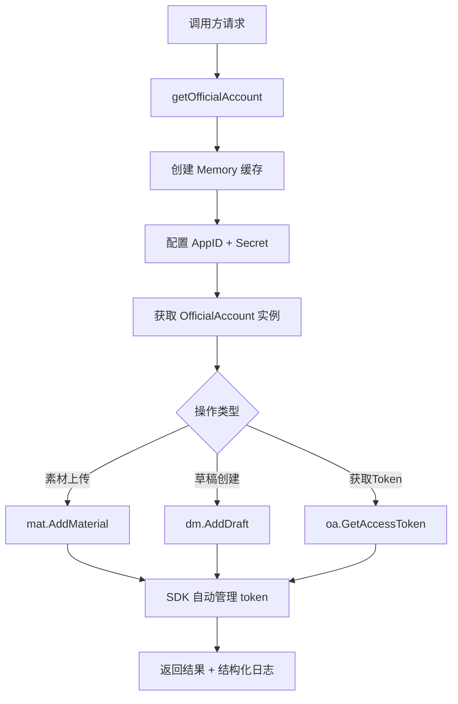
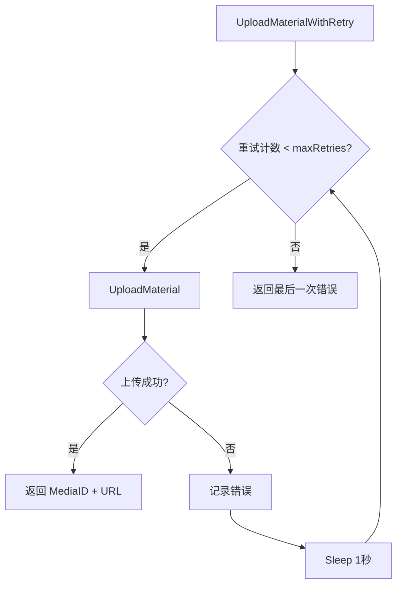
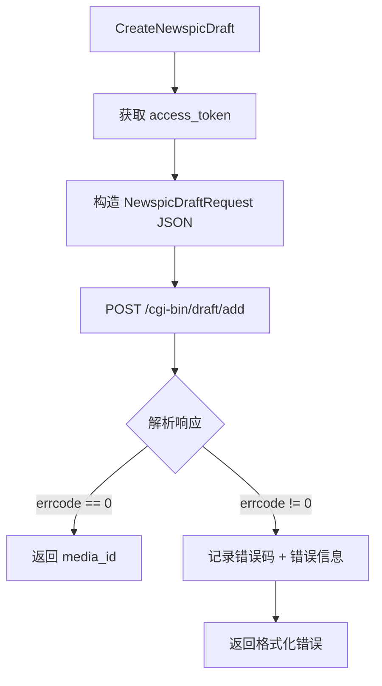

# PD-194.01 md2wechat-skill — 微信公众号 SDK 封装与双类型草稿发布

> 文档编号：PD-194.01
> 来源：md2wechat-skill `internal/wechat/service.go`, `internal/draft/service.go`
> GitHub：https://github.com/geekjourneyx/md2wechat-skill.git
> 问题域：PD-194 平台 API 集成 Platform API Integration
> 状态：可复用方案

---

## 第 1 章 问题与动机

### 1.1 核心问题

微信公众号 API 是国内内容分发的核心渠道，但其 API 设计存在多个工程挑战：

1. **access_token 生命周期短**：有效期仅 7200 秒（2 小时），且全局唯一，多实例并发刷新会导致互相覆盖
2. **素材上传限制严格**：图片大小限制 10MB，格式限制 jpg/png/gif/bmp，永久素材每日上传上限 5000 次
3. **内容类型分裂**：标准图文（news）和小绿书（newspic）使用不同的 API 字段和请求结构，SDK 通常只覆盖标准图文
4. **错误码体系复杂**：微信 API 返回数值错误码（如 40001 无效 access_token、45009 接口调用超限），需要映射为可理解的错误信息
5. **CLI 工具集成需求**：作为 Claude Code Skill 运行时，需要 JSON 标准输出、结构化错误、零交互操作

### 1.2 md2wechat-skill 的解法概述

md2wechat-skill 采用三层架构封装微信公众号 API：

1. **SDK 代理层**（`internal/wechat/service.go:27-40`）：基于 silenceper/wechat SDK 构建 Service 结构体，SDK 内部处理 access_token 缓存与自动刷新，Service 层只负责业务语义封装
2. **业务编排层**（`internal/draft/service.go:17-31`）：draft.Service 组合 wechat.Service，提供标准图文和小绿书两种草稿创建流程，包含参数校验、类型转换、图片批量上传
3. **CLI 入口层**（`cmd/md2wechat/main.go:40-186`）：基于 cobra 的命令行工具，每个子命令对应一个 API 操作，统一 JSON 输出格式
4. **多 Provider 图片处理**（`internal/image/provider.go:10-19`）：Provider 接口抽象支持 OpenAI/TuZi/ModelScope/OpenRouter/Gemini 五种图片生成后端，生成后自动上传到微信素材库
5. **三级配置优先级**（`internal/config/config.go:76-128`）：默认值 → YAML/JSON 配置文件 → 环境变量，逐层覆盖

### 1.3 设计思想

| 设计原则 | 具体实现 | 理由 | 替代方案 |
|----------|----------|------|----------|
| SDK 代理而非直接 HTTP | 基于 silenceper/wechat SDK 封装，不直接调用 REST API | SDK 内置 token 缓存、自动刷新、错误重试，减少重复实现 | 直接 net/http 调用（需自行管理 token 生命周期） |
| 双类型统一入口 | draft.Service 同时支持 news 和 newspic，内部分流 | 调用方无需关心底层 API 差异 | 分成两个独立 Service |
| 重试包装器模式 | UploadMaterialWithRetry 包装 UploadMaterial，固定间隔重试 | 素材上传是网络密集操作，临时失败常见 | 调用方自行重试 |
| JSON 标准输出 | 所有命令统一 `{"success": bool, "data": ...}` 格式 | 作为 Claude Code Skill 被 LLM 解析，结构化输出是必须的 | 人类可读文本输出 |
| 配置三级覆盖 | 默认值 → 配置文件 → 环境变量 | 开发时用配置文件，CI/CD 用环境变量，零配置有合理默认值 | 仅环境变量 |

---

## 第 2 章 源码实现分析

### 2.1 架构概览

```
┌─────────────────────────────────────────────────────────────┐
│                    CLI Layer (cobra)                         │
│  main.go → upload_image / create_draft / convert / write    │
├─────────────────────────────────────────────────────────────┤
│              Business Orchestration Layer                     │
│  ┌──────────────┐  ┌──────────────┐  ┌──────────────────┐  │
│  │ draft.Service │  │image.Processor│  │converter.Converter│  │
│  │  (草稿编排)   │  │ (图片处理)    │  │  (MD→HTML转换)   │  │
│  └──────┬───────┘  └──────┬───────┘  └──────────────────┘  │
│         │                  │                                  │
├─────────┼──────────────────┼────────────────────────────────┤
│         ▼                  ▼         SDK Proxy Layer         │
│  ┌──────────────────────────────┐  ┌─────────────────────┐  │
│  │      wechat.Service          │  │  image.Provider      │  │
│  │  (素材上传/草稿/token管理)    │  │  (5种图片生成后端)   │  │
│  └──────────┬───────────────────┘  └─────────────────────┘  │
│             │                                                │
├─────────────┼────────────────────────────────────────────────┤
│             ▼           External APIs                        │
│  ┌──────────────────┐  ┌──────────────┐  ┌───────────────┐  │
│  │ WeChat MP API    │  │ md2wechat.cn │  │ OpenAI/Gemini │  │
│  │ (公众号平台)      │  │  (MD转换API)  │  │ (图片生成)    │  │
│  └──────────────────┘  └──────────────┘  └───────────────┘  │
└─────────────────────────────────────────────────────────────┘
```

### 2.2 核心实现

#### 2.2.1 wechat.Service — SDK 代理与 Token 管理



对应源码 `internal/wechat/service.go:34-51`：

```go
// NewService 创建微信服务
func NewService(cfg *config.Config, log *zap.Logger) *Service {
	return &Service{
		cfg: cfg,
		log: log,
		wc:  wechat.NewWechat(),
	}
}

// getOfficialAccount 获取公众号实例
func (s *Service) getOfficialAccount() *officialaccount.OfficialAccount {
	memory := wechatcache.NewMemory()
	wechatCfg := &wechatconfig.Config{
		AppID:     s.cfg.WechatAppID,
		AppSecret: s.cfg.WechatSecret,
		Cache:     memory,
	}
	return s.wc.GetOfficialAccount(wechatCfg)
}
```

关键设计点：每次调用 `getOfficialAccount()` 都创建新的 `Memory` 缓存实例。silenceper/wechat SDK 的 `Memory` 缓存是进程内 map，access_token 在首次请求时自动获取并缓存，过期后自动刷新。这种设计适合 CLI 短生命周期场景——每次命令执行是独立进程，无需跨进程共享 token。

#### 2.2.2 素材上传与重试机制



对应源码 `internal/wechat/service.go:62-86` 和 `163-176`：

```go
// UploadMaterial 上传素材到微信
func (s *Service) UploadMaterial(filePath string) (*UploadMaterialResult, error) {
	startTime := time.Now()
	oa := s.getOfficialAccount()
	mat := oa.GetMaterial()

	mediaID, url, err := mat.AddMaterial(material.MediaTypeImage, filePath)
	if err != nil {
		s.log.Error("upload material failed",
			zap.String("path", filePath),
			zap.Error(err))
		return nil, fmt.Errorf("upload material: %w", err)
	}

	duration := time.Since(startTime)
	s.log.Info("material uploaded",
		zap.String("path", filePath),
		zap.String("media_id", maskMediaID(mediaID)),
		zap.Duration("duration", duration))

	return &UploadMaterialResult{MediaID: mediaID, WechatURL: url}, nil
}

// UploadMaterialWithRetry 带重试的上传
func (s *Service) UploadMaterialWithRetry(filePath string, maxRetries int) (*UploadMaterialResult, error) {
	var lastErr error
	for i := 0; i < maxRetries; i++ {
		result, err := s.UploadMaterial(filePath)
		if err == nil {
			return result, nil
		}
		lastErr = err
		if i < maxRetries-1 {
			time.Sleep(time.Second)
		}
	}
	return nil, lastErr
}
```

注意 `maskMediaID` 函数（`service.go:155-160`）在日志中遮蔽 media_id，只显示首尾 4 字符，防止敏感信息泄露到日志系统。

### 2.3 实现细节

#### 2.3.1 小绿书（newspic）直接 HTTP 调用

silenceper/wechat SDK 不支持 newspic 类型的草稿创建，md2wechat-skill 在 `CreateNewspicDraft`（`internal/wechat/service.go:294-348`）中绕过 SDK，直接构造 HTTP 请求调用微信 API：



```go
func (s *Service) CreateNewspicDraft(articles []NewspicArticle) (*CreateDraftResult, error) {
	// 获取 access_token（仍通过 SDK 获取，复用 token 缓存）
	oa := s.getOfficialAccount()
	accessToken, err := oa.GetAccessToken()
	if err != nil {
		return nil, fmt.Errorf("get access token: %w", err)
	}

	req := NewspicDraftRequest{Articles: articles}
	reqBody, _ := json.Marshal(req)

	apiURL := fmt.Sprintf("https://api.weixin.qq.com/cgi-bin/draft/add?access_token=%s", accessToken)
	httpResp, err := http.Post(apiURL, "application/json", bytes.NewReader(reqBody))
	// ... 错误处理 ...

	var resp NewspicDraftResponse
	json.Unmarshal(respBody, &resp)

	if resp.ErrCode != 0 {
		return nil, fmt.Errorf("wechat api error: %d - %s", resp.ErrCode, resp.ErrMsg)
	}
	return &CreateDraftResult{MediaID: resp.MediaID}, nil
}
```

这是一个典型的 **SDK 不足时的补充模式**：token 管理仍委托给 SDK，但业务请求自行构造。

#### 2.3.2 图片处理管线

`image.Processor`（`internal/image/processor.go:14-40`）组合了三个能力：微信上传（wechat.Service）、图片压缩（Compressor）、AI 图片生成（Provider）。处理流程：

```
本地图片 → 格式校验 → 压缩（可选）→ 上传微信 → 返回 media_id
在线图片 → 下载到临时文件 → 格式校验 → 压缩 → 上传微信
AI 生成  → Provider.Generate → 下载生成图片 → 压缩 → 上传微信
```

压缩器（`internal/image/compress.go:17-36`）使用 `disintegration/imaging` 库，支持按最大宽度缩放（保持宽高比）和按文件大小限制压缩。如果压缩后反而变大，则放弃压缩使用原图（`compress.go:131-135`）。

#### 2.3.3 多 Provider 图片生成

`image.Provider` 接口（`internal/image/provider.go:10-19`）定义了统一的图片生成契约：

```go
type Provider interface {
	Name() string
	Generate(ctx context.Context, prompt string) (*GenerateResult, error)
}
```

工厂函数 `NewProvider`（`provider.go:51-85`）根据配置中的 `ImageProvider` 字段路由到具体实现：openai / tuzi / modelscope / openrouter / gemini。每个 Provider 有独立的配置验证函数，返回带 Hint 的 `ConfigError`。

---

## 第 3 章 迁移指南

### 3.1 迁移清单

**阶段 1：基础 SDK 集成**
- [ ] 引入 silenceper/wechat SDK（Go）或等效 SDK（Python: wechatpy, Node: wechat4u）
- [ ] 创建 `wechat.Service` 封装层，注入 AppID/Secret 配置
- [ ] 实现 `UploadMaterial` 和 `CreateDraft` 两个核心方法
- [ ] 添加 `UploadMaterialWithRetry` 重试包装器

**阶段 2：小绿书支持**
- [ ] 定义 `NewspicArticle` / `NewspicImageInfo` 数据结构
- [ ] 实现 `CreateNewspicDraft` 直接 HTTP 调用（SDK 不支持的 API 补充）
- [ ] 添加图片数量校验（微信限制最多 20 张）

**阶段 3：图片处理管线**
- [ ] 实现 `image.Provider` 接口和工厂函数
- [ ] 实现图片压缩器（按宽度/大小限制）
- [ ] 实现 `image.Processor` 组合上传+压缩+生成

**阶段 4：CLI 与配置**
- [ ] 基于 cobra 构建命令行工具
- [ ] 实现三级配置加载（默认值 → 文件 → 环境变量）
- [ ] 统一 JSON 输出格式 `{"success": bool, "data": ...}`

### 3.2 适配代码模板

以下是一个可直接运行的 Go 模板，实现微信素材上传 + 草稿创建的最小可用版本：

```go
package wechat

import (
	"fmt"
	"time"

	"github.com/silenceper/wechat/v2"
	wechatcache "github.com/silenceper/wechat/v2/cache"
	wechatconfig "github.com/silenceper/wechat/v2/officialaccount/config"
	"github.com/silenceper/wechat/v2/officialaccount/draft"
	"github.com/silenceper/wechat/v2/officialaccount/material"
	"go.uber.org/zap"
)

type Service struct {
	appID     string
	appSecret string
	wc        *wechat.Wechat
	log       *zap.Logger
}

func NewService(appID, appSecret string, log *zap.Logger) *Service {
	return &Service{
		appID: appID, appSecret: appSecret,
		wc: wechat.NewWechat(), log: log,
	}
}

func (s *Service) getOA() *officialaccount.OfficialAccount {
	return s.wc.GetOfficialAccount(&wechatconfig.Config{
		AppID: s.appID, AppSecret: s.appSecret,
		Cache: wechatcache.NewMemory(),
	})
}

// UploadImage 上传图片素材，返回 media_id
func (s *Service) UploadImage(filePath string) (string, error) {
	oa := s.getOA()
	mediaID, _, err := oa.GetMaterial().AddMaterial(material.MediaTypeImage, filePath)
	if err != nil {
		return "", fmt.Errorf("upload: %w", err)
	}
	return mediaID, nil
}

// UploadWithRetry 带重试的上传
func (s *Service) UploadWithRetry(filePath string, maxRetries int) (string, error) {
	var lastErr error
	for i := 0; i < maxRetries; i++ {
		id, err := s.UploadImage(filePath)
		if err == nil {
			return id, nil
		}
		lastErr = err
		if i < maxRetries-1 {
			time.Sleep(time.Duration(i+1) * time.Second) // 线性退避
		}
	}
	return "", lastErr
}

// CreateDraft 创建图文草稿
func (s *Service) CreateDraft(title, html, thumbMediaID string) (string, error) {
	oa := s.getOA()
	articles := []*draft.Article{{
		Title: title, Content: html,
		ThumbMediaID: thumbMediaID, ShowCoverPic: 1,
	}}
	mediaID, err := oa.GetDraft().AddDraft(articles)
	if err != nil {
		return "", fmt.Errorf("create draft: %w", err)
	}
	return mediaID, nil
}
```

### 3.3 适用场景

| 场景 | 适用度 | 说明 |
|------|--------|------|
| CLI 工具集成微信发布 | ⭐⭐⭐ | 本项目的核心场景，JSON 输出适合被 LLM/Agent 调用 |
| Web 后端微信内容管理 | ⭐⭐⭐ | Service 层可直接复用，替换 CLI 入口为 HTTP handler |
| 批量内容发布系统 | ⭐⭐ | 需要增加并发控制和速率限制（微信 API 有调用频率限制） |
| 多公众号管理平台 | ⭐⭐ | 需要改造 Service 支持多 AppID 实例池 |
| 实时消息推送 | ⭐ | 本方案聚焦草稿/素材管理，不涉及模板消息和客服消息 |

---

## 第 4 章 测试用例

```go
package wechat_test

import (
	"testing"
	"os"
	"path/filepath"

	"github.com/stretchr/testify/assert"
	"github.com/stretchr/testify/require"
)

// TestUploadMaterialWithRetry_Success 正常路径：首次上传成功
func TestUploadMaterialWithRetry_Success(t *testing.T) {
	// 模拟 wechat.Service（需要 mock SDK）
	svc := NewMockService()
	svc.SetUploadResult("fake_media_id", "https://mmbiz.qpic.cn/xxx", nil)

	result, err := svc.UploadMaterialWithRetry("/tmp/test.jpg", 3)
	require.NoError(t, err)
	assert.Equal(t, "fake_media_id", result.MediaID)
	assert.Equal(t, 1, svc.UploadCallCount()) // 只调用了一次
}

// TestUploadMaterialWithRetry_RetryThenSuccess 重试路径：第二次成功
func TestUploadMaterialWithRetry_RetryThenSuccess(t *testing.T) {
	svc := NewMockService()
	svc.SetUploadSequence(
		UploadResult{Err: fmt.Errorf("network timeout")},
		UploadResult{MediaID: "ok_id", URL: "https://mmbiz.qpic.cn/ok"},
	)

	result, err := svc.UploadMaterialWithRetry("/tmp/test.jpg", 3)
	require.NoError(t, err)
	assert.Equal(t, "ok_id", result.MediaID)
	assert.Equal(t, 2, svc.UploadCallCount())
}

// TestUploadMaterialWithRetry_AllFail 降级路径：全部失败
func TestUploadMaterialWithRetry_AllFail(t *testing.T) {
	svc := NewMockService()
	svc.SetUploadResult("", "", fmt.Errorf("persistent error"))

	_, err := svc.UploadMaterialWithRetry("/tmp/test.jpg", 3)
	require.Error(t, err)
	assert.Contains(t, err.Error(), "persistent error")
	assert.Equal(t, 3, svc.UploadCallCount())
}

// TestCreateImagePost_MaxImages 边界：超过 20 张图片
func TestCreateImagePost_MaxImages(t *testing.T) {
	svc := NewMockDraftService()
	images := make([]string, 21)
	for i := range images {
		images[i] = fmt.Sprintf("/tmp/img_%d.jpg", i)
	}

	req := &ImagePostRequest{
		Title:  "Test",
		Images: images,
	}
	_, err := svc.CreateImagePost(req)
	require.Error(t, err)
	assert.Contains(t, err.Error(), "too many images")
}

// TestCreateImagePost_NoImages 边界：无图片
func TestCreateImagePost_NoImages(t *testing.T) {
	svc := NewMockDraftService()
	req := &ImagePostRequest{Title: "Test"}
	_, err := svc.CreateImagePost(req)
	require.Error(t, err)
	assert.Contains(t, err.Error(), "no images")
}

// TestExtractImagesFromMarkdown 从 Markdown 提取图片路径
func TestExtractImagesFromMarkdown(t *testing.T) {
	mdContent := `# Test


`
	tmpFile := filepath.Join(t.TempDir(), "test.md")
	os.WriteFile(tmpFile, []byte(mdContent), 0644)

	images := extractImagesFromMarkdown(tmpFile)
	// 只提取本地图片，跳过 https:// 开头的
	assert.Len(t, images, 2)
	assert.Contains(t, images[0], "photo1.jpg")
	assert.Contains(t, images[1], "photo2.png")
}

// TestMaskMediaID 日志遮蔽
func TestMaskMediaID(t *testing.T) {
	assert.Equal(t, "abcd***wxyz", maskMediaID("abcdefghijklmnopqrstuvwxyz"))
	assert.Equal(t, "***", maskMediaID("short"))
	assert.Equal(t, "***", maskMediaID(""))
}

// TestConfigPriority 配置优先级：环境变量 > 文件 > 默认值
func TestConfigPriority(t *testing.T) {
	// 设置环境变量
	os.Setenv("WECHAT_APPID", "env_appid")
	defer os.Unsetenv("WECHAT_APPID")

	cfg, err := config.Load()
	require.NoError(t, err)
	assert.Equal(t, "env_appid", cfg.WechatAppID)
}
```

---

## 第 5 章 跨域关联

| 关联域 | 关系类型 | 说明 |
|--------|----------|------|
| PD-03 容错与重试 | 依赖 | `UploadMaterialWithRetry` 实现固定间隔重试，`CreateNewspicDraft` 依赖 SDK 内置的 token 自动刷新作为隐式容错 |
| PD-04 工具系统 | 协同 | 作为 Claude Code Skill 运行，CLI 命令即工具，JSON 输出格式适配 LLM 工具调用协议 |
| PD-11 可观测性 | 协同 | 使用 zap 结构化日志记录每次 API 调用的耗时、media_id（遮蔽）、错误码，支持生产环境问题排查 |
| PD-175 配置管理 | 依赖 | 三级配置优先级（默认值→文件→环境变量）与 DeepWiki 的 JSON 配置驱动模式类似，但增加了 YAML 支持和配置文件自动发现 |
| PD-191 图片处理管线 | 协同 | `image.Processor` 组合压缩+上传+AI生成，与 RAGAnything 的多模态处理管线思路一致 |

---

## 第 6 章 来源文件索引

| 文件 | 行范围 | 关键实现 |
|------|--------|----------|
| `internal/wechat/service.go` | L27-40 | Service 结构体与 SDK 初始化 |
| `internal/wechat/service.go` | L43-51 | getOfficialAccount — token 缓存与 OA 实例获取 |
| `internal/wechat/service.go` | L62-86 | UploadMaterial — 素材上传核心逻辑 |
| `internal/wechat/service.go` | L155-160 | maskMediaID — 日志敏感信息遮蔽 |
| `internal/wechat/service.go` | L163-176 | UploadMaterialWithRetry — 重试包装器 |
| `internal/wechat/service.go` | L262-291 | Newspic 数据结构定义 |
| `internal/wechat/service.go` | L294-348 | CreateNewspicDraft — 绕过 SDK 直接调用微信 API |
| `internal/draft/service.go` | L17-31 | draft.Service 组合 wechat.Service |
| `internal/draft/service.go` | L36-71 | ArticleType 枚举与 Article 数据结构 |
| `internal/draft/service.go` | L98-157 | CreateDraftFromFile — JSON 文件驱动草稿创建 |
| `internal/draft/service.go` | L240-316 | CreateImagePost — 小绿书完整流程 |
| `internal/draft/service.go` | L319-349 | extractImagesFromMarkdown — Markdown 图片提取 |
| `internal/image/provider.go` | L10-19 | Provider 接口定义 |
| `internal/image/provider.go` | L51-85 | NewProvider 工厂函数 — 5 种后端路由 |
| `internal/image/processor.go` | L14-40 | Processor 组合结构 |
| `internal/image/compress.go` | L17-36 | Compressor 压缩器 |
| `internal/config/config.go` | L15-44 | Config 结构体与三级配置字段 |
| `internal/config/config.go` | L76-128 | Load — 三级优先级配置加载 |
| `internal/config/config.go` | L353-402 | Validate — 配置校验与友好错误提示 |
| `cmd/md2wechat/main.go` | L40-186 | CLI 命令注册与统一 JSON 输出 |
| `cmd/md2wechat/create_image_post.go` | L25-161 | 小绿书 CLI 命令 |
| `internal/converter/converter.go` | L67-73 | Converter 接口定义 |
| `internal/converter/api.go` | L119-170 | md2wechat.cn API 调用 |

---

## 第 7 章 横向对比维度

```json comparison_data
{
  "project": "md2wechat-skill",
  "dimensions": {
    "SDK集成方式": "silenceper/wechat SDK 代理 + 不支持API直接HTTP补充",
    "Token管理": "SDK 内置 Memory 缓存自动刷新，CLI 短生命周期无需跨进程共享",
    "内容类型支持": "标准图文(news) + 小绿书(newspic) 双类型统一入口",
    "重试机制": "固定间隔1秒重试，最大3次，无指数退避",
    "输出格式": "JSON 标准输出 {success, data/error}，适配 LLM 工具调用",
    "配置体系": "三级优先级：默认值→YAML/JSON文件→环境变量，自动发现配置文件",
    "图片处理": "5 Provider 图片生成 + imaging 库压缩 + 微信素材上传管线"
  }
}
```

### 域元数据补充

```json domain_metadata
{
  "solution_summary": "md2wechat-skill 基于 silenceper/wechat SDK 代理层封装微信公众号 API，支持标准图文和小绿书双类型草稿发布，SDK 不支持的 newspic API 通过直接 HTTP 调用补充，集成 5 种图片生成 Provider 和压缩管线",
  "description": "平台 API 集成需要处理 SDK 覆盖不全时的直接 HTTP 补充模式",
  "sub_problems": [
    "SDK 不支持的 API 端点补充调用策略",
    "CLI 工具 JSON 标准输出适配 LLM 工具调用",
    "图片素材上传前的压缩与格式校验管线"
  ],
  "best_practices": [
    "SDK 代理层复用 token 管理 + 直接 HTTP 补充不支持的 API",
    "日志中 maskMediaID 遮蔽敏感 ID 防止泄露",
    "三级配置优先级（默认值→文件→环境变量）支持多环境部署"
  ]
}
```
