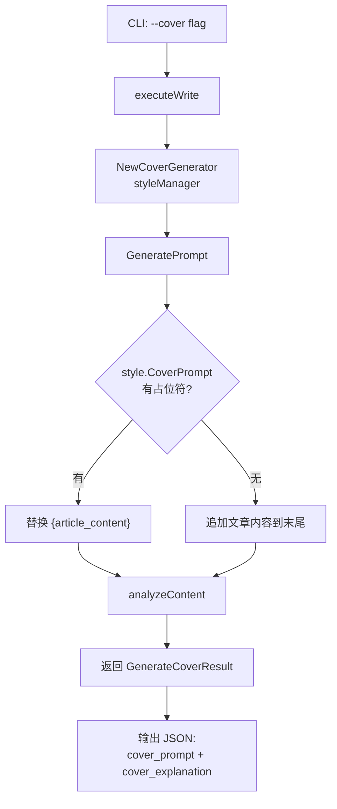
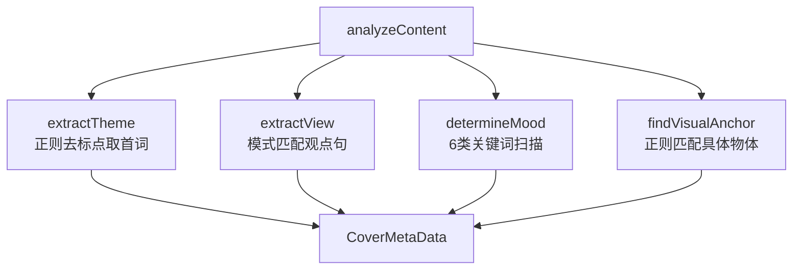

# PD-195.01 md2wechat-skill — 风格驱动封面 Prompt 生成

> 文档编号：PD-195.01
> 来源：md2wechat-skill `internal/writer/cover_generator.go`
> GitHub：https://github.com/geekjourneyx/md2wechat-skill.git
> 问题域：PD-195 封面智能生成 Smart Cover Generation
> 状态：可复用方案

---

## 第 1 章 问题与动机

### 1.1 核心问题

内容创作者发布文章时，封面图片的质量直接影响点击率和传播效果。传统做法是手动选图或使用通用模板，存在三个痛点：

1. **主题脱节**：通用封面模板无法反映文章的核心观点和情绪基调
2. **风格不一致**：不同文章的封面缺乏统一的视觉语言，削弱个人品牌辨识度
3. **隐喻缺失**：好的封面应该用视觉隐喻传达文章深层含义，而非字面翻译标题

核心挑战在于：如何从文章文本中自动提取语义信息（主题、观点、情绪、视觉锚点），并将其转化为高质量的 AI 图片生成 prompt，同时保持创作者个人风格的一致性。

### 1.2 md2wechat-skill 的解法概述

md2wechat-skill 采用"风格驱动 + 内容分析"双轨架构：

1. **YAML 风格配置驱动**：封面的视觉风格（版画/水彩/极简等）、情绪基调、配色方案全部定义在 `writers/*.yaml` 中，与写作风格绑定（`writers/dan-koe.yaml:236-242`）
2. **四维内容分析**：CoverGenerator 对文章执行 CoreTheme / CoreView / Mood / VisualAnchor 四维提取（`internal/writer/cover_generator.go:57-69`）
3. **模板占位符替换**：风格 YAML 中的 `cover_prompt` 字段包含完整的 AI 角色设定 + 执行步骤 + 负向约束，通过 `{article_content}` 占位符注入文章内容（`internal/writer/cover_generator.go:40-47`）
4. **多 Provider 图片生成**：生成的 prompt 可发送到 OpenAI / Gemini / ModelScope / TuZi / OpenRouter 五种图片服务（`internal/image/provider.go:51-85`）
5. **隐喻解释输出**：除 prompt 外还输出隐喻说明，帮助创作者理解封面与文章的关联（`internal/writer/cover_generator.go:162-166`）

### 1.3 设计思想

| 设计原则 | 具体实现 | 理由 | 替代方案 |
|----------|----------|------|----------|
| 风格与内容分离 | WriterStyle YAML 定义视觉风格，CoverGenerator 分析内容 | 同一风格可复用于不同文章，新风格只需加 YAML | 硬编码风格到代码中 |
| 关键词匹配情绪检测 | 6 类情绪 × 5-6 个中文关键词的 map 扫描 | 轻量无依赖，不需要 NLP 模型 | 调用 LLM 做情绪分析（成本高） |
| Prompt 模板化 | cover_prompt 字段包含完整 AI 指令 + 占位符 | 创作者可自定义 prompt 模板，无需改代码 | 代码中拼接 prompt 字符串 |
| 多 Provider 适配 | Provider 接口 + 工厂函数按配置创建 | 不绑定单一图片服务，可按成本/质量切换 | 只支持 OpenAI |
| 降级兜底 | BuildDefaultCoverPrompt 在风格加载失败时返回基础 prompt | 保证封面生成不会因配置问题完全失败 | 直接报错退出 |

---

## 第 2 章 源码实现分析

### 2.1 架构概览

md2wechat-skill 的封面生成系统由四层组成：

```
┌─────────────────────────────────────────────────────────┐
│                    CLI 入口层                            │
│  cmd/md2wechat/write.go  --cover / --cover-only         │
├─────────────────────────────────────────────────────────┤
│                   协调层 (Assistant)                      │
│  internal/writer/assistant.go → GetStyleManager()       │
├──────────────────┬──────────────────────────────────────┤
│   风格管理层      │         封面生成层                     │
│  StyleManager    │      CoverGenerator                  │
│  style.go        │      cover_generator.go              │
│  writers/*.yaml  │  ┌──────────────────────────┐        │
│                  │  │ extractTheme()           │        │
│  LoadStyles()    │  │ extractView()            │        │
│  GetStyle()      │  │ determineMood()          │        │
│                  │  │ findVisualAnchor()       │        │
│                  │  │ GeneratePrompt()         │        │
│                  │  └──────────────────────────┘        │
├──────────────────┴──────────────────────────────────────┤
│                  图片生成层 (Provider)                    │
│  internal/image/provider.go → OpenAI/Gemini/MS/TuZi/OR │
└─────────────────────────────────────────────────────────┘
```

### 2.2 核心实现

#### 2.2.1 封面生成主流程



对应源码 `internal/writer/cover_generator.go:22-54`：

```go
func (cg *CoverGenerator) GeneratePrompt(req *GenerateCoverRequest) (*GenerateCoverResult, error) {
	// 获取风格
	style, err := cg.styleManager.GetStyle(req.StyleName)
	if err != nil {
		return &GenerateCoverResult{
			Success: false,
			Error:   err.Error(),
		}, nil
	}

	// 构建文章内容
	content := req.ArticleContent
	if req.ArticleTitle != "" {
		content = fmt.Sprintf("标题：%s\n\n内容：%s", req.ArticleTitle, req.ArticleContent)
	}

	// 使用风格的封面提示词模板
	prompt := style.CoverPrompt

	// 替换占位符
	if strings.Contains(prompt, "{article_content}") {
		prompt = strings.ReplaceAll(prompt, "{article_content}", content)
	} else {
		prompt = prompt + "\n\n# 文章内容\n" + content
	}

	return &GenerateCoverResult{
		Prompt:   prompt,
		MetaData: cg.analyzeContent(req),
		Success:  true,
	}, nil
}
```

#### 2.2.2 四维内容分析



对应源码 `internal/writer/cover_generator.go:116-139`（情绪检测）：

```go
func (cg *CoverGenerator) determineMood(content string) string {
	moods := map[string][]string{
		"inspirational": {"激励", "启发", "成长", "突破", "成功", "梦想"},
		"mysterious":    {"秘密", "隐藏", "未知", "探索", "谜团"},
		"protective":    {"保护", "防御", "安全", "避免", "防范"},
		"breakthrough":  {"突破", "改变", "转型", "升级", "革新"},
		"contemplative": {"思考", "反思", "观察", "理解", "洞察"},
		"rebellious":    {"反叛", "挑战", "质疑", "不循规蹈矩", "打破"},
	}

	content = strings.ToLower(content)
	for mood, keywords := range moods {
		for _, keyword := range keywords {
			if strings.Contains(content, keyword) {
				return mood
			}
		}
	}
	return "contemplative" // 默认情绪
}
```

### 2.3 实现细节

**风格 YAML 中的封面配置**（`writers/dan-koe.yaml:236-286`）：

WriterStyle 结构体通过四个字段承载封面风格定义：

| 字段 | 类型 | 示例值 | 作用 |
|------|------|--------|------|
| `cover_style` | string | `"Victorian Woodcut / Etching (Gustave Doré style)"` | 视觉风格标识 |
| `cover_mood` | string | `"深刻、冷静、有力量"` | 整体情绪基调 |
| `cover_color_scheme` | []string | `["#000000", "#FFFFFF", "#333333", "#666666"]` | 配色方案 |
| `cover_prompt` | string | 完整 AI 指令模板（含角色设定 + 执行步骤 + 负向约束） | Prompt 模板 |

**观点提取的正则模式**（`internal/writer/cover_generator.go:89-93`）：

```go
patterns := []string{
    `我认为([^。！？\n]{5,30})`,       // "我认为" 后的观点
    `([^。！？\n]{5,30})，这是`,       // "这是" 前的判断
    `([^。！？\n]{5,30})的本质`,       // "本质" 前的定义
}
```

三条正则按优先级匹配，fallback 到取第一句话或截取前 50 字。

**多 Provider 工厂模式**（`internal/image/provider.go:51-85`）：

```go
func NewProvider(cfg *config.Config) (Provider, error) {
    switch cfg.ImageProvider {
    case "tuzi":       return NewTuZiProvider(cfg)
    case "modelscope": return NewModelScopeProvider(cfg)
    case "openrouter": return NewOpenRouterProvider(cfg)
    case "gemini":     return NewGeminiProvider(cfg)
    case "openai", "": return NewOpenAIProvider(cfg) // 默认
    }
}
```

Provider 接口只有两个方法：`Name() string` 和 `Generate(ctx, prompt) (*GenerateResult, error)`，极简设计。


---

## 第 3 章 迁移指南

### 3.1 迁移清单

**阶段一：核心结构（必须）**

- [ ] 定义 CoverMetaData 结构体（主题、观点、情绪、视觉锚点）
- [ ] 定义 CoverRequest / CoverResult 数据结构
- [ ] 实现 CoverGenerator 类，注入 StyleManager
- [ ] 实现四维内容分析方法（extractTheme / extractView / determineMood / findVisualAnchor）
- [ ] 实现 GeneratePrompt 主方法（模板加载 + 占位符替换）

**阶段二：风格配置（推荐）**

- [ ] 设计 YAML 风格配置 schema（cover_style / cover_mood / cover_color_scheme / cover_prompt）
- [ ] 实现 StyleManager 的 YAML 加载和多路径搜索
- [ ] 创建至少一个默认风格 YAML 文件

**阶段三：图片生成对接（可选）**

- [ ] 定义 Provider 接口（Name + Generate）
- [ ] 实现至少一个 Provider（如 OpenAI）
- [ ] 实现 Provider 工厂函数

### 3.2 适配代码模板

以下 Python 模板可直接复用，实现 md2wechat-skill 的核心封面生成逻辑：

```python
"""封面智能生成器 — 移植自 md2wechat-skill CoverGenerator"""
import re
import yaml
from dataclasses import dataclass, field
from pathlib import Path
from typing import Optional


@dataclass
class CoverMetaData:
    """封面元数据：四维内容分析结果"""
    core_theme: str = ""
    core_view: str = ""
    mood: str = "contemplative"
    visual_anchor: str = ""


@dataclass
class CoverResult:
    """封面生成结果"""
    prompt: str = ""
    explanation: str = ""
    metadata: CoverMetaData = field(default_factory=CoverMetaData)
    success: bool = False
    error: str = ""


@dataclass
class WriterCoverStyle:
    """从 YAML 加载的封面风格定义"""
    cover_prompt: str = ""
    cover_style: str = ""
    cover_mood: str = ""
    cover_color_scheme: list[str] = field(default_factory=list)


# 情绪关键词映射（移植自 cover_generator.go:118-125）
MOOD_KEYWORDS: dict[str, list[str]] = {
    "inspirational": ["激励", "启发", "成长", "突破", "成功", "梦想"],
    "mysterious":    ["秘密", "隐藏", "未知", "探索", "谜团"],
    "protective":    ["保护", "防御", "安全", "避免", "防范"],
    "breakthrough":  ["突破", "改变", "转型", "升级", "革新"],
    "contemplative": ["思考", "反思", "观察", "理解", "洞察"],
    "rebellious":    ["反叛", "挑战", "质疑", "不循规蹈矩", "打破"],
}

# 观点提取正则（移植自 cover_generator.go:89-93）
VIEW_PATTERNS = [
    r"我认为([^。！？\n]{5,30})",
    r"([^。！？\n]{5,30})，这是",
    r"([^。！？\n]{5,30})的本质",
]


class CoverGenerator:
    """封面 Prompt 生成器"""

    def __init__(self, styles_dir: str = "writers"):
        self.styles: dict[str, WriterCoverStyle] = {}
        self._load_styles(styles_dir)

    def _load_styles(self, styles_dir: str) -> None:
        """加载所有 YAML 风格配置"""
        path = Path(styles_dir)
        if not path.exists():
            return
        for yaml_file in path.glob("*.yaml"):
            with open(yaml_file, "r", encoding="utf-8") as f:
                data = yaml.safe_load(f)
            name = data.get("english_name", yaml_file.stem)
            self.styles[name] = WriterCoverStyle(
                cover_prompt=data.get("cover_prompt", ""),
                cover_style=data.get("cover_style", ""),
                cover_mood=data.get("cover_mood", ""),
                cover_color_scheme=data.get("cover_color_scheme", []),
            )

    def generate_prompt(
        self, title: str, content: str, style_name: str = "dan-koe"
    ) -> CoverResult:
        """生成封面 prompt（主入口）"""
        style = self.styles.get(style_name)
        if not style or not style.cover_prompt:
            return CoverResult(error=f"风格未找到: {style_name}")

        # 构建文章内容
        article = f"标题：{title}\n\n内容：{content}" if title else content

        # 模板替换
        prompt = style.cover_prompt
        if "{article_content}" in prompt:
            prompt = prompt.replace("{article_content}", article)
        else:
            prompt = f"{prompt}\n\n# 文章内容\n{article}"

        metadata = self._analyze_content(title, content)
        return CoverResult(
            prompt=prompt,
            explanation=f"封面通过「{metadata.visual_anchor}」作为视觉锚点，"
                        f"表达「{metadata.core_view}」的核心观点",
            metadata=metadata,
            success=True,
        )

    def _analyze_content(self, title: str, content: str) -> CoverMetaData:
        """四维内容分析"""
        full = f"{title} {content}" if title else content
        return CoverMetaData(
            core_theme=self._extract_theme(full),
            core_view=self._extract_view(full),
            mood=self._determine_mood(full),
            visual_anchor=self._find_visual_anchor(full),
        )

    def _extract_theme(self, content: str) -> str:
        cleaned = re.sub(r"[^\w\s\u4e00-\u9fff]+", "", content)
        words = cleaned.split()
        return words[0] if words else "主题"

    def _extract_view(self, content: str) -> str:
        for pattern in VIEW_PATTERNS:
            m = re.search(pattern, content)
            if m:
                return m.group(1).strip()
        sentences = re.split(r"[。！？\n]", content, maxsplit=1)
        if sentences and len(sentences[0].strip()) > 5:
            return sentences[0].strip()
        return content[:50] + "..." if len(content) > 50 else content

    def _determine_mood(self, content: str) -> str:
        lower = content.lower()
        for mood, keywords in MOOD_KEYWORDS.items():
            for kw in keywords:
                if kw in lower:
                    return mood
        return "contemplative"

    def _find_visual_anchor(self, content: str) -> str:
        patterns = [
            r"([一个一二三四五六七八九十\d]+只?[\u4e00-\u9fff]{2,6})",
            r"[\u4e00-\u9fff]{2,6}人",
        ]
        for pattern in patterns:
            m = re.search(pattern, content)
            if m:
                return m.group(1) if m.lastindex else m.group(0)
        return "元素"
```

### 3.3 适用场景

| 场景 | 适用度 | 说明 |
|------|--------|------|
| 微信公众号文章封面 | ⭐⭐⭐ | 原生场景，直接适配 |
| 博客/Newsletter 封面 | ⭐⭐⭐ | 修改 prompt 模板即可适配不同尺寸 |
| 社交媒体配图 | ⭐⭐ | 需调整比例和风格约束 |
| 电商产品图 | ⭐ | 需要完全不同的 prompt 模板 |
| 多语言内容 | ⭐⭐ | 情绪关键词需扩展为目标语言 |

---

## 第 4 章 测试用例

```python
import pytest
from cover_generator import CoverGenerator, CoverMetaData, CoverResult, MOOD_KEYWORDS


class TestDetermineMood:
    """测试情绪基调判定（对应 cover_generator.go:116-139）"""

    def test_inspirational_mood(self):
        gen = CoverGenerator.__new__(CoverGenerator)
        gen.styles = {}
        assert gen._determine_mood("这篇文章关于个人成长和突破") == "inspirational"

    def test_rebellious_mood(self):
        gen = CoverGenerator.__new__(CoverGenerator)
        gen.styles = {}
        assert gen._determine_mood("我们需要挑战传统观念，打破常规") == "rebellious"

    def test_default_contemplative(self):
        gen = CoverGenerator.__new__(CoverGenerator)
        gen.styles = {}
        assert gen._determine_mood("今天天气不错") == "contemplative"

    def test_all_moods_have_keywords(self):
        for mood, keywords in MOOD_KEYWORDS.items():
            assert len(keywords) >= 4, f"{mood} 关键词不足"


class TestExtractView:
    """测试观点提取（对应 cover_generator.go:86-114）"""

    def test_explicit_view(self):
        gen = CoverGenerator.__new__(CoverGenerator)
        gen.styles = {}
        result = gen._extract_view("我认为自律是一个伪命题")
        assert "自律" in result

    def test_essence_pattern(self):
        gen = CoverGenerator.__new__(CoverGenerator)
        gen.styles = {}
        result = gen._extract_view("拖延的本质是恐惧")
        assert "拖延" in result

    def test_fallback_first_sentence(self):
        gen = CoverGenerator.__new__(CoverGenerator)
        gen.styles = {}
        result = gen._extract_view("这是一个很长的句子用来测试降级逻辑。后面还有更多内容。")
        assert "很长的句子" in result

    def test_short_content_no_crash(self):
        gen = CoverGenerator.__new__(CoverGenerator)
        gen.styles = {}
        result = gen._extract_view("短")
        assert result == "短"


class TestGeneratePrompt:
    """测试 Prompt 生成主流程（对应 cover_generator.go:22-54）"""

    def test_placeholder_replacement(self, tmp_path):
        # 创建临时风格文件
        style_dir = tmp_path / "writers"
        style_dir.mkdir()
        (style_dir / "test.yaml").write_text(
            'english_name: test\ncover_prompt: "生成封面：{article_content}"\n'
            'cover_style: "test"\ncover_mood: "calm"\n',
            encoding="utf-8",
        )
        gen = CoverGenerator(str(style_dir))
        result = gen.generate_prompt("测试标题", "测试内容", "test")
        assert result.success
        assert "测试标题" in result.prompt
        assert "测试内容" in result.prompt

    def test_missing_style_returns_error(self):
        gen = CoverGenerator.__new__(CoverGenerator)
        gen.styles = {}
        result = gen.generate_prompt("标题", "内容", "nonexistent")
        assert not result.success
        assert "未找到" in result.error

    def test_no_placeholder_appends_content(self, tmp_path):
        style_dir = tmp_path / "writers"
        style_dir.mkdir()
        (style_dir / "test.yaml").write_text(
            'english_name: test\ncover_prompt: "生成封面"\n'
            'cover_style: "test"\ncover_mood: "calm"\n',
            encoding="utf-8",
        )
        gen = CoverGenerator(str(style_dir))
        result = gen.generate_prompt("标题", "内容", "test")
        assert result.success
        assert "# 文章内容" in result.prompt


class TestFindVisualAnchor:
    """测试视觉锚点发现（对应 cover_generator.go:141-160）"""

    def test_quantity_object_pattern(self):
        gen = CoverGenerator.__new__(CoverGenerator)
        gen.styles = {}
        result = gen._find_visual_anchor("桌上放着一个沙漏")
        assert "沙漏" in result or "一个" in result

    def test_default_anchor(self):
        gen = CoverGenerator.__new__(CoverGenerator)
        gen.styles = {}
        result = gen._find_visual_anchor("abstract concept without objects")
        assert result == "元素"
```


---

## 第 5 章 跨域关联

| 关联域 | 关系类型 | 说明 |
|--------|----------|------|
| PD-04 工具系统 | 协同 | CoverGenerator 作为 Writer 子系统的工具组件，通过 Assistant 协调器统一调度；Provider 接口是工具系统设计的典型实践 |
| PD-01 上下文管理 | 依赖 | cover_prompt 模板 + 文章全文注入会消耗大量 token，长文章场景需要上下文窗口管理策略 |
| PD-06 记忆持久化 | 协同 | WriterStyle 的 YAML 配置本质上是创作者偏好的持久化记忆，StyleManager 的多路径搜索实现了配置的分层存储 |
| PD-11 可观测性 | 协同 | GenerateCoverResult 中的 MetaData 字段（主题/观点/情绪/锚点）可作为封面生成质量的可观测指标 |
| PD-03 容错与重试 | 依赖 | 图片 Provider 的网络调用需要重试机制；BuildDefaultCoverPrompt 是风格加载失败时的降级兜底 |

---

## 第 6 章 来源文件索引

| 文件 | 行范围 | 关键实现 |
|------|--------|----------|
| `internal/writer/cover_generator.go` | L1-327 | CoverGenerator 完整实现：GeneratePrompt、analyzeContent、determineMood、findVisualAnchor、ExplainMetaphor |
| `internal/writer/types.go` | L89-105 | GenerateCoverRequest / GenerateCoverResult 数据结构定义 |
| `internal/writer/types.go` | L108-144 | WriterStyle 结构体，含 CoverPrompt / CoverStyle / CoverMood / CoverColorScheme 字段 |
| `internal/writer/types.go` | L181-187 | CoverMetaData 结构体（CoreTheme / CoreView / Mood / VisualAnchor） |
| `internal/writer/style.go` | L14-18 | StyleManager 结构体定义 |
| `internal/writer/style.go` | L28-61 | LoadStyles：YAML 文件扫描与加载 |
| `internal/writer/style.go` | L96-117 | getWritersDir：三路径优先级搜索（./writers → ~/.config → ~/） |
| `internal/writer/assistant.go` | L10-14 | Assistant 协调器，持有 StyleManager 引用 |
| `cmd/md2wechat/write.go` | L294-305 | CLI 入口：--cover / --cover-only flag 触发封面生成 |
| `writers/dan-koe.yaml` | L236-286 | Dan Koe 风格的封面配置：Victorian Woodcut 风格 + 完整 prompt 模板 |
| `internal/image/provider.go` | L11-19 | Provider 接口定义（Name + Generate） |
| `internal/image/provider.go` | L51-85 | NewProvider 工厂函数：5 种图片服务适配 |
| `internal/image/openai.go` | L53-137 | OpenAI Provider 的 Generate 实现 |

---

## 第 7 章 横向对比维度

```json comparison_data
{
  "project": "md2wechat-skill",
  "dimensions": {
    "内容分析方式": "关键词匹配四维分析（主题/观点/情绪/锚点），无外部NLP依赖",
    "Prompt构建策略": "YAML模板占位符替换，含完整AI角色设定+负向约束",
    "风格管理": "WriterStyle YAML配置驱动，三路径优先级搜索加载",
    "图片生成对接": "Provider接口+工厂模式，支持5种服务（OpenAI/Gemini/MS/TuZi/OR）",
    "降级机制": "BuildDefaultCoverPrompt兜底，风格加载失败返回基础英文prompt",
    "隐喻系统": "ExplainMetaphor输出视觉锚点与观点的关联说明"
  }
}
```

### 域元数据补充

```json domain_metadata
{
  "solution_summary": "md2wechat-skill 用 YAML 风格模板 + 四维关键词分析（主题/观点/情绪/锚点）生成封面 AI prompt，支持 5 种图片 Provider 和隐喻解释输出",
  "description": "将创作者视觉风格与文章语义分析解耦，实现风格可配置的封面prompt生成",
  "sub_problems": [
    "封面风格与写作风格的绑定管理",
    "多图片生成服务的统一适配",
    "Prompt模板的负向约束设计"
  ],
  "best_practices": [
    "YAML配置驱动封面风格，与代码逻辑分离",
    "轻量关键词匹配替代LLM情绪分析降低成本",
    "Provider接口+工厂模式实现多图片服务切换"
  ]
}
```

