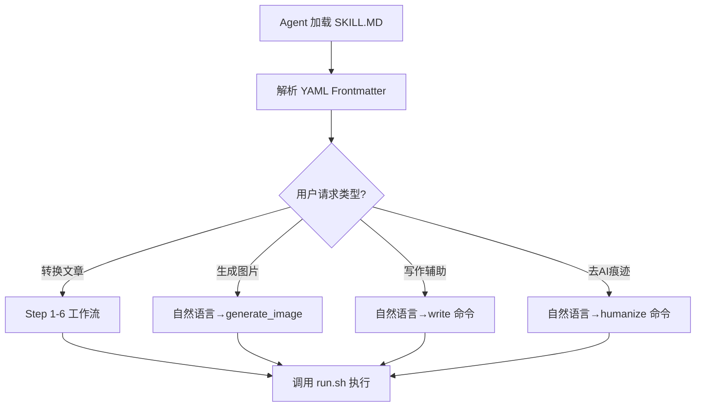
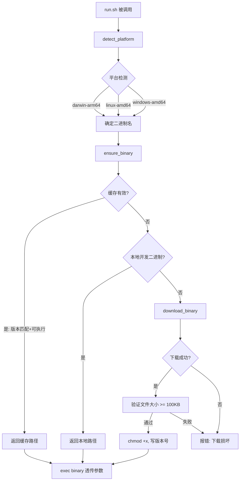
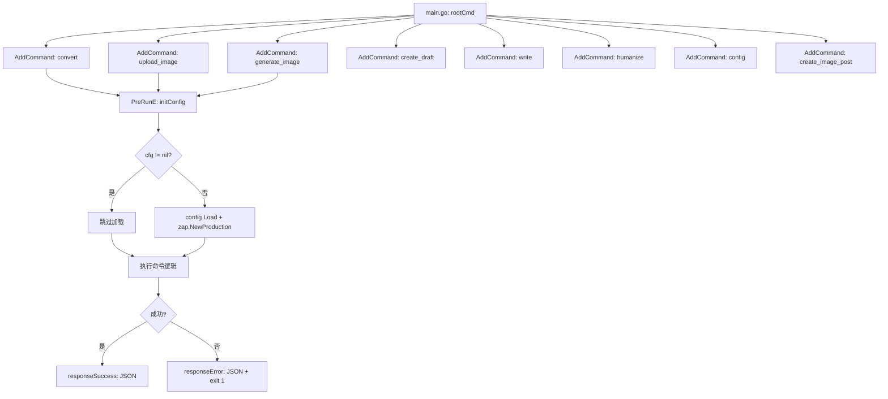

# PD-196.01 md2wechat-skill — SKILL.MD 工作流驱动与 run.sh 二进制自动分发

> 文档编号：PD-196.01
> 来源：md2wechat-skill `skills/md2wechat/SKILL.md`, `skills/md2wechat/scripts/run.sh`, `cmd/md2wechat/main.go`
> GitHub：https://github.com/geekjourneyx/md2wechat-skill.git
> 问题域：PD-196 CLI 技能化架构
> 状态：可复用方案

---

## 第 1 章 问题与动机（Problem & Motivation）

### 1.1 核心问题

AI Agent（如 Claude Code）需要调用外部 CLI 工具来完成特定任务（如 Markdown 转微信公众号 HTML），但面临三个关键挑战：

1. **工作流定义**：Agent 如何知道一个复杂任务的完整步骤？传统 CLI 只暴露命令，不暴露工作流语义。
2. **二进制分发**：Go/Rust 编译的 CLI 工具如何在用户机器上零配置可用？不能假设用户有 Go 工具链。
3. **自然语言桥接**：用户用自然语言描述需求（"帮我把文章发到公众号"），Agent 如何映射到具体的 CLI 命令序列？

这三个问题的本质是：**如何让一个编译型 CLI 工具变成 AI Agent 的"技能"**。

### 1.2 md2wechat-skill 的解法概述

md2wechat-skill 采用三层架构解决上述问题：

1. **SKILL.MD 工作流层**（`skills/md2wechat/SKILL.md:1-832`）：用 YAML frontmatter 定义元数据 + Markdown 定义 6 步工作流 + 自然语言示例，让 Agent 理解"做什么"和"怎么做"
2. **run.sh 二进制分发层**（`skills/md2wechat/scripts/run.sh:1-155`）：Shell 脚本作为统一入口，自动检测平台、下载编译好的二进制、缓存版本、透传所有参数
3. **cobra CLI 命令层**（`cmd/md2wechat/main.go:40-186`）：Go 编译的二进制提供结构化子命令（convert/upload_image/generate_image/write/humanize），输出 JSON 供 Agent 解析

### 1.3 设计思想

| 设计原则 | 具体实现 | 理由 | 替代方案 |
|----------|----------|------|----------|
| 工作流即文档 | SKILL.MD 同时是 Agent 指令和人类文档 | 避免维护两套文档，Agent 直接读 Markdown | 独立的 JSON Schema 定义工作流 |
| 零安装启动 | run.sh 自动下载平台二进制到 `~/.cache/md2wechat/bin/` | 用户无需 Go 工具链，首次运行即可用 | Docker 容器化（太重）/ npm 包装（多一层依赖） |
| JSON 协议通信 | 所有命令输出 `{"success": true/false, "data": {...}}` | Agent 可靠解析结构化输出，不依赖 stdout 文本解析 | 纯文本输出（Agent 解析不稳定） |
| 自然语言示例驱动 | SKILL.MD 中大量 "User: ..." / "I will: ..." 示例 | Few-shot 让 Agent 学会意图到命令的映射 | 独立的 intent-to-command 映射表 |
| 延迟配置加载 | `initConfig()` 在 PreRunE 中调用，help 命令无需配置 | 降低首次使用门槛，`--help` 不报错 | 全局 init 强制加载（help 也需要配置文件） |

---

## 第 2 章 源码实现分析（Source Code Analysis）

### 2.1 架构概览

```
┌─────────────────────────────────────────────────────────────────────┐
│                    md2wechat-skill 三层架构                          │
├─────────────────────────────────────────────────────────────────────┤
│                                                                      │
│  Layer 1: SKILL.MD (Agent 工作流定义)                                │
│  ┌───────────────────────────────────────────────────────────────┐  │
│  │  YAML Frontmatter → name, description, metadata              │  │
│  │  6-Step Workflow  → Analyze → Confirm → Generate → Image     │  │
│  │                     → Replace → Preview/Upload                │  │
│  │  NL Examples      → "Help me convert article.md"             │  │
│  │  References       → themes.md, html-guide.md, wechat-api.md  │  │
│  └───────────────────────────────────────────────────────────────┘  │
│                              │ Agent 读取                           │
│                              ▼                                      │
│  Layer 2: run.sh (二进制分发 + 命令路由)                             │
│  ┌───────────────────────────────────────────────────────────────┐  │
│  │  detect_platform() → darwin-arm64 / linux-amd64 / ...        │  │
│  │  ensure_binary()   → cache check → local dev → download      │  │
│  │  main()            → exec "$binary" "$@"                     │  │
│  └───────────────────────────────────────────────────────────────┘  │
│                              │ exec 透传                            │
│                              ▼                                      │
│  Layer 3: Go Binary (cobra CLI)                                     │
│  ┌───────────────────────────────────────────────────────────────┐  │
│  │  rootCmd                                                      │  │
│  │  ├── convert      → Markdown → WeChat HTML                   │  │
│  │  ├── upload_image → Local file → WeChat CDN                  │  │
│  │  ├── download_and_upload → URL → WeChat CDN                  │  │
│  │  ├── generate_image → AI prompt → Image → WeChat CDN         │  │
│  │  ├── create_draft → JSON → WeChat Draft                      │  │
│  │  ├── write        → Style-assisted writing                   │  │
│  │  ├── humanize     → AI trace removal                         │  │
│  │  ├── config       → init / show                              │  │
│  │  └── create_image_post → 小绿书图片消息                       │  │
│  │                                                               │  │
│  │  Output: JSON { "success": bool, "data": {...} }             │  │
│  └───────────────────────────────────────────────────────────────┘  │
│                                                                      │
└─────────────────────────────────────────────────────────────────────┘
```

### 2.2 核心实现

#### 2.2.1 SKILL.MD 工作流定义

SKILL.MD 是整个技能化架构的核心——它既是 Agent 的"操作手册"，也是人类的使用文档。



对应源码 `skills/md2wechat/SKILL.md:1-5`（YAML Frontmatter）：

```yaml
---
name: md2wechat
description: Convert Markdown to WeChat Official Account HTML. Supports API mode (fast) and AI mode (themed). Features writer style assistant, AI trace removal (humanizer), and draft upload.
metadata: {"openclaw": {"emoji": "📝", "homepage": "https://github.com/geekjourneyx/md2wechat-skill", "requires": {"anyBins": ["curl", "wget"]}, "primaryEnv": "IMAGE_API_KEY"}}
---
```

关键设计点：
- `metadata.openclaw.requires.anyBins` 声明运行时依赖（curl 或 wget），用于 run.sh 下载二进制
- `metadata.openclaw.primaryEnv` 声明主要环境变量，Agent 可提示用户配置
- 6 步工作流（`SKILL.MD:129-141`）用 Markdown checklist 定义，Agent 可逐步执行并勾选

#### 2.2.2 run.sh 二进制自动分发

run.sh 是"零安装"体验的关键——用户无需手动下载二进制，首次调用自动完成。



对应源码 `skills/md2wechat/scripts/run.sh:29-46`（平台检测）：

```bash
detect_platform() {
    local os arch
    os=$(uname -s | tr '[:upper:]' '[:lower:]')
    arch=$(uname -m)
    case "$arch" in
        x86_64|amd64) arch="amd64" ;;
        arm64|aarch64) arch="arm64" ;;
        *) echo "Unsupported architecture: $arch" >&2; return 1 ;;
    esac
    case "$os" in
        darwin|linux) echo "${os}-${arch}" ;;
        msys*|mingw*|cygwin*) echo "windows-${arch}" ;;
        *) echo "Unsupported OS: $os" >&2; return 1 ;;
    esac
}
```

对应源码 `skills/md2wechat/scripts/run.sh:101-142`（三级查找策略）：

```bash
ensure_binary() {
    local platform
    platform=$(detect_platform) || return 1
    local binary
    binary=$(get_binary_path "$platform")
    # Fast path: valid cache
    if is_cache_valid "$binary"; then
        echo "$binary"
        return 0
    fi
    # Try local development binary
    local script_dir
    script_dir="$(cd "$(dirname "${BASH_SOURCE[0]}")" && pwd)"
    local local_binary="${script_dir}/bin/${BINARY_NAME}-${platform}"
    if [[ -x "$local_binary" ]]; then
        echo "$local_binary"
        return 0
    fi
    # Download
    mkdir -p "$BIN_DIR" 2>/dev/null || { ... }
    if download_binary "$platform" "$binary"; then
        echo "$binary"
        return 0
    fi
    ...
}
```

#### 2.2.3 cobra CLI 命令注册与 JSON 输出协议



对应源码 `cmd/md2wechat/main.go:188-213`（统一 JSON 输出）：

```go
func responseSuccess(data any) {
    response := map[string]any{
        "success": true,
        "data":    data,
    }
    printJSON(response)
}

func responseError(err error) {
    response := map[string]any{
        "success": false,
        "error":   err.Error(),
    }
    printJSON(response)
    os.Exit(1)
}

func printJSON(v any) {
    encoder := json.NewEncoder(os.Stdout)
    encoder.SetIndent("", "  ")
    encoder.SetEscapeHTML(false)
    if err := encoder.Encode(v); err != nil {
        fmt.Fprintf(os.Stderr, "JSON encode error: %v\n", err)
        os.Exit(1)
    }
}
```

### 2.3 实现细节

#### 配置三级优先级

配置加载遵循 `环境变量 > 配置文件 > 默认值` 的优先级链（`internal/config/config.go:76-128`）：

1. 默认值硬编码在 `LoadWithDefaults` 中（如 `ImageProvider: "openai"`, `MaxImageWidth: 1920`）
2. 配置文件搜索路径：`~/.config/md2wechat/config.yaml` → `~/.md2wechat.yaml` → `./md2wechat.yaml`
3. 环境变量通过 `loadFromEnv()` 覆盖（`config.go:301-350`）

#### Provider 策略模式

图片生成支持 5 个 Provider（`internal/image/provider.go:51-85`），通过 `Provider` 接口统一：

```go
type Provider interface {
    Name() string
    Generate(ctx context.Context, prompt string) (*GenerateResult, error)
}
```

工厂函数 `NewProvider` 根据 `cfg.ImageProvider` 字符串路由到具体实现（openai/tuzi/modelscope/openrouter/gemini）。

#### GitHub Actions 自动发布

`.github/workflows/release.yml` 在 tag push 时自动构建 5 个平台二进制（linux-amd64/arm64, darwin-amd64/arm64, windows-amd64），生成 checksums，创建 GitHub Release。run.sh 从 Release 下载对应平台二进制。


---

## 第 3 章 迁移指南（Migration Guide）

### 3.1 迁移清单

将 md2wechat-skill 的 CLI 技能化架构迁移到你自己的项目，分三个阶段：

**阶段 1：SKILL.MD 工作流定义**
- [ ] 创建 `skills/<your-tool>/SKILL.md`
- [ ] 编写 YAML frontmatter（name, description, metadata）
- [ ] 定义工作流步骤（Step 1-N），每步包含目标、操作、示例
- [ ] 添加自然语言示例（"User: ..." / "I will: ..."）
- [ ] 添加 references 子目录存放补充文档

**阶段 2：run.sh 二进制分发**
- [ ] 创建 `skills/<your-tool>/scripts/run.sh`
- [ ] 实现 `detect_platform()` 平台检测
- [ ] 实现 `ensure_binary()` 三级查找（缓存→本地→下载）
- [ ] 配置 GitHub Actions 自动构建多平台二进制
- [ ] 设置 GitHub Release 发布流程

**阶段 3：CLI 命令层**
- [ ] 使用 cobra 定义子命令结构
- [ ] 实现统一 JSON 输出协议（success/error）
- [ ] 实现 `PreRunE` 延迟配置加载
- [ ] 实现配置三级优先级（env > file > default）

### 3.2 适配代码模板

#### SKILL.MD 模板

```markdown
---
name: your-tool
description: One-line description of what this tool does.
metadata: {"openclaw": {"emoji": "🔧", "homepage": "https://github.com/you/your-tool", "requires": {"anyBins": ["curl", "wget"]}, "primaryEnv": "YOUR_API_KEY"}}
---

# Your Tool Name

Brief description of the tool's purpose.

## Quick Start

\`\`\`bash
bash skills/your-tool/scripts/run.sh <subcommand> [args]
\`\`\`

## Workflow Checklist

\`\`\`
Progress:
- [ ] Step 1: Validate input
- [ ] Step 2: Process data
- [ ] Step 3: Output result
\`\`\`

## Step 1: Validate Input

| Element | How to Extract |
|---------|----------------|
| **Input File** | First argument |
| **Config** | Environment variables or config file |

## Step 2: Process Data

\`\`\`bash
bash skills/your-tool/scripts/run.sh process input.txt
\`\`\`

## Step 3: Output Result

Ask user: preview or save?

## CLI Commands Reference

\`\`\`bash
bash skills/your-tool/scripts/run.sh --help
bash skills/your-tool/scripts/run.sh process input.txt --preview
bash skills/your-tool/scripts/run.sh process input.txt --output result.json
\`\`\`
```

#### run.sh 模板

```bash
#!/bin/bash
set -e

VERSION="1.0.0"
REPO="you/your-tool"
BINARY_NAME="your-tool"
CACHE_DIR="${XDG_CACHE_HOME:-${HOME}/.cache}/your-tool"
BIN_DIR="${CACHE_DIR}/bin"
VERSION_FILE="${CACHE_DIR}/.version"
MIN_BINARY_SIZE=102400

detect_platform() {
    local os arch
    os=$(uname -s | tr '[:upper:]' '[:lower:]')
    arch=$(uname -m)
    case "$arch" in
        x86_64|amd64) arch="amd64" ;;
        arm64|aarch64) arch="arm64" ;;
        *) echo "Unsupported architecture: $arch" >&2; return 1 ;;
    esac
    case "$os" in
        darwin|linux) echo "${os}-${arch}" ;;
        msys*|mingw*|cygwin*) echo "windows-${arch}" ;;
        *) echo "Unsupported OS: $os" >&2; return 1 ;;
    esac
}

get_binary_path() {
    local platform=$1
    local path="${BIN_DIR}/${BINARY_NAME}-${platform}"
    [[ "$platform" == windows-* ]] && path="${path}.exe"
    echo "$path"
}

is_cache_valid() {
    local binary=$1
    [[ -x "$binary" ]] && [[ -f "$VERSION_FILE" ]] && \
    [[ "$(cat "$VERSION_FILE" 2>/dev/null)" == "$VERSION" ]]
}

download_binary() {
    local platform=$1 binary=$2
    local bin_name="${BINARY_NAME}-${platform}"
    [[ "$platform" == windows-* ]] && bin_name="${bin_name}.exe"
    local url="https://github.com/${REPO}/releases/download/v${VERSION}/${bin_name}"
    local temp_file="${binary}.tmp"
    echo "  Downloading ${BINARY_NAME} v${VERSION} for ${platform}..." >&2
    if command -v curl &>/dev/null; then
        curl -fsSL --connect-timeout 15 --max-time 120 -o "$temp_file" "$url"
    elif command -v wget &>/dev/null; then
        wget -q --timeout=120 -O "$temp_file" "$url"
    else
        echo "  Error: curl or wget required" >&2; return 1
    fi
    local size; size=$(wc -c < "$temp_file" | tr -d ' ') || size=0
    if [[ $size -lt $MIN_BINARY_SIZE ]]; then
        rm -f "$temp_file"; echo "  Error: Download corrupted" >&2; return 1
    fi
    mv "$temp_file" "$binary"; chmod +x "$binary"
    echo "$VERSION" > "$VERSION_FILE"; echo "  Ready!" >&2
}

ensure_binary() {
    local platform; platform=$(detect_platform) || return 1
    local binary; binary=$(get_binary_path "$platform")
    if is_cache_valid "$binary"; then echo "$binary"; return 0; fi
    local script_dir; script_dir="$(cd "$(dirname "${BASH_SOURCE[0]}")" && pwd)"
    local local_binary="${script_dir}/bin/${BINARY_NAME}-${platform}"
    if [[ -x "$local_binary" ]]; then echo "$local_binary"; return 0; fi
    mkdir -p "$BIN_DIR" 2>/dev/null || return 1
    if download_binary "$platform" "$binary"; then echo "$binary"; return 0; fi
    return 1
}

main() {
    local binary; binary=$(ensure_binary) || exit 1
    exec "$binary" "$@"
}

main "$@"
```

#### Go CLI JSON 输出模板

```go
package main

import (
    "encoding/json"
    "fmt"
    "os"
    "github.com/spf13/cobra"
)

func responseSuccess(data any) {
    response := map[string]any{"success": true, "data": data}
    encoder := json.NewEncoder(os.Stdout)
    encoder.SetIndent("", "  ")
    encoder.SetEscapeHTML(false)
    encoder.Encode(response)
}

func responseError(err error) {
    response := map[string]any{"success": false, "error": err.Error()}
    encoder := json.NewEncoder(os.Stdout)
    encoder.SetIndent("", "  ")
    encoder.Encode(response)
    os.Exit(1)
}

var cfg *Config

func initConfig() error {
    if cfg != nil { return nil }
    var err error
    cfg, err = LoadConfig()
    return err
}

func main() {
    rootCmd := &cobra.Command{Use: "your-tool", SilenceErrors: true, SilenceUsage: true}
    processCmd := &cobra.Command{
        Use: "process <input>", Args: cobra.ExactArgs(1),
        PreRunE: func(cmd *cobra.Command, args []string) error { return initConfig() },
        Run: func(cmd *cobra.Command, args []string) {
            result, err := doProcess(args[0])
            if err != nil { responseError(err); return }
            responseSuccess(result)
        },
    }
    rootCmd.AddCommand(processCmd)
    if err := rootCmd.Execute(); err != nil { responseError(err); os.Exit(1) }
}
```

### 3.3 适用场景

| 场景 | 适用度 | 说明 |
|------|--------|------|
| Go/Rust 编译型 CLI 工具接入 Agent | ⭐⭐⭐ | 完美匹配：二进制分发 + SKILL.MD 工作流 |
| Python/Node 脚本工具接入 Agent | ⭐⭐ | SKILL.MD 工作流适用，run.sh 改为检查 runtime 而非下载二进制 |
| 多步骤复杂工作流（如发布流程） | ⭐⭐⭐ | SKILL.MD 的 Step 1-N + checklist 非常适合 |
| 简单单命令工具 | ⭐ | 过度设计，直接写 tool description 即可 |
| 需要跨平台分发的 CLI 工具 | ⭐⭐⭐ | run.sh + GitHub Actions Release 是成熟方案 |
| 需要多 Provider 切换的工具 | ⭐⭐⭐ | Provider 接口 + 配置路由模式可直接复用 |

---

## 第 4 章 测试用例（Test Cases）

```python
import subprocess
import json
import os
import tempfile
import pytest


class TestRunShBinaryProvisioning:
    """测试 run.sh 二进制分发机制"""

    def test_detect_platform_returns_valid_format(self):
        """平台检测应返回 os-arch 格式"""
        result = subprocess.run(
            ["bash", "-c", "source run.sh && detect_platform"],
            capture_output=True, text=True,
            cwd="skills/md2wechat/scripts"
        )
        platform = result.stdout.strip()
        assert "-" in platform
        os_part, arch_part = platform.split("-", 1)
        assert os_part in ("darwin", "linux", "windows")
        assert arch_part in ("amd64", "arm64")

    def test_cache_validation_requires_version_match(self):
        """缓存验证需要版本号匹配"""
        with tempfile.TemporaryDirectory() as tmpdir:
            binary = os.path.join(tmpdir, "md2wechat-darwin-arm64")
            version_file = os.path.join(tmpdir, ".version")
            # 创建假二进制和错误版本号
            with open(binary, "w") as f:
                f.write("fake")
            os.chmod(binary, 0o755)
            with open(version_file, "w") as f:
                f.write("0.0.0")  # 版本不匹配
            # is_cache_valid 应返回 false
            result = subprocess.run(
                ["bash", "-c", f'''
                    VERSION="1.10.0"
                    VERSION_FILE="{version_file}"
                    is_cache_valid() {{
                        local binary=$1
                        [[ -x "$binary" ]] && [[ -f "$VERSION_FILE" ]] && \
                        [[ "$(cat "$VERSION_FILE" 2>/dev/null)" == "$VERSION" ]]
                    }}
                    is_cache_valid "{binary}" && echo "valid" || echo "invalid"
                '''],
                capture_output=True, text=True
            )
            assert result.stdout.strip() == "invalid"

    def test_min_binary_size_protection(self):
        """下载的二进制必须大于 MIN_BINARY_SIZE"""
        # MIN_BINARY_SIZE = 102400 (100KB)
        assert 102400 == 100 * 1024  # 验证常量


class TestCLIJSONProtocol:
    """测试 CLI JSON 输出协议"""

    def test_success_response_format(self):
        """成功响应应包含 success=true 和 data 字段"""
        # 模拟 responseSuccess 输出
        expected = {"success": True, "data": {"media_id": "xxx", "wechat_url": "https://..."}}
        assert expected["success"] is True
        assert "data" in expected

    def test_error_response_format(self):
        """错误响应应包含 success=false 和 error 字段"""
        expected = {"success": False, "error": "配置错误 [WechatAppID]: 微信公众号 AppID 未配置"}
        assert expected["success"] is False
        assert "error" in expected

    def test_config_priority_env_over_file(self):
        """环境变量应覆盖配置文件值"""
        # 验证优先级：env > file > default
        priorities = ["env", "file", "default"]
        assert priorities[0] == "env"


class TestSKILLMDWorkflow:
    """测试 SKILL.MD 工作流定义"""

    def test_yaml_frontmatter_has_required_fields(self):
        """SKILL.MD frontmatter 必须包含 name 和 description"""
        with open("skills/md2wechat/SKILL.md") as f:
            content = f.read()
        assert content.startswith("---")
        assert "name:" in content
        assert "description:" in content

    def test_workflow_has_six_steps(self):
        """工作流应定义 6 个步骤"""
        with open("skills/md2wechat/SKILL.md") as f:
            content = f.read()
        for i in range(1, 7):
            assert f"Step {i}:" in content

    def test_natural_language_examples_present(self):
        """应包含自然语言示例"""
        with open("skills/md2wechat/SKILL.md") as f:
            content = f.read()
        # 检查自然语言示例模式
        assert "I will:" in content or "I'll" in content

    def test_cli_commands_reference_present(self):
        """应包含 CLI 命令参考"""
        with open("skills/md2wechat/SKILL.md") as f:
            content = f.read()
        assert "run.sh" in content
        assert "convert" in content
        assert "upload_image" in content


class TestProviderStrategy:
    """测试 Provider 策略模式"""

    def test_supported_providers(self):
        """应支持 5 个图片生成 Provider"""
        providers = ["openai", "tuzi", "modelscope", "openrouter", "gemini"]
        assert len(providers) == 5

    def test_provider_aliases(self):
        """Provider 应支持别名"""
        aliases = {
            "ms": "modelscope",
            "or": "openrouter",
            "google": "gemini",
        }
        assert aliases["ms"] == "modelscope"
        assert aliases["google"] == "gemini"
```


---

## 第 5 章 跨域关联（Cross-Domain Relations）

| 关联域 | 关系类型 | 说明 |
|--------|----------|------|
| PD-04 工具系统 Tool System Design | 协同 | SKILL.MD 本质是一种工具注册方式，定义了工具的能力、参数和工作流。与 MCP 协议互补：MCP 定义工具接口，SKILL.MD 定义工具使用流程 |
| PD-01 上下文管理 Context Window Management | 依赖 | SKILL.MD 文件较大（832 行），Agent 加载时占用上下文窗口。references 子目录的分离设计是对上下文管理的优化——按需加载而非全量注入 |
| PD-09 Human-in-the-Loop | 协同 | SKILL.MD 的 Step 2（Confirm Mode）和 Step 6（Preview or Upload）内置了人类确认点。Agent 在这些步骤暂停等待用户决策 |
| PD-11 可观测性 Observability | 协同 | CLI 的 JSON 输出协议 + zap 结构化日志为 Agent 提供了可观测的执行状态。`responseSuccess`/`responseError` 是 Agent 判断执行结果的唯一依据 |
| PD-10 中间件管道 Middleware Pipeline | 协同 | convert 命令的执行流程（读取→转换→图片处理→替换→输出）本质是一个管道。`processImages` 函数按类型分发处理（local/online/ai）是管道中的路由节点 |

---

## 第 6 章 来源文件索引（Source File Index）

| 文件 | 行范围 | 关键实现 |
|------|--------|----------|
| `skills/md2wechat/SKILL.md` | L1-L5 | YAML Frontmatter 元数据定义 |
| `skills/md2wechat/SKILL.md` | L129-L141 | 6 步工作流 checklist |
| `skills/md2wechat/SKILL.md` | L27-L55 | 自然语言图片生成示例 |
| `skills/md2wechat/SKILL.md` | L56-L127 | 自然语言写作辅助示例 |
| `skills/md2wechat/SKILL.md` | L690-L765 | CLI 命令完整参考 |
| `skills/md2wechat/scripts/run.sh` | L29-L46 | detect_platform() 平台检测 |
| `skills/md2wechat/scripts/run.sh` | L59-L63 | is_cache_valid() 缓存验证 |
| `skills/md2wechat/scripts/run.sh` | L64-L99 | download_binary() 下载+校验 |
| `skills/md2wechat/scripts/run.sh` | L101-L142 | ensure_binary() 三级查找 |
| `skills/md2wechat/scripts/run.sh` | L148-L154 | main() exec 透传 |
| `cmd/md2wechat/main.go` | L20-L38 | initConfig() 延迟加载 |
| `cmd/md2wechat/main.go` | L40-L186 | cobra 命令注册（9 个子命令） |
| `cmd/md2wechat/main.go` | L188-L213 | JSON 输出协议（responseSuccess/Error/printJSON） |
| `cmd/md2wechat/convert.go` | L77-L148 | runConvert() 转换主流程 |
| `cmd/md2wechat/convert.go` | L184-L239 | processImages() 图片处理管道 |
| `internal/config/config.go` | L76-L128 | Load() 三级配置优先级 |
| `internal/config/config.go` | L130-L166 | findConfigFile() 配置文件搜索 |
| `internal/config/config.go` | L353-L402 | Validate() 配置验证 |
| `internal/image/provider.go` | L11-L19 | Provider 接口定义 |
| `internal/image/provider.go` | L51-L85 | NewProvider() 工厂路由 |
| `internal/image/processor.go` | L14-L40 | Processor 组合结构 |
| `internal/image/processor.go` | L140-L197 | GenerateAndUpload() AI 图片生成+上传 |
| `internal/converter/converter.go` | L67-L73 | Converter 接口定义 |
| `internal/converter/converter.go` | L94-L118 | Convert() 模式路由 |
| `internal/converter/converter.go` | L149-L196 | ExtractImages() 三类图片提取 |
| `internal/writer/generator.go` | L10-L17 | Generator 接口定义 |
| `internal/writer/generator.go` | L85-L121 | buildPrompt() AI 提示词构建 |
| `.claude-plugin/marketplace.json` | L1-L23 | OpenClaw 插件市场元数据 |
| `.github/workflows/release.yml` | L1-L80 | CI/CD 多平台构建+发布 |
| `Makefile` | L10-L33 | release 目标：5 平台交叉编译 |

---

## 第 7 章 横向对比维度

> **重要：** 本章用于自动填充 Butcher Wiki 的横向对比表。

```json comparison_data
{
  "project": "md2wechat-skill",
  "dimensions": {
    "工作流定义": "SKILL.MD 用 YAML frontmatter + Markdown 6步 checklist 定义完整工作流",
    "二进制分发": "run.sh 三级查找（缓存→本地→GitHub Release 下载），100KB 最小体积校验",
    "命令路由": "cobra 9 子命令 + PreRunE 延迟配置加载，JSON 统一输出协议",
    "自然语言映射": "SKILL.MD 内嵌大量 User/Agent 对话示例，few-shot 驱动意图识别",
    "配置管理": "三级优先级（env > YAML/JSON 配置文件 > 硬编码默认值），支持 6 个搜索路径",
    "多Provider适配": "Provider 接口 + 工厂路由，支持 5 个图片生成服务（OpenAI/TuZi/ModelScope/OpenRouter/Gemini）",
    "CI/CD集成": "GitHub Actions tag 触发，5 平台交叉编译 + checksums + 自动 Release"
  }
}
```

### 域元数据补充

```json domain_metadata
{
  "solution_summary": "md2wechat-skill 用 SKILL.MD 定义 6 步工作流 + run.sh 三级二进制查找 + cobra JSON 输出协议，实现编译型 Go CLI 的 Agent 技能化",
  "description": "编译型 CLI 工具如何通过文档驱动工作流和自动二进制分发变成 AI Agent 可调用的技能",
  "sub_problems": [
    "多 Provider 图片生成服务的统一接口与工厂路由",
    "SKILL.MD references 子目录的按需上下文加载",
    "OpenClaw 插件市场元数据与版本管理"
  ],
  "best_practices": [
    "JSON 统一输出协议让 Agent 可靠解析 CLI 执行结果",
    "PreRunE 延迟配置加载使 help 命令零配置可用",
    "GitHub Actions + run.sh 实现从 tag 到用户机器的全自动二进制分发链"
  ]
}
```
