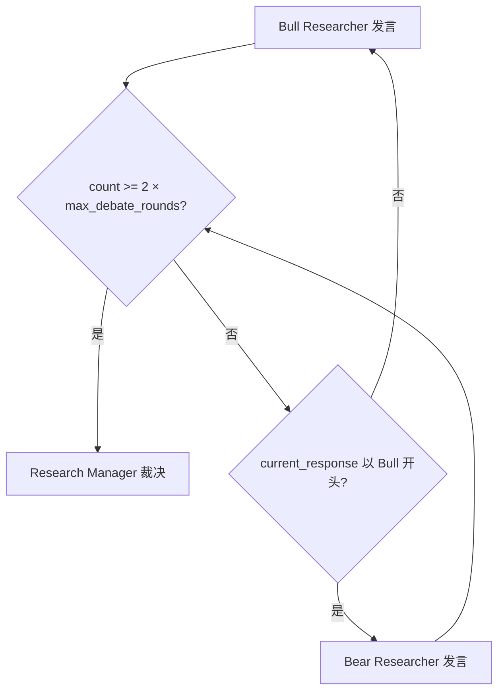
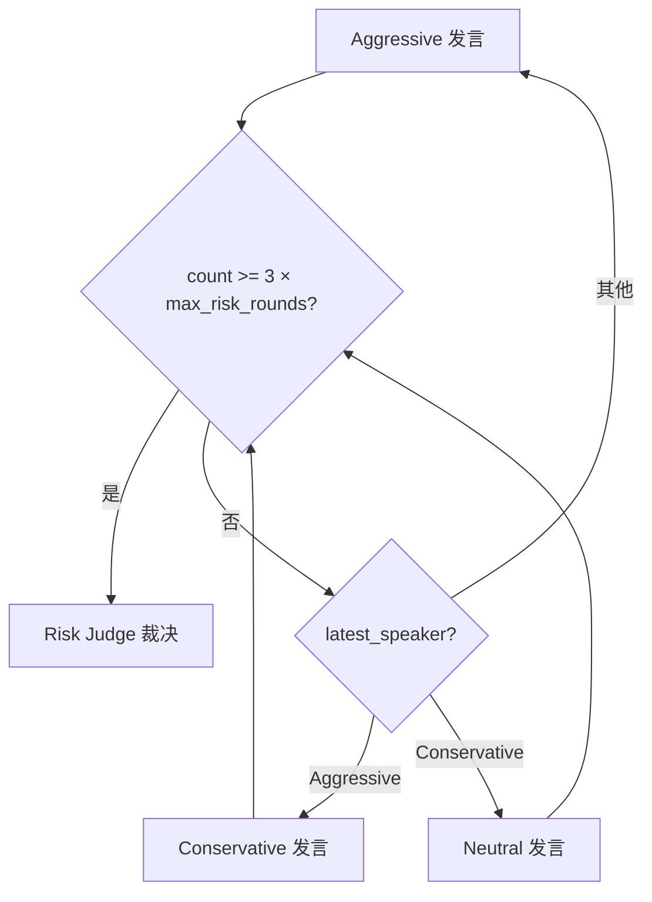
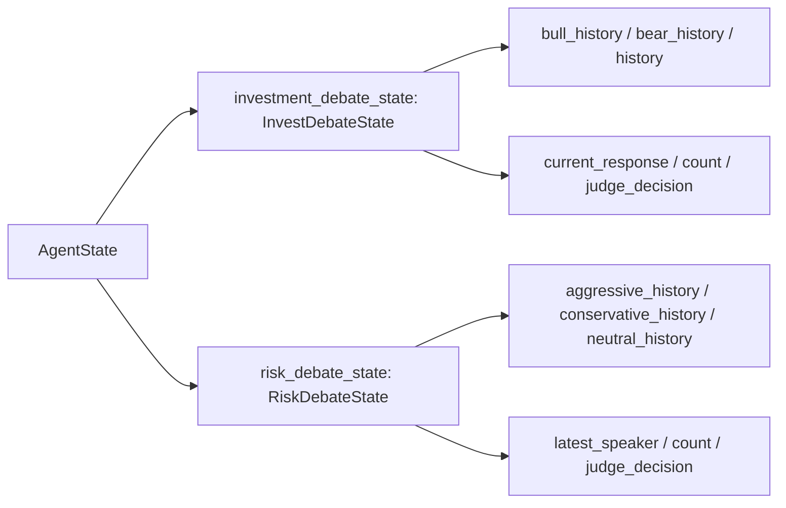

# PD-197.01 TradingAgents — 两层对抗辩论架构

> 文档编号：PD-197.01
> 来源：TradingAgents `tradingagents/graph/setup.py`, `tradingagents/graph/conditional_logic.py`
> GitHub：https://github.com/TauricResearch/TradingAgents.git
> 问题域：PD-197 对抗辩论架构 Adversarial Debate Architecture
> 状态：可复用方案

---

## 第 1 章 问题与动机

### 1.1 核心问题

在 LLM 驱动的决策系统中，单一 Agent 的输出容易受到 prompt 偏见、幻觉和过度自信的影响。当决策涉及高风险场景（如金融交易），单一视角的判断往往不够稳健。核心问题是：**如何通过结构化的多视角对抗来提升 LLM 决策质量，同时保持系统的可控性和可解释性？**

传统的 ensemble 方法（多次采样取多数）缺乏论证过程，无法产生可解释的决策链。而自由形式的多 Agent 讨论又容易陷入无限循环或达成虚假共识。TradingAgents 的对抗辩论架构解决了这个矛盾：通过预设对立立场 + 轮次控制 + 裁判仲裁，在保证对抗深度的同时控制计算成本。

### 1.2 TradingAgents 的解法概述

1. **两层辩论结构**：投资辩论（Bull vs Bear，2 角色）和风险辩论（Aggressive vs Conservative vs Neutral，3 角色），分别处理"是否投资"和"如何控制风险"两个正交问题 (`tradingagents/graph/setup.py:156-197`)
2. **计数器驱动的轮次控制**：通过 `count` 字段和 `max_debate_rounds` / `max_risk_discuss_rounds` 参数精确控制辩论轮次，避免无限循环 (`tradingagents/graph/conditional_logic.py:46-67`)
3. **独立历史追踪**：每个辩论角色维护独立的 `xxx_history` 字段，同时共享全局 `history`，支持裁判回溯任意角色的完整论证链 (`tradingagents/agents/utils/agent_states.py:11-47`)
4. **记忆增强辩论**：Bull/Bear 辩手通过 BM25 记忆系统检索历史相似场景的经验教训，避免重复犯错 (`tradingagents/agents/researchers/bull_researcher.py:19-23`)
5. **反思闭环**：交易结束后，Reflector 对每个角色的表现进行反思，将经验写入各自的记忆库，形成"辩论→决策→反思→改进"的闭环 (`tradingagents/graph/reflection.py:73-121`)

### 1.3 设计思想

| 设计原则 | 具体实现 | 理由 | 替代方案 |
|----------|----------|------|----------|
| 预设对立立场 | Bull/Bear 在 prompt 中硬编码对立角色 | 避免 LLM 自发达成虚假共识，确保每轮都有实质性对抗 | 让 LLM 自由选择立场（易收敛到同一观点） |
| 两层正交辩论 | 投资辩论和风险辩论串行执行，关注不同维度 | 分离"方向判断"和"风险评估"两个正交关注点 | 单层辩论混合讨论（维度混乱） |
| 计数器轮次控制 | `count >= 2 * max_rounds`（2人）/ `count >= 3 * max_rounds`（3人） | 精确控制 LLM 调用次数，成本可预测 | 基于内容收敛判断（不可控） |
| 裁判独立于辩手 | Research Manager 和 Risk Judge 不参与辩论，只做最终裁决 | 裁判不受辩论过程中的锚定效应影响 | 辩手之一兼任裁判（角色冲突） |
| 角色级记忆隔离 | 5 个独立 FinancialSituationMemory 实例 | 每个角色从自己的视角积累经验，避免记忆污染 | 共享记忆（角色边界模糊） |

---

## 第 2 章 源码实现分析

### 2.1 架构概览

TradingAgents 的完整决策流水线分为三个阶段：数据采集 → 两层辩论 → 最终决策。辩论架构是核心创新点。

```
┌─────────────────────────────────────────────────────────────────────┐
│                    TradingAgents 决策流水线                          │
├─────────────────────────────────────────────────────────────────────┤
│                                                                     │
│  ┌──────────┐ ┌──────────┐ ┌──────────┐ ┌──────────────┐          │
│  │ Market   │ │ Social   │ │ News     │ │ Fundamentals │          │
│  │ Analyst  │ │ Analyst  │ │ Analyst  │ │ Analyst      │          │
│  └────┬─────┘ └────┬─────┘ └────┬─────┘ └──────┬───────┘          │
│       └────────────┼────────────┼───────────────┘                  │
│                    ▼                                                │
│  ┌─────────────────────────────────────────┐                       │
│  │     第一层：投资辩论 (2 角色)             │                       │
│  │  ┌──────┐    轮替     ┌──────┐          │                       │
│  │  │ Bull │◄──────────►│ Bear │          │                       │
│  │  └──────┘  N 轮后停止  └──────┘          │                       │
│  │              │                           │                       │
│  │              ▼                           │                       │
│  │     ┌────────────────┐                  │                       │
│  │     │Research Manager│ (裁判)            │                       │
│  │     └───────┬────────┘                  │                       │
│  └─────────────┼───────────────────────────┘                       │
│                ▼                                                    │
│       ┌────────────┐                                               │
│       │   Trader   │ (生成交易提案)                                  │
│       └──────┬─────┘                                               │
│              ▼                                                      │
│  ┌─────────────────────────────────────────┐                       │
│  │     第二层：风险辩论 (3 角色)             │                       │
│  │  ┌────────────┐  ┌──────────────┐       │                       │
│  │  │ Aggressive │→│ Conservative │       │                       │
│  │  └────────────┘  └──────┬───────┘       │                       │
│  │       ▲                 │               │                       │
│  │       │          ┌──────▼───────┐       │                       │
│  │       └──────────│   Neutral    │       │                       │
│  │     N 轮后停止    └──────────────┘       │                       │
│  │              │                           │                       │
│  │              ▼                           │                       │
│  │     ┌────────────────┐                  │                       │
│  │     │  Risk Judge    │ (裁判)            │                       │
│  │     └────────────────┘                  │                       │
│  └─────────────────────────────────────────┘                       │
│                │                                                    │
│                ▼                                                    │
│        最终交易决策 (Buy/Sell/Hold)                                  │
└─────────────────────────────────────────────────────────────────────┘
```

### 2.2 核心实现

#### 2.2.1 辩论轮次控制——条件路由



对应源码 `tradingagents/graph/conditional_logic.py:46-55`：

```python
def should_continue_debate(self, state: AgentState) -> str:
    """Determine if debate should continue."""
    if (
        state["investment_debate_state"]["count"] >= 2 * self.max_debate_rounds
    ):  # 3 rounds of back-and-forth between 2 agents
        return "Research Manager"
    if state["investment_debate_state"]["current_response"].startswith("Bull"):
        return "Bear Researcher"
    return "Bull Researcher"
```

关键设计：`count` 每次发言 +1，2 人辩论 N 轮需要 2N 次发言，所以阈值是 `2 * max_debate_rounds`。通过 `current_response` 的前缀判断上一个发言者，实现严格交替。

#### 2.2.2 三方风险辩论的轮转调度



对应源码 `tradingagents/graph/conditional_logic.py:57-67`：

```python
def should_continue_risk_analysis(self, state: AgentState) -> str:
    """Determine if risk analysis should continue."""
    if (
        state["risk_debate_state"]["count"] >= 3 * self.max_risk_discuss_rounds
    ):  # 3 rounds of back-and-forth between 3 agents
        return "Risk Judge"
    if state["risk_debate_state"]["latest_speaker"].startswith("Aggressive"):
        return "Conservative Analyst"
    if state["risk_debate_state"]["latest_speaker"].startswith("Conservative"):
        return "Neutral Analyst"
    return "Aggressive Analyst"
```

三方辩论采用固定轮转顺序：Aggressive → Conservative → Neutral → Aggressive...，每轮 3 次发言，阈值 `3 * max_risk_discuss_rounds`。

#### 2.2.3 辩论状态的 TypedDict 设计



对应源码 `tradingagents/agents/utils/agent_states.py:11-47`：

```python
class InvestDebateState(TypedDict):
    bull_history: Annotated[str, "Bullish Conversation history"]
    bear_history: Annotated[str, "Bearish Conversation history"]
    history: Annotated[str, "Conversation history"]
    current_response: Annotated[str, "Latest response"]
    judge_decision: Annotated[str, "Final judge decision"]
    count: Annotated[int, "Length of the current conversation"]

class RiskDebateState(TypedDict):
    aggressive_history: Annotated[str, "Aggressive Agent's Conversation history"]
    conservative_history: Annotated[str, "Conservative Agent's Conversation history"]
    neutral_history: Annotated[str, "Neutral Agent's Conversation history"]
    history: Annotated[str, "Conversation history"]
    latest_speaker: Annotated[str, "Analyst that spoke last"]
    current_aggressive_response: Annotated[str, "Latest response by the aggressive analyst"]
    current_conservative_response: Annotated[str, "Latest response by the conservative analyst"]
    current_neutral_response: Annotated[str, "Latest response by the neutral analyst"]
    judge_decision: Annotated[str, "Judge's decision"]
    count: Annotated[int, "Length of the current conversation"]
```

### 2.3 实现细节

**LangGraph 条件边的辩论编排** (`tradingagents/graph/setup.py:156-197`)：

图构建器通过 `add_conditional_edges` 将辩论逻辑编织进 StateGraph。投资辩论的 Bull 和 Bear 节点都指向同一个条件函数 `should_continue_debate`，该函数根据计数器和发言者前缀决定下一步。风险辩论的三个节点同理指向 `should_continue_risk_analysis`。

**记忆增强的辩论质量** (`tradingagents/agents/researchers/bull_researcher.py:19-23`)：

Bull 和 Bear 辩手在每次发言前，通过 BM25 检索历史相似市场情境下的经验教训（`memory.get_memories(curr_situation, n_matches=2)`），将过去的反思注入 prompt。这使得辩论不仅基于当前数据，还融合了历史经验，避免重复犯错。

**反思闭环** (`tradingagents/graph/reflection.py:73-121`)：

交易完成后，`Reflector` 对 5 个角色（Bull、Bear、Trader、Invest Judge、Risk Judge）分别生成反思报告，评估决策正确性并提取改进建议，写入各自的 `FinancialSituationMemory`。下次遇到相似市场情境时，BM25 检索会召回这些反思。

**裁判的决策框架** (`tradingagents/agents/managers/research_manager.py:22-38`)：

Research Manager 的 prompt 明确要求"不要因为双方都有道理就默认 Hold"，强制裁判做出 Buy/Sell/Hold 的明确决策。Risk Judge (`tradingagents/agents/managers/risk_manager.py:25-44`) 同样要求"Choose Hold only if strongly justified"，防止裁判逃避决策。


---

## 第 3 章 迁移指南

### 3.1 迁移清单

**阶段 1：定义辩论状态结构**
- [ ] 设计辩论状态 TypedDict，包含：各角色独立历史、全局历史、当前发言者、计数器、裁判决策
- [ ] 将辩论状态嵌入主 AgentState 作为嵌套字段

**阶段 2：实现辩论角色**
- [ ] 为每个角色编写工厂函数（`create_xxx_debator`），返回 LangGraph 节点函数
- [ ] 在 prompt 中硬编码角色立场，确保对立性
- [ ] 每个角色的输出以角色名为前缀（如 `"Bull Analyst: ..."`），用于路由判断

**阶段 3：实现条件路由**
- [ ] 编写 `should_continue_debate` 函数，基于计数器和发言者前缀控制轮转
- [ ] 2 人辩论阈值 = `2 * max_rounds`，3 人辩论阈值 = `3 * max_rounds`
- [ ] 在 LangGraph 中用 `add_conditional_edges` 连接辩论节点

**阶段 4：实现裁判节点**
- [ ] 裁判接收完整辩论历史，输出明确决策
- [ ] prompt 中明确禁止"默认中立"行为

**阶段 5（可选）：记忆增强**
- [ ] 为每个角色创建独立记忆实例
- [ ] 辩论前检索相似场景经验，注入 prompt
- [ ] 决策后反思，将经验写回记忆

### 3.2 适配代码模板

以下是一个通用的两方对抗辩论框架，可直接复用：

```python
from typing import TypedDict, Annotated
from langgraph.graph import StateGraph, END

# Step 1: 定义辩论状态
class DebateState(TypedDict):
    pro_history: Annotated[str, "Pro side history"]
    con_history: Annotated[str, "Con side history"]
    history: Annotated[str, "Full debate history"]
    current_response: Annotated[str, "Latest response"]
    judge_decision: Annotated[str, "Final decision"]
    count: Annotated[int, "Total utterances"]

class MainState(TypedDict):
    context: Annotated[str, "Input context for debate"]
    debate_state: Annotated[DebateState, "Debate tracking"]
    final_decision: Annotated[str, "Output decision"]

# Step 2: 辩论角色工厂
def create_debater(llm, role: str, stance_prompt: str):
    def debater_node(state) -> dict:
        debate = state["debate_state"]
        history = debate.get("history", "")
        opponent_last = debate.get("current_response", "")

        prompt = f"""{stance_prompt}

Context: {state['context']}
Debate history: {history}
Opponent's last argument: {opponent_last}

Present your argument:"""

        response = llm.invoke(prompt)
        argument = f"{role}: {response.content}"

        return {"debate_state": {
            **debate,
            "history": history + "\n" + argument,
            f"{role.lower()}_history": debate.get(f"{role.lower()}_history", "") + "\n" + argument,
            "current_response": argument,
            "count": debate["count"] + 1,
        }}
    return debater_node

# Step 3: 条件路由
class DebateRouter:
    def __init__(self, max_rounds: int = 2, num_participants: int = 2):
        self.max_rounds = max_rounds
        self.num_participants = num_participants

    def should_continue(self, state) -> str:
        debate = state["debate_state"]
        if debate["count"] >= self.num_participants * self.max_rounds:
            return "judge"
        # 根据 current_response 前缀决定下一个发言者
        if debate["current_response"].startswith("Pro"):
            return "con"
        return "pro"

# Step 4: 裁判节点
def create_judge(llm):
    def judge_node(state) -> dict:
        debate = state["debate_state"]
        prompt = f"""Evaluate this debate and make a clear decision.
Do NOT default to neutral. Commit to a stance.

Debate:
{debate['history']}

Your decision (with rationale):"""
        response = llm.invoke(prompt)
        return {
            "debate_state": {**debate, "judge_decision": response.content},
            "final_decision": response.content,
        }
    return judge_node

# Step 5: 组装图
def build_debate_graph(llm, max_rounds=2):
    router = DebateRouter(max_rounds=max_rounds)

    workflow = StateGraph(MainState)
    workflow.add_node("pro", create_debater(llm, "Pro", "Argue FOR the proposal."))
    workflow.add_node("con", create_debater(llm, "Con", "Argue AGAINST the proposal."))
    workflow.add_node("judge", create_judge(llm))

    workflow.set_entry_point("pro")
    workflow.add_conditional_edges("pro", router.should_continue, {"con": "con", "judge": "judge"})
    workflow.add_conditional_edges("con", router.should_continue, {"pro": "pro", "judge": "judge"})
    workflow.add_edge("judge", END)

    return workflow.compile()
```

### 3.3 适用场景

| 场景 | 适用度 | 说明 |
|------|--------|------|
| 金融交易决策 | ⭐⭐⭐ | TradingAgents 的原生场景，Bull/Bear 天然对立 |
| 代码审查 | ⭐⭐⭐ | Advocate（代码作者视角）vs Critic（审查者视角）+ Judge |
| 产品需求评审 | ⭐⭐ | PM（需求价值）vs Engineer（实现成本）+ 决策者 |
| 法律论证 | ⭐⭐⭐ | 原告/被告 + 法官，天然的对抗结构 |
| 内容审核 | ⭐⭐ | 通过/拒绝两方辩论 + 最终裁决 |
| 简单分类任务 | ⭐ | 过度设计，直接用单 Agent 即可 |

---

## 第 4 章 测试用例

```python
import pytest
from unittest.mock import MagicMock, patch
from tradingagents.graph.conditional_logic import ConditionalLogic


class TestDebateRoundControl:
    """测试辩论轮次控制逻辑"""

    def setup_method(self):
        self.logic = ConditionalLogic(max_debate_rounds=2, max_risk_discuss_rounds=2)

    def test_investment_debate_alternation(self):
        """Bull 发言后应轮到 Bear"""
        state = {
            "investment_debate_state": {
                "count": 1,
                "current_response": "Bull Analyst: I believe...",
            }
        }
        assert self.logic.should_continue_debate(state) == "Bear Researcher"

    def test_investment_debate_alternation_reverse(self):
        """Bear 发言后应轮到 Bull"""
        state = {
            "investment_debate_state": {
                "count": 2,
                "current_response": "Bear Analyst: However...",
            }
        }
        assert self.logic.should_continue_debate(state) == "Bull Researcher"

    def test_investment_debate_termination(self):
        """达到 2*max_rounds 次发言后应终止"""
        state = {
            "investment_debate_state": {
                "count": 4,  # 2 * 2 = 4
                "current_response": "Bull Analyst: ...",
            }
        }
        assert self.logic.should_continue_debate(state) == "Research Manager"

    def test_risk_debate_three_way_rotation(self):
        """三方辩论应按 Aggressive → Conservative → Neutral 轮转"""
        state_agg = {"risk_debate_state": {"count": 1, "latest_speaker": "Aggressive"}}
        state_con = {"risk_debate_state": {"count": 2, "latest_speaker": "Conservative"}}
        state_neu = {"risk_debate_state": {"count": 3, "latest_speaker": "Neutral"}}

        assert self.logic.should_continue_risk_analysis(state_agg) == "Conservative Analyst"
        assert self.logic.should_continue_risk_analysis(state_con) == "Neutral Analyst"
        assert self.logic.should_continue_risk_analysis(state_neu) == "Aggressive Analyst"

    def test_risk_debate_termination(self):
        """达到 3*max_rounds 次发言后应交给 Risk Judge"""
        state = {"risk_debate_state": {"count": 6, "latest_speaker": "Neutral"}}  # 3 * 2 = 6
        assert self.logic.should_continue_risk_analysis(state) == "Risk Judge"

    def test_single_round_debate(self):
        """max_rounds=1 时，2 次发言后即终止"""
        logic = ConditionalLogic(max_debate_rounds=1)
        state = {
            "investment_debate_state": {
                "count": 2,
                "current_response": "Bear Analyst: ...",
            }
        }
        assert logic.should_continue_debate(state) == "Research Manager"


class TestDebateStateManagement:
    """测试辩论状态更新"""

    def test_bull_node_increments_count(self):
        """Bull 节点应将 count +1"""
        from tradingagents.agents.researchers.bull_researcher import create_bull_researcher

        mock_llm = MagicMock()
        mock_llm.invoke.return_value = MagicMock(content="Growth is strong")
        mock_memory = MagicMock()
        mock_memory.get_memories.return_value = []

        bull_node = create_bull_researcher(mock_llm, mock_memory)
        state = {
            "investment_debate_state": {
                "history": "", "bull_history": "", "bear_history": "",
                "current_response": "", "count": 0,
            },
            "market_report": "report", "sentiment_report": "report",
            "news_report": "report", "fundamentals_report": "report",
        }
        result = bull_node(state)
        assert result["investment_debate_state"]["count"] == 1
        assert result["investment_debate_state"]["current_response"].startswith("Bull Analyst:")

    def test_debate_history_accumulation(self):
        """辩论历史应累积所有发言"""
        from tradingagents.agents.researchers.bull_researcher import create_bull_researcher

        mock_llm = MagicMock()
        mock_llm.invoke.return_value = MagicMock(content="My argument")
        mock_memory = MagicMock()
        mock_memory.get_memories.return_value = []

        bull_node = create_bull_researcher(mock_llm, mock_memory)
        state = {
            "investment_debate_state": {
                "history": "Previous debate", "bull_history": "", "bear_history": "",
                "current_response": "", "count": 0,
            },
            "market_report": "", "sentiment_report": "",
            "news_report": "", "fundamentals_report": "",
        }
        result = bull_node(state)
        assert "Previous debate" in result["investment_debate_state"]["history"]
        assert "Bull Analyst:" in result["investment_debate_state"]["history"]
```


---

## 第 5 章 跨域关联

| 关联域 | 关系类型 | 说明 |
|--------|----------|------|
| PD-01 上下文管理 | 依赖 | 辩论历史随轮次线性增长，多轮辩论需要上下文窗口管理策略。TradingAgents 通过字符串拼接累积历史，未做截断，高轮次时可能超出上下文窗口 |
| PD-02 多 Agent 编排 | 协同 | 辩论架构本质上是一种特殊的多 Agent 编排模式。TradingAgents 用 LangGraph StateGraph + conditional_edges 实现，辩论是编排图中的子图 |
| PD-06 记忆持久化 | 协同 | 辩论质量依赖记忆系统。TradingAgents 为每个辩论角色维护独立的 BM25 记忆，通过反思闭环持续改进辩论能力 |
| PD-07 质量检查 | 协同 | 裁判节点本质上是辩论输出的质量检查器。Research Manager 和 Risk Judge 评估辩论质量并做出最终决策 |
| PD-11 可观测性 | 依赖 | 辩论过程的完整日志对调试至关重要。TradingAgents 将完整辩论状态（含各角色历史）序列化为 JSON 日志文件 |

---

## 第 6 章 来源文件索引

| 文件 | 行范围 | 关键实现 |
|------|--------|----------|
| `tradingagents/agents/utils/agent_states.py` | L11-L47 | InvestDebateState 和 RiskDebateState 类型定义 |
| `tradingagents/agents/utils/agent_states.py` | L50-L77 | AgentState 主状态，嵌套两个辩论状态 |
| `tradingagents/graph/conditional_logic.py` | L6-L12 | ConditionalLogic 初始化，接收 max_debate_rounds 参数 |
| `tradingagents/graph/conditional_logic.py` | L46-L55 | should_continue_debate：投资辩论轮次控制 |
| `tradingagents/graph/conditional_logic.py` | L57-L67 | should_continue_risk_analysis：风险辩论轮次控制 |
| `tradingagents/graph/setup.py` | L40-L202 | GraphSetup.setup_graph：完整图构建，含辩论边定义 |
| `tradingagents/graph/setup.py` | L89-L106 | 辩论角色节点创建（Bull/Bear/Aggressive/Conservative/Neutral） |
| `tradingagents/graph/setup.py` | L156-L171 | 投资辩论条件边：Bull ↔ Bear ↔ Research Manager |
| `tradingagents/graph/setup.py` | L174-L197 | 风险辩论条件边：三方轮转 + Risk Judge |
| `tradingagents/agents/researchers/bull_researcher.py` | L6-L59 | Bull 辩手工厂函数，含记忆检索和 prompt |
| `tradingagents/agents/researchers/bear_researcher.py` | L6-L61 | Bear 辩手工厂函数，对称实现 |
| `tradingagents/agents/risk_mgmt/aggressive_debator.py` | L5-L55 | Aggressive 风险辩手，含三方交叉引用 |
| `tradingagents/agents/risk_mgmt/conservative_debator.py` | L6-L58 | Conservative 风险辩手 |
| `tradingagents/agents/risk_mgmt/neutral_debator.py` | L5-L55 | Neutral 风险辩手 |
| `tradingagents/agents/managers/research_manager.py` | L5-L55 | 投资辩论裁判，输出 investment_plan |
| `tradingagents/agents/managers/risk_manager.py` | L5-L66 | 风险辩论裁判，输出 final_trade_decision |
| `tradingagents/agents/trader/trader.py` | L6-L46 | Trader 节点，连接两层辩论的桥梁 |
| `tradingagents/graph/reflection.py` | L7-L121 | Reflector 类，5 角色独立反思 |
| `tradingagents/agents/utils/memory.py` | L12-L98 | FinancialSituationMemory，BM25 记忆检索 |
| `tradingagents/graph/trading_graph.py` | L43-L131 | TradingAgentsGraph 主类，初始化 5 个独立记忆实例 |
| `tradingagents/graph/trading_graph.py` | L263-L283 | reflect_and_remember：反思闭环入口 |

---

## 第 7 章 横向对比维度

```json comparison_data
{
  "project": "TradingAgents",
  "dimensions": {
    "辩论拓扑": "两层串行：2人投资辩论 → Trader → 3人风险辩论",
    "轮次控制": "计数器阈值：2人用 2×N，3人用 3×N，构造函数可配置",
    "角色立场设计": "Prompt 硬编码对立立场，输出前缀标识角色身份",
    "裁判仲裁机制": "独立裁判节点，prompt 禁止默认中立，强制 Buy/Sell/Hold",
    "辩论历史管理": "TypedDict 嵌套状态，角色独立历史 + 全局历史双轨追踪",
    "记忆增强": "BM25 检索历史相似场景经验，5 角色独立记忆实例",
    "反思闭环": "交易后 Reflector 对 5 角色分别反思，经验写回各自记忆库"
  }
}
```

### 域元数据补充

```json domain_metadata
{
  "solution_summary": "TradingAgents 用 LangGraph 条件边实现两层串行对抗辩论（Bull/Bear 投资辩论 + Aggressive/Conservative/Neutral 风险辩论），计数器控制轮次，BM25 记忆增强辩论质量",
  "description": "通过预设对立角色和结构化轮转实现可控的多视角对抗决策",
  "sub_problems": [
    "两层辩论的串行衔接与信息传递",
    "辩论后反思闭环与经验积累",
    "裁判防中立偏见的 prompt 设计"
  ],
  "best_practices": [
    "裁判 prompt 中明确禁止默认中立，强制做出明确决策",
    "为每个辩论角色维护独立记忆实例，避免跨角色记忆污染",
    "辩手输出以角色名为前缀，用于条件路由的发言者识别"
  ]
}
```

