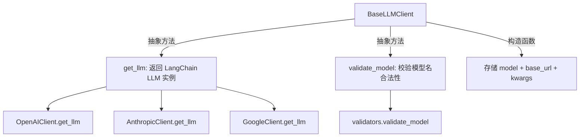
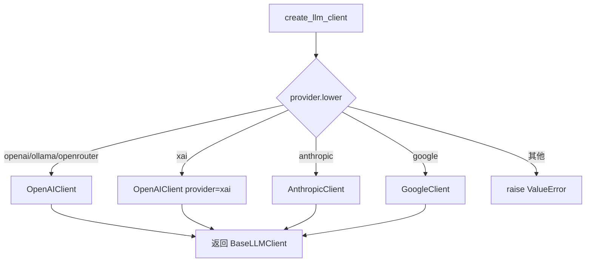

# PD-198.01 TradingAgents — BaseLLMClient 抽象基类与工厂模式多供应商 LLM 统一

> 文档编号：PD-198.01
> 来源：TradingAgents `tradingagents/llm_clients/`
> GitHub：https://github.com/TauricResearch/TradingAgents.git
> 问题域：PD-198 多供应商 LLM 抽象 Multi-Provider LLM Abstraction
> 状态：可复用方案

---

## 第 1 章 问题与动机

### 1.1 核心问题

在多 Agent 金融交易系统中，不同 LLM 供应商的 SDK 接口差异巨大：
- OpenAI 的推理模型（o1/o3/gpt-5）不支持 `temperature`/`top_p` 参数，传入会报错
- Google Gemini 3 系列返回 `content` 为 `list[dict]` 而非 `str`，下游解析崩溃
- xAI/OpenRouter/Ollama 虽兼容 OpenAI 协议，但 base_url 和 API key 来源各不相同
- Google Gemini 2.5 与 3.x 的 thinking 参数名不同（`thinking_budget` vs `thinking_level`）

如果每个 Agent 节点自行处理这些差异，代码会充满 `if provider == "openai"` 的分支，维护成本指数增长。

### 1.2 TradingAgents 的解法概述

TradingAgents 采用三层架构统一 6+ LLM 供应商：

1. **BaseLLMClient 抽象基类** (`base_client.py:4-21`) — 定义 `get_llm()` + `validate_model()` 两个抽象方法，所有供应商客户端必须实现
2. **工厂函数 create_llm_client** (`factory.py:9-43`) — 按 provider 字符串分发到具体客户端类，调用方无需知道具体实现
3. **供应商子类内部归一化** — OpenAI 子类通过 `UnifiedChatOpenAI` 自动剥离推理模型不兼容参数 (`openai_client.py:10-28`)；Google 子类通过 `NormalizedChatGoogleGenerativeAI` 将 list 响应归一化为 string (`google_client.py:9-25`)
4. **白名单模型验证** (`validators.py:7-82`) — 按供应商维护合法模型列表，Ollama/OpenRouter 开放通过
5. **双层 LLM 策略** (`trading_graph.py:81-95`) — 同一 provider 下创建 deep_think 和 quick_think 两个客户端，分别用于深度推理和快速响应

### 1.3 设计思想

| 设计原则 | 具体实现 | 理由 | 替代方案 |
|----------|----------|------|----------|
| 最小抽象面 | BaseLLMClient 仅 2 个抽象方法 | 降低新供应商接入成本，只需实现 get_llm + validate_model | LiteLLM 统一代理（引入外部依赖） |
| 供应商内部归一化 | UnifiedChatOpenAI 在构造时剥离参数 | 推理模型参数差异在最近的位置处理，不污染上层 | 在工厂函数中做参数过滤（职责不清） |
| OpenAI 协议复用 | xAI/Ollama/OpenRouter 共用 OpenAIClient | 这三者均兼容 OpenAI API，只需改 base_url 和 key | 每个供应商独立客户端（代码重复） |
| 白名单 + 开放混合 | 主流供应商白名单校验，Ollama/OpenRouter 放行 | 主流供应商模型名固定可枚举，自托管/路由器模型名不可预知 | 全部放行（失去早期错误检测） |
| 配置驱动 | DEFAULT_CONFIG 集中定义 provider + model | 切换供应商只改配置，不改代码 | 环境变量散落各处（难以管理） |

---

## 第 2 章 源码实现分析

### 2.1 架构概览

```
┌─────────────────────────────────────────────────────────┐
│                   TradingAgentsGraph                     │
│  config["llm_provider"] + config["deep_think_llm"]      │
│                        │                                 │
│                        ▼                                 │
│              create_llm_client()                         │
│              (factory.py:9-43)                           │
│                        │                                 │
│         ┌──────────────┼──────────────┐                  │
│         ▼              ▼              ▼                  │
│   OpenAIClient   AnthropicClient  GoogleClient           │
│   (+ xAI/Ollama  (anthropic_      (google_               │
│    /OpenRouter)   client.py)       client.py)            │
│         │                              │                 │
│         ▼                              ▼                 │
│  UnifiedChatOpenAI          NormalizedChatGoogle          │
│  (剥离推理模型参数)          GenerativeAI                  │
│                             (list→str 归一化)             │
│         │              │              │                  │
│         ▼              ▼              ▼                  │
│      LangChain ChatOpenAI / ChatAnthropic / ChatGoogle   │
│                        │                                 │
│                        ▼                                 │
│              validate_model()                            │
│              (validators.py:69-82)                        │
│              VALID_MODELS 白名单                          │
└─────────────────────────────────────────────────────────┘
```

### 2.2 核心实现

#### 2.2.1 抽象基类 — 最小接口契约



对应源码 `tradingagents/llm_clients/base_client.py:1-21`：

```python
from abc import ABC, abstractmethod
from typing import Any, Optional


class BaseLLMClient(ABC):
    """Abstract base class for LLM clients."""

    def __init__(self, model: str, base_url: Optional[str] = None, **kwargs):
        self.model = model
        self.base_url = base_url
        self.kwargs = kwargs

    @abstractmethod
    def get_llm(self) -> Any:
        """Return the configured LLM instance."""
        pass

    @abstractmethod
    def validate_model(self) -> bool:
        """Validate that the model is supported by this client."""
        pass
```

#### 2.2.2 工厂函数 — 供应商路由



对应源码 `tradingagents/llm_clients/factory.py:9-43`：

```python
def create_llm_client(
    provider: str,
    model: str,
    base_url: Optional[str] = None,
    **kwargs,
) -> BaseLLMClient:
    provider_lower = provider.lower()

    if provider_lower in ("openai", "ollama", "openrouter"):
        return OpenAIClient(model, base_url, provider=provider_lower, **kwargs)

    if provider_lower == "xai":
        return OpenAIClient(model, base_url, provider="xai", **kwargs)

    if provider_lower == "anthropic":
        return AnthropicClient(model, base_url, **kwargs)

    if provider_lower == "google":
        return GoogleClient(model, base_url, **kwargs)

    raise ValueError(f"Unsupported LLM provider: {provider}")
```

#### 2.2.3 推理模型参数剥离 — UnifiedChatOpenAI

```mermaid
graph TD
    A[UnifiedChatOpenAI.__init__] --> B{_is_reasoning_model?}
    B -->|是: o1/o3/gpt-5| C[pop temperature]
    C --> D[pop top_p]
    D --> E[super().__init__]
    B -->|否| E
```

对应源码 `tradingagents/llm_clients/openai_client.py:10-28`：

```python
class UnifiedChatOpenAI(ChatOpenAI):
    """ChatOpenAI subclass that strips incompatible params for certain models."""

    def __init__(self, **kwargs):
        model = kwargs.get("model", "")
        if self._is_reasoning_model(model):
            kwargs.pop("temperature", None)
            kwargs.pop("top_p", None)
        super().__init__(**kwargs)

    @staticmethod
    def _is_reasoning_model(model: str) -> bool:
        model_lower = model.lower()
        return (
            model_lower.startswith("o1")
            or model_lower.startswith("o3")
            or "gpt-5" in model_lower
        )
```

### 2.3 实现细节

#### OpenAIClient 的多供应商 base_url 路由

OpenAIClient 在 `get_llm()` 中根据 `self.provider` 自动设置 base_url 和 API key（`openai_client.py:44-68`）：

- `xai` → `https://api.x.ai/v1` + `XAI_API_KEY`
- `openrouter` → `https://openrouter.ai/api/v1` + `OPENROUTER_API_KEY`
- `ollama` → `http://localhost:11434/v1` + 固定 key `"ollama"`
- `openai` → 使用用户传入的 `base_url` 或 LangChain 默认值

#### Google Gemini 响应归一化

`NormalizedChatGoogleGenerativeAI` 重写 `invoke()` 方法（`google_client.py:16-28`），将 Gemini 3 返回的 `list[dict]` 格式统一为 `str`：

```python
def _normalize_content(self, response):
    content = response.content
    if isinstance(content, list):
        texts = [
            item.get("text", "") if isinstance(item, dict) and item.get("type") == "text"
            else item if isinstance(item, str) else ""
            for item in content
        ]
        response.content = "\n".join(t for t in texts if t)
    return response
```

#### Google Thinking 参数版本适配

GoogleClient 在 `get_llm()` 中处理 Gemini 2.5 与 3.x 的 thinking 参数差异（`google_client.py:46-59`）：
- Gemini 3 系列：使用 `thinking_level` 参数（"minimal"/"low"/"medium"/"high"）
- Gemini 3 Pro 不支持 "minimal"，自动降级为 "low"
- Gemini 2.5 系列：映射为 `thinking_budget`（-1=dynamic, 0=disable）

#### 白名单验证策略

`validators.py:69-82` 实现分层验证：
- 主流供应商（openai/anthropic/google/xai）：严格白名单校验
- 开放供应商（ollama/openrouter）：直接返回 True
- 未知供应商：也返回 True（宽容策略，避免阻断新供应商）

---

## 第 3 章 迁移指南

### 3.1 迁移清单

**阶段 1：基础抽象层（1 个文件）**
- [ ] 创建 `llm_clients/base_client.py`，定义 `BaseLLMClient` 抽象基类
- [ ] 确定抽象方法：`get_llm()` 返回你的框架的 LLM 实例类型（LangChain/LlamaIndex/原生 SDK）

**阶段 2：供应商实现（每个供应商 1 个文件）**
- [ ] 实现 OpenAIClient，包含 `UnifiedChatOpenAI` 推理模型参数剥离
- [ ] 实现 AnthropicClient（最简单，直接透传）
- [ ] 实现 GoogleClient，包含响应归一化和 thinking 参数版本适配
- [ ] 按需添加其他供应商（xAI/Ollama/OpenRouter 可复用 OpenAIClient）

**阶段 3：工厂 + 验证**
- [ ] 创建 `factory.py` 工厂函数
- [ ] 创建 `validators.py` 模型白名单（可选，按需启用）
- [ ] 在配置文件中添加 `llm_provider` + `model` 字段

**阶段 4：集成**
- [ ] 替换现有代码中的直接 LLM 构造为 `create_llm_client()` 调用
- [ ] 测试所有供应商的正常路径和边界情况

### 3.2 适配代码模板

以下模板可直接复用，基于 LangChain 生态：

```python
# llm_clients/base_client.py
from abc import ABC, abstractmethod
from typing import Any, Optional


class BaseLLMClient(ABC):
    def __init__(self, model: str, base_url: Optional[str] = None, **kwargs):
        self.model = model
        self.base_url = base_url
        self.kwargs = kwargs

    @abstractmethod
    def get_llm(self) -> Any:
        pass

    @abstractmethod
    def validate_model(self) -> bool:
        pass


# llm_clients/openai_client.py
from langchain_openai import ChatOpenAI

REASONING_PREFIXES = ("o1", "o3", "o4")
REASONING_CONTAINS = ("gpt-5",)


class UnifiedChatOpenAI(ChatOpenAI):
    def __init__(self, **kwargs):
        model = kwargs.get("model", "").lower()
        if any(model.startswith(p) for p in REASONING_PREFIXES) or \
           any(c in model for c in REASONING_CONTAINS):
            kwargs.pop("temperature", None)
            kwargs.pop("top_p", None)
        super().__init__(**kwargs)


PROVIDER_ENDPOINTS = {
    "xai": ("https://api.x.ai/v1", "XAI_API_KEY"),
    "openrouter": ("https://openrouter.ai/api/v1", "OPENROUTER_API_KEY"),
    "ollama": ("http://localhost:11434/v1", None),
}


class OpenAIClient(BaseLLMClient):
    def __init__(self, model, base_url=None, provider="openai", **kwargs):
        super().__init__(model, base_url, **kwargs)
        self.provider = provider.lower()

    def get_llm(self) -> Any:
        llm_kwargs = {"model": self.model}
        if self.provider in PROVIDER_ENDPOINTS:
            url, key_env = PROVIDER_ENDPOINTS[self.provider]
            llm_kwargs["base_url"] = url
            if key_env:
                import os
                api_key = os.environ.get(key_env)
                if api_key:
                    llm_kwargs["api_key"] = api_key
            else:
                llm_kwargs["api_key"] = "ollama"
        elif self.base_url:
            llm_kwargs["base_url"] = self.base_url
        return UnifiedChatOpenAI(**llm_kwargs)

    def validate_model(self) -> bool:
        return True  # 按需接入白名单


# llm_clients/factory.py
def create_llm_client(provider: str, model: str, base_url=None, **kwargs):
    provider_lower = provider.lower()
    if provider_lower in ("openai", "ollama", "openrouter", "xai"):
        return OpenAIClient(model, base_url, provider=provider_lower, **kwargs)
    if provider_lower == "anthropic":
        from .anthropic_client import AnthropicClient
        return AnthropicClient(model, base_url, **kwargs)
    if provider_lower == "google":
        from .google_client import GoogleClient
        return GoogleClient(model, base_url, **kwargs)
    raise ValueError(f"Unsupported provider: {provider}")
```

### 3.3 适用场景

| 场景 | 适用度 | 说明 |
|------|--------|------|
| 多 Agent 系统需要切换 LLM 供应商 | ⭐⭐⭐ | 核心场景，配置驱动一键切换 |
| 同一系统内混用多个供应商 | ⭐⭐⭐ | 工厂模式天然支持，deep/quick 可用不同供应商 |
| 需要支持推理模型（o1/o3/gpt-5） | ⭐⭐⭐ | UnifiedChatOpenAI 自动处理参数差异 |
| 需要支持本地模型（Ollama） | ⭐⭐⭐ | OpenAIClient 复用，只改 base_url |
| 单一供应商、单一模型 | ⭐ | 过度设计，直接用 SDK 即可 |
| 需要流式响应精细控制 | ⭐⭐ | 当前抽象层不涉及流式，需自行扩展 |

---

## 第 4 章 测试用例

```python
import pytest
from unittest.mock import patch, MagicMock


class TestBaseLLMClient:
    """测试抽象基类约束。"""

    def test_cannot_instantiate_abstract(self):
        from tradingagents.llm_clients.base_client import BaseLLMClient
        with pytest.raises(TypeError):
            BaseLLMClient("gpt-4o")


class TestFactory:
    """测试工厂函数路由。"""

    def test_openai_provider(self):
        from tradingagents.llm_clients.factory import create_llm_client
        from tradingagents.llm_clients.openai_client import OpenAIClient
        client = create_llm_client("openai", "gpt-4o")
        assert isinstance(client, OpenAIClient)
        assert client.provider == "openai"

    def test_xai_routes_to_openai_client(self):
        from tradingagents.llm_clients.factory import create_llm_client
        from tradingagents.llm_clients.openai_client import OpenAIClient
        client = create_llm_client("xai", "grok-4")
        assert isinstance(client, OpenAIClient)
        assert client.provider == "xai"

    def test_ollama_routes_to_openai_client(self):
        from tradingagents.llm_clients.factory import create_llm_client
        client = create_llm_client("ollama", "llama3")
        assert client.provider == "ollama"

    def test_anthropic_provider(self):
        from tradingagents.llm_clients.factory import create_llm_client
        from tradingagents.llm_clients.anthropic_client import AnthropicClient
        client = create_llm_client("anthropic", "claude-sonnet-4-20250514")
        assert isinstance(client, AnthropicClient)

    def test_google_provider(self):
        from tradingagents.llm_clients.factory import create_llm_client
        from tradingagents.llm_clients.google_client import GoogleClient
        client = create_llm_client("google", "gemini-2.5-flash")
        assert isinstance(client, GoogleClient)

    def test_unsupported_provider_raises(self):
        from tradingagents.llm_clients.factory import create_llm_client
        with pytest.raises(ValueError, match="Unsupported"):
            create_llm_client("cohere", "command-r")

    def test_case_insensitive(self):
        from tradingagents.llm_clients.factory import create_llm_client
        client = create_llm_client("OpenAI", "gpt-4o")
        assert client.provider == "openai"


class TestUnifiedChatOpenAI:
    """测试推理模型参数剥离。"""

    def test_reasoning_model_strips_temperature(self):
        from tradingagents.llm_clients.openai_client import UnifiedChatOpenAI
        # o3 是推理模型，temperature 应被剥离
        assert UnifiedChatOpenAI._is_reasoning_model("o3") is True
        assert UnifiedChatOpenAI._is_reasoning_model("o1-preview") is True
        assert UnifiedChatOpenAI._is_reasoning_model("gpt-5.2") is True

    def test_non_reasoning_model_keeps_temperature(self):
        from tradingagents.llm_clients.openai_client import UnifiedChatOpenAI
        assert UnifiedChatOpenAI._is_reasoning_model("gpt-4o") is False
        assert UnifiedChatOpenAI._is_reasoning_model("gpt-4.1-mini") is False


class TestValidators:
    """测试模型白名单验证。"""

    def test_valid_openai_model(self):
        from tradingagents.llm_clients.validators import validate_model
        assert validate_model("openai", "gpt-4o") is True

    def test_invalid_openai_model(self):
        from tradingagents.llm_clients.validators import validate_model
        assert validate_model("openai", "nonexistent-model") is False

    def test_ollama_accepts_any(self):
        from tradingagents.llm_clients.validators import validate_model
        assert validate_model("ollama", "any-model-name") is True

    def test_openrouter_accepts_any(self):
        from tradingagents.llm_clients.validators import validate_model
        assert validate_model("openrouter", "anthropic/claude-3-opus") is True


class TestGoogleNormalization:
    """测试 Gemini 响应归一化。"""

    def test_list_content_normalized_to_string(self):
        from tradingagents.llm_clients.google_client import NormalizedChatGoogleGenerativeAI
        mock_response = MagicMock()
        mock_response.content = [
            {"type": "text", "text": "Hello"},
            {"type": "text", "text": "World"},
        ]
        normalizer = NormalizedChatGoogleGenerativeAI.__new__(
            NormalizedChatGoogleGenerativeAI
        )
        result = normalizer._normalize_content(mock_response)
        assert result.content == "Hello\nWorld"

    def test_string_content_unchanged(self):
        from tradingagents.llm_clients.google_client import NormalizedChatGoogleGenerativeAI
        mock_response = MagicMock()
        mock_response.content = "Already a string"
        normalizer = NormalizedChatGoogleGenerativeAI.__new__(
            NormalizedChatGoogleGenerativeAI
        )
        result = normalizer._normalize_content(mock_response)
        assert result.content == "Already a string"
```

---

## 第 5 章 跨域关联

| 关联域 | 关系类型 | 说明 |
|--------|----------|------|
| PD-01 上下文管理 | 协同 | 不同供应商的 context window 大小不同，LLM 抽象层可为上下文管理提供模型元数据 |
| PD-02 多 Agent 编排 | 依赖 | TradingAgentsGraph 通过 create_llm_client 创建 deep/quick 两个 LLM，供编排图中所有 Agent 节点使用 |
| PD-03 容错与重试 | 协同 | OpenAIClient 透传 `max_retries` 和 `timeout` 参数给 LangChain，容错策略在 LLM 层生效 |
| PD-04 工具系统 | 协同 | LLM 实例通过 `callbacks` 参数支持工具调用统计追踪 |
| PD-11 可观测性 | 协同 | callbacks 参数链路贯穿 config → create_llm_client → LangChain LLM，支持 token 用量追踪 |
| PD-12 推理增强 | 依赖 | 推理模型（o1/o3/gpt-5）的参数剥离和 Google thinking_level 配置直接服务于推理增强策略 |

---

## 第 6 章 来源文件索引

| 文件 | 行范围 | 关键实现 |
|------|--------|----------|
| `tradingagents/llm_clients/base_client.py` | L1-L21 | BaseLLMClient 抽象基类定义 |
| `tradingagents/llm_clients/factory.py` | L1-L43 | create_llm_client 工厂函数 |
| `tradingagents/llm_clients/openai_client.py` | L10-L28 | UnifiedChatOpenAI 推理模型参数剥离 |
| `tradingagents/llm_clients/openai_client.py` | L31-L72 | OpenAIClient 多供应商 base_url 路由 |
| `tradingagents/llm_clients/google_client.py` | L9-L25 | NormalizedChatGoogleGenerativeAI 响应归一化 |
| `tradingagents/llm_clients/google_client.py` | L46-L59 | Gemini thinking 参数版本适配 |
| `tradingagents/llm_clients/anthropic_client.py` | L1-L27 | AnthropicClient 透传实现 |
| `tradingagents/llm_clients/validators.py` | L7-L82 | VALID_MODELS 白名单 + validate_model 函数 |
| `tradingagents/llm_clients/__init__.py` | L1-L4 | 模块公开接口 |
| `tradingagents/default_config.py` | L1-L34 | DEFAULT_CONFIG LLM 配置字段 |
| `tradingagents/graph/trading_graph.py` | L74-L95 | 双层 LLM 创建（deep_think + quick_think） |
| `tradingagents/graph/trading_graph.py` | L133-L148 | _get_provider_kwargs 供应商特定参数提取 |

---

## 第 7 章 横向对比维度

```json comparison_data
{
  "project": "TradingAgents",
  "dimensions": {
    "抽象层级": "ABC 基类 + 工厂函数，2 个抽象方法最小接口",
    "供应商数量": "6 供应商：OpenAI/Anthropic/Google/xAI/OpenRouter/Ollama",
    "参数归一化": "子类继承覆写构造函数，推理模型自动剥离 temperature/top_p",
    "响应归一化": "Google 子类重写 invoke()，list[dict] → str",
    "模型验证": "白名单 + 开放混合策略，主流严格校验 + 自托管放行",
    "协议复用": "xAI/Ollama/OpenRouter 共用 OpenAIClient，仅改 base_url"
  }
}
```

### 域元数据补充

```json domain_metadata
{
  "solution_summary": "TradingAgents 用 BaseLLMClient ABC + 工厂模式统一 6 供应商，UnifiedChatOpenAI 自动剥离推理模型参数，NormalizedChatGoogleGenerativeAI 归一化 Gemini 3 list 响应",
  "description": "LLM 供应商间的参数语义差异和响应格式差异的透明化处理",
  "sub_problems": [
    "Gemini 版本间 thinking 参数名不兼容（thinking_level vs thinking_budget）",
    "OpenAI 兼容协议供应商的 base_url 和 API key 来源差异",
    "双层 LLM 策略下的供应商特定参数透传"
  ],
  "best_practices": [
    "通过子类继承 SDK 类覆写构造函数实现参数剥离，而非在工厂层过滤",
    "OpenAI 兼容供应商共用同一客户端类，用 provider 字段区分 base_url 路由",
    "白名单校验主流供应商 + 开放通过自托管/路由器供应商的混合验证策略"
  ]
}
```
