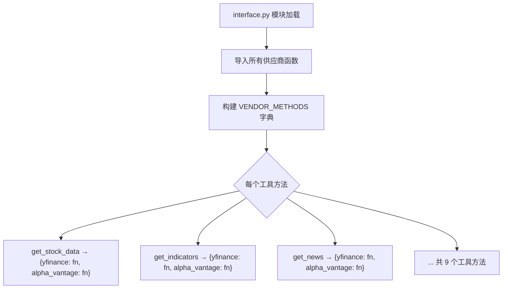
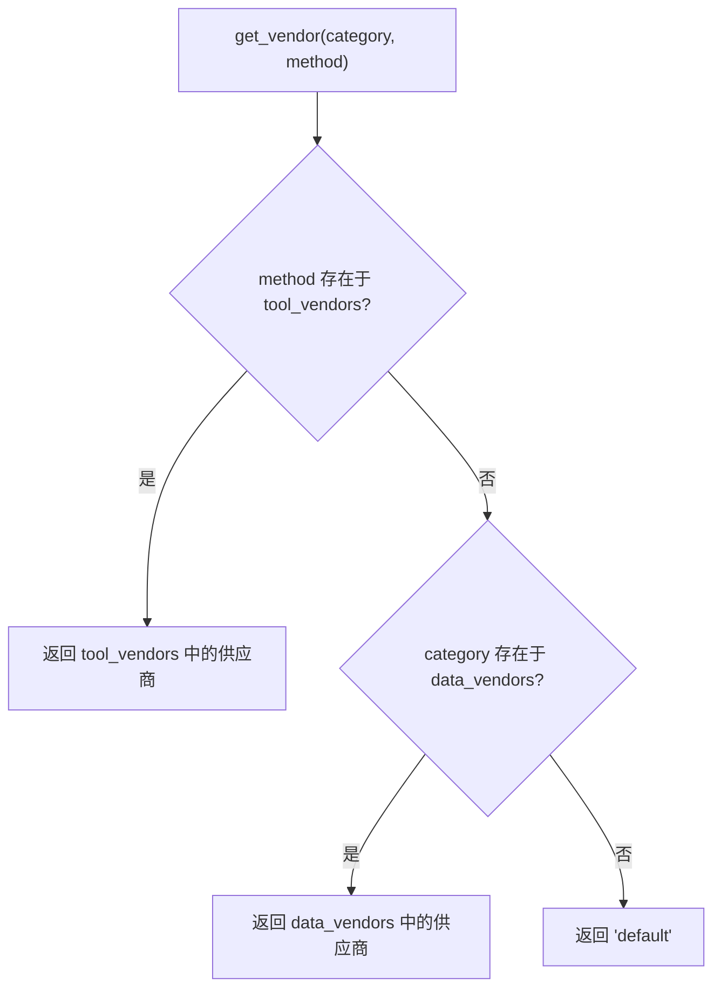
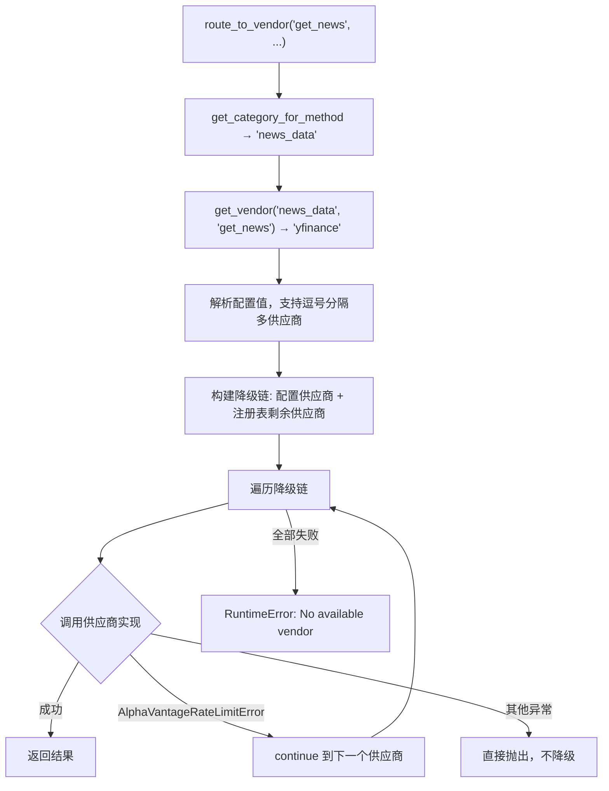

# PD-199.01 TradingAgents — 数据供应商路由与降级链

> 文档编号：PD-199.01
> 来源：TradingAgents `tradingagents/dataflows/interface.py`
> GitHub：https://github.com/TauricResearch/TradingAgents.git
> 问题域：PD-199 数据供应商路由 Data Vendor Routing
> 状态：可复用方案

---

## 第 1 章 问题与动机

### 1.1 核心问题

金融数据 Agent 系统依赖多个外部数据供应商（yfinance、Alpha Vantage 等），每个供应商有不同的 API 限制、数据覆盖范围和可靠性。核心挑战：

1. **供应商锁定**：工具函数直接调用某个供应商 SDK，切换供应商需要改动所有调用点
2. **可用性风险**：单一供应商 API 限流或宕机时，整个数据流中断
3. **配置灵活性**：不同数据类别（行情、基本面、新闻）可能需要不同供应商，且需要支持按工具粒度覆盖
4. **降级透明性**：供应商切换应对上层 Agent 透明，不需要 Agent 感知底层数据源变化

### 1.2 TradingAgents 的解法概述

TradingAgents 实现了一套三层数据供应商路由系统：

1. **VENDOR_METHODS 静态注册表**：在 `interface.py:69-110` 中用字典映射每个工具方法到所有可用供应商实现，实现工具接口与供应商实现的完全解耦
2. **双层配置覆盖**：`default_config.py:24-33` 定义 `data_vendors`（category 级）和 `tool_vendors`（tool 级），tool 级优先于 category 级
3. **自动降级链**：`route_to_vendor()` 在 `interface.py:134-162` 中自动构建降级链——优先使用配置的供应商，失败后自动尝试注册表中的其他供应商
4. **LangChain Tool 薄代理层**：`agents/utils/` 下的工具文件（如 `core_stock_tools.py`）只做一件事——调用 `route_to_vendor(method_name, *args)`，完全不感知供应商
5. **运行时配置注入**：`TradingAgentsGraph.__init__()` 在 `trading_graph.py:66` 通过 `set_config()` 将用户配置注入全局，实现运行时供应商切换

### 1.3 设计思想

| 设计原则 | 具体实现 | 理由 | 替代方案 |
|----------|----------|------|----------|
| 接口与实现分离 | VENDOR_METHODS 字典映射工具名→供应商函数 | 新增供应商只需加一行映射，不改调用方 | 策略模式类继承（更重） |
| 配置分层覆盖 | category 级默认 + tool 级覆盖 | 大多数场景只需设 category，特殊工具可单独指定 | 全部 tool 级配置（冗余） |
| 自动降级链 | 配置供应商优先 + 剩余供应商自动补充 | 无需手动维护降级顺序，注册表即降级池 | 显式配置降级链（灵活但繁琐） |
| 错误分类降级 | 仅 AlphaVantageRateLimitError 触发降级 | 区分可恢复错误（限流）和不可恢复错误（参数错误） | 所有异常都降级（掩盖 bug） |
| 全局配置单例 | config.py 模块级 `_config` 变量 | 简单直接，避免依赖注入复杂性 | DI 容器（过度工程） |

---

## 第 2 章 源码实现分析

### 2.1 架构概览

TradingAgents 的数据供应商路由采用三层架构：配置层 → 路由层 → 供应商实现层。

```
┌─────────────────────────────────────────────────────────────┐
│                    Agent 工具层                               │
│  core_stock_tools.py  news_data_tools.py  fundamental_...   │
│  每个 @tool 函数只调用 route_to_vendor("method", *args)      │
└──────────────────────────┬──────────────────────────────────┘
                           │
                           ▼
┌─────────────────────────────────────────────────────────────┐
│                    路由层 interface.py                        │
│                                                             │
│  TOOLS_CATEGORIES ─── 工具→类别映射                          │
│  VENDOR_METHODS   ─── 工具→{供应商: 实现函数} 注册表          │
│  get_vendor()     ─── 双层配置查询（tool > category）        │
│  route_to_vendor()─── 降级链构建 + 异常驱动切换              │
└──────────────────────────┬──────────────────────────────────┘
                           │
              ┌────────────┼────────────┐
              ▼            ▼            ▼
┌──────────────┐ ┌──────────────┐ ┌──────────────┐
│  y_finance   │ │ alpha_vantage│ │  (可扩展)    │
│  yfinance SDK│ │ REST API     │ │  新供应商    │
└──────────────┘ └──────────────┘ └──────────────┘
```

### 2.2 核心实现

#### 2.2.1 供应商注册表 VENDOR_METHODS



对应源码 `tradingagents/dataflows/interface.py:69-110`：

```python
VENDOR_METHODS = {
    # core_stock_apis
    "get_stock_data": {
        "alpha_vantage": get_alpha_vantage_stock,
        "yfinance": get_YFin_data_online,
    },
    # technical_indicators
    "get_indicators": {
        "alpha_vantage": get_alpha_vantage_indicator,
        "yfinance": get_stock_stats_indicators_window,
    },
    # fundamental_data
    "get_fundamentals": {
        "alpha_vantage": get_alpha_vantage_fundamentals,
        "yfinance": get_yfinance_fundamentals,
    },
    "get_balance_sheet": {
        "alpha_vantage": get_alpha_vantage_balance_sheet,
        "yfinance": get_yfinance_balance_sheet,
    },
    # ... 共 9 个工具方法，每个映射到 2 个供应商实现
}
```

注册表的关键设计：每个工具方法名作为 key，value 是 `{vendor_name: callable}` 字典。这使得新增供应商只需在字典中加一个 entry，不需要修改任何路由逻辑。

#### 2.2.2 双层配置与路由决策



对应源码 `tradingagents/dataflows/interface.py:119-132`：

```python
def get_vendor(category: str, method: str = None) -> str:
    """Get the configured vendor for a data category or specific tool method.
    Tool-level configuration takes precedence over category-level.
    """
    config = get_config()

    # Check tool-level configuration first (if method provided)
    if method:
        tool_vendors = config.get("tool_vendors", {})
        if method in tool_vendors:
            return tool_vendors[method]

    # Fall back to category-level configuration
    return config.get("data_vendors", {}).get(category, "default")
```

配置源在 `tradingagents/default_config.py:24-33`：

```python
"data_vendors": {
    "core_stock_apis": "yfinance",       # category 级默认
    "technical_indicators": "yfinance",
    "fundamental_data": "yfinance",
    "news_data": "yfinance",
},
"tool_vendors": {
    # 例: "get_stock_data": "alpha_vantage",  # tool 级覆盖
},
```

#### 2.2.3 降级链构建与异常驱动切换



对应源码 `tradingagents/dataflows/interface.py:134-162`：

```python
def route_to_vendor(method: str, *args, **kwargs):
    """Route method calls to appropriate vendor implementation with fallback support."""
    category = get_category_for_method(method)
    vendor_config = get_vendor(category, method)
    primary_vendors = [v.strip() for v in vendor_config.split(',')]

    if method not in VENDOR_METHODS:
        raise ValueError(f"Method '{method}' not supported")

    # Build fallback chain: primary vendors first, then remaining available vendors
    all_available_vendors = list(VENDOR_METHODS[method].keys())
    fallback_vendors = primary_vendors.copy()
    for vendor in all_available_vendors:
        if vendor not in fallback_vendors:
            fallback_vendors.append(vendor)

    for vendor in fallback_vendors:
        if vendor not in VENDOR_METHODS[method]:
            continue

        vendor_impl = VENDOR_METHODS[method][vendor]
        impl_func = vendor_impl[0] if isinstance(vendor_impl, list) else vendor_impl

        try:
            return impl_func(*args, **kwargs)
        except AlphaVantageRateLimitError:
            continue  # Only rate limits trigger fallback

    raise RuntimeError(f"No available vendor for '{method}'")
```

### 2.3 实现细节

**工具层的薄代理模式**：每个 LangChain `@tool` 函数只做参数透传，如 `core_stock_tools.py:7-22`：

```python
@tool
def get_stock_data(
    symbol: Annotated[str, "ticker symbol of the company"],
    start_date: Annotated[str, "Start date in yyyy-mm-dd format"],
    end_date: Annotated[str, "End date in yyyy-mm-dd format"],
) -> str:
    """Retrieve stock price data (OHLCV) for a given ticker symbol."""
    return route_to_vendor("get_stock_data", symbol, start_date, end_date)
```

所有 4 个工具文件（`core_stock_tools.py`、`technical_indicators_tools.py`、`fundamental_data_tools.py`、`news_data_tools.py`）都遵循同一模式：定义 LangChain tool 签名 → 调用 `route_to_vendor(method_name, *args)`。

**运行时配置注入**：`TradingAgentsGraph.__init__()` 在 `trading_graph.py:66` 调用 `set_config(self.config)` 将用户传入的配置写入全局模块变量，使得后续所有 `route_to_vendor` 调用都使用最新配置。

**错误分类策略**：`alpha_vantage_common.py:38-40` 定义了专用异常 `AlphaVantageRateLimitError`，在 `_make_api_request()` 的 L75-78 中检测 API 响应中的 rate limit 信息并抛出。`route_to_vendor` 仅捕获此异常触发降级，其他异常（如参数错误、网络超时）直接上抛，避免掩盖真实错误。

**类别反查**：`get_category_for_method()` 在 `interface.py:112-117` 遍历 `TOOLS_CATEGORIES` 字典反查工具所属类别，用于从 tool 名定位 category 级配置。


---

## 第 3 章 迁移指南

### 3.1 迁移清单

**阶段 1：定义供应商接口（1 个文件）**

- [ ] 创建 `vendor_registry.py`，定义 `VENDOR_METHODS` 注册表
- [ ] 为每个数据类别定义工具方法名
- [ ] 为每个供应商实现导入对应函数

**阶段 2：实现配置层（1 个文件）**

- [ ] 在配置文件中添加 `data_vendors`（category 级）和 `tool_vendors`（tool 级）
- [ ] 实现 `get_vendor()` 双层查询函数
- [ ] 实现 `get_config()` / `set_config()` 全局配置管理

**阶段 3：实现路由层（1 个函数）**

- [ ] 实现 `route_to_vendor()` 函数，包含降级链构建逻辑
- [ ] 定义供应商专用异常类（如 `VendorRateLimitError`）
- [ ] 确保仅可恢复错误触发降级

**阶段 4：改造工具层**

- [ ] 将现有工具函数改为薄代理，调用 `route_to_vendor()`
- [ ] 保持工具签名不变，确保上层 Agent 无感知

### 3.2 适配代码模板

以下是一个通用的供应商路由模板，可直接复用：

```python
from typing import Dict, Callable, Any, List, Optional

class VendorRateLimitError(Exception):
    """供应商限流异常，触发降级。"""
    pass

class VendorRegistry:
    """数据供应商注册表与路由器。"""

    def __init__(self, config: Dict[str, Any]):
        self._config = config
        self._methods: Dict[str, Dict[str, Callable]] = {}
        self._categories: Dict[str, List[str]] = {}

    def register(self, method: str, category: str, vendor: str, impl: Callable):
        """注册一个供应商实现。"""
        if method not in self._methods:
            self._methods[method] = {}
        self._methods[method][vendor] = impl
        if category not in self._categories:
            self._categories[category] = []
        if method not in self._categories[category]:
            self._categories[category].append(method)

    def get_vendor(self, category: str, method: Optional[str] = None) -> str:
        """双层配置查询：tool 级 > category 级。"""
        if method:
            tool_vendors = self._config.get("tool_vendors", {})
            if method in tool_vendors:
                return tool_vendors[method]
        return self._config.get("data_vendors", {}).get(category, "default")

    def route(self, method: str, *args, **kwargs) -> Any:
        """路由到供应商实现，支持自动降级。"""
        category = self._get_category(method)
        vendor_config = self.get_vendor(category, method)
        primary = [v.strip() for v in vendor_config.split(",")]

        if method not in self._methods:
            raise ValueError(f"Method '{method}' not registered")

        # 构建降级链：配置优先 + 注册表补充
        chain = primary.copy()
        for v in self._methods[method]:
            if v not in chain:
                chain.append(v)

        for vendor in chain:
            if vendor not in self._methods[method]:
                continue
            try:
                return self._methods[method][vendor](*args, **kwargs)
            except VendorRateLimitError:
                continue

        raise RuntimeError(f"No available vendor for '{method}'")

    def _get_category(self, method: str) -> str:
        for cat, methods in self._categories.items():
            if method in methods:
                return cat
        raise ValueError(f"Method '{method}' not in any category")
```

使用示例：

```python
registry = VendorRegistry(config={
    "data_vendors": {"stock": "vendor_a", "news": "vendor_b"},
    "tool_vendors": {"get_realtime_quote": "vendor_c"},
})
registry.register("get_stock", "stock", "vendor_a", vendor_a_get_stock)
registry.register("get_stock", "stock", "vendor_b", vendor_b_get_stock)

result = registry.route("get_stock", "AAPL", "2024-01-01", "2024-12-31")
```

### 3.3 适用场景

| 场景 | 适用度 | 说明 |
|------|--------|------|
| 多数据源金融 Agent | ⭐⭐⭐ | 完美匹配：多供应商、需要降级、按类别配置 |
| 多 LLM Provider 路由 | ⭐⭐⭐ | 同构问题：多模型供应商、限流降级、按任务类型配置 |
| 多搜索引擎聚合 | ⭐⭐ | 适用但降级逻辑可能需要更复杂的质量评估 |
| 单一数据源系统 | ⭐ | 过度设计，直接调用即可 |
| 需要并行多源聚合 | ⭐ | 本方案是串行降级，不是并行聚合 |

---

## 第 4 章 测试用例

```python
import pytest
from unittest.mock import MagicMock, patch

class VendorRateLimitError(Exception):
    pass

# 模拟 TradingAgents 的路由逻辑进行测试
class TestVendorRouting:
    """测试供应商路由核心逻辑。"""

    def setup_method(self):
        self.vendor_a = MagicMock(return_value="data_from_a")
        self.vendor_b = MagicMock(return_value="data_from_b")
        self.vendor_methods = {
            "get_stock": {
                "vendor_a": self.vendor_a,
                "vendor_b": self.vendor_b,
            }
        }
        self.categories = {"stock": {"tools": ["get_stock"]}}

    def test_primary_vendor_success(self):
        """配置的主供应商正常返回。"""
        config = {"data_vendors": {"stock": "vendor_a"}, "tool_vendors": {}}
        result = self._route("get_stock", config, "AAPL")
        assert result == "data_from_a"
        self.vendor_a.assert_called_once_with("AAPL")
        self.vendor_b.assert_not_called()

    def test_fallback_on_rate_limit(self):
        """主供应商限流时自动降级到备选。"""
        self.vendor_a.side_effect = VendorRateLimitError("rate limit")
        config = {"data_vendors": {"stock": "vendor_a"}, "tool_vendors": {}}
        result = self._route("get_stock", config, "AAPL")
        assert result == "data_from_b"

    def test_tool_level_override(self):
        """tool 级配置覆盖 category 级。"""
        config = {
            "data_vendors": {"stock": "vendor_a"},
            "tool_vendors": {"get_stock": "vendor_b"},
        }
        result = self._route("get_stock", config, "AAPL")
        assert result == "data_from_b"
        self.vendor_a.assert_not_called()

    def test_non_rate_limit_error_not_caught(self):
        """非限流异常不触发降级，直接上抛。"""
        self.vendor_a.side_effect = ConnectionError("network down")
        config = {"data_vendors": {"stock": "vendor_a"}, "tool_vendors": {}}
        with pytest.raises(ConnectionError):
            self._route("get_stock", config, "AAPL")

    def test_all_vendors_exhausted(self):
        """所有供应商都限流时抛出 RuntimeError。"""
        self.vendor_a.side_effect = VendorRateLimitError("limit")
        self.vendor_b.side_effect = VendorRateLimitError("limit")
        config = {"data_vendors": {"stock": "vendor_a"}, "tool_vendors": {}}
        with pytest.raises(RuntimeError, match="No available vendor"):
            self._route("get_stock", config, "AAPL")

    def test_comma_separated_multi_primary(self):
        """支持逗号分隔配置多个主供应商。"""
        config = {"data_vendors": {"stock": "vendor_b,vendor_a"}, "tool_vendors": {}}
        result = self._route("get_stock", config, "AAPL")
        assert result == "data_from_b"  # vendor_b 排在前面

    def test_unknown_method_raises(self):
        """未注册的方法名抛出 ValueError。"""
        config = {"data_vendors": {"stock": "vendor_a"}, "tool_vendors": {}}
        with pytest.raises(ValueError, match="not found"):
            self._route("get_unknown", config, "AAPL")

    def _route(self, method, config, *args):
        """简化的路由逻辑，模拟 TradingAgents 的 route_to_vendor。"""
        # 查找 category
        category = None
        for cat, info in self.categories.items():
            if method in info["tools"]:
                category = cat
                break
        if category is None:
            raise ValueError(f"Method '{method}' not found in any category")

        # 双层配置查询
        tool_vendors = config.get("tool_vendors", {})
        vendor_config = tool_vendors.get(method) or config["data_vendors"].get(category, "default")
        primary = [v.strip() for v in vendor_config.split(",")]

        if method not in self.vendor_methods:
            raise ValueError(f"Method '{method}' not supported")

        chain = primary.copy()
        for v in self.vendor_methods[method]:
            if v not in chain:
                chain.append(v)

        for vendor in chain:
            if vendor not in self.vendor_methods[method]:
                continue
            try:
                return self.vendor_methods[method][vendor](*args)
            except VendorRateLimitError:
                continue

        raise RuntimeError(f"No available vendor for '{method}'")
```


---

## 第 5 章 跨域关联

| 关联域 | 关系类型 | 说明 |
|--------|----------|------|
| PD-03 容错与重试 | 协同 | `route_to_vendor` 的降级链本质是容错机制，`AlphaVantageRateLimitError` 是错误分类降级的实例 |
| PD-04 工具系统 | 依赖 | 供应商路由是工具系统的底层支撑，LangChain `@tool` 装饰器定义的工具函数通过 `route_to_vendor` 获取数据 |
| PD-01 上下文管理 | 间接 | 供应商返回的数据量影响上下文窗口消耗，不同供应商返回格式和数据量不同 |
| PD-11 可观测性 | 协同 | 供应商切换事件应被追踪，当前实现缺少降级日志，可通过中间件增强 |

---

## 第 6 章 来源文件索引

| 文件 | 行范围 | 关键实现 |
|------|--------|----------|
| `tradingagents/dataflows/interface.py` | L1-162 | 核心路由层：VENDOR_METHODS 注册表、TOOLS_CATEGORIES、get_vendor()、route_to_vendor() |
| `tradingagents/dataflows/config.py` | L1-31 | 全局配置管理：initialize_config()、set_config()、get_config() |
| `tradingagents/default_config.py` | L22-33 | 默认配置：data_vendors（category 级）、tool_vendors（tool 级） |
| `tradingagents/dataflows/alpha_vantage_common.py` | L38-40 | AlphaVantageRateLimitError 异常定义 |
| `tradingagents/dataflows/alpha_vantage_common.py` | L42-83 | _make_api_request() 限流检测与异常抛出 |
| `tradingagents/agents/utils/core_stock_tools.py` | L1-22 | 薄代理示例：get_stock_data @tool → route_to_vendor |
| `tradingagents/agents/utils/technical_indicators_tools.py` | L1-23 | 薄代理示例：get_indicators @tool → route_to_vendor |
| `tradingagents/agents/utils/fundamental_data_tools.py` | L1-77 | 薄代理示例：4 个基本面工具 → route_to_vendor |
| `tradingagents/agents/utils/news_data_tools.py` | L1-53 | 薄代理示例：3 个新闻工具 → route_to_vendor |
| `tradingagents/graph/trading_graph.py` | L66 | 运行时配置注入：set_config(self.config) |
| `tradingagents/dataflows/y_finance.py` | L1-48 | yfinance 供应商实现：get_YFin_data_online |
| `tradingagents/dataflows/alpha_vantage.py` | L1-5 | Alpha Vantage 供应商模块入口（re-export） |

---

## 第 7 章 横向对比维度

```json comparison_data
{
  "project": "TradingAgents",
  "dimensions": {
    "路由架构": "字典注册表 + route_to_vendor 统一入口，工具层薄代理透传",
    "配置粒度": "双层覆盖：category 级默认 + tool 级精确覆盖",
    "降级策略": "自动降级链：配置供应商优先，注册表剩余自动补充",
    "错误分类": "仅 RateLimitError 触发降级，其他异常直接上抛",
    "供应商扩展": "新增供应商只需在 VENDOR_METHODS 字典加一行映射"
  }
}
```

### 域元数据补充

```json domain_metadata
{
  "solution_summary": "TradingAgents 用 VENDOR_METHODS 字典注册表 + route_to_vendor 统一路由函数实现 9 个金融数据工具的双层配置供应商路由与 RateLimitError 驱动的自动降级链",
  "description": "数据密集型 Agent 系统中外部供应商的统一路由、配置覆盖与故障降级",
  "sub_problems": [
    "供应商限流异常的精确分类与非限流错误的穿透上抛",
    "逗号分隔多主供应商配置解析",
    "工具方法到类别的反向查找"
  ],
  "best_practices": [
    "工具层只做参数透传的薄代理模式",
    "运行时通过全局 set_config 注入供应商配置",
    "注册表即降级池：无需手动维护降级顺序"
  ]
}
```

