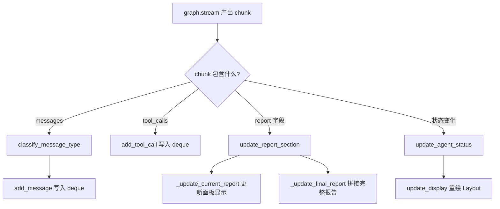
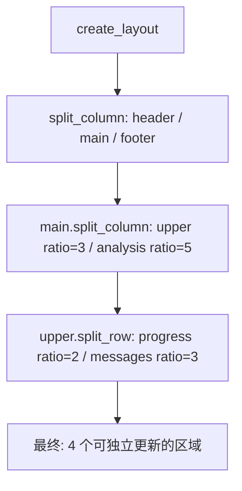
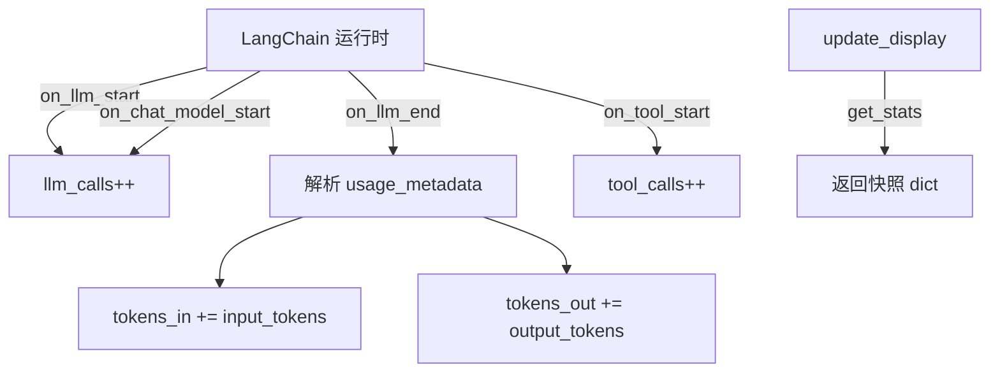

# PD-200.01 TradingAgents — Rich Live Layout 实时终端仪表盘

> 文档编号：PD-200.01
> 来源：TradingAgents `cli/main.py`, `cli/stats_handler.py`, `cli/utils.py`
> GitHub：https://github.com/TauricResearch/TradingAgents.git
> 问题域：PD-200 实时终端仪表盘 Real-time Terminal Dashboard
> 状态：可复用方案

---

## 第 1 章 问题与动机

### 1.1 核心问题

多 Agent 金融分析系统的执行过程涉及 10+ 个 Agent 的串行/并行协作（Analyst → Research → Trading → Risk → Portfolio），每个阶段产出不同类型的报告。用户在终端等待时面临三个痛点：

1. **进度不透明** — 不知道当前执行到哪个 Agent，哪些已完成
2. **消息洪流** — LLM 调用、工具调用、Agent 消息混杂，无法快速定位关键信息
3. **报告碎片化** — 各阶段报告分散产出，无法实时预览当前分析结论

传统的 `print()` 逐行输出无法同时展示这三类信息，且会因为滚动导致上下文丢失。

### 1.2 TradingAgents 的解法概述

TradingAgents 用 Rich 库的 `Live` + `Layout` 构建了一个四区域实时仪表盘：

1. **MessageBuffer 状态中枢** — 单例 `MessageBuffer` 类（`cli/main.py:43-227`）管理所有 Agent 状态、消息流、报告内容，解耦数据收集与 UI 渲染
2. **Layout 四区布局** — `create_layout()`（`cli/main.py:232-245`）将终端分为 header / progress+messages / analysis / footer 四个区域
3. **Spinner 动画状态指示** — 用 Rich `Spinner("dots")` 为 `in_progress` 状态的 Agent 添加动态旋转动画（`cli/main.py:308-311`）
4. **StatsCallbackHandler 统计** — 线程安全的 LangChain 回调处理器（`cli/stats_handler.py:9-76`）追踪 LLM 调用次数和 token 用量
5. **报告自动保存** — 装饰器模式拦截 `update_report_section` 调用，实时写入磁盘（`cli/main.py:966-977`）

### 1.3 设计思想

| 设计原则 | 具体实现 | 理由 | 替代方案 |
|----------|----------|------|----------|
| 数据-视图分离 | MessageBuffer 持有状态，update_display 只读渲染 | 避免 UI 逻辑与业务逻辑耦合 | 直接在回调中操作 Rich 组件 |
| 单例状态中枢 | 模块级 `message_buffer = MessageBuffer()` | 全局唯一状态源，多处写入不冲突 | 传递 buffer 引用到每个回调 |
| 声明式布局 | Layout.split_column/split_row 嵌套定义 | 布局结构一目了然，易于调整比例 | 手动计算终端行列坐标 |
| 线程安全统计 | StatsCallbackHandler 用 threading.Lock 保护计数器 | LangChain 回调可能从多线程触发 | 用 queue 或 atomic 计数 |
| 装饰器拦截持久化 | wraps 装饰 add_message/update_report_section | 不修改原始类，透明添加磁盘写入 | 在 MessageBuffer 内部硬编码 IO |

---

## 第 2 章 源码实现分析

### 2.1 架构概览

TradingAgents CLI 仪表盘的整体架构分为三层：数据层（MessageBuffer + StatsCallbackHandler）、布局层（Layout 四区划分）、渲染层（Live 定时刷新）。

```
┌─────────────────────────────────────────────────────────────┐
│                    Rich Live (4fps)                          │
│  ┌───────────────────────────────────────────────────────┐  │
│  │  Header: Welcome Banner                               │  │
│  ├──────────────────────┬────────────────────────────────┤  │
│  │  Progress Panel      │  Messages & Tools Panel        │  │
│  │  (Agent Status Tree) │  (Time | Type | Content)       │  │
│  │  Team → Agent → ●/⟳ │  newest-first, max 12 rows     │  │
│  ├──────────────────────┴────────────────────────────────┤  │
│  │  Analysis Panel: Current Report (Markdown rendered)    │  │
│  ├───────────────────────────────────────────────────────┤  │
│  │  Footer: Agents 3/10 | LLM: 15 | Tools: 8 | ⏱ 02:34 │  │
│  └───────────────────────────────────────────────────────┘  │
└─────────────────────────────────────────────────────────────┘
         ▲                    ▲                    ▲
         │                    │                    │
    MessageBuffer      StatsCallbackHandler   graph.stream()
    (agent_status,     (llm_calls,            (chunk events)
     messages,          tool_calls,
     report_sections)   tokens_in/out)
```

### 2.2 核心实现

#### 2.2.1 MessageBuffer — 状态中枢



对应源码 `cli/main.py:43-117`：

```python
class MessageBuffer:
    FIXED_AGENTS = {
        "Research Team": ["Bull Researcher", "Bear Researcher", "Research Manager"],
        "Trading Team": ["Trader"],
        "Risk Management": ["Aggressive Analyst", "Neutral Analyst", "Conservative Analyst"],
        "Portfolio Management": ["Portfolio Manager"],
    }
    ANALYST_MAPPING = {
        "market": "Market Analyst",
        "social": "Social Analyst",
        "news": "News Analyst",
        "fundamentals": "Fundamentals Analyst",
    }
    REPORT_SECTIONS = {
        "market_report": ("market", "Market Analyst"),
        "sentiment_report": ("social", "Social Analyst"),
        "news_report": ("news", "News Analyst"),
        "fundamentals_report": ("fundamentals", "Fundamentals Analyst"),
        "investment_plan": (None, "Research Manager"),
        "trader_investment_plan": (None, "Trader"),
        "final_trade_decision": (None, "Portfolio Manager"),
    }

    def __init__(self, max_length=100):
        self.messages = deque(maxlen=max_length)
        self.tool_calls = deque(maxlen=max_length)
        self.current_report = None
        self.final_report = None
        self.agent_status = {}
        self.current_agent = None
        self.report_sections = {}
        self.selected_analysts = []
        self._last_message_id = None

    def init_for_analysis(self, selected_analysts):
        self.selected_analysts = [a.lower() for a in selected_analysts]
        self.agent_status = {}
        for analyst_key in self.selected_analysts:
            if analyst_key in self.ANALYST_MAPPING:
                self.agent_status[self.ANALYST_MAPPING[analyst_key]] = "pending"
        for team_agents in self.FIXED_AGENTS.values():
            for agent in team_agents:
                self.agent_status[agent] = "pending"
```

关键设计点：
- `deque(maxlen=100)` 自动淘汰旧消息，防止内存无限增长（`cli/main.py:74-75`）
- `init_for_analysis()` 根据用户选择的分析师动态构建 agent_status 和 report_sections（`cli/main.py:84-117`）
- `_last_message_id` 去重机制防止 LangGraph stream 重复推送同一消息（`cli/main.py:82`）

#### 2.2.2 Layout 四区布局



对应源码 `cli/main.py:232-245`：

```python
def create_layout():
    layout = Layout()
    layout.split_column(
        Layout(name="header", size=3),
        Layout(name="main"),
        Layout(name="footer", size=3),
    )
    layout["main"].split_column(
        Layout(name="upper", ratio=3), Layout(name="analysis", ratio=5)
    )
    layout["upper"].split_row(
        Layout(name="progress", ratio=2), Layout(name="messages", ratio=3)
    )
    return layout
```

布局策略：header 和 footer 固定 3 行高度，main 区域自适应终端大小。upper 和 analysis 按 3:5 比例分配，progress 和 messages 按 2:3 比例分配。

#### 2.2.3 StatsCallbackHandler — 线程安全统计



对应源码 `cli/stats_handler.py:9-76`：

```python
class StatsCallbackHandler(BaseCallbackHandler):
    def __init__(self) -> None:
        super().__init__()
        self._lock = threading.Lock()
        self.llm_calls = 0
        self.tool_calls = 0
        self.tokens_in = 0
        self.tokens_out = 0

    def on_llm_end(self, response: LLMResult, **kwargs: Any) -> None:
        try:
            generation = response.generations[0][0]
        except (IndexError, TypeError):
            return
        usage_metadata = None
        if hasattr(generation, "message"):
            message = generation.message
            if isinstance(message, AIMessage) and hasattr(message, "usage_metadata"):
                usage_metadata = message.usage_metadata
        if usage_metadata:
            with self._lock:
                self.tokens_in += usage_metadata.get("input_tokens", 0)
                self.tokens_out += usage_metadata.get("output_tokens", 0)

    def get_stats(self) -> Dict[str, Any]:
        with self._lock:
            return {
                "llm_calls": self.llm_calls,
                "tool_calls": self.tool_calls,
                "tokens_in": self.tokens_in,
                "tokens_out": self.tokens_out,
            }
```

### 2.3 实现细节

**Agent 状态机流转**（`cli/main.py:790-822`）：

`update_analyst_statuses()` 实现了一个隐式状态机：按固定顺序（market → social → news → fundamentals）遍历已选分析师，有报告的标记 completed，第一个无报告的标记 in_progress，其余保持 pending。当所有分析师完成后，自动将 Bull Researcher 切换为 in_progress，触发下一阶段。

**Spinner 动画**（`cli/main.py:308-311`）：

Rich 的 `Spinner("dots")` 在 `Live` 上下文中自动播放帧动画。每次 `update_display` 调用时，in_progress 状态的 Agent 会创建新的 Spinner 实例放入 Table cell，Live 的 4fps 刷新率驱动动画。

**消息去重**（`cli/main.py:1026-1029`）：

LangGraph 的 `graph.stream()` 可能对同一消息多次推送。通过 `_last_message_id` 与 LangChain message 的 `id` 属性比对，跳过重复消息。

**装饰器持久化**（`cli/main.py:944-981`）：

三个装饰器分别拦截 `add_message`、`add_tool_call`、`update_report_section`，在原始方法执行后追加磁盘写入。这种方式不修改 MessageBuffer 类本身，保持了数据层的纯净性。

**报告完成度计算**（`cli/main.py:119-138`）：

`get_completed_reports_count()` 采用双条件判定：报告内容非空 AND 负责该报告的 Agent 状态为 completed。这防止了辩论中间轮次的临时内容被误计为已完成报告。

---

## 第 3 章 迁移指南

### 3.1 迁移清单

**阶段 1：基础设施（必选）**

- [ ] 安装依赖：`pip install rich`
- [ ] 创建 `MessageBuffer` 类，定义 agent 列表和状态字典
- [ ] 创建 `create_layout()` 函数，按需求划分终端区域
- [ ] 创建 `update_display()` 函数，从 buffer 读取数据渲染到 layout

**阶段 2：数据接入（按框架适配）**

- [ ] 如果用 LangChain/LangGraph：实现 `StatsCallbackHandler(BaseCallbackHandler)`
- [ ] 如果用其他框架：在 Agent 执行回调点调用 `buffer.update_agent_status()`
- [ ] 接入消息流：在 LLM 输出回调中调用 `buffer.add_message()`
- [ ] 接入报告更新：在阶段完成回调中调用 `buffer.update_report_section()`

**阶段 3：增强功能（可选）**

- [ ] 添加装饰器持久化（消息日志 + 报告自动保存）
- [ ] 添加 token 统计显示
- [ ] 添加计时器
- [ ] 添加报告完成后的磁盘保存交互

### 3.2 适配代码模板

以下是一个可直接运行的最小化实时仪表盘模板，不依赖 LangChain：

```python
"""Minimal real-time terminal dashboard using Rich Live Layout."""
import time
import threading
from collections import deque
from datetime import datetime
from rich.console import Console
from rich.live import Live
from rich.layout import Layout
from rich.panel import Panel
from rich.table import Table
from rich.spinner import Spinner
from rich.markdown import Markdown
from rich import box


class DashboardBuffer:
    """Central state hub for the dashboard — data-view separation."""

    def __init__(self, agents: dict[str, list[str]], max_messages: int = 50):
        self.messages: deque = deque(maxlen=max_messages)
        self.agent_status: dict[str, str] = {}
        self.current_report: str | None = None
        self._lock = threading.Lock()

        # Initialize all agents as pending
        for team_agents in agents.values():
            for agent in team_agents:
                self.agent_status[agent] = "pending"
        self._teams = agents

    def add_message(self, msg_type: str, content: str) -> None:
        ts = datetime.now().strftime("%H:%M:%S")
        with self._lock:
            self.messages.append((ts, msg_type, content))

    def update_agent(self, agent: str, status: str) -> None:
        with self._lock:
            if agent in self.agent_status:
                self.agent_status[agent] = status

    def set_report(self, content: str) -> None:
        with self._lock:
            self.current_report = content


def create_dashboard_layout() -> Layout:
    """Create a 4-zone terminal layout."""
    layout = Layout()
    layout.split_column(
        Layout(name="header", size=3),
        Layout(name="body"),
        Layout(name="footer", size=3),
    )
    layout["body"].split_column(
        Layout(name="upper", ratio=2),
        Layout(name="report", ratio=3),
    )
    layout["upper"].split_row(
        Layout(name="progress", ratio=2),
        Layout(name="messages", ratio=3),
    )
    return layout


def render(layout: Layout, buf: DashboardBuffer, start: float) -> None:
    """Read-only render: pull state from buffer, push to layout."""
    # Header
    layout["header"].update(
        Panel("[bold cyan]Agent Dashboard[/bold cyan]", border_style="cyan")
    )

    # Progress table with spinners
    tbl = Table(show_header=True, header_style="bold magenta", box=box.SIMPLE_HEAD, expand=True)
    tbl.add_column("Team", style="cyan", width=16)
    tbl.add_column("Agent", style="green", width=20)
    tbl.add_column("Status", width=14)

    for team, agents in buf._teams.items():
        for i, agent in enumerate(agents):
            status = buf.agent_status.get(agent, "pending")
            if status == "in_progress":
                cell = Spinner("dots", text="[blue]running[/blue]")
            else:
                color = {"pending": "yellow", "completed": "green", "error": "red"}.get(status, "white")
                cell = f"[{color}]{status}[/{color}]"
            tbl.add_row(team if i == 0 else "", agent, cell)

    layout["progress"].update(Panel(tbl, title="Progress", border_style="cyan"))

    # Messages (newest first)
    msg_tbl = Table(show_header=True, box=box.MINIMAL, expand=True)
    msg_tbl.add_column("Time", width=8)
    msg_tbl.add_column("Type", width=8)
    msg_tbl.add_column("Content", ratio=1)
    for ts, mt, content in reversed(list(buf.messages)[-10:]):
        msg_tbl.add_row(ts, mt, content[:120])
    layout["messages"].update(Panel(msg_tbl, title="Messages", border_style="blue"))

    # Report
    report_content = Markdown(buf.current_report) if buf.current_report else "[dim]Waiting...[/dim]"
    layout["report"].update(Panel(report_content, title="Report", border_style="green"))

    # Footer
    done = sum(1 for s in buf.agent_status.values() if s == "completed")
    total = len(buf.agent_status)
    elapsed = int(time.time() - start)
    layout["footer"].update(
        Panel(f"Agents: {done}/{total} | ⏱ {elapsed // 60:02d}:{elapsed % 60:02d}", border_style="grey50")
    )


# --- Usage example ---
if __name__ == "__main__":
    teams = {
        "Analysis": ["Researcher A", "Researcher B"],
        "Review": ["Reviewer"],
    }
    buf = DashboardBuffer(teams)
    layout = create_dashboard_layout()
    start = time.time()

    with Live(layout, refresh_per_second=4):
        for agent in ["Researcher A", "Researcher B", "Reviewer"]:
            buf.update_agent(agent, "in_progress")
            buf.add_message("System", f"{agent} started")
            render(layout, buf, start)
            time.sleep(2)  # Simulate work
            buf.update_agent(agent, "completed")
            buf.set_report(f"## {agent}\nAnalysis complete.")
            render(layout, buf, start)
```

### 3.3 适用场景

| 场景 | 适用度 | 说明 |
|------|--------|------|
| 多 Agent 串行流水线 CLI | ⭐⭐⭐ | 最佳场景：Agent 按阶段执行，需要展示进度和中间结果 |
| 单 Agent 长时间任务 | ⭐⭐ | 可简化为双面板（进度 + 输出），不需要复杂的 team 分组 |
| 并行 Agent 实时监控 | ⭐⭐⭐ | MessageBuffer 的 deque + Lock 天然支持多线程写入 |
| Web 后端状态推送 | ⭐ | 不适用，Rich 是终端库；但 MessageBuffer 模式可迁移到 WebSocket |
| CI/CD 管道可视化 | ⭐⭐ | 适合展示多阶段构建进度，但 CI 环境可能不支持终端动画 |

---

## 第 4 章 测试用例

```python
"""Tests for TradingAgents-style real-time terminal dashboard components."""
import threading
import time
from collections import deque
from unittest.mock import MagicMock, patch

import pytest


class TestMessageBuffer:
    """Test MessageBuffer state management."""

    def setup_method(self):
        # Inline minimal MessageBuffer for testing
        from collections import deque

        class MessageBuffer:
            FIXED_AGENTS = {
                "Research Team": ["Bull Researcher", "Bear Researcher", "Research Manager"],
                "Trading Team": ["Trader"],
            }
            ANALYST_MAPPING = {
                "market": "Market Analyst",
                "news": "News Analyst",
            }
            REPORT_SECTIONS = {
                "market_report": ("market", "Market Analyst"),
                "news_report": ("news", "News Analyst"),
                "investment_plan": (None, "Research Manager"),
            }

            def __init__(self, max_length=100):
                self.messages = deque(maxlen=max_length)
                self.tool_calls = deque(maxlen=max_length)
                self.agent_status = {}
                self.report_sections = {}
                self.selected_analysts = []
                self._last_message_id = None

            def init_for_analysis(self, selected_analysts):
                self.selected_analysts = [a.lower() for a in selected_analysts]
                self.agent_status = {}
                for key in self.selected_analysts:
                    if key in self.ANALYST_MAPPING:
                        self.agent_status[self.ANALYST_MAPPING[key]] = "pending"
                for team_agents in self.FIXED_AGENTS.values():
                    for agent in team_agents:
                        self.agent_status[agent] = "pending"
                self.report_sections = {}
                for section, (analyst_key, _) in self.REPORT_SECTIONS.items():
                    if analyst_key is None or analyst_key in self.selected_analysts:
                        self.report_sections[section] = None

            def update_agent_status(self, agent, status):
                if agent in self.agent_status:
                    self.agent_status[agent] = status

            def get_completed_reports_count(self):
                count = 0
                for section in self.report_sections:
                    if section not in self.REPORT_SECTIONS:
                        continue
                    _, finalizing_agent = self.REPORT_SECTIONS[section]
                    has_content = self.report_sections.get(section) is not None
                    agent_done = self.agent_status.get(finalizing_agent) == "completed"
                    if has_content and agent_done:
                        count += 1
                return count

        self.buf = MessageBuffer()

    def test_init_for_analysis_builds_correct_agents(self):
        """Selected analysts + fixed teams should all appear in agent_status."""
        self.buf.init_for_analysis(["market", "news"])
        assert "Market Analyst" in self.buf.agent_status
        assert "News Analyst" in self.buf.agent_status
        assert "Bull Researcher" in self.buf.agent_status
        assert "Trader" in self.buf.agent_status
        assert all(s == "pending" for s in self.buf.agent_status.values())

    def test_init_for_analysis_filters_report_sections(self):
        """Only selected analyst reports + always-on reports should be included."""
        self.buf.init_for_analysis(["market"])
        assert "market_report" in self.buf.report_sections
        assert "news_report" not in self.buf.report_sections
        assert "investment_plan" in self.buf.report_sections  # always included

    def test_completed_reports_requires_agent_done(self):
        """Report with content but agent not completed should NOT count."""
        self.buf.init_for_analysis(["market"])
        self.buf.report_sections["market_report"] = "Some content"
        # Agent still pending
        assert self.buf.get_completed_reports_count() == 0
        # Now mark agent completed
        self.buf.update_agent_status("Market Analyst", "completed")
        assert self.buf.get_completed_reports_count() == 1

    def test_deque_maxlen_evicts_old_messages(self):
        """Messages beyond maxlen should be automatically evicted."""
        self.buf.messages = deque(maxlen=3)
        for i in range(5):
            self.buf.messages.append(("00:00", "System", f"msg-{i}"))
        assert len(self.buf.messages) == 3
        assert self.buf.messages[0][2] == "msg-2"

    def test_message_dedup_by_id(self):
        """Duplicate message IDs should be skipped."""
        self.buf._last_message_id = "abc-123"
        # Simulating the dedup check from main.py:1028
        msg_id = "abc-123"
        should_skip = msg_id == self.buf._last_message_id
        assert should_skip is True


class TestStatsCallbackHandler:
    """Test thread-safe statistics tracking."""

    def test_concurrent_increments(self):
        """Multiple threads incrementing counters should not lose counts."""
        import threading

        lock = threading.Lock()
        counters = {"llm": 0, "tool": 0}

        def increment(key, n):
            for _ in range(n):
                with lock:
                    counters[key] += 1

        threads = [
            threading.Thread(target=increment, args=("llm", 1000)),
            threading.Thread(target=increment, args=("llm", 1000)),
            threading.Thread(target=increment, args=("tool", 500)),
        ]
        for t in threads:
            t.start()
        for t in threads:
            t.join()

        assert counters["llm"] == 2000
        assert counters["tool"] == 500

    def test_token_format_display(self):
        """Token formatting should use k suffix for >= 1000."""
        def format_tokens(n):
            if n >= 1000:
                return f"{n/1000:.1f}k"
            return str(n)

        assert format_tokens(500) == "500"
        assert format_tokens(1000) == "1.0k"
        assert format_tokens(15432) == "15.4k"
```

---

## 第 5 章 跨域关联

| 关联域 | 关系类型 | 说明 |
|--------|----------|------|
| PD-02 多 Agent 编排 | 依赖 | 仪表盘的 Agent 状态追踪直接依赖编排层的阶段划分（Analyst → Research → Trading → Risk → Portfolio） |
| PD-11 可观测性 | 协同 | StatsCallbackHandler 提供 LLM/Tool 调用计数和 token 统计，是可观测性的终端展示层 |
| PD-01 上下文管理 | 协同 | token 统计（tokens_in/out）可用于监控上下文窗口使用率，辅助上下文管理决策 |
| PD-03 容错与重试 | 协同 | Agent 状态中的 "error" 状态可与容错重试机制联动，在仪表盘上实时展示重试进度 |
| PD-09 Human-in-the-Loop | 协同 | 仪表盘的交互式报告保存（save_report_to_disk 后的 typer.prompt）是 HITL 的一种轻量实现 |

---

## 第 6 章 来源文件索引

| 文件 | 行范围 | 关键实现 |
|------|--------|----------|
| `cli/main.py` | L43-L227 | MessageBuffer 类：状态管理、消息缓冲、报告拼接 |
| `cli/main.py` | L232-L245 | create_layout()：四区 Layout 布局定义 |
| `cli/main.py` | L255-L459 | update_display()：从 buffer 读取状态渲染到 Layout 各区域 |
| `cli/main.py` | L790-L822 | update_analyst_statuses()：隐式状态机，按顺序推进 Agent 状态 |
| `cli/main.py` | L824-L897 | extract_content_string() + classify_message_type()：消息分类与内容提取 |
| `cli/main.py` | L899-L1142 | run_analysis()：主流程，Live 上下文 + graph.stream 事件循环 |
| `cli/main.py` | L944-L981 | 装饰器持久化：拦截 buffer 方法追加磁盘写入 |
| `cli/main.py` | L616-L703 | save_report_to_disk()：分目录保存完整报告 |
| `cli/stats_handler.py` | L9-L76 | StatsCallbackHandler：线程安全的 LLM/Tool 统计回调 |
| `cli/utils.py` | L1-L329 | 交互式选择器：questionary 驱动的用户输入收集 |
| `cli/models.py` | L1-L11 | AnalystType 枚举定义 |
| `cli/announcements.py` | L1-L51 | 公告获取与展示 |

---

## 第 7 章 横向对比维度

```json comparison_data
{
  "project": "TradingAgents",
  "dimensions": {
    "布局架构": "Rich Layout 四区嵌套：header/progress+messages/analysis/footer，ratio 自适应",
    "状态管理": "单例 MessageBuffer + deque(maxlen) 自动淘汰，数据-视图完全分离",
    "刷新机制": "Rich Live refresh_per_second=4，Spinner 动画驱动 in_progress 状态",
    "统计追踪": "LangChain BaseCallbackHandler + threading.Lock，追踪 LLM/Tool/Token 四指标",
    "持久化策略": "装饰器拦截 buffer 方法，实时写入日志文件和分目录报告",
    "消息去重": "_last_message_id 比对 LangChain message.id，防止 stream 重复推送"
  }
}
```

### 域元数据补充

```json domain_metadata
{
  "solution_summary": "TradingAgents 用 Rich Live Layout 四区布局 + 单例 MessageBuffer 状态中枢 + StatsCallbackHandler 线程安全统计，构建 10+ Agent 金融分析流水线的实时终端仪表盘",
  "description": "终端仪表盘需要解决多 Agent 长时间运行时的进度可视化与中间结果预览问题",
  "sub_problems": [
    "LLM/Tool 调用统计与 token 用量实时展示",
    "报告完成度的双条件判定（内容非空 + Agent 完成）",
    "消息流去重与分类展示"
  ],
  "best_practices": [
    "装饰器拦截 buffer 方法实现透明磁盘持久化",
    "deque(maxlen) 自动淘汰旧消息防止内存增长",
    "线程安全回调处理器用 Lock 保护共享计数器"
  ]
}
```
