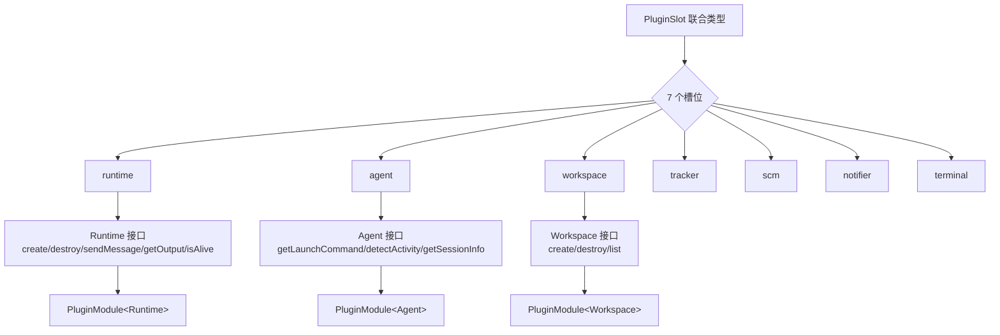
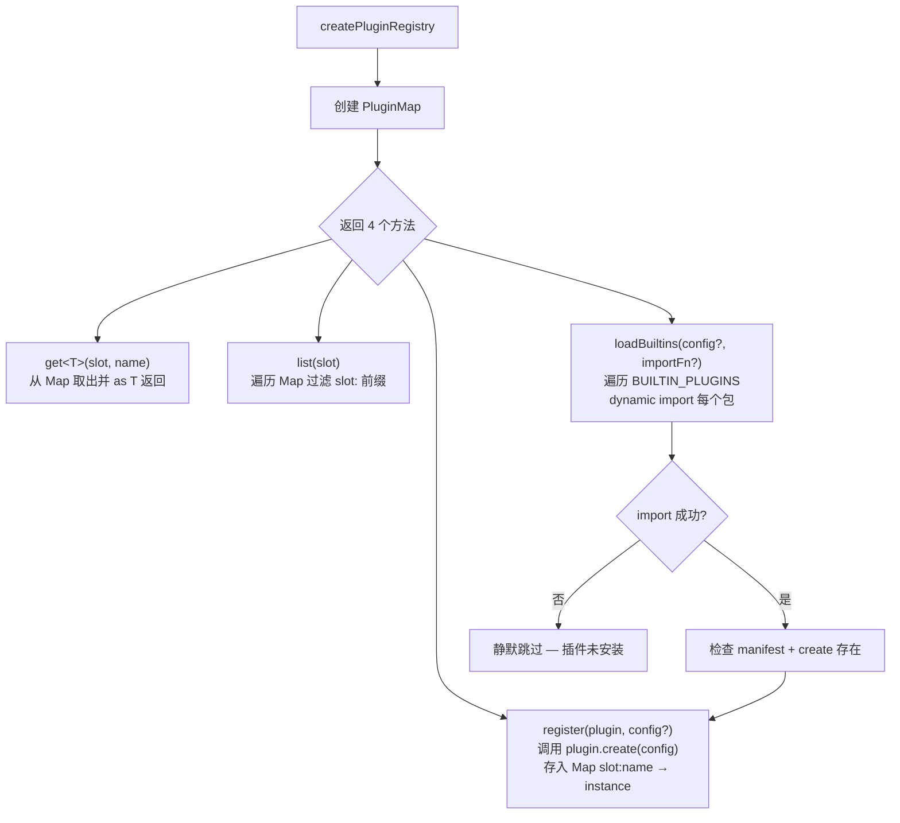
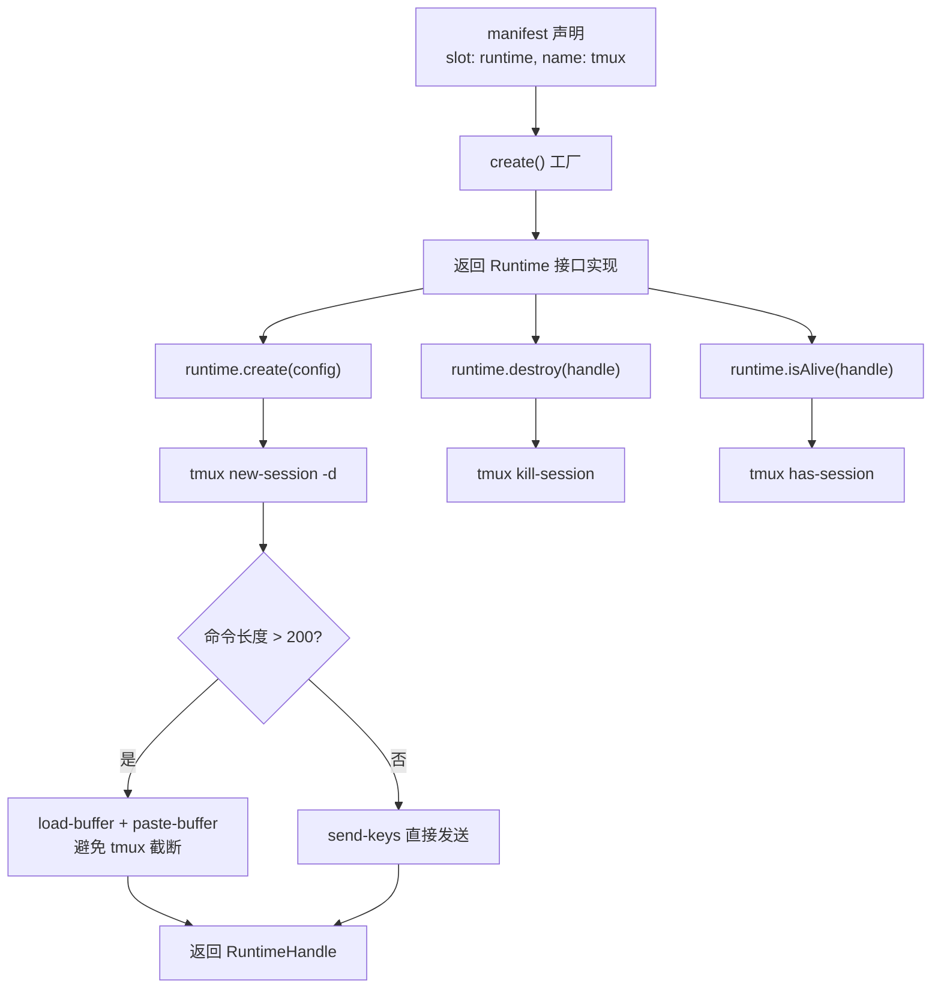

# PD-201.01 Agent Orchestrator — 8 槽位 PluginModule 注册表

> 文档编号：PD-201.01
> 来源：Agent Orchestrator `packages/core/src/plugin-registry.ts`, `packages/core/src/types.ts`
> GitHub：https://github.com/ComposioHQ/agent-orchestrator.git
> 问题域：PD-201 插件化架构 Plugin Architecture
> 状态：可复用方案

---

## 第 1 章 问题与动机

### 1.1 核心问题

Agent 编排系统需要同时支持多种运行时（tmux/docker/process）、多种 AI Agent（Claude Code/Codex/Aider）、多种工作区隔离方式（worktree/clone）、多种通知渠道（desktop/slack/webhook）等。如果将这些实现硬编码在核心逻辑中，会导致：

1. **耦合爆炸**：核心代码需要 import 所有具体实现，每新增一个 Agent 或 Runtime 都要改核心
2. **部署膨胀**：用户只用 tmux + Claude Code，却被迫安装 Docker/Codex 等无关依赖
3. **扩展困难**：第三方开发者无法在不 fork 核心的情况下添加新的 Runtime 或 Agent

Agent Orchestrator 的解法是定义 **8 个插件槽位**（Plugin Slot），每个槽位有严格的 TypeScript 接口约束，所有具体实现都是独立 npm 包，通过统一的 `PluginModule<T>` 协议注册到 `PluginRegistry`。

### 1.2 Agent Orchestrator 的解法概述

1. **8 个类型化槽位**：`runtime | agent | workspace | tracker | scm | notifier | terminal` + lifecycle（核心不可插拔），每个槽位对应一个 TypeScript 接口（`types.ts:197-924`）
2. **PluginModule 统一协议**：每个插件导出 `{ manifest, create } satisfies PluginModule<T>`，manifest 声明元数据，create 工厂函数返回接口实例（`types.ts:927-945`）
3. **PluginRegistry 中央注册表**：`slot:name` 复合键的 Map 存储，支持 register/get/list 三种操作（`plugin-registry.ts:62-119`）
4. **内置 + 动态双轨加载**：17 个内置插件通过 `BUILTIN_PLUGINS` 数组声明，运行时 `dynamic import` 按需加载；未来支持 npm 包名和本地路径（`plugin-registry.ts:26-50`）
5. **配置驱动选择**：`agent-orchestrator.yaml` 中 `defaults` 字段指定默认插件，项目级可覆盖（`config.ts:84-89`）

### 1.3 设计思想

| 设计原则 | 具体实现 | 理由 | 替代方案 |
|----------|----------|------|----------|
| 接口隔离 | 每个槽位独立 interface（Runtime/Agent/Workspace 等） | 插件只需实现自己槽位的接口，不关心其他槽位 | 统一 Plugin 基类（过度抽象） |
| 编译时类型安全 | `satisfies PluginModule<T>` 约束导出 | 插件开发时即发现接口不匹配，不等到运行时 | 运行时 duck typing（延迟发现错误） |
| 按需加载 | `dynamic import` + try/catch 静默跳过 | 未安装的插件不阻塞启动，用户只装需要的 | 全量 import（部署膨胀） |
| 复合键寻址 | `slot:name` 作为 Map key | 不同槽位可以有同名插件（如 tracker:github 和 scm:github） | 全局唯一 name（命名冲突） |
| 配置优先级链 | defaults → project-level override → session-level override | 灵活度递增，大部分场景只需配 defaults | 单一配置层（不够灵活） |

---

## 第 2 章 源码实现分析

### 2.1 架构概览

Agent Orchestrator 的插件系统由三层组成：类型定义层、注册表层、消费层。

```
┌─────────────────────────────────────────────────────────────────┐
│                    agent-orchestrator.yaml                       │
│  defaults: { runtime: tmux, agent: claude-code, workspace: ... }│
└──────────────────────────┬──────────────────────────────────────┘
                           │ loadConfig()
                           ▼
┌─────────────────────────────────────────────────────────────────┐
│                     PluginRegistry                               │
│  ┌─────────────────────────────────────────────────────────┐    │
│  │  Map<"slot:name", { manifest, instance }>               │    │
│  │  ┌──────────────┬──────────────┬──────────────────────┐ │    │
│  │  │runtime:tmux  │agent:claude  │notifier:desktop  ... │ │    │
│  │  └──────────────┴──────────────┴──────────────────────┘ │    │
│  └─────────────────────────────────────────────────────────┘    │
│  register() / get<T>() / list() / loadBuiltins()                │
└──────────────────────────┬──────────────────────────────────────┘
                           │ resolvePlugins()
                           ▼
┌─────────────────────────────────────────────────────────────────┐
│                   SessionManager                                 │
│  spawn() → workspace.create() → runtime.create() → agent.launch │
│  list()  → runtime.isAlive() → agent.getActivityState()         │
│  kill()  → runtime.destroy() → workspace.destroy()              │
└─────────────────────────────────────────────────────────────────┘
```

### 2.2 核心实现

#### 2.2.1 插件类型系统



对应源码 `packages/core/src/types.ts:917-945`：

```typescript
/** Plugin slot types */
export type PluginSlot =
  | "runtime"
  | "agent"
  | "workspace"
  | "tracker"
  | "scm"
  | "notifier"
  | "terminal";

/** Plugin manifest — what every plugin exports */
export interface PluginManifest {
  name: string;
  slot: PluginSlot;
  description: string;
  version: string;
}

/** What a plugin module must export */
export interface PluginModule<T = unknown> {
  manifest: PluginManifest;
  create(config?: Record<string, unknown>): T;
}
```

每个槽位接口定义了该类别插件必须实现的方法。以 `Runtime` 为例（`types.ts:197-220`），它要求 `create/destroy/sendMessage/getOutput/isAlive` 五个核心方法，加上可选的 `getMetrics` 和 `getAttachInfo`。`Agent` 接口最为丰富（`types.ts:262-316`），包含活动检测、会话恢复、工作区钩子等 10+ 方法。

#### 2.2.2 PluginRegistry 实现



对应源码 `packages/core/src/plugin-registry.ts:62-119`：

```typescript
export function createPluginRegistry(): PluginRegistry {
  const plugins: PluginMap = new Map();

  return {
    register(plugin: PluginModule, config?: Record<string, unknown>): void {
      const { manifest } = plugin;
      const key = makeKey(manifest.slot, manifest.name);
      const instance = plugin.create(config);
      plugins.set(key, { manifest, instance });
    },

    get<T>(slot: PluginSlot, name: string): T | null {
      const entry = plugins.get(makeKey(slot, name));
      return entry ? (entry.instance as T) : null;
    },

    list(slot: PluginSlot): PluginManifest[] {
      const result: PluginManifest[] = [];
      for (const [key, entry] of plugins) {
        if (key.startsWith(`${slot}:`)) {
          result.push(entry.manifest);
        }
      }
      return result;
    },

    async loadBuiltins(
      orchestratorConfig?: OrchestratorConfig,
      importFn?: (pkg: string) => Promise<unknown>,
    ): Promise<void> {
      const doImport = importFn ?? ((pkg: string) => import(pkg));
      for (const builtin of BUILTIN_PLUGINS) {
        try {
          const mod = (await doImport(builtin.pkg)) as PluginModule;
          if (mod.manifest && typeof mod.create === "function") {
            const pluginConfig = orchestratorConfig
              ? extractPluginConfig(builtin.slot, builtin.name, orchestratorConfig)
              : undefined;
            this.register(mod, pluginConfig);
          }
        } catch {
          // Plugin not installed — that's fine, only load what's available
        }
      }
    },
  };
}
```

关键设计点：
- **`slot:name` 复合键**（`plugin-registry.ts:21-23`）：`makeKey` 函数将 slot 和 name 拼接为 Map 键，允许不同槽位有同名插件
- **工厂模式**：`register` 时立即调用 `plugin.create(config)` 创建实例，后续 `get` 直接返回实例
- **可注入 importFn**（`plugin-registry.ts:91`）：`loadBuiltins` 接受自定义 import 函数，便于测试时 mock

#### 2.2.3 插件实现范例 — runtime-tmux



对应源码 `packages/plugins/runtime-tmux/src/index.ts:19-184`：

```typescript
export const manifest = {
  name: "tmux",
  slot: "runtime" as const,
  description: "Runtime plugin: tmux sessions",
  version: "0.1.0",
};

export function create(): Runtime {
  return {
    name: "tmux",
    async create(config: RuntimeCreateConfig): Promise<RuntimeHandle> {
      assertValidSessionId(config.sessionId);
      const sessionName = config.sessionId;
      const envArgs: string[] = [];
      for (const [key, value] of Object.entries(config.environment ?? {})) {
        envArgs.push("-e", `${key}=${value}`);
      }
      await tmux("new-session", "-d", "-s", sessionName, "-c", config.workspacePath, ...envArgs);
      // ... send launch command with truncation protection ...
      return { id: sessionName, runtimeName: "tmux", data: { createdAt: Date.now() } };
    },
    // ... destroy, sendMessage, getOutput, isAlive, getMetrics, getAttachInfo
  };
}

export default { manifest, create } satisfies PluginModule<Runtime>;
```

### 2.3 实现细节

**插件消费链路**：`SessionManager` 通过 `resolvePlugins()` 函数（`session-manager.ts:213-226`）从 Registry 中按配置优先级链解析插件：

```typescript
function resolvePlugins(project: ProjectConfig, agentOverride?: string) {
  const runtime = registry.get<Runtime>("runtime", project.runtime ?? config.defaults.runtime);
  const agent = registry.get<Agent>("agent", agentOverride ?? project.agent ?? config.defaults.agent);
  const workspace = registry.get<Workspace>("workspace", project.workspace ?? config.defaults.workspace);
  const tracker = project.tracker ? registry.get<Tracker>("tracker", project.tracker.plugin) : null;
  const scm = project.scm ? registry.get<SCM>("scm", project.scm.plugin) : null;
  return { runtime, agent, workspace, tracker, scm };
}
```

**配置驱动默认值**（`config.ts:84-89`）：

```typescript
const DefaultPluginsSchema = z.object({
  runtime: z.string().default("tmux"),
  agent: z.string().default("claude-code"),
  workspace: z.string().default("worktree"),
  notifiers: z.array(z.string()).default(["composio", "desktop"]),
});
```

**17 个内置插件分布**（`plugin-registry.ts:26-50`）：
- Runtime: tmux, process（2 个）
- Agent: claude-code, codex, aider（3 个）
- Workspace: worktree, clone（2 个）
- Tracker: github, linear（2 个）
- SCM: github（1 个）
- Notifier: composio, desktop, slack, webhook（4 个）
- Terminal: iterm2, web（2 个）

加上 opencode agent 插件（存在于 packages/plugins 但未列入 BUILTIN_PLUGINS），实际有 18 个插件包。


---

## 第 3 章 迁移指南

### 3.1 迁移清单

**阶段 1：定义插件类型系统**

- [ ] 定义 `PluginSlot` 联合类型，枚举你系统中的所有扩展点
- [ ] 为每个槽位定义独立的 TypeScript 接口（如 `Runtime`, `Agent`）
- [ ] 定义 `PluginManifest` 接口（name, slot, description, version）
- [ ] 定义 `PluginModule<T>` 泛型接口（manifest + create 工厂）

**阶段 2：实现 PluginRegistry**

- [ ] 实现 `createPluginRegistry()` 工厂函数
- [ ] 实现 `register/get/list` 三个核心方法
- [ ] 实现 `loadBuiltins` 动态加载（可注入 importFn 便于测试）
- [ ] 定义 `BUILTIN_PLUGINS` 内置插件清单

**阶段 3：实现首个插件**

- [ ] 创建独立 npm 包（如 `@yourorg/plugin-runtime-docker`）
- [ ] 导出 `manifest` 对象 + `create()` 工厂函数
- [ ] 使用 `satisfies PluginModule<T>` 确保编译时类型检查
- [ ] 默认导出 `{ manifest, create } satisfies PluginModule<T>`

**阶段 4：配置驱动**

- [ ] 定义配置 schema（Zod 推荐），包含 `defaults` 字段指定默认插件
- [ ] 支持项目级/会话级插件覆盖
- [ ] 实现 `resolvePlugins()` 按优先级链解析插件

### 3.2 适配代码模板

#### 最小可运行的插件系统

```typescript
// === types.ts ===
export type PluginSlot = "runtime" | "agent" | "storage";

export interface PluginManifest {
  name: string;
  slot: PluginSlot;
  description: string;
  version: string;
}

export interface PluginModule<T = unknown> {
  manifest: PluginManifest;
  create(config?: Record<string, unknown>): T;
}

// === plugin-registry.ts ===
type PluginMap = Map<string, { manifest: PluginManifest; instance: unknown }>;

function makeKey(slot: PluginSlot, name: string): string {
  return `${slot}:${name}`;
}

export interface PluginRegistry {
  register(plugin: PluginModule, config?: Record<string, unknown>): void;
  get<T>(slot: PluginSlot, name: string): T | null;
  list(slot: PluginSlot): PluginManifest[];
  loadBuiltins(importFn?: (pkg: string) => Promise<unknown>): Promise<void>;
}

const BUILTIN_PLUGINS: Array<{ slot: PluginSlot; name: string; pkg: string }> = [
  { slot: "runtime", name: "docker", pkg: "@myorg/plugin-runtime-docker" },
  { slot: "agent", name: "openai", pkg: "@myorg/plugin-agent-openai" },
];

export function createPluginRegistry(): PluginRegistry {
  const plugins: PluginMap = new Map();

  return {
    register(plugin: PluginModule, config?: Record<string, unknown>): void {
      const key = makeKey(plugin.manifest.slot, plugin.manifest.name);
      plugins.set(key, { manifest: plugin.manifest, instance: plugin.create(config) });
    },

    get<T>(slot: PluginSlot, name: string): T | null {
      const entry = plugins.get(makeKey(slot, name));
      return entry ? (entry.instance as T) : null;
    },

    list(slot: PluginSlot): PluginManifest[] {
      return [...plugins.entries()]
        .filter(([key]) => key.startsWith(`${slot}:`))
        .map(([, entry]) => entry.manifest);
    },

    async loadBuiltins(importFn?: (pkg: string) => Promise<unknown>): Promise<void> {
      const doImport = importFn ?? ((pkg: string) => import(pkg));
      for (const builtin of BUILTIN_PLUGINS) {
        try {
          const mod = (await doImport(builtin.pkg)) as PluginModule;
          if (mod.manifest && typeof mod.create === "function") {
            this.register(mod);
          }
        } catch {
          // Not installed — skip silently
        }
      }
    },
  };
}

// === 插件实现示例 ===
import type { PluginModule } from "./types";

interface MyRuntime {
  readonly name: string;
  start(config: { id: string }): Promise<string>;
  stop(id: string): Promise<void>;
}

export const manifest = {
  name: "docker",
  slot: "runtime" as const,
  description: "Docker container runtime",
  version: "1.0.0",
};

export function create(): MyRuntime {
  return {
    name: "docker",
    async start(config) { /* ... */ return config.id; },
    async stop(id) { /* ... */ },
  };
}

export default { manifest, create } satisfies PluginModule<MyRuntime>;
```

### 3.3 适用场景

| 场景 | 适用度 | 说明 |
|------|--------|------|
| 多 Agent 编排系统 | ⭐⭐⭐ | 需要支持多种 AI Agent（Claude/GPT/Codex）的系统，直接复用 8 槽位模型 |
| CLI 工具插件化 | ⭐⭐⭐ | 命令行工具需要可扩展的子命令或后端，PluginModule 模式轻量且类型安全 |
| 微服务网关 | ⭐⭐ | 网关的 middleware/auth/rate-limit 可用槽位模型，但可能需要更复杂的生命周期 |
| 单一后端服务 | ⭐ | 扩展点少于 3 个时，直接依赖注入比插件系统更简单 |

---

## 第 4 章 测试用例

```typescript
import { describe, it, expect, vi } from "vitest";
import { createPluginRegistry } from "./plugin-registry";
import type { PluginModule, Runtime, PluginSlot } from "./types";

// Mock plugin for testing
function createMockPlugin(slot: PluginSlot, name: string): PluginModule {
  return {
    manifest: { name, slot, description: `Mock ${name}`, version: "0.1.0" },
    create: (config?: Record<string, unknown>) => ({
      name,
      config,
      mockMethod: () => `${slot}:${name}`,
    }),
  };
}

describe("PluginRegistry", () => {
  describe("register and get", () => {
    it("should register a plugin and retrieve it by slot:name", () => {
      const registry = createPluginRegistry();
      const plugin = createMockPlugin("runtime", "tmux");
      registry.register(plugin);

      const instance = registry.get<{ name: string }>("runtime", "tmux");
      expect(instance).not.toBeNull();
      expect(instance!.name).toBe("tmux");
    });

    it("should return null for unregistered plugin", () => {
      const registry = createPluginRegistry();
      expect(registry.get("runtime", "nonexistent")).toBeNull();
    });

    it("should allow same name in different slots", () => {
      const registry = createPluginRegistry();
      registry.register(createMockPlugin("tracker", "github"));
      registry.register(createMockPlugin("scm", "github"));

      expect(registry.get("tracker", "github")).not.toBeNull();
      expect(registry.get("scm", "github")).not.toBeNull();
      // They are different instances
      expect(registry.get("tracker", "github")).not.toBe(registry.get("scm", "github"));
    });

    it("should pass config to create()", () => {
      const registry = createPluginRegistry();
      const plugin = createMockPlugin("runtime", "docker");
      registry.register(plugin, { port: 2375 });

      const instance = registry.get<{ config: Record<string, unknown> }>("runtime", "docker");
      expect(instance!.config).toEqual({ port: 2375 });
    });
  });

  describe("list", () => {
    it("should list all plugins for a given slot", () => {
      const registry = createPluginRegistry();
      registry.register(createMockPlugin("notifier", "desktop"));
      registry.register(createMockPlugin("notifier", "slack"));
      registry.register(createMockPlugin("runtime", "tmux"));

      const notifiers = registry.list("notifier");
      expect(notifiers).toHaveLength(2);
      expect(notifiers.map((m) => m.name)).toEqual(["desktop", "slack"]);
    });

    it("should return empty array for slot with no plugins", () => {
      const registry = createPluginRegistry();
      expect(registry.list("terminal")).toEqual([]);
    });
  });

  describe("loadBuiltins", () => {
    it("should load plugins via dynamic import", async () => {
      const registry = createPluginRegistry();
      const mockTmux = createMockPlugin("runtime", "tmux");

      const importFn = vi.fn().mockImplementation((pkg: string) => {
        if (pkg === "@composio/ao-plugin-runtime-tmux") return Promise.resolve(mockTmux);
        return Promise.reject(new Error("not found"));
      });

      await registry.loadBuiltins(undefined, importFn);
      expect(registry.get("runtime", "tmux")).not.toBeNull();
    });

    it("should silently skip plugins that fail to import", async () => {
      const registry = createPluginRegistry();
      const importFn = vi.fn().mockRejectedValue(new Error("MODULE_NOT_FOUND"));

      await registry.loadBuiltins(undefined, importFn);
      // No error thrown, registry is empty
      expect(registry.list("runtime")).toEqual([]);
    });

    it("should skip modules without manifest or create", async () => {
      const registry = createPluginRegistry();
      const importFn = vi.fn().mockResolvedValue({ notAPlugin: true });

      await registry.loadBuiltins(undefined, importFn);
      expect(registry.list("runtime")).toEqual([]);
    });
  });
});
```


---

## 第 5 章 跨域关联

| 关联域 | 关系类型 | 说明 |
|--------|----------|------|
| PD-04 工具系统 | 协同 | Agent 插件的 `getLaunchCommand` 和 `getEnvironment` 决定了 Agent 可用的工具集；插件系统本身就是一种工具注册机制 |
| PD-02 多 Agent 编排 | 依赖 | SessionManager 的 `spawn/list/kill` 流程依赖插件系统解析 Runtime/Agent/Workspace 三个核心插件 |
| PD-05 沙箱隔离 | 协同 | Workspace 插件（worktree/clone）提供代码隔离，Runtime 插件（tmux/process）提供进程隔离，两者通过插件系统组合 |
| PD-11 可观测性 | 协同 | Agent 插件的 `getActivityState` 和 `getSessionInfo` 是可观测性数据的主要来源；Notifier 插件负责事件推送 |
| PD-06 记忆持久化 | 协同 | Agent 插件的 `getRestoreCommand` 和 `setupWorkspaceHooks` 支持会话恢复和元数据持久化 |

---

## 第 6 章 来源文件索引

| 文件 | 行范围 | 关键实现 |
|------|--------|----------|
| `packages/core/src/types.ts` | L917-L945 | PluginSlot、PluginManifest、PluginModule 类型定义 |
| `packages/core/src/types.ts` | L197-L252 | Runtime 接口定义（7 个方法） |
| `packages/core/src/types.ts` | L262-L316 | Agent 接口定义（10+ 方法，含可选钩子） |
| `packages/core/src/types.ts` | L379-L399 | Workspace 接口定义（含 restore 可选方法） |
| `packages/core/src/types.ts` | L1015-L1036 | PluginRegistry 接口定义 |
| `packages/core/src/plugin-registry.ts` | L1-L119 | PluginRegistry 完整实现 |
| `packages/core/src/plugin-registry.ts` | L26-L50 | BUILTIN_PLUGINS 17 个内置插件声明 |
| `packages/core/src/plugin-registry.ts` | L88-L106 | loadBuiltins 动态 import 加载逻辑 |
| `packages/core/src/config.ts` | L84-L89 | DefaultPluginsSchema 默认插件配置 |
| `packages/core/src/session-manager.ts` | L213-L226 | resolvePlugins 插件解析优先级链 |
| `packages/core/src/session-manager.ts` | L315-L559 | spawn 流程：workspace → runtime → agent 插件协作 |
| `packages/plugins/runtime-tmux/src/index.ts` | L19-L184 | tmux Runtime 插件完整实现 |
| `packages/plugins/agent-claude-code/src/index.ts` | L1-L785 | Claude Code Agent 插件（最复杂的插件实现） |
| `packages/plugins/notifier-desktop/src/index.ts` | L1-L116 | Desktop Notifier 插件实现 |
| `packages/plugins/workspace-worktree/src/index.ts` | L1-L301 | Git Worktree Workspace 插件实现 |
| `packages/core/src/index.ts` | L1-L82 | 核心包导出清单 |

---

## 第 7 章 横向对比维度

```json comparison_data
{
  "project": "AgentOrchestrator",
  "dimensions": {
    "插件接口": "8 个独立 TypeScript interface，每个槽位严格类型约束",
    "注册机制": "slot:name 复合键 Map + BUILTIN_PLUGINS 数组声明 + dynamic import",
    "类型安全": "satisfies PluginModule<T> 编译时检查 + 泛型 get<T> 运行时断言",
    "加载策略": "try/catch 静默跳过未安装插件，按需加载不阻塞启动",
    "配置传递": "YAML defaults → 项目级 override → 会话级 override 三层优先级链",
    "插件规模": "17 个内置插件覆盖 7 个槽位，monorepo 独立 npm 包",
    "热更新": "不支持运行时热更新，启动时一次性加载"
  }
}
```

### 域元数据补充

```json domain_metadata
{
  "solution_summary": "Agent Orchestrator 定义 7 个 PluginSlot 联合类型 + PluginModule<T> 泛型协议，PluginRegistry 用 slot:name 复合键 Map 管理 17 个内置插件，支持 dynamic import 按需加载和 YAML 三层配置覆盖",
  "description": "插件系统的槽位粒度设计与多层配置覆盖策略",
  "sub_problems": [
    "插件生命周期管理（启动时加载 vs 运行时热插拔）",
    "插件间依赖与协作（如 spawn 流程中 workspace→runtime→agent 的编排）",
    "可注入 importFn 的测试友好设计"
  ],
  "best_practices": [
    "slot:name 复合键避免跨槽位命名冲突",
    "try/catch 静默跳过未安装插件实现按需部署",
    "YAML defaults → project → session 三层配置优先级链"
  ]
}
```

