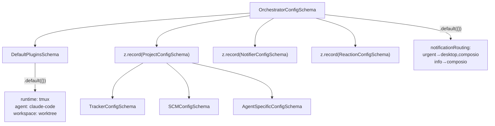
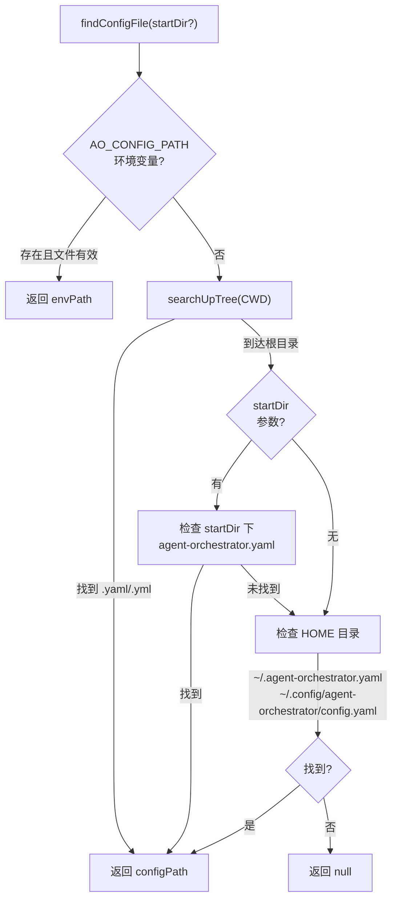
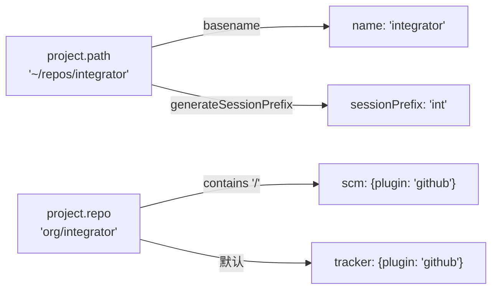

# PD-202.01 Agent Orchestrator — YAML 配置 + Zod Schema 运行时校验与多路径发现

> 文档编号：PD-202.01
> 来源：Agent Orchestrator `packages/core/src/config.ts`
> GitHub：https://github.com/ComposioHQ/agent-orchestrator.git
> 问题域：PD-202 配置管理 Configuration Management
> 状态：可复用方案

---

## 第 1 章 问题与动机

### 1.1 核心问题

Agent 编排系统需要管理多项目、多插件、多通知渠道的复杂配置。配置来源多样（YAML 文件、环境变量、CLI 参数），且需要在运行时保证类型安全。传统做法要么依赖 JSON Schema 静态校验（无法在运行时拦截非法值），要么用手写 if-else 校验（维护成本高、容易遗漏）。

Agent Orchestrator 面临的具体挑战：
- **8 个插件槽位**（Runtime/Agent/Workspace/Tracker/SCM/Notifier/Terminal/Lifecycle），每个都有独立配置
- **多项目并行**：同一实例管理多个 Git 仓库，需要防止 session prefix 冲突
- **环境感知**：`ao init` 需要自动检测 Git 仓库、tmux、gh CLI、Linear API Key 等环境信息
- **零配置启动**：最小配置只需 `repo` + `path` 两个字段，其余全部推导

### 1.2 Agent Orchestrator 的解法概述

1. **Zod Schema 分层定义** — 从叶子节点（ReactionConfig）到根节点（OrchestratorConfig）逐层构建 schema，每层都有 `.default()` 和 `.optional()`（`packages/core/src/config.ts:25-106`）
2. **四级配置文件发现** — `AO_CONFIG_PATH` 环境变量 → CWD 向上递归搜索 → 显式 startDir → HOME 目录三个位置（`packages/core/src/config.ts:289-349`）
3. **Convention over Configuration** — `applyProjectDefaults()` 从 `repo` 推导 SCM/Tracker，从 `path` 推导 name/sessionPrefix（`packages/core/src/config.ts:130-155`）
4. **唯一性校验** — `validateProjectUniqueness()` 检测项目 ID 和 session prefix 的碰撞，给出修复建议（`packages/core/src/config.ts:158-212`）
5. **Hash 隔离** — SHA256(configDir) 生成 12 位 hash，确保多实例目录不冲突（`packages/core/src/paths.ts:20-25`）

### 1.3 设计思想

| 设计原则 | 具体实现 | 理由 | 替代方案 |
|----------|----------|------|----------|
| 最小必填 | 只需 `repo` + `path`，其余全推导 | 降低上手门槛，5 行 YAML 即可启动 | 要求填写所有字段（如 Kubernetes YAML） |
| Schema 即文档 | Zod schema 同时生成 TS 类型和运行时校验 | 单一事实来源，类型和校验永远同步 | JSON Schema + 手写类型（容易不同步） |
| 向上搜索 | 类似 git 的 CWD→root 递归查找 | 在项目任意子目录都能找到配置 | 固定路径（如 ~/.config/ao.yaml） |
| 碰撞检测 | prefix 和 projectId 双重唯一性校验 | 多项目并行时 tmux session 名不冲突 | 运行时报错（用户体验差） |
| 默认反应链 | `applyDefaultReactions()` 预置 9 种事件反应 | 开箱即用的 CI 失败自动修复、PR 审查自动转发 | 用户手动配置每种反应（繁琐） |

---

## 第 2 章 源码实现分析

### 2.1 架构概览

Agent Orchestrator 的配置系统由三层组成：Schema 定义层、加载发现层、后处理层。

```
┌─────────────────────────────────────────────────────────┐
│                    ao init (CLI)                         │
│  detectEnvironment() → interactive/auto → writeFileSync │
└──────────────────────┬──────────────────────────────────┘
                       │ agent-orchestrator.yaml
                       ▼
┌─────────────────────────────────────────────────────────┐
│              loadConfig() / validateConfig()             │
│  ┌──────────┐  ┌──────────────┐  ┌───────────────────┐ │
│  │ YAML     │→ │ Zod Schema   │→ │ Post-processing   │ │
│  │ parse    │  │ .parse()     │  │ expandPaths()     │ │
│  │          │  │ defaults +   │  │ applyDefaults()   │ │
│  │          │  │ validation   │  │ applyReactions()  │ │
│  │          │  │              │  │ validateUnique()  │ │
│  └──────────┘  └──────────────┘  └───────────────────┘ │
└──────────────────────┬──────────────────────────────────┘
                       │ OrchestratorConfig
                       ▼
┌─────────────────────────────────────────────────────────┐
│              paths.ts — Hash-based Directory             │
│  configPath → SHA256 → 12-char hash → instance dirs     │
│  ~/.agent-orchestrator/{hash}-{projectId}/sessions/     │
└─────────────────────────────────────────────────────────┘
```

### 2.2 核心实现

#### 2.2.1 Zod Schema 分层定义



对应源码 `packages/core/src/config.ts:25-106`：

```typescript
const ReactionConfigSchema = z.object({
  auto: z.boolean().default(true),
  action: z.enum(["send-to-agent", "notify", "auto-merge"]).default("notify"),
  message: z.string().optional(),
  priority: z.enum(["urgent", "action", "warning", "info"]).optional(),
  retries: z.number().optional(),
  escalateAfter: z.union([z.number(), z.string()]).optional(),
  threshold: z.string().optional(),
  includeSummary: z.boolean().optional(),
});

const ProjectConfigSchema = z.object({
  name: z.string().optional(),
  repo: z.string(),                    // 唯一必填（与 path）
  path: z.string(),                    // 唯一必填（与 repo）
  defaultBranch: z.string().default("main"),
  sessionPrefix: z.string()
    .regex(/^[a-zA-Z0-9_-]+$/, "sessionPrefix must match [a-zA-Z0-9_-]+")
    .optional(),
  runtime: z.string().optional(),      // 覆盖 defaults.runtime
  agent: z.string().optional(),        // 覆盖 defaults.agent
  tracker: TrackerConfigSchema.optional(),
  agentConfig: AgentSpecificConfigSchema.optional(),
  reactions: z.record(ReactionConfigSchema.partial()).optional(),
  agentRules: z.string().optional(),
  agentRulesFile: z.string().optional(),
});

const OrchestratorConfigSchema = z.object({
  port: z.number().default(3000),
  readyThresholdMs: z.number().nonnegative().default(300_000),
  defaults: DefaultPluginsSchema.default({}),
  projects: z.record(ProjectConfigSchema),
  notifiers: z.record(NotifierConfigSchema).default({}),
  notificationRouting: z.record(z.array(z.string())).default({
    urgent: ["desktop", "composio"],
    action: ["desktop", "composio"],
    warning: ["composio"],
    info: ["composio"],
  }),
  reactions: z.record(ReactionConfigSchema).default({}),
});
```

关键设计：
- `.passthrough()` 用于插件配置（`TrackerConfigSchema`、`SCMConfigSchema`），允许插件自定义字段（如 Linear 的 `teamId`）
- `.default({})` 在根 schema 上确保 `defaults`、`notifiers`、`reactions` 即使不写也有合理值
- `z.union([z.number(), z.string()])` 用于 `escalateAfter`，支持 `2`（次数）和 `"30m"`（时间）两种格式

#### 2.2.2 四级配置文件发现



对应源码 `packages/core/src/config.ts:289-349`：

```typescript
export function findConfigFile(startDir?: string): string | null {
  // 1. 环境变量覆盖
  if (process.env["AO_CONFIG_PATH"]) {
    const envPath = resolve(process.env["AO_CONFIG_PATH"]);
    if (existsSync(envPath)) return envPath;
  }

  // 2. 类 git 向上递归搜索
  const searchUpTree = (dir: string): string | null => {
    const configFiles = ["agent-orchestrator.yaml", "agent-orchestrator.yml"];
    for (const filename of configFiles) {
      const configPath = resolve(dir, filename);
      if (existsSync(configPath)) return configPath;
    }
    const parent = resolve(dir, "..");
    if (parent === dir) return null; // 到达根目录
    return searchUpTree(parent);
  };

  const foundInTree = searchUpTree(process.cwd());
  if (foundInTree) return foundInTree;

  // 3. 显式 startDir
  if (startDir) { /* 检查 startDir 下的 yaml/yml */ }

  // 4. HOME 目录三个位置
  const homePaths = [
    resolve(homedir(), ".agent-orchestrator.yaml"),
    resolve(homedir(), ".agent-orchestrator.yml"),
    resolve(homedir(), ".config", "agent-orchestrator", "config.yaml"),
  ];
  for (const path of homePaths) {
    if (existsSync(path)) return path;
  }
  return null;
}
```

#### 2.2.3 Convention over Configuration — 默认值推导



对应源码 `packages/core/src/config.ts:130-155`：

```typescript
function applyProjectDefaults(config: OrchestratorConfig): OrchestratorConfig {
  for (const [id, project] of Object.entries(config.projects)) {
    if (!project.name) project.name = id;
    if (!project.sessionPrefix) {
      const projectId = basename(project.path);
      project.sessionPrefix = generateSessionPrefix(projectId);
    }
    if (!project.scm && project.repo.includes("/")) {
      project.scm = { plugin: "github" };
    }
    if (!project.tracker) {
      project.tracker = { plugin: "github" };
    }
  }
  return config;
}
```

### 2.3 实现细节

#### Session Prefix 智能生成

`generateSessionPrefix()` 使用四级启发式规则（`packages/core/src/paths.ts:55-78`）：

| 输入 | 规则 | 输出 |
|------|------|------|
| `app` | ≤4 字符，原样 | `app` |
| `PyTorch` | CamelCase，取大写字母 | `pt` |
| `agent-orchestrator` | kebab-case，取首字母 | `ao` |
| `integrator` | 单词，取前 3 字符 | `int` |

#### Hash 碰撞检测

`validateAndStoreOrigin()` 在 `~/.agent-orchestrator/{hash}-{projectId}/.origin` 文件中存储原始 configPath，每次启动时比对（`packages/core/src/paths.ts:173-194`）。如果同一 hash 对应不同 configPath，抛出明确错误。

#### ao init 环境探测

`detectEnvironment()` 自动检测 8 项环境信息（`packages/cli/src/commands/init.ts:93-150`）：
- Git 仓库状态 + remote + 默认分支
- tmux 可用性
- gh CLI 安装 + 认证状态
- LINEAR_API_KEY / SLACK_WEBHOOK_URL 环境变量

`detectDefaultBranch()` 使用三级降级策略（`packages/cli/src/commands/init.ts:50-91`）：
1. `git symbolic-ref refs/remotes/origin/HEAD`
2. `gh repo view --json defaultBranchRef`
3. 遍历 `["main", "master", "next", "develop"]` 检查本地分支


---

## 第 3 章 迁移指南

### 3.1 迁移清单

**阶段 1：基础配置加载（1 个文件）**
- [ ] 安装依赖：`zod` + `yaml`
- [ ] 创建 `config.ts`，定义 Zod schema + `loadConfig()` + `findConfigFile()`
- [ ] 实现 `expandHome()` 路径展开
- [ ] 实现向上递归搜索（`searchUpTree`）

**阶段 2：Convention over Configuration（1 个文件）**
- [ ] 实现 `applyDefaults()` 默认值推导
- [ ] 实现唯一性校验（如果有多实例场景）
- [ ] 添加 `.passthrough()` 支持插件自定义字段

**阶段 3：CLI Init 向导（1 个文件）**
- [ ] 实现 `detectEnvironment()` 环境探测
- [ ] 实现交互式 prompt + `--auto` 模式
- [ ] 实现 `detectProjectType()` 项目类型检测（可选）

### 3.2 适配代码模板

以下是一个可直接复用的最小配置加载器（TypeScript）：

```typescript
import { readFileSync, existsSync } from "node:fs";
import { resolve, join } from "node:path";
import { homedir } from "node:os";
import { parse as parseYaml } from "yaml";
import { z } from "zod";

// 1. 定义 Schema（按你的业务需求调整）
const ProjectSchema = z.object({
  name: z.string().optional(),
  repo: z.string(),
  path: z.string(),
  defaultBranch: z.string().default("main"),
});

const AppConfigSchema = z.object({
  port: z.number().default(3000),
  projects: z.record(ProjectSchema),
});

export type AppConfig = z.infer<typeof AppConfigSchema>;

// 2. 向上递归搜索配置文件
function findConfigFile(filename: string): string | null {
  // 环境变量覆盖
  const envPath = process.env["APP_CONFIG_PATH"];
  if (envPath && existsSync(resolve(envPath))) return resolve(envPath);

  // CWD 向上搜索
  let dir = process.cwd();
  while (true) {
    const candidate = resolve(dir, filename);
    if (existsSync(candidate)) return candidate;
    const parent = resolve(dir, "..");
    if (parent === dir) break;
    dir = parent;
  }

  // HOME 目录
  const homePath = resolve(homedir(), `.${filename}`);
  if (existsSync(homePath)) return homePath;

  return null;
}

// 3. 加载 + 校验 + 后处理
export function loadConfig(explicitPath?: string): AppConfig {
  const path = explicitPath ?? findConfigFile("app-config.yaml");
  if (!path) throw new Error("No config found. Run `app init` to create one.");

  const raw = parseYaml(readFileSync(path, "utf-8"));
  const config = AppConfigSchema.parse(raw);

  // 后处理：展开 ~ 路径
  for (const project of Object.values(config.projects)) {
    if (project.path.startsWith("~/")) {
      project.path = join(homedir(), project.path.slice(2));
    }
  }

  return config;
}
```

### 3.3 适用场景

| 场景 | 适用度 | 说明 |
|------|--------|------|
| 多项目 Agent 编排系统 | ⭐⭐⭐ | 完美匹配，直接复用全部设计 |
| CLI 工具配置管理 | ⭐⭐⭐ | 向上搜索 + 环境变量覆盖是 CLI 标配 |
| 插件化系统配置 | ⭐⭐⭐ | `.passthrough()` 允许插件自定义字段 |
| 单项目简单配置 | ⭐⭐ | 过度设计，直接用 dotenv 更简单 |
| 需要热重载的配置 | ⭐ | 当前实现是启动时一次性加载，不支持 watch |

---

## 第 4 章 测试用例

基于 `packages/core/src/__tests__/config-validation.test.ts` 的真实测试模式：

```typescript
import { describe, it, expect } from "vitest";
import { validateConfig, findConfigFile, loadConfig } from "./config";

describe("Config Schema Validation", () => {
  it("最小配置只需 repo + path", () => {
    const config = validateConfig({
      projects: {
        myApp: { repo: "org/app", path: "/repos/app" },
      },
    });
    // Zod 自动填充默认值
    expect(config.projects.myApp.defaultBranch).toBe("main");
    expect(config.defaults.runtime).toBe("tmux");
    expect(config.defaults.agent).toBe("claude-code");
  });

  it("缺少必填字段时抛出 ZodError", () => {
    expect(() => validateConfig({
      projects: { myApp: { repo: "org/app" } }, // 缺少 path
    })).toThrow();
  });

  it("sessionPrefix 正则校验", () => {
    // 合法
    for (const prefix of ["int", "app", "my-app", "app_v2"]) {
      expect(() => validateConfig({
        projects: { p: { repo: "o/r", path: "/p", sessionPrefix: prefix } },
      })).not.toThrow();
    }
    // 非法
    for (const prefix of ["app!", "app@test", "app space"]) {
      expect(() => validateConfig({
        projects: { p: { repo: "o/r", path: "/p", sessionPrefix: prefix } },
      })).toThrow();
    }
  });
});

describe("Project Uniqueness", () => {
  it("拒绝重复的 project basename", () => {
    expect(() => validateConfig({
      projects: {
        p1: { repo: "o/a", path: "/repos/integrator" },
        p2: { repo: "o/b", path: "/other/integrator" },
      },
    })).toThrow(/Duplicate project ID/);
  });

  it("拒绝重复的 session prefix", () => {
    expect(() => validateConfig({
      projects: {
        p1: { repo: "o/a", path: "/repos/integrator" },  // auto: "int"
        p2: { repo: "o/b", path: "/repos/international" }, // auto: "int"
      },
    })).toThrow(/Duplicate session prefix/);
  });
});

describe("Convention over Configuration", () => {
  it("从 repo 推导 SCM 和 Tracker", () => {
    const config = validateConfig({
      projects: { p: { repo: "org/app", path: "/repos/app" } },
    });
    expect(config.projects.p.scm).toEqual({ plugin: "github" });
    expect(config.projects.p.tracker).toEqual({ plugin: "github" });
  });

  it("从 path basename 推导 sessionPrefix", () => {
    const config = validateConfig({
      projects: { p: { repo: "o/r", path: "/repos/integrator" } },
    });
    expect(config.projects.p.sessionPrefix).toBe("int");
  });
});

describe("Config File Discovery", () => {
  it("优先使用环境变量", () => {
    process.env["AO_CONFIG_PATH"] = "/tmp/test-config.yaml";
    // 需要 mock existsSync
  });

  it("向上递归搜索", () => {
    // 在子目录中也能找到父目录的配置
  });
});
```


---

## 第 5 章 跨域关联

| 关联域 | 关系类型 | 说明 |
|--------|----------|------|
| PD-04 工具系统 | 协同 | 配置中的 `defaults.agent`/`defaults.runtime` 决定加载哪些插件，插件通过 `.passthrough()` schema 携带自定义配置 |
| PD-11 可观测性 | 协同 | `notificationRouting` 和 `reactions` 配置直接驱动事件路由和自动反应引擎 |
| PD-06 记忆持久化 | 依赖 | `paths.ts` 的 hash-based 目录结构决定了 session 元数据的存储位置 |
| PD-09 Human-in-the-Loop | 协同 | `reactions` 中的 `agent-needs-input` 和 `agent-stuck` 配置控制何时通知人类介入 |

---

## 第 6 章 来源文件索引

| 文件 | 行范围 | 关键实现 |
|------|--------|----------|
| `packages/core/src/config.ts` | L25-L106 | Zod Schema 分层定义（7 个子 schema） |
| `packages/core/src/config.ts` | L113-L127 | `expandHome()` + `expandPaths()` 路径展开 |
| `packages/core/src/config.ts` | L130-L155 | `applyProjectDefaults()` Convention over Configuration |
| `packages/core/src/config.ts` | L158-L212 | `validateProjectUniqueness()` 碰撞检测 |
| `packages/core/src/config.ts` | L215-L278 | `applyDefaultReactions()` 9 种默认反应预置 |
| `packages/core/src/config.ts` | L289-L349 | `findConfigFile()` 四级配置发现 |
| `packages/core/src/config.ts` | L361-L414 | `loadConfig()` / `validateConfig()` 公共 API |
| `packages/core/src/types.ts` | L793-L828 | `OrchestratorConfig` 接口定义 |
| `packages/core/src/types.ts` | L837-L888 | `ProjectConfig` 接口（含 per-project 覆盖） |
| `packages/core/src/paths.ts` | L20-L25 | `generateConfigHash()` SHA256 hash 生成 |
| `packages/core/src/paths.ts` | L55-L78 | `generateSessionPrefix()` 四级启发式命名 |
| `packages/core/src/paths.ts` | L173-L194 | `validateAndStoreOrigin()` hash 碰撞检测 |
| `packages/cli/src/commands/init.ts` | L50-L91 | `detectDefaultBranch()` 三级降级策略 |
| `packages/cli/src/commands/init.ts` | L93-L150 | `detectEnvironment()` 8 项环境探测 |
| `packages/cli/src/commands/init.ts` | L152-L389 | `registerInit()` 交互式向导 |
| `packages/cli/src/commands/init.ts` | L392-L518 | `handleAutoMode()` 自动生成配置 |
| `packages/cli/src/lib/project-detection.ts` | L16-L122 | `detectProjectType()` 语言/框架/工具检测 |
| `packages/cli/src/lib/project-detection.ts` | L124-L169 | `generateRulesFromTemplates()` 模板规则生成 |
| `packages/core/src/__tests__/config-validation.test.ts` | L1-L401 | 完整校验测试套件 |

---

## 第 7 章 横向对比维度

```json comparison_data
{
  "project": "AgentOrchestrator",
  "dimensions": {
    "配置格式": "YAML 单文件 + Zod schema 运行时校验",
    "发现机制": "四级：环境变量→CWD向上递归→startDir→HOME三位置",
    "默认值策略": "Convention over Configuration，repo/path 推导 SCM/Tracker/prefix",
    "校验方式": "Zod .parse() 编译时类型 + 运行时校验 + 自定义唯一性检查",
    "多实例隔离": "SHA256(configDir) 12位hash + .origin 碰撞检测",
    "初始化方式": "ao init 交互式向导 + --auto 环境探测自动生成"
  }
}
```

### 域元数据补充

```json domain_metadata
{
  "solution_summary": "Agent Orchestrator 用 YAML + Zod 分层 schema 实现最小必填配置，四级路径发现（env→CWD递归→startDir→HOME），Convention over Configuration 从 repo/path 推导 8 个插件槽位默认值",
  "description": "配置初始化向导与环境自动探测能力",
  "sub_problems": [
    "配置初始化向导（交互式 + 自动模式）",
    "项目类型检测与规则模板生成",
    "多实例 hash 碰撞检测与目录隔离"
  ],
  "best_practices": [
    "passthrough() 允许插件携带自定义字段而不破坏 schema",
    "向上递归搜索配置文件（类 git 行为）",
    "默认反应链预置减少用户配置负担"
  ]
}
```

