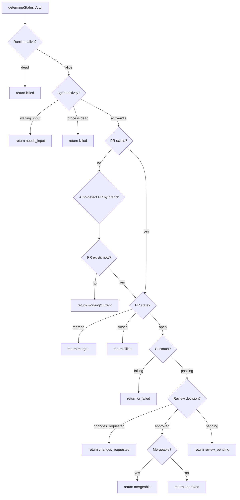
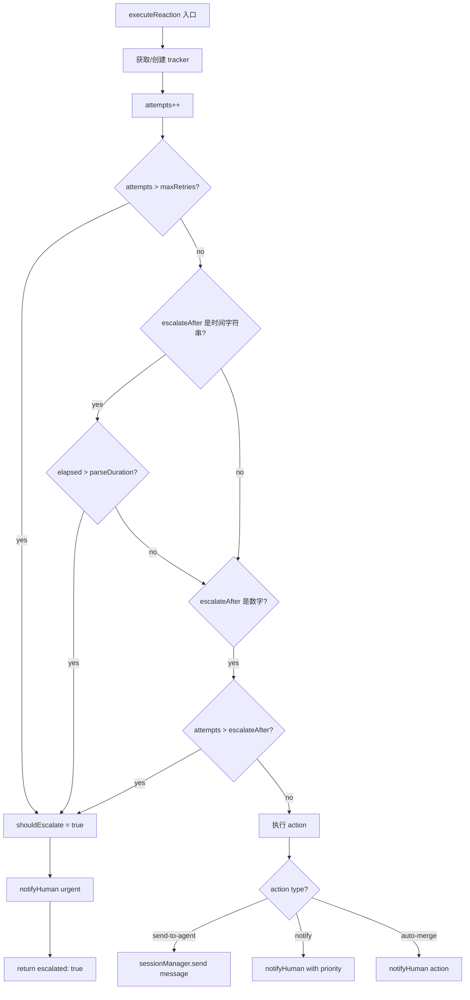

# PD-203.01 Agent Orchestrator — 配置化事件反应引擎

> 文档编号：PD-203.01
> 来源：Agent Orchestrator `packages/core/src/lifecycle-manager.ts`
> GitHub：https://github.com/ComposioHQ/agent-orchestrator.git
> 问题域：PD-203 事件驱动反应系统 Event-Driven Reaction System
> 状态：可复用方案

---

## 第 1 章 问题与动机

### 1.1 核心问题

多 Agent 编排系统中，Agent 会话经历复杂的生命周期：spawning → working → pr_open → ci_failed → review_pending → approved → merged 等十余种状态。每次状态转换都可能需要自动化响应——CI 失败时自动通知 Agent 修复、Review 被拒时自动转发评论、Agent 卡住时升级通知人类。

如果这些反应逻辑硬编码在状态机中，每新增一种事件类型就要改代码。更关键的是，不同项目对同一事件的反应策略不同：有的项目希望 CI 失败自动重试 3 次再升级，有的项目希望直接通知人类。

核心挑战：
1. **事件类型爆炸** — 14 种 Session 状态 × 多种转换路径 = 大量事件组合
2. **反应策略多样** — send-to-agent / notify / auto-merge 三种动作，每种有不同参数
3. **升级机制** — 自动处理失败后需要升级到人类，但升级条件因场景而异（次数 vs 时间）
4. **多项目差异** — 全局默认 + per-project 覆盖，配置层级需要合理合并

### 1.2 Agent Orchestrator 的解法概述

Agent Orchestrator 的 LifecycleManager 实现了一个完整的事件反应引擎：

1. **轮询式状态检测** — 30 秒间隔轮询所有 Session，通过 Runtime/Agent/SCM 插件探测真实状态（`lifecycle-manager.ts:182-289`）
2. **声明式反应配置** — YAML 中定义 `reactions` 映射表，每个事件类型对应一个 ReactionConfig（`config.ts:216-272`）
3. **三级动作体系** — `send-to-agent`（自动修复）、`notify`（通知人类）、`auto-merge`（自动合并），覆盖从自动化到人工的完整频谱（`lifecycle-manager.ts:347-408`）
4. **双维度升级** — retries 计数 + escalateAfter 时间窗口，任一触发即升级到人类通知（`lifecycle-manager.ts:310-327`）
5. **优先级路由** — 4 级优先级（urgent/action/warning/info）映射到不同通知渠道（`types.ts:697`）

### 1.3 设计思想

| 设计原则 | 具体实现 | 理由 | 替代方案 |
|----------|----------|------|----------|
| 配置驱动 | YAML reactions 映射表 + Zod 校验 | 新事件类型只需加配置，不改代码 | 硬编码 if-else 链 |
| 两级处理 | routine → send-to-agent; judgment → notify | CI 修复是机械性的，可自动化；架构决策需人类 | 全部通知人类（低效） |
| 渐进升级 | retries + escalateAfter 双维度 | 给自动修复足够机会，但不无限重试 | 固定重试次数（不灵活） |
| 插件化通知 | Notifier 接口 + notificationRouting 路由表 | 不同优先级走不同渠道（urgent→桌面+Slack） | 单一通知渠道 |
| 轮询+事件混合 | 定时轮询检测状态，转换时触发事件 | 兼容无 webhook 的 SCM 平台 | 纯 webhook（依赖平台支持） |

---

## 第 2 章 源码实现分析

### 2.1 架构概览

LifecycleManager 是一个闭包工厂函数，内部维护状态映射和反应追踪器，通过定时轮询驱动整个反应引擎：

```
┌─────────────────────────────────────────────────────────────┐
│                    LifecycleManager                          │
│                                                              │
│  ┌──────────┐    ┌──────────────┐    ┌──────────────────┐   │
│  │  states   │    │ reactionTrack│    │  pollTimer       │   │
│  │ Map<Id,   │    │ Map<"id:key",│    │ setInterval(30s) │   │
│  │  Status>  │    │  {attempts,  │    │                  │   │
│  │           │    │   firstTime}>│    │                  │   │
│  └──────────┘    └──────────────┘    └────────┬─────────┘   │
│                                               │              │
│  ┌────────────────────────────────────────────▼───────────┐  │
│  │                    pollAll()                            │  │
│  │  sessions.filter(active) → Promise.allSettled(check)   │  │
│  └────────────────────────────────────────────────────────┘  │
│                          │                                    │
│  ┌───────────────────────▼────────────────────────────────┐  │
│  │                  checkSession()                         │  │
│  │  determineStatus() → 状态转换? → executeReaction()     │  │
│  │                                  └→ notifyHuman()       │  │
│  └────────────────────────────────────────────────────────┘  │
│                                                              │
│  Plugins:  Runtime │ Agent │ SCM │ Notifier                  │
└─────────────────────────────────────────────────────────────┘
```

### 2.2 核心实现

#### 状态检测链

LifecycleManager 通过 5 层优先级链检测 Session 的真实状态，每层短路返回：



对应源码 `packages/core/src/lifecycle-manager.ts:182-289`：

```typescript
async function determineStatus(session: Session): Promise<SessionStatus> {
    const project = config.projects[session.projectId];
    if (!project) return session.status;

    const agentName = session.metadata["agent"] ?? project.agent ?? config.defaults.agent;
    const agent = registry.get<Agent>("agent", agentName);
    const scm = project.scm ? registry.get<SCM>("scm", project.scm.plugin) : null;

    // 1. Check if runtime is alive
    if (session.runtimeHandle) {
      const runtime = registry.get<Runtime>("runtime", project.runtime ?? config.defaults.runtime);
      if (runtime) {
        const alive = await runtime.isAlive(session.runtimeHandle).catch(() => true);
        if (!alive) return "killed";
      }
    }

    // 2. Check agent activity via terminal output + process liveness
    if (agent && session.runtimeHandle) {
      try {
        const runtime = registry.get<Runtime>("runtime", project.runtime ?? config.defaults.runtime);
        const terminalOutput = runtime ? await runtime.getOutput(session.runtimeHandle, 10) : "";
        if (terminalOutput) {
          const activity = agent.detectActivity(terminalOutput);
          if (activity === "waiting_input") return "needs_input";
          const processAlive = await agent.isProcessRunning(session.runtimeHandle);
          if (!processAlive) return "killed";
        }
      } catch {
        // Preserve stuck/needs_input on probe failure
        if (session.status === SESSION_STATUS.STUCK || session.status === SESSION_STATUS.NEEDS_INPUT) {
          return session.status;
        }
      }
    }

    // 4. Check PR state if PR exists
    if (session.pr && scm) {
      try {
        const prState = await scm.getPRState(session.pr);
        if (prState === PR_STATE.MERGED) return "merged";
        if (prState === PR_STATE.CLOSED) return "killed";
        const ciStatus = await scm.getCISummary(session.pr);
        if (ciStatus === CI_STATUS.FAILING) return "ci_failed";
        const reviewDecision = await scm.getReviewDecision(session.pr);
        if (reviewDecision === "changes_requested") return "changes_requested";
        if (reviewDecision === "approved") {
          const mergeReady = await scm.getMergeability(session.pr);
          if (mergeReady.mergeable) return "mergeable";
          return "approved";
        }
        if (reviewDecision === "pending") return "review_pending";
        return "pr_open";
      } catch { /* keep current status */ }
    }

    return session.status;
  }
```

#### 反应执行与升级

反应引擎的核心是 `executeReaction`，它维护一个 `ReactionTracker` 追踪每个 session:reactionKey 的重试次数和首次触发时间：



对应源码 `packages/core/src/lifecycle-manager.ts:292-416`：

```typescript
async function executeReaction(
    sessionId: SessionId,
    projectId: string,
    reactionKey: string,
    reactionConfig: ReactionConfig,
  ): Promise<ReactionResult> {
    const trackerKey = `${sessionId}:${reactionKey}`;
    let tracker = reactionTrackers.get(trackerKey);
    if (!tracker) {
      tracker = { attempts: 0, firstTriggered: new Date() };
      reactionTrackers.set(trackerKey, tracker);
    }
    tracker.attempts++;

    // Check if we should escalate
    const maxRetries = reactionConfig.retries ?? Infinity;
    const escalateAfter = reactionConfig.escalateAfter;
    let shouldEscalate = false;

    if (tracker.attempts > maxRetries) shouldEscalate = true;
    if (typeof escalateAfter === "string") {
      const durationMs = parseDuration(escalateAfter);
      if (durationMs > 0 && Date.now() - tracker.firstTriggered.getTime() > durationMs) {
        shouldEscalate = true;
      }
    }
    if (typeof escalateAfter === "number" && tracker.attempts > escalateAfter) {
      shouldEscalate = true;
    }

    if (shouldEscalate) {
      const event = createEvent("reaction.escalated", {
        sessionId, projectId,
        message: `Reaction '${reactionKey}' escalated after ${tracker.attempts} attempts`,
        data: { reactionKey, attempts: tracker.attempts },
      });
      await notifyHuman(event, reactionConfig.priority ?? "urgent");
      return { reactionType: reactionKey, success: true, action: "escalated", escalated: true };
    }

    // Execute the reaction action
    const action = reactionConfig.action ?? "notify";
    switch (action) {
      case "send-to-agent":
        if (reactionConfig.message) {
          try {
            await sessionManager.send(sessionId, reactionConfig.message);
            return { reactionType: reactionKey, success: true, action: "send-to-agent",
                     message: reactionConfig.message, escalated: false };
          } catch {
            return { reactionType: reactionKey, success: false, action: "send-to-agent", escalated: false };
          }
        }
        break;
      case "notify": { /* ... notify human ... */ }
      case "auto-merge": { /* ... notify for merge ... */ }
    }
    return { reactionType: reactionKey, success: false, action, escalated: false };
  }
```

### 2.3 实现细节

#### 事件类型到反应键的映射

系统通过两层映射将状态转换连接到反应配置：

1. `statusToEventType` — SessionStatus → EventType（如 `ci_failed` → `ci.failing`）（`lifecycle-manager.ts:102-131`）
2. `eventToReactionKey` — EventType → 配置键（如 `ci.failing` → `ci-failed`）（`lifecycle-manager.ts:134-157`）

这种双层映射的好处是：EventType 是面向系统的语义化名称（`ci.failing`），ReactionKey 是面向用户的配置键（`ci-failed`），两者解耦。

#### 优先级推断

`inferPriority` 函数通过事件类型名称中的关键词自动推断优先级（`lifecycle-manager.ts:57-76`）：

- 包含 `stuck`/`needs_input`/`errored` → `urgent`
- 以 `summary.` 开头 → `info`
- 包含 `approved`/`ready`/`merged`/`completed` → `action`
- 包含 `fail`/`changes_requested`/`conflicts` → `warning`

#### 通知路由

`notifyHuman` 根据优先级查找 `notificationRouting` 配置表，将事件分发到对应的 Notifier 插件（`lifecycle-manager.ts:419-433`）：

```yaml
notificationRouting:
  urgent: ["desktop", "composio"]   # 桌面弹窗 + Slack
  action: ["desktop", "composio"]
  warning: ["composio"]             # 仅 Slack
  info: ["composio"]
```

#### 默认反应配置

`applyDefaultReactions`（`config.ts:215-278`）提供 9 种开箱即用的反应：

| 反应键 | 动作 | 重试 | 升级条件 |
|--------|------|------|----------|
| ci-failed | send-to-agent | 2 次 | 2 次后升级 |
| changes-requested | send-to-agent | — | 30 分钟后升级 |
| bugbot-comments | send-to-agent | — | 30 分钟后升级 |
| merge-conflicts | send-to-agent | — | 15 分钟后升级 |
| approved-and-green | notify (action) | — | — |
| agent-stuck | notify (urgent) | — | 10m threshold |
| agent-needs-input | notify (urgent) | — | — |
| agent-exited | notify (urgent) | — | — |
| all-complete | notify (info) | — | — |

#### 并发安全

- `polling` 布尔守卫防止 `pollAll` 重入（`lifecycle-manager.ts:528`）
- `allCompleteEmitted` 防止重复触发 all-complete 事件（`lifecycle-manager.ts:561`）
- 状态转换时清除旧反应的 tracker，重置重试计数（`lifecycle-manager.ts:462-468`）
- `Promise.allSettled` 并发检查所有 Session，单个失败不影响其他（`lifecycle-manager.ts:542`）

#### per-project 反应覆盖

`checkSession` 中合并全局和项目级反应配置（`lifecycle-manager.ts:477-483`）：

```typescript
const globalReaction = config.reactions[reactionKey];
const projectReaction = project?.reactions?.[reactionKey];
const reactionConfig = projectReaction
  ? { ...globalReaction, ...projectReaction }
  : globalReaction;
```

项目级配置通过展开运算符覆盖全局默认，实现细粒度控制。

---

## 第 3 章 迁移指南

### 3.1 迁移清单

**阶段 1：事件模型**
- [ ] 定义 EventType 联合类型，覆盖系统中所有有意义的状态转换
- [ ] 定义 EventPriority 分级（至少 urgent/warning/info 三级）
- [ ] 实现 `createEvent` 工厂函数，统一事件结构

**阶段 2：反应配置**
- [ ] 定义 ReactionConfig 接口（action、message、retries、escalateAfter）
- [ ] 在配置文件中添加 `reactions` 映射表
- [ ] 实现 Zod schema 校验反应配置
- [ ] 提供合理的默认反应配置

**阶段 3：反应引擎**
- [ ] 实现 ReactionTracker（attempts 计数 + firstTriggered 时间戳）
- [ ] 实现 `executeReaction` 函数，支持 send-to-agent / notify / 自定义动作
- [ ] 实现双维度升级逻辑（retries 次数 + escalateAfter 时间）
- [ ] 状态转换时清除旧反应的 tracker

**阶段 4：通知路由**
- [ ] 定义 Notifier 接口（notify + notifyWithActions）
- [ ] 实现 notificationRouting 优先级→渠道映射
- [ ] 接入至少一个通知渠道（桌面/Slack/Webhook）

**阶段 5：per-scope 覆盖**
- [ ] 支持全局默认 + per-project/per-scope 反应覆盖
- [ ] 使用展开运算符合并配置（scope 覆盖 global）

### 3.2 适配代码模板

以下是一个可直接复用的 TypeScript 反应引擎骨架：

```typescript
// reaction-engine.ts — 可移植的事件反应引擎

type EventPriority = "urgent" | "action" | "warning" | "info";

interface ReactionConfig {
  auto: boolean;
  action: "send-to-agent" | "notify" | "auto-merge" | string;
  message?: string;
  priority?: EventPriority;
  retries?: number;
  escalateAfter?: number | string; // 次数或时间字符串 "10m"/"1h"
}

interface ReactionTracker {
  attempts: number;
  firstTriggered: Date;
}

interface ReactionResult {
  reactionType: string;
  success: boolean;
  action: string;
  escalated: boolean;
}

function parseDuration(str: string): number {
  const match = str.match(/^(\d+)(s|m|h)$/);
  if (!match) return 0;
  const value = parseInt(match[1], 10);
  const unit = match[2];
  return value * (unit === "s" ? 1000 : unit === "m" ? 60_000 : 3_600_000);
}

class ReactionEngine {
  private trackers = new Map<string, ReactionTracker>();
  private reactions: Record<string, ReactionConfig>;

  constructor(
    reactions: Record<string, ReactionConfig>,
    private handlers: {
      sendToAgent: (targetId: string, message: string) => Promise<void>;
      notifyHuman: (message: string, priority: EventPriority) => Promise<void>;
    },
  ) {
    this.reactions = reactions;
  }

  async execute(
    targetId: string,
    reactionKey: string,
    scopeOverrides?: Partial<ReactionConfig>,
  ): Promise<ReactionResult> {
    const globalConfig = this.reactions[reactionKey];
    if (!globalConfig) {
      return { reactionType: reactionKey, success: false, action: "none", escalated: false };
    }

    const config = scopeOverrides ? { ...globalConfig, ...scopeOverrides } : globalConfig;
    if (config.auto === false && config.action !== "notify") {
      return { reactionType: reactionKey, success: false, action: "skipped", escalated: false };
    }

    const trackerKey = `${targetId}:${reactionKey}`;
    let tracker = this.trackers.get(trackerKey);
    if (!tracker) {
      tracker = { attempts: 0, firstTriggered: new Date() };
      this.trackers.set(trackerKey, tracker);
    }
    tracker.attempts++;

    // 升级检查
    const maxRetries = config.retries ?? Infinity;
    let shouldEscalate = tracker.attempts > maxRetries;

    if (!shouldEscalate && typeof config.escalateAfter === "string") {
      const ms = parseDuration(config.escalateAfter);
      if (ms > 0 && Date.now() - tracker.firstTriggered.getTime() > ms) {
        shouldEscalate = true;
      }
    }
    if (!shouldEscalate && typeof config.escalateAfter === "number") {
      if (tracker.attempts > config.escalateAfter) shouldEscalate = true;
    }

    if (shouldEscalate) {
      await this.handlers.notifyHuman(
        `Reaction '${reactionKey}' escalated after ${tracker.attempts} attempts`,
        config.priority ?? "urgent",
      );
      return { reactionType: reactionKey, success: true, action: "escalated", escalated: true };
    }

    // 执行动作
    if (config.action === "send-to-agent" && config.message) {
      try {
        await this.handlers.sendToAgent(targetId, config.message);
        return { reactionType: reactionKey, success: true, action: "send-to-agent", escalated: false };
      } catch {
        return { reactionType: reactionKey, success: false, action: "send-to-agent", escalated: false };
      }
    }

    if (config.action === "notify") {
      await this.handlers.notifyHuman(
        config.message ?? `Reaction '${reactionKey}' triggered`,
        config.priority ?? "info",
      );
      return { reactionType: reactionKey, success: true, action: "notify", escalated: false };
    }

    return { reactionType: reactionKey, success: false, action: config.action, escalated: false };
  }

  resetTracker(targetId: string, reactionKey: string): void {
    this.trackers.delete(`${targetId}:${reactionKey}`);
  }
}

export { ReactionEngine, type ReactionConfig, type ReactionResult, type EventPriority };
```

### 3.3 适用场景

| 场景 | 适用度 | 说明 |
|------|--------|------|
| 多 Agent 编排系统 | ⭐⭐⭐ | 核心场景：Agent 会话状态转换触发自动反应 |
| CI/CD 流水线监控 | ⭐⭐⭐ | 构建失败/测试失败自动通知或重试 |
| 工单系统自动化 | ⭐⭐ | 工单状态变更触发自动分配/通知 |
| 微服务健康检查 | ⭐⭐ | 服务异常时自动重启或升级告警 |
| 单体应用错误处理 | ⭐ | 过度设计，简单 try-catch 即可 |

---

## 第 4 章 测试用例

```typescript
import { describe, it, expect, vi, beforeEach } from "vitest";

// 基于 Agent Orchestrator 的 ReactionEngine 测试
// 参考 packages/core/src/__tests__/lifecycle-manager.test.ts:596-838

describe("ReactionEngine", () => {
  let engine: ReactionEngine;
  let sendToAgent: ReturnType<typeof vi.fn>;
  let notifyHuman: ReturnType<typeof vi.fn>;

  beforeEach(() => {
    sendToAgent = vi.fn().mockResolvedValue(undefined);
    notifyHuman = vi.fn().mockResolvedValue(undefined);
    engine = new ReactionEngine(
      {
        "ci-failed": {
          auto: true,
          action: "send-to-agent",
          message: "CI is failing. Fix it.",
          retries: 2,
          escalateAfter: 2,
        },
        "agent-stuck": {
          auto: true,
          action: "notify",
          priority: "urgent",
        },
        "approved-and-green": {
          auto: false,
          action: "notify",
          priority: "action",
        },
        "changes-requested": {
          auto: true,
          action: "send-to-agent",
          message: "Address review comments.",
          escalateAfter: "30m",
        },
      },
      { sendToAgent, notifyHuman },
    );
  });

  it("sends message to agent on ci-failed", async () => {
    const result = await engine.execute("session-1", "ci-failed");
    expect(result.success).toBe(true);
    expect(result.action).toBe("send-to-agent");
    expect(sendToAgent).toHaveBeenCalledWith("session-1", "CI is failing. Fix it.");
  });

  it("escalates after max retries exceeded", async () => {
    await engine.execute("session-1", "ci-failed"); // attempt 1
    await engine.execute("session-1", "ci-failed"); // attempt 2
    const result = await engine.execute("session-1", "ci-failed"); // attempt 3 > retries(2)
    expect(result.escalated).toBe(true);
    expect(notifyHuman).toHaveBeenCalledWith(
      expect.stringContaining("escalated"),
      "urgent",
    );
  });

  it("skips reaction when auto=false for non-notify actions", async () => {
    const result = await engine.execute("session-1", "approved-and-green");
    expect(result.action).toBe("skipped");
    expect(sendToAgent).not.toHaveBeenCalled();
  });

  it("notifies human for notify-type reactions", async () => {
    const result = await engine.execute("session-1", "agent-stuck");
    expect(result.success).toBe(true);
    expect(result.action).toBe("notify");
    expect(notifyHuman).toHaveBeenCalledWith(
      expect.stringContaining("agent-stuck"),
      "urgent",
    );
  });

  it("resets tracker on state transition", async () => {
    await engine.execute("session-1", "ci-failed"); // attempt 1
    engine.resetTracker("session-1", "ci-failed");
    const result = await engine.execute("session-1", "ci-failed"); // attempt 1 again
    expect(result.escalated).toBe(false);
    expect(result.action).toBe("send-to-agent");
  });

  it("applies scope overrides over global config", async () => {
    const result = await engine.execute("session-1", "ci-failed", {
      message: "Custom fix message",
    });
    expect(sendToAgent).toHaveBeenCalledWith("session-1", "Custom fix message");
    expect(result.success).toBe(true);
  });

  it("returns failure for unknown reaction key", async () => {
    const result = await engine.execute("session-1", "nonexistent");
    expect(result.success).toBe(false);
    expect(result.action).toBe("none");
  });

  it("handles send-to-agent failure gracefully", async () => {
    sendToAgent.mockRejectedValueOnce(new Error("send failed"));
    const result = await engine.execute("session-1", "ci-failed");
    expect(result.success).toBe(false);
    expect(result.escalated).toBe(false);
  });
});
```

---

## 第 5 章 跨域关联

| 关联域 | 关系类型 | 说明 |
|--------|----------|------|
| PD-02 多 Agent 编排 | 依赖 | 反应引擎依赖编排层提供的 Session 状态和 SessionManager.send 能力 |
| PD-03 容错与重试 | 协同 | 反应引擎的 retries + escalateAfter 本质上是一种容错重试机制，但面向业务事件而非 API 调用 |
| PD-04 工具系统 | 协同 | 反应动作 send-to-agent 通过 SessionManager 向 Agent 发送指令，Agent 再调用工具执行修复 |
| PD-07 质量检查 | 协同 | CI 失败和 Review 变更请求是质量检查的输出，反应引擎是质量检查的自动化闭环 |
| PD-09 Human-in-the-Loop | 依赖 | 升级机制（escalation）是 HITL 的一种实现：自动处理失败后回退到人类决策 |
| PD-11 可观测性 | 协同 | 事件系统产生的 OrchestratorEvent 是可观测性数据的重要来源 |

---

## 第 6 章 来源文件索引

| 文件 | 行范围 | 关键实现 |
|------|--------|----------|
| `packages/core/src/lifecycle-manager.ts` | L1-L607 | LifecycleManager 完整实现：状态检测、反应执行、通知路由、轮询循环 |
| `packages/core/src/lifecycle-manager.ts` | L39-L54 | `parseDuration` — 时间字符串解析（"10m"→600000ms） |
| `packages/core/src/lifecycle-manager.ts` | L57-L76 | `inferPriority` — 事件类型→优先级自动推断 |
| `packages/core/src/lifecycle-manager.ts` | L102-L131 | `statusToEventType` — 状态→事件类型映射 |
| `packages/core/src/lifecycle-manager.ts` | L134-L157 | `eventToReactionKey` — 事件类型→反应配置键映射 |
| `packages/core/src/lifecycle-manager.ts` | L166-L169 | `ReactionTracker` — 重试追踪数据结构 |
| `packages/core/src/lifecycle-manager.ts` | L182-L289 | `determineStatus` — 5 层优先级状态检测链 |
| `packages/core/src/lifecycle-manager.ts` | L292-L416 | `executeReaction` — 反应执行 + 双维度升级 |
| `packages/core/src/lifecycle-manager.ts` | L419-L433 | `notifyHuman` — 优先级路由通知分发 |
| `packages/core/src/lifecycle-manager.ts` | L436-L521 | `checkSession` — 单 Session 轮询 + 转换处理 |
| `packages/core/src/lifecycle-manager.ts` | L524-L580 | `pollAll` — 全量轮询 + 并发检查 + 垃圾回收 |
| `packages/core/src/types.ts` | L26-L42 | `SessionStatus` — 14 种会话状态联合类型 |
| `packages/core/src/types.ts` | L696-L737 | `EventType` — 30+ 种事件类型联合类型 |
| `packages/core/src/types.ts` | L755-L787 | `ReactionConfig` / `ReactionResult` — 反应配置与结果接口 |
| `packages/core/src/types.ts` | L793-L828 | `OrchestratorConfig` — 顶层配置含 reactions 和 notificationRouting |
| `packages/core/src/config.ts` | L25-L34 | `ReactionConfigSchema` — Zod 校验 schema |
| `packages/core/src/config.ts` | L91-L106 | `OrchestratorConfigSchema` — 含 notificationRouting 默认值 |
| `packages/core/src/config.ts` | L215-L278 | `applyDefaultReactions` — 9 种默认反应配置 |
| `packages/core/src/orchestrator-prompt.ts` | L129-L151 | 反应配置注入到 Orchestrator Agent 的 prompt |
| `packages/plugins/notifier-desktop/src/index.ts` | L1-L117 | 桌面通知插件（macOS osascript / Linux notify-send） |
| `packages/plugins/notifier-slack/src/index.ts` | L1-L189 | Slack webhook 通知插件（Block Kit 格式） |
| `packages/core/src/__tests__/lifecycle-manager.test.ts` | L596-L838 | 反应引擎测试：send-to-agent、auto=false、升级、通知抑制 |
| `packages/integration-tests/src/helpers/event-factory.ts` | L1-L50 | 测试用事件/Session 工厂函数 |

---

## 第 7 章 横向对比维度

```json comparison_data
{
  "project": "AgentOrchestrator",
  "dimensions": {
    "事件检测": "30s 轮询 + 5 层优先级状态探测链（Runtime→Agent→SCM）",
    "反应配置": "YAML 声明式 reactions 映射表 + Zod 校验 + 9 种默认反应",
    "动作类型": "send-to-agent / notify / auto-merge 三级动作体系",
    "升级机制": "retries 计数 + escalateAfter 时间窗口双维度升级",
    "通知路由": "4 级优先级 × 多渠道路由表（desktop/slack/composio）",
    "配置层级": "全局默认 + per-project 展开覆盖",
    "并发安全": "polling 重入守卫 + Promise.allSettled 并发检查"
  }
}
```

### 域元数据补充

```json domain_metadata
{
  "solution_summary": "AgentOrchestrator 用 LifecycleManager 实现配置化反应引擎，YAML 声明 9 种默认反应 + retries/escalateAfter 双维度升级 + 4 级优先级通知路由",
  "description": "配置化反应引擎：声明式事件→动作映射 + 渐进升级 + 多渠道通知路由",
  "sub_problems": [
    "反应抑制：send-to-agent 处理中抑制重复人类通知",
    "全量完成检测：所有 Session 终态时触发 all-complete 汇总",
    "探测容错：Agent 探测失败时保持 stuck/needs_input 不误判为 working"
  ],
  "best_practices": [
    "双层映射解耦：EventType 面向系统 + ReactionKey 面向用户配置",
    "状态转换时重置 tracker，避免跨状态的重试计数污染",
    "Promise.allSettled 并发检查所有 Session，单个失败不阻塞全局"
  ]
}
```
