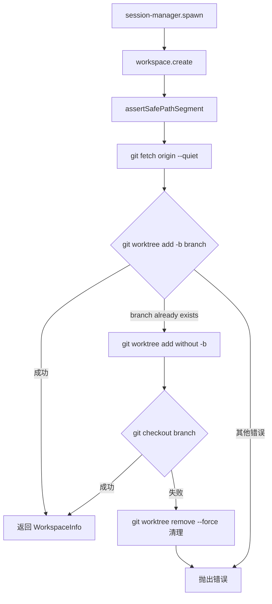
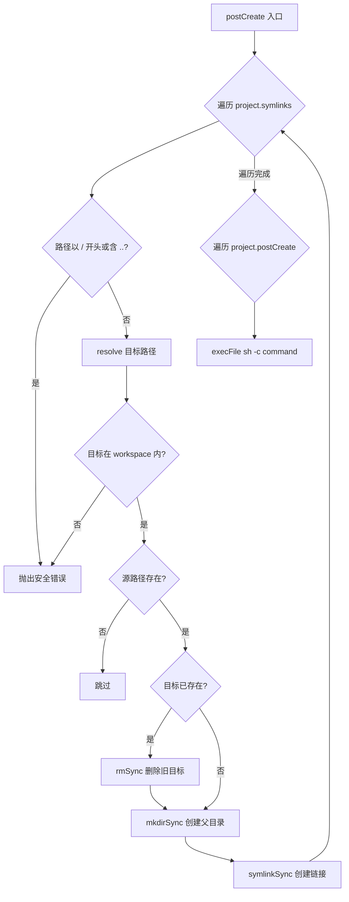

# PD-204.01 Agent Orchestrator — Worktree 插件式工作区隔离

> 文档编号：PD-204.01
> 来源：Agent Orchestrator `packages/plugins/workspace-worktree/src/index.ts`
> GitHub：https://github.com/ComposioHQ/agent-orchestrator.git
> 问题域：PD-204 工作区隔离 Workspace Isolation
> 状态：可复用方案

---

## 第 1 章 问题与动机

### 1.1 核心问题

多 Agent 并行编码场景下，每个 Agent session 需要独立的代码工作区。如果多个 Agent 共享同一个 git 仓库目录，会产生：
- 文件写入冲突：Agent A 修改 `src/app.ts` 的同时 Agent B 也在修改
- git 状态污染：一个 Agent 的 `git add` 会把另一个 Agent 的改动带入
- 分支切换干扰：`git checkout` 会影响所有在同一目录工作的进程

传统方案是 `git clone` 完整复制仓库，但对大型 monorepo（node_modules 数 GB）来说，每个 session 都 clone 一份代价太高。

### 1.2 Agent Orchestrator 的解法概述

Agent Orchestrator 采用**插件化 Workspace 架构**，将工作区隔离抽象为可替换的插件槽（Plugin Slot 3），提供两种实现：

1. **worktree 插件**（默认）：用 `git worktree add` 创建轻量级工作目录，共享 `.git` 对象库，配合 symlink 共享 `node_modules` 等重资源（`packages/plugins/workspace-worktree/src/index.ts:49-301`）
2. **clone 插件**：用 `git clone --reference` 创建独立副本，适合需要完全隔离的场景（`packages/plugins/workspace-clone/src/index.ts:46-245`）
3. **统一接口**：`Workspace` 接口定义 `create/destroy/list/restore/postCreate` 五个方法，session manager 不关心底层实现（`packages/core/src/types.ts:379-399`）
4. **路径安全**：所有路径段经过 `SAFE_PATH_SEGMENT` 正则校验，symlink 目标经过 `resolve()` + 前缀检查防止目录穿越（`workspace-worktree/src/index.ts:33-36, 256-269`）
5. **生命周期钩子**：`postCreate` 支持 symlink 创建和自定义命令执行，由 YAML 配置驱动（`workspace-worktree/src/index.ts:249-297`）

### 1.3 设计思想

| 设计原则 | 具体实现 | 理由 | 替代方案 |
|----------|----------|------|----------|
| 插件化隔离策略 | `Workspace` 接口 + worktree/clone 两种实现 | 不同项目对隔离级别需求不同，monorepo 用 worktree 省空间，安全敏感场景用 clone | 硬编码单一策略 |
| 共享对象库 | `git worktree add` 复用 `.git/objects` | 避免每个 session 复制完整 git 历史，节省磁盘和时间 | `git clone --depth 1` 浅克隆 |
| symlink 资源共享 | `node_modules` 等通过 symlink 指向主仓库 | 避免每个 worktree 重复安装依赖（monorepo 可能 2-5 GB） | 每个 worktree 独立 `pnpm install` |
| 路径段白名单 | `/^[a-zA-Z0-9_-]+$/` 正则校验 projectId/sessionId | 防止 `../` 目录穿越攻击，session ID 由用户输入派生 | 黑名单过滤 |
| 分支冲突优雅降级 | 先 `worktree add -b`，失败后 `worktree add` + `checkout` | 分支可能已存在（restore 场景），两步法兼容新建和恢复 | 直接报错要求用户清理 |
| 原子 session ID 预留 | `reserveSessionId()` 循环尝试最多 10 次 | 多个 spawn 并发时防止 ID 碰撞 | 加锁或数据库自增 |

---

## 第 2 章 源码实现分析

### 2.1 架构概览

Agent Orchestrator 的 workspace 隔离分为三层：

```
┌─────────────────────────────────────────────────────────┐
│                   Session Manager                        │
│  spawn() → workspace.create() → workspace.postCreate()  │
│  kill()  → workspace.destroy()                          │
│  restore() → workspace.restore() → workspace.postCreate()│
└──────────────────────┬──────────────────────────────────┘
                       │ Workspace 接口
          ┌────────────┴────────────┐
          ▼                         ▼
┌──────────────────┐     ┌──────────────────┐
│ workspace-worktree│     │ workspace-clone   │
│ (默认, 轻量)      │     │ (完全隔离)        │
│                  │     │                  │
│ git worktree add │     │ git clone        │
│ + symlink 共享   │     │ --reference      │
│ + postCreate 钩子│     │ + postCreate 钩子│
└──────────────────┘     └──────────────────┘
          │                         │
          ▼                         ▼
┌──────────────────────────────────────────┐
│           ~/.worktrees/{project}/{session}│
│  或       ~/.ao-clones/{project}/{session}│
└──────────────────────────────────────────┘
```

配置通过 `agent-orchestrator.yaml` 驱动，Zod schema 校验（`packages/core/src/config.ts:61-82`）：

```yaml
defaults:
  workspace: worktree          # 默认使用 worktree 插件
projects:
  my-app:
    repo: org/repo
    path: ~/my-app
    symlinks: [node_modules, .env]   # 共享资源
    postCreate: [pnpm install]       # 创建后执行
```

### 2.2 核心实现

#### Worktree 创建流程



对应源码 `packages/plugins/workspace-worktree/src/index.ts:57-112`：

```typescript
async create(cfg: WorkspaceCreateConfig): Promise<WorkspaceInfo> {
  assertSafePathSegment(cfg.projectId, "projectId");
  assertSafePathSegment(cfg.sessionId, "sessionId");

  const repoPath = expandPath(cfg.project.path);
  const projectWorktreeDir = join(worktreeBaseDir, cfg.projectId);
  const worktreePath = join(projectWorktreeDir, cfg.sessionId);

  mkdirSync(projectWorktreeDir, { recursive: true });

  // Fetch latest from remote
  try {
    await git(repoPath, "fetch", "origin", "--quiet");
  } catch {
    // Fetch may fail if offline — continue anyway
  }

  const baseRef = `origin/${cfg.project.defaultBranch}`;

  // Create worktree with a new branch
  try {
    await git(repoPath, "worktree", "add", "-b", cfg.branch, worktreePath, baseRef);
  } catch (err: unknown) {
    const msg = err instanceof Error ? err.message : String(err);
    if (!msg.includes("already exists")) {
      throw new Error(`Failed to create worktree for branch "${cfg.branch}": ${msg}`, {
        cause: err,
      });
    }
    // Branch already exists — create worktree and check it out
    await git(repoPath, "worktree", "add", worktreePath, baseRef);
    try {
      await git(worktreePath, "checkout", cfg.branch);
    } catch (checkoutErr: unknown) {
      try {
        await git(repoPath, "worktree", "remove", "--force", worktreePath);
      } catch { /* Best-effort cleanup */ }
      const checkoutMsg = checkoutErr instanceof Error ? checkoutErr.message : String(checkoutErr);
      throw new Error(`Failed to checkout branch "${cfg.branch}" in worktree: ${checkoutMsg}`, {
        cause: checkoutErr,
      });
    }
  }

  return { path: worktreePath, branch: cfg.branch, sessionId: cfg.sessionId, projectId: cfg.projectId };
}
```

#### Symlink 安全校验与创建



对应源码 `packages/plugins/workspace-worktree/src/index.ts:249-297`：

```typescript
async postCreate(info: WorkspaceInfo, project: ProjectConfig): Promise<void> {
  const repoPath = expandPath(project.path);

  if (project.symlinks) {
    for (const symlinkPath of project.symlinks) {
      // Guard against absolute paths and directory traversal
      if (symlinkPath.startsWith("/") || symlinkPath.includes("..")) {
        throw new Error(
          `Invalid symlink path "${symlinkPath}": must be a relative path without ".." segments`,
        );
      }

      const sourcePath = join(repoPath, symlinkPath);
      const targetPath = resolve(info.path, symlinkPath);

      // Verify resolved target is still within the workspace
      if (!targetPath.startsWith(info.path + "/") && targetPath !== info.path) {
        throw new Error(
          `Symlink target "${symlinkPath}" resolves outside workspace: ${targetPath}`,
        );
      }

      if (!existsSync(sourcePath)) continue;

      // Remove existing target if it exists
      try {
        const stat = lstatSync(targetPath);
        if (stat.isSymbolicLink() || stat.isFile() || stat.isDirectory()) {
          rmSync(targetPath, { recursive: true, force: true });
        }
      } catch { /* Target doesn't exist */ }

      mkdirSync(dirname(targetPath), { recursive: true });
      symlinkSync(sourcePath, targetPath);
    }
  }

  // Run postCreate hooks
  if (project.postCreate) {
    for (const command of project.postCreate) {
      await execFileAsync("sh", ["-c", command], { cwd: info.path });
    }
  }
}
```

### 2.3 实现细节

#### Hash-based 目录命名

`packages/core/src/paths.ts:20-25` 使用 SHA256 哈希配置文件路径，生成 12 字符前缀，确保多实例不冲突：

```typescript
export function generateConfigHash(configPath: string): string {
  const resolved = realpathSync(configPath);
  const configDir = dirname(resolved);
  const hash = createHash("sha256").update(configDir).digest("hex");
  return hash.slice(0, 12);
}
```

目录结构：`~/.agent-orchestrator/{hash}-{projectId}/sessions/{sessionName}`

#### 原子 Session ID 预留

`packages/core/src/session-manager.ts:365-388` 通过循环 + 文件系统原子操作防止并发碰撞：

```typescript
for (let attempts = 0; attempts < 10; attempts++) {
  sessionId = `${project.sessionPrefix}-${num}`;
  if (config.configPath) {
    tmuxName = generateTmuxName(config.configPath, project.sessionPrefix, num);
  }
  if (reserveSessionId(sessionsDir, sessionId)) break;
  num++;
  if (attempts === 9) {
    throw new Error(`Failed to reserve session ID after 10 attempts`);
  }
}
```

#### Worktree Restore 三级降级

`packages/plugins/workspace-worktree/src/index.ts:209-247` 恢复 workspace 时采用三级尝试：

1. `git worktree add <path> <branch>` — 本地分支存在
2. `git worktree add -b <branch> <path> origin/<branch>` — 远程分支存在
3. `git worktree add -b <branch> <path> origin/<defaultBranch>` — 从默认分支重建

#### Destroy 的安全策略

`packages/plugins/workspace-worktree/src/index.ts:114-137`：先通过 `git rev-parse --git-common-dir` 找到主仓库路径，再执行 `git worktree remove --force`。如果 git 命令失败（worktree 已损坏），降级为 `rmSync` 直接删除目录。**故意不删除分支**，避免误删用户预存的本地分支。


---

## 第 3 章 迁移指南

### 3.1 迁移清单

**阶段 1：定义 Workspace 接口**

- [ ] 定义 `Workspace` 接口：`create(config) → WorkspaceInfo`、`destroy(path)`、`list(projectId)`
- [ ] 定义 `WorkspaceCreateConfig`：包含 `projectId`、`sessionId`、`branch`、`project`（含 `path`、`defaultBranch`、`symlinks`、`postCreate`）
- [ ] 定义 `WorkspaceInfo`：包含 `path`、`branch`、`sessionId`、`projectId`

**阶段 2：实现 Worktree 插件**

- [ ] 实现 `create()`：`git fetch` → `git worktree add -b` → 分支冲突降级
- [ ] 实现 `destroy()`：`git worktree remove --force` → `rmSync` 降级
- [ ] 实现 `postCreate()`：symlink 安全校验 + 创建 + postCreate 命令执行
- [ ] 实现 `restore()`：三级降级（本地分支 → 远程分支 → 默认分支）
- [ ] 实现 `list()`：`git worktree list --porcelain` 解析

**阶段 3：集成到 Session Manager**

- [ ] `spawn()` 中调用 `workspace.create()` + `workspace.postCreate()`
- [ ] `kill()` 中调用 `workspace.destroy()`
- [ ] `restore()` 中检测 workspace 是否存在，不存在则调用 `workspace.restore()`
- [ ] postCreate 失败时自动清理 workspace（防止孤儿目录）

**阶段 4：安全加固**

- [ ] 路径段白名单校验（`/^[a-zA-Z0-9_-]+$/`）
- [ ] symlink 目标 `resolve()` + 前缀检查
- [ ] 拒绝绝对路径和 `..` 段

### 3.2 适配代码模板

以下是一个可直接运行的 TypeScript 最小实现：

```typescript
import { execFile } from "node:child_process";
import { promisify } from "node:util";
import { existsSync, symlinkSync, rmSync, mkdirSync, lstatSync } from "node:fs";
import { join, resolve, dirname } from "node:path";

const execFileAsync = promisify(execFile);
const SAFE_SEGMENT = /^[a-zA-Z0-9_-]+$/;

interface WorkspaceConfig {
  projectId: string;
  sessionId: string;
  branch: string;
  repoPath: string;
  defaultBranch: string;
  symlinks?: string[];
  postCreate?: string[];
}

interface WorkspaceInfo {
  path: string;
  branch: string;
  sessionId: string;
}

async function git(cwd: string, ...args: string[]): Promise<string> {
  const { stdout } = await execFileAsync("git", args, { cwd });
  return stdout.trimEnd();
}

function assertSafe(value: string, label: string): void {
  if (!SAFE_SEGMENT.test(value)) {
    throw new Error(`Invalid ${label}: "${value}"`);
  }
}

export async function createWorktree(
  baseDir: string,
  config: WorkspaceConfig,
): Promise<WorkspaceInfo> {
  assertSafe(config.projectId, "projectId");
  assertSafe(config.sessionId, "sessionId");

  const projectDir = join(baseDir, config.projectId);
  const worktreePath = join(projectDir, config.sessionId);
  mkdirSync(projectDir, { recursive: true });

  // Fetch latest (best-effort)
  try { await git(config.repoPath, "fetch", "origin", "--quiet"); } catch {}

  const baseRef = `origin/${config.defaultBranch}`;

  try {
    await git(config.repoPath, "worktree", "add", "-b", config.branch, worktreePath, baseRef);
  } catch (err: unknown) {
    const msg = err instanceof Error ? err.message : String(err);
    if (!msg.includes("already exists")) throw err;
    // Branch exists — add worktree then checkout
    await git(config.repoPath, "worktree", "add", worktreePath, baseRef);
    await git(worktreePath, "checkout", config.branch);
  }

  // Symlinks
  if (config.symlinks) {
    for (const rel of config.symlinks) {
      if (rel.startsWith("/") || rel.includes("..")) throw new Error(`Unsafe symlink: ${rel}`);
      const src = join(config.repoPath, rel);
      const tgt = resolve(worktreePath, rel);
      if (!tgt.startsWith(worktreePath + "/")) throw new Error(`Symlink escapes workspace: ${rel}`);
      if (!existsSync(src)) continue;
      try { lstatSync(tgt); rmSync(tgt, { recursive: true, force: true }); } catch {}
      mkdirSync(dirname(tgt), { recursive: true });
      symlinkSync(src, tgt);
    }
  }

  // Post-create commands
  if (config.postCreate) {
    for (const cmd of config.postCreate) {
      await execFileAsync("sh", ["-c", cmd], { cwd: worktreePath });
    }
  }

  return { path: worktreePath, branch: config.branch, sessionId: config.sessionId };
}

export async function destroyWorktree(repoPath: string, worktreePath: string): Promise<void> {
  try {
    await git(repoPath, "worktree", "remove", "--force", worktreePath);
  } catch {
    if (existsSync(worktreePath)) rmSync(worktreePath, { recursive: true, force: true });
  }
}
```

### 3.3 适用场景

| 场景 | 适用度 | 说明 |
|------|--------|------|
| 多 Agent 并行编码 | ⭐⭐⭐ | 核心场景，每个 Agent 独立 worktree |
| Monorepo + 大 node_modules | ⭐⭐⭐ | symlink 共享避免重复安装 |
| CI/CD 并行构建 | ⭐⭐ | 可用但 Docker 隔离可能更合适 |
| 需要完全文件系统隔离 | ⭐ | 应使用 clone 插件或 Docker |
| 跨机器分布式 Agent | ⭐ | worktree 依赖本地 .git，不适合远程 |

---

## 第 4 章 测试用例

基于 `packages/plugins/workspace-worktree/src/__tests__/index.test.ts` 的真实测试模式：

```typescript
import { describe, it, expect, vi, beforeEach } from "vitest";

// Mock git 和 fs
const mockExecFile = vi.fn();
const mockExistsSync = vi.fn();
const mockSymlinkSync = vi.fn();
const mockRmSync = vi.fn();
const mockMkdirSync = vi.fn();
const mockLstatSync = vi.fn();

function mockGitSuccess(stdout: string) {
  mockExecFile.mockResolvedValueOnce({ stdout: stdout + "\n", stderr: "" });
}
function mockGitError(msg: string) {
  mockExecFile.mockRejectedValueOnce(new Error(msg));
}

describe("worktree workspace", () => {
  beforeEach(() => vi.clearAllMocks());

  // --- 正常路径 ---
  it("creates worktree with fetch + worktree add", async () => {
    mockGitSuccess(""); // fetch
    mockGitSuccess(""); // worktree add -b
    const info = await createWorktree("/base", {
      projectId: "myapp", sessionId: "s1", branch: "feat/x",
      repoPath: "/repo", defaultBranch: "main",
    });
    expect(info.path).toBe("/base/myapp/s1");
    expect(info.branch).toBe("feat/x");
  });

  // --- 分支冲突降级 ---
  it("handles branch-already-exists by add + checkout", async () => {
    mockGitSuccess("");           // fetch
    mockGitError("already exists"); // worktree add -b fails
    mockGitSuccess("");           // worktree add (no -b)
    mockGitSuccess("");           // checkout
    const info = await createWorktree("/base", {
      projectId: "myapp", sessionId: "s1", branch: "feat/x",
      repoPath: "/repo", defaultBranch: "main",
    });
    expect(info.branch).toBe("feat/x");
  });

  // --- 路径安全 ---
  it("rejects directory traversal in projectId", async () => {
    await expect(createWorktree("/base", {
      projectId: "../escape", sessionId: "s1", branch: "feat/x",
      repoPath: "/repo", defaultBranch: "main",
    })).rejects.toThrow("Invalid projectId");
  });

  it("rejects absolute symlink paths", async () => {
    mockGitSuccess(""); mockGitSuccess("");
    await expect(createWorktree("/base", {
      projectId: "myapp", sessionId: "s1", branch: "feat/x",
      repoPath: "/repo", defaultBranch: "main",
      symlinks: ["/etc/passwd"],
    })).rejects.toThrow("Unsafe symlink");
  });

  it("rejects .. in symlink paths", async () => {
    mockGitSuccess(""); mockGitSuccess("");
    await expect(createWorktree("/base", {
      projectId: "myapp", sessionId: "s1", branch: "feat/x",
      repoPath: "/repo", defaultBranch: "main",
      symlinks: ["foo/../../../etc/passwd"],
    })).rejects.toThrow("Unsafe symlink");
  });

  // --- 降级行为 ---
  it("continues when fetch fails (offline)", async () => {
    mockGitError("Could not resolve host"); // fetch fails
    mockGitSuccess("");                      // worktree add succeeds
    const info = await createWorktree("/base", {
      projectId: "myapp", sessionId: "s1", branch: "feat/x",
      repoPath: "/repo", defaultBranch: "main",
    });
    expect(info.path).toBe("/base/myapp/s1");
  });

  // --- Destroy ---
  it("destroys worktree via git worktree remove", async () => {
    mockGitSuccess(""); // worktree remove
    await destroyWorktree("/repo", "/base/myapp/s1");
    // 验证调用了 git worktree remove --force
  });

  it("falls back to rmSync when git fails", async () => {
    mockGitError("not a git repository");
    mockExistsSync.mockReturnValueOnce(true);
    await destroyWorktree("/repo", "/base/myapp/s1");
    expect(mockRmSync).toHaveBeenCalled();
  });
});
```


---

## 第 5 章 跨域关联

| 关联域 | 关系类型 | 说明 |
|--------|----------|------|
| PD-05 沙箱隔离 | 协同 | Workspace 隔离是文件系统层面的沙箱，PD-05 关注进程/网络层面。Agent Orchestrator 的 Runtime 插件（tmux/docker）提供进程隔离，Workspace 插件提供代码隔离，两者正交组合 |
| PD-02 多 Agent 编排 | 依赖 | 多 Agent 并行编排的前提是每个 Agent 有独立工作区。Session Manager 先调用 `workspace.create()` 再启动 Agent |
| PD-04 工具系统 | 协同 | Workspace 本身是插件系统的一个 slot（Plugin Slot 3），遵循统一的 `PluginModule<T>` 接口。`setupWorkspaceHooks()` 在 Agent 插件中为 workspace 配置 agent 特定的钩子 |
| PD-06 记忆持久化 | 协同 | Session 元数据（含 `worktree` 路径）持久化到 `~/.agent-orchestrator/{hash}/sessions/` 目录，restore 时据此重建 workspace |
| PD-07 质量检查 | 协同 | `postCreate` 钩子可用于在 workspace 创建后运行 lint/type-check 等质量检查命令 |

---

## 第 6 章 来源文件索引

| 文件 | 行范围 | 关键实现 |
|------|--------|----------|
| `packages/plugins/workspace-worktree/src/index.ts` | L1-301 | Worktree 插件完整实现：create/destroy/list/restore/postCreate |
| `packages/plugins/workspace-worktree/src/index.ts` | L33-36 | `SAFE_PATH_SEGMENT` 路径安全校验 |
| `packages/plugins/workspace-worktree/src/index.ts` | L57-112 | `create()` 核心：worktree 创建 + 分支冲突处理 |
| `packages/plugins/workspace-worktree/src/index.ts` | L249-297 | `postCreate()` symlink 安全校验 + 命令执行 |
| `packages/plugins/workspace-worktree/src/index.ts` | L209-247 | `restore()` 三级降级恢复 |
| `packages/plugins/workspace-clone/src/index.ts` | L1-245 | Clone 插件完整实现（对比参考） |
| `packages/plugins/workspace-clone/src/index.ts` | L82-101 | `git clone --reference` 共享对象库 |
| `packages/core/src/types.ts` | L379-413 | `Workspace` 接口定义 + `WorkspaceCreateConfig` + `WorkspaceInfo` |
| `packages/core/src/types.ts` | L837-888 | `ProjectConfig` 含 `symlinks`/`postCreate` 字段 |
| `packages/core/src/session-manager.ts` | L402-438 | spawn 中调用 workspace.create + postCreate |
| `packages/core/src/session-manager.ts` | L790-804 | kill 中调用 workspace.destroy |
| `packages/core/src/session-manager.ts` | L1000-1035 | restore 中检测 + 重建 workspace |
| `packages/core/src/session-manager.ts` | L365-388 | 原子 session ID 预留（10 次重试） |
| `packages/core/src/paths.ts` | L20-25 | SHA256 hash 生成（12 字符） |
| `packages/core/src/paths.ts` | L84-103 | 项目目录 / sessions 目录 / worktrees 目录路径生成 |
| `packages/core/src/config.ts` | L61-82 | Zod schema：symlinks/postCreate/workspace 字段校验 |
| `packages/plugins/workspace-worktree/src/__tests__/index.test.ts` | L1-741 | 完整单元测试（30+ 用例） |

---

## 第 7 章 横向对比维度

```json comparison_data
{
  "project": "AgentOrchestrator",
  "dimensions": {
    "隔离策略": "插件化双模式：worktree（默认轻量）+ clone（完全隔离），接口统一",
    "资源共享": "YAML 配置 symlinks 数组，postCreate 支持 resolve+前缀检查防穿越",
    "生命周期管理": "create→postCreate→destroy 三阶段，restore 三级降级（本地→远程→默认分支）",
    "路径安全校验": "SAFE_PATH_SEGMENT 白名单 + symlink resolve 前缀检查 + 拒绝绝对路径和 ..",
    "并发防护": "reserveSessionId 原子预留 + SHA256 hash 目录命名防多实例冲突",
    "清理策略": "git worktree remove --force 优先，降级 rmSync；故意不删分支防误删"
  }
}
```

### 域元数据补充

```json domain_metadata
{
  "solution_summary": "Agent Orchestrator 用插件化 Workspace 接口统一 worktree/clone 双模式隔离，配合 YAML 驱动的 symlink 共享和 postCreate 钩子，支持三级降级 restore 和原子 session ID 预留",
  "description": "插件化隔离策略选择与 YAML 配置驱动的资源共享机制",
  "sub_problems": [
    "插件化隔离策略选择（worktree vs clone vs docker）",
    "postCreate 钩子失败时的 workspace 孤儿清理",
    "worktree destroy 时分支保留策略"
  ],
  "best_practices": [
    "symlink 目标 resolve 后做 workspace 前缀检查防穿越",
    "destroy 时不删分支避免误删用户预存本地分支",
    "restore 采用本地→远程→默认分支三级降级"
  ]
}
```
