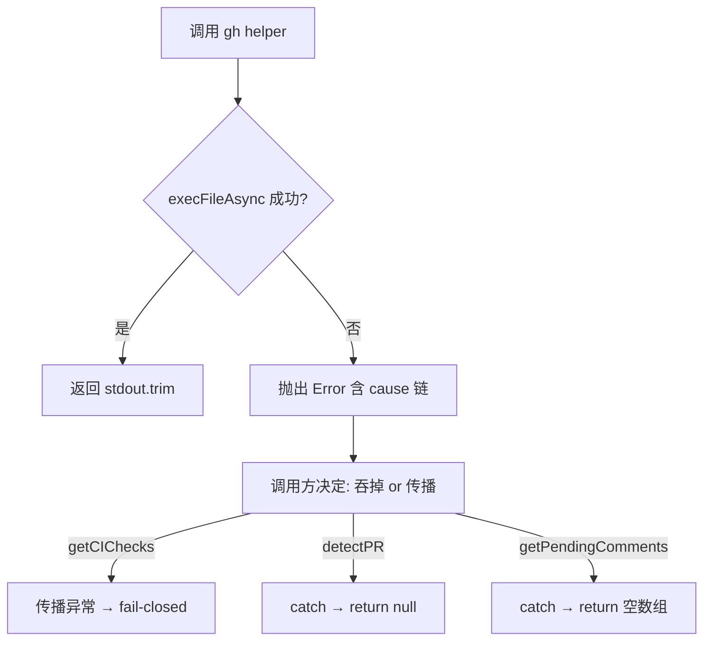
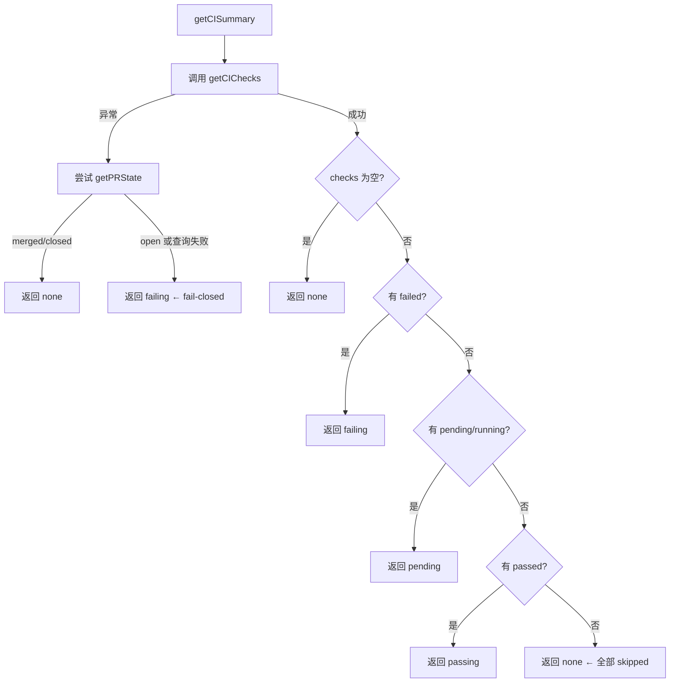
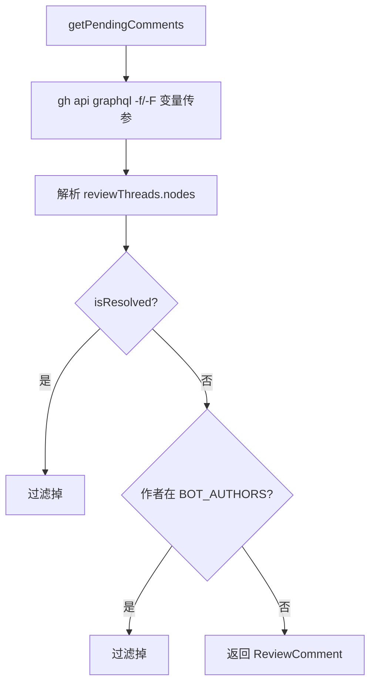

# PD-205.01 Agent Orchestrator — gh CLI 封装 PR 全生命周期管理

> 文档编号：PD-205.01
> 来源：Agent Orchestrator `packages/plugins/scm-github/src/index.ts`
> GitHub：https://github.com/ComposioHQ/agent-orchestrator.git
> 问题域：PD-205 SCM 平台集成 SCM Platform Integration
> 状态：可复用方案

---

## 第 1 章 问题与动机

### 1.1 核心问题

当多个 AI Agent 并行工作时，每个 Agent 独立创建 PR、推送代码、等待 CI、处理 Review。编排器（Orchestrator）需要一个统一的 SCM 抽象层来：

1. **自动检测 PR 存在性** — Agent 推送分支后，编排器需要知道 PR 是否已创建
2. **聚合 CI 状态** — 将 GitHub 的 10+ 种 check state 归一化为 4 种（pending/passing/failing/none）
3. **追踪 Review 决策** — 区分人类 Review 和 Bot 自动评论，只对人类评论做出反应
4. **评估合并就绪度** — 综合 CI、Review、冲突、Draft 状态给出 boolean 判断
5. **安全地执行合并** — 验证前置条件后才执行 merge，支持 squash/merge/rebase

这不是简单的 GitHub API 封装。核心挑战在于 **fail-closed 安全策略**：当 API 调用失败时，应该报告"失败"而非"通过"，防止在 CI 实际 failing 时误判为 passing 而自动合并。

### 1.2 Agent Orchestrator 的解法概述

Agent Orchestrator 的 `scm-github` 插件通过 `gh` CLI 封装了完整的 PR 生命周期管理：

1. **gh CLI 作为唯一 API 通道** — 不直接调用 REST/GraphQL API，而是通过 `gh` CLI 的 `--json` 输出获取结构化数据（`packages/plugins/scm-github/src/index.ts:47-59`）
2. **fail-closed CI 策略** — `getCIChecks` 在 API 失败时抛出异常而非返回空数组，`getCISummary` 将异常转化为 `"failing"` 状态（`index.ts:235-240`）
3. **GraphQL 变量传参** — `getPendingComments` 使用 `-f`/`-F` 参数传递变量，避免字符串拼接导致的注入风险（`index.ts:336-367`）
4. **BOT_AUTHORS 过滤** — 维护已知 Bot 登录名集合，将 Bot 评论从人类 Review 中分离（`index.ts:30-41`）
5. **MergeReadiness 综合评估** — 聚合 CI、Review、冲突、Draft、mergeStateStatus 五个维度，输出 blockers 列表（`index.ts:481-562`）

### 1.3 设计思想

| 设计原则 | 具体实现 | 理由 | 替代方案 |
|----------|----------|------|----------|
| fail-closed 安全 | CI 查询失败 → 报告 failing 而非 none | 防止 API 故障时误判 CI 通过导致自动合并 | fail-open（返回 none/passing），但会导致错误合并 |
| CLI 封装而非 SDK | 通过 `gh` CLI 的 `--json` 输出交互 | 零依赖、自动继承用户认证、版本升级无需改代码 | @octokit/rest SDK，但增加依赖和认证管理 |
| 插件化 SCM 接口 | SCM interface 定义 14 个方法，github 是一个实现 | 支持 GitLab/Bitbucket 等平台扩展 | 硬编码 GitHub，但无法扩展 |
| Bot 评论分离 | BOT_AUTHORS Set + 关键词严重度分类 | Agent 只需处理人类 Review，忽略 CI bot 噪音 | 不过滤，但 Agent 会被 bot 评论干扰 |
| 状态归一化 | 10+ GitHub check states → 5 种标准状态 | 上层状态机只需处理简单枚举 | 透传原始状态，但上层逻辑复杂度爆炸 |

---

## 第 2 章 源码实现分析

### 2.1 架构概览

Agent Orchestrator 的 SCM 集成分为三层：插件层（scm-github）、消费层（lifecycle-manager + serialize）、展示层（Web API + CLI）。

```
┌─────────────────────────────────────────────────────────────────┐
│                    Lifecycle Manager (30s 轮询)                  │
│  determineStatus() → detectPR → getPRState → getCISummary       │
│                    → getReviewDecision → getMergeability         │
│  状态转换 → 触发 Reaction（send-to-agent / notify / auto-merge）│
└──────────────────────────┬──────────────────────────────────────┘
                           │ 调用
┌──────────────────────────▼──────────────────────────────────────┐
│                    SCM Interface (14 methods)                    │
│  detectPR | getPRState | getPRSummary | mergePR | closePR       │
│  getCIChecks | getCISummary                                     │
│  getReviews | getReviewDecision | getPendingComments             │
│  getAutomatedComments | getMergeability                         │
└──────────────────────────┬──────────────────────────────────────┘
                           │ 实现
┌──────────────────────────▼──────────────────────────────────────┐
│                    scm-github Plugin                             │
│  gh() helper → execFileAsync("gh", args)                        │
│  BOT_AUTHORS Set | repoFlag() | parseDate()                    │
│  30s timeout | 10MB maxBuffer                                   │
└──────────────────────────┬──────────────────────────────────────┘
                           │
                    ┌──────▼──────┐
                    │   gh CLI    │
                    │ (REST/GQL)  │
                    └─────────────┘
```

### 2.2 核心实现

#### 2.2.1 gh CLI 封装与 fail-closed 错误处理



对应源码 `packages/plugins/scm-github/src/index.ts:47-59`：

```typescript
async function gh(args: string[]): Promise<string> {
  try {
    const { stdout } = await execFileAsync("gh", args, {
      maxBuffer: 10 * 1024 * 1024,
      timeout: 30_000,
    });
    return stdout.trim();
  } catch (err) {
    throw new Error(`gh ${args.slice(0, 3).join(" ")} failed: ${(err as Error).message}`, {
      cause: err,
    });
  }
}
```

关键设计：`maxBuffer: 10MB` 防止大型 PR 的 GraphQL 响应被截断；`timeout: 30s` 防止 gh CLI 挂起；错误消息只暴露前 3 个参数（`args.slice(0, 3)`）避免泄露 GraphQL query 内容。

#### 2.2.2 CI 状态归一化与 fail-closed 策略



对应源码 `packages/plugins/scm-github/src/index.ts:181-275`：

```typescript
async getCIChecks(pr: PRInfo): Promise<CICheck[]> {
  try {
    const raw = await gh([
      "pr", "checks", String(pr.number), "--repo", repoFlag(pr),
      "--json", "name,state,link,startedAt,completedAt",
    ]);
    const checks = JSON.parse(raw);
    return checks.map((c) => {
      let status: CICheck["status"];
      const state = c.state?.toUpperCase();
      if (state === "PENDING" || state === "QUEUED") status = "pending";
      else if (state === "IN_PROGRESS") status = "running";
      else if (state === "SUCCESS") status = "passed";
      else if (state === "FAILURE" || state === "TIMED_OUT" ||
               state === "CANCELLED" || state === "ACTION_REQUIRED")
        status = "failed";
      else if (state === "SKIPPED" || state === "NEUTRAL") status = "skipped";
      else status = "failed"; // Unknown → fail closed
      return { name: c.name, status, url: c.link || undefined,
               conclusion: state || undefined,
               startedAt: c.startedAt ? new Date(c.startedAt) : undefined,
               completedAt: c.completedAt ? new Date(c.completedAt) : undefined };
    });
  } catch (err) {
    // Do NOT silently return [] — that causes fail-open
    throw new Error("Failed to fetch CI checks", { cause: err });
  }
},

async getCISummary(pr: PRInfo): Promise<CIStatus> {
  let checks: CICheck[];
  try {
    checks = await this.getCIChecks(pr);
  } catch {
    // Before fail-closing, check if PR is merged/closed
    try {
      const state = await this.getPRState(pr);
      if (state === "merged" || state === "closed") return "none";
    } catch { /* fall through */ }
    return "failing"; // Fail closed for open PRs
  }
  if (checks.length === 0) return "none";
  const hasFailing = checks.some((c) => c.status === "failed");
  if (hasFailing) return "failing";
  const hasPending = checks.some((c) => c.status === "pending" || c.status === "running");
  if (hasPending) return "pending";
  const hasPassing = checks.some((c) => c.status === "passed");
  if (!hasPassing) return "none"; // All skipped
  return "passing";
},
```

注意 `getCISummary` 的 merged/closed 特殊处理：GitHub 对已合并 PR 可能不返回 check 数据，此时报告 `"failing"` 是错误的，所以先检查 PR 状态。

#### 2.2.3 GraphQL Review Threads 查询



对应源码 `packages/plugins/scm-github/src/index.ts:333-421`：

```typescript
async getPendingComments(pr: PRInfo): Promise<ReviewComment[]> {
  try {
    const raw = await gh([
      "api", "graphql",
      "-f", `owner=${pr.owner}`,
      "-f", `name=${pr.repo}`,
      "-F", `number=${pr.number}`,  // -F 用于整数类型
      "-f", `query=query($owner: String!, $name: String!, $number: Int!) {
        repository(owner: $owner, name: $name) {
          pullRequest(number: $number) {
            reviewThreads(first: 100) {
              nodes {
                isResolved
                comments(first: 1) {
                  nodes { id author { login } body path line url createdAt }
                }
              }
            }
          }
        }
      }`,
    ]);
    // ... 解析 + 过滤 BOT_AUTHORS + 过滤 isResolved
  } catch {
    return []; // Review comments 查询失败不阻塞流程
  }
},
```

关键细节：`-f` 传字符串变量，`-F` 传整数变量（`number`），这是 `gh api graphql` 的参数约定。GraphQL 变量传参避免了字符串拼接注入。

### 2.3 实现细节

#### Lifecycle Manager 的 SCM 消费链

`lifecycle-manager.ts:182-289` 中的 `determineStatus()` 函数按优先级依次调用 SCM 方法：

```
1. runtime.isAlive()     → killed
2. agent.detectActivity() → needs_input / killed
3. scm.detectPR()        → 自动发现 PR（无 hook 的 Agent）
4. scm.getPRState()      → merged / killed(closed)
5. scm.getCISummary()    → ci_failed
6. scm.getReviewDecision() → changes_requested / approved / review_pending
7. scm.getMergeability() → mergeable
```

这个调用链体现了**状态优先级**：merged > killed > ci_failed > changes_requested > approved > mergeable > review_pending > pr_open > working。

#### Dashboard 的 Promise.allSettled 并行查询

`serialize.ts:135-144` 使用 `Promise.allSettled` 并行调用 6 个 SCM 方法，即使部分失败也能展示已获取的数据：

```typescript
const results = await Promise.allSettled([
  scm.getPRSummary(pr),
  scm.getCIChecks(pr),
  scm.getCISummary(pr),
  scm.getReviewDecision(pr),
  scm.getMergeability(pr),
  scm.getPendingComments(pr),
]);
```

当超过半数请求失败时（`failedCount >= results.length / 2`），判定为 rate limit，缓存部分数据 60 分钟（GitHub rate limit 按小时重置）。

#### MergeReadiness 综合评估

`index.ts:481-562` 的 `getMergeability()` 聚合 5 个维度：

| 维度 | 数据源 | 阻塞条件 |
|------|--------|----------|
| CI | `getCISummary()` | status ≠ passing 且 ≠ none |
| Review | `reviewDecision` 字段 | CHANGES_REQUESTED 或 REVIEW_REQUIRED |
| 冲突 | `mergeable` 字段 | CONFLICTING 或 UNKNOWN |
| 分支状态 | `mergeStateStatus` 字段 | BEHIND / BLOCKED / UNSTABLE |
| Draft | `isDraft` 字段 | true |

特殊处理：已合并 PR 直接返回全绿结果（`index.ts:488-497`），避免查询 `mergeable` 字段（GitHub 对已合并 PR 返回 null）。


---

## 第 3 章 迁移指南

### 3.1 迁移清单

**阶段 1：SCM 接口定义**
- [ ] 定义 SCM 接口（参考 `packages/core/src/types.ts:494-545`）
- [ ] 定义 PR/CI/Review/MergeReadiness 类型
- [ ] 确定插件注册机制（工厂函数 or DI 容器）

**阶段 2：gh CLI 封装**
- [ ] 实现 `gh()` helper（execFileAsync + timeout + maxBuffer）
- [ ] 实现 `detectPR()`（gh pr list --head --json）
- [ ] 实现 `getCIChecks()` + `getCISummary()`（fail-closed 策略）
- [ ] 实现 `getReviews()` + `getReviewDecision()`
- [ ] 实现 `getPendingComments()`（GraphQL + BOT_AUTHORS 过滤）
- [ ] 实现 `getAutomatedComments()`（REST API + 严重度分类）
- [ ] 实现 `getMergeability()`（5 维度聚合）

**阶段 3：消费层集成**
- [ ] 在轮询循环中调用 SCM 方法检测状态转换
- [ ] 实现 TTL 缓存减少 API 调用（5 分钟默认，rate limit 时 60 分钟）
- [ ] 实现 Promise.allSettled 并行查询 + 部分失败降级

**阶段 4：测试**
- [ ] Mock gh CLI 输出，覆盖所有 check state 映射
- [ ] 测试 fail-closed 行为（API 失败 → failing）
- [ ] 测试 merged PR 特殊路径
- [ ] 测试 BOT_AUTHORS 过滤

### 3.2 适配代码模板

以下是一个可直接复用的 SCM 接口 + gh CLI 封装模板（TypeScript）：

```typescript
import { execFile } from "node:child_process";
import { promisify } from "node:util";

const execFileAsync = promisify(execFile);

// --- 类型定义 ---
interface PRInfo {
  number: number; url: string; title: string;
  owner: string; repo: string; branch: string;
  baseBranch: string; isDraft: boolean;
}

type CIStatus = "pending" | "passing" | "failing" | "none";

interface CICheck {
  name: string;
  status: "pending" | "running" | "passed" | "failed" | "skipped";
  url?: string;
}

interface MergeReadiness {
  mergeable: boolean; ciPassing: boolean; approved: boolean;
  noConflicts: boolean; blockers: string[];
}

// --- gh CLI helper ---
async function gh(args: string[]): Promise<string> {
  const { stdout } = await execFileAsync("gh", args, {
    maxBuffer: 10 * 1024 * 1024,
    timeout: 30_000,
  });
  return stdout.trim();
}

// --- CI 状态归一化（fail-closed） ---
const CI_STATE_MAP: Record<string, CICheck["status"]> = {
  SUCCESS: "passed", FAILURE: "failed", PENDING: "pending",
  QUEUED: "pending", IN_PROGRESS: "running", SKIPPED: "skipped",
  NEUTRAL: "skipped", TIMED_OUT: "failed", CANCELLED: "failed",
  ACTION_REQUIRED: "failed",
};

async function getCIChecks(pr: PRInfo): Promise<CICheck[]> {
  // 不 catch — 让异常传播（fail-closed）
  const raw = await gh([
    "pr", "checks", String(pr.number),
    "--repo", `${pr.owner}/${pr.repo}`,
    "--json", "name,state,link",
  ]);
  return JSON.parse(raw).map((c: any) => ({
    name: c.name,
    status: CI_STATE_MAP[c.state?.toUpperCase()] ?? "failed",
    url: c.link || undefined,
  }));
}

async function getCISummary(pr: PRInfo): Promise<CIStatus> {
  let checks: CICheck[];
  try { checks = await getCIChecks(pr); }
  catch { return "failing"; } // fail-closed
  if (checks.length === 0) return "none";
  if (checks.some(c => c.status === "failed")) return "failing";
  if (checks.some(c => c.status === "pending" || c.status === "running")) return "pending";
  if (checks.some(c => c.status === "passed")) return "passing";
  return "none";
}
```

### 3.3 适用场景

| 场景 | 适用度 | 说明 |
|------|--------|------|
| 多 Agent 编排器 | ⭐⭐⭐ | 核心场景：自动检测 PR 状态、触发 CI 修复、自动合并 |
| CI/CD 监控面板 | ⭐⭐⭐ | PR 状态聚合 + TTL 缓存 + rate limit 降级 |
| Code Review 自动化 | ⭐⭐ | BOT_AUTHORS 过滤 + GraphQL review threads |
| 单 Agent 工具 | ⭐ | 过度设计，直接调用 gh CLI 即可 |
| GitLab/Bitbucket 项目 | ⭐ | 需要重新实现插件，但接口可复用 |

---

## 第 4 章 测试用例

基于 `packages/plugins/scm-github/test/index.test.ts` 的真实测试模式：

```typescript
import { describe, it, expect, beforeEach, vi } from "vitest";

// Mock gh CLI
const ghMock = vi.fn();
vi.mock("node:child_process", () => {
  const execFile = Object.assign(vi.fn(), {
    [Symbol.for("nodejs.util.promisify.custom")]: ghMock,
  });
  return { execFile };
});

function mockGh(result: unknown) {
  ghMock.mockResolvedValueOnce({ stdout: JSON.stringify(result) });
}
function mockGhError(msg = "Command failed") {
  ghMock.mockRejectedValueOnce(new Error(msg));
}

describe("SCM GitHub Plugin", () => {
  // --- CI fail-closed 测试 ---
  describe("getCIChecks fail-closed", () => {
    it("throws on API error instead of returning empty array", async () => {
      mockGhError("rate limited");
      await expect(getCIChecks(pr)).rejects.toThrow("Failed to fetch CI checks");
    });

    it("maps unknown check state to failed (fail-closed)", async () => {
      mockGh([{ name: "mystery", state: "WEIRD_STATE", link: "" }]);
      const checks = await getCIChecks(pr);
      expect(checks[0].status).toBe("failed");
    });
  });

  // --- getCISummary 降级测试 ---
  describe("getCISummary degradation", () => {
    it("returns failing when API fails (fail-closed)", async () => {
      mockGhError("network error");
      expect(await getCISummary(pr)).toBe("failing");
    });

    it("returns none for merged PR even when checks fail", async () => {
      mockGhError("no checks"); // getCIChecks fails
      mockGh({ state: "MERGED" }); // getPRState succeeds
      expect(await getCISummary(pr)).toBe("none");
    });

    it("returns none when all checks are skipped", async () => {
      mockGh([
        { name: "a", state: "SKIPPED" },
        { name: "b", state: "NEUTRAL" },
      ]);
      expect(await getCISummary(pr)).toBe("none");
    });
  });

  // --- BOT_AUTHORS 过滤测试 ---
  describe("getPendingComments bot filtering", () => {
    it("excludes cursor[bot] and codecov[bot] from pending comments", async () => {
      mockGh(makeGraphQLThreads([
        { isResolved: false, author: "alice", body: "Fix this" },
        { isResolved: false, author: "cursor[bot]", body: "Bot says" },
        { isResolved: false, author: "codecov[bot]", body: "Coverage" },
      ]));
      const comments = await getPendingComments(pr);
      expect(comments).toHaveLength(1);
      expect(comments[0].author).toBe("alice");
    });
  });

  // --- MergeReadiness 边界测试 ---
  describe("getMergeability edge cases", () => {
    it("returns clean result for merged PR without extra API calls", async () => {
      mockGh({ state: "MERGED" });
      const result = await getMergeability(pr);
      expect(result.mergeable).toBe(true);
      expect(ghMock).toHaveBeenCalledTimes(1); // 只调用 getPRState
    });

    it("reports multiple blockers simultaneously", async () => {
      mockGh({ state: "OPEN" });
      mockGh({
        mergeable: "CONFLICTING", reviewDecision: "CHANGES_REQUESTED",
        mergeStateStatus: "DIRTY", isDraft: true,
      });
      mockGh([{ name: "build", state: "FAILURE" }]);
      const result = await getMergeability(pr);
      expect(result.blockers.length).toBeGreaterThanOrEqual(4);
      expect(result.mergeable).toBe(false);
    });
  });
});
```


---

## 第 5 章 跨域关联

| 关联域 | 关系类型 | 说明 |
|--------|----------|------|
| PD-03 容错与重试 | 协同 | SCM 的 fail-closed 策略是容错设计的具体应用；getCISummary 的 merged/closed 特殊处理是降级策略 |
| PD-07 质量检查 | 协同 | CI check 聚合 + Review 决策追踪本质上是质量门控的自动化实现 |
| PD-11 可观测性 | 协同 | Lifecycle Manager 的状态转换事件（pr.created, ci.failing, review.approved）是可观测性的数据源 |
| PD-02 多 Agent 编排 | 依赖 | 编排器依赖 SCM 插件检测每个 Agent 的 PR 状态，驱动状态机转换 |
| PD-04 工具系统 | 协同 | SCM 作为插件系统的一个 slot（Plugin Slot 5），遵循统一的 PluginModule 接口 |
| PD-10 中间件管道 | 协同 | Lifecycle Manager 的 Reaction 引擎（send-to-agent / notify / auto-merge）是事件驱动中间件的实例 |

---

## 第 6 章 来源文件索引

| 文件 | 行范围 | 关键实现 |
|------|--------|----------|
| `packages/plugins/scm-github/src/index.ts` | L1-L581 | SCM 插件完整实现：gh helper、14 个 SCM 方法、BOT_AUTHORS、fail-closed |
| `packages/core/src/types.ts` | L487-L634 | SCM 接口定义、PRInfo/CICheck/Review/MergeReadiness 类型 |
| `packages/core/src/lifecycle-manager.ts` | L182-L289 | determineStatus() — SCM 消费链：detectPR → getPRState → getCISummary → getReviewDecision → getMergeability |
| `packages/web/src/lib/serialize.ts` | L105-L253 | enrichSessionPR() — Promise.allSettled 并行查询 + TTL 缓存 + rate limit 降级 |
| `packages/web/src/lib/cache.ts` | L1-L115 | TTLCache 实现 + PREnrichmentData 类型 + prCacheKey |
| `packages/web/src/app/api/prs/[id]/merge/route.ts` | L1-L53 | Merge API — 验证 PR 状态 + mergeability 前置检查 |
| `packages/plugins/scm-github/test/index.test.ts` | L1-L867 | 完整测试套件：mock gh CLI、覆盖所有 check state、fail-closed、BOT_AUTHORS |

---

## 第 7 章 横向对比维度

```json comparison_data
{
  "project": "AgentOrchestrator",
  "dimensions": {
    "PR 检测方式": "gh pr list --head 按分支名匹配，自动发现无 hook Agent 的 PR",
    "CI 聚合策略": "10+ GitHub state 归一化为 5 种，unknown state fail-closed",
    "Review 处理": "GraphQL reviewThreads + BOT_AUTHORS Set 分离人类/Bot 评论",
    "合并就绪度": "5 维度聚合（CI/Review/冲突/分支状态/Draft）+ blockers 列表",
    "API 通道": "gh CLI execFileAsync 封装，零 SDK 依赖，继承用户认证",
    "容错策略": "fail-closed CI + merged PR 短路 + Promise.allSettled 部分降级",
    "缓存机制": "TTLCache 5 分钟默认，rate limit 时 60 分钟长缓存"
  }
}
```

### 域元数据补充

```json domain_metadata
{
  "solution_summary": "Agent Orchestrator 通过 gh CLI 封装 14 方法 SCM 接口，实现 PR 自动检测、10+ check state 归一化、GraphQL review thread 查询、5 维度合并就绪度评估，核心采用 fail-closed 安全策略",
  "description": "SCM 集成需要处理 API rate limit 降级和已合并 PR 的特殊状态路径",
  "sub_problems": [
    "Rate limit 降级与部分数据缓存策略",
    "已合并/已关闭 PR 的状态查询短路优化",
    "Bot 评论严重度自动分类（error/warning/info）"
  ],
  "best_practices": [
    "Promise.allSettled 并行查询 + 半数失败判定 rate limit",
    "merged PR 直接返回全绿结果，避免查询 GitHub 返回 null 的 mergeable 字段",
    "TTL 缓存分级：正常 5 分钟，rate limit 60 分钟（匹配 GitHub 重置周期）"
  ]
}
```

