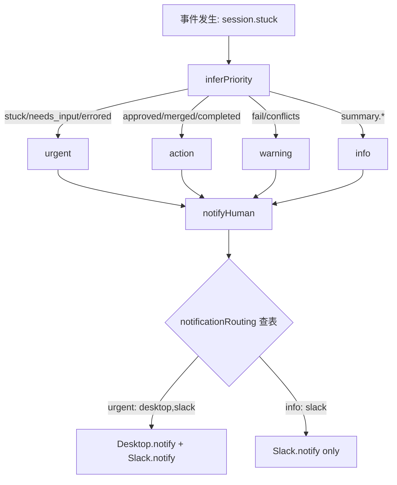
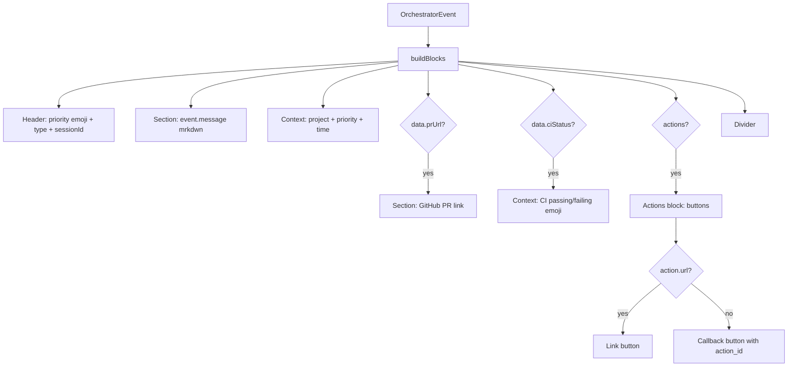
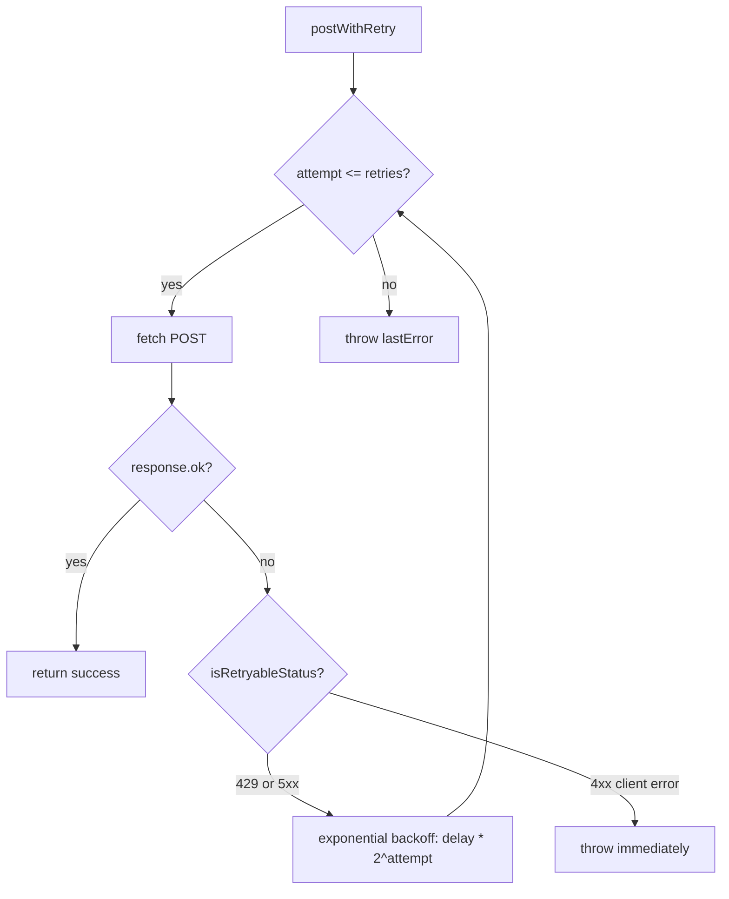

# PD-206.01 Agent Orchestrator — 四插件通知路由与 Block Kit 富文本

> 文档编号：PD-206.01
> 来源：Agent Orchestrator `packages/plugins/notifier-*/src/index.ts`
> GitHub：https://github.com/ComposioHQ/agent-orchestrator.git
> 问题域：PD-206 通知路由 Notification Routing
> 状态：可复用方案

---

## 第 1 章 问题与动机

### 1.1 核心问题

Agent 编排系统中，多个 AI Agent 并行执行任务（PR 创建、CI 修复、代码审查），人类无法实时盯着终端。当 Agent 遇到阻塞（需要人类输入、CI 失败、PR 冲突）时，必须主动通知人类回来处理。

核心挑战：
- **多渠道异构**：Slack 支持 Block Kit 富文本和 action buttons，Desktop 只能推纯文本，Webhook 需要结构化 JSON，Email 需要 HTML body——同一事件在不同渠道的表现形式完全不同
- **优先级路由**：`urgent`（Agent 卡住）应该同时推 Desktop + Slack，`info`（任务完成）只推 Slack 即可，不同优先级走不同渠道组合
- **渠道可选**：不是所有用户都有 Slack，有些只用 Desktop 通知，系统必须优雅降级
- **可扩展**：未来可能加 Telegram、飞书、钉钉等渠道，不能改核心代码

### 1.2 Agent Orchestrator 的解法概述

1. **统一 Notifier 接口**：所有通知渠道实现同一个 `Notifier` 接口（`notify` / `notifyWithActions` / `post`），核心代码不关心具体渠道（`types.ts:645-656`）
2. **插件化注册**：4 个 Notifier 作为独立 npm 包，通过 `PluginRegistry` 按 `slot:name` 键值对注册，运行时动态加载（`plugin-registry.ts:26-46`）
3. **优先级路由表**：`OrchestratorConfig.notificationRouting` 是一个 `Record<EventPriority, string[]>` 映射，每个优先级对应一组 notifier 名称（`types.ts:824`）
4. **事件类型→优先级推断**：`inferPriority()` 函数根据事件类型自动推断优先级，`stuck/needs_input/errored` → urgent，`approved/merged` → action，`fail/conflicts` → warning（`lifecycle-manager.ts:57-76`）
5. **渠道特化渲染**：Slack 用 Block Kit 构建富文本含 PR 链接和 CI 状态 emoji，Desktop 用 osascript/notify-send，Webhook 发结构化 JSON，Composio 桥接 Slack/Discord/Gmail

### 1.3 设计思想

| 设计原则 | 具体实现 | 理由 | 替代方案 |
|----------|----------|------|----------|
| Push not Pull | Notifier 接口只有 `notify()` 推送方法，无轮询 | 人类不应该轮询 Agent 状态 | WebSocket 双向通道（过重） |
| 接口统一，渲染特化 | 统一 `Notifier` 接口 + 各插件内部自由构建消息格式 | 核心代码零耦合，插件自治 | 模板引擎统一渲染（灵活性差） |
| 优先级驱动路由 | `notificationRouting[priority]` 映射到 notifier 名称数组 | 不同紧急程度走不同渠道组合 | 全量广播（噪音大） |
| 优雅降级 | 无 config 时 `notify()` 变 no-op，不抛异常 | 渠道可选，缺失不影响核心流程 | 启动时强制校验（不灵活） |
| 插件隔离 | 每个 Notifier 是独立 npm 包，`PluginModule<Notifier>` 接口 | 按需安装，不装的不加载 | 单体 switch-case（难扩展） |

---

## 第 2 章 源码实现分析

### 2.1 架构概览

```
┌─────────────────────────────────────────────────────────────────┐
│                    LifecycleManager                             │
│                                                                 │
│  checkSession() → 状态变化 → createEvent() → notifyHuman()     │
│                                                    │            │
│                              ┌─────────────────────┘            │
│                              ▼                                  │
│                   notificationRouting[priority]                  │
│                     ┌────────┼────────┐                         │
│                     ▼        ▼        ▼                         │
│               ["desktop", "slack", "webhook"]                   │
│                     │        │        │                         │
│                     ▼        ▼        ▼                         │
│              PluginRegistry.get("notifier", name)               │
└─────────────────────────────────────────────────────────────────┘
                      │        │        │
          ┌───────────┘        │        └───────────┐
          ▼                    ▼                    ▼
  ┌──────────────┐   ┌──────────────┐   ┌──────────────┐
  │   Desktop    │   │    Slack     │   │   Webhook    │
  │  osascript / │   │  Block Kit   │   │  JSON POST   │
  │  notify-send │   │  + actions   │   │  + retry     │
  └──────────────┘   └──────────────┘   └──────────────┘
                                                │
                                        ┌──────────────┐
                                        │   Composio   │
                                        │ Slack/Discord │
                                        │   /Gmail     │
                                        └──────────────┘
```

四个 Notifier 插件各自独立，通过 `PluginRegistry` 的 `slot:name` 键注册，`notifyHuman()` 按优先级路由表分发事件。

### 2.2 核心实现

#### 2.2.1 优先级推断与路由分发



对应源码 `packages/core/src/lifecycle-manager.ts:57-76`：

```typescript
/** Infer a reasonable priority from event type. */
function inferPriority(type: EventType): EventPriority {
  if (type.includes("stuck") || type.includes("needs_input") || type.includes("errored")) {
    return "urgent";
  }
  if (type.startsWith("summary.")) {
    return "info";
  }
  if (
    type.includes("approved") ||
    type.includes("ready") ||
    type.includes("merged") ||
    type.includes("completed")
  ) {
    return "action";
  }
  if (type.includes("fail") || type.includes("changes_requested") || type.includes("conflicts")) {
    return "warning";
  }
  return "info";
}
```

路由分发 `packages/core/src/lifecycle-manager.ts:419-433`：

```typescript
async function notifyHuman(event: OrchestratorEvent, priority: EventPriority): Promise<void> {
  const eventWithPriority = { ...event, priority };
  const notifierNames = config.notificationRouting[priority] ?? config.defaults.notifiers;

  for (const name of notifierNames) {
    const notifier = registry.get<Notifier>("notifier", name);
    if (notifier) {
      try {
        await notifier.notify(eventWithPriority);
      } catch {
        // Notifier failed — not much we can do
      }
    }
  }
}
```

关键设计：`config.notificationRouting[priority]` 查不到时 fallback 到 `config.defaults.notifiers`，保证即使路由表不完整也有默认行为。

#### 2.2.2 Slack Block Kit 富文本构建



对应源码 `packages/plugins/notifier-slack/src/index.ts:26-118`：

```typescript
function buildBlocks(event: OrchestratorEvent, actions?: NotifyAction[]): unknown[] {
  const blocks: unknown[] = [
    {
      type: "header",
      text: {
        type: "plain_text",
        text: `${PRIORITY_EMOJI[event.priority]} ${event.type} — ${event.sessionId}`,
        emoji: true,
      },
    },
    {
      type: "section",
      text: { type: "mrkdwn", text: event.message },
    },
    {
      type: "context",
      elements: [{
        type: "mrkdwn",
        text: `*Project:* ${event.projectId} | *Priority:* ${event.priority} | *Time:* <!date^${Math.floor(event.timestamp.getTime() / 1000)}^{date_short_pretty} {time}|${event.timestamp.toISOString()}>`,
      }],
    },
  ];

  // PR link (type-guarded)
  const prUrl = typeof event.data.prUrl === "string" ? event.data.prUrl : undefined;
  if (prUrl) {
    blocks.push({
      type: "section",
      text: { type: "mrkdwn", text: `:github: <${prUrl}|View Pull Request>` },
    });
  }

  // CI status
  const ciStatus = typeof event.data.ciStatus === "string" ? event.data.ciStatus : undefined;
  if (ciStatus) {
    const ciEmoji = ciStatus === CI_STATUS.PASSING ? ":white_check_mark:" : ":x:";
    blocks.push({
      type: "context",
      elements: [{ type: "mrkdwn", text: `${ciEmoji} CI: ${ciStatus}` }],
    });
  }

  // Action buttons: URL buttons vs callback buttons
  if (actions && actions.length > 0) {
    const elements = actions
      .filter((a) => a.url || a.callbackEndpoint)
      .map((action) => {
        if (action.url) {
          return {
            type: "button",
            text: { type: "plain_text", text: action.label, emoji: true },
            url: action.url,
          };
        }
        // Callback button: sanitize label → action_id
        const sanitized = action.label.toLowerCase().replace(/[^a-z0-9]+/g, "_").replace(/^_|_$/g, "");
        const idx = actions.indexOf(action);
        return {
          type: "button",
          text: { type: "plain_text", text: action.label, emoji: true },
          action_id: `ao_${sanitized}_${idx}`,
          value: action.callbackEndpoint,
        };
      });
    if (elements.length > 0) {
      blocks.push({ type: "actions", elements });
    }
  }

  blocks.push({ type: "divider" });
  return blocks;
}
```

Slack 的 `action_id` 前缀 `ao_` 用于在 Slack 交互回调中识别来自 Agent Orchestrator 的按钮点击。


#### 2.2.3 Webhook 指数退避重试



对应源码 `packages/plugins/notifier-webhook/src/index.ts:43-89`：

```typescript
function isRetryableStatus(status: number): boolean {
  return status === 429 || status >= 500;
}

async function postWithRetry(
  url: string, payload: WebhookPayload, headers: Record<string, string>,
  retries: number, retryDelayMs: number,
): Promise<void> {
  let lastError: Error | undefined;
  for (let attempt = 0; attempt <= retries; attempt++) {
    try {
      const response = await fetch(url, {
        method: "POST",
        headers: { "Content-Type": "application/json", ...headers },
        body: JSON.stringify(payload),
      });
      if (response.ok) return;
      const body = await response.text();
      lastError = new Error(`Webhook POST failed (${response.status}): ${body}`);
      if (!isRetryableStatus(response.status)) throw lastError;
    } catch (err) {
      if (err === lastError) throw err;
      lastError = err instanceof Error ? err : new Error(String(err));
    }
    if (attempt < retries) {
      const delay = retryDelayMs * 2 ** attempt;
      await new Promise((resolve) => setTimeout(resolve, delay));
    }
  }
  throw lastError;
}
```

关键区分：4xx 客户端错误（401/403/404）是永久性失败，立即抛出不重试；只有 429（限流）和 5xx（服务端错误）才重试。

### 2.3 实现细节

**插件注册机制**（`plugin-registry.ts:62-106`）：

`createPluginRegistry()` 返回一个闭包对象，内部用 `Map<string, {manifest, instance}>` 存储插件实例。`loadBuiltins()` 遍历 `BUILTIN_PLUGINS` 数组，对每个插件执行 `import(pkg)` 动态加载，加载失败（未安装）静默跳过。

4 个 Notifier 插件的注册键：
- `notifier:desktop` → `@composio/ao-plugin-notifier-desktop`
- `notifier:slack` → `@composio/ao-plugin-notifier-slack`
- `notifier:webhook` → `@composio/ao-plugin-notifier-webhook`
- `notifier:composio` → `@composio/ao-plugin-notifier-composio`

**Desktop 跨平台适配**（`notifier-desktop/src/index.ts:55-88`）：

- macOS：`execFile("osascript", ["-e", script])`，用 `escapeAppleScript()` 防注入
- Linux：`execFile("notify-send", args)`，urgent 事件加 `--urgency=critical`
- 其他 OS：`console.warn` + `resolve()`，静默降级

**Composio 统一桥接**（`notifier-composio/src/index.ts:102-130`）：

Composio 插件通过 `composio-core` SDK 桥接 3 个外部服务（Slack/Discord/Gmail），用 `APP_TOOL_SLUG` 映射到对应的 Composio action（`SLACK_SEND_MESSAGE` / `DISCORD_SEND_MESSAGE` / `GMAIL_SEND_EMAIL`），`buildToolArgs()` 根据 app 类型构建不同参数结构。SDK 是可选依赖，未安装时 `loadComposioSDK()` 返回 null，后续调用变 no-op。

**30 秒超时保护**（`notifier-composio/src/index.ts:197-231`）：

`executeWithTimeout()` 用 `Promise.race` + `AbortSignal.timeout(30_000)` 实现，防止 Composio API 调用无限挂起。注意 `actionPromise.catch(() => {})` 防止超时后原 Promise reject 变成 unhandled rejection。

---

## 第 3 章 迁移指南

### 3.1 迁移清单

**阶段 1：定义接口与类型**
- [ ] 定义 `Notifier` 接口：`notify(event)` + 可选 `notifyWithActions(event, actions)` + 可选 `post(message, context)`
- [ ] 定义 `EventPriority` 类型：`"urgent" | "action" | "warning" | "info"`
- [ ] 定义 `OrchestratorEvent` 结构：id, type, priority, sessionId, projectId, timestamp, message, data
- [ ] 定义 `NotifyAction`：label + url（外链）或 callbackEndpoint（回调）

**阶段 2：实现插件注册**
- [ ] 实现 `PluginRegistry`：`register(plugin, config)` / `get(slot, name)` / `list(slot)`
- [ ] 定义 `PluginModule<T>` 接口：`manifest` + `create(config)`
- [ ] 实现 `loadBuiltins()`：动态 import + 静默失败

**阶段 3：实现通知路由**
- [ ] 实现 `inferPriority(eventType)` 函数
- [ ] 实现 `notifyHuman(event, priority)` 路由分发
- [ ] 配置 `notificationRouting: Record<EventPriority, string[]>`

**阶段 4：实现具体渠道**
- [ ] Desktop：osascript (macOS) + notify-send (Linux)
- [ ] Slack：Block Kit 构建 + Incoming Webhook
- [ ] Webhook：结构化 JSON + 指数退避重试
- [ ] （可选）Composio 桥接

### 3.2 适配代码模板

```typescript
// === 1. 核心接口 ===
type EventPriority = "urgent" | "action" | "warning" | "info";

interface NotifyEvent {
  id: string;
  type: string;
  priority: EventPriority;
  message: string;
  data: Record<string, unknown>;
}

interface NotifyAction {
  label: string;
  url?: string;
  callbackEndpoint?: string;
}

interface Notifier {
  readonly name: string;
  notify(event: NotifyEvent): Promise<void>;
  notifyWithActions?(event: NotifyEvent, actions: NotifyAction[]): Promise<void>;
}

// === 2. 优先级路由 ===
type NotificationRouting = Record<EventPriority, string[]>;

class NotificationRouter {
  constructor(
    private routing: NotificationRouting,
    private notifiers: Map<string, Notifier>,
    private defaultNotifiers: string[],
  ) {}

  async dispatch(event: NotifyEvent): Promise<void> {
    const names = this.routing[event.priority] ?? this.defaultNotifiers;
    await Promise.allSettled(
      names
        .map((n) => this.notifiers.get(n))
        .filter((n): n is Notifier => n !== undefined)
        .map((n) => n.notify(event)),
    );
  }
}

// === 3. Slack 插件示例 ===
function createSlackNotifier(webhookUrl: string): Notifier {
  return {
    name: "slack",
    async notify(event) {
      const emoji: Record<EventPriority, string> = {
        urgent: "🚨", action: "👉", warning: "⚠️", info: "ℹ️",
      };
      const blocks = [
        { type: "header", text: { type: "plain_text", text: `${emoji[event.priority]} ${event.type}` } },
        { type: "section", text: { type: "mrkdwn", text: event.message } },
      ];
      await fetch(webhookUrl, {
        method: "POST",
        headers: { "Content-Type": "application/json" },
        body: JSON.stringify({ blocks }),
      });
    },
  };
}
```

### 3.3 适用场景

| 场景 | 适用度 | 说明 |
|------|--------|------|
| 多 Agent 编排系统 | ⭐⭐⭐ | 核心场景：Agent 异步执行，人类需要被通知回来 |
| CI/CD 流水线通知 | ⭐⭐⭐ | 构建失败/成功按优先级推不同渠道 |
| 监控告警系统 | ⭐⭐ | 优先级路由适合，但缺少告警聚合/抑制 |
| 单 Agent 应用 | ⭐ | 过度设计，直接调 Slack API 即可 |

---

## 第 4 章 测试用例

```typescript
import { describe, it, expect, vi } from "vitest";

// === 优先级推断测试 ===
describe("inferPriority", () => {
  function inferPriority(type: string): string {
    if (type.includes("stuck") || type.includes("needs_input") || type.includes("errored")) return "urgent";
    if (type.startsWith("summary.")) return "info";
    if (type.includes("approved") || type.includes("ready") || type.includes("merged") || type.includes("completed")) return "action";
    if (type.includes("fail") || type.includes("changes_requested") || type.includes("conflicts")) return "warning";
    return "info";
  }

  it("maps stuck/errored to urgent", () => {
    expect(inferPriority("session.stuck")).toBe("urgent");
    expect(inferPriority("session.needs_input")).toBe("urgent");
    expect(inferPriority("session.errored")).toBe("urgent");
  });

  it("maps approved/merged to action", () => {
    expect(inferPriority("review.approved")).toBe("action");
    expect(inferPriority("merge.completed")).toBe("action");
  });

  it("maps fail/conflicts to warning", () => {
    expect(inferPriority("ci.failing")).toBe("warning");
    expect(inferPriority("merge.conflicts")).toBe("warning");
  });

  it("defaults to info", () => {
    expect(inferPriority("session.spawned")).toBe("info");
    expect(inferPriority("summary.all_complete")).toBe("info");
  });
});

// === 路由分发测试 ===
describe("NotificationRouter", () => {
  it("routes urgent to desktop+slack, info to slack only", async () => {
    const desktopNotify = vi.fn().mockResolvedValue(undefined);
    const slackNotify = vi.fn().mockResolvedValue(undefined);

    const notifiers = new Map<string, { name: string; notify: typeof desktopNotify }>([
      ["desktop", { name: "desktop", notify: desktopNotify }],
      ["slack", { name: "slack", notify: slackNotify }],
    ]);

    const routing = {
      urgent: ["desktop", "slack"],
      action: ["slack"],
      warning: ["slack"],
      info: ["slack"],
    };

    const urgentEvent = { id: "1", type: "session.stuck", priority: "urgent" as const, message: "help", data: {} };
    const names = routing[urgentEvent.priority];
    for (const n of names) {
      await notifiers.get(n)?.notify(urgentEvent);
    }

    expect(desktopNotify).toHaveBeenCalledOnce();
    expect(slackNotify).toHaveBeenCalledOnce();
  });

  it("falls back to defaults when routing entry missing", () => {
    const routing: Record<string, string[]> = {};
    const defaults = ["slack"];
    const result = routing["urgent"] ?? defaults;
    expect(result).toEqual(["slack"]);
  });
});

// === Webhook 重试测试 ===
describe("isRetryableStatus", () => {
  function isRetryableStatus(status: number): boolean {
    return status === 429 || status >= 500;
  }

  it("retries 429 and 5xx", () => {
    expect(isRetryableStatus(429)).toBe(true);
    expect(isRetryableStatus(500)).toBe(true);
    expect(isRetryableStatus(503)).toBe(true);
  });

  it("does not retry 4xx client errors", () => {
    expect(isRetryableStatus(400)).toBe(false);
    expect(isRetryableStatus(401)).toBe(false);
    expect(isRetryableStatus(404)).toBe(false);
  });
});

// === Slack Block Kit 测试 ===
describe("Slack buildBlocks", () => {
  it("includes PR link when prUrl present", () => {
    const event = {
      priority: "action" as const,
      type: "pr.created",
      sessionId: "s-1",
      projectId: "app",
      timestamp: new Date("2025-01-01"),
      message: "PR created",
      data: { prUrl: "https://github.com/org/repo/pull/42" },
    };
    // Simulate block building logic
    const prUrl = typeof event.data.prUrl === "string" ? event.data.prUrl : undefined;
    expect(prUrl).toBe("https://github.com/org/repo/pull/42");
  });

  it("skips PR link when prUrl absent", () => {
    const event = { data: {} };
    const prUrl = typeof event.data.prUrl === "string" ? event.data.prUrl : undefined;
    expect(prUrl).toBeUndefined();
  });
});
```

---

## 第 5 章 跨域关联

| 关联域 | 关系类型 | 说明 |
|--------|----------|------|
| PD-201 插件架构 | 依赖 | Notifier 是 PluginRegistry 的 6 种 slot 之一，复用同一套 `PluginModule<T>` + `manifest` + `create(config)` 注册机制 |
| PD-203 事件驱动反应 | 协同 | `LifecycleManager` 检测状态变化 → 触发 Reaction → 执行失败时 escalate → 调用 `notifyHuman()` 通知人类 |
| PD-04 工具系统 | 协同 | Composio Notifier 通过 `composio-core` SDK 的 `executeAction()` 调用外部工具（Slack/Discord/Gmail），本质是工具调用 |
| PD-03 容错与重试 | 协同 | Webhook 插件的 `postWithRetry()` 实现指数退避重试，`isRetryableStatus()` 区分可重试/永久失败 |
| PD-209 Agent 活动检测 | 协同 | LifecycleManager 的 `checkSession()` 检测 Agent 状态变化（stuck/errored），触发通知路由 |

---

## 第 6 章 来源文件索引

| 文件 | 行范围 | 关键实现 |
|------|--------|----------|
| `packages/core/src/types.ts` | L645-L656 | Notifier 接口定义（notify/notifyWithActions/post） |
| `packages/core/src/types.ts` | L658-L669 | NotifyAction + NotifyContext 类型 |
| `packages/core/src/types.ts` | L697 | EventPriority 类型（urgent/action/warning/info） |
| `packages/core/src/types.ts` | L700-L736 | EventType 联合类型（27 种事件） |
| `packages/core/src/types.ts` | L739-L748 | OrchestratorEvent 接口 |
| `packages/core/src/types.ts` | L824 | notificationRouting 配置字段 |
| `packages/core/src/types.ts` | L942-L945 | PluginModule 泛型接口 |
| `packages/core/src/plugin-registry.ts` | L26-L46 | BUILTIN_PLUGINS 数组（含 4 个 notifier） |
| `packages/core/src/plugin-registry.ts` | L62-L119 | createPluginRegistry() 工厂函数 |
| `packages/core/src/lifecycle-manager.ts` | L57-L76 | inferPriority() 事件类型→优先级推断 |
| `packages/core/src/lifecycle-manager.ts` | L419-L433 | notifyHuman() 路由分发 |
| `packages/core/src/utils.ts` | L21-L23 | escapeAppleScript() 防注入 |
| `packages/core/src/utils.ts` | L29-L33 | validateUrl() URL 校验 |
| `packages/plugins/notifier-slack/src/index.ts` | L19-L24 | PRIORITY_EMOJI 映射 |
| `packages/plugins/notifier-slack/src/index.ts` | L26-L118 | buildBlocks() Block Kit 构建 |
| `packages/plugins/notifier-slack/src/index.ts` | L133-L186 | create() Slack Notifier 工厂 |
| `packages/plugins/notifier-webhook/src/index.ts` | L43-L89 | postWithRetry() 指数退避重试 |
| `packages/plugins/notifier-webhook/src/index.ts` | L91-L102 | serializeEvent() 事件序列化 |
| `packages/plugins/notifier-webhook/src/index.ts` | L104-L172 | create() Webhook Notifier 工厂 |
| `packages/plugins/notifier-desktop/src/index.ts` | L28-L31 | shouldPlaySound() 优先级→声音 |
| `packages/plugins/notifier-desktop/src/index.ts` | L55-L88 | sendNotification() 跨平台分发 |
| `packages/plugins/notifier-composio/src/index.ts` | L26-L30 | APP_TOOL_SLUG 三服务映射 |
| `packages/plugins/notifier-composio/src/index.ts` | L52-L78 | loadComposioSDK() 懒加载 |
| `packages/plugins/notifier-composio/src/index.ts` | L102-L130 | buildToolArgs() 多 app 参数构建 |
| `packages/plugins/notifier-composio/src/index.ts` | L197-L231 | executeWithTimeout() 30s 超时保护 |

---

## 第 7 章 横向对比维度

```json comparison_data
{
  "project": "AgentOrchestrator",
  "dimensions": {
    "渠道架构": "4 插件独立 npm 包，PluginRegistry slot:name 注册，动态 import 按需加载",
    "路由策略": "Record<EventPriority, string[]> 配置表，4 级优先级映射到 notifier 名称数组",
    "富文本构建": "Slack Block Kit：header + section + context + actions，含 PR 链接和 CI 状态 emoji",
    "重试机制": "Webhook 指数退避（delay * 2^attempt），区分 429/5xx 可重试与 4xx 永久失败",
    "降级策略": "无 config 时 notify() 变 no-op，未安装插件静默跳过，Composio SDK 缺失返回 null",
    "回调支持": "Slack action buttons 含 action_id（ao_ 前缀）+ callbackEndpoint，支持交互回调"
  }
}
```

### 域元数据补充

```json domain_metadata
{
  "solution_summary": "Agent Orchestrator 用 4 个独立 Notifier 插件（Desktop/Slack/Webhook/Composio）+ PluginRegistry slot:name 注册 + Record<EventPriority, string[]> 路由表实现优先级驱动的多渠道通知分发",
  "description": "插件化通知渠道注册与事件类型自动推断优先级",
  "sub_problems": [
    "跨平台桌面通知适配（macOS osascript vs Linux notify-send）",
    "Slack 交互回调按钮（action_id + callbackEndpoint）",
    "第三方 SDK 可选依赖的懒加载与缺失降级"
  ],
  "best_practices": [
    "接口统一渲染特化：统一 Notifier 接口，各渠道内部自由构建消息格式",
    "区分可重试与永久失败：429/5xx 重试，4xx 立即抛出",
    "无配置 no-op：缺少 webhookUrl/apiKey 时 notify() 静默返回，不阻塞核心流程"
  ]
}
```
