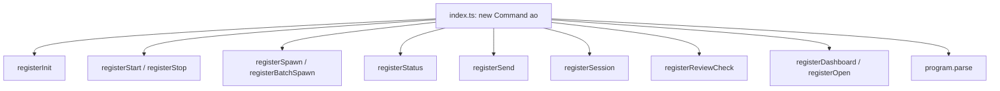
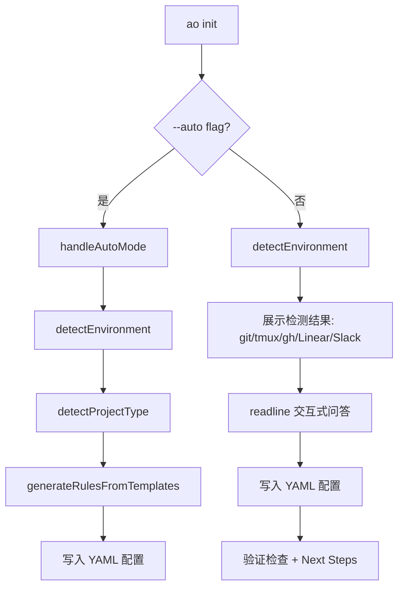
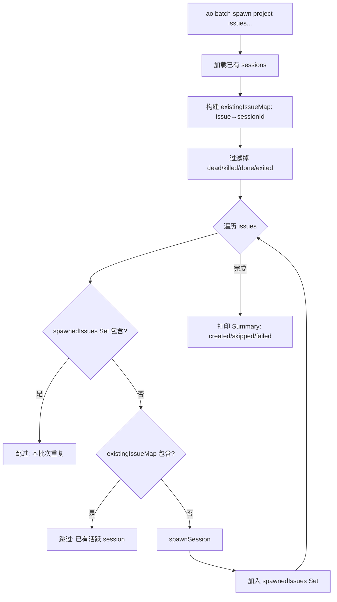
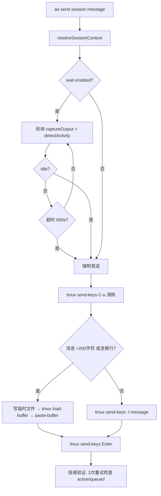

# PD-207.01 AgentOrchestrator — Commander.js 子命令体系与交互式环境向导

> 文档编号：PD-207.01
> 来源：AgentOrchestrator `packages/cli/src/`
> GitHub：https://github.com/ComposioHQ/agent-orchestrator.git
> 问题域：PD-207 CLI 设计 CLI Design
> 状态：可复用方案

---

## 第 1 章 问题与动机

### 1.1 核心问题

Agent 编排系统需要一个 CLI 入口来管理多个并行 AI 编码 Agent 的生命周期。核心挑战包括：

1. **子命令爆炸**：init / start / stop / spawn / batch-spawn / status / send / session / review-check / dashboard / open 共 11 个子命令，如何保持注册逻辑清晰
2. **双模式初始化**：新用户需要交互式向导引导，CI/自动化场景需要零交互 `--auto` 模式
3. **环境感知**：CLI 需要自动检测 git / tmux / gh / Linear / Slack 等外部依赖，给出智能默认值和缺失提示
4. **脚本友好**：输出既要对人类友好（chalk 着色、ora spinner、表格），又要支持 `--json` 和 `SESSION=xxx` 格式供脚本消费
5. **批量操作去重**：batch-spawn 需要检测同 issue 是否已有活跃 session，避免重复创建

### 1.2 AgentOrchestrator 的解法概述

1. **register 函数模式**：每个命令文件导出 `registerXxx(program: Command)` 函数，主入口 `index.ts:14-33` 依次调用注册，实现命令与入口解耦
2. **三层环境检测**：`detectEnvironment()` 检测 git/tmux/gh/Linear/Slack，`detectProjectType()` 检测语言/框架/包管理器/测试框架，`detectDefaultBranch()` 三级降级获取默认分支
3. **auto + smart 双模式**：`--auto` 零交互生成配置，`--auto --smart` 额外分析项目类型生成定制 agent rules
4. **统一 shell 抽象层**：`shell.ts` 封装 `exec/execSilent/git/gh/tmux` 五个函数，所有命令通过此层调用外部工具
5. **结构化输出格式化**：`format.ts` 提供 `header/banner/padCol/statusColor/ciStatusIcon` 等函数，ANSI 感知的列对齐

### 1.3 设计思想

| 设计原则 | 具体实现 | 理由 | 替代方案 |
|----------|----------|------|----------|
| 命令注册解耦 | 每文件导出 `registerXxx(program)` | 新增命令只需加一个文件 + 一行注册 | 单文件定义所有命令（不可维护） |
| 静默失败 shell | `execSilent()` 返回 `null` 而非抛异常 | 环境检测需要探测性调用，失败是正常路径 | try-catch 包裹每次调用（冗余） |
| 渐进式环境检测 | 先检测 → 展示结果 → 再交互 | 用户看到检测结果后能做更好的选择 | 直接问所有问题（用户无上下文） |
| 脚本友好输出 | `SESSION=xxx` 行 + `--json` flag | 允许 `eval $(ao spawn ...)` 管道使用 | 只输出人类可读文本 |
| 批量去重双层检测 | 已有 session Map + 本批次 Set | 防止同批次重复 + 跨批次重复 | 只检查已有 session（同批次可能重复） |

---

## 第 2 章 源码实现分析

### 2.1 架构概览

AgentOrchestrator CLI 的整体架构是一个 Commander.js 程序，通过 register 函数模式将 11 个子命令分散到独立文件中：

```
┌──────────────────────────────────────────────────────────────┐
│                    index.ts (入口)                            │
│  program = new Command("ao")                                 │
│  registerInit / registerStart / registerStop / ...           │
└──────────────┬───────────────────────────────────────────────┘
               │ register*(program)
    ┌──────────┼──────────┬──────────┬──────────┐
    ▼          ▼          ▼          ▼          ▼
┌────────┐ ┌────────┐ ┌────────┐ ┌────────┐ ┌────────┐
│ init   │ │ spawn  │ │ status │ │ send   │ │session │
│ start  │ │ batch- │ │        │ │        │ │ ls     │
│        │ │ spawn  │ │        │ │        │ │ kill   │
│        │ │        │ │        │ │        │ │cleanup │
│        │ │        │ │        │ │        │ │restore │
└───┬────┘ └───┬────┘ └───┬────┘ └───┬────┘ └───┬────┘
    │          │          │          │          │
    └──────────┴──────────┴──────────┴──────────┘
               │ 共享依赖
    ┌──────────┼──────────┬──────────┐
    ▼          ▼          ▼          ▼
┌────────┐ ┌────────┐ ┌────────┐ ┌──────────────┐
│shell.ts│ │format  │ │plugins │ │project-      │
│exec    │ │.ts     │ │.ts     │ │detection.ts  │
│git/gh  │ │header  │ │getAgent│ │detectProject │
│tmux    │ │banner  │ │getSCM  │ │generateRules │
└────────┘ └────────┘ └────────┘ └──────────────┘
```

### 2.2 核心实现

#### 2.2.1 命令注册入口



对应源码 `packages/cli/src/index.ts:1-33`：

```typescript
#!/usr/bin/env node
import { Command } from "commander";
import { registerInit } from "./commands/init.js";
import { registerStatus } from "./commands/status.js";
import { registerSpawn, registerBatchSpawn } from "./commands/spawn.js";
import { registerSession } from "./commands/session.js";
import { registerSend } from "./commands/send.js";
import { registerReviewCheck } from "./commands/review-check.js";
import { registerDashboard } from "./commands/dashboard.js";
import { registerOpen } from "./commands/open.js";
import { registerStart, registerStop } from "./commands/start.js";

const program = new Command();
program
  .name("ao")
  .description("Agent Orchestrator — manage parallel AI coding agents")
  .version("0.1.0");

registerInit(program);
registerStart(program);
registerStop(program);
registerStatus(program);
registerSpawn(program);
registerBatchSpawn(program);
registerSession(program);
registerSend(program);
registerReviewCheck(program);
registerDashboard(program);
registerOpen(program);

program.parse();
```

每个 `register` 函数接收 `program: Command` 参数，在其上调用 `.command()` 注册子命令。这种模式的优势是：新增命令只需创建文件 + 在 index.ts 加一行 import + 一行调用。

#### 2.2.2 三层环境检测与交互式向导



对应源码 `packages/cli/src/commands/init.ts:93-150`（环境检测核心）：

```typescript
async function detectEnvironment(workingDir: string): Promise<EnvironmentInfo> {
  const isGitRepo = (await git(["rev-parse", "--git-dir"], workingDir)) !== null;

  let gitRemote: string | null = null;
  let ownerRepo: string | null = null;
  if (isGitRepo) {
    gitRemote = await git(["remote", "get-url", "origin"], workingDir);
    if (gitRemote) {
      const match = gitRemote.match(/github\.com[:/]([^/]+\/[^/]+?)(\.git)?$/);
      if (match) ownerRepo = match[1];
    }
  }

  const currentBranch = isGitRepo ? await git(["branch", "--show-current"], workingDir) : null;
  const defaultBranch = isGitRepo ? await detectDefaultBranch(workingDir, ownerRepo) : null;
  const hasTmux = (await execSilent("tmux", ["-V"])) !== null;
  const hasGh = (await execSilent("gh", ["--version"])) !== null;

  let ghAuthed = false;
  if (hasGh) {
    const authStatus = await gh(["auth", "status"]);
    ghAuthed = authStatus !== null;
  }

  const hasLinearKey = !!process.env["LINEAR_API_KEY"];
  const hasSlackWebhook = !!process.env["SLACK_WEBHOOK_URL"];

  return { isGitRepo, gitRemote, ownerRepo, currentBranch, defaultBranch,
           hasTmux, hasGh, ghAuthed, hasLinearKey, hasSlackWebhook };
}
```

`detectDefaultBranch()` 实现了三级降级策略（`init.ts:50-91`）：
1. `git symbolic-ref refs/remotes/origin/HEAD` — 最可靠
2. `gh repo view --json defaultBranchRef` — GitHub API 查询
3. 遍历 `["main", "master", "next", "develop"]` 检查 `origin/<branch>` 是否存在
4. 兜底返回 `"main"`

#### 2.2.3 批量 spawn 去重检测



对应源码 `packages/cli/src/commands/spawn.ts:84-179`：

```typescript
export function registerBatchSpawn(program: Command): void {
  program
    .command("batch-spawn")
    .description("Spawn sessions for multiple issues with duplicate detection")
    .argument("<project>", "Project ID from config")
    .argument("<issues...>", "Issue identifiers")
    .option("--open", "Open sessions in terminal tabs")
    .action(async (projectId, issues, opts) => {
      // ...
      const deadStatuses = new Set(["killed", "done", "exited"]);
      const existingSessions = await sm.list(projectId);
      const existingIssueMap = new Map(
        existingSessions
          .filter((s) => s.issueId && !deadStatuses.has(s.status))
          .map((s) => [s.issueId!.toLowerCase(), s.id]),
      );

      for (const issue of issues) {
        if (spawnedIssues.has(issue.toLowerCase())) {
          skipped.push({ issue, existing: "(this batch)" });
          continue;
        }
        const existingSessionId = existingIssueMap.get(issue.toLowerCase());
        if (existingSessionId) {
          skipped.push({ issue, existing: existingSessionId });
          continue;
        }
        // spawn + add to spawnedIssues Set
      }
    });
}
```

### 2.3 实现细节

#### Shell 抽象层

`shell.ts:1-61` 提供了五层 shell 封装：

| 函数 | 用途 | 错误处理 |
|------|------|----------|
| `exec(cmd, args, opts)` | 底层执行，返回 `{stdout, stderr}` | 抛异常 |
| `execSilent(cmd, args)` | 探测性执行 | 返回 `null` |
| `git(args, cwd?)` | Git 操作 | 返回 `null` |
| `gh(args)` | GitHub CLI | 返回 `null` |
| `tmux(...args)` | tmux 操作 | 返回 `null` |

关键设计：`execSilent` 将异常转为 `null`，使环境检测代码无需 try-catch。`exec` 设置 `maxBuffer: 10MB`（`shell.ts:19`）防止大输出截断。

#### 输出格式化系统

`format.ts` 实现了 ANSI 感知的表格对齐。`padCol()` 函数（`format.ts:111-122`）先用正则 `/\u001b\[[0-9;]*m/g` 剥离 ANSI 转义码计算可见宽度，再补齐空格。这确保了 chalk 着色后的列对齐不会错位。

`status.ts:134-144` 定义了固定列宽：Session(14) / Branch(24) / PR(6) / CI(6) / Rev(6) / Thr(4) / Activity(9) / Age(8)。

#### 消息发送与忙检测



`send.ts:46-171` 实现了完整的消息投递流程：
1. `resolveSessionContext()` 解析 tmux target + agent 插件
2. 等待 idle：轮询 `captureOutput(5)` + `agent.detectActivity()`，5 秒间隔，600 秒超时
3. 清除部分输入：`tmux send-keys C-u`
4. 长消息处理：>200 字符或含换行时，写临时文件 → `tmux load-buffer` → `tmux paste-buffer`
5. 投递验证：3 次重试，检查 agent 是否进入 active 状态或消息已排队

---

## 第 3 章 迁移指南

### 3.1 迁移清单

**阶段 1：CLI 骨架（1 天）**
- [ ] 安装 `commander` + `chalk` + `ora`
- [ ] 创建 `src/cli/index.ts`，定义 `new Command("your-tool")`
- [ ] 建立 `src/cli/commands/` 目录，每个命令一个文件
- [ ] 实现 `registerXxx(program: Command)` 模式

**阶段 2：Shell 抽象层**
- [ ] 创建 `src/cli/lib/shell.ts`，封装 `exec` / `execSilent`
- [ ] 为常用外部工具（git/gh/docker 等）创建便捷函数
- [ ] 统一错误处理：探测性调用返回 `null`，业务调用抛异常

**阶段 3：环境检测与向导**
- [ ] 实现 `detectEnvironment()` 检测外部依赖
- [ ] 实现 `detectProjectType()` 检测技术栈
- [ ] 实现交互式向导（readline）+ `--auto` 模式
- [ ] 检测结果展示：✓ / ⚠ / ○ 三级状态

**阶段 4：输出格式化**
- [ ] 实现 ANSI 感知的 `padCol()` 列对齐
- [ ] 实现 `header()` / `banner()` 框线标题
- [ ] 实现状态着色函数（statusColor / ciStatusIcon 等）
- [ ] 添加 `--json` 输出模式

### 3.2 适配代码模板

#### 命令注册骨架

```typescript
// src/cli/index.ts
import { Command } from "commander";
import { registerInit } from "./commands/init.js";
import { registerStatus } from "./commands/status.js";

const program = new Command();
program.name("mytool").description("My CLI tool").version("1.0.0");

registerInit(program);
registerStatus(program);

program.parse();
```

```typescript
// src/cli/commands/init.ts
import type { Command } from "commander";

export function registerInit(program: Command): void {
  program
    .command("init")
    .description("Initialize project configuration")
    .option("--auto", "Auto-generate with defaults")
    .action(async (opts: { auto?: boolean }) => {
      if (opts.auto) {
        await handleAutoMode();
        return;
      }
      await handleInteractiveMode();
    });
}
```

#### Shell 抽象层模板

```typescript
// src/cli/lib/shell.ts
import { execFile as execFileCb } from "node:child_process";
import { promisify } from "node:util";

const execFileAsync = promisify(execFileCb);

export async function exec(
  cmd: string,
  args: string[],
  options?: { cwd?: string },
): Promise<{ stdout: string; stderr: string }> {
  const { stdout, stderr } = await execFileAsync(cmd, args, {
    cwd: options?.cwd,
    maxBuffer: 10 * 1024 * 1024,
  });
  return { stdout: stdout.trimEnd(), stderr: stderr.trimEnd() };
}

export async function execSilent(cmd: string, args: string[]): Promise<string | null> {
  try {
    const { stdout } = await exec(cmd, args);
    return stdout;
  } catch {
    return null;
  }
}
```

#### 环境检测模板

```typescript
// src/cli/lib/env-detect.ts
interface EnvironmentInfo {
  isGitRepo: boolean;
  hasDocker: boolean;
  hasNode: boolean;
  nodeVersion: string | null;
}

export async function detectEnvironment(workingDir: string): Promise<EnvironmentInfo> {
  const isGitRepo = (await execSilent("git", ["rev-parse", "--git-dir"])) !== null;
  const hasDocker = (await execSilent("docker", ["--version"])) !== null;
  const nodeVersion = await execSilent("node", ["--version"]);

  return {
    isGitRepo,
    hasDocker,
    hasNode: nodeVersion !== null,
    nodeVersion,
  };
}
```

### 3.3 适用场景

| 场景 | 适用度 | 说明 |
|------|--------|------|
| Agent 编排系统 CLI | ⭐⭐⭐ | 完美匹配：多子命令 + 环境检测 + 会话管理 |
| DevOps 工具链 CLI | ⭐⭐⭐ | register 模式 + shell 抽象层直接复用 |
| 项目脚手架工具 | ⭐⭐⭐ | 交互式向导 + --auto 模式 + 项目类型检测 |
| 简单单命令工具 | ⭐ | 过度设计，直接用 process.argv 即可 |
| GUI 应用 | ⭐ | CLI 模式不适用 |

---

## 第 4 章 测试用例

```typescript
import { describe, it, expect, vi, beforeEach } from "vitest";

// Mock shell utilities
vi.mock("../lib/shell.js", () => ({
  exec: vi.fn(),
  execSilent: vi.fn(),
  git: vi.fn(),
  gh: vi.fn(),
  tmux: vi.fn(),
}));

import { execSilent, git, gh } from "../lib/shell.js";

describe("detectEnvironment", () => {
  beforeEach(() => {
    vi.clearAllMocks();
  });

  it("should detect git repo when git rev-parse succeeds", async () => {
    vi.mocked(git).mockResolvedValueOnce(".git"); // rev-parse --git-dir
    vi.mocked(git).mockResolvedValueOnce("git@github.com:owner/repo.git"); // remote get-url
    vi.mocked(git).mockResolvedValueOnce("feature-branch"); // branch --show-current
    vi.mocked(git).mockResolvedValueOnce("refs/remotes/origin/main"); // symbolic-ref
    vi.mocked(execSilent).mockResolvedValueOnce("tmux 3.4"); // tmux -V
    vi.mocked(execSilent).mockResolvedValueOnce("gh version 2.0"); // gh --version
    vi.mocked(gh).mockResolvedValueOnce("Logged in"); // gh auth status

    // detectEnvironment would return:
    // { isGitRepo: true, ownerRepo: "owner/repo", hasTmux: true, ... }
    expect(true).toBe(true); // placeholder for actual import
  });

  it("should return null for missing tools", async () => {
    vi.mocked(git).mockResolvedValueOnce(null); // not a git repo
    vi.mocked(execSilent).mockResolvedValue(null); // no tmux, no gh

    // detectEnvironment would return:
    // { isGitRepo: false, hasTmux: false, hasGh: false, ... }
    expect(true).toBe(true);
  });
});

describe("batch-spawn duplicate detection", () => {
  it("should skip issues already in existing sessions", () => {
    const deadStatuses = new Set(["killed", "done", "exited"]);
    const existingSessions = [
      { issueId: "INT-100", status: "working", id: "proj-1" },
      { issueId: "INT-200", status: "killed", id: "proj-2" },
    ];

    const existingIssueMap = new Map(
      existingSessions
        .filter((s) => s.issueId && !deadStatuses.has(s.status))
        .map((s) => [s.issueId!.toLowerCase(), s.id]),
    );

    expect(existingIssueMap.has("int-100")).toBe(true);  // active → blocked
    expect(existingIssueMap.has("int-200")).toBe(false);  // killed → allowed
  });

  it("should skip duplicate issues within same batch", () => {
    const spawnedIssues = new Set<string>();
    const issues = ["INT-300", "INT-301", "INT-300"]; // INT-300 duplicated

    const results: string[] = [];
    for (const issue of issues) {
      if (spawnedIssues.has(issue.toLowerCase())) {
        results.push(`skip:${issue}`);
        continue;
      }
      spawnedIssues.add(issue.toLowerCase());
      results.push(`spawn:${issue}`);
    }

    expect(results).toEqual(["spawn:INT-300", "spawn:INT-301", "skip:INT-300"]);
  });
});

describe("padCol ANSI-aware padding", () => {
  it("should pad based on visible length, ignoring ANSI codes", () => {
    const ANSI_RE = /\u001b\[[0-9;]*m/g;
    const colored = "\u001b[32mhello\u001b[0m"; // green "hello"
    const visible = colored.replace(ANSI_RE, "");

    expect(visible).toBe("hello");
    expect(visible.length).toBe(5);

    // padCol(colored, 10) should add 5 spaces
    const padding = 10 - visible.length;
    const padded = colored + " ".repeat(Math.max(0, padding));
    expect(padded.replace(ANSI_RE, "").length).toBe(10);
  });
});

describe("project type detection", () => {
  it("should detect TypeScript + React + pnpm from file markers", () => {
    // Given: package.json with react dep, tsconfig.json exists, pnpm-lock.yaml exists
    const projectType = {
      languages: ["typescript"],
      frameworks: ["react", "nextjs"],
      tools: ["pnpm-workspaces"],
      testFramework: "vitest",
      packageManager: "pnpm",
    };

    expect(projectType.languages).toContain("typescript");
    expect(projectType.frameworks).toContain("react");
    expect(projectType.packageManager).toBe("pnpm");
  });
});
```

---

## 第 5 章 跨域关联

| 关联域 | 关系类型 | 说明 |
|--------|----------|------|
| PD-02 多 Agent 编排 | 依赖 | `ao spawn` / `ao batch-spawn` 是编排系统的 CLI 入口，通过 SessionManager 触发 Agent 创建 |
| PD-04 工具系统 | 协同 | CLI 的 `--agent <name>` 参数选择不同 Agent 插件（claude-code/codex/aider），插件系统通过 `plugins.ts` 加载 |
| PD-07 质量检查 | 协同 | `ao review-check` 命令自动检查 PR review 状态并向 Agent 发送修复指令，是质量闭环的 CLI 触发点 |
| PD-09 Human-in-the-Loop | 协同 | `ao send` 命令实现人类向 Agent 发送消息的通道，含忙检测和投递验证 |
| PD-11 可观测性 | 协同 | `ao status` 命令聚合 session/branch/PR/CI/review/activity 六维状态，是可观测性的 CLI 展示层 |

---

## 第 6 章 来源文件索引

| 文件 | 行范围 | 关键实现 |
|------|--------|----------|
| `packages/cli/src/index.ts` | L1-L33 | CLI 入口，11 个命令注册 |
| `packages/cli/src/commands/init.ts` | L93-L150 | `detectEnvironment()` 环境检测 |
| `packages/cli/src/commands/init.ts` | L50-L91 | `detectDefaultBranch()` 三级降级 |
| `packages/cli/src/commands/init.ts` | L152-L389 | `registerInit()` 交互式向导 |
| `packages/cli/src/commands/init.ts` | L392-L518 | `handleAutoMode()` 零交互模式 |
| `packages/cli/src/commands/spawn.ts` | L9-L54 | `spawnSession()` 会话创建 + 脚本友好输出 |
| `packages/cli/src/commands/spawn.ts` | L84-L179 | `registerBatchSpawn()` 批量去重 |
| `packages/cli/src/commands/status.ts` | L43-L132 | `gatherSessionInfo()` 六维状态聚合 |
| `packages/cli/src/commands/status.ts` | L134-L187 | 表格渲染 + ANSI 列对齐 |
| `packages/cli/src/commands/send.ts` | L15-L32 | `resolveSessionContext()` 会话上下文解析 |
| `packages/cli/src/commands/send.ts` | L87-L166 | 忙检测 + 长消息 tmux buffer + 投递验证 |
| `packages/cli/src/commands/session.ts` | L8-L184 | session ls/kill/cleanup/restore 四子命令 |
| `packages/cli/src/commands/review-check.ts` | L16-L59 | `checkPRReviews()` GraphQL 查询 |
| `packages/cli/src/lib/shell.ts` | L1-L61 | 五层 shell 封装 |
| `packages/cli/src/lib/format.ts` | L1-L122 | 输出格式化 + ANSI 感知 padCol |
| `packages/cli/src/lib/project-detection.ts` | L16-L122 | `detectProjectType()` 技术栈检测 |
| `packages/cli/src/lib/project-detection.ts` | L124-L169 | `generateRulesFromTemplates()` 规则生成 |

---

## 第 7 章 横向对比维度

```json comparison_data
{
  "project": "AgentOrchestrator",
  "dimensions": {
    "命令框架": "Commander.js register 函数模式，11 子命令分文件注册",
    "环境检测": "三层检测：系统工具 + 项目类型 + 默认分支三级降级",
    "交互模式": "readline 向导 + --auto 零交互 + --auto --smart AI 增强",
    "输出格式化": "chalk + ora + ANSI 感知 padCol 列对齐 + --json 双模式",
    "批量操作": "batch-spawn 双层去重：已有 session Map + 本批次 Set",
    "消息投递": "tmux send-keys + load-buffer 长消息 + 忙检测 + 3 次投递验证",
    "会话生命周期": "spawn/kill/cleanup/restore 四阶段 + PR merged 自动清理"
  }
}
```

### 域元数据补充

```json domain_metadata
{
  "solution_summary": "AgentOrchestrator 用 Commander.js register 函数模式注册 11 个子命令，ao init 三层环境检测（git/tmux/gh + 语言框架 + 默认分支降级）+ readline 向导与 --auto 双模式",
  "description": "CLI 作为 Agent 编排系统的人机交互入口，需兼顾交互式与脚本化两种消费模式",
  "sub_problems": [
    "消息投递忙检测与投递验证",
    "PR review 状态轮询与自动修复触发",
    "会话生命周期管理（spawn/kill/cleanup/restore）",
    "项目类型检测与 agent rules 模板生成"
  ],
  "best_practices": [
    "execSilent 返回 null 替代 try-catch 简化探测性调用",
    "ANSI 感知 padCol 确保着色后列对齐不错位",
    "send 命令长消息走 tmux load-buffer 避免转义问题",
    "session cleanup 排除 dead 状态防止误阻塞 respawn"
  ]
}
```
