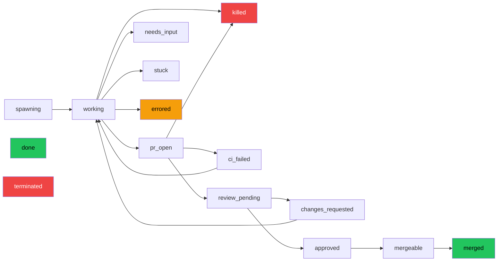
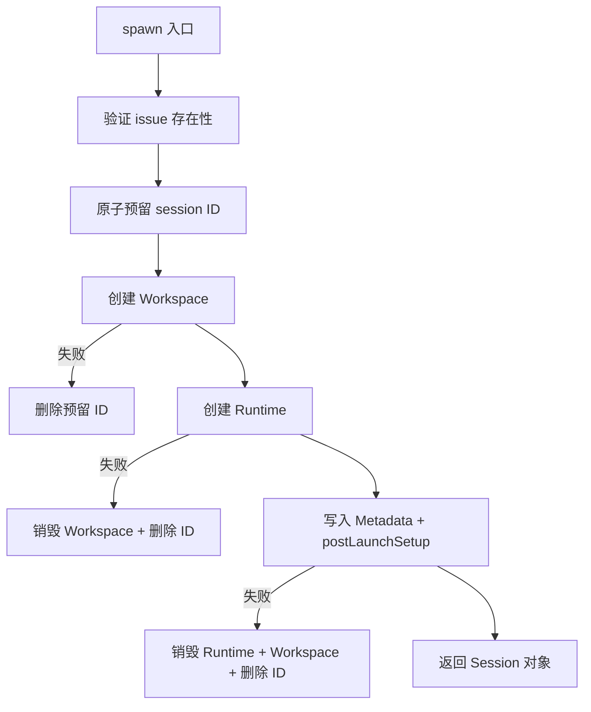
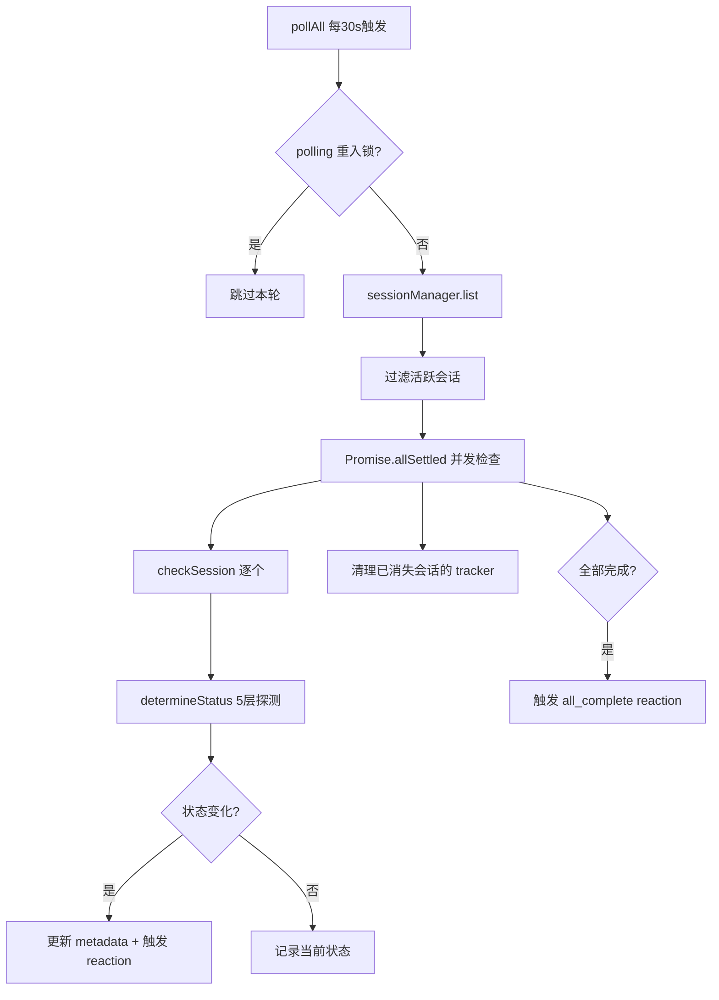
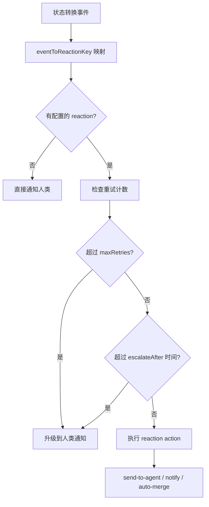

# PD-208.01 Agent Orchestrator — 16 态会话状态机与三层资源编排

> 文档编号：PD-208.01
> 来源：Agent Orchestrator `packages/core/src/types.ts` `packages/core/src/session-manager.ts` `packages/core/src/lifecycle-manager.ts`
> GitHub：https://github.com/ComposioHQ/agent-orchestrator.git
> 问题域：PD-208 会话生命周期管理 Session Lifecycle Management
> 状态：可复用方案

---

## 第 1 章 问题与动机

### 1.1 核心问题

在多 Agent 编排系统中，一个 Agent 会话从创建到完成要经历复杂的生命周期：创建工作区、启动运行时、拉起 Agent 进程、等待 Agent 工作、检测 PR 创建、监控 CI 状态、跟踪 Code Review、判断可合并性、最终合并或终止。每个阶段都可能失败，需要不同的恢复策略。

核心挑战：
1. **状态爆炸**：Agent 会话不是简单的"运行/停止"二态，而是涉及 PR 生命周期、CI 流水线、Code Review 等多个外部系统的复合状态
2. **资源泄漏**：workspace（git worktree）、runtime（tmux session）、agent 进程三层资源必须按序创建、逆序销毁，任何一层失败都需要回滚已创建的资源
3. **异步状态检测**：Agent 进程可能崩溃、卡住、等待输入，需要从终端输出和进程存活性两个维度交叉判断
4. **并发安全**：多个会话同时创建时，session ID 分配必须原子化，轮询循环必须防重入

### 1.2 Agent Orchestrator 的解法概述

Agent Orchestrator 采用"SessionManager + LifecycleManager"双核架构：

1. **16 态有限状态机**：定义 `spawning → working → pr_open → ci_failed → review_pending → changes_requested → approved → mergeable → merged` 等 16 种状态，覆盖完整 PR 生命周期（`types.ts:26-42`）
2. **三层资源编排**：spawn 时按 workspace → runtime → agent 顺序创建，每层失败触发前序资源回滚（`session-manager.ts:315-559`）
3. **轮询驱动状态转换**：LifecycleManager 以 30s 间隔轮询所有活跃会话，通过 Runtime/Agent/SCM 三个插件探测当前状态（`lifecycle-manager.ts:524-580`）
4. **Reaction 引擎**：状态转换自动触发配置化的反应动作（send-to-agent / notify / auto-merge），支持重试计数和时间维度的升级策略（`lifecycle-manager.ts:292-416`）
5. **原子 ID 预留**：用 `O_EXCL` 文件创建实现无锁原子 session ID 分配（`metadata.ts:264-274`）

### 1.3 设计思想

| 设计原则 | 具体实现 | 理由 | 替代方案 |
|----------|----------|------|----------|
| 显式状态枚举 | 16 种 SessionStatus 联合类型 + 6 种 ActivityState | 编译期类型安全，穷举 switch 防遗漏 | 字符串自由态（运行时才发现拼写错误） |
| 逐层回滚 | spawn 中 try/catch 嵌套，每层失败清理前序资源 | 防止 workspace/tmux 泄漏 | 事务性资源管理器（复杂度高） |
| 轮询而非事件 | 30s 定时器 + Promise.allSettled 并发检查 | Agent/SCM/CI 无统一事件源，轮询最通用 | WebHook 回调（需要外部配置） |
| 插件化探测 | Runtime/Agent/SCM 三个插件接口各自实现状态探测 | 支持 tmux/docker/k8s 等不同运行时 | 硬编码 tmux 检测（不可扩展） |
| 文件级元数据 | key=value 平文件，兼容 bash 脚本 | 零依赖，可用 grep/awk 调试 | SQLite/Redis（引入外部依赖） |

---

## 第 2 章 源码实现分析

### 2.1 架构概览

Agent Orchestrator 的会话生命周期由两个核心服务协作管理：

```
┌─────────────────────────────────────────────────────────────────┐
│                    OrchestratorConfig (YAML)                     │
│  projects / defaults / reactions / notificationRouting           │
└──────────────────────────┬──────────────────────────────────────┘
                           │
              ┌────────────┴────────────┐
              │                         │
    ┌─────────▼─────────┐   ┌──────────▼──────────┐
    │  SessionManager    │   │  LifecycleManager    │
    │  (CRUD + 资源编排)  │   │  (轮询 + 状态机)     │
    │                    │   │                      │
    │  spawn()           │   │  pollAll() ─30s──┐  │
    │  restore()         │   │  checkSession()  │  │
    │  kill()            │   │  determineStatus()│  │
    │  cleanup()         │   │  executeReaction()│  │
    │  send()            │   │                  │  │
    └────────┬───────────┘   └──────────┬───────┘  │
             │                          │          │
    ┌────────┴──────────────────────────┴──────┐   │
    │           PluginRegistry                  │   │
    │  ┌────────┐ ┌───────┐ ┌──────────┐      │   │
    │  │Runtime │ │ Agent │ │Workspace │      │   │
    │  │(tmux)  │ │(claude)│ │(worktree)│      │   │
    │  └────────┘ └───────┘ └──────────┘      │   │
    │  ┌────────┐ ┌───────┐ ┌──────────┐      │   │
    │  │  SCM   │ │Tracker│ │ Notifier │      │   │
    │  │(github)│ │(linear)│ │(desktop) │      │   │
    │  └────────┘ └───────┘ └──────────┘      │   │
    └──────────────────────────────────────────┘   │
             │                                      │
    ┌────────▼──────────────────────────────────┐   │
    │  Flat-file Metadata (key=value)            │   │
    │  ~/.agent-orchestrator/{hash}-{proj}/      │◄──┘
    │    sessions/{session-id}                   │
    │    archive/{session-id}_{timestamp}        │
    └───────────────────────────────────────────┘
```

### 2.2 核心实现

#### 2.2.1 16 态状态定义与终态集合



对应源码 `packages/core/src/types.ts:26-42`：

```typescript
/** Session lifecycle states */
export type SessionStatus =
  | "spawning"          // 资源创建中
  | "working"           // Agent 正在工作
  | "pr_open"           // PR 已创建，等待 CI/Review
  | "ci_failed"         // CI 检查失败
  | "review_pending"    // 等待人工 Review
  | "changes_requested" // Reviewer 要求修改
  | "approved"          // Review 通过
  | "mergeable"         // CI 通过 + Review 通过，可合并
  | "merged"            // PR 已合并（终态）
  | "cleanup"           // 资源清理中
  | "needs_input"       // Agent 等待人工输入
  | "stuck"             // Agent 卡住
  | "errored"           // 发生错误
  | "killed"            // 被终止（终态）
  | "done"              // 完成（终态）
  | "terminated";       // 被终止（终态）
```

终态集合定义在 `types.ts:94-101`，用 `ReadonlySet` 保证不可变：

```typescript
export const TERMINAL_STATUSES: ReadonlySet<SessionStatus> = new Set([
  "killed", "terminated", "done", "cleanup", "errored", "merged",
]);

export const NON_RESTORABLE_STATUSES: ReadonlySet<SessionStatus> = new Set(["merged"]);
```

#### 2.2.2 三层资源编排与逐层回滚



对应源码 `packages/core/src/session-manager.ts:315-559`，关键回滚逻辑：

```typescript
// session-manager.ts:469-501 — Runtime 创建失败时回滚 Workspace
let handle: RuntimeHandle;
try {
  const launchCommand = plugins.agent.getLaunchCommand(agentLaunchConfig);
  const environment = plugins.agent.getEnvironment(agentLaunchConfig);
  handle = await plugins.runtime.create({
    sessionId: tmuxName ?? sessionId,
    workspacePath,
    launchCommand,
    environment: {
      ...environment,
      AO_SESSION: sessionId,
      AO_DATA_DIR: sessionsDir,
    },
  });
} catch (err) {
  // 回滚：销毁 workspace + 删除预留 ID
  if (plugins.workspace && workspacePath !== project.path) {
    try { await plugins.workspace.destroy(workspacePath); } catch { /* best effort */ }
  }
  try { deleteMetadata(sessionsDir, sessionId, false); } catch { /* best effort */ }
  throw err;
}
```


#### 2.2.3 轮询驱动状态转换



对应源码 `packages/core/src/lifecycle-manager.ts:182-289`，`determineStatus` 实现 5 层探测链：

```typescript
// lifecycle-manager.ts:182-289 — 5 层状态探测
async function determineStatus(session: Session): Promise<SessionStatus> {
  // 1. Runtime 存活检查 — 容器/tmux 是否还在
  if (session.runtimeHandle) {
    const alive = await runtime.isAlive(session.runtimeHandle).catch(() => true);
    if (!alive) return "killed";
  }

  // 2. Agent 活动检测 — 终端输出 + 进程存活交叉判断
  if (agent && session.runtimeHandle) {
    const terminalOutput = runtime ? await runtime.getOutput(session.runtimeHandle, 10) : "";
    if (terminalOutput) {
      const activity = agent.detectActivity(terminalOutput);
      if (activity === "waiting_input") return "needs_input";
      const processAlive = await agent.isProcessRunning(session.runtimeHandle);
      if (!processAlive) return "killed";
    }
  }

  // 3. PR 自动检测 — 通过 branch 名反查 PR（关键：支持无 hook 的 Agent）
  if (!session.pr && scm && session.branch) {
    const detectedPR = await scm.detectPR(session, project);
    if (detectedPR) { session.pr = detectedPR; /* 持久化 */ }
  }

  // 4. PR 状态链 — merged → ci_failed → review → mergeable
  if (session.pr && scm) {
    const prState = await scm.getPRState(session.pr);
    if (prState === PR_STATE.MERGED) return "merged";
    if (prState === PR_STATE.CLOSED) return "killed";
    const ciStatus = await scm.getCISummary(session.pr);
    if (ciStatus === CI_STATUS.FAILING) return "ci_failed";
    const reviewDecision = await scm.getReviewDecision(session.pr);
    if (reviewDecision === "approved") {
      const mergeReady = await scm.getMergeability(session.pr);
      if (mergeReady.mergeable) return "mergeable";
      return "approved";
    }
    // ... changes_requested, review_pending, pr_open
  }

  // 5. 默认：spawning/stuck/needs_input → working
  return session.status;
}
```

#### 2.2.4 Reaction 引擎与升级策略



对应源码 `packages/core/src/lifecycle-manager.ts:292-416`，关键的升级判断：

```typescript
// lifecycle-manager.ts:306-327 — 双维度升级判断
tracker.attempts++;
const maxRetries = reactionConfig.retries ?? Infinity;
const escalateAfter = reactionConfig.escalateAfter;
let shouldEscalate = false;

// 维度1：重试次数
if (tracker.attempts > maxRetries) shouldEscalate = true;

// 维度2：时间窗口（支持 "10m", "30s", "1h" 格式）
if (typeof escalateAfter === "string") {
  const durationMs = parseDuration(escalateAfter);
  if (durationMs > 0 && Date.now() - tracker.firstTriggered.getTime() > durationMs) {
    shouldEscalate = true;
  }
}

// 维度3：数字型 escalateAfter（次数阈值）
if (typeof escalateAfter === "number" && tracker.attempts > escalateAfter) {
  shouldEscalate = true;
}
```

### 2.3 实现细节

**原子 Session ID 预留**（`metadata.ts:264-274`）：

使用 `O_EXCL` 标志创建文件，操作系统保证原子性，无需外部锁：

```typescript
export function reserveSessionId(dataDir: string, sessionId: SessionId): boolean {
  const path = metadataPath(dataDir, sessionId);
  mkdirSync(dirname(path), { recursive: true });
  try {
    const fd = openSync(path, constants.O_WRONLY | constants.O_CREAT | constants.O_EXCL);
    closeSync(fd);
    return true;
  } catch { return false; }
}
```

**Session 恢复流程**（`session-manager.ts:920-1107`）：

恢复已崩溃的会话需要 10 步：查找元数据（含归档）→ 重建 Session 对象 → 活动检测判断可恢复性 → 验证 workspace 存在（可重建 worktree）→ 销毁旧 runtime → 获取恢复命令（优先 `getRestoreCommand`）→ 创建新 runtime → 更新元数据 → postLaunchSetup。

**轮询重入保护**（`lifecycle-manager.ts:527-528`）：

```typescript
if (polling) return;  // 前一轮未完成则跳过
polling = true;
```

**Hash-based 目录隔离**（`paths.ts:20-25`）：

用 `sha256(dirname(configPath)).slice(0, 12)` 生成 12 字符哈希，确保不同配置文件的项目数据互不干扰，同时用 `.origin` 文件检测哈希碰撞。

---

## 第 3 章 迁移指南

### 3.1 迁移清单

**阶段 1：状态定义**
- [ ] 定义 SessionStatus 联合类型，覆盖你的业务场景的所有状态
- [ ] 定义 TERMINAL_STATUSES 和 NON_RESTORABLE_STATUSES 集合
- [ ] 实现 `isTerminalSession()` 和 `isRestorable()` 辅助函数

**阶段 2：资源管理**
- [ ] 实现 SessionManager 的 spawn/kill/restore/list/get/send 接口
- [ ] 在 spawn 中实现逐层创建 + 逐层回滚
- [ ] 实现 flat-file 元数据存储（或替换为你的存储方案）
- [ ] 实现原子 ID 预留（O_EXCL 或数据库 UNIQUE 约束）

**阶段 3：生命周期轮询**
- [ ] 实现 LifecycleManager 的 start/stop/check 接口
- [ ] 实现 determineStatus 多层探测链
- [ ] 实现 Reaction 引擎（事件→动作映射 + 重试/升级）
- [ ] 配置通知路由（按优先级分发到不同通知渠道）

**阶段 4：插件化**
- [ ] 抽象 Runtime/Agent/Workspace/SCM/Notifier 插件接口
- [ ] 实现至少一个 Runtime 插件（如 tmux）和一个 Agent 插件

### 3.2 适配代码模板

以下是一个精简的 TypeScript 会话状态机实现，可直接复用：

```typescript
// === 状态定义 ===
type SessionStatus =
  | "creating" | "running" | "paused"
  | "completed" | "failed" | "terminated";

const TERMINAL_STATUSES = new Set<SessionStatus>(["completed", "failed", "terminated"]);

interface Session {
  id: string;
  status: SessionStatus;
  resources: { workspace?: string; runtime?: string; agent?: string };
  metadata: Record<string, string>;
  createdAt: Date;
}

// === 原子 ID 预留 ===
import { openSync, closeSync, constants, mkdirSync } from "node:fs";
import { dirname, join } from "node:path";

function reserveId(dir: string, id: string): boolean {
  mkdirSync(dir, { recursive: true });
  try {
    const fd = openSync(join(dir, id), constants.O_WRONLY | constants.O_CREAT | constants.O_EXCL);
    closeSync(fd);
    return true;
  } catch { return false; }
}

// === 逐层创建 + 回滚 ===
async function spawnSession(config: { projectId: string }): Promise<Session> {
  const id = allocateId(config.projectId);
  let workspace: string | undefined;
  let runtimeHandle: string | undefined;

  // Layer 1: Workspace
  try {
    workspace = await createWorkspace(id);
  } catch (err) {
    releaseId(id);
    throw err;
  }

  // Layer 2: Runtime
  try {
    runtimeHandle = await createRuntime(id, workspace);
  } catch (err) {
    await destroyWorkspace(workspace).catch(() => {});
    releaseId(id);
    throw err;
  }

  // Layer 3: Agent
  try {
    await launchAgent(id, runtimeHandle);
  } catch (err) {
    await destroyRuntime(runtimeHandle).catch(() => {});
    await destroyWorkspace(workspace).catch(() => {});
    releaseId(id);
    throw err;
  }

  return {
    id, status: "creating",
    resources: { workspace, runtime: runtimeHandle },
    metadata: {}, createdAt: new Date(),
  };
}

// === 轮询状态机 ===
class LifecyclePoller {
  private states = new Map<string, SessionStatus>();
  private polling = false;
  private timer: ReturnType<typeof setInterval> | null = null;

  start(intervalMs = 30_000) {
    if (this.timer) return;
    this.timer = setInterval(() => void this.poll(), intervalMs);
    void this.poll();
  }

  stop() {
    if (this.timer) { clearInterval(this.timer); this.timer = null; }
  }

  private async poll() {
    if (this.polling) return; // 重入保护
    this.polling = true;
    try {
      const sessions = await listActiveSessions();
      await Promise.allSettled(sessions.map(s => this.check(s)));
    } finally {
      this.polling = false;
    }
  }

  private async check(session: Session) {
    const oldStatus = this.states.get(session.id) ?? session.status;
    const newStatus = await detectStatus(session);
    if (newStatus !== oldStatus) {
      this.states.set(session.id, newStatus);
      await onTransition(session.id, oldStatus, newStatus);
    }
  }
}
```

### 3.3 适用场景

| 场景 | 适用度 | 说明 |
|------|--------|------|
| 多 Agent 并行开发（PR 驱动） | ⭐⭐⭐ | 完美匹配：16 态覆盖完整 PR 生命周期 |
| 单 Agent 任务执行 | ⭐⭐ | 可简化为 5-6 态，去掉 PR/Review 相关状态 |
| 长时间运行的 Agent 服务 | ⭐⭐ | 轮询机制适合，但需要调整状态定义 |
| 短任务批处理 | ⭐ | 过度设计，简单的 running/done/failed 即可 |
| 需要实时状态推送的场景 | ⭐⭐ | 轮询有 30s 延迟，需要补充 WebSocket 推送 |


---

## 第 4 章 测试用例

基于真实函数签名的测试代码，覆盖状态机核心逻辑：

```typescript
import { describe, it, expect, vi, beforeEach } from "vitest";

// === 状态定义测试 ===
describe("SessionStatus 状态集合", () => {
  const TERMINAL_STATUSES = new Set(["killed", "terminated", "done", "cleanup", "errored", "merged"]);
  const NON_RESTORABLE = new Set(["merged"]);

  function isTerminal(status: string, activity: string | null): boolean {
    return TERMINAL_STATUSES.has(status) || (activity === "exited");
  }

  function isRestorable(status: string, activity: string | null): boolean {
    return isTerminal(status, activity) && !NON_RESTORABLE.has(status);
  }

  it("working 状态不是终态", () => {
    expect(isTerminal("working", "active")).toBe(false);
  });

  it("killed 状态是终态且可恢复", () => {
    expect(isTerminal("killed", null)).toBe(true);
    expect(isRestorable("killed", null)).toBe(true);
  });

  it("merged 状态是终态但不可恢复", () => {
    expect(isTerminal("merged", null)).toBe(true);
    expect(isRestorable("merged", null)).toBe(false);
  });

  it("activity=exited 使任何状态变为终态", () => {
    expect(isTerminal("working", "exited")).toBe(true);
    expect(isRestorable("working", "exited")).toBe(true);
  });
});

// === 原子 ID 预留测试 ===
describe("reserveSessionId 原子性", () => {
  it("首次预留成功", () => {
    // 模拟 O_EXCL 文件创建
    const reserved = new Set<string>();
    function reserve(id: string): boolean {
      if (reserved.has(id)) return false;
      reserved.add(id);
      return true;
    }
    expect(reserve("app-1")).toBe(true);
    expect(reserve("app-1")).toBe(false); // 重复预留失败
    expect(reserve("app-2")).toBe(true);
  });

  it("并发预留只有一个成功", async () => {
    const reserved = new Set<string>();
    let raceWinner = 0;
    const reserve = (id: string) => {
      if (reserved.has(id)) return false;
      reserved.add(id);
      raceWinner++;
      return true;
    };
    // 模拟 10 个并发尝试
    const results = Array.from({ length: 10 }, () => reserve("app-1"));
    expect(results.filter(Boolean).length).toBe(1);
  });
});

// === 轮询重入保护测试 ===
describe("LifecycleManager 轮询", () => {
  it("重入时跳过本轮", async () => {
    let polling = false;
    let pollCount = 0;

    async function pollAll() {
      if (polling) return; // 重入保护
      polling = true;
      pollCount++;
      await new Promise(r => setTimeout(r, 100)); // 模拟耗时
      polling = false;
    }

    // 同时触发两次
    await Promise.all([pollAll(), pollAll()]);
    expect(pollCount).toBe(1); // 只执行了一次
  });
});

// === Reaction 升级策略测试 ===
describe("Reaction 升级", () => {
  it("超过 maxRetries 后升级", () => {
    const tracker = { attempts: 0, firstTriggered: new Date() };
    const config = { retries: 3, escalateAfter: undefined };

    for (let i = 0; i < 4; i++) tracker.attempts++;
    expect(tracker.attempts > (config.retries ?? Infinity)).toBe(true);
  });

  it("超过时间窗口后升级", () => {
    const tenMinutesAgo = new Date(Date.now() - 11 * 60_000);
    const tracker = { attempts: 1, firstTriggered: tenMinutesAgo };
    const durationMs = 10 * 60_000; // "10m"

    const elapsed = Date.now() - tracker.firstTriggered.getTime();
    expect(elapsed > durationMs).toBe(true);
  });
});

// === determineStatus 探测链测试 ===
describe("determineStatus 5层探测", () => {
  it("Runtime 不存活 → killed", async () => {
    const runtime = { isAlive: vi.fn().mockResolvedValue(false) };
    // 第1层就返回 killed，不继续探测
    expect(await runtime.isAlive("handle")).toBe(false);
  });

  it("Agent 等待输入 → needs_input", () => {
    const detectActivity = (output: string) => {
      if (output.includes("?") || output.includes("permission")) return "waiting_input";
      return "active";
    };
    expect(detectActivity("Do you want to proceed?")).toBe("waiting_input");
  });

  it("PR merged → merged 终态", () => {
    const prState = "merged";
    expect(prState === "merged").toBe(true);
  });
});
```

---

## 第 5 章 跨域关联

| 关联域 | 关系类型 | 说明 |
|--------|----------|------|
| PD-02 多 Agent 编排 | 依赖 | 会话生命周期是编排的基础单元，SessionManager.spawn 是编排器创建 Agent 的入口 |
| PD-03 容错与重试 | 协同 | Reaction 引擎的 retries + escalateAfter 机制是容错策略的具体实现 |
| PD-04 工具系统 | 协同 | Agent 插件接口（getLaunchCommand, detectActivity）是工具系统的一部分 |
| PD-06 记忆持久化 | 协同 | flat-file 元数据存储 + archive 归档机制是会话记忆的持久化方案 |
| PD-09 Human-in-the-Loop | 依赖 | needs_input 状态 + Notifier 通知是 HITL 的触发机制 |
| PD-11 可观测性 | 协同 | OrchestratorEvent 事件体系（36 种事件类型）是可观测性的数据源 |
| PD-209 Agent 活动检测 | 强依赖 | determineStatus 的第 2 层探测依赖 Agent.detectActivity 和 Agent.getActivityState |

---

## 第 6 章 来源文件索引

| 文件 | 行范围 | 关键实现 |
|------|--------|----------|
| `packages/core/src/types.ts` | L26-L42 | 16 种 SessionStatus 联合类型定义 |
| `packages/core/src/types.ts` | L44-L61 | 6 种 ActivityState 定义 + 常量 |
| `packages/core/src/types.ts` | L94-L127 | TERMINAL_STATUSES / NON_RESTORABLE / isTerminalSession / isRestorable |
| `packages/core/src/types.ts` | L129-L171 | Session 接口完整定义 |
| `packages/core/src/types.ts` | L700-L736 | 36 种 EventType 定义 |
| `packages/core/src/types.ts` | L755-L787 | ReactionConfig 接口 |
| `packages/core/src/session-manager.ts` | L315-L559 | spawn 三层资源编排 + 逐层回滚 |
| `packages/core/src/session-manager.ts` | L682-L718 | list 并发加载 + 2s 超时保护 |
| `packages/core/src/session-manager.ts` | L920-L1107 | restore 10 步恢复流程 |
| `packages/core/src/lifecycle-manager.ts` | L172-L607 | createLifecycleManager 完整实现 |
| `packages/core/src/lifecycle-manager.ts` | L182-L289 | determineStatus 5 层探测链 |
| `packages/core/src/lifecycle-manager.ts` | L292-L416 | executeReaction 重试 + 升级 |
| `packages/core/src/lifecycle-manager.ts` | L524-L580 | pollAll 轮询循环 + 重入保护 |
| `packages/core/src/metadata.ts` | L264-L274 | reserveSessionId O_EXCL 原子预留 |
| `packages/core/src/metadata.ts` | L191-L204 | deleteMetadata 归档机制 |
| `packages/core/src/paths.ts` | L20-L25 | generateConfigHash SHA256 哈希隔离 |
| `packages/core/src/paths.ts` | L173-L194 | validateAndStoreOrigin 碰撞检测 |
| `packages/core/src/prompt-builder.ts` | L22-L40 | BASE_AGENT_PROMPT 三层 prompt 组合 |

---

## 第 7 章 横向对比维度

```json comparison_data
{
  "project": "AgentOrchestrator",
  "dimensions": {
    "状态模型": "16 态 TypeScript 联合类型 + ReadonlySet 终态集合",
    "转换驱动": "30s 轮询 + 5 层探测链（Runtime→Agent→PR检测→PR状态→默认）",
    "资源编排": "workspace→runtime→agent 三层顺序创建，逐层 try/catch 回滚",
    "恢复机制": "10 步恢复流程：归档查找→workspace 重建→旧 runtime 销毁→新 runtime 创建",
    "并发保护": "O_EXCL 原子 ID 预留 + polling 布尔重入锁",
    "反应引擎": "事件→动作映射 + 重试计数/时间窗口双维度升级到人类通知",
    "元数据存储": "key=value 平文件，兼容 bash grep/awk，archive 子目录归档"
  }
}
```

### 域元数据补充

```json domain_metadata
{
  "solution_summary": "AgentOrchestrator 用 16 态 TypeScript 联合类型 + 30s 轮询 5 层探测链驱动 PR 全生命周期状态转换，三层资源逐层回滚防泄漏",
  "description": "覆盖 PR 生命周期的多态状态机与插件化探测驱动的自动状态转换",
  "sub_problems": [
    "PR 自动检测：无 hook Agent 通过 branch 名反查 PR",
    "Reaction 升级策略：重试次数与时间窗口双维度升级到人类",
    "会话列表性能：并发加载 + 2s 超时保护防慢探测阻塞"
  ],
  "best_practices": [
    "5 层探测链按成本递增排列：本地进程→终端输出→SCM API",
    "轮询布尔锁防重入比 mutex 更轻量且无死锁风险",
    "hash-based 目录 + .origin 文件检测哈希碰撞"
  ]
}
```
