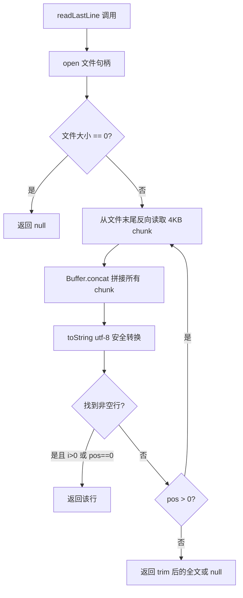
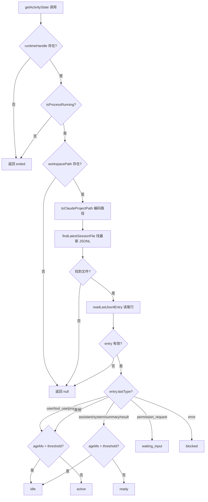
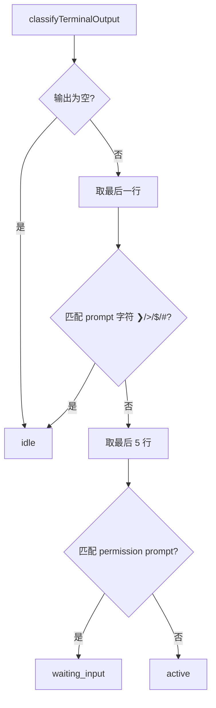

# PD-209.01 Agent Orchestrator — JSONL 双通道活跃度检测

> 文档编号：PD-209.01
> 来源：Agent Orchestrator `packages/plugins/agent-claude-code/src/index.ts`
> GitHub：https://github.com/ComposioHQ/agent-orchestrator.git
> 问题域：PD-209 Agent 活跃度检测 Agent Activity Detection
> 状态：可复用方案

---

## 第 1 章 问题与动机

### 1.1 核心问题

在多 Agent 编排系统中，编排器需要实时感知每个 Agent 的活跃状态：它在思考？在等待输入？已经卡住？还是已经退出？这个问题的难点在于：

1. **Agent 是黑盒进程** — Agent（如 Claude Code、Codex、Aider）运行在独立的 tmux 会话中，编排器无法直接访问其内部状态
2. **终端输出不可靠** — 解析终端输出（tmux capture-pane）是一种 hack，历史输出会干扰当前状态判断
3. **状态粒度要求高** — 不是简单的"活着/死了"二分法，需要区分 active/ready/idle/waiting_input/blocked/exited 六种状态
4. **大文件性能** — Agent 的 JSONL 日志可达 100MB+，全量读取不可接受
5. **多 Agent 适配** — 不同 Agent 工具有不同的日志格式和活跃度信号

### 1.2 Agent Orchestrator 的解法概述

Agent Orchestrator 采用**双通道检测 + 插件化适配**的架构：

1. **主通道：JSONL 日志尾部读取** — 通过 `readLastJsonlEntry()` 只读取 JSONL 文件最后一行，根据 entry type 映射到活跃度状态（`index.ts:646-702`）
2. **辅通道：终端输出模式分类** — 通过 `classifyTerminalOutput()` 解析 tmux capture-pane 输出，作为降级方案（`index.ts:459-484`）
3. **进程存活检测** — 通过 `findClaudeProcess()` 检查 tmux pane TTY 上的进程（`index.ts:393-452`）
4. **可配置 idle 阈值** — `DEFAULT_READY_THRESHOLD_MS = 300_000`（5 分钟），通过 file mtime 判断是否过期（`types.ts:71`）
5. **插件化 Agent 接口** — `Agent` 接口定义 `getActivityState()` 方法，每种 Agent 工具独立实现检测逻辑（`types.ts:274-285`）

### 1.3 设计思想

| 设计原则 | 具体实现 | 理由 | 替代方案 |
|----------|----------|------|----------|
| 只读文件尾部 | `readLastLine()` 从文件末尾反向读取 4KB chunk | JSONL 日志可达 100MB+，全量读取浪费 IO | 用 `tail -1` 外部命令（需 spawn 子进程） |
| file mtime 作为时间戳 | `stat(filePath).mtime` 而非解析 JSON 中的时间字段 | 避免解析整个 JSON 对象，mtime 由 OS 维护，零成本 | 解析 JSONL entry 中的 timestamp 字段 |
| entry type 映射状态 | switch-case 将 JSONL type 映射到 6 种 ActivityState | 语义明确，易于扩展新 type | 正则匹配 entry 内容 |
| 双通道降级 | JSONL 优先，终端输出作为 deprecated 降级 | JSONL 是结构化数据，终端输出受历史内容干扰 | 只用终端输出（不可靠） |
| 插件化 Agent 接口 | 每种 Agent 独立实现 `getActivityState()` | 不同 Agent 有不同的日志格式（JSONL vs git log vs chat history） | 统一解析器（无法适配多种格式） |

---

## 第 2 章 源码实现分析

### 2.1 架构概览

Agent Orchestrator 的活跃度检测分为三层：

```
┌─────────────────────────────────────────────────────────────────┐
│                    Lifecycle Manager (30s 轮询)                  │
│  lifecycle-manager.ts:182 — determineStatus()                   │
│  ┌─────────────────────────────────────────────────────────────┐│
│  │ 1. runtime.isAlive()  →  killed?                           ││
│  │ 2. agent.detectActivity(terminalOutput)  →  waiting_input? ││
│  │ 3. agent.isProcessRunning()  →  killed?                    ││
│  │ 4. scm.getPRState() / getCISummary()  →  pr_open/ci_failed││
│  └─────────────────────────────────────────────────────────────┘│
├─────────────────────────────────────────────────────────────────┤
│                    Session Manager (按需调用)                     │
│  session-manager.ts:257 — enrichSessionWithRuntimeState()       │
│  ┌─────────────────────────────────────────────────────────────┐│
│  │ 1. runtime.isAlive()  →  killed?                           ││
│  │ 2. agent.getActivityState(session, thresholdMs)  →  6 态   ││
│  │ 3. agent.getSessionInfo(session)  →  summary + cost        ││
│  └─────────────────────────────────────────────────────────────┘│
├─────────────────────────────────────────────────────────────────┤
│                    Agent Plugin (具体实现)                        │
│  agent-claude-code/src/index.ts                                 │
│  ┌──────────────┐  ┌──────────────┐  ┌──────────────┐          │
│  │ JSONL 尾读    │  │ 终端输出分类  │  │ 进程存活检测  │          │
│  │ readLastJsonl │  │ classifyTerm │  │ findClaude   │          │
│  │ Entry()      │  │ inalOutput() │  │ Process()    │          │
│  └──────────────┘  └──────────────┘  └──────────────┘          │
└─────────────────────────────────────────────────────────────────┘
```

### 2.2 核心实现

#### 2.2.1 JSONL 文件尾部读取（主通道）



对应源码 `packages/core/src/utils.ts:39-81`：

```typescript
async function readLastLine(filePath: string): Promise<string | null> {
  const CHUNK = 4096;
  const fh = await open(filePath, "r");
  try {
    const { size } = await fh.stat();
    if (size === 0) return null;

    const chunks: Buffer[] = [];
    let totalBytes = 0;
    let pos = size;

    while (pos > 0) {
      const readSize = Math.min(CHUNK, pos);
      pos -= readSize;
      const chunk = Buffer.alloc(readSize);
      await fh.read(chunk, 0, readSize, pos);
      chunks.unshift(chunk);
      totalBytes += readSize;

      // Convert all accumulated bytes to string at once (safe for multi-byte)
      const tail = Buffer.concat(chunks, totalBytes).toString("utf-8");
      const lines = tail.split("\n");
      for (let i = lines.length - 1; i >= 0; i--) {
        const line = lines[i].trim();
        if (line) {
          if (i > 0 || pos === 0) return line;
        }
      }
    }
    const tail = Buffer.concat(chunks, totalBytes).toString("utf-8");
    return tail.trim() || null;
  } finally {
    await fh.close();
  }
}
```

关键设计：反向读取时将所有 chunk 拼接后再 `toString("utf-8")`，避免在 chunk 边界处截断多字节 UTF-8 字符。

`readLastJsonlEntry()` 在此基础上并行获取 mtime（`utils.ts:90-110`）：

```typescript
export async function readLastJsonlEntry(
  filePath: string,
): Promise<{ lastType: string | null; modifiedAt: Date } | null> {
  try {
    const [line, fileStat] = await Promise.all([readLastLine(filePath), stat(filePath)]);
    if (!line) return null;
    const parsed: unknown = JSON.parse(line);
    if (typeof parsed === "object" && parsed !== null && !Array.isArray(parsed)) {
      const obj = parsed as Record<string, unknown>;
      const lastType = typeof obj.type === "string" ? obj.type : null;
      return { lastType, modifiedAt: fileStat.mtime };
    }
    return { lastType: null, modifiedAt: fileStat.mtime };
  } catch {
    return null;
  }
}
```

#### 2.2.2 活跃度状态机（entry type → ActivityState 映射）



对应源码 `packages/plugins/agent-claude-code/src/index.ts:646-702`：

```typescript
async getActivityState(
  session: Session,
  readyThresholdMs?: number,
): Promise<ActivityDetection | null> {
  const threshold = readyThresholdMs ?? DEFAULT_READY_THRESHOLD_MS;

  // 1. 进程存活检测
  const exitedAt = new Date();
  if (!session.runtimeHandle) return { state: "exited", timestamp: exitedAt };
  const running = await this.isProcessRunning(session.runtimeHandle);
  if (!running) return { state: "exited", timestamp: exitedAt };

  // 2. 定位 JSONL 文件
  if (!session.workspacePath) return null;
  const projectPath = toClaudeProjectPath(session.workspacePath);
  const projectDir = join(homedir(), ".claude", "projects", projectPath);
  const sessionFile = await findLatestSessionFile(projectDir);
  if (!sessionFile) return null;

  // 3. 读取尾行 + mtime
  const entry = await readLastJsonlEntry(sessionFile);
  if (!entry) return null;

  const ageMs = Date.now() - entry.modifiedAt.getTime();
  const timestamp = entry.modifiedAt;

  // 4. entry type → ActivityState 映射
  switch (entry.lastType) {
    case "user":
    case "tool_use":
    case "progress":
      return { state: ageMs > threshold ? "idle" : "active", timestamp };
    case "assistant":
    case "system":
    case "summary":
    case "result":
      return { state: ageMs > threshold ? "idle" : "ready", timestamp };
    case "permission_request":
      return { state: "waiting_input", timestamp };
    case "error":
      return { state: "blocked", timestamp };
    default:
      return { state: ageMs > threshold ? "idle" : "active", timestamp };
  }
}
```

#### 2.2.3 终端输出模式分类（辅通道，已标记 deprecated）



对应源码 `packages/plugins/agent-claude-code/src/index.ts:459-484`：

```typescript
function classifyTerminalOutput(terminalOutput: string): ActivityState {
  if (!terminalOutput.trim()) return "idle";
  const lines = terminalOutput.trim().split("\n");
  const lastLine = lines[lines.length - 1]?.trim() ?? "";

  // 最后一行是 prompt → idle
  if (/^[❯>$#]\s*$/.test(lastLine)) return "idle";

  // 最后 5 行有 permission prompt → waiting_input
  const tail = lines.slice(-5).join("\n");
  if (/Do you want to proceed\?/i.test(tail)) return "waiting_input";
  if (/\(Y\)es.*\(N\)o/i.test(tail)) return "waiting_input";
  if (/bypass.*permissions/i.test(tail)) return "waiting_input";

  return "active";
}
```

### 2.3 实现细节

**Claude 项目路径编码**（`index.ts:198-203`）：

Claude Code 将工作区路径编码为 `~/.claude/projects/{encoded-path}/`，编码规则是将 `/` 和 `.` 替换为 `-`。`toClaudeProjectPath()` 复现了这个编码逻辑，使编排器能定位到正确的 JSONL 文件目录。

**大文件尾部解析**（`index.ts:264-307`）：

`parseJsonlFileTail()` 用于 `getSessionInfo()` 提取 summary 和 cost，只读取文件最后 128KB。对于小文件直接 `readFile`，大文件通过 file handle 定位读取。跳过第一行（可能被截断），逐行 JSON.parse。

**进程检测**（`index.ts:393-452`）：

对 tmux runtime，通过 `tmux list-panes` 获取 pane TTY，再用 `ps -eo pid,tty,args` 匹配 `claude` 进程。使用 `args` 而非 `comm` 字段，因为 Node.js wrapper 下 `comm` 会报告 "node" 而非 "claude"。

**Session Manager 集成**（`session-manager.ts:257-312`）：

`enrichSessionWithRuntimeState()` 是活跃度检测的消费者。它先检查 runtime 存活，再调用 `agent.getActivityState()`，最后调用 `agent.getSessionInfo()` 获取 summary 和 cost。每个 session 的 enrichment 有 2 秒超时保护。

**Lifecycle Manager 集成**（`lifecycle-manager.ts:182-289`）：

`determineStatus()` 在 30 秒轮询中调用，使用 deprecated 的 `detectActivity(terminalOutput)` 作为辅助信号。当检测到 `waiting_input` 时映射为 `needs_input` 状态，触发 reaction 引擎。


---

## 第 3 章 迁移指南

### 3.1 迁移清单

**阶段 1：核心类型定义**
- [ ] 定义 `ActivityState` 联合类型（active/ready/idle/waiting_input/blocked/exited）
- [ ] 定义 `ActivityDetection` 接口（state + timestamp）
- [ ] 定义 `Agent` 接口，包含 `getActivityState()` 方法签名
- [ ] 设置 `DEFAULT_READY_THRESHOLD_MS` 常量（建议 300_000 = 5 分钟）

**阶段 2：JSONL 尾部读取工具**
- [ ] 实现 `readLastLine()` — 反向读取文件最后一行，处理 UTF-8 多字节安全
- [ ] 实现 `readLastJsonlEntry()` — 解析最后一行 JSON + 获取 file mtime
- [ ] 实现 `parseJsonlFileTail()` — 读取文件尾部 128KB 用于 summary/cost 提取

**阶段 3：Agent 插件实现**
- [ ] 实现 `toClaudeProjectPath()` — 工作区路径到 Claude 项目目录的编码
- [ ] 实现 `findLatestSessionFile()` — 按 mtime 排序找最新 JSONL
- [ ] 实现 `getActivityState()` — entry type → ActivityState 映射 + 阈值判断
- [ ] 实现 `isProcessRunning()` — tmux pane TTY + ps 进程匹配

**阶段 4：编排层集成**
- [ ] 在 Session Manager 中调用 `getActivityState()` 丰富 session 对象
- [ ] 在 Lifecycle Manager 中基于 activity 触发状态转换和 reaction
- [ ] 配置轮询间隔（建议 30 秒）和 enrichment 超时（建议 2 秒）

### 3.2 适配代码模板

以下是一个可直接复用的 JSONL 尾部读取 + 活跃度检测模板（TypeScript/Node.js）：

```typescript
import { open, stat } from "node:fs/promises";

// ---- 类型定义 ----
type ActivityState = "active" | "ready" | "idle" | "waiting_input" | "blocked" | "exited";

interface ActivityDetection {
  state: ActivityState;
  timestamp?: Date;
}

const DEFAULT_READY_THRESHOLD_MS = 300_000; // 5 minutes

// ---- JSONL 尾部读取 ----
async function readLastLine(filePath: string): Promise<string | null> {
  const CHUNK = 4096;
  const fh = await open(filePath, "r");
  try {
    const { size } = await fh.stat();
    if (size === 0) return null;
    const chunks: Buffer[] = [];
    let totalBytes = 0;
    let pos = size;
    while (pos > 0) {
      const readSize = Math.min(CHUNK, pos);
      pos -= readSize;
      const chunk = Buffer.alloc(readSize);
      await fh.read(chunk, 0, readSize, pos);
      chunks.unshift(chunk);
      totalBytes += readSize;
      const tail = Buffer.concat(chunks, totalBytes).toString("utf-8");
      const lines = tail.split("\n");
      for (let i = lines.length - 1; i >= 0; i--) {
        const line = lines[i].trim();
        if (line && (i > 0 || pos === 0)) return line;
      }
    }
    return Buffer.concat(chunks, totalBytes).toString("utf-8").trim() || null;
  } finally {
    await fh.close();
  }
}

async function readLastJsonlEntry(filePath: string) {
  const [line, fileStat] = await Promise.all([readLastLine(filePath), stat(filePath)]);
  if (!line) return null;
  try {
    const parsed = JSON.parse(line);
    const lastType = typeof parsed?.type === "string" ? parsed.type : null;
    return { lastType, modifiedAt: fileStat.mtime };
  } catch {
    return null;
  }
}

// ---- 活跃度状态机 ----
function classifyEntry(
  lastType: string | null,
  ageMs: number,
  threshold: number,
): ActivityState {
  switch (lastType) {
    case "user": case "tool_use": case "progress":
      return ageMs > threshold ? "idle" : "active";
    case "assistant": case "system": case "summary": case "result":
      return ageMs > threshold ? "idle" : "ready";
    case "permission_request":
      return "waiting_input";
    case "error":
      return "blocked";
    default:
      return ageMs > threshold ? "idle" : "active";
  }
}
```

### 3.3 适用场景

| 场景 | 适用度 | 说明 |
|------|--------|------|
| 多 Agent 编排系统 | ⭐⭐⭐ | 核心场景：编排器需要感知每个 Agent 的状态来决定下一步动作 |
| Agent 监控仪表盘 | ⭐⭐⭐ | 实时展示 Agent 状态（active/idle/blocked），支持人工干预 |
| 自动化 CI/CD 中的 Agent | ⭐⭐ | Agent 完成后自动触发下一步，需要检测 "ready" 状态 |
| 单 Agent 超时保护 | ⭐⭐ | 检测 idle 超时后自动 kill 或 notify |
| Agent 成本追踪 | ⭐ | 通过 JSONL 尾部解析提取 token 用量和成本（parseJsonlFileTail） |

---

## 第 4 章 测试用例

基于 `packages/plugins/agent-claude-code/src/__tests__/activity-detection.test.ts` 的真实测试模式：

```typescript
import { describe, it, expect, vi, beforeEach, afterEach } from "vitest";
import { mkdtempSync, mkdirSync, writeFileSync, rmSync, utimesSync } from "node:fs";
import { join } from "node:path";
import { tmpdir } from "node:os";

// 测试辅助：写入 JSONL 文件并可选设置 mtime
function writeJsonl(
  dir: string,
  entries: Array<{ type: string; [key: string]: unknown }>,
  ageMs = 0,
  filename = "session-abc.jsonl",
): string {
  const content = entries.map((e) => JSON.stringify(e)).join("\n") + "\n";
  const filePath = join(dir, filename);
  writeFileSync(filePath, content);
  if (ageMs > 0) {
    const past = new Date(Date.now() - ageMs);
    utimesSync(filePath, past, past);
  }
  return filePath;
}

describe("Agent Activity Detection", () => {
  let tempDir: string;

  beforeEach(() => {
    tempDir = mkdtempSync(join(tmpdir(), "activity-test-"));
  });

  afterEach(() => {
    rmSync(tempDir, { recursive: true, force: true });
  });

  // 正常路径
  it("detects active state for recent user/tool_use/progress entries", async () => {
    writeJsonl(tempDir, [{ type: "user" }, { type: "progress" }]);
    // 验证 readLastJsonlEntry 返回 type="progress"
    // 验证 classifyEntry("progress", <小 ageMs>, 300000) === "active"
  });

  it("detects ready state for recent assistant/summary entries", async () => {
    writeJsonl(tempDir, [{ type: "user" }, { type: "assistant" }]);
    // 验证 classifyEntry("assistant", <小 ageMs>, 300000) === "ready"
  });

  it("detects waiting_input for permission_request (ignores staleness)", async () => {
    writeJsonl(tempDir, [{ type: "permission_request" }], 400_000);
    // 验证即使 ageMs > threshold，仍返回 "waiting_input"
  });

  it("detects blocked for error entries (ignores staleness)", async () => {
    writeJsonl(tempDir, [{ type: "error" }], 400_000);
    // 验证即使 ageMs > threshold，仍返回 "blocked"
  });

  // 边界情况
  it("returns idle for stale entries exceeding threshold", async () => {
    writeJsonl(tempDir, [{ type: "assistant" }], 400_000);
    // 验证 classifyEntry("assistant", 400000, 300000) === "idle"
  });

  it("respects custom readyThresholdMs", async () => {
    writeJsonl(tempDir, [{ type: "assistant" }], 120_000);
    // 60s threshold → idle; 300s threshold → ready
  });

  it("reads last entry from multi-entry JSONL (not first)", async () => {
    writeJsonl(tempDir, [
      { type: "user" },
      { type: "progress" },
      { type: "assistant" },
    ]);
    // 验证读取的是最后一行 "assistant"，不是第一行 "user"
  });

  it("returns null for empty JSONL file", async () => {
    writeFileSync(join(tempDir, "empty.jsonl"), "");
    // 验证 readLastJsonlEntry 返回 null
  });

  // 降级行为
  it("picks most recently modified JSONL when multiple exist", async () => {
    writeJsonl(tempDir, [{ type: "assistant" }], 10_000, "old.jsonl");
    writeJsonl(tempDir, [{ type: "user" }], 0, "new.jsonl");
    // 验证选择 new.jsonl（mtime 更新）
  });

  it("ignores agent- prefixed JSONL files", async () => {
    writeJsonl(tempDir, [{ type: "user" }], 0, "agent-toolkit.jsonl");
    // 验证 findLatestSessionFile 过滤掉 agent- 前缀文件
  });
});
```


---

## 第 5 章 跨域关联

| 关联域 | 关系类型 | 说明 |
|--------|----------|------|
| PD-11 可观测性 | 协同 | 活跃度检测是可观测性的核心数据源。`getSessionInfo()` 从同一 JSONL 文件提取 cost/token 用量，与活跃度检测共享 `parseJsonlFileTail()` 基础设施 |
| PD-02 多 Agent 编排 | 依赖 | Lifecycle Manager 的 30 秒轮询循环依赖活跃度检测来驱动状态机转换（spawning → working → needs_input → stuck），是编排决策的输入信号 |
| PD-03 容错与重试 | 协同 | 当活跃度检测返回 `blocked` 或 `exited` 时，Reaction 引擎触发自动重试（send-to-agent）或升级通知（escalateAfter），形成容错闭环 |
| PD-09 Human-in-the-Loop | 协同 | `waiting_input` 状态直接映射为 `needs_input` session status，触发 Notifier 推送通知给人类，实现 Agent 主动请求人工介入 |
| PD-10 中间件管道 | 协同 | PostToolUse hook（metadata-updater.sh）是一种中间件机制，在 Agent 执行 Bash 工具后自动更新 session metadata（PR URL、branch 等） |

---

## 第 6 章 来源文件索引

| 文件 | 行范围 | 关键实现 |
|------|--------|----------|
| `packages/core/src/types.ts` | L44-L71 | ActivityState 类型定义、ActivityDetection 接口、DEFAULT_READY_THRESHOLD_MS 常量 |
| `packages/core/src/types.ts` | L262-L316 | Agent 接口定义，含 getActivityState()、detectActivity()、isProcessRunning() 方法签名 |
| `packages/core/src/types.ts` | L93-L127 | TERMINAL_STATUSES、TERMINAL_ACTIVITIES 集合，isTerminalSession()、isRestorable() 判断函数 |
| `packages/core/src/utils.ts` | L39-L81 | readLastLine() — 反向读取文件最后一行，UTF-8 多字节安全 |
| `packages/core/src/utils.ts` | L90-L110 | readLastJsonlEntry() — 解析 JSONL 尾行 type + file mtime |
| `packages/plugins/agent-claude-code/src/index.ts` | L198-L203 | toClaudeProjectPath() — 工作区路径编码 |
| `packages/plugins/agent-claude-code/src/index.ts` | L206-L231 | findLatestSessionFile() — 按 mtime 排序找最新 JSONL |
| `packages/plugins/agent-claude-code/src/index.ts` | L264-L307 | parseJsonlFileTail() — 大文件尾部 128KB 解析 |
| `packages/plugins/agent-claude-code/src/index.ts` | L393-L452 | findClaudeProcess() — tmux pane TTY + ps 进程匹配 |
| `packages/plugins/agent-claude-code/src/index.ts` | L459-L484 | classifyTerminalOutput() — 终端输出模式分类（deprecated） |
| `packages/plugins/agent-claude-code/src/index.ts` | L646-L702 | getActivityState() — JSONL entry type → ActivityState 状态机 |
| `packages/plugins/agent-aider/src/index.ts` | L115-L147 | Aider 的 getActivityState() — git commit + chat history mtime 检测 |
| `packages/core/src/session-manager.ts` | L257-L312 | enrichSessionWithRuntimeState() — 活跃度检测消费者，2 秒超时保护 |
| `packages/core/src/lifecycle-manager.ts` | L182-L289 | determineStatus() — 30 秒轮询中的状态判定逻辑 |
| `packages/plugins/agent-claude-code/src/__tests__/activity-detection.test.ts` | L1-L377 | 40+ 测试用例覆盖 JSONL 活跃度检测 |

---

## 第 7 章 横向对比维度

```json comparison_data
{
  "project": "AgentOrchestrator",
  "dimensions": {
    "检测数据源": "JSONL 日志尾行 type + file mtime，辅以 tmux capture-pane 终端输出",
    "状态粒度": "6 态：active/ready/idle/waiting_input/blocked/exited",
    "大文件策略": "readLastLine 反向 4KB chunk 读取，parseJsonlFileTail 只读尾部 128KB",
    "阈值机制": "可配置 readyThresholdMs（默认 5 分钟），file mtime 判断 idle",
    "多 Agent 适配": "Agent 接口插件化，Claude/Codex/Aider 各自实现 getActivityState()",
    "进程检测": "tmux list-panes 获取 TTY + ps -eo pid,tty,args 匹配进程名"
  }
}
```

### 域元数据补充

```json domain_metadata
{
  "solution_summary": "Agent Orchestrator 通过 JSONL 日志尾行 type 映射 + file mtime 阈值判断实现 6 态活跃度检测，辅以 tmux 终端输出分类和 ps 进程匹配作为降级通道",
  "description": "Agent 运行时状态的实时感知与分类，驱动编排决策和人工介入通知",
  "sub_problems": [
    "Claude 项目路径编码（workspace path → ~/.claude/projects/ 目录映射）",
    "多 JSONL 文件选择（按 mtime 排序取最新，过滤 agent- 前缀）",
    "大文件尾部解析的 UTF-8 多字节字符安全",
    "Session enrichment 超时保护（2 秒上限避免阻塞列表查询）"
  ],
  "best_practices": [
    "readLastLine 反向读取时拼接所有 chunk 后再 toString 避免 UTF-8 截断",
    "permission_request 和 error 类型忽略 staleness 阈值，始终返回确定状态",
    "Agent 接口同时提供 getActivityState（结构化）和 detectActivity（终端输出）双方法，前者优先",
    "enrichment 并行执行 + 2 秒超时 Promise.race 防止慢 IO 阻塞全局轮询"
  ]
}
```

