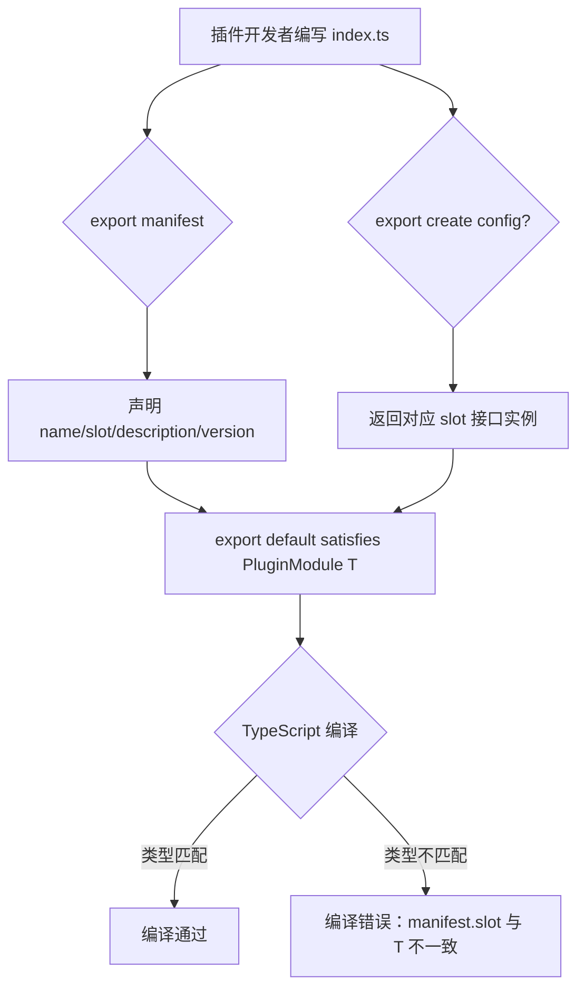
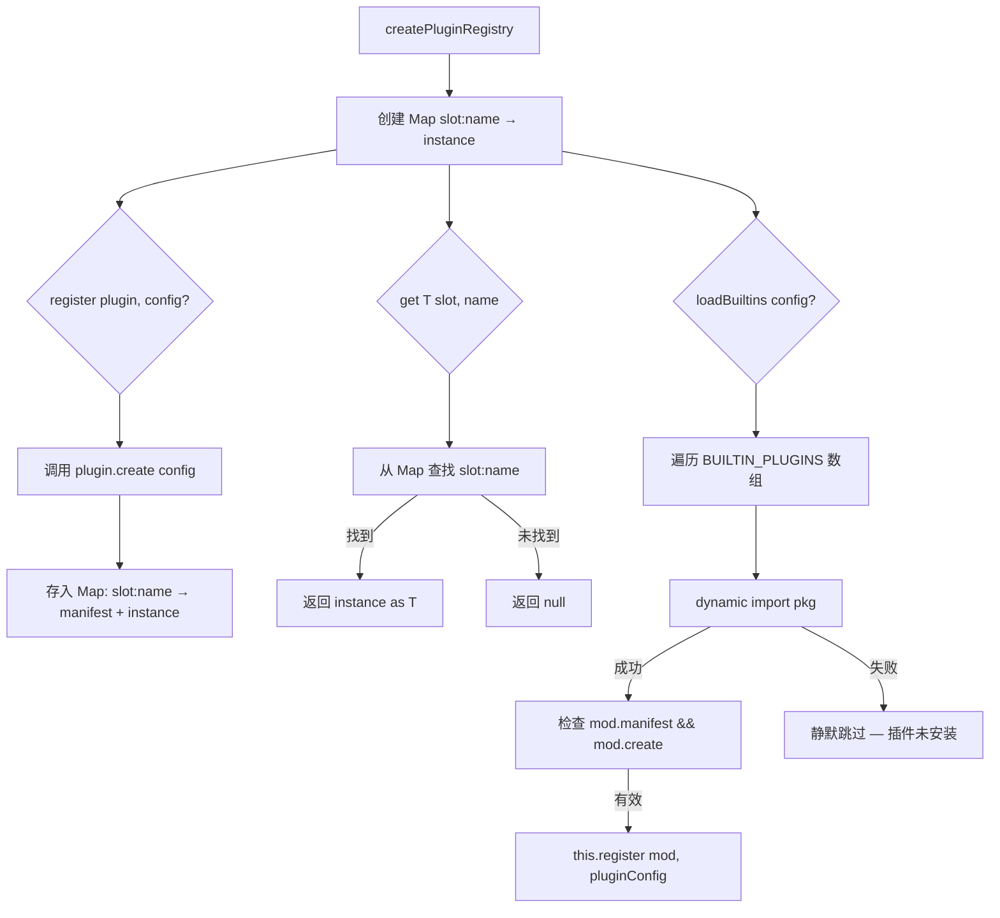

# PD-211.01 agent-orchestrator — 8 槽位 manifest+create 插件系统

> 文档编号：PD-211.01
> 来源：agent-orchestrator `packages/core/src/plugin-registry.ts`, `packages/core/src/types.ts`
> GitHub：https://github.com/ComposioHQ/agent-orchestrator.git
> 问题域：PD-211 插件架构 Plugin Architecture
> 状态：可复用方案

---

## 第 1 章 问题与动机

### 1.1 核心问题

Agent 编排系统需要同时管理多种异构组件——运行时环境（tmux/Docker/进程）、AI 代理（Claude Code/Codex/Aider）、工作空间隔离（worktree/clone）、Issue 追踪器（GitHub/Linear）、SCM 平台（GitHub/GitLab）、通知渠道（Slack/Desktop/Webhook）、终端 UI（iTerm2/Web）。这些组件的共同特征是：

1. **同一职责有多种实现**：同一个"槽位"（如 runtime）可能有 tmux、Docker、进程三种实现
2. **需要运行时可替换**：用户通过 YAML 配置选择使用哪个实现
3. **每个实现有独立的依赖**：Slack 插件依赖 webhook，tmux 插件依赖 tmux CLI
4. **缺失的插件不应阻塞启动**：未安装的插件应静默跳过

如果用硬编码 if/else 或 switch/case 来处理这些变体，代码会迅速膨胀且难以扩展。

### 1.2 agent-orchestrator 的解法概述

agent-orchestrator 设计了一套 **7 槽位（PluginSlot）+ manifest/create 标准导出** 的插件系统：

1. **类型定义先行**：在 `packages/core/src/types.ts:917-924` 定义 7 种 PluginSlot 联合类型，每种 slot 对应一个完整的 TypeScript 接口（Runtime、Agent、Workspace、Tracker、SCM、Notifier、Terminal）
2. **manifest+create 标准导出**：每个插件必须 `export manifest`（声明 name/slot/version）和 `export create(config?)`（工厂函数），最终以 `export default { manifest, create } satisfies PluginModule<T>` 导出（`types.ts:941-945`）
3. **PluginRegistry 按 slot:name 注册发现**：`plugin-registry.ts:62-119` 实现 register/get/list/loadBuiltins/loadFromConfig 五个方法，内部用 `Map<"slot:name", instance>` 存储
4. **内置插件表驱动加载**：`plugin-registry.ts:26-50` 维护 BUILTIN_PLUGINS 数组，loadBuiltins 遍历尝试 dynamic import，失败静默跳过
5. **TypeScript satisfies 编译期类型安全**：每个插件的 default export 使用 `satisfies PluginModule<T>` 确保 manifest 和 create 返回值类型正确

### 1.3 设计思想

| 设计原则 | 具体实现 | 理由 | 替代方案 |
|----------|----------|------|----------|
| 接口隔离 | 7 个独立接口（Runtime/Agent/Workspace/Tracker/SCM/Notifier/Terminal），每个 10-30 个方法 | 每种插件职责完全不同，强制统一接口会导致大量空实现 | 统一 Plugin 基类 + 方法字典（灵活但丢失类型安全） |
| 工厂模式 | `create(config?)` 返回接口实例，manifest 纯声明 | 分离元数据（manifest）和实例化（create），支持延迟创建和配置注入 | 构造函数模式（需要 new，不利于 tree-shaking） |
| 编译期类型检查 | `satisfies PluginModule<T>` | 在 export 处就捕获类型错误，不等到运行时 | 运行时 schema 校验（Zod/Joi，增加包体积） |
| 容错加载 | loadBuiltins 中 try/catch 包裹每个 import | 未安装的插件不阻塞系统启动 | 显式依赖声明（需要用户手动管理） |
| 配置驱动选择 | YAML defaults.runtime/agent/workspace + 项目级覆盖 | 用户无需改代码即可切换实现 | 环境变量（不够结构化） |

---

## 第 2 章 源码实现分析

### 2.1 架构概览

```
┌─────────────────────────────────────────────────────────────────┐
│                    agent-orchestrator.yaml                       │
│  defaults: { runtime: tmux, agent: claude-code, workspace: ... }│
└──────────────────────────┬──────────────────────────────────────┘
                           │ loadConfig()
                           ▼
┌──────────────────────────────────────────────────────────────────┐
│                     PluginRegistry                               │
│  Map<"slot:name", { manifest, instance }>                        │
│                                                                  │
│  ┌─────────┐ ┌─────────┐ ┌───────────┐ ┌─────────┐            │
│  │ runtime  │ │  agent   │ │ workspace │ │ tracker │            │
│  │ ─────── │ │ ─────── │ │ ───────── │ │ ─────── │            │
│  │ tmux     │ │ claude   │ │ worktree  │ │ github  │            │
│  │ process  │ │ codex    │ │ clone     │ │ linear  │            │
│  └─────────┘ │ aider    │ └───────────┘ └─────────┘            │
│              │ opencode  │                                       │
│              └─────────┘                                        │
│  ┌─────────┐ ┌──────────┐ ┌──────────┐                         │
│  │   scm   │ │ notifier │ │ terminal │                         │
│  │ ─────── │ │ ──────── │ │ ──────── │                         │
│  │ github  │ │ composio │ │ iterm2   │                         │
│  └─────────┘ │ desktop  │ │ web      │                         │
│              │ slack    │ └──────────┘                          │
│              │ webhook  │                                       │
│              └──────────┘                                       │
└──────────────────────────┬──────────────────────────────────────┘
                           │ registry.get<T>(slot, name)
                           ▼
┌──────────────────────────────────────────────────────────────────┐
│                    SessionManager                                │
│  resolvePlugins(project) → { runtime, agent, workspace, ... }   │
│  spawn() → workspace.create → runtime.create → agent.launch     │
└──────────────────────────────────────────────────────────────────┘
```

### 2.2 核心实现

#### 2.2.1 PluginModule 类型定义



对应源码 `packages/core/src/types.ts:926-945`：

```typescript
/** Plugin manifest — what every plugin exports */
export interface PluginManifest {
  /** Plugin name (e.g. "tmux", "claude-code", "github") */
  name: string;
  /** Which slot this plugin fills */
  slot: PluginSlot;
  /** Human-readable description */
  description: string;
  /** Version */
  version: string;
}

/** What a plugin module must export */
export interface PluginModule<T = unknown> {
  manifest: PluginManifest;
  create(config?: Record<string, unknown>): T;
}
```

每个插件的 default export 使用 `satisfies` 关键字，例如 `packages/plugins/workspace-worktree/src/index.ts:301`：

```typescript
export default { manifest, create } satisfies PluginModule<Workspace>;
```

这确保了：
- `manifest.slot` 必须是 `"workspace"`
- `create()` 的返回值必须实现 `Workspace` 接口的所有方法（create/destroy/list 等）

#### 2.2.2 PluginRegistry 实现



对应源码 `packages/core/src/plugin-registry.ts:62-119`：

```typescript
export function createPluginRegistry(): PluginRegistry {
  const plugins: PluginMap = new Map();

  return {
    register(plugin: PluginModule, config?: Record<string, unknown>): void {
      const { manifest } = plugin;
      const key = makeKey(manifest.slot, manifest.name);
      const instance = plugin.create(config);
      plugins.set(key, { manifest, instance });
    },

    get<T>(slot: PluginSlot, name: string): T | null {
      const entry = plugins.get(makeKey(slot, name));
      return entry ? (entry.instance as T) : null;
    },

    list(slot: PluginSlot): PluginManifest[] {
      const result: PluginManifest[] = [];
      for (const [key, entry] of plugins) {
        if (key.startsWith(`${slot}:`)) {
          result.push(entry.manifest);
        }
      }
      return result;
    },

    async loadBuiltins(
      orchestratorConfig?: OrchestratorConfig,
      importFn?: (pkg: string) => Promise<unknown>,
    ): Promise<void> {
      const doImport = importFn ?? ((pkg: string) => import(pkg));
      for (const builtin of BUILTIN_PLUGINS) {
        try {
          const mod = (await doImport(builtin.pkg)) as PluginModule;
          if (mod.manifest && typeof mod.create === "function") {
            const pluginConfig = orchestratorConfig
              ? extractPluginConfig(builtin.slot, builtin.name, orchestratorConfig)
              : undefined;
            this.register(mod, pluginConfig);
          }
        } catch {
          // Plugin not installed — that's fine, only load what's available
        }
      }
    },
  };
}
```

### 2.3 实现细节

#### 内置插件表（BUILTIN_PLUGINS）

`plugin-registry.ts:26-50` 维护了一个静态数组，列出所有 17 个内置插件的 slot、name 和 npm 包名：

```typescript
const BUILTIN_PLUGINS: Array<{ slot: PluginSlot; name: string; pkg: string }> = [
  { slot: "runtime", name: "tmux", pkg: "@composio/ao-plugin-runtime-tmux" },
  { slot: "runtime", name: "process", pkg: "@composio/ao-plugin-runtime-process" },
  { slot: "agent", name: "claude-code", pkg: "@composio/ao-plugin-agent-claude-code" },
  { slot: "agent", name: "codex", pkg: "@composio/ao-plugin-agent-codex" },
  { slot: "agent", name: "aider", pkg: "@composio/ao-plugin-agent-aider" },
  // ... 12 more plugins
];
```

#### 插件消费方式：resolvePlugins

`session-manager.ts:213-226` 展示了 SessionManager 如何通过 registry 解析项目所需的插件组合：

```typescript
function resolvePlugins(project: ProjectConfig, agentOverride?: string) {
  const runtime = registry.get<Runtime>("runtime", project.runtime ?? config.defaults.runtime);
  const agent = registry.get<Agent>("agent", agentOverride ?? project.agent ?? config.defaults.agent);
  const workspace = registry.get<Workspace>("workspace", project.workspace ?? config.defaults.workspace);
  const tracker = project.tracker ? registry.get<Tracker>("tracker", project.tracker.plugin) : null;
  const scm = project.scm ? registry.get<SCM>("scm", project.scm.plugin) : null;
  return { runtime, agent, workspace, tracker, scm };
}
```

这里体现了三级配置优先级：**项目级覆盖 > 全局默认 > null**。

#### 配置驱动的插件选择

`config.ts:84-89` 定义了全局默认插件：

```typescript
const DefaultPluginsSchema = z.object({
  runtime: z.string().default("tmux"),
  agent: z.string().default("claude-code"),
  workspace: z.string().default("worktree"),
  notifiers: z.array(z.string()).default(["composio", "desktop"]),
});
```

用户在 `agent-orchestrator.yaml` 中可以在项目级别覆盖：

```yaml
projects:
  my-app:
    repo: org/repo
    path: ~/my-app
    agent: codex        # 覆盖默认的 claude-code
    workspace: clone    # 覆盖默认的 worktree
```


---

## 第 3 章 迁移指南

### 3.1 迁移清单

**阶段 1：定义插件类型系统**

- [ ] 确定你的系统需要哪些"槽位"（如 storage/auth/renderer）
- [ ] 为每个槽位定义 TypeScript 接口，包含该槽位的所有方法签名
- [ ] 定义 `PluginSlot` 联合类型、`PluginManifest` 接口、`PluginModule<T>` 泛型接口
- [ ] 确保每个接口有 `readonly name: string` 字段用于运行时识别

**阶段 2：实现 PluginRegistry**

- [ ] 实现 `createPluginRegistry()` 工厂函数
- [ ] 内部用 `Map<string, { manifest, instance }>` 存储，key 为 `"slot:name"`
- [ ] 实现 register/get/list 三个核心方法
- [ ] 实现 loadBuiltins，用 try/catch 包裹每个 dynamic import

**阶段 3：编写插件**

- [ ] 每个插件 export `manifest`（name/slot/description/version）
- [ ] 每个插件 export `create(config?)` 工厂函数
- [ ] 每个插件 `export default { manifest, create } satisfies PluginModule<T>`
- [ ] 为每个插件创建独立的 npm 包（monorepo 推荐）

**阶段 4：配置集成**

- [ ] 定义 YAML/JSON 配置 schema，包含 defaults 和项目级覆盖
- [ ] 在 SessionManager 或等价消费者中实现 resolvePlugins 逻辑

### 3.2 适配代码模板

以下是一个可直接复用的最小插件系统实现：

```typescript
// === types.ts ===
export type PluginSlot = "storage" | "auth" | "renderer";

export interface PluginManifest {
  name: string;
  slot: PluginSlot;
  description: string;
  version: string;
}

export interface PluginModule<T = unknown> {
  manifest: PluginManifest;
  create(config?: Record<string, unknown>): T;
}

// === 槽位接口示例 ===
export interface Storage {
  readonly name: string;
  get(key: string): Promise<string | null>;
  set(key: string, value: string): Promise<void>;
  delete(key: string): Promise<void>;
}

// === plugin-registry.ts ===
type PluginMap = Map<string, { manifest: PluginManifest; instance: unknown }>;

export interface PluginRegistry {
  register(plugin: PluginModule, config?: Record<string, unknown>): void;
  get<T>(slot: PluginSlot, name: string): T | null;
  list(slot: PluginSlot): PluginManifest[];
  loadBuiltins(importFn?: (pkg: string) => Promise<unknown>): Promise<void>;
}

export function createPluginRegistry(
  builtins: Array<{ slot: PluginSlot; name: string; pkg: string }>
): PluginRegistry {
  const plugins: PluginMap = new Map();

  return {
    register(plugin: PluginModule, config?: Record<string, unknown>): void {
      const key = `${plugin.manifest.slot}:${plugin.manifest.name}`;
      plugins.set(key, { manifest: plugin.manifest, instance: plugin.create(config) });
    },

    get<T>(slot: PluginSlot, name: string): T | null {
      const entry = plugins.get(`${slot}:${name}`);
      return entry ? (entry.instance as T) : null;
    },

    list(slot: PluginSlot): PluginManifest[] {
      return [...plugins.entries()]
        .filter(([key]) => key.startsWith(`${slot}:`))
        .map(([, { manifest }]) => manifest);
    },

    async loadBuiltins(importFn?: (pkg: string) => Promise<unknown>): Promise<void> {
      const doImport = importFn ?? ((pkg: string) => import(pkg));
      for (const builtin of builtins) {
        try {
          const mod = (await doImport(builtin.pkg)) as PluginModule;
          if (mod.manifest && typeof mod.create === "function") {
            this.register(mod);
          }
        } catch {
          // Plugin not installed — skip silently
        }
      }
    },
  };
}

// === 插件实现示例：storage-redis ===
import type { PluginModule, Storage } from "./types";

export const manifest = {
  name: "redis",
  slot: "storage" as const,
  description: "Storage plugin: Redis",
  version: "0.1.0",
};

export function create(config?: Record<string, unknown>): Storage {
  const url = (config?.url as string) ?? "redis://localhost:6379";
  // ... 初始化 Redis 客户端
  return {
    name: "redis",
    async get(key: string) { /* ... */ return null; },
    async set(key: string, value: string) { /* ... */ },
    async delete(key: string) { /* ... */ },
  };
}

export default { manifest, create } satisfies PluginModule<Storage>;
```

### 3.3 适用场景

| 场景 | 适用度 | 说明 |
|------|--------|------|
| 多种 AI Agent 后端切换 | ⭐⭐⭐ | 完美匹配：每种 Agent 一个插件，manifest 声明 slot="agent" |
| 多云存储后端 | ⭐⭐⭐ | S3/GCS/Azure Blob 各一个插件，统一 Storage 接口 |
| 多通知渠道 | ⭐⭐⭐ | Slack/Email/Webhook 各一个插件，同时激活多个 |
| 单一实现的功能 | ⭐ | 如果某个槽位只有一种实现，插件系统是过度设计 |
| 需要插件间通信 | ⭐⭐ | 本方案不提供插件间通信机制，需额外设计事件总线 |

---

## 第 4 章 测试用例

基于 `packages/core/src/__tests__/plugin-registry.test.ts` 的真实测试模式：

```typescript
import { describe, it, expect, vi } from "vitest";
import { createPluginRegistry } from "./plugin-registry";
import type { PluginModule, PluginManifest } from "./types";

function makePlugin(slot: PluginManifest["slot"], name: string): PluginModule {
  return {
    manifest: { name, slot, description: `Test ${slot}: ${name}`, version: "0.0.1" },
    create: vi.fn((config?: Record<string, unknown>) => ({ name, _config: config })),
  };
}

describe("PluginRegistry", () => {
  // 正常路径
  it("registers and retrieves a plugin by slot:name", () => {
    const registry = createPluginRegistry();
    const plugin = makePlugin("runtime", "tmux");
    registry.register(plugin);
    const instance = registry.get<{ name: string }>("runtime", "tmux");
    expect(instance).not.toBeNull();
    expect(instance!.name).toBe("tmux");
  });

  // 配置传递
  it("passes config to plugin create()", () => {
    const registry = createPluginRegistry();
    const plugin = makePlugin("workspace", "worktree");
    registry.register(plugin, { worktreeDir: "/custom/path" });
    expect(plugin.create).toHaveBeenCalledWith({ worktreeDir: "/custom/path" });
  });

  // 边界情况：未注册的插件
  it("returns null for unregistered plugin", () => {
    const registry = createPluginRegistry();
    expect(registry.get("runtime", "nonexistent")).toBeNull();
  });

  // 边界情况：同名覆盖
  it("overwrites previously registered plugin with same slot:name", () => {
    const registry = createPluginRegistry();
    registry.register(makePlugin("runtime", "tmux"));
    registry.register(makePlugin("runtime", "tmux"));
    expect(registry.list("runtime")).toHaveLength(1);
  });

  // 降级行为：loadBuiltins 静默跳过
  it("silently skips unavailable packages in loadBuiltins", async () => {
    const registry = createPluginRegistry();
    await expect(registry.loadBuiltins()).resolves.toBeUndefined();
  });

  // 跨 slot 隔离
  it("isolates plugins across different slots", () => {
    const registry = createPluginRegistry();
    registry.register(makePlugin("runtime", "tmux"));
    registry.register(makePlugin("workspace", "worktree"));
    expect(registry.get("runtime", "worktree")).toBeNull();
    expect(registry.get("workspace", "tmux")).toBeNull();
  });

  // loadBuiltins 通过自定义 importFn
  it("loads plugins via custom importFn", async () => {
    const registry = createPluginRegistry();
    const fakePlugin = makePlugin("agent", "claude-code");
    await registry.loadBuiltins(undefined, async (pkg: string) => {
      if (pkg === "@composio/ao-plugin-agent-claude-code") return fakePlugin;
      throw new Error(`Not found: ${pkg}`);
    });
    expect(registry.get("agent", "claude-code")).not.toBeNull();
  });
});
```


---

## 第 5 章 跨域关联

| 关联域 | 关系类型 | 说明 |
|--------|----------|------|
| PD-212 会话生命周期 | 依赖 | SessionManager 通过 PluginRegistry 解析 Runtime/Agent/Workspace 插件来管理会话生命周期 |
| PD-213 事件驱动反应 | 协同 | Notifier 插件（Slack/Desktop/Webhook）是事件反应系统的输出通道 |
| PD-214 配置驱动系统 | 依赖 | YAML 配置中的 defaults.runtime/agent/workspace 决定了插件选择，Zod schema 校验配置合法性 |
| PD-215 SCM 集成 | 协同 | SCM 插件（GitHub）提供 PR 生命周期管理，是插件系统中最复杂的接口（15+ 方法） |
| PD-216 通知路由 | 协同 | 通知路由按 EventPriority 将事件分发到不同 Notifier 插件，支持同时激活多个通知渠道 |
| PD-04 工具系统 | 类比 | 插件系统与工具系统的区别：插件是系统级组件（运行时替换），工具是 Agent 级能力（任务时调用） |

---

## 第 6 章 来源文件索引

| 文件 | 行范围 | 关键实现 |
|------|--------|----------|
| `packages/core/src/types.ts` | L917-L945 | PluginSlot 联合类型、PluginManifest、PluginModule<T> 泛型接口定义 |
| `packages/core/src/types.ts` | L197-L220 | Runtime 接口（7 个方法：create/destroy/sendMessage/getOutput/isAlive/getMetrics/getAttachInfo） |
| `packages/core/src/types.ts` | L262-L316 | Agent 接口（10 个方法，含 getActivityState/setupWorkspaceHooks 等） |
| `packages/core/src/types.ts` | L379-L399 | Workspace 接口（5 个方法：create/destroy/list/postCreate/exists/restore） |
| `packages/core/src/types.ts` | L422-L451 | Tracker 接口（8 个方法：getIssue/isCompleted/branchName/generatePrompt 等） |
| `packages/core/src/types.ts` | L494-L545 | SCM 接口（12 个方法：detectPR/getPRState/mergePR/getCIChecks/getReviews 等） |
| `packages/core/src/types.ts` | L645-L656 | Notifier 接口（3 个方法：notify/notifyWithActions/post） |
| `packages/core/src/types.ts` | L679-L690 | Terminal 接口（3 个方法：openSession/openAll/isSessionOpen） |
| `packages/core/src/plugin-registry.ts` | L26-L50 | BUILTIN_PLUGINS 静态数组（17 个内置插件声明） |
| `packages/core/src/plugin-registry.ts` | L62-L119 | createPluginRegistry 工厂函数（register/get/list/loadBuiltins/loadFromConfig） |
| `packages/plugins/workspace-worktree/src/index.ts` | L19-L24 | manifest 声明示例（name/slot/description/version） |
| `packages/plugins/workspace-worktree/src/index.ts` | L49-L298 | create() 工厂函数实现（返回 Workspace 接口实例） |
| `packages/plugins/workspace-worktree/src/index.ts` | L301 | `satisfies PluginModule<Workspace>` 编译期类型检查 |
| `packages/plugins/agent-claude-code/src/index.ts` | L173-L178 | Agent 插件 manifest 声明 |
| `packages/plugins/agent-claude-code/src/index.ts` | L781-L785 | Agent 插件 create + satisfies 导出 |
| `packages/plugins/notifier-slack/src/index.ts` | L11-L17 | Notifier 插件 manifest 声明 |
| `packages/plugins/notifier-slack/src/index.ts` | L133-L188 | Notifier 插件 create 实现（配置注入 webhookUrl） |
| `packages/core/src/config.ts` | L84-L89 | DefaultPluginsSchema（Zod 校验默认插件选择） |
| `packages/core/src/session-manager.ts` | L213-L226 | resolvePlugins（三级优先级解析插件组合） |
| `packages/core/src/__tests__/plugin-registry.test.ts` | L1-L200 | 完整的 PluginRegistry 单元测试 |

---

## 第 7 章 横向对比维度

```json comparison_data
{
  "project": "agent-orchestrator",
  "dimensions": {
    "插件接口": "7 种独立 TypeScript 接口，每种 3-15 个方法，接口隔离彻底",
    "注册机制": "Map<slot:name> 注册表 + BUILTIN_PLUGINS 静态数组驱动 dynamic import",
    "类型安全": "satisfies PluginModule<T> 编译期检查 + 泛型 get<T>(slot, name)",
    "配置传递": "YAML defaults + 项目级覆盖，create(config?) 工厂注入",
    "容错加载": "loadBuiltins try/catch 逐个 import，未安装插件静默跳过",
    "插件规模": "17 个内置插件覆盖 7 个槽位，monorepo 独立包发布",
    "热更新": "不支持运行时热更新，启动时一次性加载"
  }
}
```

### 域元数据补充

```json domain_metadata
{
  "solution_summary": "agent-orchestrator 用 7 种 PluginSlot 联合类型 + manifest/create 标准导出 + satisfies 编译期检查，实现 17 个内置插件的 slot:name 注册发现与 YAML 配置驱动选择",
  "description": "插件系统需要平衡类型安全、容错加载和配置驱动的运行时选择",
  "sub_problems": [
    "插件容错加载与缺失插件静默降级",
    "内置插件表驱动发现与 npm 包动态导入",
    "插件消费侧的三级优先级解析（项目级>全局默认>null）"
  ],
  "best_practices": [
    "loadBuiltins 逐个 try/catch 确保单个插件失败不阻塞系统启动",
    "用 BUILTIN_PLUGINS 静态数组集中管理内置插件映射关系",
    "插件消费侧用 resolvePlugins 封装三级优先级解析逻辑"
  ]
}
```

