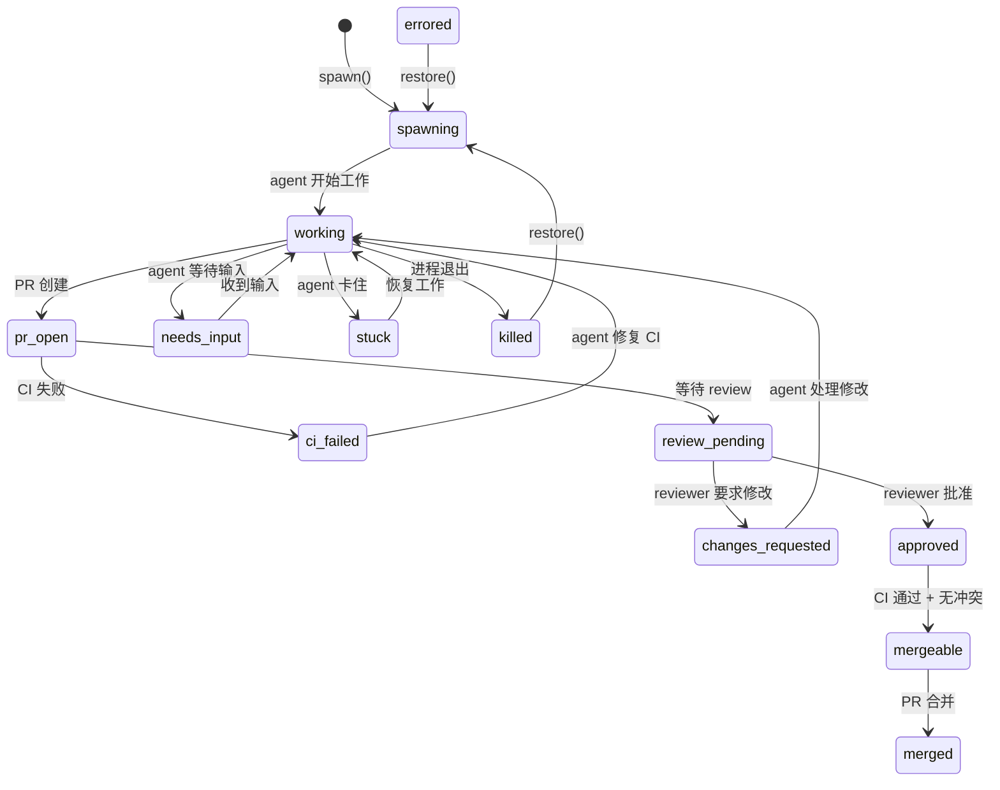
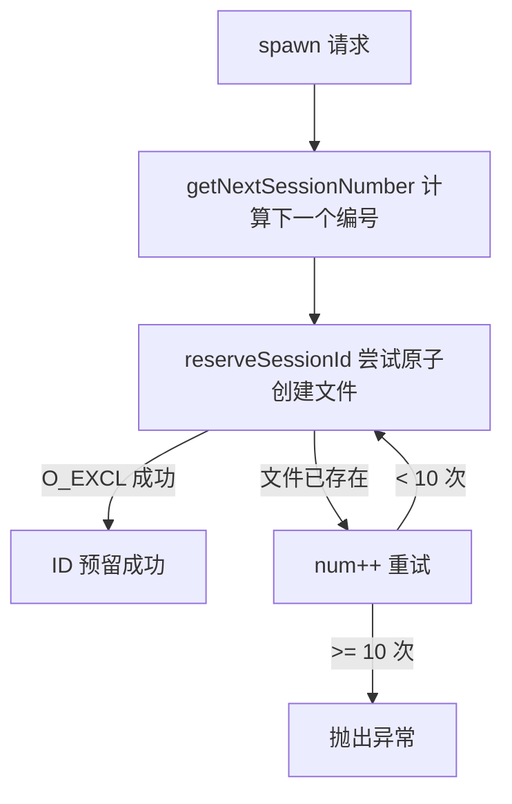
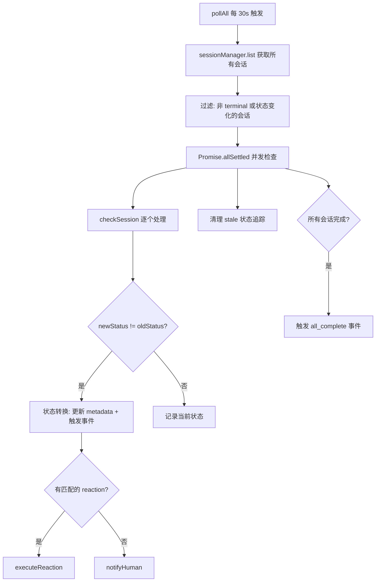
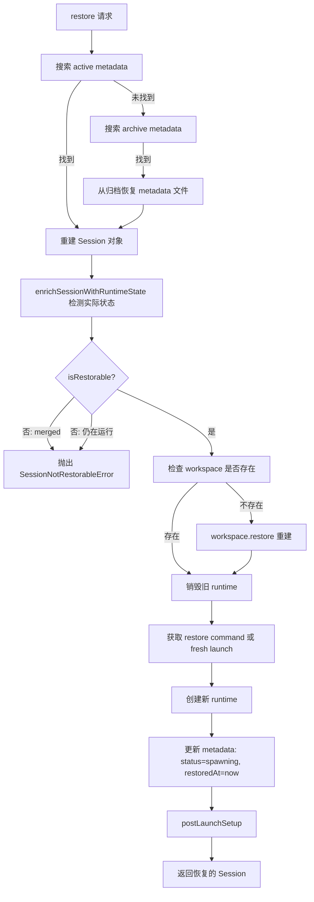

# PD-212.01 agent-orchestrator — 会话生命周期状态机与轮询驱动管理

> 文档编号：PD-212.01
> 来源：agent-orchestrator `packages/core/src/session-manager.ts`, `packages/core/src/lifecycle-manager.ts`, `packages/core/src/metadata.ts`
> GitHub：https://github.com/ComposioHQ/agent-orchestrator.git
> 问题域：PD-212 会话生命周期管理 Session Lifecycle Management
> 状态：可复用方案

---

## 第 1 章 问题与动机

### 1.1 核心问题

多 Agent 编排系统中，每个 Agent 会话从创建到完成经历多个阶段：spawn（启动）→ working（工作中）→ pr_open（PR 已创建）→ review（审查中）→ merged（已合并）。这些阶段涉及多个外部系统（Git、CI、Code Review 平台），状态转换需要可靠检测和自动响应。

核心挑战：
1. **状态爆炸**：会话可能处于 16 种状态中的任意一种，包括正常流程和异常状态（stuck、errored、killed）
2. **并发冲突**：多个 spawn 请求可能同时竞争同一个 session ID
3. **崩溃恢复**：Agent 进程崩溃后需要恢复到之前的工作状态
4. **外部系统轮询**：PR 状态、CI 结果、Review 决策都需要主动轮询外部 API
5. **自动反应**：某些状态转换需要自动触发动作（如 CI 失败时通知 Agent 修复）

### 1.2 agent-orchestrator 的解法概述

agent-orchestrator 采用三层架构解决会话生命周期管理：

1. **SessionManager（CRUD 层）**：负责会话的创建、列举、销毁、恢复，使用 `O_EXCL` 原子文件创建防止并发 ID 冲突（`metadata.ts:268`）
2. **LifecycleManager（状态机 + 轮询引擎）**：30 秒间隔轮询所有活跃会话，通过插件系统检测 Runtime 存活、Agent 活跃度、PR/CI/Review 状态，驱动状态转换（`lifecycle-manager.ts:182-289`）
3. **Metadata（持久化层）**：flat-file key=value 格式存储会话元数据，兼容 bash 脚本，支持原子预留和归档（`metadata.ts:42-274`）

### 1.3 设计思想

| 设计原则 | 具体实现 | 理由 | 替代方案 |
|----------|----------|------|----------|
| 原子 ID 预留 | `O_EXCL` flag 创建文件 | 无需数据库即可防并发冲突 | Redis SETNX、数据库自增 ID |
| 轮询驱动状态机 | 30s `setInterval` + `determineStatus()` | 外部系统（GitHub API）无 webhook 保证，轮询最可靠 | WebSocket 订阅、Webhook 回调 |
| 插件化状态检测 | Runtime/Agent/SCM 三层探测链 | 不同 Agent（Claude/Codex/Aider）检测方式不同 | 硬编码检测逻辑 |
| flat-file 元数据 | key=value 纯文本文件 | bash 脚本可直接 source，无需 JSON 解析器 | SQLite、JSON 文件 |
| 反应式升级 | retry + escalateAfter 自动升级到人工通知 | 自动修复失败时不能无限重试 | 固定重试次数、无升级机制 |
| 归档而非删除 | `deleteMetadata` 默认 archive=true | 支持从归档恢复已 kill 的会话 | 直接删除、软删除标记 |

---

## 第 2 章 源码实现分析

### 2.1 架构概览

agent-orchestrator 的会话生命周期由三个核心模块协作管理：

```
┌─────────────────────────────────────────────────────────────────┐
│                      CLI / Web API                              │
│  ao spawn / ao kill / ao restore / ao status                    │
└──────────────┬──────────────────────────────────┬───────────────┘
               │                                  │
               ▼                                  ▼
┌──────────────────────────┐    ┌──────────────────────────────┐
│     SessionManager       │    │     LifecycleManager         │
│  ─────────────────────   │    │  ──────────────────────────  │
│  spawn()  → 创建会话     │◄──►│  pollAll() → 30s 轮询       │
│  list()   → 列举会话     │    │  determineStatus() → 状态检测│
│  kill()   → 销毁会话     │    │  executeReaction() → 自动反应│
│  restore()→ 恢复会话     │    │  checkSession() → 转换检测   │
│  send()   → 发送消息     │    │  notifyHuman() → 通知升级    │
└──────────┬───────────────┘    └──────────────┬───────────────┘
           │                                   │
           ▼                                   ▼
┌──────────────────────────────────────────────────────────────┐
│                    Metadata (flat-file)                       │
│  ──────────────────────────────────────────────────────────  │
│  reserveSessionId() → O_EXCL 原子预留                        │
│  writeMetadata()    → 全量写入 key=value                     │
│  updateMetadata()   → 增量合并更新                           │
│  deleteMetadata()   → 归档 + 删除                            │
│  readArchivedMetadataRaw() → 从归档读取                      │
└──────────────────────────────────────────────────────────────┘
           │
           ▼
┌──────────────────────────────────────────────────────────────┐
│  ~/.agent-orchestrator/{hash}-{projectId}/sessions/          │
│    int-1          ← key=value 元数据文件                     │
│    int-2                                                     │
│    archive/                                                  │
│      int-1_2024-01-15T10-30-00-000Z  ← 归档副本             │
└──────────────────────────────────────────────────────────────┘
```

16 态状态机的完整转换图：



### 2.2 核心实现

#### 2.2.1 原子 Session ID 预留



对应源码 `packages/core/src/metadata.ts:264-274`：

```typescript
export function reserveSessionId(dataDir: string, sessionId: SessionId): boolean {
  const path = metadataPath(dataDir, sessionId);
  mkdirSync(dirname(path), { recursive: true });
  try {
    const fd = openSync(path, constants.O_WRONLY | constants.O_CREAT | constants.O_EXCL);
    closeSync(fd);
    return true;
  } catch {
    return false;
  }
}
```

调用方在 `session-manager.ts:366-383` 中使用循环 + 递增编号实现无锁并发安全：

```typescript
let num = getNextSessionNumber(existingSessions, project.sessionPrefix);
let sessionId: string;
for (let attempts = 0; attempts < 10; attempts++) {
  sessionId = `${project.sessionPrefix}-${num}`;
  if (reserveSessionId(sessionsDir, sessionId)) break;
  num++;
  if (attempts === 9) {
    throw new Error(
      `Failed to reserve session ID after 10 attempts (prefix: ${project.sessionPrefix})`,
    );
  }
}
```

#### 2.2.2 轮询驱动状态检测



对应源码 `packages/core/src/lifecycle-manager.ts:182-289`，`determineStatus` 实现了 5 层探测链：

```typescript
async function determineStatus(session: Session): Promise<SessionStatus> {
  // 1. Check if runtime is alive
  if (session.runtimeHandle) {
    const alive = await runtime.isAlive(session.runtimeHandle).catch(() => true);
    if (!alive) return "killed";
  }

  // 2. Check agent activity via terminal output + process liveness
  if (agent && session.runtimeHandle) {
    const activity = agent.detectActivity(terminalOutput);
    if (activity === "waiting_input") return "needs_input";
    const processAlive = await agent.isProcessRunning(session.runtimeHandle);
    if (!processAlive) return "killed";
  }

  // 3. Auto-detect PR by branch if metadata.pr is missing
  if (!session.pr && scm && session.branch) {
    const detectedPR = await scm.detectPR(session, project);
    if (detectedPR) session.pr = detectedPR;
  }

  // 4. Check PR state if PR exists (merged/closed/ci/review)
  if (session.pr && scm) {
    const prState = await scm.getPRState(session.pr);
    if (prState === PR_STATE.MERGED) return "merged";
    // ... CI, review checks
  }

  // 5. Default: if agent is active, it's working
  return session.status;
}
```

#### 2.2.3 会话恢复流程



对应源码 `session-manager.ts:920-1107`，关键的恢复判断逻辑在 `types.ts:121-126`：

```typescript
export function isRestorable(session: {
  status: SessionStatus;
  activity: ActivityState | null;
}): boolean {
  return isTerminalSession(session) && !NON_RESTORABLE_STATUSES.has(session.status);
}
```

### 2.3 实现细节

**反应式升级机制**（`lifecycle-manager.ts:292-416`）：

每个 reaction 有独立的 `ReactionTracker`，记录尝试次数和首次触发时间。升级条件支持两种模式：
- 次数阈值：`retries: 3` → 第 4 次自动升级到人工通知
- 时间阈值：`escalateAfter: "10m"` → 超过 10 分钟自动升级

反应动作类型：
- `send-to-agent`：向 Agent 发送修复指令（如 CI 失败时发送修复提示）
- `notify`：直接通知人类
- `auto-merge`：自动合并 PR

**重入保护**（`lifecycle-manager.ts:178,526-527`）：

```typescript
let polling = false; // re-entrancy guard
async function pollAll(): Promise<void> {
  if (polling) return;
  polling = true;
  try { /* ... */ } finally { polling = false; }
}
```

**元数据格式兼容性**（`metadata.ts:42-54`）：

flat-file 使用 `key=value` 格式，bash 脚本可直接 `source` 读取，无需 JSON 解析。这是向后兼容设计——agent-orchestrator 最初由 bash 脚本实现，TypeScript 重写后保持了文件格式。

**会话列举性能优化**（`session-manager.ts:710-711`）：

```typescript
const enrichTimeout = new Promise<void>((resolve) => setTimeout(resolve, 2_000));
await Promise.race([ensureHandleAndEnrich(session, ...), enrichTimeout]);
```

每个会话的 runtime 探测限时 2 秒，防止 tmux/ps 子进程调用在高负载下阻塞整个列举操作。

---

## 第 3 章 迁移指南

### 3.1 迁移清单

**阶段 1：核心状态机（最小可用）**

- [ ] 定义 `SessionStatus` 联合类型（至少包含 spawning/working/killed/done 4 态）
- [ ] 实现 `reserveSessionId()` 原子 ID 预留（使用 `O_EXCL` 或等效机制）
- [ ] 实现 `SessionManager.spawn()` 创建会话（workspace → runtime → agent 三步）
- [ ] 实现 flat-file metadata 读写（key=value 格式）
- [ ] 实现 `SessionManager.kill()` 销毁会话（反向清理：agent → runtime → workspace）

**阶段 2：轮询驱动状态检测**

- [ ] 实现 `LifecycleManager.pollAll()` 定时轮询
- [ ] 实现 `determineStatus()` 多层探测链（runtime → agent → SCM）
- [ ] 实现状态转换检测和事件发射
- [ ] 添加重入保护（`polling` flag）

**阶段 3：反应引擎 + 恢复**

- [ ] 实现 `ReactionTracker` 重试计数和时间追踪
- [ ] 实现 `executeReaction()` 三种动作类型
- [ ] 实现 `SessionManager.restore()` 从归档恢复
- [ ] 实现 `isRestorable()` 恢复条件判断

### 3.2 适配代码模板

以下是一个可直接运行的最小会话管理器实现（TypeScript）：

```typescript
import { openSync, closeSync, constants, mkdirSync, readFileSync,
         writeFileSync, existsSync, unlinkSync } from "node:fs";
import { join, dirname } from "node:path";

// --- 状态定义 ---
type SessionStatus = "spawning" | "working" | "pr_open" | "ci_failed"
  | "review_pending" | "approved" | "merged" | "killed" | "stuck" | "errored";

const TERMINAL_STATUSES = new Set<SessionStatus>(["merged", "killed", "errored"]);

interface Session {
  id: string;
  status: SessionStatus;
  branch: string | null;
  workspacePath: string | null;
  metadata: Record<string, string>;
  createdAt: Date;
}

// --- 原子 ID 预留 ---
function reserveSessionId(dataDir: string, sessionId: string): boolean {
  const path = join(dataDir, sessionId);
  mkdirSync(dirname(path), { recursive: true });
  try {
    const fd = openSync(path, constants.O_WRONLY | constants.O_CREAT | constants.O_EXCL);
    closeSync(fd);
    return true;
  } catch {
    return false;
  }
}

// --- Metadata 读写 ---
function parseMetadata(content: string): Record<string, string> {
  const result: Record<string, string> = {};
  for (const line of content.split("\n")) {
    const trimmed = line.trim();
    if (!trimmed || trimmed.startsWith("#")) continue;
    const eqIdx = trimmed.indexOf("=");
    if (eqIdx === -1) continue;
    result[trimmed.slice(0, eqIdx).trim()] = trimmed.slice(eqIdx + 1).trim();
  }
  return result;
}

function writeMetadata(dataDir: string, id: string, data: Record<string, string>): void {
  const path = join(dataDir, id);
  mkdirSync(dirname(path), { recursive: true });
  const content = Object.entries(data)
    .filter(([, v]) => v !== undefined && v !== "")
    .map(([k, v]) => `${k}=${v}`)
    .join("\n") + "\n";
  writeFileSync(path, content, "utf-8");
}

function updateMetadata(dataDir: string, id: string, updates: Record<string, string>): void {
  const path = join(dataDir, id);
  let existing: Record<string, string> = {};
  if (existsSync(path)) {
    existing = parseMetadata(readFileSync(path, "utf-8"));
  }
  for (const [key, value] of Object.entries(updates)) {
    if (value === "") { delete existing[key]; } else { existing[key] = value; }
  }
  writeMetadata(dataDir, id, existing);
}

// --- Spawn 流程 ---
function spawn(dataDir: string, prefix: string): Session {
  let num = 1;
  let sessionId: string;
  for (let attempts = 0; attempts < 10; attempts++) {
    sessionId = `${prefix}-${num}`;
    if (reserveSessionId(dataDir, sessionId!)) break;
    num++;
    if (attempts === 9) throw new Error("Failed to reserve session ID");
  }
  sessionId = `${prefix}-${num}`;

  writeMetadata(dataDir, sessionId, {
    status: "spawning",
    createdAt: new Date().toISOString(),
  });

  return {
    id: sessionId,
    status: "spawning",
    branch: null,
    workspacePath: null,
    metadata: {},
    createdAt: new Date(),
  };
}

// --- 轮询状态机 ---
class LifecyclePoller {
  private states = new Map<string, SessionStatus>();
  private polling = false;
  private timer: ReturnType<typeof setInterval> | null = null;

  start(intervalMs = 30_000): void {
    if (this.timer) return;
    this.timer = setInterval(() => void this.pollAll(), intervalMs);
    void this.pollAll();
  }

  stop(): void {
    if (this.timer) { clearInterval(this.timer); this.timer = null; }
  }

  private async pollAll(): Promise<void> {
    if (this.polling) return; // 重入保护
    this.polling = true;
    try {
      // 获取所有会话，检测状态变化，触发事件
      // ... 实现 determineStatus + checkSession 逻辑
    } finally {
      this.polling = false;
    }
  }
}
```

### 3.3 适用场景

| 场景 | 适用度 | 说明 |
|------|--------|------|
| 多 Agent 并行编排系统 | ⭐⭐⭐ | 核心场景：管理多个 Agent 会话的完整生命周期 |
| CI/CD Pipeline 状态追踪 | ⭐⭐⭐ | PR→CI→Review→Merge 流程与 CI/CD 高度匹配 |
| 长时间运行的后台任务管理 | ⭐⭐ | 状态机和恢复机制适用，但轮询间隔需调整 |
| 短生命周期的请求-响应系统 | ⭐ | 过度设计，简单的 Promise 即可 |
| 分布式多节点 Agent 系统 | ⭐ | flat-file 不支持跨节点，需替换为分布式存储 |

---

## 第 4 章 测试用例

```typescript
import { describe, it, expect, beforeEach, afterEach } from "vitest";
import { mkdtempSync, rmSync, existsSync, readFileSync } from "node:fs";
import { join } from "node:path";
import { tmpdir } from "node:os";

// 测试基于 metadata.ts 的真实函数签名

describe("reserveSessionId", () => {
  let dataDir: string;

  beforeEach(() => {
    dataDir = mkdtempSync(join(tmpdir(), "session-test-"));
  });

  afterEach(() => {
    rmSync(dataDir, { recursive: true, force: true });
  });

  it("should reserve a new session ID atomically", () => {
    // reserveSessionId(dataDir, sessionId): boolean
    const result = reserveSessionId(dataDir, "app-1");
    expect(result).toBe(true);
    expect(existsSync(join(dataDir, "app-1"))).toBe(true);
  });

  it("should reject duplicate session ID", () => {
    reserveSessionId(dataDir, "app-1");
    const result = reserveSessionId(dataDir, "app-1");
    expect(result).toBe(false);
  });

  it("should handle concurrent reservations safely", async () => {
    // 模拟并发：10 个 Promise 同时尝试预留同一 ID
    const results = await Promise.all(
      Array.from({ length: 10 }, () =>
        Promise.resolve(reserveSessionId(dataDir, "app-1"))
      )
    );
    const successes = results.filter(Boolean);
    expect(successes.length).toBe(1); // 只有一个成功
  });
});

describe("metadata read/write", () => {
  let dataDir: string;

  beforeEach(() => {
    dataDir = mkdtempSync(join(tmpdir(), "metadata-test-"));
  });

  afterEach(() => {
    rmSync(dataDir, { recursive: true, force: true });
  });

  it("should write and read key=value metadata", () => {
    writeMetadata(dataDir, "app-1", {
      worktree: "/tmp/worktree",
      branch: "feat/test",
      status: "working",
    });
    const content = readFileSync(join(dataDir, "app-1"), "utf-8");
    expect(content).toContain("worktree=/tmp/worktree");
    expect(content).toContain("branch=feat/test");
    expect(content).toContain("status=working");
  });

  it("should merge updates without losing existing fields", () => {
    writeMetadata(dataDir, "app-1", {
      status: "spawning",
      branch: "feat/test",
    });
    updateMetadata(dataDir, "app-1", { status: "working", pr: "https://github.com/org/repo/pull/42" });
    const content = readFileSync(join(dataDir, "app-1"), "utf-8");
    expect(content).toContain("status=working");
    expect(content).toContain("branch=feat/test"); // 保留
    expect(content).toContain("pr=https://github.com/org/repo/pull/42"); // 新增
  });

  it("should archive metadata on delete", () => {
    writeMetadata(dataDir, "app-1", { status: "killed" });
    deleteMetadata(dataDir, "app-1", true);
    expect(existsSync(join(dataDir, "app-1"))).toBe(false);
    expect(existsSync(join(dataDir, "archive"))).toBe(true);
  });
});

describe("session status validation", () => {
  it("should normalize 'starting' to 'working'", () => {
    // validateStatus(raw): SessionStatus
    expect(validateStatus("starting")).toBe("working");
  });

  it("should default unknown status to 'spawning'", () => {
    expect(validateStatus("invalid_status")).toBe("spawning");
    expect(validateStatus(undefined)).toBe("spawning");
  });

  it("should accept all 16 valid statuses", () => {
    const validStatuses = [
      "spawning", "working", "pr_open", "ci_failed", "review_pending",
      "changes_requested", "approved", "mergeable", "merged", "cleanup",
      "needs_input", "stuck", "errored", "killed", "done", "terminated",
    ];
    for (const status of validStatuses) {
      expect(validateStatus(status)).toBe(status);
    }
  });
});

describe("isRestorable", () => {
  it("should allow restoring killed sessions", () => {
    expect(isRestorable({ status: "killed", activity: "exited" })).toBe(true);
  });

  it("should reject restoring merged sessions", () => {
    expect(isRestorable({ status: "merged", activity: "exited" })).toBe(false);
  });

  it("should reject restoring active sessions", () => {
    expect(isRestorable({ status: "working", activity: "active" })).toBe(false);
  });
});
```

---

## 第 5 章 跨域关联

| 关联域 | 关系类型 | 说明 |
|--------|----------|------|
| PD-02 多 Agent 编排 | 依赖 | SessionManager 是编排系统的基础设施，每个编排的 Agent 对应一个 Session |
| PD-03 容错与重试 | 协同 | LifecycleManager 的 ReactionTracker 实现了 retry + escalate 容错模式 |
| PD-04 工具系统 | 协同 | Agent 插件接口（getLaunchCommand/detectActivity）是工具系统的一部分 |
| PD-06 记忆持久化 | 协同 | flat-file metadata 是会话记忆的持久化载体，支持崩溃恢复 |
| PD-09 Human-in-the-Loop | 依赖 | needs_input 状态和 notifyHuman 机制实现了人机交互循环 |
| PD-11 可观测性 | 协同 | 事件系统（OrchestratorEvent）提供了会话状态变化的可观测性 |
| PD-209 Agent 活跃度检测 | 依赖 | determineStatus 中的 agent.detectActivity 和 agent.getActivityState 是活跃度检测的消费者 |
| PD-213 事件驱动反应 | 协同 | LifecycleManager 的 reaction 引擎是事件驱动反应系统的核心实现 |

---

## 第 6 章 来源文件索引

| 文件 | 行范围 | 关键实现 |
|------|--------|----------|
| `packages/core/src/session-manager.ts` | L1-L1111 | SessionManager 完整实现：spawn/list/get/kill/restore/send |
| `packages/core/src/session-manager.ts` | L315-L559 | spawn() 完整流程：ID 预留→workspace→runtime→metadata |
| `packages/core/src/session-manager.ts` | L920-L1107 | restore() 10 步恢复流程：archive 查找→workspace 重建→runtime 重启 |
| `packages/core/src/session-manager.ts` | L253-L256 | TERMINAL_SESSION_STATUSES 定义 |
| `packages/core/src/lifecycle-manager.ts` | L1-L607 | LifecycleManager 完整实现：轮询+状态机+反应引擎 |
| `packages/core/src/lifecycle-manager.ts` | L182-L289 | determineStatus() 5 层探测链 |
| `packages/core/src/lifecycle-manager.ts` | L292-L416 | executeReaction() 反应执行+升级逻辑 |
| `packages/core/src/lifecycle-manager.ts` | L436-L521 | checkSession() 状态转换检测+事件分发 |
| `packages/core/src/lifecycle-manager.ts` | L524-L580 | pollAll() 轮询主循环+重入保护+stale 清理 |
| `packages/core/src/metadata.ts` | L1-L274 | flat-file 元数据 CRUD：parse/serialize/reserve/archive |
| `packages/core/src/metadata.ts` | L264-L274 | reserveSessionId() O_EXCL 原子预留 |
| `packages/core/src/metadata.ts` | L191-L204 | deleteMetadata() 归档+删除 |
| `packages/core/src/metadata.ts` | L211-L240 | readArchivedMetadataRaw() 从归档读取最新版本 |
| `packages/core/src/types.ts` | L26-L42 | SessionStatus 16 态联合类型定义 |
| `packages/core/src/types.ts` | L94-L101 | TERMINAL_STATUSES 终态集合 |
| `packages/core/src/types.ts` | L107 | NON_RESTORABLE_STATUSES（merged 不可恢复） |
| `packages/core/src/types.ts` | L121-L126 | isRestorable() 恢复条件判断 |
| `packages/core/src/types.ts` | L129-L171 | Session 接口完整定义 |
| `packages/core/src/types.ts` | L982-L991 | SessionManager 接口定义 |
| `packages/core/src/types.ts` | L999-L1012 | LifecycleManager 接口定义 |
| `packages/core/src/paths.ts` | L84-L95 | getProjectBaseDir/getSessionsDir 路径生成 |
| `packages/core/src/paths.ts` | L130-L138 | generateTmuxName 全局唯一 tmux 名称 |

---

## 第 7 章 横向对比维度

```json comparison_data
{
  "project": "agent-orchestrator",
  "dimensions": {
    "状态机规模": "16 态完整状态机，覆盖 spawn→working→PR→CI→review→merge 全流程",
    "状态检测方式": "30s 轮询 + 5 层探测链（runtime→agent→PR auto-detect→SCM→default）",
    "并发 ID 分配": "O_EXCL 原子文件创建 + 递增编号 + 10 次重试上限",
    "恢复机制": "10 步恢复流程：archive 查找→workspace 重建→runtime 重启→metadata 更新",
    "元数据存储": "flat-file key=value 格式，兼容 bash source，支持归档和增量更新",
    "反应引擎": "retry 计数 + 时间阈值双模式升级，3 种动作类型（send-to-agent/notify/auto-merge）"
  }
}
```

### 域元数据补充

```json domain_metadata
{
  "solution_summary": "agent-orchestrator 用 16 态状态机 + 30s 轮询 5 层探测链 + O_EXCL 原子 ID 预留 + flat-file 归档实现完整会话生命周期管理",
  "description": "会话从 spawn 到 merge 的全流程状态追踪、自动反应与崩溃恢复",
  "sub_problems": [
    "轮询驱动的多层外部系统状态探测",
    "反应式自动升级（retry→escalate→human）",
    "归档元数据的版本化恢复"
  ],
  "best_practices": [
    "5 层探测链按优先级短路：runtime→agent→PR auto-detect→SCM→default",
    "flat-file key=value 格式兼容 bash source 实现跨语言互操作",
    "会话列举限时 2s 防止子进程探测阻塞全局",
    "反应追踪器按 sessionId:reactionKey 隔离，状态转换时自动重置"
  ]
}
```
