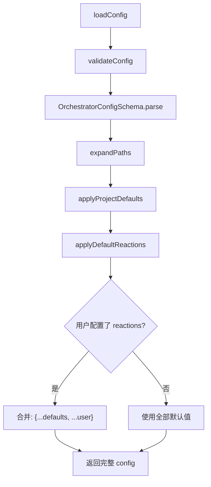
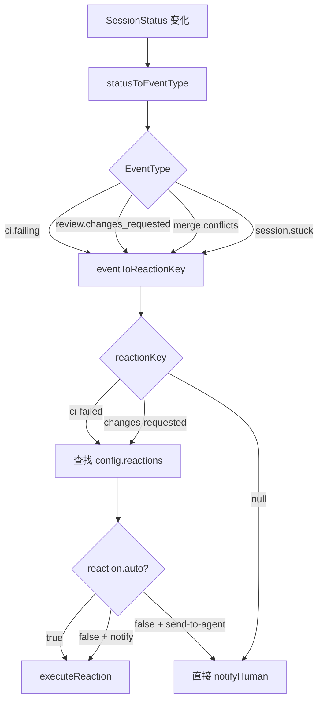
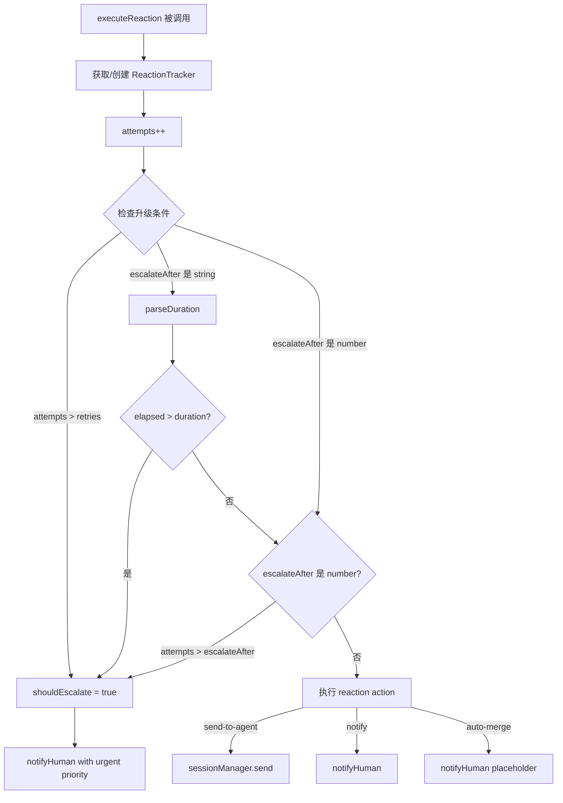

# PD-213.01 agent-orchestrator — 配置驱动的事件反应引擎

> 文档编号：PD-213.01
> 来源：agent-orchestrator `packages/core/src/lifecycle-manager.ts`, `packages/core/src/config.ts`, `packages/core/src/types.ts`
> GitHub：https://github.com/ComposioHQ/agent-orchestrator.git
> 问题域：PD-213 事件驱动反应系统 Event-Driven Reaction System
> 状态：可复用方案

---

## 第 1 章 问题与动机

### 1.1 核心问题

在多 Agent 编排系统中，Agent 会话的生命周期会产生大量事件：CI 失败、代码审查请求变更、合并冲突、Agent 卡住等。如果每个事件都需要人类手动介入，编排系统的自动化价值就大打折扣。

核心挑战：
- **事件种类多样**：9 种以上事件类型，每种需要不同的处理策略
- **处理策略分层**：有些事件应自动发给 Agent 修复（如 CI 失败），有些应通知人类（如 Agent 卡住）
- **升级机制**：自动处理失败后需要升级到人类通知，但不能立即升级（给 Agent 重试机会）
- **配置灵活性**：全局默认 + 项目级覆盖，不同项目对同一事件可能有不同策略

### 1.2 agent-orchestrator 的解法概述

agent-orchestrator 实现了一个完整的事件反应引擎，核心设计：

1. **声明式反应配置**：在 YAML 中用 `reactions` 字段定义 9 种事件到动作的映射，每种反应有 `auto`、`action`、`message`、`retries`、`escalateAfter` 等参数（`config.ts:25-34`）
2. **双策略升级机制**：支持 count-based（重试 N 次后升级）和 duration-based（超过 M 分钟后升级）两种升级策略，通过 `escalateAfter` 字段的类型（number | string）区分（`lifecycle-manager.ts:310-326`）
3. **状态转换驱动反应**：LifecycleManager 轮询检测状态转换，转换时查找对应的 reaction 配置并执行（`lifecycle-manager.ts:436-521`）
4. **全局默认 + 项目覆盖**：`applyDefaultReactions()` 提供 9 种事件的合理默认值，项目级 `reactions` 字段可覆盖任意参数（`config.ts:215-278`）
5. **ReactionTracker 状态追踪**：用 `Map<string, ReactionTracker>` 追踪每个 session:reactionKey 的重试次数和首次触发时间（`lifecycle-manager.ts:166-169`）

### 1.3 设计思想

| 设计原则 | 具体实现 | 理由 | 替代方案 |
|----------|----------|------|----------|
| 声明式配置 | YAML reactions 字段 + Zod schema 验证 | 非开发者也能调整反应策略 | 硬编码 if-else 链 |
| 双模式升级 | escalateAfter 支持 number（次数）和 string（时长如 "30m"） | 不同事件适合不同升级策略 | 只支持次数 |
| 状态机驱动 | 轮询检测 SessionStatus 转换触发反应 | 解耦事件检测与反应执行 | 事件总线 pub/sub |
| 合理默认值 | 9 种事件预设默认反应 | 零配置即可用 | 要求用户手动配置所有反应 |
| 通知抑制 | reaction 处理的事件不再重复通知人类 | 避免 send-to-agent 期间人类收到噪音通知 | 总是通知 |

---

## 第 2 章 源码实现分析

### 2.1 架构概览

agent-orchestrator 的事件反应系统由三层组成：配置层（Zod schema + YAML）、状态机层（LifecycleManager 轮询）、执行层（executeReaction + notifyHuman）。

```
┌─────────────────────────────────────────────────────────┐
│                    YAML Config Layer                     │
│  reactions:                                             │
│    ci-failed: { auto: true, action: send-to-agent, ... }│
│    changes-requested: { escalateAfter: "30m", ... }     │
│    agent-stuck: { action: notify, priority: urgent }    │
├─────────────────────────────────────────────────────────┤
│              LifecycleManager (Polling Loop)             │
│  pollAll() → determineStatus() → checkSession()         │
│       ↓ state transition detected                       │
│  statusToEventType() → eventToReactionKey()             │
├─────────────────────────────────────────────────────────┤
│              Reaction Execution Engine                   │
│  executeReaction()                                      │
│    ├─ ReactionTracker: { attempts, firstTriggered }     │
│    ├─ count-based escalation: attempts > retries        │
│    ├─ duration-based escalation: elapsed > parseDuration│
│    ├─ action: send-to-agent → sessionManager.send()     │
│    ├─ action: notify → notifyHuman()                    │
│    └─ action: auto-merge → notifyHuman() (placeholder)  │
└─────────────────────────────────────────────────────────┘
```

### 2.2 核心实现

#### 2.2.1 反应配置 Schema 与默认值



对应源码 `packages/core/src/config.ts:25-34`（ReactionConfig Zod Schema）：

```typescript
const ReactionConfigSchema = z.object({
  auto: z.boolean().default(true),
  action: z.enum(["send-to-agent", "notify", "auto-merge"]).default("notify"),
  message: z.string().optional(),
  priority: z.enum(["urgent", "action", "warning", "info"]).optional(),
  retries: z.number().optional(),
  escalateAfter: z.union([z.number(), z.string()]).optional(),
  threshold: z.string().optional(),
  includeSummary: z.boolean().optional(),
});
```

对应源码 `packages/core/src/config.ts:215-278`（9 种默认反应）：

```typescript
function applyDefaultReactions(config: OrchestratorConfig): OrchestratorConfig {
  const defaults: Record<string, (typeof config.reactions)[string]> = {
    "ci-failed": {
      auto: true, action: "send-to-agent",
      message: "CI is failing on your PR. Run `gh pr checks` to see the failures, fix them, and push.",
      retries: 2, escalateAfter: 2,
    },
    "changes-requested": {
      auto: true, action: "send-to-agent",
      message: "There are review comments on your PR. Check with `gh pr view --comments`...",
      escalateAfter: "30m",
    },
    "merge-conflicts": {
      auto: true, action: "send-to-agent",
      message: "Your branch has merge conflicts. Rebase on the default branch and resolve them.",
      escalateAfter: "15m",
    },
    "approved-and-green": { auto: false, action: "notify", priority: "action" },
    "agent-stuck":        { auto: true, action: "notify", priority: "urgent", threshold: "10m" },
    "agent-needs-input":  { auto: true, action: "notify", priority: "urgent" },
    "agent-exited":       { auto: true, action: "notify", priority: "urgent" },
    "all-complete":       { auto: true, action: "notify", priority: "info", includeSummary: true },
  };
  config.reactions = { ...defaults, ...config.reactions };
  return config;
}
```

#### 2.2.2 状态转换到反应的映射链



对应源码 `packages/core/src/lifecycle-manager.ts:102-157`：

```typescript
function statusToEventType(_from: SessionStatus | undefined, to: SessionStatus): EventType | null {
  switch (to) {
    case "working":           return "session.working";
    case "ci_failed":         return "ci.failing";
    case "changes_requested": return "review.changes_requested";
    case "approved":          return "review.approved";
    case "mergeable":         return "merge.ready";
    case "needs_input":       return "session.needs_input";
    case "stuck":             return "session.stuck";
    default:                  return null;
  }
}

function eventToReactionKey(eventType: EventType): string | null {
  switch (eventType) {
    case "ci.failing":                  return "ci-failed";
    case "review.changes_requested":    return "changes-requested";
    case "automated_review.found":      return "bugbot-comments";
    case "merge.conflicts":             return "merge-conflicts";
    case "merge.ready":                 return "approved-and-green";
    case "session.stuck":               return "agent-stuck";
    case "session.needs_input":         return "agent-needs-input";
    case "session.killed":              return "agent-exited";
    case "summary.all_complete":        return "all-complete";
    default:                            return null;
  }
}
```

#### 2.2.3 ReactionTracker 与双模式升级



对应源码 `packages/core/src/lifecycle-manager.ts:292-416`：

```typescript
async function executeReaction(
  sessionId: SessionId, projectId: string,
  reactionKey: string, reactionConfig: ReactionConfig,
): Promise<ReactionResult> {
  const trackerKey = `${sessionId}:${reactionKey}`;
  let tracker = reactionTrackers.get(trackerKey);
  if (!tracker) {
    tracker = { attempts: 0, firstTriggered: new Date() };
    reactionTrackers.set(trackerKey, tracker);
  }
  tracker.attempts++;

  // Check escalation: count-based
  const maxRetries = reactionConfig.retries ?? Infinity;
  let shouldEscalate = tracker.attempts > maxRetries;

  // Check escalation: duration-based
  if (typeof escalateAfter === "string") {
    const durationMs = parseDuration(escalateAfter);
    if (durationMs > 0 && Date.now() - tracker.firstTriggered.getTime() > durationMs) {
      shouldEscalate = true;
    }
  }

  if (shouldEscalate) {
    const event = createEvent("reaction.escalated", { ... });
    await notifyHuman(event, reactionConfig.priority ?? "urgent");
    return { reactionType: reactionKey, success: true, action: "escalated", escalated: true };
  }
  // ... execute action
}
```

### 2.3 实现细节

**状态转换时重置 Tracker**：当 session 状态发生变化时，旧状态对应的 reaction tracker 被清除，确保新一轮事件从零开始计数（`lifecycle-manager.ts:462-468`）：

```typescript
const oldEventType = statusToEventType(undefined, oldStatus);
if (oldEventType) {
  const oldReactionKey = eventToReactionKey(oldEventType);
  if (oldReactionKey) {
    reactionTrackers.delete(`${session.id}:${oldReactionKey}`);
  }
}
```

**通知抑制机制**：当 reaction 已经处理了事件（无论是 send-to-agent 还是 notify），`reactionHandledNotify` 标志阻止 `checkSession` 再次调用 `notifyHuman`，避免人类收到重复通知（`lifecycle-manager.ts:473-515`）。

**全局 + 项目级合并**：项目级 reactions 通过 spread 合并覆盖全局默认值（`lifecycle-manager.ts:477-484`）：

```typescript
const globalReaction = config.reactions[reactionKey];
const projectReaction = project?.reactions?.[reactionKey];
const reactionConfig = projectReaction
  ? { ...globalReaction, ...projectReaction }
  : globalReaction;
```

**轮询防重入**：`polling` 布尔标志防止上一轮轮询未完成时启动新一轮（`lifecycle-manager.ts:526-527`）。

**all-complete 一次性触发**：`allCompleteEmitted` 标志确保所有 session 完成时只触发一次 all-complete 反应，任何 session 重新激活时重置（`lifecycle-manager.ts:457-459, 561-574`）。

**parseDuration 工具函数**：支持 "10m"、"30s"、"1h" 格式的时长字符串解析为毫秒（`lifecycle-manager.ts:40-54`）。

**事件优先级推断**：`inferPriority()` 根据事件类型关键词自动推断优先级——stuck/needs_input/errored 为 urgent，fail/changes_requested 为 warning，approved/ready/merged 为 action（`lifecycle-manager.ts:57-76`）。

---

## 第 3 章 迁移指南

### 3.1 迁移清单

**阶段 1：定义反应配置模型**
- [ ] 定义 ReactionConfig 接口（auto, action, message, retries, escalateAfter, priority）
- [ ] 用 Zod/Joi 等 schema 验证库定义验证规则
- [ ] 实现 `escalateAfter` 的 `number | string` 联合类型支持

**阶段 2：实现反应追踪器**
- [ ] 实现 ReactionTracker（attempts 计数 + firstTriggered 时间戳）
- [ ] 用 `Map<string, ReactionTracker>` 存储，key 格式 `sessionId:reactionKey`
- [ ] 实现 parseDuration() 解析 "10m"/"30s"/"1h" 格式

**阶段 3：实现升级逻辑**
- [ ] 实现 count-based 升级：`attempts > retries`
- [ ] 实现 duration-based 升级：`elapsed > parseDuration(escalateAfter)`
- [ ] 实现 number-based escalateAfter：`attempts > escalateAfter`

**阶段 4：集成到状态机**
- [ ] 实现 statusToEventType 映射（状态 → 事件类型）
- [ ] 实现 eventToReactionKey 映射（事件类型 → 反应配置键）
- [ ] 在状态转换时查找并执行对应反应
- [ ] 状态转换时重置旧状态的 reaction tracker

**阶段 5：配置合并**
- [ ] 实现全局默认反应配置
- [ ] 实现项目级覆盖（spread 合并）
- [ ] 实现通知抑制（reaction 处理后不重复通知）

### 3.2 适配代码模板

```typescript
// ============================================================
// reaction-engine.ts — 可移植的事件反应引擎
// ============================================================

interface ReactionConfig {
  auto: boolean;
  action: "send-to-agent" | "notify" | "auto-merge";
  message?: string;
  priority?: "urgent" | "action" | "warning" | "info";
  retries?: number;
  escalateAfter?: number | string; // count or duration like "30m"
}

interface ReactionTracker {
  attempts: number;
  firstTriggered: Date;
}

interface ReactionResult {
  reactionType: string;
  success: boolean;
  action: string;
  escalated: boolean;
}

function parseDuration(str: string): number {
  const match = str.match(/^(\d+)(s|m|h)$/);
  if (!match) return 0;
  const value = parseInt(match[1], 10);
  switch (match[2]) {
    case "s": return value * 1000;
    case "m": return value * 60_000;
    case "h": return value * 3_600_000;
    default:  return 0;
  }
}

class ReactionEngine {
  private trackers = new Map<string, ReactionTracker>();

  constructor(
    private globalReactions: Record<string, ReactionConfig>,
    private sendToAgent: (sessionId: string, message: string) => Promise<void>,
    private notifyHuman: (message: string, priority: string) => Promise<void>,
  ) {}

  async execute(
    sessionId: string,
    reactionKey: string,
    projectOverrides?: Partial<ReactionConfig>,
  ): Promise<ReactionResult> {
    const globalConfig = this.globalReactions[reactionKey];
    if (!globalConfig) {
      return { reactionType: reactionKey, success: false, action: "none", escalated: false };
    }

    const config: ReactionConfig = projectOverrides
      ? { ...globalConfig, ...projectOverrides }
      : globalConfig;

    if (!config.auto && config.action !== "notify") {
      return { reactionType: reactionKey, success: false, action: "skipped", escalated: false };
    }

    const trackerKey = `${sessionId}:${reactionKey}`;
    let tracker = this.trackers.get(trackerKey);
    if (!tracker) {
      tracker = { attempts: 0, firstTriggered: new Date() };
      this.trackers.set(trackerKey, tracker);
    }
    tracker.attempts++;

    // Check escalation
    const maxRetries = config.retries ?? Infinity;
    let shouldEscalate = tracker.attempts > maxRetries;

    if (typeof config.escalateAfter === "string") {
      const durationMs = parseDuration(config.escalateAfter);
      if (durationMs > 0 && Date.now() - tracker.firstTriggered.getTime() > durationMs) {
        shouldEscalate = true;
      }
    }
    if (typeof config.escalateAfter === "number" && tracker.attempts > config.escalateAfter) {
      shouldEscalate = true;
    }

    if (shouldEscalate) {
      await this.notifyHuman(
        `Reaction '${reactionKey}' escalated after ${tracker.attempts} attempts`,
        config.priority ?? "urgent",
      );
      return { reactionType: reactionKey, success: true, action: "escalated", escalated: true };
    }

    // Execute action
    if (config.action === "send-to-agent" && config.message) {
      await this.sendToAgent(sessionId, config.message);
      return { reactionType: reactionKey, success: true, action: "send-to-agent", escalated: false };
    }

    await this.notifyHuman(
      `Reaction '${reactionKey}' triggered`,
      config.priority ?? "info",
    );
    return { reactionType: reactionKey, success: true, action: "notify", escalated: false };
  }

  resetTracker(sessionId: string, reactionKey: string): void {
    this.trackers.delete(`${sessionId}:${reactionKey}`);
  }

  pruneSession(sessionId: string): void {
    for (const key of this.trackers.keys()) {
      if (key.startsWith(`${sessionId}:`)) {
        this.trackers.delete(key);
      }
    }
  }
}
```

### 3.3 适用场景

| 场景 | 适用度 | 说明 |
|------|--------|------|
| 多 Agent 编排系统 | ⭐⭐⭐ | 核心场景：CI 失败自动修复、审查评论自动处理 |
| CI/CD 流水线自动化 | ⭐⭐⭐ | 事件类型和升级策略直接适用 |
| 工单系统自动化 | ⭐⭐ | 需要扩展事件类型，但升级机制可复用 |
| 单 Agent 系统 | ⭐ | 过度设计，简单 if-else 即可 |
| 实时系统（<1s 延迟） | ⭐ | 轮询模式不适合，需改为事件总线 |

---

## 第 4 章 测试用例

```python
import pytest
from datetime import datetime, timedelta
from unittest.mock import AsyncMock, MagicMock

# 模拟 TypeScript 实现的 Python 等价测试

class ReactionTracker:
    def __init__(self):
        self.attempts = 0
        self.first_triggered = datetime.now()

class ReactionConfig:
    def __init__(self, auto=True, action="notify", message=None,
                 retries=None, escalate_after=None, priority="info"):
        self.auto = auto
        self.action = action
        self.message = message
        self.retries = retries
        self.escalate_after = escalate_after
        self.priority = priority

def parse_duration(s: str) -> int:
    """Parse '10m', '30s', '1h' to milliseconds."""
    import re
    m = re.match(r'^(\d+)(s|m|h)$', s)
    if not m:
        return 0
    val = int(m.group(1))
    unit = m.group(2)
    return val * {"s": 1000, "m": 60000, "h": 3600000}[unit]


class TestParseDuration:
    def test_seconds(self):
        assert parse_duration("30s") == 30000

    def test_minutes(self):
        assert parse_duration("10m") == 600000

    def test_hours(self):
        assert parse_duration("1h") == 3600000

    def test_invalid(self):
        assert parse_duration("abc") == 0
        assert parse_duration("10x") == 0


class TestReactionTracker:
    def test_initial_state(self):
        tracker = ReactionTracker()
        assert tracker.attempts == 0
        assert isinstance(tracker.first_triggered, datetime)

    def test_count_based_escalation(self):
        tracker = ReactionTracker()
        config = ReactionConfig(retries=2, escalate_after=2)
        for _ in range(3):
            tracker.attempts += 1
        assert tracker.attempts > config.retries  # should escalate

    def test_duration_based_escalation(self):
        tracker = ReactionTracker()
        tracker.first_triggered = datetime.now() - timedelta(minutes=31)
        config = ReactionConfig(escalate_after="30m")
        elapsed_ms = (datetime.now() - tracker.first_triggered).total_seconds() * 1000
        duration_ms = parse_duration(config.escalate_after)
        assert elapsed_ms > duration_ms  # should escalate

    def test_no_escalation_within_limits(self):
        tracker = ReactionTracker()
        tracker.attempts = 1
        config = ReactionConfig(retries=3, escalate_after=3)
        assert tracker.attempts <= config.retries  # should NOT escalate


class TestEventToReactionMapping:
    """Test the two-step mapping: status → event → reaction key."""

    MAPPING = {
        "ci_failed": "ci.failing",
        "changes_requested": "review.changes_requested",
        "needs_input": "session.needs_input",
        "stuck": "session.stuck",
        "mergeable": "merge.ready",
    }

    REACTION_KEYS = {
        "ci.failing": "ci-failed",
        "review.changes_requested": "changes-requested",
        "merge.ready": "approved-and-green",
        "session.stuck": "agent-stuck",
        "session.needs_input": "agent-needs-input",
    }

    def test_status_to_event(self):
        for status, expected_event in self.MAPPING.items():
            assert expected_event is not None, f"No event for status {status}"

    def test_event_to_reaction_key(self):
        for event, expected_key in self.REACTION_KEYS.items():
            assert expected_key is not None, f"No reaction key for event {event}"

    def test_working_status_has_no_reaction(self):
        # "session.working" has no reaction key — it's a normal state
        assert "session.working" not in self.REACTION_KEYS


class TestConfigMerge:
    def test_project_overrides_global(self):
        global_config = {"auto": True, "action": "send-to-agent", "retries": 2}
        project_override = {"retries": 5}
        merged = {**global_config, **project_override}
        assert merged["retries"] == 5
        assert merged["auto"] is True  # preserved from global

    def test_global_only(self):
        global_config = {"auto": True, "action": "notify"}
        merged = global_config  # no project override
        assert merged["action"] == "notify"
```

---

## 第 5 章 跨域关联

| 关联域 | 关系类型 | 说明 |
|--------|----------|------|
| PD-214 配置驱动系统 | 依赖 | 反应配置依赖 YAML 配置加载和 Zod schema 验证体系 |
| PD-212 会话生命周期 | 依赖 | 反应引擎由 LifecycleManager 的状态转换驱动，依赖 SessionStatus 状态机 |
| PD-216 通知路由 | 协同 | 升级和 notify 动作通过 notificationRouting 路由到具体 Notifier 插件 |
| PD-209 Agent 活动检测 | 协同 | agent-stuck 和 agent-needs-input 反应依赖 Agent 活动状态检测结果 |
| PD-215 SCM 集成 | 协同 | ci-failed、changes-requested、merge-conflicts 反应依赖 SCM 插件提供的 PR/CI/Review 状态 |
| PD-211 插件架构 | 协同 | 反应执行通过 PluginRegistry 获取 Runtime/Agent/SCM/Notifier 插件实例 |

---

## 第 6 章 来源文件索引

| 文件 | 行范围 | 关键实现 |
|------|--------|----------|
| `packages/core/src/config.ts` | L25-L34 | ReactionConfigSchema Zod 定义 |
| `packages/core/src/config.ts` | L91-L106 | OrchestratorConfigSchema 含 reactions 字段 |
| `packages/core/src/config.ts` | L215-L278 | applyDefaultReactions() 9 种默认反应 |
| `packages/core/src/types.ts` | L696-L736 | EventType 联合类型（37 种事件） |
| `packages/core/src/types.ts` | L738-L748 | OrchestratorEvent 接口 |
| `packages/core/src/types.ts` | L754-L788 | ReactionConfig + ReactionResult 接口 |
| `packages/core/src/types.ts` | L793-L828 | OrchestratorConfig 含 reactions 字段 |
| `packages/core/src/types.ts` | L837-L888 | ProjectConfig 含 reactions 覆盖字段 |
| `packages/core/src/lifecycle-manager.ts` | L40-L54 | parseDuration() 时长解析 |
| `packages/core/src/lifecycle-manager.ts` | L57-L76 | inferPriority() 事件优先级推断 |
| `packages/core/src/lifecycle-manager.ts` | L102-L131 | statusToEventType() 状态→事件映射 |
| `packages/core/src/lifecycle-manager.ts` | L134-L157 | eventToReactionKey() 事件→反应键映射 |
| `packages/core/src/lifecycle-manager.ts` | L166-L169 | ReactionTracker 接口 |
| `packages/core/src/lifecycle-manager.ts` | L172-L176 | createLifecycleManager() 含 reactionTrackers Map |
| `packages/core/src/lifecycle-manager.ts` | L292-L416 | executeReaction() 完整升级+执行逻辑 |
| `packages/core/src/lifecycle-manager.ts` | L436-L521 | checkSession() 状态转换检测+反应触发 |
| `packages/core/src/lifecycle-manager.ts` | L524-L580 | pollAll() 轮询循环+tracker 清理 |
| `packages/core/src/prompt-builder.ts` | L94-L106 | 反应规则注入 Agent prompt |
| `packages/core/src/__tests__/lifecycle-manager.test.ts` | L596-L838 | 反应系统完整测试套件 |

---

## 第 7 章 横向对比维度

```json comparison_data
{
  "project": "agent-orchestrator",
  "dimensions": {
    "事件类型": "9 种预定义事件（ci-failed/changes-requested/merge-conflicts/bugbot-comments/approved-and-green/agent-stuck/agent-needs-input/agent-exited/all-complete）",
    "反应动作": "三种动作：send-to-agent（自动修复）、notify（通知人类）、auto-merge（占位）",
    "升级策略": "双模式：count-based（retries 次数）+ duration-based（escalateAfter 时长字符串如 30m）",
    "配置层级": "全局默认 + 项目级 spread 覆盖，Zod schema 验证",
    "追踪机制": "内存 Map<sessionId:reactionKey, {attempts, firstTriggered}>，状态转换时重置",
    "通知抑制": "reaction 处理的事件自动抑制重复人类通知"
  }
}
```

### 域元数据补充

```json domain_metadata
{
  "solution_summary": "agent-orchestrator 用 YAML 声明式配置 9 种事件反应，LifecycleManager 轮询检测状态转换后通过 ReactionTracker 执行 send-to-agent/notify/auto-merge 动作，支持 count+duration 双模式升级",
  "description": "声明式配置驱动的事件反应与自动升级通知体系",
  "sub_problems": [
    "反应动作类型扩展（send-to-agent/notify/auto-merge 之外）",
    "通知抑制与去重（reaction 处理后避免重复通知人类）",
    "all-complete 聚合事件的一次性触发保护",
    "反应规则注入 Agent prompt 让 Agent 知晓自动化预期"
  ],
  "best_practices": [
    "用 inferPriority 根据事件类型关键词自动推断通知优先级",
    "轮询防重入用布尔标志而非锁，简单高效",
    "stale tracker 随 session 消失自动清理避免内存泄漏"
  ]
}
```
