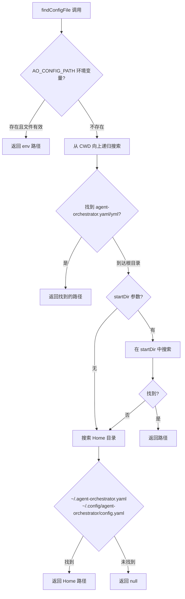
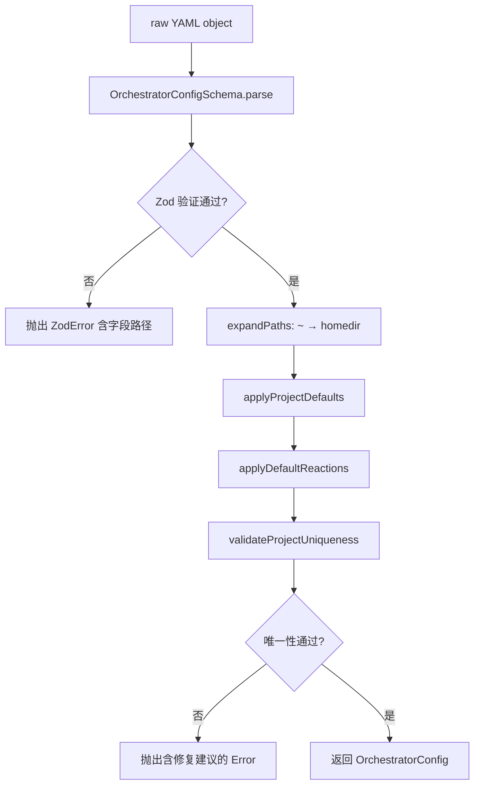

# PD-214.01 AgentOrchestrator — YAML+Zod+Convention 配置驱动系统

> 文档编号：PD-214.01
> 来源：AgentOrchestrator `packages/core/src/config.ts` `packages/core/src/paths.ts` `packages/core/src/types.ts`
> GitHub：https://github.com/ComposioHQ/agent-orchestrator.git
> 问题域：PD-214 配置驱动系统 Config-Driven System
> 状态：可复用方案

---

## 第 1 章 问题与动机

### 1.1 核心问题

多项目 Agent 编排系统需要一套配置机制来管理项目定义、插件选择、通知路由、自动反应等复杂配置。核心挑战：

1. **配置发现**：用户可能在任意目录运行 CLI，如何自动找到配置文件？
2. **配置验证**：YAML 是弱类型的，如何在运行时保证类型安全？
3. **默认值推导**：如何让最小配置（2 行 YAML）就能跑起来，同时支持高级定制？
4. **多实例隔离**：同一台机器上多个 orchestrator 实例如何避免路径冲突？
5. **唯一性校验**：多项目共存时如何防止 session prefix 碰撞？

### 1.2 AgentOrchestrator 的解法概述

AgentOrchestrator 采用三层配置架构：YAML 声明 → Zod 验证 → Convention 推导。

1. **YAML 极简声明**：最小配置只需 `projects.{name}.repo` + `projects.{name}.path`，其余全部自动推导（`config.ts:1-11`）
2. **Zod Schema 严格验证**：嵌套 Schema 覆盖 8 种插件槽位 + 反应配置 + 通知路由，`parse()` 一次性完成类型校验和默认值填充（`config.ts:25-106`）
3. **Convention over Configuration 推导链**：`applyProjectDefaults()` 从 repo 格式推导 SCM/Tracker 插件，从 path basename 推导 sessionPrefix（`config.ts:130-155`）
4. **SHA256 Hash 多实例隔离**：`generateConfigHash()` 对 configDir 取 SHA256 前 12 位，生成全局唯一的目录命名空间（`paths.ts:20-25`）
5. **双重唯一性校验**：`validateProjectUniqueness()` 同时检查 project ID（basename）和 session prefix 碰撞，提供修复建议（`config.ts:158-212`）

### 1.3 设计思想

| 设计原则 | 具体实现 | 理由 | 替代方案 |
|----------|----------|------|----------|
| Convention over Configuration | repo 含 `/` 自动推导 SCM=github，无 tracker 默认 github issues | 2 行 YAML 即可启动，降低入门门槛 | 要求用户显式声明所有插件 |
| Schema-First Validation | Zod Schema 定义所有字段类型、默认值、正则约束 | 编译时类型推导 + 运行时验证一体化 | JSON Schema + ajv 分离验证 |
| Hash-Based Isolation | SHA256(realpath(configDir)).slice(0,12) 作为目录前缀 | 零配置实现多实例隔离，无需用户手动分配 | 用户手动配置 dataDir |
| Fail-Fast with Guidance | 碰撞检测抛出含修复建议的错误信息 | 用户不需要猜测如何修复，错误即文档 | 静默覆盖或仅报错码 |
| Symlink-Aware Hashing | `realpathSync()` 解析符号链接后再 hash | 同一物理目录的不同路径产生相同 hash | 直接 hash 原始路径 |

---

## 第 2 章 源码实现分析

### 2.1 架构概览

AgentOrchestrator 的配置系统由三个核心模块组成：

```
┌─────────────────────────────────────────────────────────┐
│                    config.ts (配置加载)                    │
│                                                          │
│  findConfigFile()  ──→  loadConfig()  ──→  validateConfig()  │
│  (4 级搜索)           (YAML 解析)       (Zod + 推导 + 校验)  │
│                                                          │
│  搜索顺序:                                                │
│  1. AO_CONFIG_PATH env                                   │
│  2. CWD 向上递归                                          │
│  3. startDir 参数                                         │
│  4. ~/.agent-orchestrator.yaml                           │
│     ~/.config/agent-orchestrator/config.yaml             │
└──────────────────────┬──────────────────────────────────┘
                       │ configPath
                       ▼
┌─────────────────────────────────────────────────────────┐
│                    paths.ts (路径生成)                     │
│                                                          │
│  generateConfigHash(configPath)                          │
│    → SHA256(realpath(dirname(configPath))).slice(0,12)   │
│                                                          │
│  generateInstanceId(configPath, projectPath)             │
│    → "{hash}-{basename(projectPath)}"                    │
│                                                          │
│  目录结构:                                                │
│  ~/.agent-orchestrator/{hash}-{projectId}/               │
│    ├── .origin          (碰撞检测)                        │
│    ├── sessions/        (会话元数据)                       │
│    └── worktrees/       (Git 工作树)                      │
└──────────────────────┬──────────────────────────────────┘
                       │ types
                       ▼
┌─────────────────────────────────────────────────────────┐
│                    types.ts (类型定义)                     │
│                                                          │
│  OrchestratorConfig                                      │
│    ├── port, readyThresholdMs                            │
│    ├── defaults: DefaultPlugins (8 插件槽位)              │
│    ├── projects: Record<string, ProjectConfig>           │
│    ├── notifiers: Record<string, NotifierConfig>         │
│    ├── notificationRouting: Record<Priority, string[]>   │
│    └── reactions: Record<string, ReactionConfig>         │
└─────────────────────────────────────────────────────────┘
```

### 2.2 核心实现

#### 2.2.1 配置文件发现：4 级搜索策略



对应源码 `packages/core/src/config.ts:289-349`：

```typescript
export function findConfigFile(startDir?: string): string | null {
  // 1. Check environment variable override
  if (process.env["AO_CONFIG_PATH"]) {
    const envPath = resolve(process.env["AO_CONFIG_PATH"]);
    if (existsSync(envPath)) {
      return envPath;
    }
  }

  // 2. Search up directory tree from CWD (like git)
  const searchUpTree = (dir: string): string | null => {
    const configFiles = ["agent-orchestrator.yaml", "agent-orchestrator.yml"];
    for (const filename of configFiles) {
      const configPath = resolve(dir, filename);
      if (existsSync(configPath)) {
        return configPath;
      }
    }
    const parent = resolve(dir, "..");
    if (parent === dir) return null; // Reached root
    return searchUpTree(parent);
  };

  const cwd = process.cwd();
  const foundInTree = searchUpTree(cwd);
  if (foundInTree) return foundInTree;

  // 3. Check explicit startDir if provided
  if (startDir) {
    const files = ["agent-orchestrator.yaml", "agent-orchestrator.yml"];
    for (const filename of files) {
      const path = resolve(startDir, filename);
      if (existsSync(path)) return path;
    }
  }

  // 4. Check home directory locations
  const homePaths = [
    resolve(homedir(), ".agent-orchestrator.yaml"),
    resolve(homedir(), ".agent-orchestrator.yml"),
    resolve(homedir(), ".config", "agent-orchestrator", "config.yaml"),
  ];
  for (const path of homePaths) {
    if (existsSync(path)) return path;
  }
  return null;
}
```

#### 2.2.2 Zod Schema 嵌套验证与默认值注入



对应源码 `packages/core/src/config.ts:61-106`（ProjectConfig Schema）和 `config.ts:402-414`（验证管线）：

```typescript
const ProjectConfigSchema = z.object({
  name: z.string().optional(),
  repo: z.string(),
  path: z.string(),
  defaultBranch: z.string().default("main"),
  sessionPrefix: z.string()
    .regex(/^[a-zA-Z0-9_-]+$/, "sessionPrefix must match [a-zA-Z0-9_-]+")
    .optional(),
  runtime: z.string().optional(),
  agent: z.string().optional(),
  workspace: z.string().optional(),
  tracker: TrackerConfigSchema.optional(),
  scm: SCMConfigSchema.optional(),
  symlinks: z.array(z.string()).optional(),
  postCreate: z.array(z.string()).optional(),
  agentConfig: AgentSpecificConfigSchema.optional(),
  reactions: z.record(ReactionConfigSchema.partial()).optional(),
  agentRules: z.string().optional(),
  agentRulesFile: z.string().optional(),
  orchestratorRules: z.string().optional(),
});

export function validateConfig(raw: unknown): OrchestratorConfig {
  const validated = OrchestratorConfigSchema.parse(raw);
  let config = validated as OrchestratorConfig;
  config = expandPaths(config);
  config = applyProjectDefaults(config);
  config = applyDefaultReactions(config);
  validateProjectUniqueness(config);
  return config;
}
```

### 2.3 实现细节

#### Convention 推导链

`applyProjectDefaults()` 实现了 4 条推导规则（`config.ts:130-155`）：

1. **name ← config key**：`project.name = id`（YAML 中的 key 即项目名）
2. **sessionPrefix ← basename(path)**：通过 `generateSessionPrefix()` 的 4 级启发式规则生成（`paths.ts:55-78`）
3. **scm ← repo 格式**：`repo.includes("/")` → `{ plugin: "github" }`
4. **tracker ← 默认**：无 tracker 时默认 `{ plugin: "github" }`

Session Prefix 生成的 4 级启发式（`paths.ts:55-78`）：

| 规则 | 条件 | 示例 |
|------|------|------|
| 直接使用 | ≤4 字符 | `app` → `app` |
| CamelCase 提取 | 多个大写字母 | `PyTorch` → `pt` |
| 分隔符首字母 | 含 `-` 或 `_` | `agent-orchestrator` → `ao` |
| 前 3 字符 | 单词 >4 字符 | `integrator` → `int` |

#### Hash 碰撞防护

`validateAndStoreOrigin()` 使用 `.origin` 文件实现碰撞检测（`paths.ts:173-194`）：

- 首次使用：创建 `.origin` 文件，写入 `realpathSync(configPath)`
- 后续使用：比对 `.origin` 内容与当前 configPath
- 碰撞时：抛出含两个 configPath 的错误，建议移动其中一个

#### 默认反应配置

`applyDefaultReactions()` 预置了 8 种事件反应（`config.ts:215-278`），覆盖 CI 失败、代码审查、合并冲突、Agent 卡住等场景。用户配置通过 spread 覆盖默认值：`{ ...defaults, ...config.reactions }`。

---

## 第 3 章 迁移指南

### 3.1 迁移清单

**阶段 1：配置文件发现**

- [ ] 定义配置文件名和搜索路径优先级
- [ ] 实现目录树向上递归搜索（类 git 行为）
- [ ] 支持环境变量覆盖配置路径
- [ ] 支持 Home 目录 fallback 位置

**阶段 2：Schema 验证**

- [ ] 安装 Zod（`pnpm add zod`）和 YAML 解析器（`pnpm add yaml`）
- [ ] 定义顶层配置 Schema，所有可选字段设置 `.default()`
- [ ] 定义嵌套子 Schema（项目、插件、反应等）
- [ ] 实现 `validateConfig()` 管线：parse → expand → defaults → validate

**阶段 3：Convention 推导**

- [ ] 实现 `applyDefaults()` 推导链
- [ ] 实现 session prefix 生成启发式
- [ ] 实现唯一性校验（ID + prefix 双重检查）

**阶段 4：多实例隔离**

- [ ] 实现 `generateConfigHash()` 基于 configDir 的 SHA256 hash
- [ ] 实现 `.origin` 文件碰撞检测
- [ ] 实现 hash-based 目录结构

### 3.2 适配代码模板

以下是一个可直接复用的 TypeScript 配置系统骨架：

```typescript
import { readFileSync, existsSync } from "node:fs";
import { resolve, join, basename, dirname } from "node:path";
import { homedir } from "node:os";
import { createHash } from "node:crypto";
import { realpathSync } from "node:fs";
import { parse as parseYaml } from "yaml";
import { z } from "zod";

// ---- Schema 定义 ----
const ProjectSchema = z.object({
  name: z.string().optional(),
  repo: z.string(),
  path: z.string(),
  defaultBranch: z.string().default("main"),
  sessionPrefix: z.string().regex(/^[a-zA-Z0-9_-]+$/).optional(),
});

const AppConfigSchema = z.object({
  port: z.number().default(3000),
  projects: z.record(ProjectSchema),
});

type AppConfig = z.infer<typeof AppConfigSchema> & { configPath: string };

// ---- 配置发现 ----
function findConfig(configName: string, startDir?: string): string | null {
  // 1. 环境变量
  const envKey = configName.toUpperCase().replace(/-/g, "_") + "_CONFIG_PATH";
  if (process.env[envKey]) {
    const p = resolve(process.env[envKey]!);
    if (existsSync(p)) return p;
  }

  // 2. CWD 向上搜索
  let dir = process.cwd();
  while (true) {
    for (const ext of [".yaml", ".yml"]) {
      const p = resolve(dir, `${configName}${ext}`);
      if (existsSync(p)) return p;
    }
    const parent = resolve(dir, "..");
    if (parent === dir) break;
    dir = parent;
  }

  // 3. Home 目录
  for (const p of [
    resolve(homedir(), `.${configName}.yaml`),
    resolve(homedir(), ".config", configName, "config.yaml"),
  ]) {
    if (existsSync(p)) return p;
  }
  return null;
}

// ---- Hash 隔离 ----
function configHash(configPath: string): string {
  const resolved = realpathSync(configPath);
  return createHash("sha256").update(dirname(resolved)).digest("hex").slice(0, 12);
}

// ---- 验证管线 ----
function loadAndValidate(configPath: string): AppConfig {
  const raw = parseYaml(readFileSync(configPath, "utf-8"));
  const validated = AppConfigSchema.parse(raw);
  const config = validated as AppConfig;
  config.configPath = configPath;

  // Convention 推导
  for (const [key, project] of Object.entries(config.projects)) {
    if (!project.name) project.name = key;
    if (!project.sessionPrefix) {
      project.sessionPrefix = basename(project.path).slice(0, 3).toLowerCase();
    }
  }
  return config;
}
```

### 3.3 适用场景

| 场景 | 适用度 | 说明 |
|------|--------|------|
| 多项目 Agent 编排系统 | ⭐⭐⭐ | 完美匹配：多项目 + 多实例 + 插件化 |
| CLI 工具配置管理 | ⭐⭐⭐ | 向上搜索 + env 覆盖是 CLI 标准模式 |
| 单项目简单配置 | ⭐⭐ | 过度设计：hash 隔离和唯一性校验不必要 |
| 动态配置热重载 | ⭐ | 不适用：当前实现是启动时一次性加载 |

---

## 第 4 章 测试用例

基于 AgentOrchestrator 真实测试（`packages/core/src/__tests__/config-validation.test.ts` 和 `packages/core/src/__tests__/paths.test.ts`）：

```typescript
import { describe, it, expect, beforeEach, afterEach } from "vitest";
import { mkdtempSync, writeFileSync, rmSync, mkdirSync } from "node:fs";
import { tmpdir } from "node:os";
import { join } from "node:path";

// 假设从你的模块导入
import { findConfig, loadAndValidate, configHash } from "./config";

describe("配置文件发现", () => {
  let tmpDir: string;

  beforeEach(() => {
    tmpDir = mkdtempSync(join(tmpdir(), "config-test-"));
  });
  afterEach(() => {
    rmSync(tmpDir, { recursive: true, force: true });
  });

  it("从 CWD 向上搜索找到配置", () => {
    const configPath = join(tmpDir, "my-tool.yaml");
    writeFileSync(configPath, "projects: {}");
    // 模拟 CWD 在子目录
    const subDir = join(tmpDir, "sub", "deep");
    mkdirSync(subDir, { recursive: true });
    process.chdir(subDir);
    const found = findConfig("my-tool");
    expect(found).toBe(configPath);
  });

  it("环境变量优先于目录搜索", () => {
    const envConfig = join(tmpDir, "env-config.yaml");
    writeFileSync(envConfig, "projects: {}");
    process.env["MY_TOOL_CONFIG_PATH"] = envConfig;
    const found = findConfig("my-tool");
    expect(found).toBe(envConfig);
    delete process.env["MY_TOOL_CONFIG_PATH"];
  });
});

describe("Zod Schema 验证", () => {
  it("最小配置通过验证并填充默认值", () => {
    const tmpDir = mkdtempSync(join(tmpdir(), "validate-test-"));
    const configPath = join(tmpDir, "config.yaml");
    writeFileSync(configPath, `
projects:
  my-app:
    repo: org/my-app
    path: ~/my-app
`);
    const config = loadAndValidate(configPath);
    expect(config.port).toBe(3000);
    expect(config.projects["my-app"].defaultBranch).toBe("main");
    expect(config.projects["my-app"].name).toBe("my-app");
    rmSync(tmpDir, { recursive: true, force: true });
  });

  it("缺少必填字段抛出 ZodError", () => {
    const tmpDir = mkdtempSync(join(tmpdir(), "validate-test-"));
    const configPath = join(tmpDir, "config.yaml");
    writeFileSync(configPath, `
projects:
  my-app:
    path: ~/my-app
`);  // 缺少 repo
    expect(() => loadAndValidate(configPath)).toThrow();
    rmSync(tmpDir, { recursive: true, force: true });
  });
});

describe("Hash 隔离", () => {
  it("产生 12 位十六进制字符串", () => {
    const tmpDir = mkdtempSync(join(tmpdir(), "hash-test-"));
    const configPath = join(tmpDir, "config.yaml");
    writeFileSync(configPath, "projects: {}");
    const hash = configHash(configPath);
    expect(hash).toHaveLength(12);
    expect(hash).toMatch(/^[a-f0-9]{12}$/);
    rmSync(tmpDir, { recursive: true, force: true });
  });

  it("相同路径产生相同 hash（确定性）", () => {
    const tmpDir = mkdtempSync(join(tmpdir(), "hash-test-"));
    const configPath = join(tmpDir, "config.yaml");
    writeFileSync(configPath, "projects: {}");
    expect(configHash(configPath)).toBe(configHash(configPath));
    rmSync(tmpDir, { recursive: true, force: true });
  });

  it("不同路径产生不同 hash", () => {
    const dir1 = mkdtempSync(join(tmpdir(), "hash1-"));
    const dir2 = mkdtempSync(join(tmpdir(), "hash2-"));
    writeFileSync(join(dir1, "c.yaml"), "");
    writeFileSync(join(dir2, "c.yaml"), "");
    expect(configHash(join(dir1, "c.yaml"))).not.toBe(configHash(join(dir2, "c.yaml")));
    rmSync(dir1, { recursive: true, force: true });
    rmSync(dir2, { recursive: true, force: true });
  });
});

describe("唯一性校验", () => {
  it("重复 session prefix 抛出错误", () => {
    // 参考 config-validation.test.ts:76-96
    // 两个项目生成相同 prefix 时应报错
  });

  it("重复 project ID（basename 相同）抛出错误", () => {
    // 参考 config-validation.test.ts:9-27
    // 两个项目 path basename 相同时应报错
  });
});
```

---

## 第 5 章 跨域关联

| 关联域 | 关系类型 | 说明 |
|--------|----------|------|
| PD-04 工具系统 | 依赖 | 配置中的 `defaults` 字段驱动 8 个插件槽位的选择（runtime/agent/workspace/tracker/scm/notifier/terminal），插件注册表依赖配置加载结果 |
| PD-05 沙箱隔离 | 协同 | Hash-based 目录隔离为每个项目创建独立的 sessions/worktrees 目录，与 workspace 插件的 worktree 隔离互补 |
| PD-06 记忆持久化 | 协同 | Session 元数据的存储路径由 `getSessionsDir()` 从配置 hash 推导，配置系统是持久化路径的唯一来源 |
| PD-09 Human-in-the-Loop | 依赖 | `notificationRouting` 和 `reactions` 配置驱动通知路由和自动反应行为，是 HITL 的声明式定义层 |
| PD-10 中间件管道 | 协同 | `validateConfig()` 本身是一个 4 步管线（parse → expand → defaults → validate），体现管道模式 |
| PD-11 可观测性 | 协同 | 配置中的 `readyThresholdMs` 控制 Agent 活动检测的超时阈值，影响可观测性判断 |

---

## 第 6 章 来源文件索引

| 文件 | 行范围 | 关键实现 |
|------|--------|----------|
| `packages/core/src/config.ts` | L1-L422 | 完整配置加载系统：Zod Schema 定义、findConfigFile 4 级搜索、validateConfig 管线、applyProjectDefaults 推导、applyDefaultReactions 默认反应、validateProjectUniqueness 唯一性校验 |
| `packages/core/src/paths.ts` | L1-L195 | Hash-based 路径系统：generateConfigHash SHA256 哈希、generateSessionPrefix 4 级启发式、generateInstanceId 实例 ID、validateAndStoreOrigin 碰撞检测、目录结构生成函数族 |
| `packages/core/src/types.ts` | L793-L910 | 配置类型定义：OrchestratorConfig、ProjectConfig、DefaultPlugins、TrackerConfig、SCMConfig、NotifierConfig、ReactionConfig、PluginSlot |
| `packages/core/src/__tests__/config-validation.test.ts` | L1-L402 | 配置验证测试：project ID 唯一性、session prefix 碰撞检测、Schema 必填字段、默认值推导 |
| `packages/core/src/__tests__/paths.test.ts` | L1-L502 | 路径工具测试：hash 生成确定性、symlink 解析、session prefix 启发式、tmux 命名、.origin 碰撞检测、碰撞概率分析 |
| `packages/core/src/index.ts` | L1-L82 | 公共 API 导出：配置加载、路径工具、元数据操作、插件注册表 |
| `packages/core/src/session-manager.ts` | L1-L57 | 配置消费端：SessionManager 使用 getSessionsDir/generateTmuxName/validateAndStoreOrigin |
| `examples/simple-github.yaml` | L1-L12 | 最小配置示例：2 行 YAML 即可运行 |
| `examples/multi-project.yaml` | L1-L58 | 多项目配置示例：多 tracker、通知路由、agentRules |
| `changelog/hash-based-architecture-migration.md` | L1-L469 | 架构迁移文档：从 flat dataDir 到 hash-based 隔离的完整迁移指南 |

---

## 第 7 章 横向对比维度

```json comparison_data
{
  "project": "AgentOrchestrator",
  "dimensions": {
    "配置格式": "YAML 单文件，支持 .yaml/.yml 双后缀",
    "验证机制": "Zod Schema 嵌套验证，parse 时同步填充默认值",
    "配置发现": "4 级搜索：env → CWD 向上递归 → startDir → Home 目录",
    "默认值策略": "Convention over Configuration，repo 格式推导 SCM/Tracker",
    "多实例隔离": "SHA256(configDir).slice(0,12) hash-based 目录命名空间",
    "唯一性校验": "双重检查：project ID basename + session prefix 碰撞检测",
    "碰撞防护": ".origin 文件存储 configPath，启动时比对检测 hash 碰撞",
    "错误体验": "Fail-fast 含修复建议的错误信息，错误即文档"
  }
}
```

### 域元数据补充

```json domain_metadata
{
  "solution_summary": "AgentOrchestrator 用 YAML+Zod+Convention 三层架构实现配置驱动，findConfigFile 4 级搜索发现配置，Zod Schema 嵌套验证填充默认值，Convention 从 repo/path 自动推导 SCM/Tracker/sessionPrefix，SHA256 hash 实现多实例目录隔离",
  "description": "配置系统需要平衡极简声明与复杂编排的矛盾，核心是推导链设计",
  "sub_problems": [
    "session prefix 碰撞检测与自动生成启发式",
    "配置变更后的目录迁移与向后兼容",
    "默认反应配置的声明式预置与用户覆盖合并"
  ],
  "best_practices": [
    "用 .origin 文件做 hash 碰撞检测而非信任 hash 唯一性",
    "realpathSync 解析符号链接后再 hash 保证一致性",
    "错误信息包含修复建议代码片段（错误即文档）",
    "session prefix 用 4 级启发式从项目名自动生成"
  ]
}
```
