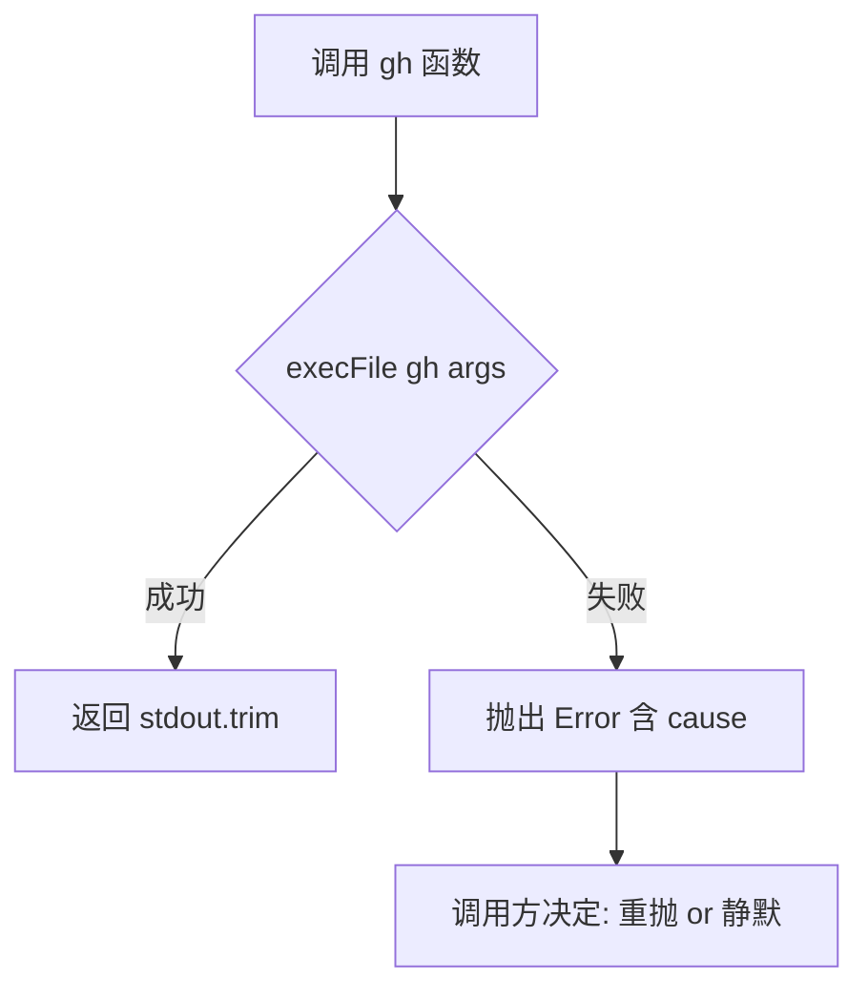
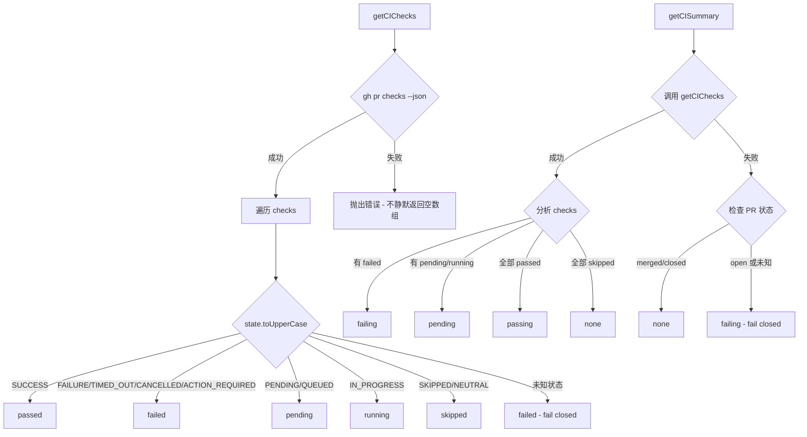
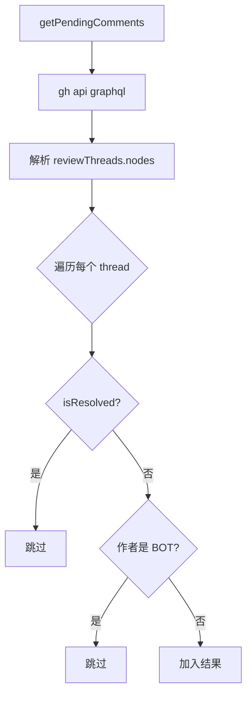

# PD-215.01 AgentOrchestrator — gh CLI SCM 插件与 PR 生命周期管理

> 文档编号：PD-215.01
> 来源：AgentOrchestrator `packages/plugins/scm-github/src/index.ts`
> GitHub：https://github.com/ComposioHQ/agent-orchestrator.git
> 问题域：PD-215 SCM 平台集成 SCM Platform Integration
> 状态：可复用方案

---

## 第 1 章 问题与动机

### 1.1 核心问题

Agent 编排系统需要与 SCM 平台（GitHub/GitLab）深度集成，才能实现 PR 生命周期的自动化管理。核心挑战包括：

1. **PR 自动检测**：Agent 在 worktree 中创建 PR 后，编排器如何自动发现并关联？不同 Agent（Claude Code、Codex、Aider）的 PR 创建方式各异，需要统一的检测机制。
2. **CI 状态聚合**：GitHub 的 check run 状态有 10+ 种（SUCCESS、FAILURE、PENDING、QUEUED、IN_PROGRESS、SKIPPED、NEUTRAL、TIMED_OUT、CANCELLED、ACTION_REQUIRED），需要归一化为编排器可消费的 4 态模型。
3. **Review 决策解析**：GitHub 的 review 系统区分 reviewDecision（全局决策）和 review thread（逐条评论），需要同时处理两个维度。
4. **Merge 就绪判断**：合并条件是多维的——CI 通过、Review 批准、无冲突、非 Draft、分支保护规则——需要聚合为单一布尔值 + 阻塞原因列表。
5. **Bot 评论识别**：自动化工具（Codecov、Dependabot、SonarCloud 等）产生大量评论，需要与人类评论区分，避免 Agent 浪费时间处理机器生成的反馈。

### 1.2 AgentOrchestrator 的解法概述

AgentOrchestrator 通过 `scm-github` 插件实现了完整的 PR 生命周期管理：

1. **gh CLI 统一封装**：所有 GitHub API 调用通过 `gh` CLI 执行，避免直接管理 OAuth token，利用 `gh auth` 的认证链（`packages/plugins/scm-github/src/index.ts:47-59`）
2. **GraphQL + REST 双通道**：REST API 用于标准 PR 操作，GraphQL 用于获取 review thread 的 `isResolved` 状态——这是 REST API 无法提供的关键字段（`index.ts:336-417`）
3. **Fail-closed CI 策略**：CI 查询失败时报告为 "failing" 而非 "none"，防止因 API 故障导致误合并（`index.ts:235-240`）
4. **BOT_AUTHORS 白名单**：硬编码 10 个已知 bot 账号，用于区分自动化评论和人类评论（`index.ts:30-41`）
5. **Lifecycle Manager 集成**：SCM 插件被 lifecycle-manager 的轮询循环调用，驱动 session 状态机从 `pr_open` → `ci_failed` / `review_pending` / `approved` / `mergeable` → `merged` 的完整流转（`lifecycle-manager.ts:182-289`）

### 1.3 设计思想

| 设计原则 | 具体实现 | 理由 | 替代方案 |
|----------|----------|------|----------|
| CLI 优先于 SDK | 通过 `execFile("gh", args)` 调用 gh CLI | 零依赖、利用用户已有认证、跨平台 | Octokit SDK（需管理 token） |
| Fail-closed 安全策略 | CI 查询失败 → 报告 "failing" | 防止 API 故障导致误合并 | Fail-open（危险） |
| GraphQL 补充 REST | `getPendingComments` 用 GraphQL 获取 `isResolved` | REST API 不暴露 thread 解决状态 | 只用 REST（丢失关键信息） |
| 插件化 SCM 接口 | `SCM` interface 定义 13 个方法 | 支持 GitHub/GitLab/Bitbucket 切换 | 硬编码 GitHub |
| 状态归一化 | 10+ GitHub 状态 → 5 态 CICheck.status | 编排器只需关心 passed/failed/pending/running/skipped | 透传原始状态（复杂度爆炸） |

---

## 第 2 章 源码实现分析

### 2.1 架构概览

AgentOrchestrator 的 SCM 集成分为三层：插件层（scm-github）、编排层（lifecycle-manager）、API 层（web routes）。

```
┌─────────────────────────────────────────────────────────────────┐
│                    Web Dashboard / CLI                           │
│  POST /api/prs/:id/merge    ao review-check                    │
└──────────────┬──────────────────────┬───────────────────────────┘
               │                      │
┌──────────────▼──────────────────────▼───────────────────────────┐
│              Lifecycle Manager (轮询引擎)                        │
│  determineStatus() → checkSession() → executeReaction()         │
│  30s 轮询间隔 · 并发检查所有 session · 状态转换触发事件          │
└──────────────┬──────────────────────────────────────────────────┘
               │ registry.get<SCM>("scm", "github")
┌──────────────▼──────────────────────────────────────────────────┐
│              SCM Plugin Interface (13 methods)                   │
│  detectPR · getPRState · getCIChecks · getCISummary              │
│  getReviews · getReviewDecision · getPendingComments             │
│  getAutomatedComments · getMergeability · mergePR · closePR      │
│  getPRSummary                                                    │
└──────────────┬──────────────────────────────────────────────────┘
               │ execFile("gh", [...args])
┌──────────────▼──────────────────────────────────────────────────┐
│              gh CLI → GitHub REST API / GraphQL API              │
│  gh pr list · gh pr view · gh pr checks · gh pr merge           │
│  gh api graphql (review threads)                                │
│  gh api repos/.../pulls/.../comments (automated comments)       │
└─────────────────────────────────────────────────────────────────┘
```

### 2.2 核心实现

#### 2.2.1 gh CLI 封装与错误处理



对应源码 `packages/plugins/scm-github/src/index.ts:47-59`：

```typescript
async function gh(args: string[]): Promise<string> {
  try {
    const { stdout } = await execFileAsync("gh", args, {
      maxBuffer: 10 * 1024 * 1024,
      timeout: 30_000,
    });
    return stdout.trim();
  } catch (err) {
    throw new Error(`gh ${args.slice(0, 3).join(" ")} failed: ${(err as Error).message}`, {
      cause: err,
    });
  }
}
```

关键设计：`maxBuffer: 10MB` 防止大 PR 的 JSON 输出被截断；`timeout: 30s` 防止 gh CLI 挂起；错误消息只取前 3 个参数避免泄露敏感信息。

#### 2.2.2 CI 状态归一化与 Fail-closed 策略



对应源码 `packages/plugins/scm-github/src/index.ts:181-275`：

```typescript
async getCIChecks(pr: PRInfo): Promise<CICheck[]> {
  try {
    const raw = await gh([
      "pr", "checks", String(pr.number), "--repo", repoFlag(pr),
      "--json", "name,state,link,startedAt,completedAt",
    ]);
    const checks = JSON.parse(raw);
    return checks.map((c) => {
      let status: CICheck["status"];
      const state = c.state?.toUpperCase();
      if (state === "PENDING" || state === "QUEUED") status = "pending";
      else if (state === "IN_PROGRESS") status = "running";
      else if (state === "SUCCESS") status = "passed";
      else if (state === "FAILURE" || state === "TIMED_OUT" ||
               state === "CANCELLED" || state === "ACTION_REQUIRED") status = "failed";
      else if (state === "SKIPPED" || state === "NEUTRAL") status = "skipped";
      else status = "failed"; // Unknown state — fail closed
      return { name: c.name, status, url: c.link || undefined,
               conclusion: state || undefined };
    });
  } catch (err) {
    // Do NOT silently return [] — that causes a fail-open
    throw new Error("Failed to fetch CI checks", { cause: err });
  }
},

async getCISummary(pr: PRInfo): Promise<CIStatus> {
  let checks: CICheck[];
  try { checks = await this.getCIChecks(pr); }
  catch {
    // Before fail-closing, check if PR is merged/closed
    try {
      const state = await this.getPRState(pr);
      if (state === "merged" || state === "closed") return "none";
    } catch { /* fall through */ }
    return "failing"; // Fail closed for open PRs
  }
  if (checks.length === 0) return "none";
  const hasFailing = checks.some((c) => c.status === "failed");
  if (hasFailing) return "failing";
  const hasPending = checks.some((c) => c.status === "pending" || c.status === "running");
  if (hasPending) return "pending";
  const hasPassing = checks.some((c) => c.status === "passed");
  if (!hasPassing) return "none"; // All skipped
  return "passing";
},
```

#### 2.2.3 GraphQL Review Thread 解析



对应源码 `packages/plugins/scm-github/src/index.ts:333-421`：

```typescript
async getPendingComments(pr: PRInfo): Promise<ReviewComment[]> {
  try {
    const raw = await gh([
      "api", "graphql",
      "-f", `owner=${pr.owner}`, "-f", `name=${pr.repo}`,
      "-F", `number=${pr.number}`,
      "-f", `query=query($owner: String!, $name: String!, $number: Int!) {
        repository(owner: $owner, name: $name) {
          pullRequest(number: $number) {
            reviewThreads(first: 100) {
              nodes {
                isResolved
                comments(first: 1) {
                  nodes { id author { login } body path line url createdAt }
                }
              }
            }
          }
        }
      }`,
    ]);
    const data = JSON.parse(raw);
    const threads = data.data.repository.pullRequest.reviewThreads.nodes;
    return threads
      .filter((t) => {
        if (t.isResolved) return false;
        const c = t.comments.nodes[0];
        if (!c) return false;
        return !BOT_AUTHORS.has(c.author?.login ?? "");
      })
      .map((t) => { /* ... map to ReviewComment */ });
  } catch { return []; }
},
```

关键设计：使用 GraphQL 变量传递（`-f owner=` / `-F number=`）而非字符串拼接，防止 repo 名称中的特殊字符导致注入；`first: 100` 获取最多 100 个 review thread；只取每个 thread 的第一条评论（`comments(first: 1)`）作为代表。

### 2.3 实现细节

#### Lifecycle Manager 状态机与 SCM 集成

Lifecycle Manager 每 30 秒轮询所有 session，通过 `determineStatus()` 函数调用 SCM 插件判断当前状态。状态转换链：

```
spawning → working → pr_open → ci_failed ←→ review_pending
                                    ↓              ↓
                              changes_requested  approved → mergeable → merged
```

`determineStatus()` 的 SCM 相关逻辑（`packages/core/src/lifecycle-manager.ts:233-278`）：

1. **PR 自动检测**（L236-249）：如果 session 没有关联 PR，调用 `scm.detectPR()` 按分支名搜索，找到后持久化到 metadata
2. **PR 状态检查**（L253-278）：依次检查 PR state → CI summary → review decision → merge readiness，返回对应的 session status
3. **事件触发**（L470-516）：状态转换时创建 `OrchestratorEvent`，查找对应的 `ReactionConfig`，执行 send-to-agent / notify / auto-merge

#### MergeReadiness 多维判断

`getMergeability()` 聚合 5 个维度（`index.ts:481-562`）：

| 维度 | 数据源 | 阻塞条件 |
|------|--------|----------|
| CI 状态 | `getCISummary()` | failing 或 pending |
| Review 决策 | `pr view --json reviewDecision` | CHANGES_REQUESTED 或 REVIEW_REQUIRED |
| 冲突状态 | `pr view --json mergeable` | CONFLICTING 或 UNKNOWN |
| 分支状态 | `pr view --json mergeStateStatus` | BEHIND / BLOCKED / UNSTABLE |
| Draft 状态 | `pr view --json isDraft` | isDraft === true |

特殊处理：已合并的 PR 直接返回全绿结果，避免查询 `mergeable`（GitHub 对已合并 PR 返回 null）。

#### BOT_AUTHORS 识别

硬编码的 10 个 bot 账号（`index.ts:30-41`）：

```typescript
const BOT_AUTHORS = new Set([
  "cursor[bot]", "github-actions[bot]", "codecov[bot]",
  "sonarcloud[bot]", "dependabot[bot]", "renovate[bot]",
  "codeclimate[bot]", "deepsource-autofix[bot]",
  "snyk-bot", "lgtm-com[bot]",
]);
```

用于两处过滤：`getPendingComments()` 排除 bot 的 review thread；`getAutomatedComments()` 只保留 bot 的评论并按内容关键词分类严重度（error/warning/info）。

#### Automated Comment 严重度分类

`getAutomatedComments()` 通过评论正文的关键词匹配确定严重度（`index.ts:447-462`）：

- **error**: 包含 "error"、"bug"、"critical"、"potential issue"
- **warning**: 包含 "warning"、"suggest"、"consider"
- **info**: 默认级别

---

## 第 3 章 迁移指南

### 3.1 迁移清单

**阶段 1：SCM 接口定义**
- [ ] 定义 `SCM` 接口（13 个方法），参考 `packages/core/src/types.ts:494-545`
- [ ] 定义 PR/CI/Review 相关类型（PRInfo、CICheck、CIStatus、Review、ReviewDecision、MergeReadiness）
- [ ] 确定 CI 状态归一化映射表（GitHub 10+ 状态 → 5 态）

**阶段 2：gh CLI 封装**
- [ ] 实现 `gh()` 辅助函数，含 maxBuffer/timeout/错误包装
- [ ] 实现 `detectPR()`：按分支名搜索 PR
- [ ] 实现 `getCIChecks()` + `getCISummary()`：含 fail-closed 策略
- [ ] 实现 `getReviews()` + `getReviewDecision()`：review 状态解析
- [ ] 实现 `getPendingComments()`：GraphQL 获取 isResolved
- [ ] 实现 `getAutomatedComments()`：BOT_AUTHORS 过滤 + 严重度分类
- [ ] 实现 `getMergeability()`：多维聚合

**阶段 3：编排集成**
- [ ] 在轮询循环中调用 SCM 插件的 `detectPR()` 和状态检查方法
- [ ] 实现状态转换事件（pr.created、ci.failing、review.approved 等）
- [ ] 配置 reaction（ci-failed → send-to-agent、approved-and-green → auto-merge）

### 3.2 适配代码模板

以下是一个可直接复用的 SCM 接口 + gh CLI 封装模板（TypeScript）：

```typescript
import { execFile } from "node:child_process";
import { promisify } from "node:util";

const execFileAsync = promisify(execFile);

// --- gh CLI 封装 ---
async function gh(args: string[]): Promise<string> {
  try {
    const { stdout } = await execFileAsync("gh", args, {
      maxBuffer: 10 * 1024 * 1024,
      timeout: 30_000,
    });
    return stdout.trim();
  } catch (err) {
    throw new Error(`gh ${args.slice(0, 3).join(" ")} failed: ${(err as Error).message}`, {
      cause: err,
    });
  }
}

// --- CI 状态归一化 ---
type CIStatus = "pending" | "passing" | "failing" | "none";

function normalizeCIState(ghState: string): "passed" | "failed" | "pending" | "running" | "skipped" {
  const s = ghState.toUpperCase();
  if (s === "SUCCESS") return "passed";
  if (s === "PENDING" || s === "QUEUED") return "pending";
  if (s === "IN_PROGRESS") return "running";
  if (s === "SKIPPED" || s === "NEUTRAL") return "skipped";
  // FAILURE, TIMED_OUT, CANCELLED, ACTION_REQUIRED, unknown → fail closed
  return "failed";
}

async function getCISummary(repo: string, prNumber: number): Promise<CIStatus> {
  let checks: Array<{ status: string }>;
  try {
    const raw = await gh([
      "pr", "checks", String(prNumber), "--repo", repo,
      "--json", "name,state",
    ]);
    checks = JSON.parse(raw).map((c: { state: string }) => ({
      status: normalizeCIState(c.state),
    }));
  } catch {
    return "failing"; // Fail closed
  }
  if (checks.length === 0) return "none";
  if (checks.some(c => c.status === "failed")) return "failing";
  if (checks.some(c => c.status === "pending" || c.status === "running")) return "pending";
  if (checks.some(c => c.status === "passed")) return "passing";
  return "none";
}

// --- GraphQL pending comments ---
const BOT_AUTHORS = new Set([
  "github-actions[bot]", "codecov[bot]", "dependabot[bot]",
  "renovate[bot]", "sonarcloud[bot]",
]);

async function getPendingHumanComments(
  owner: string, repo: string, prNumber: number
): Promise<Array<{ author: string; body: string; path?: string }>> {
  const raw = await gh([
    "api", "graphql",
    "-f", `owner=${owner}`, "-f", `name=${repo}`, "-F", `number=${prNumber}`,
    "-f", `query=query($owner:String!,$name:String!,$number:Int!){
      repository(owner:$owner,name:$name){
        pullRequest(number:$number){
          reviewThreads(first:100){
            nodes{isResolved comments(first:1){nodes{author{login} body path}}}
          }
        }
      }
    }`,
  ]);
  const threads = JSON.parse(raw).data.repository.pullRequest.reviewThreads.nodes;
  return threads
    .filter((t: any) => !t.isResolved && t.comments.nodes[0]
      && !BOT_AUTHORS.has(t.comments.nodes[0].author?.login ?? ""))
    .map((t: any) => {
      const c = t.comments.nodes[0];
      return { author: c.author?.login ?? "unknown", body: c.body, path: c.path || undefined };
    });
}

// --- Merge readiness ---
interface MergeReadiness {
  mergeable: boolean;
  ciPassing: boolean;
  approved: boolean;
  noConflicts: boolean;
  blockers: string[];
}

async function checkMergeReadiness(repo: string, prNumber: number): Promise<MergeReadiness> {
  const blockers: string[] = [];
  const raw = await gh([
    "pr", "view", String(prNumber), "--repo", repo,
    "--json", "mergeable,reviewDecision,mergeStateStatus,isDraft,state",
  ]);
  const data = JSON.parse(raw);

  if (data.state?.toUpperCase() === "MERGED") {
    return { mergeable: true, ciPassing: true, approved: true, noConflicts: true, blockers: [] };
  }

  const ci = await getCISummary(repo, prNumber);
  const ciPassing = ci === "passing" || ci === "none";
  if (!ciPassing) blockers.push(`CI is ${ci}`);

  const review = (data.reviewDecision ?? "").toUpperCase();
  const approved = review === "APPROVED";
  if (review === "CHANGES_REQUESTED") blockers.push("Changes requested");
  if (review === "REVIEW_REQUIRED") blockers.push("Review required");

  const noConflicts = (data.mergeable ?? "").toUpperCase() === "MERGEABLE";
  if (!noConflicts) blockers.push("Merge conflicts or unknown status");

  if (data.isDraft) blockers.push("PR is draft");

  return { mergeable: blockers.length === 0, ciPassing, approved, noConflicts, blockers };
}
```

### 3.3 适用场景

| 场景 | 适用度 | 说明 |
|------|--------|------|
| Agent 编排系统（多 session 并行） | ⭐⭐⭐ | 核心场景：lifecycle manager 轮询 + 自动 reaction |
| CI/CD 自动化脚本 | ⭐⭐⭐ | getCISummary + getMergeability 可独立使用 |
| Code Review 辅助工具 | ⭐⭐ | getPendingComments + getAutomatedComments 可复用 |
| 单 Agent 工作流 | ⭐⭐ | 简化版：只需 detectPR + getCISummary |
| GitLab/Bitbucket 项目 | ⭐ | 需要重新实现 SCM 接口，但接口设计可复用 |

---

## 第 4 章 测试用例

基于 `packages/plugins/scm-github/test/index.test.ts` 的真实测试模式，以下是核心测试用例：

```typescript
import { describe, it, expect, vi, beforeEach } from "vitest";

// Mock gh CLI
const ghMock = vi.fn();
vi.mock("node:child_process", () => {
  const execFile = Object.assign(vi.fn(), {
    [Symbol.for("nodejs.util.promisify.custom")]: ghMock,
  });
  return { execFile };
});

function mockGh(result: unknown) {
  ghMock.mockResolvedValueOnce({ stdout: JSON.stringify(result) });
}
function mockGhError(msg = "Command failed") {
  ghMock.mockRejectedValueOnce(new Error(msg));
}

describe("SCM Plugin", () => {
  beforeEach(() => vi.clearAllMocks());

  describe("getCIChecks — fail-closed strategy", () => {
    it("maps unknown states to failed (fail-closed)", async () => {
      mockGh([{ name: "mystery", state: "WEIRD_STATE" }]);
      const checks = await scm.getCIChecks(pr);
      expect(checks[0].status).toBe("failed");
    });

    it("throws on API error instead of returning empty (prevents fail-open)", async () => {
      mockGhError("rate limited");
      await expect(scm.getCIChecks(pr)).rejects.toThrow("Failed to fetch CI checks");
    });
  });

  describe("getCISummary — fail-closed with merged PR exception", () => {
    it("returns 'failing' when CI fetch fails for open PR", async () => {
      mockGhError(); // getCIChecks fails
      // getPRState also fails → fall through to fail-closed
      expect(await scm.getCISummary(pr)).toBe("failing");
    });

    it("returns 'none' when CI fetch fails for merged PR", async () => {
      mockGhError(); // getCIChecks fails
      mockGh({ state: "MERGED" }); // getPRState succeeds
      expect(await scm.getCISummary(pr)).toBe("none");
    });

    it("returns 'none' when all checks are skipped", async () => {
      mockGh([{ name: "a", state: "SKIPPED" }, { name: "b", state: "NEUTRAL" }]);
      expect(await scm.getCISummary(pr)).toBe("none");
    });
  });

  describe("getPendingComments — bot filtering", () => {
    it("excludes bot comments from pending list", async () => {
      mockGh(makeGraphQLThreads([
        { isResolved: false, author: "alice", body: "Fix this" },
        { isResolved: false, author: "codecov[bot]", body: "Coverage report" },
      ]));
      const comments = await scm.getPendingComments(pr);
      expect(comments).toHaveLength(1);
      expect(comments[0].author).toBe("alice");
    });

    it("excludes resolved threads", async () => {
      mockGh(makeGraphQLThreads([
        { isResolved: true, author: "alice", body: "Already fixed" },
      ]));
      expect(await scm.getPendingComments(pr)).toHaveLength(0);
    });
  });

  describe("getMergeability — multi-dimensional check", () => {
    it("reports multiple blockers simultaneously", async () => {
      mockGh({ state: "OPEN" });
      mockGh({
        mergeable: "CONFLICTING", reviewDecision: "CHANGES_REQUESTED",
        mergeStateStatus: "DIRTY", isDraft: true,
      });
      mockGh([{ name: "build", state: "FAILURE" }]);
      const result = await scm.getMergeability(pr);
      expect(result.blockers).toHaveLength(4);
      expect(result.mergeable).toBe(false);
    });

    it("skips all checks for merged PRs", async () => {
      mockGh({ state: "MERGED" });
      const result = await scm.getMergeability(pr);
      expect(result.mergeable).toBe(true);
      expect(ghMock).toHaveBeenCalledTimes(1); // Only getPRState
    });
  });
});
```

---

## 第 5 章 跨域关联

| 关联域 | 关系类型 | 说明 |
|--------|----------|------|
| PD-211 插件架构 | 依赖 | SCM 是 8 个插件槽之一，通过 PluginRegistry 注册和发现（`plugin-registry.ts:41`） |
| PD-213 事件驱动反应 | 协同 | Lifecycle Manager 检测 SCM 状态变化后触发 reaction（ci-failed → send-to-agent） |
| PD-212 Session 生命周期 | 协同 | Session 状态机的 pr_open/ci_failed/review_pending/approved/mergeable/merged 状态全部由 SCM 插件驱动 |
| PD-209 Agent 活动检测 | 协同 | determineStatus() 先检查 agent 活动状态，再检查 SCM 状态，两者共同决定 session status |
| PD-216 通知路由 | 协同 | SCM 状态变化产生的事件通过 notificationRouting 分发到不同 notifier |
| PD-07 质量检查 | 协同 | CI checks 和 review comments 本质上是质量检查的自动化执行 |

---

## 第 6 章 来源文件索引

| 文件 | 行范围 | 关键实现 |
|------|--------|----------|
| `packages/plugins/scm-github/src/index.ts` | L1-L581 | SCM 插件完整实现：13 个方法 + gh CLI 封装 |
| `packages/plugins/scm-github/src/index.ts` | L30-L41 | BOT_AUTHORS 白名单定义 |
| `packages/plugins/scm-github/src/index.ts` | L47-L59 | gh() 辅助函数：execFile + maxBuffer + timeout |
| `packages/plugins/scm-github/src/index.ts` | L181-L275 | getCIChecks + getCISummary：fail-closed CI 策略 |
| `packages/plugins/scm-github/src/index.ts` | L333-L421 | getPendingComments：GraphQL review thread 解析 |
| `packages/plugins/scm-github/src/index.ts` | L481-L562 | getMergeability：多维合并就绪判断 |
| `packages/core/src/types.ts` | L486-L545 | SCM 接口定义（13 个方法签名） |
| `packages/core/src/types.ts` | L547-L633 | PR/CI/Review/MergeReadiness 类型定义 |
| `packages/core/src/lifecycle-manager.ts` | L182-L289 | determineStatus()：SCM 驱动的状态判断 |
| `packages/core/src/lifecycle-manager.ts` | L292-L416 | executeReaction()：状态变化触发的自动反应 |
| `packages/core/src/lifecycle-manager.ts` | L436-L521 | checkSession()：状态转换检测 + 事件发射 |
| `packages/core/src/plugin-registry.ts` | L41 | SCM 插件注册：`{ slot: "scm", name: "github" }` |
| `packages/cli/src/commands/review-check.ts` | L16-L59 | CLI review-check：GraphQL 查询 + tmux 消息发送 |
| `packages/web/src/app/api/prs/[id]/merge/route.ts` | L1-L52 | Web API：PR 合并端点（含 mergeability 校验） |
| `packages/plugins/scm-github/test/index.test.ts` | L1-L866 | 完整测试套件：覆盖所有 13 个方法 + 边界情况 |

---

## 第 7 章 横向对比维度

```json comparison_data
{
  "project": "AgentOrchestrator",
  "dimensions": {
    "API 调用方式": "gh CLI execFile 封装，零 SDK 依赖，复用用户认证",
    "CI 聚合策略": "10+ GitHub 状态归一化为 5 态，未知状态 fail-closed",
    "Review 解析": "REST 获取 reviewDecision + GraphQL 获取 thread isResolved",
    "Merge 判断": "5 维聚合（CI/Review/冲突/分支状态/Draft）+ blockers 列表",
    "Bot 识别": "BOT_AUTHORS 硬编码白名单 10 个 + 正文关键词严重度分类",
    "插件化程度": "SCM interface 13 方法，支持 GitHub/GitLab/Bitbucket 切换"
  }
}
```

### 域元数据补充

```json domain_metadata
{
  "solution_summary": "AgentOrchestrator 通过 gh CLI 封装实现 SCM 插件，13 方法覆盖 PR 检测/CI 归一化/GraphQL Review 解析/多维 Merge 判断，fail-closed 安全策略防止 API 故障导致误合并",
  "description": "SCM 插件需要处理 API 双通道（REST+GraphQL）和安全降级策略",
  "sub_problems": [
    "已合并 PR 的特殊处理（GitHub 返回 mergeable=null）",
    "Automated comment 严重度分类（正文关键词匹配）",
    "CLI review-check 命令的 tmux 消息注入流程"
  ],
  "best_practices": [
    "gh CLI 的 maxBuffer 设为 10MB 防止大 PR JSON 截断",
    "GraphQL 变量传递（-f/-F）防止 repo 名称注入",
    "getCISummary 失败时先检查 PR 是否已合并再 fail-closed"
  ]
}
```
