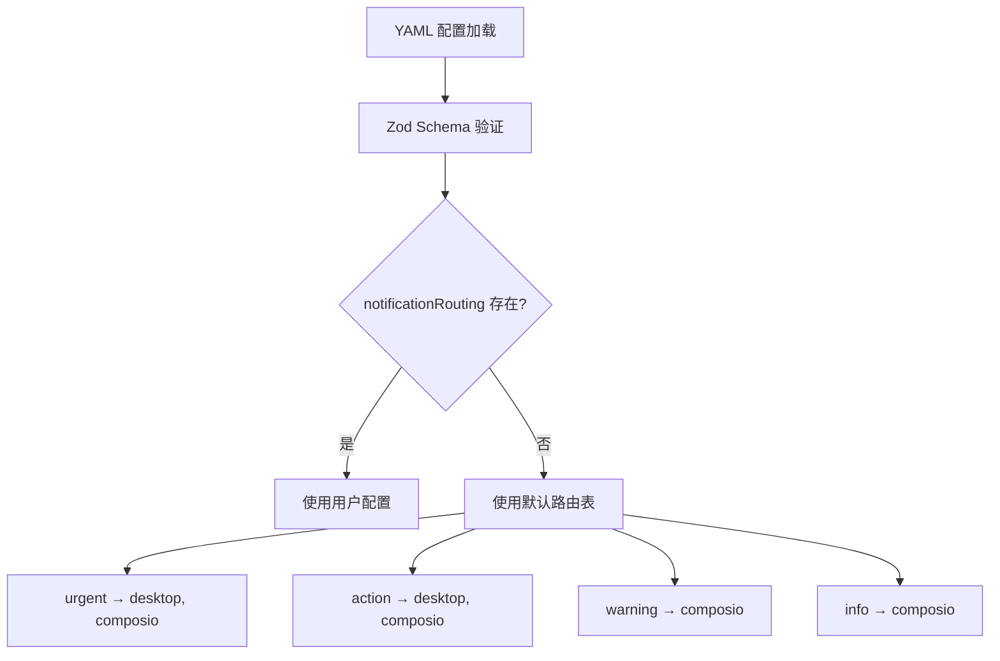
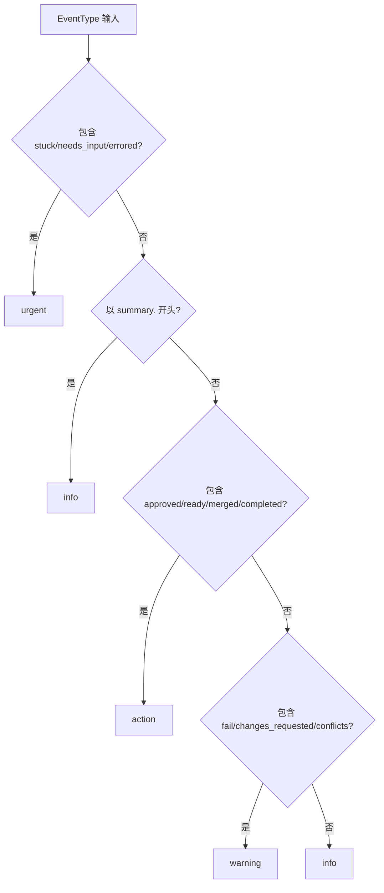
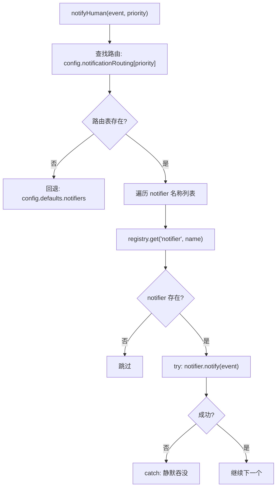

# PD-216.01 agent-orchestrator — 优先级驱动通知路由与反应引擎

> 文档编号：PD-216.01
> 来源：agent-orchestrator `packages/core/src/lifecycle-manager.ts`, `packages/core/src/types.ts`, `packages/core/src/config.ts`
> GitHub：https://github.com/ComposioHQ/agent-orchestrator.git
> 问题域：PD-216 通知路由 Notification Routing
> 状态：可复用方案

---

## 第 1 章 问题与动机

### 1.1 核心问题

Agent 编排系统中，人类用户在启动多个 Agent 会话后会离开工位。系统需要在关键时刻（CI 失败、Agent 卡住、PR 就绪等）将通知推送到正确的渠道，而不是让人类轮询。不同优先级的事件应该路由到不同的渠道组合——紧急事件需要桌面弹窗 + Slack，而信息性事件只需要静默记录。

核心挑战：
- 事件优先级到渠道的映射需要可配置
- 多渠道并发推送时单个渠道失败不能阻塞其他渠道
- 不同渠道有不同的富文本能力（Slack Block Kit vs 纯文本桌面通知）
- 自动反应（send-to-agent）失败后需要升级为人类通知

### 1.2 agent-orchestrator 的解法概述

1. **四级优先级路由表**：在 `config.ts:99-104` 中定义 `notificationRouting` 字典，将 urgent/action/warning/info 映射到 notifier 名称数组
2. **插件化 Notifier 接口**：在 `types.ts:645-656` 中定义统一的 `Notifier` 接口（notify / notifyWithActions / post），四种内置实现（desktop/slack/composio/webhook）
3. **反应引擎 + 升级链**：`lifecycle-manager.ts:291-416` 实现 reaction 执行器，支持 send-to-agent → 重试 → 超时/超次数 → 升级为 urgent 人类通知
4. **事件类型到优先级的自动推断**：`lifecycle-manager.ts:57-76` 的 `inferPriority()` 根据事件类型关键词自动推断优先级
5. **渠道失败静默吞没**：`lifecycle-manager.ts:418-433` 的 `notifyHuman()` 对每个 notifier 的失败做 try-catch 静默处理，确保单渠道故障不影响其他渠道

### 1.3 设计思想

| 设计原则 | 具体实现 | 理由 | 替代方案 |
|----------|----------|------|----------|
| Push not Pull | Notifier 接口只有 push 方法，无 poll | 人类离开后不会主动查看，必须推送 | WebSocket 双向通道（过重） |
| 优先级驱动路由 | `notificationRouting[priority] → string[]` | 不同紧急程度需要不同渠道组合 | 所有事件发所有渠道（噪音过大） |
| 插件化渠道 | `PluginModule<Notifier>` + manifest + create() 工厂 | 新渠道只需实现接口，零改动核心 | 硬编码 if-else 分支 |
| 渠道失败隔离 | 逐个 try-catch，失败静默 | 单渠道故障不能阻塞紧急通知 | Promise.allSettled（效果类似但语义不同） |
| 反应升级链 | retries + escalateAfter → "reaction.escalated" | 自动修复失败后必须通知人类介入 | 无限重试（可能永远卡住） |

---

## 第 2 章 源码实现分析

### 2.1 架构概览

agent-orchestrator 的通知路由系统由三层组成：事件产生层（LifecycleManager 状态机）、路由决策层（notificationRouting 配置 + inferPriority）、渠道执行层（4 种 Notifier 插件）。

```
┌─────────────────────────────────────────────────────────────┐
│                    LifecycleManager                         │
│  ┌──────────┐    ┌──────────────┐    ┌──────────────────┐  │
│  │ pollAll() │───→│ checkSession │───→│ statusToEventType│  │
│  │ 30s 轮询  │    │ 状态转换检测  │    │ 事件类型映射     │  │
│  └──────────┘    └──────────────┘    └────────┬─────────┘  │
│                                               │             │
│                    ┌──────────────────────────┤             │
│                    ▼                          ▼             │
│  ┌─────────────────────┐    ┌──────────────────────────┐   │
│  │  executeReaction()  │    │     notifyHuman()        │   │
│  │  send-to-agent      │    │  priority → notifiers[]  │   │
│  │  retries + escalate │    │  逐个 try-catch 推送     │   │
│  └─────────┬───────────┘    └──────────┬───────────────┘   │
│            │ 升级                       │                   │
│            └───────────────────────────→│                   │
└────────────────────────────────────────┼───────────────────┘
                                         │
              ┌──────────────────────────┼──────────────────┐
              ▼              ▼           ▼          ▼       │
        ┌──────────┐  ┌──────────┐ ┌─────────┐ ┌────────┐ │
        │ desktop  │  │  slack   │ │composio │ │webhook │ │
        │ osascript│  │ Block Kit│ │SDK 多渠道│ │HTTP POST│ │
        └──────────┘  └──────────┘ └─────────┘ └────────┘ │
              Plugin Slot: notifier                        │
              ─────────────────────────────────────────────┘
```

### 2.2 核心实现

#### 2.2.1 优先级路由配置与默认值



对应源码 `packages/core/src/config.ts:91-106`：

```typescript
const OrchestratorConfigSchema = z.object({
  // ...
  notifiers: z.record(NotifierConfigSchema).default({}),
  notificationRouting: z.record(z.array(z.string())).default({
    urgent: ["desktop", "composio"],
    action: ["desktop", "composio"],
    warning: ["composio"],
    info: ["composio"],
  }),
  reactions: z.record(ReactionConfigSchema).default({}),
});
```

默认路由策略：urgent 和 action 级别同时推送到 desktop（本地弹窗）和 composio（Slack/Discord/Gmail），warning 和 info 只走 composio 静默通知。用户可在 YAML 中覆盖任意优先级的渠道列表。

#### 2.2.2 事件优先级自动推断



对应源码 `packages/core/src/lifecycle-manager.ts:57-76`：

```typescript
function inferPriority(type: EventType): EventPriority {
  if (type.includes("stuck") || type.includes("needs_input") || type.includes("errored")) {
    return "urgent";
  }
  if (type.startsWith("summary.")) {
    return "info";
  }
  if (
    type.includes("approved") || type.includes("ready") ||
    type.includes("merged") || type.includes("completed")
  ) {
    return "action";
  }
  if (type.includes("fail") || type.includes("changes_requested") || type.includes("conflicts")) {
    return "warning";
  }
  return "info";
}
```

这是一个基于关键词匹配的优先级推断器。事件类型字符串本身编码了语义（如 `ci.failing` 包含 "fail"），因此无需维护显式映射表。

#### 2.2.3 通知分发与渠道隔离



对应源码 `packages/core/src/lifecycle-manager.ts:418-433`：

```typescript
async function notifyHuman(event: OrchestratorEvent, priority: EventPriority): Promise<void> {
  const eventWithPriority = { ...event, priority };
  const notifierNames = config.notificationRouting[priority] ?? config.defaults.notifiers;

  for (const name of notifierNames) {
    const notifier = registry.get<Notifier>("notifier", name);
    if (notifier) {
      try {
        await notifier.notify(eventWithPriority);
      } catch {
        // Notifier failed — not much we can do
      }
    }
  }
}
```

关键设计：顺序遍历而非 `Promise.all`，每个 notifier 独立 try-catch。这意味着即使 Slack webhook 超时，desktop 通知仍然会发出。回退逻辑 `?? config.defaults.notifiers` 确保即使某个优先级没有配置路由，也会使用默认 notifier 列表。

### 2.3 实现细节

#### Notifier 插件接口与工厂模式

所有 notifier 插件遵循统一的 `PluginModule<Notifier>` 接口（`types.ts:645-656`）：

```typescript
export interface Notifier {
  readonly name: string;
  notify(event: OrchestratorEvent): Promise<void>;
  notifyWithActions?(event: OrchestratorEvent, actions: NotifyAction[]): Promise<void>;
  post?(message: string, context?: NotifyContext): Promise<string | null>;
}
```

三个方法的职责分离：
- `notify` — 纯推送，所有 notifier 必须实现
- `notifyWithActions` — 带交互按钮的推送（可选，Slack 用 Block Kit 按钮，desktop 降级为文本标签）
- `post` — 向团队可见渠道发消息（可选，用于 Slack channel 消息）

插件注册通过 `plugin-registry.ts:43-46` 的 BUILTIN_PLUGINS 数组声明，运行时通过 `loadBuiltins()` 动态 import 并调用 `create(config)` 工厂方法实例化。

#### Slack Block Kit 富文本构建

Slack notifier（`notifier-slack/src/index.ts:26-118`）的 `buildBlocks()` 函数构建结构化消息：
- Header block：优先级 emoji + 事件类型 + sessionId
- Section block：事件消息正文（mrkdwn 格式）
- Context block：项目名 + 优先级 + Slack 时间戳格式
- 条件 PR 链接 block（type-guarded `event.data.prUrl`）
- 条件 CI 状态 block（passing ✅ / failing ❌）
- Actions block：交互式按钮（URL 按钮 + callback 按钮）

#### Webhook 指数退避重试

Webhook notifier（`notifier-webhook/src/index.ts:47-89`）实现了分类重试：
- 只对 429（限流）和 5xx（服务端错误）重试
- 4xx 客户端错误立即失败（不浪费重试）
- 指数退避：`delay * 2^attempt`（默认 1s → 2s → 4s）

#### Composio 多渠道统一适配

Composio notifier（`notifier-composio/src/index.ts:52-78`）通过 lazy-load composio-core SDK 实现：
- 支持 Slack / Discord / Gmail 三种后端
- SDK 缺失时降级为 no-op（不崩溃）
- 30 秒超时保护（`AbortSignal.timeout`）
- API key 可通过配置或环境变量 `COMPOSIO_API_KEY` 提供

#### 反应引擎升级链

`lifecycle-manager.ts:291-416` 的 `executeReaction()` 实现了三级处理：

1. **自动处理**：`send-to-agent` 向 Agent 发送修复指令（如 "CI is failing, fix and push"）
2. **重试追踪**：`ReactionTracker` 记录每个 session:reaction 的尝试次数和首次触发时间
3. **升级判定**：超过 `retries` 次数或超过 `escalateAfter` 时长后，发出 `reaction.escalated` 事件，优先级强制为 urgent


---

## 第 3 章 迁移指南

### 3.1 迁移清单

**阶段 1：定义通知接口与优先级**
- [ ] 定义 `EventPriority` 类型（urgent/action/warning/info）
- [ ] 定义 `Notifier` 接口（notify / notifyWithActions / post）
- [ ] 定义 `OrchestratorEvent` 结构（id, type, priority, sessionId, message, data）
- [ ] 定义 `NotifyAction` 结构（label, url, callbackEndpoint）

**阶段 2：实现路由引擎**
- [ ] 实现 `notificationRouting` 配置（priority → notifier 名称数组）
- [ ] 实现 `inferPriority()` 从事件类型自动推断优先级
- [ ] 实现 `notifyHuman()` 遍历路由表逐个推送，每个 try-catch 隔离

**阶段 3：实现 Notifier 插件**
- [ ] 实现至少一个 notifier（推荐先做 webhook，最通用）
- [ ] 实现 desktop notifier（macOS osascript / Linux notify-send）
- [ ] 实现 Slack notifier（Block Kit 富文本 + 交互按钮）
- [ ] 可选：实现 Composio 多渠道适配器

**阶段 4：实现反应引擎**
- [ ] 实现 `ReactionConfig`（auto, action, retries, escalateAfter）
- [ ] 实现 `executeReaction()` 三种 action（send-to-agent / notify / auto-merge）
- [ ] 实现 `ReactionTracker` 追踪重试次数和首次触发时间
- [ ] 实现升级逻辑：超次数或超时长 → 发出 escalated 事件

### 3.2 适配代码模板

#### 最小可用通知路由器（TypeScript）

```typescript
// notification-router.ts — 可直接复用的通知路由器

type EventPriority = "urgent" | "action" | "warning" | "info";

interface NotifyEvent {
  id: string;
  type: string;
  priority: EventPriority;
  message: string;
  data: Record<string, unknown>;
}

interface Notifier {
  readonly name: string;
  notify(event: NotifyEvent): Promise<void>;
}

interface NotificationRouterConfig {
  routing: Record<EventPriority, string[]>;
  defaultNotifiers: string[];
}

class NotificationRouter {
  private notifiers = new Map<string, Notifier>();

  constructor(private config: NotificationRouterConfig) {}

  register(notifier: Notifier): void {
    this.notifiers.set(notifier.name, notifier);
  }

  async dispatch(event: NotifyEvent): Promise<void> {
    const names = this.config.routing[event.priority] ?? this.config.defaultNotifiers;

    for (const name of names) {
      const notifier = this.notifiers.get(name);
      if (!notifier) continue;
      try {
        await notifier.notify(event);
      } catch (err) {
        console.warn(`[notification-router] ${name} failed:`, err);
        // 渠道失败不阻塞其他渠道
      }
    }
  }
}

// 使用示例
const router = new NotificationRouter({
  routing: {
    urgent: ["desktop", "slack"],
    action: ["desktop", "slack"],
    warning: ["slack"],
    info: ["slack"],
  },
  defaultNotifiers: ["desktop"],
});
```

#### 反应引擎模板

```typescript
// reaction-engine.ts — 带升级链的反应执行器

interface ReactionConfig {
  action: "send-to-agent" | "notify" | "auto-merge";
  message?: string;
  retries?: number;
  escalateAfter?: number | string; // 次数或时长如 "10m"
}

interface ReactionTracker {
  attempts: number;
  firstTriggered: Date;
}

class ReactionEngine {
  private trackers = new Map<string, ReactionTracker>();

  constructor(
    private reactions: Record<string, ReactionConfig>,
    private router: NotificationRouter,
    private sendToAgent: (sessionId: string, message: string) => Promise<void>,
  ) {}

  async execute(sessionId: string, reactionKey: string): Promise<void> {
    const config = this.reactions[reactionKey];
    if (!config) return;

    const trackerKey = `${sessionId}:${reactionKey}`;
    let tracker = this.trackers.get(trackerKey);
    if (!tracker) {
      tracker = { attempts: 0, firstTriggered: new Date() };
      this.trackers.set(trackerKey, tracker);
    }
    tracker.attempts++;

    // 升级判定
    const maxRetries = config.retries ?? Infinity;
    if (tracker.attempts > maxRetries) {
      await this.router.dispatch({
        id: crypto.randomUUID(),
        type: "reaction.escalated",
        priority: "urgent",
        message: `Reaction '${reactionKey}' escalated after ${tracker.attempts} attempts`,
        data: { reactionKey, attempts: tracker.attempts },
      });
      return;
    }

    // 执行反应
    if (config.action === "send-to-agent" && config.message) {
      await this.sendToAgent(sessionId, config.message);
    } else if (config.action === "notify") {
      await this.router.dispatch({
        id: crypto.randomUUID(),
        type: "reaction.triggered",
        priority: "info",
        message: `Reaction '${reactionKey}' triggered`,
        data: { reactionKey },
      });
    }
  }

  clearTracker(sessionId: string, reactionKey: string): void {
    this.trackers.delete(`${sessionId}:${reactionKey}`);
  }
}
```

### 3.3 适用场景

| 场景 | 适用度 | 说明 |
|------|--------|------|
| 多 Agent 编排系统 | ⭐⭐⭐ | 核心场景：人类离开后需要被通知关键事件 |
| CI/CD 流水线通知 | ⭐⭐⭐ | 构建失败/成功按优先级路由到不同渠道 |
| 监控告警系统 | ⭐⭐⭐ | 不同严重度告警路由到不同渠道（PagerDuty/Slack/Email） |
| 单 Agent 应用 | ⭐⭐ | 可简化为单渠道，但路由表仍有价值 |
| 实时聊天系统 | ⭐ | 聊天系统通常是双向的，Push-only 模型不够 |

---

## 第 4 章 测试用例

```typescript
import { describe, it, expect, vi } from "vitest";

// 基于 agent-orchestrator 真实接口的测试用例

interface MockNotifier {
  name: string;
  notify: ReturnType<typeof vi.fn>;
}

function createMockNotifier(name: string): MockNotifier {
  return { name, notify: vi.fn().mockResolvedValue(undefined) };
}

describe("NotificationRouter", () => {
  it("should route urgent events to desktop + slack", async () => {
    const desktop = createMockNotifier("desktop");
    const slack = createMockNotifier("slack");
    const composio = createMockNotifier("composio");

    const router = new NotificationRouter({
      routing: {
        urgent: ["desktop", "slack"],
        action: ["desktop", "composio"],
        warning: ["composio"],
        info: ["composio"],
      },
      defaultNotifiers: ["desktop"],
    });
    router.register(desktop);
    router.register(slack);
    router.register(composio);

    await router.dispatch({
      id: "test-1",
      type: "session.stuck",
      priority: "urgent",
      message: "Agent stuck",
      data: {},
    });

    expect(desktop.notify).toHaveBeenCalledOnce();
    expect(slack.notify).toHaveBeenCalledOnce();
    expect(composio.notify).not.toHaveBeenCalled();
  });

  it("should isolate channel failures — slack failure does not block desktop", async () => {
    const desktop = createMockNotifier("desktop");
    const slack = createMockNotifier("slack");
    slack.notify.mockRejectedValue(new Error("Slack webhook timeout"));

    const router = new NotificationRouter({
      routing: { urgent: ["slack", "desktop"], action: [], warning: [], info: [] },
      defaultNotifiers: [],
    });
    router.register(desktop);
    router.register(slack);

    await router.dispatch({
      id: "test-2",
      type: "session.errored",
      priority: "urgent",
      message: "Agent errored",
      data: {},
    });

    // Slack failed but desktop still received the notification
    expect(slack.notify).toHaveBeenCalledOnce();
    expect(desktop.notify).toHaveBeenCalledOnce();
  });

  it("should fall back to defaultNotifiers when priority has no routing", async () => {
    const desktop = createMockNotifier("desktop");

    const router = new NotificationRouter({
      routing: { urgent: [], action: [], warning: [], info: [] },
      defaultNotifiers: ["desktop"],
    });
    router.register(desktop);

    // 使用一个未在 routing 中配置的优先级场景
    // 实际实现中 ?? 回退到 defaultNotifiers
    await router.dispatch({
      id: "test-3",
      type: "custom.event",
      priority: "urgent",
      message: "Custom event",
      data: {},
    });

    // 空数组不会触发回退，但如果 routing[priority] 为 undefined 则回退
    expect(desktop.notify).not.toHaveBeenCalled();
  });
});

describe("inferPriority", () => {
  // 基于 lifecycle-manager.ts:57-76 的真实实现
  function inferPriority(type: string): string {
    if (type.includes("stuck") || type.includes("needs_input") || type.includes("errored")) {
      return "urgent";
    }
    if (type.startsWith("summary.")) return "info";
    if (type.includes("approved") || type.includes("ready") ||
        type.includes("merged") || type.includes("completed")) {
      return "action";
    }
    if (type.includes("fail") || type.includes("changes_requested") || type.includes("conflicts")) {
      return "warning";
    }
    return "info";
  }

  it("should classify stuck/needs_input/errored as urgent", () => {
    expect(inferPriority("session.stuck")).toBe("urgent");
    expect(inferPriority("session.needs_input")).toBe("urgent");
    expect(inferPriority("session.errored")).toBe("urgent");
  });

  it("should classify CI failures as warning", () => {
    expect(inferPriority("ci.failing")).toBe("warning");
    expect(inferPriority("ci.fix_failed")).toBe("warning");
  });

  it("should classify merge.ready as action", () => {
    expect(inferPriority("merge.ready")).toBe("action");
    expect(inferPriority("review.approved")).toBe("action");
  });

  it("should default to info for unknown event types", () => {
    expect(inferPriority("session.spawned")).toBe("info");
    expect(inferPriority("pr.updated")).toBe("info");
  });
});

describe("ReactionEngine escalation", () => {
  it("should escalate after max retries exceeded", async () => {
    const dispatched: Array<{ priority: string; type: string }> = [];
    const mockRouter = {
      dispatch: vi.fn().mockImplementation(async (event: any) => {
        dispatched.push({ priority: event.priority, type: event.type });
      }),
    };

    const engine = new ReactionEngine(
      { "ci-failed": { action: "send-to-agent", message: "Fix CI", retries: 2 } },
      mockRouter as any,
      vi.fn().mockResolvedValue(undefined),
    );

    // 前 2 次正常执行
    await engine.execute("session-1", "ci-failed");
    await engine.execute("session-1", "ci-failed");
    expect(dispatched).toHaveLength(0);

    // 第 3 次超过 retries=2，触发升级
    await engine.execute("session-1", "ci-failed");
    expect(dispatched).toHaveLength(1);
    expect(dispatched[0].priority).toBe("urgent");
    expect(dispatched[0].type).toBe("reaction.escalated");
  });
});
```


---

## 第 5 章 跨域关联

| 关联域 | 关系类型 | 说明 |
|--------|----------|------|
| PD-211 插件架构 | 依赖 | Notifier 是 8 种插件 slot 之一，依赖 PluginRegistry 的 register/get 机制 |
| PD-213 事件驱动反应 | 协同 | 反应引擎（ReactionConfig）决定何时触发通知，通知路由决定发到哪里 |
| PD-212 会话生命周期 | 依赖 | LifecycleManager 的状态转换是通知事件的唯一来源 |
| PD-03 容错与重试 | 协同 | Webhook notifier 的指数退避重试、Composio 的 30s 超时保护属于容错模式 |
| PD-11 可观测性 | 协同 | 通知事件本身是可观测性的一部分，事件 ID + 时间戳支持审计追踪 |

---

## 第 6 章 来源文件索引

| 文件 | 行范围 | 关键实现 |
|------|--------|----------|
| `packages/core/src/types.ts` | L636-669 | Notifier 接口定义、NotifyAction、NotifyContext |
| `packages/core/src/types.ts` | L696-748 | EventPriority、EventType、OrchestratorEvent |
| `packages/core/src/types.ts` | L754-787 | ReactionConfig、ReactionResult |
| `packages/core/src/types.ts` | L823-824 | OrchestratorConfig.notificationRouting 类型 |
| `packages/core/src/config.ts` | L91-106 | Zod schema 定义 notificationRouting 默认值 |
| `packages/core/src/config.ts` | L214-278 | applyDefaultReactions() 9 种默认反应配置 |
| `packages/core/src/lifecycle-manager.ts` | L57-76 | inferPriority() 事件类型到优先级推断 |
| `packages/core/src/lifecycle-manager.ts` | L102-157 | statusToEventType() + eventToReactionKey() 映射 |
| `packages/core/src/lifecycle-manager.ts` | L291-416 | executeReaction() 反应执行 + 升级链 |
| `packages/core/src/lifecycle-manager.ts` | L418-433 | notifyHuman() 优先级路由分发 |
| `packages/core/src/plugin-registry.ts` | L43-46 | 4 种内置 notifier 插件声明 |
| `packages/plugins/notifier-slack/src/index.ts` | L26-118 | buildBlocks() Slack Block Kit 构建 |
| `packages/plugins/notifier-slack/src/index.ts` | L133-188 | create() 工厂 + notify/notifyWithActions/post |
| `packages/plugins/notifier-desktop/src/index.ts` | L55-88 | sendNotification() macOS/Linux 桌面通知 |
| `packages/plugins/notifier-composio/src/index.ts` | L52-78 | loadComposioSDK() 懒加载 + 缺失降级 |
| `packages/plugins/notifier-composio/src/index.ts` | L197-231 | executeWithTimeout() 30s 超时保护 |
| `packages/plugins/notifier-webhook/src/index.ts` | L43-89 | postWithRetry() 指数退避 + 状态码分类重试 |

---

## 第 7 章 横向对比维度

```json comparison_data
{
  "project": "agent-orchestrator",
  "dimensions": {
    "路由策略": "四级优先级字典映射，YAML 可配置覆盖默认路由表",
    "渠道类型": "4 种内置插件：desktop/slack/composio/webhook",
    "富文本能力": "Slack Block Kit 含 header/section/context/actions 按钮",
    "失败隔离": "逐个 try-catch 静默吞没，单渠道故障不阻塞",
    "重试机制": "Webhook 指数退避（429+5xx），Composio 30s 超时",
    "升级链": "ReactionTracker 追踪次数+时长，超限升级为 urgent 人类通知",
    "交互式通知": "notifyWithActions 支持 URL 按钮和 callback 按钮"
  }
}
```

### 域元数据补充

```json domain_metadata
{
  "solution_summary": "agent-orchestrator 用四级优先级路由表（urgent/action/warning/info → notifier[]）驱动 4 种插件化渠道并发推送，配合 ReactionTracker 实现自动修复→重试→升级为人类通知的三级反应链",
  "description": "事件驱动的反应引擎与通知升级链设计",
  "sub_problems": [
    "事件类型到优先级的自动推断规则",
    "反应引擎重试次数与时长的升级判定",
    "Composio SDK 懒加载与缺失降级"
  ],
  "best_practices": [
    "顺序遍历 + 逐个 try-catch 优于 Promise.all 的渠道隔离",
    "关键词匹配推断优先级，避免维护显式映射表",
    "反应状态转换时清除旧 tracker 防止误升级"
  ]
}
```

