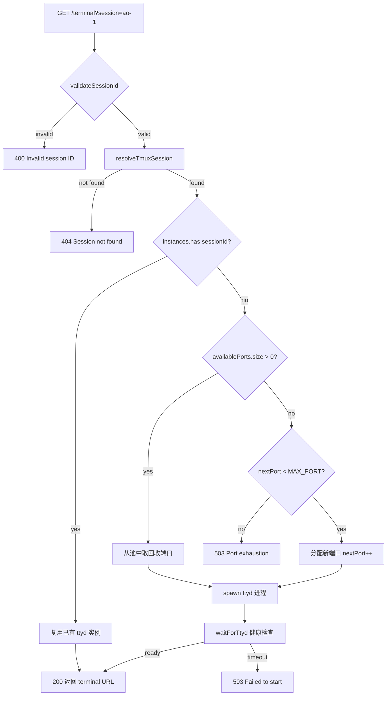

# PD-217.01 agent-orchestrator — Web 终端双通道架构

> 文档编号：PD-217.01
> 来源：agent-orchestrator `packages/web/server/terminal-websocket.ts` `packages/web/server/direct-terminal-ws.ts` `packages/web/server/tmux-utils.ts`
> GitHub：https://github.com/ComposioHQ/agent-orchestrator.git
> 问题域：PD-217 Web 终端集成 Web Terminal Integration
> 状态：可复用方案

---

## 第 1 章 问题与动机

### 1.1 核心问题

Web 应用需要在浏览器中提供完整的终端交互能力，让用户直接操作 Agent 运行所在的 tmux session。这涉及三个层面的挑战：

1. **进程管理**：每个终端 session 需要独立的后端进程（ttyd 或 node-pty），按需创建、健康检查、异常回收
2. **端口资源**：多终端并发时端口分配必须避免冲突和 TIME_WAIT 泄漏，需要池化管理
3. **终端协议兼容**：浏览器端 xterm.js 与 tmux 之间存在协议缺口（如 XDA/XTVERSION），导致剪贴板等功能失效

agent-orchestrator 的独特之处在于它提供了**两套并行方案**——ttyd iframe 方案和 node-pty 直连方案——并通过实际调试发现了 xterm.js 缺失 XDA 响应导致 tmux 剪贴板不工作的根因，最终在直连方案中修复。

### 1.2 agent-orchestrator 的解法概述

1. **双通道架构**：ttyd iframe（端口 14800）作为稳定基线，node-pty WebSocket 直连（端口 14801）作为增强方案，两者可独立运行（`terminal-websocket.ts:1-14`, `direct-terminal-ws.ts:1-8`）
2. **端口池化回收**：7800-7900 范围内的端口池，优先复用已回收端口，仅在 clean exit 时回收以避免 TIME_WAIT 污染（`terminal-websocket.ts:31-33, 181-186`）
3. **tmux session 名称解析**：支持精确匹配和 12 位 hex hash 前缀的模糊匹配，用 `=` 前缀语法防止 tmux 的前缀匹配误命中（`tmux-utils.ts:68-102`）
4. **XDA 协议补丁**：在 xterm.js 中注册 CSI > q 处理器，响应 `XTerm(370)` 使 tmux 启用 TTYC_MS 剪贴板能力（`DirectTerminal.tsx:138-149`）
5. **Graceful shutdown**：信号处理 + 5 秒强制退出 + `unref()` 防止 timer 阻塞进程退出（`terminal-websocket.ts:317-336`）

### 1.3 设计思想

| 设计原则 | 具体实现 | 理由 | 替代方案 |
|----------|----------|------|----------|
| 双通道渐进增强 | ttyd iframe 为基线，node-pty 直连为增强 | ttyd 成熟稳定但不可定制；直连方案可注入协议补丁 | 仅用 ttyd（无法修复 XDA）或仅用 node-pty（缺少 ttyd 的成熟度） |
| 端口池化 + 条件回收 | Set 存储可用端口，仅 exit code 0 时回收 | 异常退出的端口可能处于 TIME_WAIT，复用会导致 EADDRINUSE | 固定端口映射（不支持动态扩缩）或随机端口（无法控制范围） |
| 精确匹配优先 | `=sessionId` 语法 + hash 前缀 fallback | tmux 默认前缀匹配会导致 "ao-1" 误命中 "ao-15" | 仅用 list-sessions 遍历（每次多一次 exec 开销） |
| 进程引用守卫 | `activeSessions.get(id)?.pty === pty` 检查 | 防止旧连接的 exit/error 回调删除新连接的 session 条目 | 无守卫（会导致竞态条件下 session 丢失） |
| once() 替代 on() | `proc.once("exit")` 和 `proc.once("error")` | exit 和 error 可能同时触发，on() 会导致双重清理 | on() + 手动 flag 去重（更复杂） |

---

## 第 2 章 源码实现分析

### 2.1 架构概览

agent-orchestrator 的 Web 终端系统由三层组成：前端组件层、WebSocket/HTTP 服务层、tmux 工具层。

```
┌─────────────────────────────────────────────────────────────┐
│                    Browser (Next.js)                         │
│  ┌──────────────────┐    ┌───────────────────────────────┐  │
│  │  Terminal.tsx     │    │  DirectTerminal.tsx            │  │
│  │  (iframe → ttyd)  │    │  (xterm.js + WebSocket)       │  │
│  │  port: 14800 API  │    │  port: 14801 WS               │  │
│  │                   │    │  + XDA CSI > q handler         │  │
│  └────────┬──────────┘    └────────────┬──────────────────┘  │
│           │                            │                     │
└───────────┼────────────────────────────┼─────────────────────┘
            │ HTTP GET /terminal         │ WebSocket /ws?session=
            ▼                            ▼
┌──────────────────────┐    ┌───────────────────────────────┐
│ terminal-websocket.ts│    │ direct-terminal-ws.ts         │
│ (ttyd 进程管理器)     │    │ (node-pty 直连服务器)          │
│                      │    │                               │
│ ┌──────────────────┐ │    │ ┌───────────────────────────┐ │
│ │ Port Pool        │ │    │ │ activeSessions Map        │ │
│ │ 7800-7900        │ │    │ │ sessionId → {pty, ws}     │ │
│ │ availablePorts   │ │    │ └───────────────────────────┘ │
│ │ nextPort counter │ │    │                               │
│ └──────────────────┘ │    │ node-pty spawn:               │
│                      │    │ tmux attach-session -t <sid>  │
│ spawn ttyd per sess  │    │                               │
│ waitForTtyd health   │    │ PTY ↔ WebSocket 双向桥接      │
└──────────┬───────────┘    └──────────────┬────────────────┘
           │                               │
           ▼                               ▼
┌─────────────────────────────────────────────────────────────┐
│                    tmux-utils.ts                             │
│  findTmux()          — 多路径探测 tmux 二进制               │
│  validateSessionId() — 正则防注入                            │
│  resolveTmuxSession()— 精确匹配 + hash 前缀 fallback        │
└─────────────────────────────────────────────────────────────┘
           │
           ▼
┌─────────────────────────────────────────────────────────────┐
│                    tmux sessions                             │
│  ao-1, ao-2, 8474d6f29887-ao-15, ...                        │
└─────────────────────────────────────────────────────────────┘
```

### 2.2 核心实现

#### 2.2.1 ttyd 进程池管理



对应源码 `terminal-websocket.ts:114-208`：

```typescript
function getOrSpawnTtyd(sessionId: string, tmuxSessionName: string): TtydInstance {
  const existing = instances.get(sessionId);
  if (existing) return existing;

  // Allocate port: reuse from pool if available, otherwise increment
  let port: number;
  if (availablePorts.size > 0) {
    port = availablePorts.values().next().value as number;
    availablePorts.delete(port);
  } else {
    if (nextPort >= MAX_PORT) {
      throw new Error(`Port exhaustion: reached maximum of ${MAX_PORT - 7800} terminal instances`);
    }
    port = nextPort++;
  }

  const proc = spawn("ttyd", [
    "--writable", "--port", String(port),
    "--base-path", `/${sessionId}`,
    TMUX, "attach-session", "-t", tmuxSessionName,
  ], { stdio: ["ignore", "pipe", "pipe"] });

  // Use once() to prevent race condition when both exit and error fire
  proc.once("exit", (code) => {
    const current = instances.get(sessionId);
    if (current?.process === proc) {
      instances.delete(sessionId);
      // Only recycle port on clean exit — failed processes may leave TIME_WAIT
      if (code === 0) {
        availablePorts.add(port);
      }
    }
  });

  proc.once("error", (err) => {
    const current = instances.get(sessionId);
    if (current?.process === proc) {
      instances.delete(sessionId);
      // Don't recycle port on error
    }
    try { proc.kill(); } catch { /* already dead */ }
  });

  const instance: TtydInstance = { sessionId, port, process: proc };
  instances.set(sessionId, instance);
  return instance;
}
```

#### 2.2.2 node-pty 直连与 XDA 协议补丁

```mermaid
graph TD
    A[Browser: new WebSocket /ws?session=ao-1] --> B{validateSessionId}
    B -->|invalid| C[close 1008]
    B -->|valid| D[resolveTmuxSession]
    D -->|not found| E[close 1008]
    D -->|found| F[ptySpawn tmux attach-session]
    F --> G[双向桥接: PTY ↔ WebSocket]
    G --> H[PTY onData → ws.send]
    G --> I[ws onMessage → pty.write]
    I --> J{message starts with '{'?}
    J -->|JSON resize| K[pty.resize cols, rows]
    J -->|terminal input| L[pty.write message]
    G --> M[tmux sends CSI > q]
    M --> N[xterm.js CSI handler]
    N --> O[respond XTerm 370]
    O --> P[tmux enables TTYC_MS clipboard]
```

对应源码 `direct-terminal-ws.ts:59-200` 和 `DirectTerminal.tsx:136-149`：

```typescript
// Server side: node-pty spawn and bidirectional bridge
// direct-terminal-ws.ts:119-178
pty = ptySpawn(TMUX, ["attach-session", "-t", tmuxSessionId], {
  name: "xterm-256color",
  cols: 80, rows: 24,
  cwd: homeDir, env,
});

// PTY -> WebSocket
pty.onData((data) => {
  if (ws.readyState === WebSocket.OPEN) ws.send(data);
});

// WebSocket -> PTY (with resize message detection)
ws.on("message", (data) => {
  const message = data.toString("utf8");
  if (message.startsWith("{")) {
    try {
      const parsed = JSON.parse(message);
      if (parsed.type === "resize" && parsed.cols && parsed.rows) {
        pty.resize(parsed.cols, parsed.rows);
        return;
      }
    } catch { /* Not JSON, treat as terminal input */ }
  }
  pty.write(message);
});

// Client side: XDA protocol patch
// DirectTerminal.tsx:138-149
terminal.parser.registerCsiHandler(
  { prefix: ">", final: "q" }, // CSI > q is XTVERSION / XDA
  () => {
    terminal.write("\x1bP>|XTerm(370)\x1b\\");
    return true;
  },
);
```

### 2.3 实现细节

#### tmux session 名称解析的两阶段策略

`tmux-utils.ts:68-102` 实现了一个精巧的两阶段解析：

1. **精确匹配**：用 `tmux has-session -t =sessionId`，`=` 前缀是 tmux 的精确匹配语法，防止 "ao-1" 前缀匹配到 "ao-15"
2. **Hash 前缀 fallback**：遍历 `tmux list-sessions`，用正则 `/^[a-f0-9]{12}-/` 验证 12 位 hex 前缀，再比较 `s.substring(13) === sessionId`

这种设计源于 agent-orchestrator 的 config hash 机制——每个 session 的 tmux 名称可能被加上 12 位 hash 前缀（如 `8474d6f29887-ao-15`），但用户界面只展示 `ao-15`。

#### 进程引用守卫模式

在 `direct-terminal-ws.ts:148-158` 和 `terminal-websocket.ts:175-203` 中，所有清理回调都包含引用守卫：

```typescript
pty.onExit(({ exitCode }) => {
  // Guard: only delete if this pty is still the active one
  if (activeSessions.get(sessionId)?.pty === pty) {
    activeSessions.delete(sessionId);
  }
});
```

这防止了一个微妙的竞态：当旧连接的 PTY 退出时，新连接可能已经替换了 Map 中的条目。没有这个守卫，旧回调会错误地删除新连接的 session。

#### waitForTtyd 健康检查的资源安全

`terminal-websocket.ts:41-106` 的健康检查实现了完整的资源清理：

- `settled` flag 防止 resolve/reject 后继续轮询
- `cleanup()` 同时清理 timeout 和 pending HTTP request
- `req.destroy()` 确保不会泄漏 socket

---

## 第 3 章 迁移指南

### 3.1 迁移清单

**阶段 1：基础终端服务（ttyd iframe 方案）**

- [ ] 安装 ttyd（`brew install ttyd` 或从源码编译）
- [ ] 安装 tmux（`brew install tmux`）
- [ ] 实现端口池管理器（`PortPool` 类，范围可配置）
- [ ] 实现 ttyd 进程 spawn + 健康检查
- [ ] 实现 HTTP API（`GET /terminal?session=<id>` 返回 ttyd URL）
- [ ] 前端 iframe 嵌入组件
- [ ] Graceful shutdown 信号处理

**阶段 2：直连增强（node-pty 方案）**

- [ ] 安装 node-pty（`npm install node-pty`，需要 Node 20.x）
- [ ] 实现 WebSocket 服务器 + PTY 双向桥接
- [ ] 前端 xterm.js 组件 + 动态 import（避免 SSR）
- [ ] 注册 XDA CSI handler 修复 tmux 剪贴板
- [ ] resize 消息协议（JSON `{type: "resize", cols, rows}`）

**阶段 3：生产加固**

- [ ] Session ID 验证（正则白名单）
- [ ] tmux session 名称解析（精确匹配 + hash 前缀）
- [ ] 进程引用守卫（防竞态清理）
- [ ] CORS 策略（origin hostname 比对）
- [ ] 健康检查端点

### 3.2 适配代码模板

#### 端口池管理器（可直接复用）

```typescript
class PortPool {
  private available = new Set<number>();
  private nextPort: number;

  constructor(
    private readonly minPort: number = 7800,
    private readonly maxPort: number = 7900,
  ) {
    this.nextPort = minPort;
  }

  allocate(): number {
    // Prefer recycled ports
    if (this.available.size > 0) {
      const port = this.available.values().next().value as number;
      this.available.delete(port);
      return port;
    }
    if (this.nextPort >= this.maxPort) {
      throw new Error(`Port exhaustion: ${this.maxPort - this.minPort} max instances`);
    }
    return this.nextPort++;
  }

  /** Only recycle on clean exit to avoid TIME_WAIT reuse */
  recycle(port: number, cleanExit: boolean): void {
    if (cleanExit && port >= this.minPort && port < this.maxPort) {
      this.available.add(port);
    }
  }

  get activeCount(): number {
    return this.nextPort - this.minPort - this.available.size;
  }
}
```

#### XDA 协议补丁（xterm.js 端）

```typescript
import type { Terminal } from "xterm";

/**
 * Register XDA (Extended Device Attributes) handler on xterm.js.
 * Makes tmux recognize the terminal and enable clipboard (OSC 52).
 *
 * tmux sends CSI > q (XTVERSION) to query terminal type.
 * When it sees "XTerm(" in response, it sets TTYC_MS flag.
 */
function registerXdaHandler(terminal: Terminal): void {
  terminal.parser.registerCsiHandler(
    { prefix: ">", final: "q" },
    () => {
      // DCS > | XTerm(370) ST
      terminal.write("\x1bP>|XTerm(370)\x1b\\");
      return true;
    },
  );
}
```

#### tmux session 解析器（可直接复用）

```typescript
import { execFileSync } from "node:child_process";

const HASH_PREFIX = /^[a-f0-9]{12}-/;

function resolveTmuxSession(
  sessionId: string,
  tmuxPath: string,
): string | null {
  // Phase 1: exact match (= prefix prevents tmux prefix matching)
  try {
    execFileSync(tmuxPath, ["has-session", "-t", `=${sessionId}`], { timeout: 5000 });
    return sessionId;
  } catch { /* not exact */ }

  // Phase 2: hash-prefixed session lookup
  try {
    const output = execFileSync(
      tmuxPath, ["list-sessions", "-F", "#{session_name}"],
      { timeout: 5000, encoding: "utf8" },
    ) as string;
    const match = output.split("\n").filter(Boolean)
      .find(s => HASH_PREFIX.test(s) && s.substring(13) === sessionId);
    return match ?? null;
  } catch { return null; }
}
```

### 3.3 适用场景

| 场景 | 适用度 | 说明 |
|------|--------|------|
| Agent 编排平台的 Web 终端 | ⭐⭐⭐ | 核心场景，直接复用双通道架构 |
| 在线 IDE / Cloud Shell | ⭐⭐⭐ | 端口池 + node-pty 直连方案完全适用 |
| CI/CD 实时日志查看 | ⭐⭐ | 只需单向输出，可简化为只读 WebSocket |
| 教学平台沙箱终端 | ⭐⭐⭐ | tmux session 隔离 + 端口池化天然适合多用户 |
| 嵌入式设备远程调试 | ⭐ | ttyd 方案适用，但 node-pty 依赖 Node.js 运行时 |

---

## 第 4 章 测试用例

基于 `packages/web/server/__tests__/direct-terminal-ws.integration.test.ts` 的真实测试模式：

```typescript
import { describe, it, expect, beforeAll, afterAll, afterEach } from "vitest";
import { execFileSync } from "node:child_process";
import { WebSocket } from "ws";

// --- Port Pool Tests ---
describe("PortPool", () => {
  it("allocates sequential ports from min", () => {
    const pool = new PortPool(8000, 8010);
    expect(pool.allocate()).toBe(8000);
    expect(pool.allocate()).toBe(8001);
  });

  it("reuses recycled ports before allocating new ones", () => {
    const pool = new PortPool(8000, 8010);
    const p1 = pool.allocate(); // 8000
    pool.allocate();             // 8001
    pool.recycle(p1, true);      // return 8000
    expect(pool.allocate()).toBe(8000); // reuse
  });

  it("does not recycle on non-clean exit", () => {
    const pool = new PortPool(8000, 8010);
    const p1 = pool.allocate();
    pool.recycle(p1, false); // error exit
    expect(pool.allocate()).toBe(8001); // new port, not recycled
  });

  it("throws on port exhaustion", () => {
    const pool = new PortPool(8000, 8002); // only 2 ports
    pool.allocate();
    pool.allocate();
    expect(() => pool.allocate()).toThrow("Port exhaustion");
  });
});

// --- Session ID Validation ---
describe("validateSessionId", () => {
  it("accepts alphanumeric with hyphens", () => {
    expect(validateSessionId("ao-15")).toBe(true);
    expect(validateSessionId("test_session_1")).toBe(true);
  });

  it("rejects path traversal attempts", () => {
    expect(validateSessionId("../etc/passwd")).toBe(false);
    expect(validateSessionId("ao-1; rm -rf /")).toBe(false);
    expect(validateSessionId("ao-1`whoami`")).toBe(false);
    expect(validateSessionId("ao 1")).toBe(false);
  });
});

// --- tmux Session Resolution ---
describe("resolveTmuxSession", () => {
  const TMUX = findTmux();
  const SESSION = `test-resolve-${process.pid}`;

  beforeAll(() => {
    execFileSync(TMUX, ["new-session", "-d", "-s", SESSION, "-x", "80", "-y", "24"]);
  });
  afterAll(() => {
    try { execFileSync(TMUX, ["kill-session", "-t", SESSION]); } catch {}
  });

  it("resolves exact session name", () => {
    expect(resolveTmuxSession(SESSION, TMUX)).toBe(SESSION);
  });

  it("resolves hash-prefixed session by suffix", () => {
    const hashSession = `abcdef012345-${SESSION}`;
    execFileSync(TMUX, ["new-session", "-d", "-s", hashSession, "-x", "80", "-y", "24"]);
    try {
      expect(resolveTmuxSession(SESSION, TMUX)).toBe(hashSession);
    } finally {
      try { execFileSync(TMUX, ["kill-session", "-t", hashSession]); } catch {}
    }
  });

  it("returns null for non-existent session", () => {
    expect(resolveTmuxSession("nonexistent-xyz", TMUX)).toBeNull();
  });
});

// --- WebSocket Integration ---
describe("DirectTerminal WebSocket", () => {
  it("rejects connection without session parameter", async () => {
    const ws = new WebSocket(`ws://localhost:${port}/ws`);
    const { code } = await waitForWsClose(ws);
    expect(code).toBe(1008);
  });

  it("handles resize messages", async () => {
    const ws = await connectWs(TEST_SESSION);
    await waitForWsData(ws);
    ws.send(JSON.stringify({ type: "resize", cols: 120, rows: 40 }));
    // No error = resize handled successfully
    ws.close();
  });

  it("guards against stale session cleanup", async () => {
    // Connect, then reconnect with same session ID
    const ws1 = await connectWs(TEST_SESSION);
    await waitForWsData(ws1);
    ws1.close();
    // New connection should work without interference from ws1's cleanup
    const ws2 = await connectWs(TEST_SESSION);
    await waitForWsData(ws2);
    ws2.close();
  });
});
```

---

## 第 5 章 跨域关联

| 关联域 | 关系类型 | 说明 |
|--------|----------|------|
| PD-208 Session 生命周期 | 依赖 | 终端的 session ID 来自 session 管理系统，tmux session 的创建/销毁由 session 生命周期驱动 |
| PD-210 安全加固 | 协同 | session ID 验证（正则白名单）和 CORS 策略属于安全层面；TODO 中提到需要增加认证中间件 |
| PD-209 Agent 活动检测 | 协同 | 终端连接状态（health endpoint 的 active sessions）可作为 Agent 活动检测的信号源 |
| PD-204 工作区隔离 | 协同 | tmux session 天然提供进程级隔离，hash 前缀机制确保不同配置的 session 不会冲突 |
| PD-211 插件架构 | 依赖 | terminal-web 和 terminal-iterm2 作为插件存在，终端集成是插件系统的消费者 |

---

## 第 6 章 来源文件索引

| 文件 | 行范围 | 关键实现 |
|------|--------|----------|
| `packages/web/server/terminal-websocket.ts` | L1-L337 | ttyd 进程管理器：端口池、spawn、健康检查、CORS、graceful shutdown |
| `packages/web/server/terminal-websocket.ts` | L24-L33 | TtydInstance 接口 + 端口池数据结构（instances Map, availablePorts Set, nextPort） |
| `packages/web/server/terminal-websocket.ts` | L41-L106 | waitForTtyd 健康检查：HTTP 轮询 + 资源安全清理 |
| `packages/web/server/terminal-websocket.ts` | L114-L208 | getOrSpawnTtyd：端口分配、ttyd spawn、once() 清理、条件端口回收 |
| `packages/web/server/terminal-websocket.ts` | L317-L336 | graceful shutdown：SIGINT/SIGTERM + 5s 强制退出 + unref() |
| `packages/web/server/direct-terminal-ws.ts` | L1-L242 | node-pty 直连服务器：WebSocket 服务、PTY 双向桥接、resize 协议 |
| `packages/web/server/direct-terminal-ws.ts` | L34-L211 | createDirectTerminalServer：可测试的工厂函数，分离创建与监听 |
| `packages/web/server/direct-terminal-ws.ts` | L59-L200 | WebSocket connection handler：session 验证、PTY spawn、双向数据流、引用守卫 |
| `packages/web/server/direct-terminal-ws.ts` | L160-L178 | resize 消息检测：JSON 解析尝试 + fallback 到普通输入 |
| `packages/web/server/tmux-utils.ts` | L1-L103 | 共享 tmux 工具：findTmux 多路径探测、validateSessionId 正则、resolveTmuxSession 两阶段解析 |
| `packages/web/server/tmux-utils.ts` | L33-L50 | findTmux：/opt/homebrew/bin → /usr/local/bin → /usr/bin → bare "tmux" |
| `packages/web/server/tmux-utils.ts` | L68-L102 | resolveTmuxSession：`=` 精确匹配 + 12 位 hex hash 前缀 fallback |
| `packages/web/src/components/DirectTerminal.tsx` | L1-L414 | 前端 xterm.js 组件：动态 import、XDA handler、resize 轮询、fullscreen URL 同步 |
| `packages/web/src/components/DirectTerminal.tsx` | L136-L149 | XDA CSI > q handler：响应 XTerm(370) 启用 tmux 剪贴板 |
| `packages/web/src/components/Terminal.tsx` | L1-L93 | ttyd iframe 组件：fetch terminal URL → iframe embed |
| `packages/web/server/__tests__/direct-terminal-ws.integration.test.ts` | L1-L200 | 集成测试：真实 tmux session + WebSocket 连接 + 安全验证 |

---

## 第 7 章 横向对比维度

```json comparison_data
{
  "project": "agent-orchestrator",
  "dimensions": {
    "终端后端": "双通道：ttyd iframe（稳定基线）+ node-pty WebSocket 直连（增强方案）",
    "端口管理": "7800-7900 端口池，Set 存储回收端口，仅 clean exit 回收避免 TIME_WAIT",
    "session 解析": "两阶段：tmux = 精确匹配 + 12 位 hex hash 前缀 fallback",
    "协议兼容": "xterm.js 注册 CSI > q handler 响应 XTerm(370)，修复 tmux 剪贴板",
    "进程安全": "once() 替代 on() 防双重清理 + 引用守卫防竞态删除",
    "前端集成": "xterm.js 动态 import 避免 SSR + FitAddon 响应式 + fullscreen URL 同步"
  }
}
```

### 域元数据补充

```json domain_metadata
{
  "solution_summary": "agent-orchestrator 用 ttyd iframe + node-pty WebSocket 双通道架构提供 Web 终端，端口池化（7800-7900）支持条件回收，xterm.js 注册 XDA handler 修复 tmux 剪贴板",
  "description": "浏览器终端需要解决 xterm.js 与 tmux 之间的协议兼容缺口（如 XDA/XTVERSION）",
  "sub_problems": [
    "xterm.js 缺失 XDA 响应导致 tmux 剪贴板失效",
    "双通道方案的选择与渐进增强策略",
    "node-pty 与 Node.js 版本兼容性约束"
  ],
  "best_practices": [
    "进程引用守卫防止竞态条件下的 session 条目误删",
    "createServer 工厂函数分离创建与监听以支持测试",
    "xterm.js 动态 import 避免 Next.js SSR 报错"
  ]
}
```
