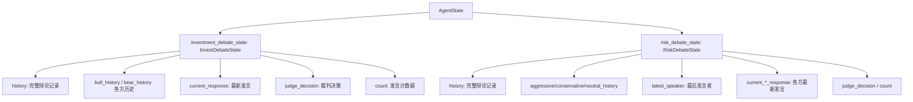
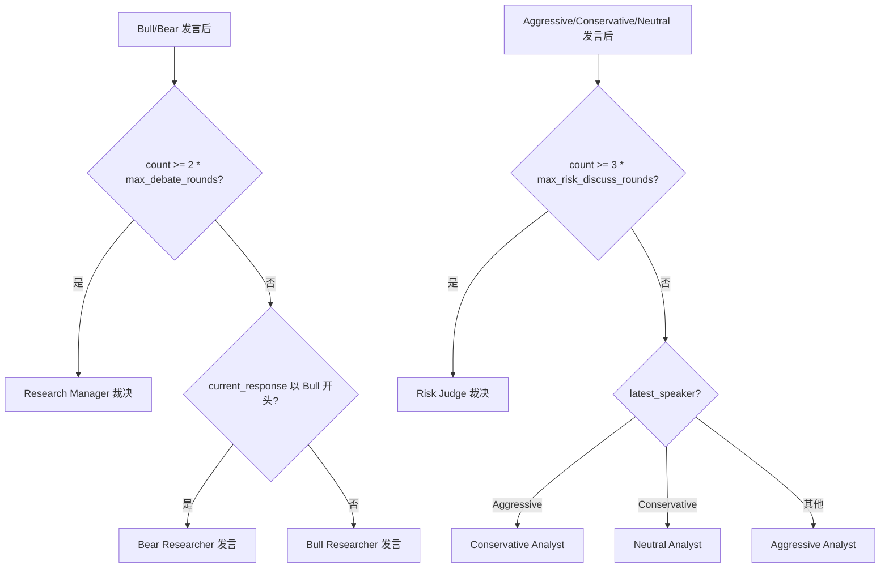
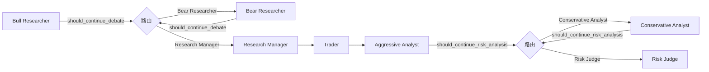

# PD-219.01 TradingAgents — 两层对抗辩论架构

> 文档编号：PD-219.01
> 来源：TradingAgents `tradingagents/graph/setup.py`, `tradingagents/graph/conditional_logic.py`
> GitHub：https://github.com/TauricResearch/TradingAgents.git
> 问题域：PD-219 对抗辩论系统 Adversarial Debate System
> 状态：可复用方案

---

## 第 1 章 问题与动机

### 1.1 核心问题

在 Agent 系统中做高风险决策（投资、诊断、策略选择）时，单一 Agent 容易产生确认偏误（confirmation bias）——它倾向于寻找支持自己初始判断的证据，忽略反面信号。这在金融交易场景尤为致命：一个过度乐观的 Agent 可能忽视市场风险，一个过度保守的 Agent 可能错过关键机会。

核心挑战：
- **单视角盲区**：单个 LLM 调用难以同时产出正反两面的深度分析
- **决策质量不可控**：没有对抗机制时，LLM 的输出质量完全依赖 prompt 工程
- **风险评估维度不足**：投资决策需要同时考虑收益潜力和风险敞口，单一角色难以兼顾
- **历史经验无法复用**：过去的决策失误没有反馈回辩论过程

### 1.2 TradingAgents 的解法概述

TradingAgents 实现了一个**两层串行辩论架构**，将决策过程拆分为投资辩论和风险辩论两个独立阶段：

1. **投资辩论层（Bull vs Bear + Research Manager Judge）**：Bull Analyst 和 Bear Analyst 围绕"是否投资"进行多轮对抗辩论，Research Manager 作为裁判综合双方论点做出 Buy/Sell/Hold 决策（`setup.py:89-97`）
2. **风险辩论层（Aggressive vs Conservative vs Neutral + Risk Judge）**：三方风险分析师围绕 Trader 的投资计划进行多轮辩论，Risk Judge 综合三方意见做出最终交易决策（`setup.py:101-106`）
3. **计数器驱动的轮次控制**：通过 `count` 字段和 `max_debate_rounds` / `max_risk_discuss_rounds` 配置控制辩论轮次，投资辩论用 `2 * max_rounds`（2 方），风险辩论用 `3 * max_rounds`（3 方）（`conditional_logic.py:46-67`）
4. **BM25 记忆注入**：Bull/Bear Researcher 和 Judge 都通过 `FinancialSituationMemory` 检索历史相似情境的反思经验，注入到辩论 prompt 中（`bull_researcher.py:19`, `research_manager.py:16`）
5. **LangGraph StateGraph 编排**：整个辩论流程通过 LangGraph 的条件边（conditional edges）实现轮转调度，辩论状态通过 TypedDict 在节点间传递（`setup.py:156-197`）

### 1.3 设计思想

| 设计原则 | 具体实现 | 理由 | 替代方案 |
|----------|----------|------|----------|
| 角色对立 | Bull/Bear 二元对立 + Aggressive/Conservative/Neutral 三元对立 | 强制产出正反论点，消除确认偏误 | 单 Agent 多角度 prompt（质量不稳定） |
| 两层串行 | 先投资辩论→Trader 制定计划→再风险辩论 | 投资方向和风险评估是不同维度的决策 | 单层辩论（维度混淆） |
| 计数器终止 | `count >= N * max_rounds` 硬性终止 | 避免无限辩论循环，成本可控 | LLM 自判收敛（不可靠） |
| 记忆反馈 | BM25 检索历史反思注入 prompt | 从过去错误中学习，避免重复犯错 | 无记忆（每次从零开始） |
| 裁判综合 | Judge 读取完整辩论历史做决策 | 确保最终决策考虑了所有视角 | 投票机制（丢失论证细节） |

---

## 第 2 章 源码实现分析

### 2.1 架构概览

TradingAgents 的辩论系统嵌入在一个更大的 LangGraph StateGraph 中，整体流程为：数据采集 → 投资辩论 → Trader 制定计划 → 风险辩论 → 最终决策。

```
┌─────────────────────────────────────────────────────────────────┐
│                    TradingAgents StateGraph                      │
│                                                                 │
│  ┌──────────┐  ┌──────────┐  ┌──────────┐  ┌──────────────┐   │
│  │ Market   │→│ Social   │→│ News     │→│ Fundamentals │   │
│  │ Analyst  │  │ Analyst  │  │ Analyst  │  │ Analyst      │   │
│  └──────────┘  └──────────┘  └──────────┘  └──────┬───────┘   │
│                                                     │           │
│  ┌──────────────────── 投资辩论层 ──────────────────▼────────┐  │
│  │  ┌──────┐    ┌──────┐    count < 2*max?                  │  │
│  │  │ Bull │←──→│ Bear │←──→ 轮转调度                       │  │
│  │  └──────┘    └──────┘         │ count >= 2*max           │  │
│  │                               ▼                          │  │
│  │                    ┌──────────────────┐                  │  │
│  │                    │ Research Manager │ (Judge)           │  │
│  │                    └────────┬─────────┘                  │  │
│  └─────────────────────────────┼────────────────────────────┘  │
│                                ▼                               │
│                         ┌──────────┐                           │
│                         │  Trader  │ (制定投资计划)             │
│                         └────┬─────┘                           │
│                              ▼                                 │
│  ┌──────────────────── 风险辩论层 ──────────────────────────┐  │
│  │  ┌────────────┐  ┌──────────────┐  ┌─────────┐          │  │
│  │  │ Aggressive │→│ Conservative │→│ Neutral │           │  │
│  │  └────────────┘  └──────────────┘  └─────────┘          │  │
│  │       ↑              count < 3*max? 轮转调度             │  │
│  │       └──────────────────┘                               │  │
│  │                    │ count >= 3*max                       │  │
│  │                    ▼                                     │  │
│  │             ┌─────────────┐                              │  │
│  │             │ Risk Judge  │ → final_trade_decision       │  │
│  │             └─────────────┘                              │  │
│  └──────────────────────────────────────────────────────────┘  │
└─────────────────────────────────────────────────────────────────┘
```

### 2.2 核心实现

#### 2.2.1 辩论状态数据结构

两层辩论各有独立的 TypedDict 状态定义，通过 `AgentState` 嵌套传递。



对应源码 `tradingagents/agents/utils/agent_states.py:11-47`：

```python
class InvestDebateState(TypedDict):
    bull_history: Annotated[str, "Bullish Conversation history"]
    bear_history: Annotated[str, "Bearish Conversation history"]
    history: Annotated[str, "Conversation history"]
    current_response: Annotated[str, "Latest response"]
    judge_decision: Annotated[str, "Final judge decision"]
    count: Annotated[int, "Length of the current conversation"]

class RiskDebateState(TypedDict):
    aggressive_history: Annotated[str, "Aggressive Agent's Conversation history"]
    conservative_history: Annotated[str, "Conservative Agent's Conversation history"]
    neutral_history: Annotated[str, "Neutral Agent's Conversation history"]
    history: Annotated[str, "Conversation history"]
    latest_speaker: Annotated[str, "Analyst that spoke last"]
    current_aggressive_response: Annotated[str, "Latest response by the aggressive analyst"]
    current_conservative_response: Annotated[str, "Latest response by the conservative analyst"]
    current_neutral_response: Annotated[str, "Latest response by the neutral analyst"]
    judge_decision: Annotated[str, "Judge's decision"]
    count: Annotated[int, "Length of the current conversation"]
```

关键设计：`InvestDebateState` 用 `current_response` 单字段（因为 Bull/Bear 交替发言，只需跟踪对方最新论点），而 `RiskDebateState` 用三个 `current_*_response` 字段（因为三方轮转，每方需要看到另外两方的最新论点）。

#### 2.2.2 轮转调度与终止条件



对应源码 `tradingagents/graph/conditional_logic.py:46-67`：

```python
def should_continue_debate(self, state: AgentState) -> str:
    if (
        state["investment_debate_state"]["count"] >= 2 * self.max_debate_rounds
    ):  # 3 rounds of back-and-forth between 2 agents
        return "Research Manager"
    if state["investment_debate_state"]["current_response"].startswith("Bull"):
        return "Bear Researcher"
    return "Bull Researcher"

def should_continue_risk_analysis(self, state: AgentState) -> str:
    if (
        state["risk_debate_state"]["count"] >= 3 * self.max_risk_discuss_rounds
    ):  # 3 rounds of back-and-forth between 3 agents
        return "Risk Judge"
    if state["risk_debate_state"]["latest_speaker"].startswith("Aggressive"):
        return "Conservative Analyst"
    if state["risk_debate_state"]["latest_speaker"].startswith("Conservative"):
        return "Neutral Analyst"
    return "Aggressive Analyst"
```

核心技巧：投资辩论的终止条件是 `count >= 2 * max_rounds`（2 方各说 max_rounds 次），风险辩论是 `count >= 3 * max_rounds`（3 方各说 max_rounds 次）。轮转通过检查 `current_response` 或 `latest_speaker` 的前缀字符串判断上一个发言者身份。

#### 2.2.3 LangGraph 条件边注册



对应源码 `tradingagents/graph/setup.py:156-199`：

```python
workflow.add_conditional_edges(
    "Bull Researcher",
    self.conditional_logic.should_continue_debate,
    {"Bear Researcher": "Bear Researcher", "Research Manager": "Research Manager"},
)
workflow.add_conditional_edges(
    "Bear Researcher",
    self.conditional_logic.should_continue_debate,
    {"Bull Researcher": "Bull Researcher", "Research Manager": "Research Manager"},
)
workflow.add_edge("Research Manager", "Trader")
workflow.add_edge("Trader", "Aggressive Analyst")
workflow.add_conditional_edges(
    "Aggressive Analyst",
    self.conditional_logic.should_continue_risk_analysis,
    {"Conservative Analyst": "Conservative Analyst", "Risk Judge": "Risk Judge"},
)
```

### 2.3 实现细节

**辩论者节点的状态更新模式**：每个辩论者节点遵循相同的模式——读取对方最新论点 + 完整历史 → 构建 prompt → LLM 调用 → 将自己的论点追加到历史 → count + 1。以 Bull Researcher 为例（`bull_researcher.py:6-59`）：

1. 从 `investment_debate_state` 读取 `history`、`current_response`（Bear 的最新论点）
2. 通过 `memory.get_memories()` 检索 2 条历史相似情境的反思经验
3. 构建包含市场数据 + 辩论历史 + 对方论点 + 历史反思的 prompt
4. LLM 调用后，将响应格式化为 `"Bull Analyst: {response.content}"`
5. 返回新的 `investment_debate_state`，`count + 1`

**Risk Judge 的决策输出**（`risk_manager.py:25-44`）：Risk Judge 的 prompt 明确要求输出 Buy/Sell/Hold 决策，并强调"Choose Hold only if strongly justified"，避免 LLM 默认选择中间选项。Judge 还会注入历史反思记忆，prompt 中写道"Use lessons from past_memory_str to address prior misjudgments"。

**反思闭环**（`reflection.py:58-121`）：交易完成后，`Reflector` 对 Bull、Bear、Trader、Invest Judge、Risk Manager 五个角色分别生成反思，存入各自的 `FinancialSituationMemory`。下次辩论时通过 BM25 检索注入，形成"辩论→决策→执行→反思→下次辩论"的闭环。


---

## 第 3 章 迁移指南

### 3.1 迁移清单

**阶段 1：定义辩论状态结构**
- [ ] 定义辩论状态 TypedDict（参考 `InvestDebateState` / `RiskDebateState`）
- [ ] 确定辩论参与方数量（2 方对立 or 3 方多视角）
- [ ] 设计 `count` 计数器和 `latest_speaker` 轮转标记

**阶段 2：实现辩论者节点**
- [ ] 为每个角色创建工厂函数（`create_xxx_debator(llm)`）
- [ ] 每个节点遵循：读取对方论点 → 构建 prompt → LLM 调用 → 更新状态 → count+1
- [ ] 在 prompt 中注入对方最新论点和完整辩论历史

**阶段 3：实现裁判节点**
- [ ] 裁判读取完整辩论历史，输出明确决策
- [ ] prompt 中明确要求"不要默认选择中间选项"
- [ ] 可选：注入历史反思记忆

**阶段 4：实现轮转调度**
- [ ] 实现 `should_continue_debate()` 条件函数
- [ ] 终止条件：`count >= N * max_rounds`（N = 参与方数量）
- [ ] 轮转逻辑：通过 `latest_speaker` 前缀判断下一个发言者

**阶段 5：集成到编排图**
- [ ] 在 LangGraph/LangChain 中注册条件边
- [ ] 配置 `max_debate_rounds` 为可调参数

### 3.2 适配代码模板

以下是一个通用的两方辩论系统模板，可直接复用：

```python
from typing import TypedDict, Annotated
from langgraph.graph import StateGraph, END

# --- Step 1: 辩论状态定义 ---
class DebateState(TypedDict):
    history: Annotated[str, "完整辩论记录"]
    pro_history: Annotated[str, "正方历史"]
    con_history: Annotated[str, "反方历史"]
    current_response: Annotated[str, "最新发言"]
    judge_decision: Annotated[str, "裁判决策"]
    count: Annotated[int, "发言计数"]

# --- Step 2: 辩论者工厂 ---
def create_debator(llm, role: str, stance: str):
    """通用辩论者工厂。role='Pro'|'Con', stance=角色立场描述。"""
    def debator_node(state) -> dict:
        debate = state["debate_state"]
        history = debate.get("history", "")
        opponent_response = debate.get("current_response", "")

        prompt = f"""You are the {role} Analyst. Your stance: {stance}
Debate history: {history}
Opponent's last argument: {opponent_response}
Present your argument, directly engaging with the opponent's points."""

        response = llm.invoke(prompt)
        argument = f"{role} Analyst: {response.content}"

        return {"debate_state": {
            "history": history + "\n" + argument,
            f"{role.lower()}_history": debate.get(f"{role.lower()}_history", "") + "\n" + argument,
            "current_response": argument,
            "count": debate["count"] + 1,
        }}
    return debator_node

# --- Step 3: 裁判工厂 ---
def create_judge(llm):
    def judge_node(state) -> dict:
        debate = state["debate_state"]
        prompt = f"""As the debate judge, evaluate the arguments and make a decisive recommendation.
Debate history: {debate['history']}
You MUST choose a clear stance. Do not default to a neutral position unless strongly justified."""
        response = llm.invoke(prompt)
        return {"debate_state": {**debate, "judge_decision": response.content}}
    return judge_node

# --- Step 4: 轮转调度 ---
def should_continue(state, max_rounds=3) -> str:
    debate = state["debate_state"]
    if debate["count"] >= 2 * max_rounds:
        return "judge"
    if debate["current_response"].startswith("Pro"):
        return "con"
    return "pro"

# --- Step 5: 组装图 ---
def build_debate_graph(llm, max_rounds=3):
    workflow = StateGraph(dict)  # 实际使用时替换为你的 AgentState
    workflow.add_node("pro", create_debator(llm, "Pro", "支持该方案"))
    workflow.add_node("con", create_debator(llm, "Con", "反对该方案"))
    workflow.add_node("judge", create_judge(llm))

    workflow.set_entry_point("pro")
    workflow.add_conditional_edges("pro", lambda s: should_continue(s, max_rounds),
                                   {"con": "con", "judge": "judge"})
    workflow.add_conditional_edges("con", lambda s: should_continue(s, max_rounds),
                                   {"pro": "pro", "judge": "judge"})
    workflow.add_edge("judge", END)
    return workflow.compile()
```

### 3.3 适用场景

| 场景 | 适用度 | 说明 |
|------|--------|------|
| 金融投资决策 | ⭐⭐⭐ | TradingAgents 的原生场景，Bull/Bear 对立天然适配 |
| 技术方案评审 | ⭐⭐⭐ | 正方推荐方案 A vs 反方推荐方案 B + 架构师裁决 |
| 风险评估 | ⭐⭐⭐ | 激进/保守/中立三方评估，与 TradingAgents 风险辩论层同构 |
| 内容审核 | ⭐⭐ | 通过/拒绝两方辩论，但可能过度设计 |
| 简单分类任务 | ⭐ | 辩论开销大，不适合低风险决策 |

---

## 第 4 章 测试用例

```python
import pytest
from unittest.mock import MagicMock, patch
from typing import Any

# --- 测试辩论状态结构 ---
class TestDebateState:
    def test_invest_debate_state_count_increment(self):
        """验证投资辩论计数器正确递增"""
        state = {
            "investment_debate_state": {
                "history": "", "bull_history": "", "bear_history": "",
                "current_response": "", "count": 0
            },
            "market_report": "test", "sentiment_report": "test",
            "news_report": "test", "fundamentals_report": "test",
        }
        # 模拟 Bull 发言后 count 应为 1
        mock_llm = MagicMock()
        mock_llm.invoke.return_value = MagicMock(content="bullish argument")
        mock_memory = MagicMock()
        mock_memory.get_memories.return_value = []

        from tradingagents.agents.researchers.bull_researcher import create_bull_researcher
        bull_node = create_bull_researcher(mock_llm, mock_memory)
        result = bull_node(state)
        assert result["investment_debate_state"]["count"] == 1
        assert result["investment_debate_state"]["current_response"].startswith("Bull Analyst:")

    def test_risk_debate_state_speaker_tracking(self):
        """验证风险辩论的发言者追踪"""
        state = {
            "risk_debate_state": {
                "history": "", "aggressive_history": "", "conservative_history": "",
                "neutral_history": "", "latest_speaker": "",
                "current_aggressive_response": "", "current_conservative_response": "",
                "current_neutral_response": "", "count": 0
            },
            "market_report": "test", "sentiment_report": "test",
            "news_report": "test", "fundamentals_report": "test",
            "trader_investment_plan": "buy AAPL",
        }
        mock_llm = MagicMock()
        mock_llm.invoke.return_value = MagicMock(content="aggressive argument")

        from tradingagents.agents.risk_mgmt.aggressive_debator import create_aggressive_debator
        aggressive_node = create_aggressive_debator(mock_llm)
        result = aggressive_node(state)
        assert result["risk_debate_state"]["latest_speaker"] == "Aggressive"
        assert result["risk_debate_state"]["count"] == 1

# --- 测试轮转调度逻辑 ---
class TestConditionalLogic:
    def setup_method(self):
        from tradingagents.graph.conditional_logic import ConditionalLogic
        self.logic = ConditionalLogic(max_debate_rounds=2, max_risk_discuss_rounds=2)

    def test_debate_continues_when_under_limit(self):
        """辩论未达上限时应继续"""
        state = {"investment_debate_state": {"count": 1, "current_response": "Bull Analyst: ..."}}
        assert self.logic.should_continue_debate(state) == "Bear Researcher"

    def test_debate_ends_when_at_limit(self):
        """辩论达到上限时应交给裁判"""
        state = {"investment_debate_state": {"count": 4, "current_response": "Bull Analyst: ..."}}
        assert self.logic.should_continue_debate(state) == "Research Manager"

    def test_risk_rotation_order(self):
        """风险辩论轮转顺序：Aggressive → Conservative → Neutral → Aggressive"""
        state_agg = {"risk_debate_state": {"count": 1, "latest_speaker": "Aggressive"}}
        assert self.logic.should_continue_risk_analysis(state_agg) == "Conservative Analyst"

        state_con = {"risk_debate_state": {"count": 2, "latest_speaker": "Conservative"}}
        assert self.logic.should_continue_risk_analysis(state_con) == "Neutral Analyst"

        state_neu = {"risk_debate_state": {"count": 3, "latest_speaker": "Neutral"}}
        assert self.logic.should_continue_risk_analysis(state_neu) == "Aggressive Analyst"

    def test_risk_debate_ends_at_limit(self):
        """风险辩论达到 3*max_rounds 时交给 Risk Judge"""
        state = {"risk_debate_state": {"count": 6, "latest_speaker": "Neutral"}}
        assert self.logic.should_continue_risk_analysis(state) == "Risk Judge"

    def test_debate_round_boundary(self):
        """边界测试：count 恰好等于 2*max 时终止"""
        state = {"investment_debate_state": {"count": 4, "current_response": "Bear Analyst: ..."}}
        assert self.logic.should_continue_debate(state) == "Research Manager"

# --- 测试裁判决策 ---
class TestJudgeDecision:
    def test_risk_judge_outputs_final_decision(self):
        """Risk Judge 应输出 final_trade_decision"""
        mock_llm = MagicMock()
        mock_llm.invoke.return_value = MagicMock(content="Buy AAPL at $150")
        mock_memory = MagicMock()
        mock_memory.get_memories.return_value = []

        from tradingagents.agents.managers.risk_manager import create_risk_manager
        judge = create_risk_manager(mock_llm, mock_memory)

        state = {
            "company_of_interest": "AAPL",
            "risk_debate_state": {
                "history": "debate...", "aggressive_history": "", "conservative_history": "",
                "neutral_history": "", "current_aggressive_response": "",
                "current_conservative_response": "", "current_neutral_response": "", "count": 6,
            },
            "market_report": "", "news_report": "", "fundamentals_report": "",
            "sentiment_report": "", "investment_plan": "buy",
        }
        result = judge(state)
        assert "final_trade_decision" in result
        assert result["risk_debate_state"]["latest_speaker"] == "Judge"
```


---

## 第 5 章 跨域关联

| 关联域 | 关系类型 | 说明 |
|--------|----------|------|
| PD-02 多 Agent 编排 | 依赖 | 辩论系统本质是一种特殊的多 Agent 编排模式，依赖 LangGraph StateGraph 的条件边实现轮转调度 |
| PD-06 记忆持久化 | 协同 | Bull/Bear/Judge 通过 BM25 记忆检索注入历史反思经验，辩论质量依赖记忆系统的召回质量 |
| PD-11 可观测性 | 协同 | 辩论历史（`history` 字段）和裁判决策（`judge_decision`）被完整记录到 JSON 日志，支持事后审计 |
| PD-01 上下文管理 | 依赖 | 多轮辩论会累积大量 token（每轮追加完整论点到 history），需要上下文窗口管理避免超限 |
| PD-03 容错与重试 | 潜在需求 | 当前实现无辩论节点失败重试机制，若某轮 LLM 调用失败整个图会中断 |
| PD-07 质量检查 | 协同 | 辩论机制本身就是一种质量保障手段——通过对抗产出更全面的分析 |

---

## 第 6 章 来源文件索引

| 文件 | 行范围 | 关键实现 |
|------|--------|----------|
| `tradingagents/agents/utils/agent_states.py` | L11-L47 | `InvestDebateState` 和 `RiskDebateState` 类型定义 |
| `tradingagents/agents/utils/agent_states.py` | L50-L77 | `AgentState` 主状态，嵌套两层辩论状态 |
| `tradingagents/agents/researchers/bull_researcher.py` | L6-L59 | Bull Analyst 辩论节点，含 BM25 记忆注入 |
| `tradingagents/agents/researchers/bear_researcher.py` | L6-L61 | Bear Analyst 辩论节点，含 BM25 记忆注入 |
| `tradingagents/agents/risk_mgmt/aggressive_debator.py` | L5-L55 | Aggressive 风险分析师节点 |
| `tradingagents/agents/risk_mgmt/conservative_debator.py` | L6-L58 | Conservative 风险分析师节点 |
| `tradingagents/agents/risk_mgmt/neutral_debator.py` | L5-L55 | Neutral 风险分析师节点 |
| `tradingagents/agents/managers/research_manager.py` | L5-L55 | Research Manager（投资辩论裁判），含记忆注入 |
| `tradingagents/agents/managers/risk_manager.py` | L5-L66 | Risk Judge（风险辩论裁判），输出 final_trade_decision |
| `tradingagents/graph/conditional_logic.py` | L6-L67 | `ConditionalLogic` 类，辩论轮转调度和终止条件 |
| `tradingagents/graph/setup.py` | L40-L202 | `GraphSetup.setup_graph()`，LangGraph 条件边注册 |
| `tradingagents/graph/reflection.py` | L7-L121 | `Reflector` 类，五角色反思闭环 |
| `tradingagents/graph/propagation.py` | L18-L42 | 初始状态创建，辩论状态初始化（count=0） |
| `tradingagents/default_config.py` | L19-L20 | `max_debate_rounds` 和 `max_risk_discuss_rounds` 默认配置 |

---

## 第 7 章 横向对比维度

```json comparison_data
{
  "project": "TradingAgents",
  "dimensions": {
    "辩论拓扑": "两层串行：2方投资辩论 → 3方风险辩论，共5个辩论角色",
    "轮次控制": "计数器硬终止：count >= N*max_rounds，N为参与方数量",
    "裁判机制": "双裁判：Research Manager 裁决投资方向，Risk Judge 裁决最终交易",
    "角色记忆": "BM25 检索历史反思经验注入辩论 prompt，5角色独立记忆池",
    "状态传递": "TypedDict 嵌套状态，history 字符串拼接累积全部辩论记录",
    "轮转调度": "LangGraph conditional_edges + 发言者前缀字符串匹配"
  }
}
```

### 域元数据补充

```json domain_metadata
{
  "solution_summary": "TradingAgents 用两层串行辩论架构（2方投资辩论+3方风险辩论）配合计数器终止和BM25记忆注入，通过双裁判机制产出Buy/Sell/Hold决策",
  "description": "多层级辩论可将方向判断与风险评估解耦为独立决策阶段",
  "sub_problems": [
    "辩论状态的 token 累积与上下文窗口压力",
    "辩论者角色的 prompt 一致性与立场漂移防护",
    "双层辩论间的信息传递与决策衔接"
  ],
  "best_practices": [
    "终止条件用 count >= N*max_rounds 而非 LLM 自判收敛",
    "裁判 prompt 中明确要求不要默认选择中间选项",
    "每个辩论者的输出前缀标记角色名以支持轮转路由",
    "辩论后对每个角色独立反思并存入各自记忆池形成闭环"
  ]
}
```

