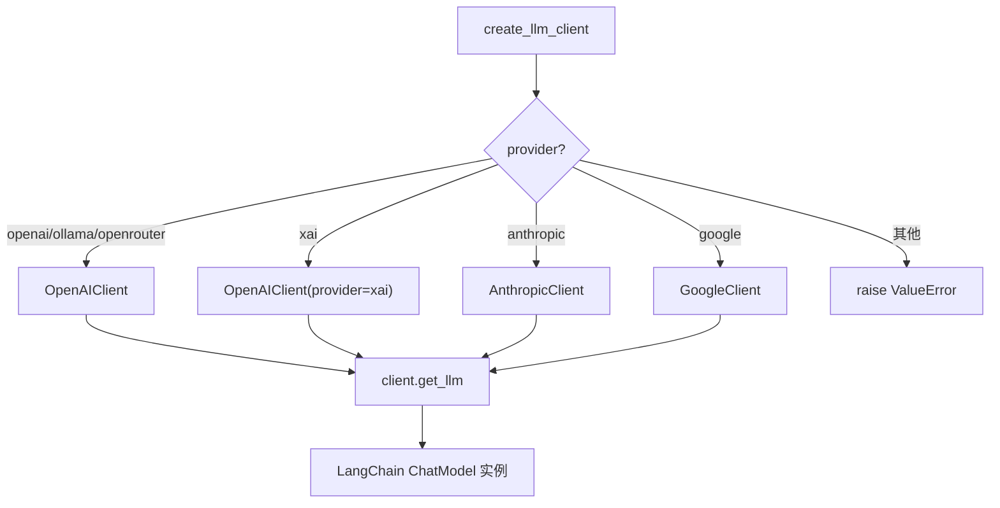
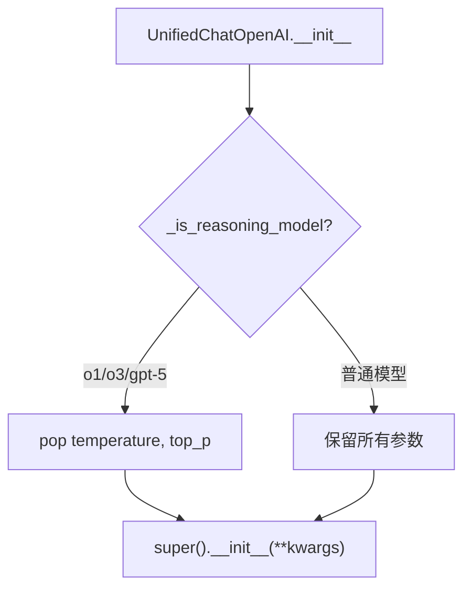
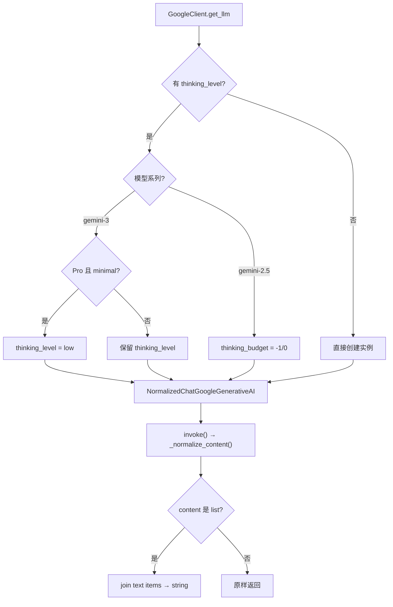

# PD-220.12 TradingAgents — 双层 LLM 与供应商推理参数归一化

> 文档编号：PD-220.12
> 来源：TradingAgents `tradingagents/llm_clients/`
> GitHub：https://github.com/TauricResearch/TradingAgents.git
> 问题域：PD-220 多 LLM Provider 抽象 Multi-LLM Provider Abstraction
> 状态：可复用方案

---

## 第 1 章 问题与动机

### 1.1 核心问题

多 Agent 金融交易系统需要同时调用不同能力等级的 LLM：深度推理模型（如 GPT-5.2、Gemini 3 Pro）用于投资决策辩论，快速模型（如 GPT-5-mini）用于信号处理和反思。不同 LLM 供应商的 API 参数差异巨大——OpenAI 的 reasoning model 不支持 temperature，Gemini 3 的 thinking_level 在 Pro 和 Flash 之间取值范围不同，Gemini 2.5 用 thinking_budget 而非 thinking_level。如果每个 Agent 节点自行处理这些差异，代码会迅速膨胀且难以维护。

### 1.2 TradingAgents 的解法概述

TradingAgents 采用 **BaseLLMClient 抽象基类 + Factory 函数 + Provider 子类继承包装** 三层架构：

1. **抽象基类 `BaseLLMClient`**（`base_client.py:5-21`）定义 `get_llm()` 和 `validate_model()` 两个抽象方法，所有 provider 必须实现
2. **Factory 函数 `create_llm_client()`**（`factory.py:9-43`）根据 provider 字符串路由到对应 Client 类，OpenAI/xAI/Ollama/OpenRouter 共用 `OpenAIClient`
3. **Provider 子类继承包装**：`UnifiedChatOpenAI` 继承 `ChatOpenAI` 自动剥离 reasoning model 不兼容参数（`openai_client.py:10-28`）；`NormalizedChatGoogleGenerativeAI` 继承 `ChatGoogleGenerativeAI` 归一化 Gemini 3 的 list 响应为 string（`google_client.py:9-28`）
4. **白名单模型验证**（`validators.py:7-82`）：四大 provider 各维护有效模型列表，Ollama/OpenRouter 放行所有模型
5. **双层 LLM 配置**（`trading_graph.py:81-95`）：同一 provider 创建 deep_thinking_llm 和 quick_thinking_llm 两个实例

### 1.3 设计思想

| 设计原则 | 具体实现 | 理由 | 替代方案 |
|----------|----------|------|----------|
| 继承包装而非适配器 | `UnifiedChatOpenAI(ChatOpenAI)` 在 `__init__` 中剥离参数 | 最小侵入，不改变 LangChain 原有接口 | Adapter 模式需要额外包装层 |
| Provider 合并复用 | OpenAI/xAI/Ollama/OpenRouter 共用 `OpenAIClient` | 四者都兼容 OpenAI API 格式，只是 base_url 和 api_key 不同 | 每个 provider 独立 Client 类 |
| 白名单验证 + 开放 provider 放行 | Ollama/OpenRouter 返回 `True`，其余查 `VALID_MODELS` 字典 | 本地/聚合 provider 模型名不可穷举 | 全部放行或全部严格校验 |
| 推理参数在 Client 层处理 | `_get_provider_kwargs()` 在 Graph 层收集，Client 层映射 | 上层不需要知道 Gemini thinking_level vs thinking_budget 的区别 | 在 config 中直接写 provider 特有参数 |
| 响应格式归一化 | `NormalizedChatGoogleGenerativeAI._normalize_content()` | Gemini 3 返回 `[{type: text, text: ...}]` 而非 string | 在下游每个消费点做类型判断 |

---

## 第 2 章 源码实现分析

### 2.1 架构概览

```
┌─────────────────────────────────────────────────────────────┐
│                    TradingGraph (消费层)                      │
│  config["llm_provider"] + config["deep_think_llm"]          │
│  config["llm_provider"] + config["quick_think_llm"]         │
│         │                          │                         │
│    _get_provider_kwargs()     _get_provider_kwargs()         │
│         │                          │                         │
│         ▼                          ▼                         │
│  create_llm_client(...)     create_llm_client(...)          │
└─────────┬──────────────────────────┬────────────────────────┘
          │                          │
          ▼                          ▼
┌─────────────────────────────────────────────────────────────┐
│                   Factory 路由层                              │
│  factory.py:create_llm_client()                              │
│                                                              │
│  "openai"|"ollama"|"openrouter" → OpenAIClient               │
│  "xai"                          → OpenAIClient(provider=xai) │
│  "anthropic"                    → AnthropicClient            │
│  "google"                       → GoogleClient               │
└─────────────────────────────────────────────────────────────┘
          │
          ▼
┌─────────────────────────────────────────────────────────────┐
│              Provider Client 层 (BaseLLMClient)              │
│                                                              │
│  OpenAIClient ──→ UnifiedChatOpenAI(ChatOpenAI)              │
│    ├─ openai:  默认 base_url                                 │
│    ├─ xai:     base_url=api.x.ai/v1                         │
│    ├─ ollama:  base_url=localhost:11434/v1, key="ollama"     │
│    └─ openrouter: base_url=openrouter.ai/api/v1             │
│                                                              │
│  AnthropicClient ──→ ChatAnthropic                           │
│                                                              │
│  GoogleClient ──→ NormalizedChatGoogleGenerativeAI           │
│    └─ thinking_level → thinking_level (Gemini3)              │
│    └─ thinking_level → thinking_budget (Gemini2.5)           │
└─────────────────────────────────────────────────────────────┘
          │
          ▼
┌─────────────────────────────────────────────────────────────┐
│              Validators 层                                    │
│  validators.py:VALID_MODELS 白名单字典                        │
│  ollama/openrouter → always True                             │
└─────────────────────────────────────────────────────────────┘
```

### 2.2 核心实现

#### 2.2.1 Factory 路由：provider 字符串到 Client 类的映射



对应源码 `tradingagents/llm_clients/factory.py:9-43`：

```python
def create_llm_client(
    provider: str,
    model: str,
    base_url: Optional[str] = None,
    **kwargs,
) -> BaseLLMClient:
    provider_lower = provider.lower()

    if provider_lower in ("openai", "ollama", "openrouter"):
        return OpenAIClient(model, base_url, provider=provider_lower, **kwargs)

    if provider_lower == "xai":
        return OpenAIClient(model, base_url, provider="xai", **kwargs)

    if provider_lower == "anthropic":
        return AnthropicClient(model, base_url, **kwargs)

    if provider_lower == "google":
        return GoogleClient(model, base_url, **kwargs)

    raise ValueError(f"Unsupported LLM provider: {provider}")
```

关键设计：OpenAI 兼容的四个 provider 共用 `OpenAIClient`，通过 `provider` 参数区分 base_url 和 api_key 来源。这避免了为 xAI、Ollama、OpenRouter 各写一个几乎相同的 Client 类。

#### 2.2.2 Reasoning Model 参数自动剥离



对应源码 `tradingagents/llm_clients/openai_client.py:10-28`：

```python
class UnifiedChatOpenAI(ChatOpenAI):
    """ChatOpenAI subclass that strips incompatible params for certain models."""

    def __init__(self, **kwargs):
        model = kwargs.get("model", "")
        if self._is_reasoning_model(model):
            kwargs.pop("temperature", None)
            kwargs.pop("top_p", None)
        super().__init__(**kwargs)

    @staticmethod
    def _is_reasoning_model(model: str) -> bool:
        model_lower = model.lower()
        return (
            model_lower.startswith("o1")
            or model_lower.startswith("o3")
            or "gpt-5" in model_lower
        )
```

这段代码解决了一个实际痛点：OpenAI 的 o1/o3/GPT-5 系列 reasoning model 不接受 `temperature` 和 `top_p` 参数，传入会报错。通过在 `__init__` 中静默剥离，上层代码无需关心模型是否为 reasoning model。

#### 2.2.3 Gemini 响应归一化与 thinking 参数映射



对应源码 `tradingagents/llm_clients/google_client.py:9-65`：

```python
class NormalizedChatGoogleGenerativeAI(ChatGoogleGenerativeAI):
    def _normalize_content(self, response):
        content = response.content
        if isinstance(content, list):
            texts = [
                item.get("text", "") if isinstance(item, dict) and item.get("type") == "text"
                else item if isinstance(item, str) else ""
                for item in content
            ]
            response.content = "\n".join(t for t in texts if t)
        return response

    def invoke(self, input, config=None, **kwargs):
        return self._normalize_content(super().invoke(input, config, **kwargs))
```

以及 thinking 参数映射（`google_client.py:45-59`）：

```python
thinking_level = self.kwargs.get("thinking_level")
if thinking_level:
    model_lower = self.model.lower()
    if "gemini-3" in model_lower:
        if "pro" in model_lower and thinking_level == "minimal":
            thinking_level = "low"
        llm_kwargs["thinking_level"] = thinking_level
    else:
        llm_kwargs["thinking_budget"] = -1 if thinking_level == "high" else 0
```

### 2.3 实现细节

**双层 LLM 初始化流程**（`trading_graph.py:74-95`）：

TradingGraph 在初始化时创建两个 LLM 实例，共享同一 provider 但使用不同模型：

```python
llm_kwargs = self._get_provider_kwargs()  # 收集 provider 特有参数
if self.callbacks:
    llm_kwargs["callbacks"] = self.callbacks

deep_client = create_llm_client(
    provider=self.config["llm_provider"],
    model=self.config["deep_think_llm"],    # e.g. "gpt-5.2"
    base_url=self.config.get("backend_url"),
    **llm_kwargs,
)
quick_client = create_llm_client(
    provider=self.config["llm_provider"],
    model=self.config["quick_think_llm"],   # e.g. "gpt-5-mini"
    base_url=self.config.get("backend_url"),
    **llm_kwargs,
)

self.deep_thinking_llm = deep_client.get_llm()
self.quick_thinking_llm = quick_client.get_llm()
```

**Provider 特有参数收集**（`trading_graph.py:133-148`）：

```python
def _get_provider_kwargs(self) -> Dict[str, Any]:
    kwargs = {}
    provider = self.config.get("llm_provider", "").lower()
    if provider == "google":
        thinking_level = self.config.get("google_thinking_level")
        if thinking_level:
            kwargs["thinking_level"] = thinking_level
    elif provider == "openai":
        reasoning_effort = self.config.get("openai_reasoning_effort")
        if reasoning_effort:
            kwargs["reasoning_effort"] = reasoning_effort
    return kwargs
```

**白名单验证器**（`validators.py:7-82`）维护四大 provider 的有效模型列表，覆盖 OpenAI GPT-5/4.1/o 系列、Anthropic Claude 4.5/4.x/3.7/3.5 系列、Google Gemini 3/2.5/2.0 系列、xAI Grok 4.1/4 系列。Ollama 和 OpenRouter 作为聚合/本地 provider，模型名不可穷举，直接返回 `True`。

---

## 第 3 章 迁移指南

### 3.1 迁移清单

**阶段 1：基础抽象（1 个文件）**
- [ ] 创建 `BaseLLMClient` 抽象基类，定义 `get_llm()` 和 `validate_model()` 接口
- [ ] 确定你的项目需要支持哪些 provider

**阶段 2：Provider Client 实现（每 provider 1 个文件）**
- [ ] 实现 `OpenAIClient`，处理 OpenAI/xAI/Ollama/OpenRouter 四合一
- [ ] 实现 `AnthropicClient`，透传 LangChain `ChatAnthropic` 参数
- [ ] 实现 `GoogleClient`，处理 thinking_level/thinking_budget 映射
- [ ] 为每个 Client 创建继承包装类处理 provider 特有行为（如参数剥离、响应归一化）

**阶段 3：Factory + Validators**
- [ ] 实现 `create_llm_client()` 工厂函数
- [ ] 创建 `VALID_MODELS` 白名单字典
- [ ] 决定未知 provider 的策略（报错 vs 放行）

**阶段 4：集成**
- [ ] 在业务层通过 config 字典传入 provider + model
- [ ] 用 `_get_provider_kwargs()` 模式收集 provider 特有参数
- [ ] 替换所有直接实例化 `ChatOpenAI`/`ChatAnthropic` 的代码

### 3.2 适配代码模板

以下代码可直接复用，实现最小化的多 Provider 抽象：

```python
"""multi_llm_provider.py — 可直接复用的多 Provider LLM 抽象"""
from abc import ABC, abstractmethod
from typing import Any, Optional, Dict, List

# ── 1. 抽象基类 ──────────────────────────────────────────────
class BaseLLMClient(ABC):
    def __init__(self, model: str, base_url: Optional[str] = None, **kwargs):
        self.model = model
        self.base_url = base_url
        self.kwargs = kwargs

    @abstractmethod
    def get_llm(self) -> Any:
        """返回配置好的 LLM 实例"""
        pass

    @abstractmethod
    def validate_model(self) -> bool:
        """验证模型名是否有效"""
        pass


# ── 2. 模型白名单 ────────────────────────────────────────────
VALID_MODELS: Dict[str, List[str]] = {
    "openai": ["gpt-5.2", "gpt-5", "gpt-5-mini", "gpt-4.1", "o3", "o3-mini"],
    "anthropic": ["claude-opus-4-5", "claude-sonnet-4-5", "claude-haiku-4-5"],
    "google": ["gemini-3-pro-preview", "gemini-3-flash-preview", "gemini-2.5-pro"],
}

def validate_model(provider: str, model: str) -> bool:
    provider_lower = provider.lower()
    if provider_lower not in VALID_MODELS:
        return True  # 未知 provider 放行
    return model in VALID_MODELS[provider_lower]


# ── 3. OpenAI 兼容 Client（含 reasoning model 参数剥离）──────
from langchain_openai import ChatOpenAI

class SafeChatOpenAI(ChatOpenAI):
    """自动剥离 reasoning model 不兼容参数"""
    REASONING_PREFIXES = ("o1", "o3", "o4")
    REASONING_KEYWORDS = ("gpt-5",)

    def __init__(self, **kwargs):
        model = kwargs.get("model", "")
        if self._is_reasoning(model):
            kwargs.pop("temperature", None)
            kwargs.pop("top_p", None)
        super().__init__(**kwargs)

    @classmethod
    def _is_reasoning(cls, model: str) -> bool:
        m = model.lower()
        return any(m.startswith(p) for p in cls.REASONING_PREFIXES) or \
               any(k in m for k in cls.REASONING_KEYWORDS)


class OpenAICompatClient(BaseLLMClient):
    """OpenAI/xAI/Ollama/OpenRouter 四合一 Client"""
    PROVIDER_CONFIG = {
        "xai":        {"base_url": "https://api.x.ai/v1",          "env_key": "XAI_API_KEY"},
        "openrouter": {"base_url": "https://openrouter.ai/api/v1", "env_key": "OPENROUTER_API_KEY"},
        "ollama":     {"base_url": "http://localhost:11434/v1",     "api_key": "ollama"},
    }

    def __init__(self, model: str, base_url: Optional[str] = None,
                 provider: str = "openai", **kwargs):
        super().__init__(model, base_url, **kwargs)
        self.provider = provider.lower()

    def get_llm(self) -> Any:
        import os
        llm_kwargs = {"model": self.model}
        cfg = self.PROVIDER_CONFIG.get(self.provider, {})
        if "base_url" in cfg:
            llm_kwargs["base_url"] = cfg["base_url"]
        if "api_key" in cfg:
            llm_kwargs["api_key"] = cfg["api_key"]
        elif "env_key" in cfg:
            key = os.environ.get(cfg["env_key"])
            if key:
                llm_kwargs["api_key"] = key
        elif self.base_url:
            llm_kwargs["base_url"] = self.base_url
        llm_kwargs.update({k: v for k, v in self.kwargs.items()
                          if k in ("timeout", "max_retries", "reasoning_effort",
                                   "api_key", "callbacks")})
        return SafeChatOpenAI(**llm_kwargs)

    def validate_model(self) -> bool:
        if self.provider in ("ollama", "openrouter"):
            return True
        return validate_model(self.provider, self.model)


# ── 4. Factory ───────────────────────────────────────────────
def create_llm_client(provider: str, model: str,
                      base_url: Optional[str] = None, **kwargs) -> BaseLLMClient:
    p = provider.lower()
    if p in ("openai", "ollama", "openrouter", "xai"):
        return OpenAICompatClient(model, base_url, provider=p, **kwargs)
    # 按需添加 AnthropicClient, GoogleClient
    raise ValueError(f"Unsupported provider: {provider}")
```

### 3.3 适用场景

| 场景 | 适用度 | 说明 |
|------|--------|------|
| 多 Agent 系统需要混用不同 LLM | ⭐⭐⭐ | 核心场景，deep/quick 双层模型 |
| 单 provider 但需要 reasoning model 兼容 | ⭐⭐⭐ | UnifiedChatOpenAI 可独立使用 |
| 需要支持本地 Ollama + 云端 API 切换 | ⭐⭐⭐ | OpenAIClient 四合一设计天然支持 |
| 需要严格的模型名校验 | ⭐⭐ | 白名单需要手动维护，模型更新快 |
| 需要流式响应归一化 | ⭐⭐ | 当前只归一化了 invoke，未覆盖 stream |
| 需要多 provider 负载均衡/failover | ⭐ | 当前架构是单 provider，不支持跨 provider 降级 |

---

## 第 4 章 测试用例

```python
"""test_multi_llm_provider.py — 基于 TradingAgents 真实接口的测试"""
import pytest
from unittest.mock import patch, MagicMock


# ── 测试 Factory 路由 ────────────────────────────────────────
class TestCreateLLMClient:
    """测试 create_llm_client 工厂函数路由逻辑"""

    def test_openai_provider_returns_openai_client(self):
        from tradingagents.llm_clients.factory import create_llm_client
        from tradingagents.llm_clients.openai_client import OpenAIClient
        client = create_llm_client("openai", "gpt-5.2")
        assert isinstance(client, OpenAIClient)
        assert client.provider == "openai"

    def test_xai_provider_returns_openai_client_with_xai(self):
        from tradingagents.llm_clients.factory import create_llm_client
        from tradingagents.llm_clients.openai_client import OpenAIClient
        client = create_llm_client("xai", "grok-4")
        assert isinstance(client, OpenAIClient)
        assert client.provider == "xai"

    def test_ollama_provider_returns_openai_client(self):
        from tradingagents.llm_clients.factory import create_llm_client
        client = create_llm_client("ollama", "llama3")
        assert client.provider == "ollama"

    def test_unsupported_provider_raises(self):
        from tradingagents.llm_clients.factory import create_llm_client
        with pytest.raises(ValueError, match="Unsupported"):
            create_llm_client("cohere", "command-r")

    def test_case_insensitive_provider(self):
        from tradingagents.llm_clients.factory import create_llm_client
        client = create_llm_client("OpenAI", "gpt-5")
        assert client.provider == "openai"


# ── 测试 Reasoning Model 参数剥离 ────────────────────────────
class TestUnifiedChatOpenAI:
    """测试 reasoning model 自动剥离 temperature/top_p"""

    def test_reasoning_model_strips_temperature(self):
        from tradingagents.llm_clients.openai_client import UnifiedChatOpenAI
        assert UnifiedChatOpenAI._is_reasoning_model("o3") is True
        assert UnifiedChatOpenAI._is_reasoning_model("o1-preview") is True
        assert UnifiedChatOpenAI._is_reasoning_model("gpt-5.2") is True

    def test_normal_model_keeps_temperature(self):
        from tradingagents.llm_clients.openai_client import UnifiedChatOpenAI
        assert UnifiedChatOpenAI._is_reasoning_model("gpt-4o") is False
        assert UnifiedChatOpenAI._is_reasoning_model("gpt-4.1-mini") is False


# ── 测试模型验证器 ───────────────────────────────────────────
class TestValidators:
    """测试白名单模型验证"""

    def test_valid_openai_model(self):
        from tradingagents.llm_clients.validators import validate_model
        assert validate_model("openai", "gpt-5.2") is True

    def test_invalid_openai_model(self):
        from tradingagents.llm_clients.validators import validate_model
        assert validate_model("openai", "gpt-3.5-turbo") is False

    def test_ollama_accepts_any_model(self):
        from tradingagents.llm_clients.validators import validate_model
        assert validate_model("ollama", "any-model-name") is True

    def test_openrouter_accepts_any_model(self):
        from tradingagents.llm_clients.validators import validate_model
        assert validate_model("openrouter", "anthropic/claude-3") is True

    def test_unknown_provider_accepts_any(self):
        from tradingagents.llm_clients.validators import validate_model
        assert validate_model("unknown_provider", "any-model") is True


# ── 测试 Gemini 响应归一化 ───────────────────────────────────
class TestGoogleNormalization:
    """测试 Gemini 3 list 响应归一化为 string"""

    def test_list_content_normalized_to_string(self):
        from tradingagents.llm_clients.google_client import NormalizedChatGoogleGenerativeAI
        mock_response = MagicMock()
        mock_response.content = [
            {"type": "text", "text": "Hello"},
            {"type": "text", "text": "World"},
        ]
        client = NormalizedChatGoogleGenerativeAI.__new__(NormalizedChatGoogleGenerativeAI)
        result = client._normalize_content(mock_response)
        assert result.content == "Hello\nWorld"

    def test_string_content_unchanged(self):
        from tradingagents.llm_clients.google_client import NormalizedChatGoogleGenerativeAI
        mock_response = MagicMock()
        mock_response.content = "Already a string"
        client = NormalizedChatGoogleGenerativeAI.__new__(NormalizedChatGoogleGenerativeAI)
        result = client._normalize_content(mock_response)
        assert result.content == "Already a string"
```

---

## 第 5 章 跨域关联

| 关联域 | 关系类型 | 说明 |
|--------|----------|------|
| PD-02 多 Agent 编排 | 依赖 | TradingGraph 的 deep/quick 双层 LLM 直接服务于多 Agent 辩论编排，Bull/Bear/Trader 等角色共享同一 provider 的不同模型实例 |
| PD-03 容错与重试 | 协同 | `max_retries` 参数透传到每个 Client，但当前无跨 provider failover；可扩展为 provider 级降级链 |
| PD-11 可观测性 | 协同 | `callbacks` 参数透传到 LLM 实例，支持 LangChain 的 StatsCallback 统计 token 用量和延迟 |
| PD-12 推理增强 | 依赖 | reasoning_effort（OpenAI）和 thinking_level（Google）直接控制推理深度，是推理增强的底层参数通道 |
| PD-199 数据供应商路由 | 类比 | 与 LLM Provider 路由结构相似——都是 Factory + 白名单验证 + provider 特有参数处理，可共享设计模式 |

---

## 第 6 章 来源文件索引

| 文件 | 行范围 | 关键实现 |
|------|--------|----------|
| `tradingagents/llm_clients/base_client.py` | L1-21 | `BaseLLMClient` 抽象基类，定义 `get_llm()` + `validate_model()` 接口 |
| `tradingagents/llm_clients/factory.py` | L9-43 | `create_llm_client()` 工厂函数，provider 字符串路由 |
| `tradingagents/llm_clients/openai_client.py` | L10-28 | `UnifiedChatOpenAI` reasoning model 参数剥离 |
| `tradingagents/llm_clients/openai_client.py` | L31-72 | `OpenAIClient` 四合一 provider 处理（OpenAI/xAI/Ollama/OpenRouter） |
| `tradingagents/llm_clients/google_client.py` | L9-28 | `NormalizedChatGoogleGenerativeAI` 响应归一化 |
| `tradingagents/llm_clients/google_client.py` | L31-65 | `GoogleClient` thinking_level/thinking_budget 映射 |
| `tradingagents/llm_clients/anthropic_client.py` | L9-27 | `AnthropicClient` 透传 ChatAnthropic |
| `tradingagents/llm_clients/validators.py` | L7-66 | `VALID_MODELS` 白名单字典（4 provider × 多模型） |
| `tradingagents/llm_clients/validators.py` | L69-82 | `validate_model()` 验证函数，Ollama/OpenRouter 放行 |
| `tradingagents/llm_clients/__init__.py` | L1-4 | 模块公开接口：`BaseLLMClient` + `create_llm_client` |
| `tradingagents/graph/trading_graph.py` | L74-95 | 双层 LLM 初始化（deep_thinking + quick_thinking） |
| `tradingagents/graph/trading_graph.py` | L133-148 | `_get_provider_kwargs()` provider 特有参数收集 |
| `tradingagents/default_config.py` | L11-17 | 默认 LLM 配置（provider/model/thinking 参数） |
| `cli/utils.py` | L255-290 | `select_llm_provider()` CLI 交互式 provider 选择 |
| `cli/utils.py` | L293-328 | `ask_openai_reasoning_effort()` / `ask_gemini_thinking_config()` |

---

## 第 7 章 横向对比维度

> 本章用于自动填充 Butcher Wiki 的横向对比表。

```json comparison_data
{
  "project": "TradingAgents",
  "dimensions": {
    "Provider 抽象": "BaseLLMClient ABC + Factory 函数，3 个 Client 类覆盖 6 个 provider",
    "参数归一化": "继承包装模式：UnifiedChatOpenAI 剥离 reasoning 参数，NormalizedChatGoogleGenerativeAI 归一化 list→string",
    "模型验证": "VALID_MODELS 白名单字典，Ollama/OpenRouter 放行，四大 provider 严格校验",
    "推理参数": "双通道：OpenAI reasoning_effort 透传 + Google thinking_level→thinking_budget 自动映射",
    "多模型策略": "双层 LLM：deep_thinking_llm（重模型）+ quick_thinking_llm（轻模型）共享 provider",
    "Provider 合并": "OpenAI/xAI/Ollama/OpenRouter 四合一 OpenAIClient，按 provider 字段切换 base_url"
  }
}
```

### 域元数据补充

```json domain_metadata
{
  "solution_summary": "TradingAgents 用 BaseLLMClient ABC + Factory 路由 + 继承包装模式统一 6 种 LLM 供应商，OpenAI 兼容的 4 个 provider 共用一个 Client 类，自动剥离 reasoning model 不兼容参数并归一化 Gemini 3 响应格式",
  "description": "LLM 供应商间的推理参数语义差异（thinking_level vs thinking_budget vs reasoning_effort）需要在 Client 层自动映射",
  "sub_problems": [
    "OpenAI 兼容 provider 的 base_url/api_key 差异统一",
    "Gemini 跨代模型 thinking 参数语义不同（level vs budget）",
    "双层 LLM 实例共享 provider 配置但使用不同模型"
  ],
  "best_practices": [
    "OpenAI 兼容的多个 provider 合并为一个 Client 类通过 provider 字段区分",
    "继承 LangChain 原生类做包装而非 Adapter 模式减少抽象层",
    "白名单验证对聚合/本地 provider 放行避免维护负担"
  ]
}
```
