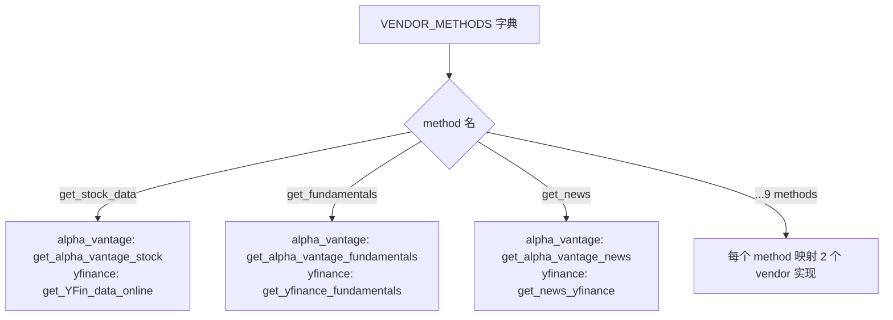
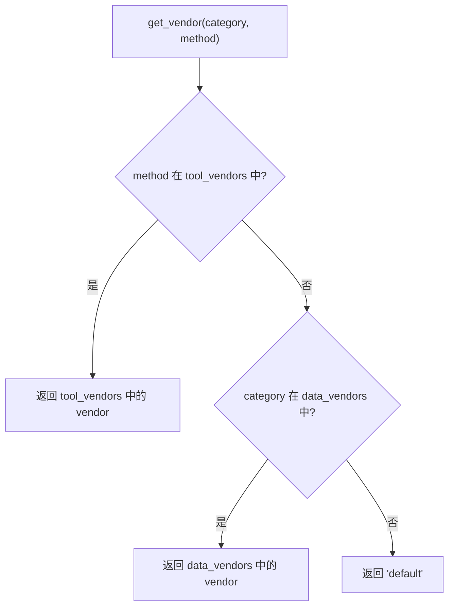
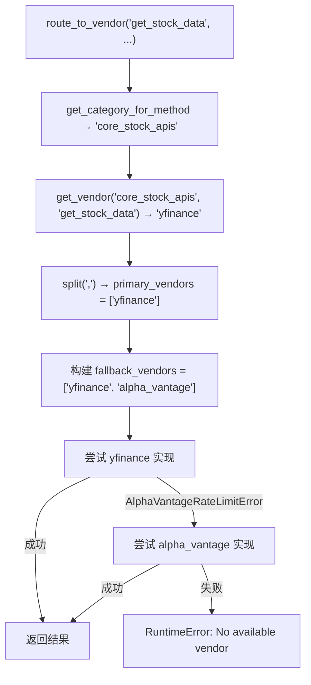

# PD-221.01 TradingAgents — 两级数据源路由与 Rate Limit Fallback

> 文档编号：PD-221.01
> 来源：TradingAgents `tradingagents/dataflows/interface.py`
> GitHub：https://github.com/TauricResearch/TradingAgents.git
> 问题域：PD-221 数据源路由与 Fallback Data Vendor Routing & Fallback
> 状态：可复用方案

---

## 第 1 章 问题与动机

### 1.1 核心问题

金融数据 Agent 系统依赖多个外部数据供应商（Yahoo Finance、Alpha Vantage 等），每个供应商有不同的 API 限制、数据覆盖范围和可靠性特征。核心挑战：

1. **供应商锁定风险** — 硬编码单一数据源导致 API 变更或限流时整个系统不可用
2. **粒度控制需求** — 不同数据类别（行情、基本面、新闻）可能需要不同的最优供应商，甚至同一类别下的不同工具也需要独立配置
3. **Rate Limit 雪崩** — 高频调用触发限流后，如果没有自动切换机制，Agent 的决策流水线会整体阻塞
4. **调用方透明性** — Agent 工具层不应关心底层用的是哪个供应商，路由逻辑需要对上层完全透明

### 1.2 TradingAgents 的解法概述

TradingAgents 在 `tradingagents/dataflows/` 下构建了一套三层数据路由架构：

1. **VENDOR_METHODS 注册表** — 静态字典映射每个方法名到多个 vendor 实现函数（`interface.py:69-110`）
2. **两级配置优先级** — `tool_vendors`（工具级）覆盖 `data_vendors`（类别级），通过 `get_vendor()` 解析（`interface.py:119-132`）
3. **route_to_vendor 路由器** — 统一入口函数，自动构建 fallback 链：优先配置的 vendor → 其余可用 vendor（`interface.py:134-162`）
4. **精确错误过滤** — 只有 `AlphaVantageRateLimitError` 触发 fallback，其他异常直接抛出（`interface.py:159-160`）
5. **全局配置注入** — `TradingAgentsGraph.__init__` 通过 `set_config()` 将用户配置注入 dataflows 模块（`trading_graph.py:66`）

### 1.3 设计思想

| 设计原则 | 具体实现 | 理由 | 替代方案 |
|----------|----------|------|----------|
| 配置驱动路由 | `data_vendors` + `tool_vendors` 两级 dict | 避免硬编码，支持运行时切换 | 环境变量（不够灵活）、数据库配置（过重） |
| 注册表模式 | `VENDOR_METHODS` 静态字典 | 编译时可见所有映射，IDE 可跳转 | 动态注册（运行时发现，调试困难） |
| 精确 fallback | 只捕获 `AlphaVantageRateLimitError` | 避免掩盖真正的 bug（如参数错误） | 捕获所有异常（会隐藏编程错误） |
| 调用方透明 | Agent 工具只调 `route_to_vendor(method, ...)` | 工具层零耦合，新增 vendor 不改工具代码 | 工具层直接 import vendor 函数（紧耦合） |
| 逗号分隔多主 vendor | `vendor_config.split(',')` 支持多优先 vendor | 用户可指定 fallback 顺序 | 只支持单 vendor（灵活性不足） |

---

## 第 2 章 源码实现分析

### 2.1 架构概览

TradingAgents 的数据路由系统由四个层次组成：

```
┌─────────────────────────────────────────────────────────┐
│                   Agent 工具层                            │
│  core_stock_tools.py  fundamental_data_tools.py          │
│  news_data_tools.py   technical_indicators_tools.py      │
│         │                    │                            │
│         └──── route_to_vendor(method, *args) ────────┐   │
├──────────────────────────────────────────────────────┤   │
│                   路由层 (interface.py)               │   │
│  ┌──────────────┐  ┌──────────────┐  ┌────────────┐ │   │
│  │TOOLS_CATEGORIES│ │VENDOR_METHODS│  │get_vendor()│ │   │
│  │ 4 categories  │ │ 9 methods    │  │ 2-level    │ │   │
│  └──────────────┘  └──────────────┘  └────────────┘ │   │
├──────────────────────────────────────────────────────┤   │
│                   配置层 (config.py)                  │   │
│  ┌──────────────────────────────────────────────┐    │   │
│  │ _config: Dict  (module-level singleton)      │    │   │
│  │ get_config() / set_config() / initialize()   │    │   │
│  └──────────────────────────────────────────────┘    │   │
├──────────────────────────────────────────────────────┤   │
│                   Vendor 实现层                       │   │
│  ┌──────────────┐  ┌──────────────────────────────┐  │   │
│  │  y_finance.py │  │  alpha_vantage_*.py (5 files)│  │   │
│  │  yfinance_news│  │  alpha_vantage_common.py     │  │   │
│  └──────────────┘  └──────────────────────────────┘  │   │
└─────────────────────────────────────────────────────────┘
```

### 2.2 核心实现

#### 2.2.1 VENDOR_METHODS 注册表



对应源码 `tradingagents/dataflows/interface.py:69-110`：

```python
VENDOR_METHODS = {
    # core_stock_apis
    "get_stock_data": {
        "alpha_vantage": get_alpha_vantage_stock,
        "yfinance": get_YFin_data_online,
    },
    # technical_indicators
    "get_indicators": {
        "alpha_vantage": get_alpha_vantage_indicator,
        "yfinance": get_stock_stats_indicators_window,
    },
    # fundamental_data
    "get_fundamentals": {
        "alpha_vantage": get_alpha_vantage_fundamentals,
        "yfinance": get_yfinance_fundamentals,
    },
    # ... 共 9 个 method，每个映射 2 个 vendor
}
```

注册表的关键设计：每个 method 名是一个逻辑操作（如 `get_stock_data`），值是 `{vendor_name: impl_function}` 字典。这使得新增 vendor 只需在字典中加一行，不改任何调用方代码。

#### 2.2.2 两级配置优先级解析



对应源码 `tradingagents/dataflows/interface.py:119-132`：

```python
def get_vendor(category: str, method: str = None) -> str:
    """Get the configured vendor for a data category or specific tool method.
    Tool-level configuration takes precedence over category-level.
    """
    config = get_config()

    # Check tool-level configuration first (if method provided)
    if method:
        tool_vendors = config.get("tool_vendors", {})
        if method in tool_vendors:
            return tool_vendors[method]

    # Fall back to category-level configuration
    return config.get("data_vendors", {}).get(category, "default")
```

这实现了经典的"特殊覆盖通用"模式：`tool_vendors["get_stock_data"]` > `data_vendors["core_stock_apis"]` > `"default"`。

#### 2.2.3 route_to_vendor 路由与 Fallback 链



对应源码 `tradingagents/dataflows/interface.py:134-162`：

```python
def route_to_vendor(method: str, *args, **kwargs):
    """Route method calls to appropriate vendor implementation with fallback support."""
    category = get_category_for_method(method)
    vendor_config = get_vendor(category, method)
    primary_vendors = [v.strip() for v in vendor_config.split(',')]

    if method not in VENDOR_METHODS:
        raise ValueError(f"Method '{method}' not supported")

    # Build fallback chain: primary vendors first, then remaining available vendors
    all_available_vendors = list(VENDOR_METHODS[method].keys())
    fallback_vendors = primary_vendors.copy()
    for vendor in all_available_vendors:
        if vendor not in fallback_vendors:
            fallback_vendors.append(vendor)

    for vendor in fallback_vendors:
        if vendor not in VENDOR_METHODS[method]:
            continue

        vendor_impl = VENDOR_METHODS[method][vendor]
        impl_func = vendor_impl[0] if isinstance(vendor_impl, list) else vendor_impl

        try:
            return impl_func(*args, **kwargs)
        except AlphaVantageRateLimitError:
            continue  # Only rate limits trigger fallback

    raise RuntimeError(f"No available vendor for '{method}'")
```

### 2.3 实现细节

**配置单例模式** — `config.py` 使用模块级 `_config` 变量实现单例（`config.py:5`），`get_config()` 返回 `.copy()` 防止外部修改（`config.py:27`）。`TradingAgentsGraph.__init__` 在初始化时通过 `set_config(self.config)` 注入用户配置（`trading_graph.py:66`）。

**Rate Limit 检测** — `alpha_vantage_common.py:75-78` 通过解析 JSON 响应中的 `"Information"` 字段检测限流：

```python
if "Information" in response_json:
    info_message = response_json["Information"]
    if "rate limit" in info_message.lower() or "api key" in info_message.lower():
        raise AlphaVantageRateLimitError(...)
```

Alpha Vantage 的限流不返回 HTTP 429，而是在 200 响应体中嵌入 `Information` 字段，这是该 API 的特殊行为。

**Agent 工具层透明调用** — 所有 4 个工具文件（`core_stock_tools.py`、`fundamental_data_tools.py`、`news_data_tools.py`、`technical_indicators_tools.py`）的模式完全一致：用 `@tool` 装饰器定义 LangChain 工具，内部直接调用 `route_to_vendor(method_name, ...)`。工具层完全不知道底层用的是哪个 vendor。

**数据格式统一** — 两个 vendor 的输出都统一为 CSV 字符串格式。yfinance 通过 `data.to_csv()` 转换（`y_finance.py:40`），Alpha Vantage 直接请求 `datatype=csv`（`alpha_vantage_stock.py:33`）。

---

## 第 3 章 迁移指南

### 3.1 迁移清单

**阶段 1：定义 Vendor 接口与注册表**

- [ ] 定义统一的方法名列表（如 `get_stock_data`、`get_news`）
- [ ] 为每个 vendor 实现统一签名的函数
- [ ] 创建 `VENDOR_METHODS` 注册表字典
- [ ] 定义 `TOOLS_CATEGORIES` 分类映射

**阶段 2：实现配置层**

- [ ] 创建 `DEFAULT_CONFIG` 包含 `data_vendors`（类别级）和 `tool_vendors`（工具级）
- [ ] 实现 `config.py` 的 `get_config()` / `set_config()` 单例
- [ ] 实现 `get_vendor(category, method)` 两级优先级解析

**阶段 3：实现路由器**

- [ ] 实现 `route_to_vendor(method, *args, **kwargs)` 函数
- [ ] 定义 vendor 特定的可重试异常类（如 `RateLimitError`）
- [ ] 实现 fallback 链构建逻辑

**阶段 4：接入工具层**

- [ ] 将现有工具函数改为调用 `route_to_vendor()`
- [ ] 确保工具层不直接 import vendor 实现

### 3.2 适配代码模板

以下是一个可直接复用的通用数据源路由框架：

```python
"""通用数据源路由框架 — 从 TradingAgents 提炼"""
from typing import Dict, Any, Callable, List, Optional

# ---- 1. 可重试异常基类 ----
class VendorRetryableError(Exception):
    """只有此类异常触发 fallback，其他异常直接抛出"""
    pass

class RateLimitError(VendorRetryableError):
    pass

class QuotaExhaustedError(VendorRetryableError):
    pass

# ---- 2. Vendor 注册表 ----
VendorRegistry = Dict[str, Dict[str, Callable]]

def create_registry() -> VendorRegistry:
    """创建空注册表，结构: {method_name: {vendor_name: impl_func}}"""
    return {}

def register_vendor(
    registry: VendorRegistry,
    method: str,
    vendor: str,
    impl: Callable
):
    """注册一个 vendor 实现"""
    if method not in registry:
        registry[method] = {}
    registry[method][vendor] = impl

# ---- 3. 两级配置 ----
_config: Optional[Dict] = None

def set_config(config: Dict):
    global _config
    _config = config.copy()

def get_vendor_for(category: str, method: str, config: Dict) -> str:
    """tool 级 > category 级 > default"""
    tool_vendors = config.get("tool_vendors", {})
    if method in tool_vendors:
        return tool_vendors[method]
    return config.get("data_vendors", {}).get(category, "default")

# ---- 4. 路由器 ----
def route(
    registry: VendorRegistry,
    categories: Dict[str, List[str]],
    config: Dict,
    method: str,
    *args, **kwargs
) -> Any:
    """
    路由调用到合适的 vendor，支持 fallback。
    只有 VendorRetryableError 触发切换，其他异常直接抛出。
    """
    # 查找 method 所属 category
    category = None
    for cat, methods in categories.items():
        if method in methods:
            category = cat
            break
    if not category:
        raise ValueError(f"Unknown method: {method}")

    # 解析配置的 vendor（支持逗号分隔多 vendor）
    vendor_str = get_vendor_for(category, method, config)
    primary = [v.strip() for v in vendor_str.split(",")]

    # 构建 fallback 链：配置优先 + 剩余可用
    available = list(registry.get(method, {}).keys())
    chain = primary + [v for v in available if v not in primary]

    for vendor in chain:
        impl = registry.get(method, {}).get(vendor)
        if not impl:
            continue
        try:
            return impl(*args, **kwargs)
        except VendorRetryableError:
            continue

    raise RuntimeError(f"All vendors exhausted for '{method}'")
```

### 3.3 适用场景

| 场景 | 适用度 | 说明 |
|------|--------|------|
| 多数据源金融系统 | ⭐⭐⭐ | 直接适用，TradingAgents 的原始场景 |
| 多 LLM Provider 路由 | ⭐⭐⭐ | 将 vendor 替换为 LLM provider，rate limit 逻辑完全复用 |
| 多搜索引擎聚合 | ⭐⭐ | 适用但需扩展：搜索场景可能需要结果合并而非 fallback |
| 单一 API 多 region | ⭐⭐ | 可用但过度设计：同一 API 不同 region 用简单重试即可 |
| 实时流数据源 | ⭐ | 不适用：流式场景需要连接管理，非请求级路由 |

---

## 第 4 章 测试用例

```python
"""基于 TradingAgents 真实函数签名的测试用例"""
import pytest
from unittest.mock import patch, MagicMock

# ---- 模拟 TradingAgents 的路由结构 ----

class VendorRateLimitError(Exception):
    pass

VENDOR_METHODS = {
    "get_stock_data": {
        "yfinance": lambda sym, s, e: f"yf:{sym}",
        "alpha_vantage": lambda sym, s, e: f"av:{sym}",
    },
    "get_news": {
        "yfinance": lambda t, s, e: f"yf_news:{t}",
        "alpha_vantage": lambda t, s, e: f"av_news:{t}",
    },
}

def get_vendor(category, method, config):
    tool_vendors = config.get("tool_vendors", {})
    if method in tool_vendors:
        return tool_vendors[method]
    return config.get("data_vendors", {}).get(category, "yfinance")

def route_to_vendor(method, config, categories, *args, **kwargs):
    category = None
    for cat, info in categories.items():
        if method in info["tools"]:
            category = cat
            break
    vendor_config = get_vendor(category, method, config)
    primary = [v.strip() for v in vendor_config.split(",")]
    available = list(VENDOR_METHODS[method].keys())
    chain = primary + [v for v in available if v not in primary]

    for vendor in chain:
        impl = VENDOR_METHODS[method].get(vendor)
        if not impl:
            continue
        try:
            return impl(*args, **kwargs)
        except VendorRateLimitError:
            continue
    raise RuntimeError(f"No vendor for {method}")

CATEGORIES = {
    "core_stock_apis": {"tools": ["get_stock_data"]},
    "news_data": {"tools": ["get_news"]},
}

# ---- 测试类 ----

class TestVendorRouting:
    """测试两级配置优先级"""

    def test_category_level_routing(self):
        config = {"data_vendors": {"core_stock_apis": "alpha_vantage"}, "tool_vendors": {}}
        result = route_to_vendor("get_stock_data", config, CATEGORIES, "AAPL", "2024-01-01", "2024-12-31")
        assert result == "av:AAPL"

    def test_tool_level_overrides_category(self):
        config = {
            "data_vendors": {"core_stock_apis": "yfinance"},
            "tool_vendors": {"get_stock_data": "alpha_vantage"},
        }
        result = route_to_vendor("get_stock_data", config, CATEGORIES, "AAPL", "2024-01-01", "2024-12-31")
        assert result == "av:AAPL"

    def test_comma_separated_primary_vendors(self):
        config = {"data_vendors": {"core_stock_apis": "alpha_vantage,yfinance"}, "tool_vendors": {}}
        result = route_to_vendor("get_stock_data", config, CATEGORIES, "TSLA", "2024-01-01", "2024-12-31")
        assert result == "av:TSLA"


class TestFallbackBehavior:
    """测试 fallback 链"""

    def test_rate_limit_triggers_fallback(self):
        original = VENDOR_METHODS["get_stock_data"]["yfinance"]
        VENDOR_METHODS["get_stock_data"]["yfinance"] = lambda *a, **k: (_ for _ in ()).throw(VendorRateLimitError())
        try:
            config = {"data_vendors": {"core_stock_apis": "yfinance"}, "tool_vendors": {}}
            result = route_to_vendor("get_stock_data", config, CATEGORIES, "AAPL", "2024-01-01", "2024-12-31")
            assert result == "av:AAPL"
        finally:
            VENDOR_METHODS["get_stock_data"]["yfinance"] = original

    def test_non_retryable_error_not_caught(self):
        original = VENDOR_METHODS["get_stock_data"]["yfinance"]
        VENDOR_METHODS["get_stock_data"]["yfinance"] = lambda *a, **k: (_ for _ in ()).throw(ValueError("bad param"))
        try:
            config = {"data_vendors": {"core_stock_apis": "yfinance"}, "tool_vendors": {}}
            with pytest.raises(ValueError, match="bad param"):
                route_to_vendor("get_stock_data", config, CATEGORIES, "AAPL", "2024-01-01", "2024-12-31")
        finally:
            VENDOR_METHODS["get_stock_data"]["yfinance"] = original

    def test_all_vendors_exhausted(self):
        orig_yf = VENDOR_METHODS["get_stock_data"]["yfinance"]
        orig_av = VENDOR_METHODS["get_stock_data"]["alpha_vantage"]
        VENDOR_METHODS["get_stock_data"]["yfinance"] = lambda *a, **k: (_ for _ in ()).throw(VendorRateLimitError())
        VENDOR_METHODS["get_stock_data"]["alpha_vantage"] = lambda *a, **k: (_ for _ in ()).throw(VendorRateLimitError())
        try:
            config = {"data_vendors": {"core_stock_apis": "yfinance"}, "tool_vendors": {}}
            with pytest.raises(RuntimeError, match="No vendor"):
                route_to_vendor("get_stock_data", config, CATEGORIES, "AAPL", "2024-01-01", "2024-12-31")
        finally:
            VENDOR_METHODS["get_stock_data"]["yfinance"] = orig_yf
            VENDOR_METHODS["get_stock_data"]["alpha_vantage"] = orig_av
```

---

## 第 5 章 跨域关联

| 关联域 | 关系类型 | 说明 |
|--------|----------|------|
| PD-03 容错与重试 | 协同 | `route_to_vendor` 的 fallback 链本质是容错机制的一种实现，但粒度在 vendor 级而非请求级重试 |
| PD-04 工具系统 | 依赖 | Agent 工具层（`@tool` 装饰器）依赖路由层提供透明的 vendor 切换，工具注册与 vendor 注册是两个独立维度 |
| PD-11 可观测性 | 协同 | 当前实现缺少路由决策的日志记录，生产环境应记录每次 fallback 事件用于监控 vendor 健康度 |
| PD-199 数据供应商路由 | 同域演进 | PD-199 是同项目早期版本的域定义，PD-221 是更完整的分析，覆盖了两级配置和 fallback 链构建细节 |

---

## 第 6 章 来源文件索引

| 文件 | 行范围 | 关键实现 |
|------|--------|----------|
| `tradingagents/dataflows/interface.py` | L31-L61 | `TOOLS_CATEGORIES` 四类工具分组定义 |
| `tradingagents/dataflows/interface.py` | L63-L66 | `VENDOR_LIST` 可用 vendor 列表 |
| `tradingagents/dataflows/interface.py` | L69-L110 | `VENDOR_METHODS` 注册表：9 个方法 × 2 个 vendor |
| `tradingagents/dataflows/interface.py` | L112-L117 | `get_category_for_method()` 反向查找方法所属类别 |
| `tradingagents/dataflows/interface.py` | L119-L132 | `get_vendor()` 两级配置优先级解析 |
| `tradingagents/dataflows/interface.py` | L134-L162 | `route_to_vendor()` 路由器 + fallback 链 |
| `tradingagents/dataflows/config.py` | L1-L31 | 配置单例：`_config` + `get/set/initialize` |
| `tradingagents/default_config.py` | L24-L33 | `data_vendors` + `tool_vendors` 默认配置 |
| `tradingagents/dataflows/alpha_vantage_common.py` | L38-L40 | `AlphaVantageRateLimitError` 异常定义 |
| `tradingagents/dataflows/alpha_vantage_common.py` | L42-L83 | `_make_api_request()` 含 rate limit 检测 |
| `tradingagents/agents/utils/core_stock_tools.py` | L1-L22 | Agent 工具层调用 `route_to_vendor` 示例 |
| `tradingagents/agents/utils/fundamental_data_tools.py` | L1-L77 | 4 个基本面工具的路由调用 |
| `tradingagents/agents/utils/news_data_tools.py` | L1-L53 | 3 个新闻工具的路由调用 |
| `tradingagents/graph/trading_graph.py` | L21,L66 | `set_config()` 配置注入入口 |

---

## 第 7 章 横向对比维度

> 本章用于自动填充 Butcher Wiki 的横向对比表。

```json comparison_data
{
  "project": "TradingAgents",
  "dimensions": {
    "路由架构": "两级配置（category 级 + tool 级覆盖）+ VENDOR_METHODS 静态注册表",
    "Fallback 策略": "配置优先 vendor → 剩余可用 vendor 自动补全链，仅 RateLimitError 触发",
    "配置管理": "模块级 _config 单例，set_config() 运行时注入，支持逗号分隔多主 vendor",
    "Vendor 扩展性": "新增 vendor 只需在 VENDOR_METHODS 字典加一行，工具层零改动",
    "错误分类": "自定义 AlphaVantageRateLimitError，通过响应体 Information 字段检测而非 HTTP 状态码"
  }
}
```

### 域元数据补充

```json domain_metadata
{
  "solution_summary": "TradingAgents 用 VENDOR_METHODS 静态注册表 + get_vendor() 两级配置解析 + route_to_vendor() 自动 fallback 链实现 9 个数据方法在 yfinance/Alpha Vantage 间的透明路由",
  "description": "数据源路由需要在调用方透明性与 fallback 精确性之间取得平衡",
  "sub_problems": [
    "非标准限流检测（HTTP 200 响应体内嵌错误信息）",
    "Vendor 实现函数签名统一与参数适配"
  ],
  "best_practices": [
    "fallback 链自动补全：配置的 vendor 优先，剩余可用 vendor 自动追加",
    "配置返回 .copy() 防止外部修改单例状态"
  ]
}
```
